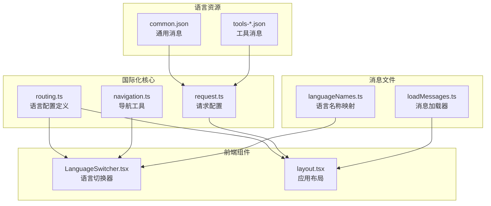
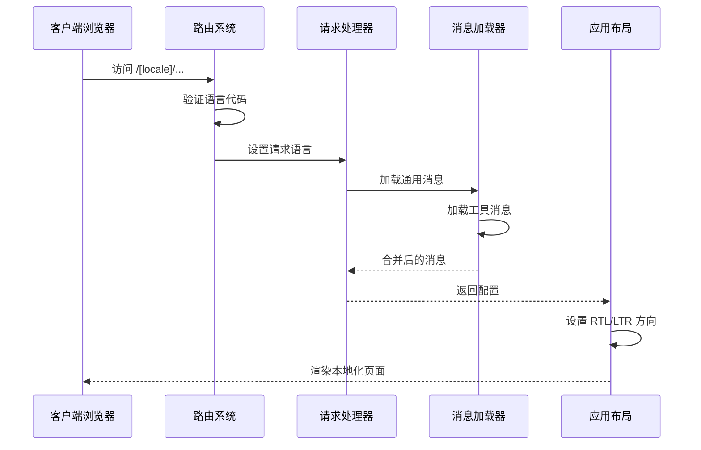
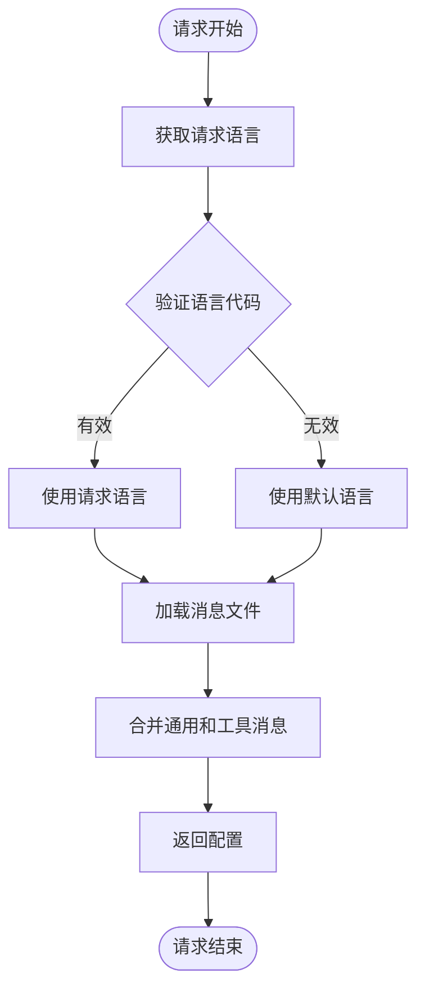
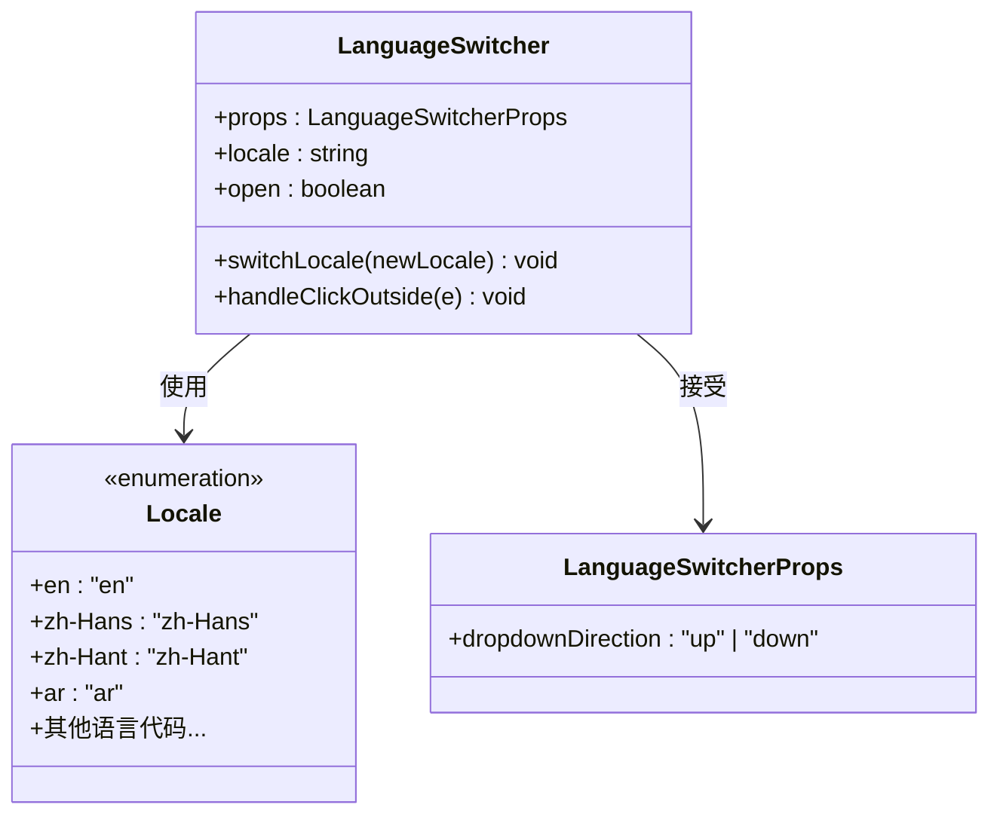
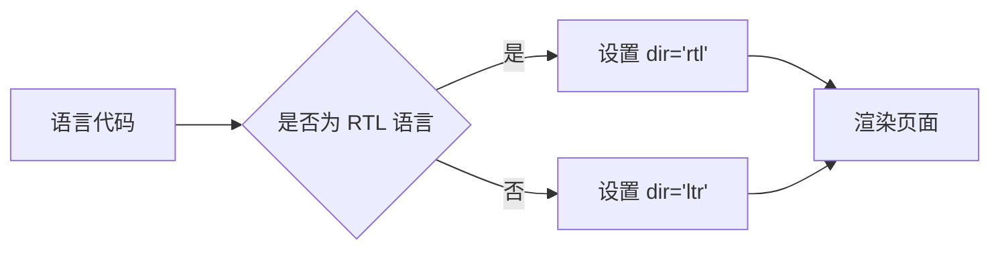
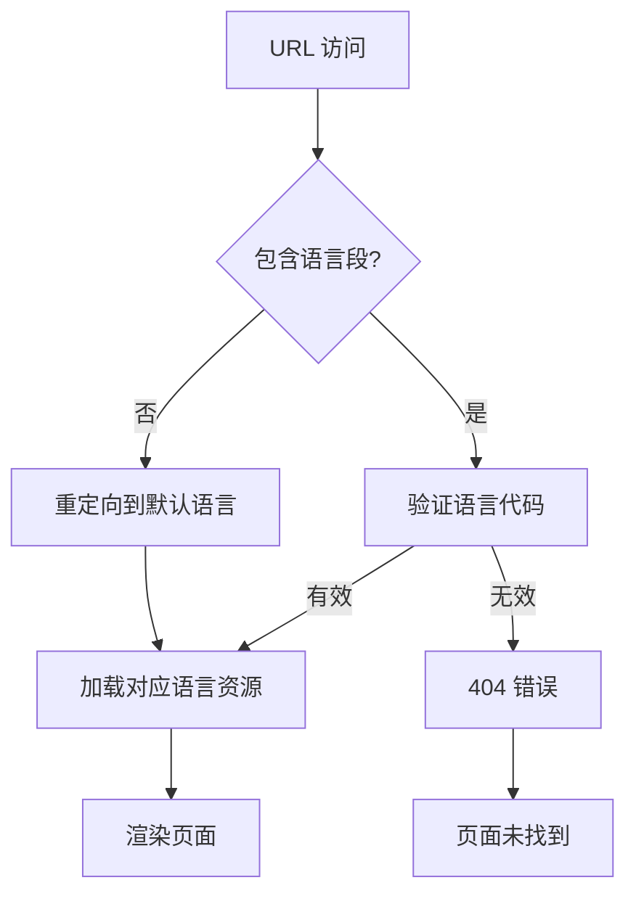
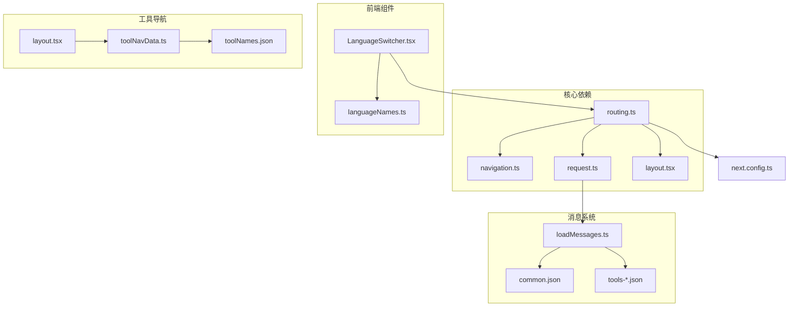
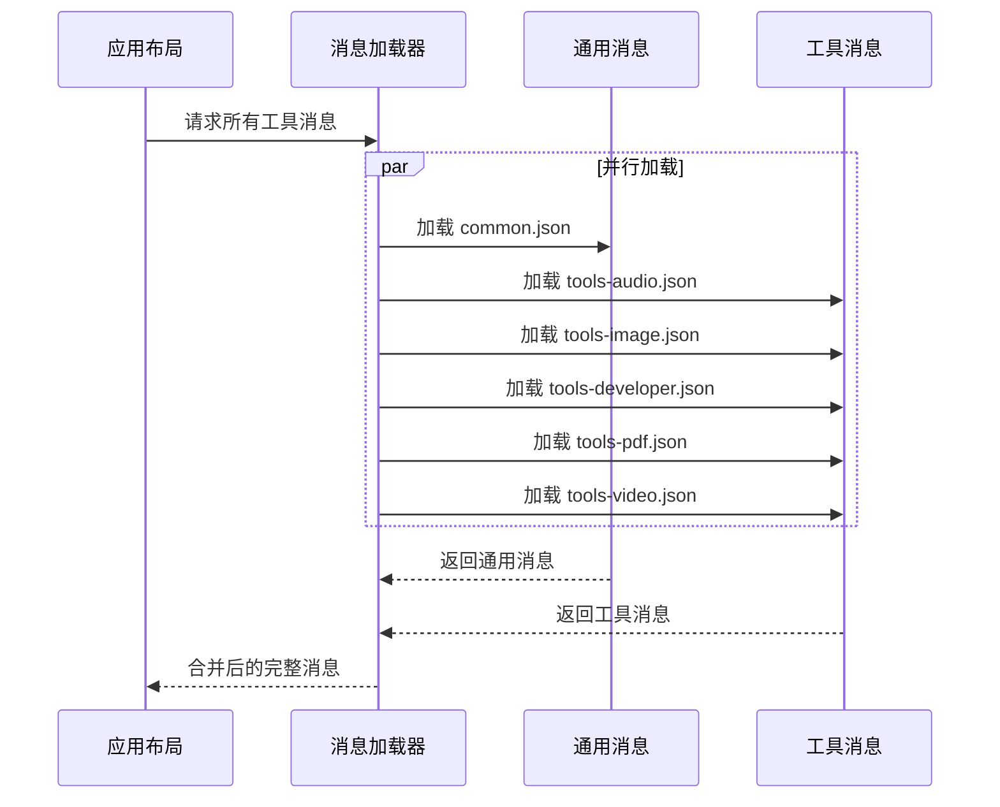

# 语言配置管理

<cite>
**本文档引用的文件**
- [routing.ts](file://src/i18n/routing.ts)
- [navigation.ts](file://src/i18n/navigation.ts)
- [request.ts](file://src/i18n/request.ts)
- [LanguageSwitcher.tsx](file://src/components/shared/LanguageSwitcher.tsx)
- [languageNames.ts](file://src/lib/i18n/languageNames.ts)
- [loadMessages.ts](file://src/lib/i18n/loadMessages.ts)
- [layout.tsx](file://src/app/[locale]/layout.tsx)
- [layout.tsx](file://src/app/layout.tsx)
- [toolNavData.ts](file://src/lib/i18n/toolNavData.ts)
- [common.json](file://messages/en/common.json)
- [tools-audio.json](file://messages/en/tools-audio.json)
- [tools-image.json](file://messages/en/tools-image.json)
- [next.config.ts](file://next.config.ts)
</cite>

## 目录
1. [简介](#简介)
2. [项目结构](#项目结构)
3. [核心组件](#核心组件)
4. [架构概览](#架构概览)
5. [详细组件分析](#详细组件分析)
6. [依赖关系分析](#依赖关系分析)
7. [性能考虑](#性能考虑)
8. [故障排除指南](#故障排除指南)
9. [结论](#结论)

## 简介

PrivaDeck 媒体工具箱采用基于 Next.js International (next-intl) 的国际化系统，支持 18 种语言和地区变体。该系统提供了完整的语言配置管理功能，包括语言检测、类型安全、RTL 语言支持以及动态路由集成。

## 项目结构

语言配置系统主要分布在以下关键位置：



**图表来源**
- [routing.ts:1-18](file://src/i18n/routing.ts#L1-L18)
- [navigation.ts:1-6](file://src/i18n/navigation.ts#L1-L6)
- [request.ts:1-20](file://src/i18n/request.ts#L1-L20)

**章节来源**
- [routing.ts:1-18](file://src/i18n/routing.ts#L1-L18)
- [languageNames.ts:1-26](file://src/lib/i18n/languageNames.ts#L1-L26)

## 核心组件

### 语言配置数组

系统使用 TypeScript 的 `as const` 语法确保语言数组的类型安全：

```typescript
export const locales = [
  "en", "zh-Hans", "zh-Hant", "ja", "ko",
  "es", "fr", "de", "pt-BR", "pt-PT",
  "th", "vi", "id", "hi", "ar",
  "it", "nl", "pl", "ru", "tr", "uk",
] as const;
```

**排序规则**：语言按字母顺序排列，优先展示英语，然后是主要语言，最后是较小语言群体。

**默认语言设置**：`defaultLocale: "en"` 指定英语为默认语言。

**RTL 语言配置**：`rtlLocales: ["ar"]` 明确指定阿拉伯语为从右到左的语言。

**章节来源**
- [routing.ts:3-12](file://src/i18n/routing.ts#L3-L12)

### 类型安全机制

系统通过 TypeScript 的类型推导确保语言配置的类型安全：

```typescript
export type Locale = (typeof locales)[number];
```

这种设计确保：
- 编译时检查语言代码的有效性
- 防止拼写错误的语言代码
- 提供智能提示和自动补全

**章节来源**
- [routing.ts:10-11](file://src/i18n/routing.ts#L10-L11)

## 架构概览



**图表来源**
- [routing.ts:14-17](file://src/i18n/routing.ts#L14-L17)
- [request.ts:6-19](file://src/i18n/request.ts#L6-L19)
- [layout.tsx:32-76](file://src/app/[locale]/layout.tsx#L32-L76)

## 详细组件分析

### 语言检测机制

#### 浏览器语言偏好检测

系统通过 `getRequestConfig` 函数实现智能语言检测：



**图表来源**
- [request.ts:6-19](file://src/i18n/request.ts#L6-L19)

#### 用户手动切换机制

语言切换器组件提供直观的用户界面：



**图表来源**
- [LanguageSwitcher.tsx:11-38](file://src/components/shared/LanguageSwitcher.tsx#L11-L38)
- [routing.ts:10-11](file://src/i18n/routing.ts#L10-L11)

**章节来源**
- [LanguageSwitcher.tsx:15-73](file://src/components/shared/LanguageSwitcher.tsx#L15-L73)

### RTL 语言特殊配置

#### 文本方向处理

系统通过动态设置 `dir` 属性实现 RTL 支持：



**图表来源**
- [layout.tsx](file://src/app/[locale]/layout.tsx#L52)

#### 支持的 RTL 语言

当前系统明确支持的 RTL 语言：
- 阿拉伯语 (`ar`)

**章节来源**
- [routing.ts](file://src/i18n/routing.ts#L12)
- [layout.tsx](file://src/app/[locale]/layout.tsx#L52)

### 语言配置对路由系统的影响

#### 动态路由集成

语言配置与 Next.js 动态路由无缝集成：



**图表来源**
- [layout.tsx:28-43](file://src/app/[locale]/layout.tsx#L28-L43)
- [routing.ts:14-17](file://src/i18n/routing.ts#L14-L17)

**章节来源**
- [layout.tsx:28-43](file://src/app/[locale]/layout.tsx#L28-L43)

### 添加新语言的完整步骤

#### 步骤 1：更新语言配置

在 `routing.ts` 中添加新的语言代码：

```typescript
export const locales = [
  // ... 现有语言
  "new-lang",  // 新增语言代码
] as const;
```

#### 步骤 2：创建语言资源文件

在 `messages/` 目录下创建对应的语言文件夹和 JSON 文件：
- `messages/new-lang/common.json`
- `messages/new-lang/tools-audio.json`
- `messages/new-lang/tools-image.json`
- `messages/new-lang/tools-developer.json`
- `messages/new-lang/tools-pdf.json`
- `messages/new-lang/tools-video.json`

#### 步骤 3：更新语言名称映射

在 `languageNames.ts` 中添加语言名称：

```typescript
export const languageNames: Record<Locale, string> = {
  // ... 现有映射
  "new-lang": "新语言名称",
};
```

#### 步骤 4：处理地区变体

对于地区变体语言（如 `pt-BR`, `pt-PT`, `zh-Hans`, `zh-Hant`），确保：
- 使用标准的 BCP 47 语言标签格式
- 在 `languageNames.ts` 中提供清晰的显示名称
- 为每个地区变体创建独立的消息文件

**章节来源**
- [routing.ts:3-8](file://src/i18n/routing.ts#L3-L8)
- [languageNames.ts:3-25](file://src/lib/i18n/languageNames.ts#L3-L25)

## 依赖关系分析



**图表来源**
- [routing.ts:1-18](file://src/i18n/routing.ts#L1-L18)
- [navigation.ts:1-6](file://src/i18n/navigation.ts#L1-L6)
- [request.ts:1-20](file://src/i18n/request.ts#L1-L20)

**章节来源**
- [routing.ts:1-18](file://src/i18n/routing.ts#L1-L18)
- [navigation.ts:1-6](file://src/i18n/navigation.ts#L1-L6)

## 性能考虑

### 消息加载优化

系统采用异步消息加载策略，通过 `loadAllToolMessages` 函数并行加载多个工具类别的消息：



**图表来源**
- [loadMessages.ts:32-55](file://src/lib/i18n/loadMessages.ts#L32-L55)

### 预渲染优化

由于使用静态导出配置，所有语言版本都会被预渲染：

**章节来源**
- [next.config.ts](file://next.config.ts#L7)
- [layout.tsx:28-30](file://src/app/[locale]/layout.tsx#L28-L30)

## 故障排除指南

### 常见问题及解决方案

#### 语言代码无效

**问题**：访问不存在的语言代码导致 404 错误

**解决方案**：
1. 检查 `routing.ts` 中的语言数组
2. 确保语言代码符合 BCP 47 标准
3. 验证对应的 `messages/` 目录是否存在

#### 消息文件缺失

**问题**：页面显示英文或空白内容

**解决方案**：
1. 检查对应语言的消息文件是否完整
2. 确保 `common.json` 和所有 `tools-*.json` 文件存在
3. 验证 JSON 格式正确性

#### RTL 布局问题

**问题**：阿拉伯语等 RTL 语言显示异常

**解决方案**：
1. 确认 `rtlLocales` 数组中包含相应语言代码
2. 检查 CSS 样式是否支持 RTL 方向
3. 验证文本方向属性正确设置

**章节来源**
- [layout.tsx:41-43](file://src/app/[locale]/layout.tsx#L41-L43)
- [routing.ts](file://src/i18n/routing.ts#L12)

## 结论

PrivaDeck 的语言配置系统通过以下特性实现了强大的国际化支持：

1. **类型安全**：使用 TypeScript 的 `as const` 和类型推导确保语言配置的完整性
2. **灵活扩展**：支持地区变体和自定义语言添加
3. **性能优化**：异步消息加载和并行处理提升用户体验
4. **完整覆盖**：支持 RTL 语言和多语言工具导航
5. **开发友好**：清晰的文件组织和完善的错误处理机制

该系统为 PrivaDeck 提供了可扩展、可维护的国际化基础，能够支持未来更多的语言添加和功能扩展需求。