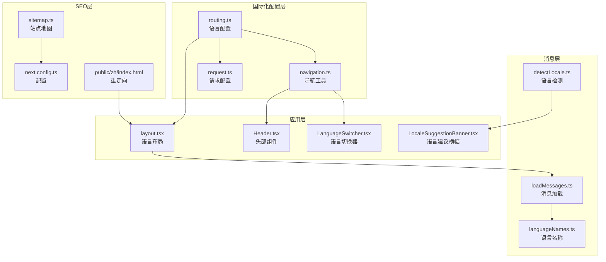
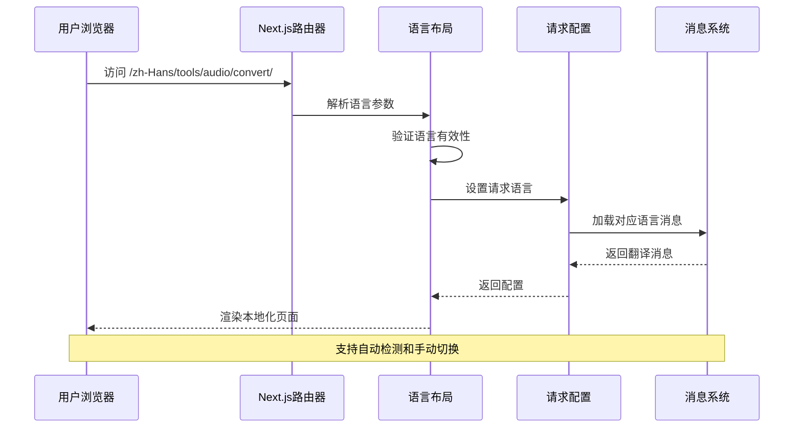
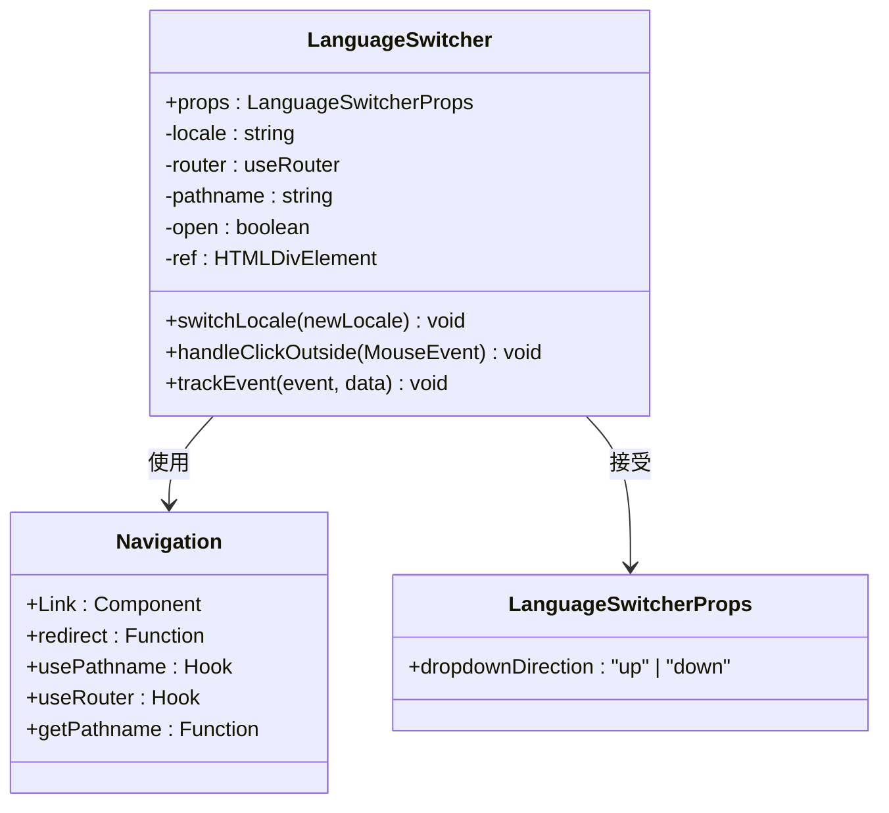
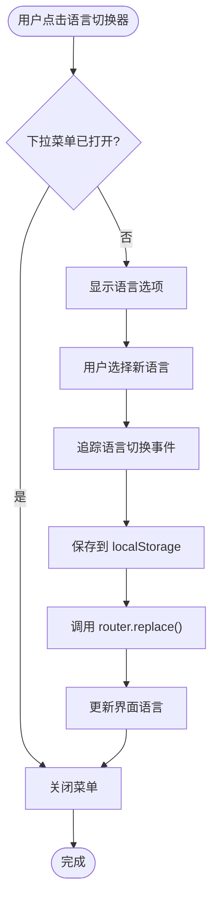
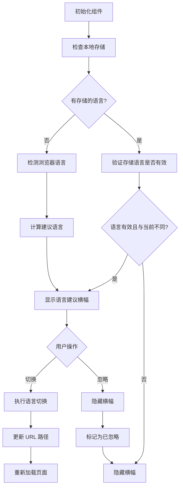
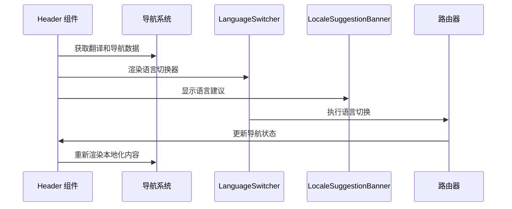
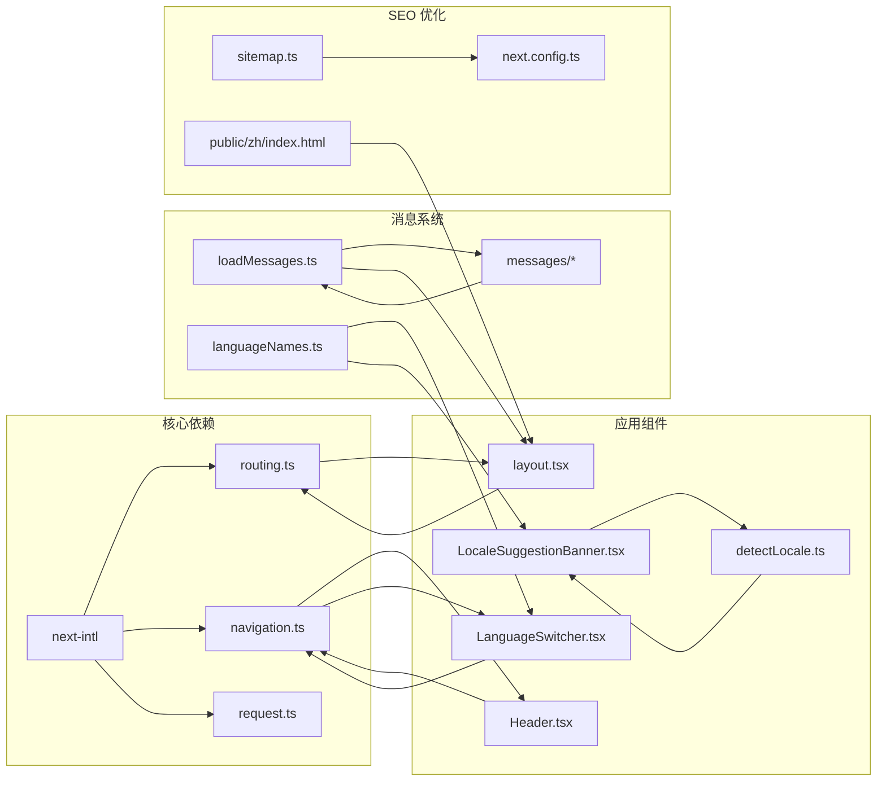

# 路由国际化

<cite>
**本文档引用的文件**
- [routing.ts](file://src/i18n/routing.ts)
- [navigation.ts](file://src/i18n/navigation.ts)
- [request.ts](file://src/i18n/request.ts)
- [LanguageSwitcher.tsx](file://src/components/shared/LanguageSwitcher.tsx)
- [LocaleSuggestionBanner.tsx](file://src/components/shared/LocaleSuggestionBanner.tsx)
- [Header.tsx](file://src/components/layout/Header.tsx)
- [layout.tsx](file://src/app/[locale]/layout.tsx)
- [layout.tsx](file://src/app/layout.tsx)
- [loadMessages.ts](file://src/lib/i18n/loadMessages.ts)
- [languageNames.ts](file://src/lib/i18n/languageNames.ts)
- [detectLocale.ts](file://src/lib/i18n/detectLocale.ts)
- [sitemap.ts](file://src/app/sitemap.ts)
- [next.config.ts](file://next.config.ts)
- [index.html](file://public/zh/index.html)
</cite>

## 目录
1. [简介](#简介)
2. [项目结构](#项目结构)
3. [核心组件](#核心组件)
4. [架构概览](#架构概览)
5. [详细组件分析](#详细组件分析)
6. [依赖关系分析](#依赖关系分析)
7. [性能考虑](#性能考虑)
8. [故障排除指南](#故障排除指南)
9. [结论](#结论)

## 简介

PrivaDeck 媒体工具箱采用基于语言前缀的路由国际化系统，通过 Next.js 的 next-intl 库实现多语言支持。该系统支持 20 种语言和地区变体，包括英语、简体中文、繁体中文、日语、韩语等主要语言，以及阿拉伯语、俄语、土耳其语等其他语言。

系统的核心设计是将语言代码作为 URL 的第一段路径，如 `/en`、`/zh-Hans`、`/zh-Hant` 等，形成清晰的语言前缀路由结构。这种设计确保了搜索引擎友好性和用户可预测性。

## 项目结构

国际化系统围绕以下核心文件组织：



**图表来源**
- [routing.ts:1-18](file://src/i18n/routing.ts#L1-L18)
- [navigation.ts:1-6](file://src/i18n/navigation.ts#L1-L6)
- [request.ts:1-20](file://src/i18n/request.ts#L1-L20)
- [layout.tsx:1-77](file://src/app/[locale]/layout.tsx#L1-L77)

**章节来源**
- [routing.ts:1-18](file://src/i18n/routing.ts#L1-L18)
- [next.config.ts:1-30](file://next.config.ts#L1-L30)

## 核心组件

### 语言配置系统

系统使用统一的语言配置文件定义支持的语言列表和默认设置：

- **支持的语言**: 英语(en)、简体中文(zh-Hans)、繁体中文(zh-Hant)、日语(ja)、韩语(ko)、西班牙语(es)、法语(fr)、德语(de)、葡萄牙语(巴西 pt-BR、葡萄牙 pt-PT)、泰语(th)、越南语(vi)、印尼语(id)、印地语(hi)、阿拉伯语(ar)、意大利语(it)、荷兰语(nl)、波兰语(pl)、俄语(ru)、土耳其语(tr)、乌克兰语(uk)

- **默认语言**: 英语(en)

- **RTL 语言**: 阿拉伯语(ar)，用于从右到左的文本显示

### 导航工具系统

自定义导航工具提供了类型安全的语言切换功能：

- **Link**: 类型安全的路由链接组件
- **redirect**: 服务器端重定向函数
- **usePathname**: 客户端当前路径钩子
- **useRouter**: 客户端路由操作钩子
- **getPathname**: 获取路径名的函数

**章节来源**
- [routing.ts:1-18](file://src/i18n/routing.ts#L1-L18)
- [navigation.ts:1-6](file://src/i18n/navigation.ts#L1-L6)

## 架构概览

国际化系统采用分层架构设计，确保语言检测、路由处理和内容渲染的分离：



**图表来源**
- [layout.tsx:32-77](file://src/app/[locale]/layout.tsx#L32-L77)
- [request.ts:6-19](file://src/i18n/request.ts#L6-L19)

### 路由配置与语言检测

系统实现了多层次的语言检测机制：

1. **URL 语言参数**: 从 URL 路径中提取语言代码
2. **浏览器语言偏好**: 使用 `navigator.languages` 检测用户首选语言
3. **区域匹配**: 支持语言-地区组合的精确匹配
4. **降级策略**: 当无法确定时回退到默认语言

**章节来源**
- [request.ts:6-19](file://src/i18n/request.ts#L6-L19)
- [detectLocale.ts:1-57](file://src/lib/i18n/detectLocale.ts#L1-L57)

## 详细组件分析

### 语言切换器组件

LanguageSwitcher 组件提供了直观的语言切换界面：



**图表来源**
- [LanguageSwitcher.tsx:15-74](file://src/components/shared/LanguageSwitcher.tsx#L15-L74)
- [navigation.ts:4-5](file://src/i18n/navigation.ts#L4-L5)

#### 核心功能特性

- **状态管理**: 使用 React 状态管理下拉菜单的打开/关闭状态
- **事件处理**: 实现点击外部区域关闭的交互逻辑
- **本地存储**: 将用户选择的语言保存到 localStorage
- **分析追踪**: 集成 Google Analytics 事件追踪
- **类型安全**: 完整的 TypeScript 类型定义

#### 交互流程



**图表来源**
- [LanguageSwitcher.tsx:33-38](file://src/components/shared/LanguageSwitcher.tsx#L33-L38)

**章节来源**
- [LanguageSwitcher.tsx:1-74](file://src/components/shared/LanguageSwitcher.tsx#L1-L74)
- [languageNames.ts:1-26](file://src/lib/i18n/languageNames.ts#L1-L26)

### 语言建议横幅

LocaleSuggestionBanner 组件提供了智能的语言建议功能：



**图表来源**
- [LocaleSuggestionBanner.tsx:15-72](file://src/components/shared/LocaleSuggestionBanner.tsx#L15-L72)

#### 智能检测算法

组件实现了复杂的语言检测逻辑：

1. **优先级检查**: 首先检查用户之前的选择
2. **浏览器检测**: 使用 `navigator.languages` 获取浏览器语言偏好
3. **区域特殊处理**: 
   - 中文：根据包含的地区标识符区分简体和繁体
   - 葡萄牙语：默认返回巴西葡萄牙语
4. **降级策略**: 如果所有方法都失败，返回默认语言

**章节来源**
- [LocaleSuggestionBanner.tsx:1-104](file://src/components/shared/LocaleSuggestionBanner.tsx#L1-L104)
- [detectLocale.ts:1-57](file://src/lib/i18n/detectLocale.ts#L1-L57)

### 语言布局系统

语言布局组件负责整个应用的语言环境设置：

```mermaid
classDiagram
class LocaleLayout {
+params : Promise~{locale : string}~
+children : ReactNode
+generateStaticParams() Locale[]
+validateLocale(locale) boolean
+loadMessages(locale) Messages[]
+buildToolNavData(locale) ToolNavItem[]
}
class NextIntlClientProvider {
+messages : Record
+children : ReactNode
}
class MainLayout {
+toolNavData : ToolNavItem[]
+children : ReactNode
}
LocaleLayout --> NextIntlClientProvider : 包装
LocaleLayout --> MainLayout : 渲染
NextIntlClientProvider --> LocaleSuggestionBanner : 提供上下文
```

**图表来源**
- [layout.tsx:32-77](file://src/app/[locale]/layout.tsx#L32-L77)

#### 布局渲染流程

1. **静态参数生成**: 为每个支持的语言生成静态路由参数
2. **语言验证**: 验证传入的语言参数是否有效
3. **消息加载**: 并行加载通用消息和工具导航数据
4. **主题设置**: 根据语言设置 RTL/LTR 方向
5. **客户端提供者**: 包装应用以提供国际化上下文

**章节来源**
- [layout.tsx:1-77](file://src/app/[locale]/layout.tsx#L1-L77)
- [loadMessages.ts:1-56](file://src/lib/i18n/loadMessages.ts#L1-L56)

### 头部导航集成

Header 组件集成了完整的国际化导航功能：



**图表来源**
- [Header.tsx:21-116](file://src/components/layout/Header.tsx#L21-L116)

**章节来源**
- [Header.tsx:1-291](file://src/components/layout/Header.tsx#L1-L291)

## 依赖关系分析

国际化系统的关键依赖关系如下：



**图表来源**
- [routing.ts:1-18](file://src/i18n/routing.ts#L1-L18)
- [navigation.ts:1-6](file://src/i18n/navigation.ts#L1-L6)
- [layout.tsx:1-77](file://src/app/[locale]/layout.tsx#L1-L77)

### 组件耦合度分析

- **低耦合**: 各组件通过明确定义的接口交互
- **高内聚**: 相关功能集中在专门的模块中
- **类型安全**: 完整的 TypeScript 类型定义确保编译时检查
- **可测试性**: 清晰的职责分离便于单元测试

**章节来源**
- [routing.ts:1-18](file://src/i18n/routing.ts#L1-L18)
- [loadMessages.ts:1-56](file://src/lib/i18n/loadMessages.ts#L1-L56)

## 性能考虑

### 静态生成优化

系统采用了多种性能优化策略：

1. **静态导出**: 使用 `output: "export"` 进行静态生成
2. **并行加载**: 消息和导航数据并行加载
3. **缓存策略**: 利用浏览器缓存减少重复请求
4. **代码分割**: 按需加载语言特定的资源

### 内存管理

- **状态清理**: 组件卸载时清理事件监听器
- **存储优化**: 合理使用 localStorage 避免内存泄漏
- **渲染优化**: 使用 React.memo 和 useMemo 优化重渲染

### 加载性能

- **预加载**: 关键资源的预加载策略
- **懒加载**: 非关键资源的延迟加载
- **压缩**: 自动代码压缩和资源优化

## 故障排除指南

### 常见问题及解决方案

#### 语言检测失败

**症状**: 页面始终显示默认语言而非用户期望的语言

**可能原因**:
1. 浏览器语言设置不正确
2. URL 中的语言参数无效
3. 本地存储的数据损坏

**解决步骤**:
1. 检查浏览器语言设置
2. 验证 URL 语言参数格式
3. 清除浏览器缓存和 localStorage

#### 路由跳转异常

**症状**: 语言切换后页面无法正确显示

**解决方法**:
1. 检查路由配置是否正确
2. 验证语言文件是否存在
3. 确认静态参数生成正常

#### SEO 问题

**症状**: 搜索引擎无法正确索引多语言内容

**检查清单**:
1. 站点地图是否包含所有语言版本
2. hreflang 标签是否正确设置
3. canonical 链接是否指向正确的语言版本

**章节来源**
- [sitemap.ts:10-21](file://src/app/sitemap.ts#L10-L21)
- [detectLocale.ts:1-57](file://src/lib/i18n/detectLocale.ts#L1-L57)

### 调试工具

系统提供了多种调试功能：

- **分析事件**: 语言切换的事件追踪
- **错误边界**: 国际化相关的错误处理
- **开发模式**: 详细的错误信息和警告

## 结论

PrivaDeck 媒体工具箱的路由国际化系统展现了现代 Web 应用国际化设计的最佳实践。通过精心设计的分层架构、完善的语言检测机制和用户友好的界面组件，系统实现了高质量的多语言用户体验。

### 主要优势

1. **架构清晰**: 分层设计确保了良好的可维护性
2. **用户体验**: 智能的语言建议和无缝切换
3. **SEO 友好**: 完善的站点地图和 hreflang 支持
4. **性能优化**: 多种性能优化策略确保快速加载
5. **扩展性强**: 模块化设计便于添加新的语言支持

### 技术亮点

- 基于语言前缀的 URL 设计
- 智能的浏览器语言检测算法
- 类型安全的 React 组件实现
- 完善的 SEO 优化策略
- 用户行为分析集成

该系统为其他需要国际化支持的 Web 应用提供了优秀的参考模板，展示了如何在保持技术先进性的同时确保用户体验的卓越性。