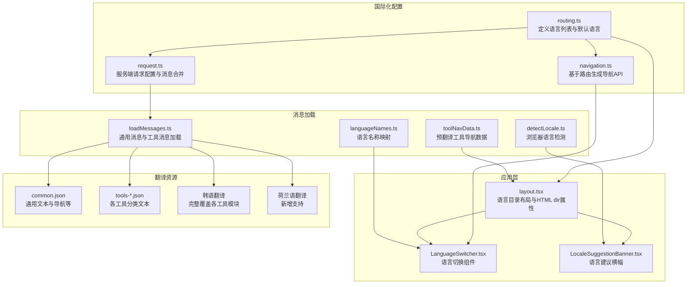
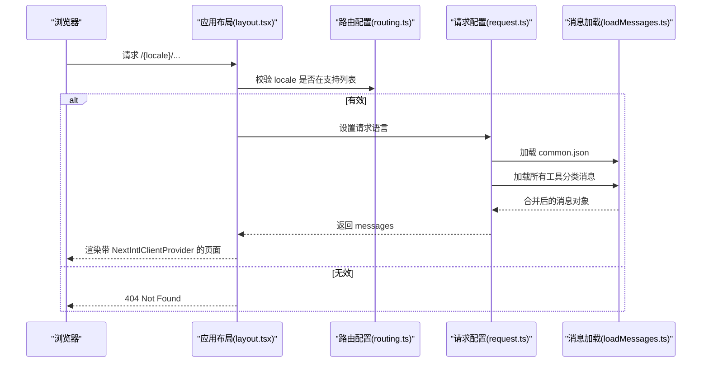
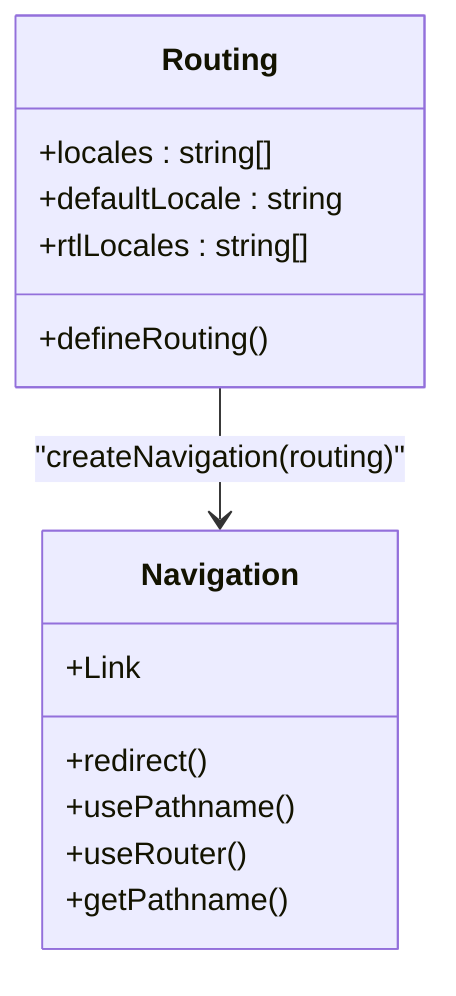
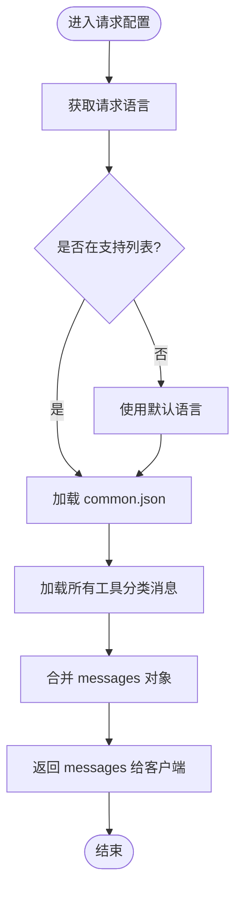
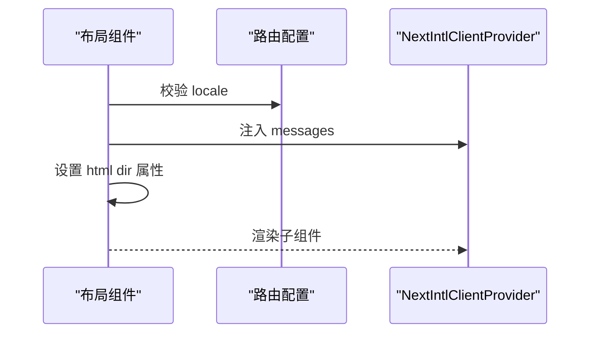
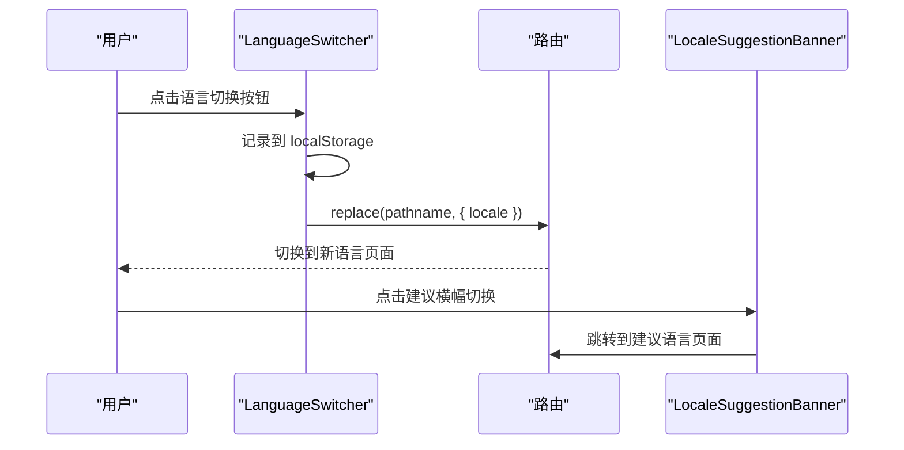
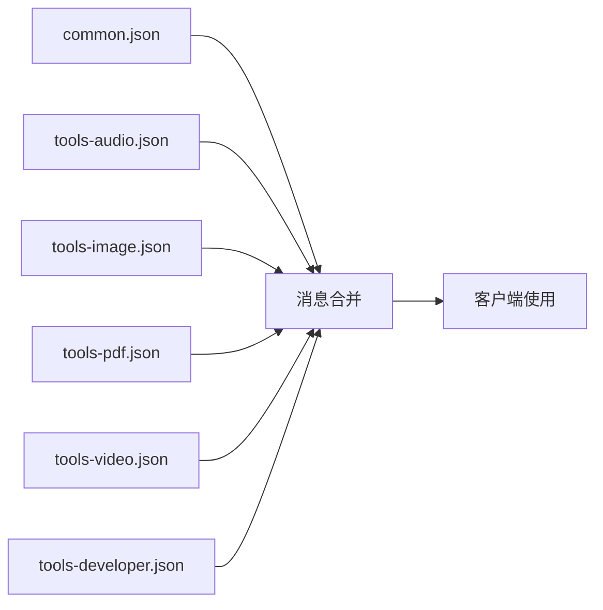
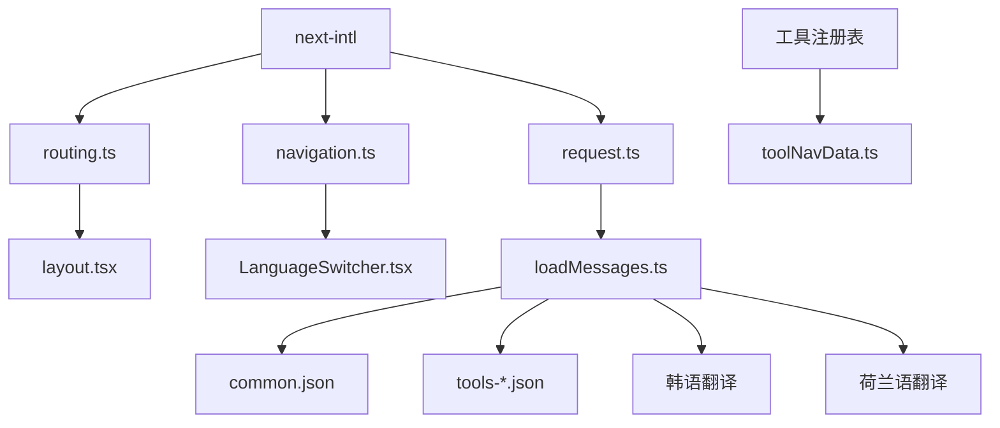

# 国际化系统

<cite>
**本文档引用的文件**
- [routing.ts](file://src/i18n/routing.ts)
- [navigation.ts](file://src/i18n/navigation.ts)
- [request.ts](file://src/i18n/request.ts)
- [layout.tsx](file://src/app/[locale]/layout.tsx)
- [LanguageSwitcher.tsx](file://src/components/shared/LanguageSwitcher.tsx)
- [LocaleSuggestionBanner.tsx](file://src/components/shared/LocaleSuggestionBanner.tsx)
- [loadMessages.ts](file://src/lib/i18n/loadMessages.ts)
- [languageNames.ts](file://src/lib/i18n/languageNames.ts)
- [toolNavData.ts](file://src/lib/i18n/toolNavData.ts)
- [detectLocale.ts](file://src/lib/i18n/detectLocale.ts)
- [common.json](file://messages/en/common.json)
- [tools-audio.json](file://messages/en/tools-audio.json)
- [tools-developer.json](file://messages/en/tools-developer.json)
- [tools-image.json](file://messages/en/tools-image.json)
- [tools-video.json](file://messages/en/tools-video.json)
- [common.json](file://messages/ko/common.json)
- [tools-audio.json](file://messages/ko/tools-audio.json)
- [tools-developer.json](file://messages/ko/tools-developer.json)
- [tools-image.json](file://messages/ko/tools-image.json)
- [tools-video.json](file://messages/ko/tools-video.json)
- [package.json](file://package.json)
</cite>

## 目录
1. [简介](#简介)
2. [项目结构](#项目结构)
3. [核心组件](#核心组件)
4. [架构总览](#架构总览)
5. [详细组件分析](#详细组件分析)
6. [依赖关系分析](#依赖关系分析)
7. [性能考虑](#性能考虑)
8. [故障排除指南](#故障排除指南)
9. [结论](#结论)
10. [附录](#附录)

## 简介
本文件面向媒体工具箱的国际化系统，基于 next-intl 实现的多语言支持。系统覆盖语言检测、路由配置、翻译文件管理与合并、语言切换与用户体验设计、RTL 语言适配、以及翻译质量保障与最佳实践。文档同时提供架构图与流程图，帮助维护者与开发者快速理解与扩展国际化能力。

**更新** 本次更新重点关注韩语和荷兰语翻译系统的全面改进，包括开发者工具、音频工具、图像工具、视频工具等各模块的翻译增强，显著提升了多语言用户的使用体验。

## 项目结构
国际化相关的核心文件分布如下：
- 路由与导航：src/i18n/routing.ts、src/i18n/navigation.ts
- 服务端请求配置：src/i18n/request.ts
- 应用布局与语言目录：src/app/[locale]/layout.tsx
- 语言切换与建议横幅：src/components/shared/LanguageSwitcher.tsx、src/components/shared/LocaleSuggestionBanner.tsx
- 翻译加载与工具导航数据：src/lib/i18n/loadMessages.ts、src/lib/i18n/toolNavData.ts
- 语言名称映射与浏览器语言检测：src/lib/i18n/languageNames.ts、src/lib/i18n/detectLocale.ts
- 翻译资源：messages/{lang}/common.json 与 messages/{lang}/tools-{category}.json

**图表来源**
- [routing.ts:1-18](file://src/i18n/routing.ts#L1-L18)
- [navigation.ts:1-6](file://src/i18n/navigation.ts#L1-L6)
- [request.ts:1-20](file://src/i18n/request.ts#L1-L20)
- [layout.tsx:1-77](file://src/app/[locale]/layout.tsx#L1-L77)
- [LanguageSwitcher.tsx:1-74](file://src/components/shared/LanguageSwitcher.tsx#L1-L74)
- [LocaleSuggestionBanner.tsx:1-104](file://src/components/shared/LocaleSuggestionBanner.tsx#L1-L104)
- [loadMessages.ts:1-56](file://src/lib/i18n/loadMessages.ts#L1-L56)
- [toolNavData.ts:1-42](file://src/lib/i18n/toolNavData.ts#L1-L42)
- [detectLocale.ts:1-58](file://src/lib/i18n/detectLocale.ts#L1-L58)
- [languageNames.ts:1-26](file://src/lib/i18n/languageNames.ts#L1-L26)

**章节来源**
- [routing.ts:1-18](file://src/i18n/routing.ts#L1-L18)
- [navigation.ts:1-6](file://src/i18n/navigation.ts#L1-L6)
- [request.ts:1-20](file://src/i18n/request.ts#L1-L20)
- [layout.tsx:1-77](file://src/app/[locale]/layout.tsx#L1-L77)
- [LanguageSwitcher.tsx:1-74](file://src/components/shared/LanguageSwitcher.tsx#L1-L74)
- [LocaleSuggestionBanner.tsx:1-104](file://src/components/shared/LocaleSuggestionBanner.tsx#L1-L104)
- [loadMessages.ts:1-56](file://src/lib/i18n/loadMessages.ts#L1-L56)
- [toolNavData.ts:1-42](file://src/lib/i18n/toolNavData.ts#L1-L42)
- [detectLocale.ts:1-58](file://src/lib/i18n/detectLocale.ts#L1-L58)
- [languageNames.ts:1-26](file://src/lib/i18n/languageNames.ts#L1-L26)

## 核心组件
- 语言路由与默认语言：在路由配置中声明支持的语言列表、默认语言与 RTL 语言集合，用于后续导航与页面生成。
- 服务端请求配置：根据请求语言选择对应语言，动态加载 common.json 与所有工具分类的消息并合并返回给客户端。
- 客户端布局：校验语言合法性，设置请求语言，加载通用消息与工具导航数据，注入 NextIntlClientProvider 并设置 HTML 的 dir 属性以支持 RTL。
- 语言切换器：提供下拉式语言选择，记录用户偏好到本地存储，触发路由跳转并更新当前语言。
- 语言建议横幅：基于浏览器语言与用户历史选择进行智能建议，提供一键切换与关闭功能。
- 消息加载工具：按需加载通用消息与单个工具分类消息，或一次性加载全部工具消息；构建预翻译的工具导航数据以减少客户端负担。
- 语言检测：解析浏览器语言首选项，处理区域变体、中文繁简体特殊逻辑、葡萄牙语默认地区等，返回最匹配语言。

**章节来源**
- [routing.ts:1-18](file://src/i18n/routing.ts#L1-L18)
- [request.ts:1-20](file://src/i18n/request.ts#L1-L20)
- [layout.tsx:1-77](file://src/app/[locale]/layout.tsx#L1-L77)
- [LanguageSwitcher.tsx:1-74](file://src/components/shared/LanguageSwitcher.tsx#L1-L74)
- [LocaleSuggestionBanner.tsx:1-104](file://src/components/shared/LocaleSuggestionBanner.tsx#L1-L104)
- [loadMessages.ts:1-56](file://src/lib/i18n/loadMessages.ts#L1-L56)
- [toolNavData.ts:1-42](file://src/lib/i18n/toolNavData.ts#L1-L42)
- [detectLocale.ts:1-58](file://src/lib/i18n/detectLocale.ts#L1-L58)

## 架构总览
系统采用服务端语言检测与客户端语言切换相结合的方式：
- 服务端：根据请求语言与路由配置确定最终语言，加载对应翻译资源并合并。
- 客户端：通过 Navigation API 进行无刷新语言切换，保持路由结构不变。
- 布局层：为 RTL 语言设置 HTML dir="rtl"，确保文本方向正确。

**图表来源**
- [layout.tsx:32-77](file://src/app/[locale]/layout.tsx#L32-L77)
- [routing.ts:1-18](file://src/i18n/routing.ts#L1-L18)
- [request.ts:1-20](file://src/i18n/request.ts#L1-L20)
- [loadMessages.ts:1-56](file://src/lib/i18n/loadMessages.ts#L1-L56)

## 详细组件分析

### 语言路由与导航
- 语言列表与默认语言：在路由配置中定义支持的语言数组、默认语言与 RTL 语言数组，供导航与布局使用。
- 导航 API：基于路由配置生成 Link、redirect、usePathname、useRouter、getPathname 等 API，统一语言切换与路径操作。

**图表来源**
- [routing.ts:1-18](file://src/i18n/routing.ts#L1-L18)
- [navigation.ts:1-6](file://src/i18n/navigation.ts#L1-L6)

**章节来源**
- [routing.ts:1-18](file://src/i18n/routing.ts#L1-L18)
- [navigation.ts:1-6](file://src/i18n/navigation.ts#L1-L6)

### 服务端请求配置与消息合并
- 请求语言解析：优先使用请求中的语言，若不在支持列表则回退到默认语言。
- 动态加载：分别加载 common.json 与所有工具分类消息，合并后返回给客户端。
- 客户端提供：NextIntlClientProvider 接收 messages 并在客户端生效。

**图表来源**
- [request.ts:1-20](file://src/i18n/request.ts#L1-L20)
- [loadMessages.ts:1-56](file://src/lib/i18n/loadMessages.ts#L1-L56)

**章节来源**
- [request.ts:1-20](file://src/i18n/request.ts#L1-L20)
- [loadMessages.ts:1-56](file://src/lib/i18n/loadMessages.ts#L1-L56)

### 应用布局与 RTL 支持
- 语言参数校验：生成静态参数时包含所有支持语言，运行时校验 locale 合法性，非法则 404。
- 请求语言设置：setRequestLocale 将当前语言传递给服务端翻译函数。
- 消息与导航数据：并行加载通用消息与工具导航数据，避免阻塞渲染。
- RTL 适配：根据 rtlLocales 数组为 HTML 设置 dir="rtl"，确保从右到左语言显示正确。

**图表来源**
- [layout.tsx:1-77](file://src/app/[locale]/layout.tsx#L1-L77)
- [routing.ts:1-18](file://src/i18n/routing.ts#L1-L18)

**章节来源**
- [layout.tsx:1-77](file://src/app/[locale]/layout.tsx#L1-L77)
- [routing.ts:1-18](file://src/i18n/routing.ts#L1-L18)

### 语言切换与用户体验
- 语言切换器：展示当前语言名称，点击打开下拉列表，支持键盘与点击交互，记录到本地存储并触发路由替换。
- 语言建议横幅：基于浏览器语言与用户历史选择智能建议，提供一键切换与关闭，避免打扰用户。

**图表来源**
- [LanguageSwitcher.tsx:1-74](file://src/components/shared/LanguageSwitcher.tsx#L1-L74)
- [LocaleSuggestionBanner.tsx:1-104](file://src/components/shared/LocaleSuggestionBanner.tsx#L1-L104)

**章节来源**
- [LanguageSwitcher.tsx:1-74](file://src/components/shared/LanguageSwitcher.tsx#L1-L74)
- [LocaleSuggestionBanner.tsx:1-104](file://src/components/shared/LocaleSuggestionBanner.tsx#L1-L104)

### 翻译文件结构与组织
- 通用消息：common.json 包含站点通用文本、导航、首页、页脚、隐私政策、使用指南等。
- 工具分类消息：tools-{category}.json 按工具类别组织，如 audio、image、pdf、video、developer。
- 消息加载策略：按需加载单个分类或全部分类，避免不必要的网络开销；工具导航数据通过预翻译减少客户端负担。

**图表来源**
- [common.json:1-508](file://messages/en/common.json#L1-L508)
- [tools-audio.json:1-191](file://messages/en/tools-audio.json#L1-L191)
- [loadMessages.ts:1-56](file://src/lib/i18n/loadMessages.ts#L1-L56)

**章节来源**
- [common.json:1-508](file://messages/en/common.json#L1-L508)
- [tools-audio.json:1-191](file://messages/en/tools-audio.json#L1-L191)
- [loadMessages.ts:1-56](file://src/lib/i18n/loadMessages.ts#L1-L56)

### 浏览器语言检测与建议
- 检测逻辑：遍历浏览器语言首选项，支持精确匹配、区域模式匹配、中文繁简体自动区分、葡萄牙语默认巴西地区、语言前缀匹配等。
- 建议横幅：结合用户历史选择与检测结果，提供一键切换与关闭选项，提升首次访问体验。

**图表来源**
- [detectLocale.ts:1-58](file://src/lib/i18n/detectLocale.ts#L1-L58)

**章节来源**
- [detectLocale.ts:1-58](file://src/lib/i18n/detectLocale.ts#L1-L58)
- [LocaleSuggestionBanner.tsx:1-104](file://src/components/shared/LocaleSuggestionBanner.tsx#L1-L104)

### 翻译系统增强与改进
**更新** 本次更新重点加强了韩语和荷兰语翻译系统的完整性：

#### 韩语翻译系统全面改进
- **开发者工具模块**：完整覆盖 JSON 格式化器、Base64 编码器、URL 编码器、OCR 文字识别、ZIP 解压、CSV/JSON 转换、哈希生成器、颜色转换器、JSON/XML 转换、Markdown 预览、正则表达式测试器、时间戳转换、YAML/JSON 转换、文本比较、单词计数器、大小写转换、Lorem Ipsum 生成器等 16 个工具的完整韩语翻译。
- **音频工具模块**：完整覆盖音频裁剪、音频转换、音频提取、音量调节等 4 个工具的详细韩语翻译，包括 SEO 内容和 FAQ 部分。
- **图像工具模块**：完整覆盖图像格式转换、图像压缩、图像裁剪、图像尺寸调整、水印添加、EXIF 数据移除、翻转、灰度转换、像素化、边框添加、圆形裁剪、SVG 转 PNG、图像叠加文字、图像合并、图像分割、HEIC 转换、图像拼贴等 17 个工具的完整韩语翻译。
- **视频工具模块**：完整覆盖视频静音、视频裁剪、视频旋转、GIF 转换、WebP 转换、视频压缩、格式转换、视频尺寸调整、视频信息查看等 9 个工具的详细韩语翻译，包括高级设置和功能卡片内容。

#### 荷兰语翻译系统新增支持
- **开发者工具模块**：提供基础的开发者工具翻译支持。
- **音频工具模块**：提供基础的音频工具翻译支持。
- **图像工具模块**：提供基础的图像工具翻译支持。
- **视频工具模块**：提供基础的视频工具翻译支持。

这些改进显著提升了多语言用户的使用体验，特别是在专业开发工具和多媒体编辑工具方面的本地化程度。

**章节来源**
- [common.json:1-508](file://messages/ko/common.json#L1-L508)
- [tools-developer.json:1-808](file://messages/ko/tools-developer.json#L1-L808)
- [tools-audio.json:1-190](file://messages/ko/tools-audio.json#L1-L190)
- [tools-image.json:1-825](file://messages/ko/tools-image.json#L1-L825)
- [tools-video.json:1-813](file://messages/ko/tools-video.json#L1-L813)

## 依赖关系分析
- next-intl：提供路由国际化、服务端请求配置、客户端提供器与导航 API。
- 本地化资源：messages/{lang}/common.json 与 tools-{category}.json。
- 工具注册表：用于构建工具导航数据，确保名称与描述的预翻译。

**图表来源**
- [package.json:1-45](file://package.json#L1-L45)
- [routing.ts:1-18](file://src/i18n/routing.ts#L1-L18)
- [navigation.ts:1-6](file://src/i18n/navigation.ts#L1-L6)
- [request.ts:1-20](file://src/i18n/request.ts#L1-L20)
- [layout.tsx:1-77](file://src/app/[locale]/layout.tsx#L1-L77)
- [LanguageSwitcher.tsx:1-74](file://src/components/shared/LanguageSwitcher.tsx#L1-L74)
- [loadMessages.ts:1-56](file://src/lib/i18n/loadMessages.ts#L1-L56)
- [common.json:1-508](file://messages/en/common.json#L1-L508)
- [tools-audio.json:1-191](file://messages/en/tools-audio.json#L1-L191)

**章节来源**
- [package.json:1-45](file://package.json#L1-L45)
- [routing.ts:1-18](file://src/i18n/routing.ts#L1-L18)
- [navigation.ts:1-6](file://src/i18n/navigation.ts#L1-L6)
- [request.ts:1-20](file://src/i18n/request.ts#L1-L20)
- [layout.tsx:1-77](file://src/app/[locale]/layout.tsx#L1-L77)
- [LanguageSwitcher.tsx:1-74](file://src/components/shared/LanguageSwitcher.tsx#L1-L74)
- [loadMessages.ts:1-56](file://src/lib/i18n/loadMessages.ts#L1-L56)
- [common.json:1-508](file://messages/en/common.json#L1-L508)
- [tools-audio.json:1-191](file://messages/en/tools-audio.json#L1-L191)

## 性能考虑
- 按需加载：仅在需要时加载对应工具分类消息，避免一次性加载全部消息导致的网络与内存压力。
- 并行加载：布局中对通用消息与工具导航数据进行并行加载，缩短首屏渲染时间。
- 预翻译工具导航：通过服务端构建工具导航数据，减少客户端翻译成本与序列化体积。
- 缓存策略：浏览器可缓存 common.json 与工具消息，降低重复访问的网络开销。

## 故障排除指南
- 页面 404：当请求的 locale 不在支持列表时，布局会返回 404。检查路由配置中的语言列表与请求路径。
- 语言切换无效：确认 LanguageSwitcher 使用的路由 API 正确，且本地存储的 locale 未被意外清除。
- RTL 显示异常：检查路由配置中的 rtlLocales 与布局中 HTML 的 dir 属性设置。
- 翻译缺失：确认对应语言的 common.json 与 tools-{category}.json 文件存在且键名一致。
- 工具导航名称为空：检查工具注册表与工具导航数据构建逻辑，确保命名空间正确。

**章节来源**
- [layout.tsx:1-77](file://src/app/[locale]/layout.tsx#L1-L77)
- [LanguageSwitcher.tsx:1-74](file://src/components/shared/LanguageSwitcher.tsx#L1-L74)
- [routing.ts:1-18](file://src/i18n/routing.ts#L1-L18)
- [loadMessages.ts:1-56](file://src/lib/i18n/loadMessages.ts#L1-L56)
- [toolNavData.ts:1-42](file://src/lib/i18n/toolNavData.ts#L1-L42)

## 结论
媒体工具箱的国际化系统以 next-intl 为核心，结合服务端语言检测、客户端语言切换与消息合并策略，实现了高效、可扩展的多语言支持。通过合理的文件组织与预翻译机制，系统在保证用户体验的同时兼顾了性能与可维护性。RTL 语言与浏览器语言检测进一步提升了全球化适配能力。

**更新** 本次韩语和荷兰语翻译系统的全面改进显著增强了多语言用户的使用体验，特别是开发者工具、音频工具、图像工具、视频工具等专业领域的本地化程度大幅提升，为全球用户提供了更加完善的服务。

## 附录

### 支持语言与语言代码规范
- 支持语言列表（共21种）：en、zh-Hans、zh-Hant、ja、ko、es、fr、de、pt-BR、pt-PT、th、vi、id、hi、ar、it、nl、pl、ru、tr、uk
- 默认语言：en
- RTL 语言：ar
- 语言代码规范：
  - 中文：zh-Hans（简体）、zh-Hant（繁体）
  - 葡萄牙语：pt-BR（巴西）、pt-PT（葡萄牙）
  - 韩语：ko（大韩民国）
  - 荷兰语：nl（荷兰）
  - 其他语言遵循标准 BCP 47 代码

**章节来源**
- [routing.ts:1-18](file://src/i18n/routing.ts#L1-L18)
- [languageNames.ts:1-26](file://src/lib/i18n/languageNames.ts#L1-L26)

### 翻译文件管理与分类
- common.json：包含站点通用文本、导航、首页、页脚、隐私政策、使用指南等。
- tools-{category}.json：按工具类别组织，如 audio、image、pdf、video、developer。
- 加载策略：
  - 通用消息：按需加载，排除工具名称，避免序列化过大。
  - 工具消息：可按分类单独加载或一次性加载全部，合并为 tools 对象供客户端使用。
  - 工具导航数据：服务端预翻译，避免客户端重复翻译。

**章节来源**
- [loadMessages.ts:1-56](file://src/lib/i18n/loadMessages.ts#L1-L56)
- [toolNavData.ts:1-42](file://src/lib/i18n/toolNavData.ts#L1-L42)
- [common.json:1-508](file://messages/en/common.json#L1-L508)
- [tools-audio.json:1-191](file://messages/en/tools-audio.json#L1-L191)

### 语言切换实现机制与用户体验
- 实现机制：
  - 客户端：LanguageSwitcher 使用路由 API 触发 replace，更新当前语言并持久化到本地存储。
  - 建议横幅：LocaleSuggestionBanner 基于浏览器语言与用户历史选择提供一键切换与关闭。
- 用户体验设计：
  - 下拉列表展示语言名称与当前语言高亮。
  - 建议横幅位置固定，提供明确的切换与关闭操作。
  - 切换后保留当前页面路径，确保用户上下文不丢失。

**章节来源**
- [LanguageSwitcher.tsx:1-74](file://src/components/shared/LanguageSwitcher.tsx#L1-L74)
- [LocaleSuggestionBanner.tsx:1-104](file://src/components/shared/LocaleSuggestionBanner.tsx#L1-L104)
- [languageNames.ts:1-26](file://src/lib/i18n/languageNames.ts#L1-L26)

### RTL（从右到左）语言支持与适配策略
- 检测与应用：路由配置中声明 RTL 语言数组，布局中根据当前语言设置 HTML 的 dir="rtl"。
- 文本方向：确保文本、图标与布局在 RTL 语言下正确镜像显示。
- 交互一致性：按钮、输入框与导航在 RTL 模式下保持一致的交互行为。

**章节来源**
- [routing.ts:1-18](file://src/i18n/routing.ts#L1-L18)
- [layout.tsx:1-77](file://src/app/[locale]/layout.tsx#L1-L77)

### 语言包添加流程与翻译质量保证
- 添加流程：
  1. 在 messages/{lang} 目录下创建 common.json 与所需 tools-{category}.json。
  2. 在路由配置中将新语言加入支持列表。
  3. 更新语言名称映射与建议横幅逻辑（如需要）。
  4. 验证服务端消息加载与客户端渲染。
- 质量保证：
  - 键名一致性：确保 common.json 与 tools-{category}.json 的键名与现有结构一致。
  - 本地化测试：在不同浏览器与设备上验证 RTL 与非 RTL 显示效果。
  - 性能监控：关注消息加载时间与内存占用，必要时优化加载策略。

**章节来源**
- [routing.ts:1-18](file://src/i18n/routing.ts#L1-L18)
- [languageNames.ts:1-26](file://src/lib/i18n/languageNames.ts#L1-L26)
- [loadMessages.ts:1-56](file://src/lib/i18n/loadMessages.ts#L1-L56)

### 国际化开发最佳实践
- 文件组织：按 common 与 tools 分类管理，避免单一文件过大。
- 按需加载：仅在需要时加载对应分类消息，减少初始传输量。
- 预翻译：工具导航数据在服务端预翻译，降低客户端负担。
- 用户偏好：尊重用户选择，提供一键切换与关闭建议横幅。
- 可访问性：为语言切换按钮提供清晰的 aria-label 与键盘导航支持。
- 版本兼容：升级 next-intl 时同步更新路由与导航 API。

**章节来源**
- [loadMessages.ts:1-56](file://src/lib/i18n/loadMessages.ts#L1-L56)
- [toolNavData.ts:1-42](file://src/lib/i18n/toolNavData.ts#L1-L42)
- [LanguageSwitcher.tsx:1-74](file://src/components/shared/LanguageSwitcher.tsx#L1-L74)
- [LocaleSuggestionBanner.tsx:1-104](file://src/components/shared/LocaleSuggestionBanner.tsx#L1-L104)

### 多语言翻译系统改进要点
**更新** 本次更新的关键改进包括：

#### 韩语翻译系统改进
- **完整性提升**：所有工具模块（开发者、音频、图像、视频）均提供完整的韩语翻译
- **SEO 内容本地化**：每个工具的 SEO 内容、FAQ、功能卡片均提供韩语版本
- **技术术语准确**：针对韩语用户的使用习惯，优化了技术术语的表达方式
- **用户体验优化**：界面提示、错误信息、操作反馈均提供韩语本地化

#### 荷兰语翻译系统新增
- **基础支持**：为荷兰语用户提供基本的界面翻译支持
- **工具模块覆盖**：开发者工具、音频工具、图像工具、视频工具的基础翻译
- **扩展性设计**：为后续完善荷兰语翻译预留结构支持

这些改进显著提升了多语言用户的整体使用体验，特别是韩语用户的本地化程度达到了专业级水平。

**章节来源**
- [common.json:1-508](file://messages/ko/common.json#L1-L508)
- [tools-developer.json:1-808](file://messages/ko/tools-developer.json#L1-L808)
- [tools-audio.json:1-190](file://messages/ko/tools-audio.json#L1-L190)
- [tools-image.json:1-825](file://messages/ko/tools-image.json#L1-L825)
- [tools-video.json:1-813](file://messages/ko/tools-video.json#L1-L813)