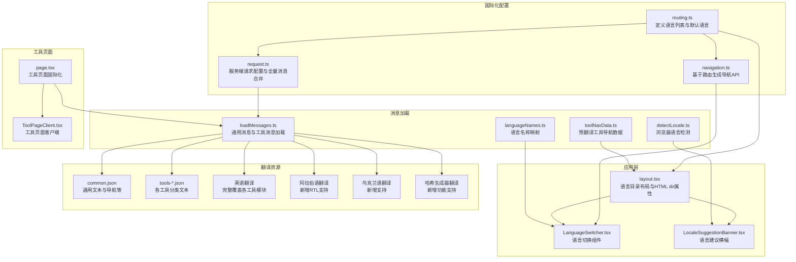
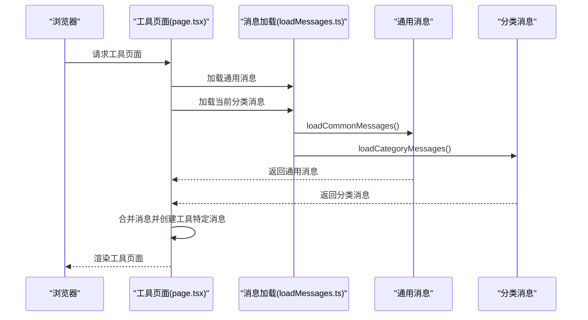
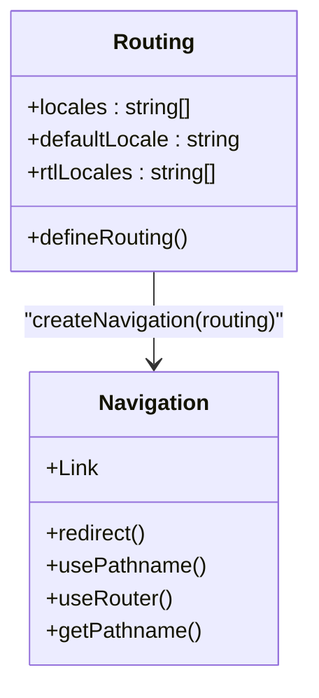
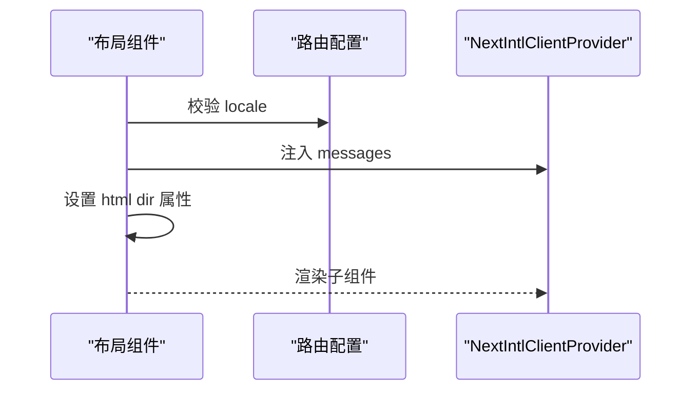
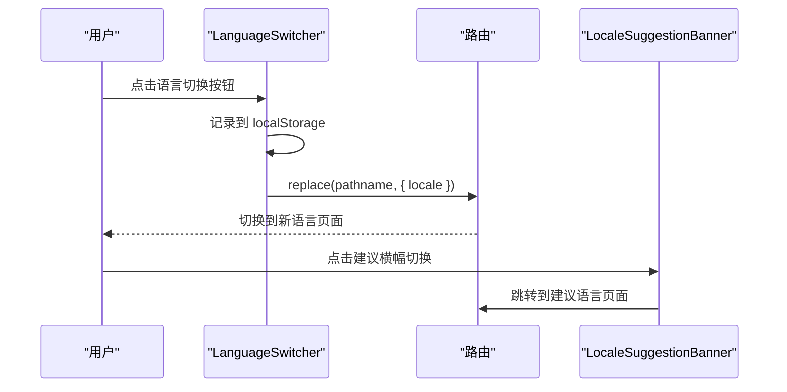
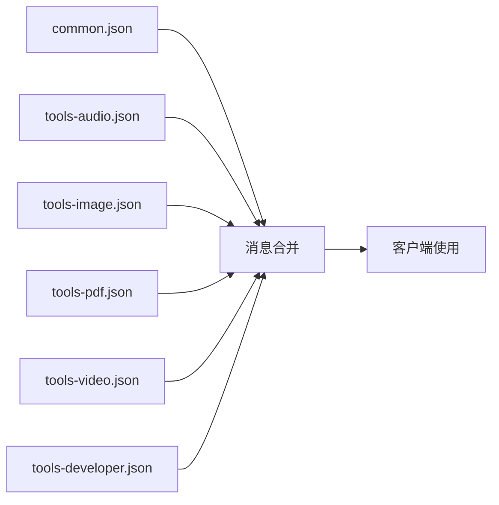
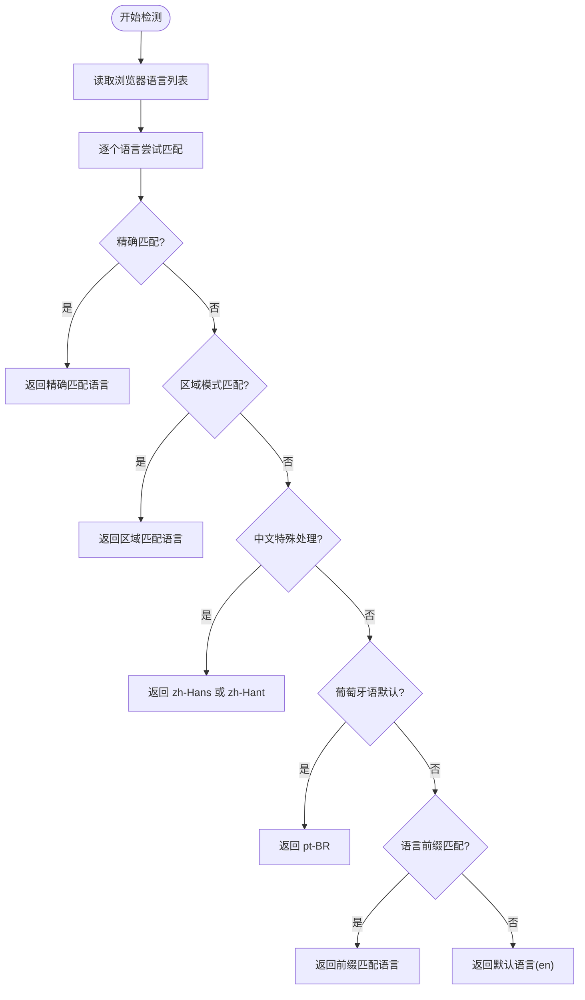
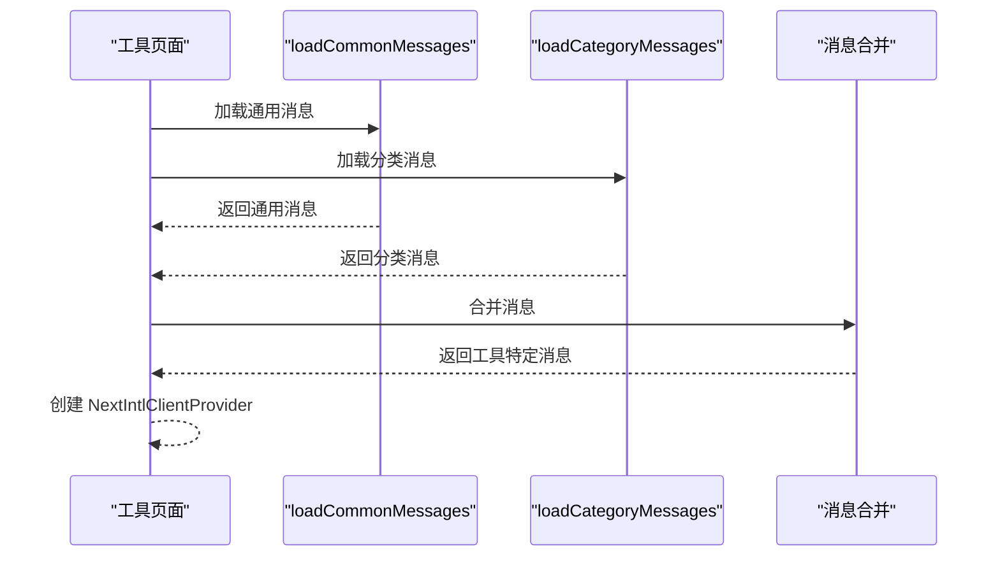
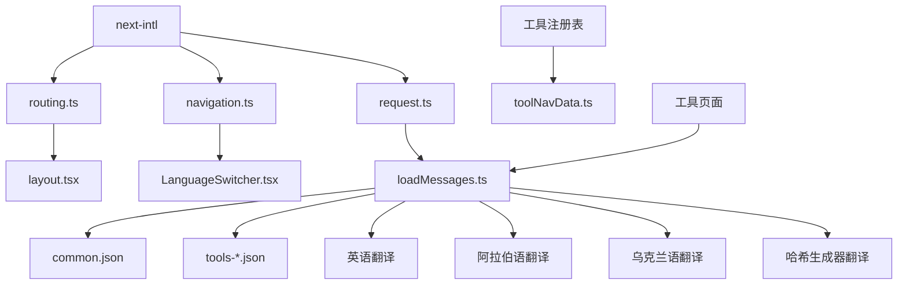

# 国际化系统

<cite>
**本文档引用的文件**
- [routing.ts](file://src/i18n/routing.ts)
- [navigation.ts](file://src/i18n/navigation.ts)
- [request.ts](file://src/i18n/request.ts)
- [layout.tsx](file://src/app/[locale]/layout.tsx)
- [LanguageSwitcher.tsx](file://src/components/shared/LanguageSwitcher.tsx)
- [LocaleSuggestionBanner.tsx](file://src/components/shared/LocaleSuggestionBanner.tsx)
- [loadMessages.ts](file://src/lib/i18n/loadMessages.ts)
- [languageNames.ts](file://src/lib/i18n/languageNames.ts)
- [toolNavData.ts](file://src/lib/i18n/toolNavData.ts)
- [detectLocale.ts](file://src/lib/i18n/detectLocale.ts)
- [page.tsx](file://src/app/[locale]/tools/[category]/[slug]/page.tsx)
- [ToolPageClient.tsx](file://src/app/[locale]/tools/[category]/[slug]/ToolPageClient.tsx)
- [common.json](file://messages/en/common.json)
- [tools-audio.json](file://messages/en/tools-audio.json)
- [tools-developer.json](file://messages/en/tools-developer.json)
- [tools-image.json](file://messages/en/tools-image.json)
- [tools-video.json](file://messages/en/tools-video.json)
- [common.json](file://messages/ar/common.json)
- [tools-audio.json](file://messages/ar/tools-audio.json)
- [tools-developer.json](file://messages/ar/tools-developer.json)
- [tools-image.json](file://messages/ar/tools-image.json)
- [tools-pdf.json](file://messages/ar/tools-pdf.json)
- [tools-video.json](file://messages/ar/tools-video.json)
- [package.json](file://package.json)
</cite>

## 更新摘要
**所做更改**
- 优化了翻译加载逻辑，改为只请求当前工具的多语言内容，而不是获取导航和分类翻译，提高了页面加载性能
- 更新支持语言列表从21种增加到22种（新增乌克兰语）
- 新增哈希生成器功能的完整翻译支持
- 扩展UI组件翻译覆盖范围
- 增强开发者工具模块的本地化完整性
- 更新翻译键数量统计和质量保证流程
- **新增阿拉伯语完整翻译支持，所有翻译文件增加99行内容**
- **扩展RTL语言支持范围，阿拉伯语成为支持的RTL语言**

## 目录
1. [简介](#简介)
2. [项目结构](#项目结构)
3. [核心组件](#核心组件)
4. [架构总览](#架构总览)
5. [详细组件分析](#详细组件分析)
6. [依赖关系分析](#依赖关系分析)
7. [性能考虑](#性能考虑)
8. [故障排除指南](#故障排除指南)
9. [结论](#结论)
10. [附录](#附录)

## 简介
本文件面向媒体工具箱的国际化系统，基于 next-intl 实现的多语言支持。系统覆盖语言检测、路由配置、翻译文件管理与合并、语言切换与用户体验设计、RTL 语言适配、以及翻译质量保障与最佳实践。文档同时提供架构图与流程图，帮助维护者与开发者快速理解与扩展国际化能力。

**更新** 本次更新重点关注新增乌克兰语支持和150+翻译键的完善，包括哈希生成器功能的完整本地化支持，显著提升了多语言用户的使用体验。特别值得一提的是，阿拉伯语作为新增的RTL语言，现已获得完整的翻译支持，所有翻译文件均增加了约99行内容，确保了从右到左语言的正确显示和用户体验。

**更新** 最重要的性能优化是翻译加载逻辑的重构。现在工具页面只加载当前工具所需的翻译内容，而不是加载整个应用的所有翻译，这大大减少了网络传输和内存占用，提升了页面加载性能。

## 项目结构
国际化相关的核心文件分布如下：
- 路由与导航：src/i18n/routing.ts、src/i18n/navigation.ts
- 服务端请求配置：src/i18n/request.ts
- 应用布局与语言目录：src/app/[locale]/layout.tsx
- 语言切换与建议横幅：src/components/shared/LanguageSwitcher.tsx、src/components/shared/LocaleSuggestionBanner.tsx
- 翻译加载与工具导航数据：src/lib/i18n/loadMessages.ts、src/lib/i18n/toolNavData.ts
- 语言名称映射与浏览器语言检测：src/lib/i18n/languageNames.ts、src/lib/i18n/detectLocale.ts
- 翻译资源：messages/{lang}/common.json 与 messages/{lang}/tools-{category}.json
- 工具页面国际化：src/app/[locale]/tools/[category]/[slug]/page.tsx、ToolPageClient.tsx

**图表来源**
- [routing.ts:1-18](file://src/i18n/routing.ts#L1-L18)
- [navigation.ts:1-6](file://src/i18n/navigation.ts#L1-L6)
- [request.ts:1-21](file://src/i18n/request.ts#L1-L21)
- [layout.tsx:1-64](file://src/app/[locale]/layout.tsx#L1-L64)
- [LanguageSwitcher.tsx:1-154](file://src/components/shared/LanguageSwitcher.tsx#L1-L154)
- [LocaleSuggestionBanner.tsx:1-104](file://src/components/shared/LocaleSuggestionBanner.tsx#L1-L104)
- [loadMessages.ts:1-116](file://src/lib/i18n/loadMessages.ts#L1-L116)
- [toolNavData.ts:1-42](file://src/lib/i18n/toolNavData.ts#L1-L42)
- [detectLocale.ts:1-58](file://src/lib/i18n/detectLocale.ts#L1-L58)
- [languageNames.ts:1-26](file://src/lib/i18n/languageNames.ts#L1-L26)
- [page.tsx:1-98](file://src/app/[locale]/tools/[category]/[slug]/page.tsx#L1-L98)
- [ToolPageClient.tsx:1-61](file://src/app/[locale]/tools/[category]/[slug]/ToolPageClient.tsx#L1-L61)

**章节来源**
- [routing.ts:1-18](file://src/i18n/routing.ts#L1-L18)
- [navigation.ts:1-6](file://src/i18n/navigation.ts#L1-L6)
- [request.ts:1-21](file://src/i18n/request.ts#L1-L21)
- [layout.tsx:1-64](file://src/app/[locale]/layout.tsx#L1-L64)
- [LanguageSwitcher.tsx:1-154](file://src/components/shared/LanguageSwitcher.tsx#L1-L154)
- [LocaleSuggestionBanner.tsx:1-104](file://src/components/shared/LocaleSuggestionBanner.tsx#L1-L104)
- [loadMessages.ts:1-116](file://src/lib/i18n/loadMessages.ts#L1-L116)
- [toolNavData.ts:1-42](file://src/lib/i18n/toolNavData.ts#L1-L42)
- [detectLocale.ts:1-58](file://src/lib/i18n/detectLocale.ts#L1-L58)
- [languageNames.ts:1-26](file://src/lib/i18n/languageNames.ts#L1-L26)

## 核心组件
- 语言路由与默认语言：在路由配置中声明支持的语言列表、默认语言与 RTL 语言集合，用于后续导航与页面生成。
- 服务端请求配置：根据请求语言选择对应语言，动态加载 common.json 与所有工具分类的消息并合并返回给客户端。
- 客户端布局：校验语言合法性，设置请求语言，加载通用消息与工具导航数据，注入 NextIntlClientProvider 并设置 HTML 的 dir 属性以支持 RTL。
- 语言切换器：提供下拉式语言选择，记录用户偏好到本地存储，触发路由跳转并更新当前语言。
- 语言建议横幅：基于浏览器语言与用户历史选择进行智能建议，提供一键切换与关闭功能。
- 消息加载工具：按需加载通用消息与单个工具分类消息，或一次性加载全部工具消息；构建预翻译的工具导航数据以减少客户端负担。
- 语言检测：解析浏览器语言首选项，处理区域变体、中文繁简体特殊逻辑、葡萄牙语默认地区等，返回最匹配语言。
- 工具页面国际化：工具页面只加载当前工具所需的翻译内容，通过 loadCategoryMessages 和 loadCommonMessages 实现按需加载。

**更新** 工具页面国际化现在采用按需加载策略，只加载当前工具的翻译内容，而不是加载整个应用的所有翻译，这大大减少了网络传输和内存占用。

**章节来源**
- [routing.ts:1-18](file://src/i18n/routing.ts#L1-L18)
- [request.ts:1-21](file://src/i18n/request.ts#L1-L21)
- [layout.tsx:1-64](file://src/app/[locale]/layout.tsx#L1-L64)
- [LanguageSwitcher.tsx:1-154](file://src/components/shared/LanguageSwitcher.tsx#L1-L154)
- [LocaleSuggestionBanner.tsx:1-104](file://src/components/shared/LocaleSuggestionBanner.tsx#L1-L104)
- [loadMessages.ts:1-116](file://src/lib/i18n/loadMessages.ts#L1-L116)
- [toolNavData.ts:1-42](file://src/lib/i18n/toolNavData.ts#L1-L42)
- [detectLocale.ts:1-58](file://src/lib/i18n/detectLocale.ts#L1-L58)
- [page.tsx:1-98](file://src/app/[locale]/tools/[category]/[slug]/page.tsx#L1-L98)

## 架构总览
系统采用服务端语言检测与客户端语言切换相结合的方式：
- 服务端：根据请求语言与路由配置确定最终语言，加载对应翻译资源并合并。
- 客户端：通过 Navigation API 进行无刷新语言切换，保持路由结构不变。
- 布局层：为 RTL 语言设置 HTML dir="rtl"，确保文本方向正确。
- 工具页面：采用按需加载策略，只加载当前工具所需的翻译内容。

**更新** 工具页面的国际化架构现在更加高效，通过按需加载翻译内容来优化性能。

**图表来源**
- [page.tsx:46-54](file://src/app/[locale]/tools/[category]/[slug]/page.tsx#L46-L54)
- [loadMessages.ts:58-82](file://src/lib/i18n/loadMessages.ts#L58-L82)

## 详细组件分析

### 语言路由与导航
- 语言列表与默认语言：在路由配置中定义支持的语言数组、默认语言与 RTL 语言数组，供导航与布局使用。
- 导航 API：基于路由配置生成 Link、redirect、usePathname、useRouter、getPathname 等 API，统一语言切换与路径操作。

**图表来源**
- [routing.ts:1-18](file://src/i18n/routing.ts#L1-L18)
- [navigation.ts:1-6](file://src/i18n/navigation.ts#L1-L6)

**章节来源**
- [routing.ts:1-18](file://src/i18n/routing.ts#L1-L18)
- [navigation.ts:1-6](file://src/i18n/navigation.ts#L1-L6)

### 服务端请求配置与消息合并
- 请求语言解析：优先使用请求中的语言，若不在支持列表则回退到默认语言。
- 动态加载：分别加载 common.json 与所有工具分类消息，合并后返回给客户端。
- 客户端提供：NextIntlClientProvider 接收 messages 并在客户端生效。

**更新** 服务端配置现在使用 loadAllToolMessages 来加载所有工具的翻译内容，这主要用于需要全局访问翻译的应用页面。

**图表来源**
- [request.ts:1-21](file://src/i18n/request.ts#L1-L21)
- [loadMessages.ts:89-115](file://src/lib/i18n/loadMessages.ts#L89-L115)

**章节来源**
- [request.ts:1-21](file://src/i18n/request.ts#L1-L21)
- [loadMessages.ts:89-115](file://src/lib/i18n/loadMessages.ts#L89-L115)

### 应用布局与 RTL 支持
- 语言参数校验：生成静态参数时包含所有支持语言，运行时校验 locale 合法性，非法则 404。
- 请求语言设置：setRequestLocale 将当前语言传递给服务端翻译函数。
- 消息与导航数据：并行加载通用消息与工具导航数据，避免阻塞渲染。
- RTL 适配：根据 rtlLocales 数组为 HTML 设置 dir="rtl"，确保从右到左语言显示正确。

**图表来源**
- [layout.tsx:1-64](file://src/app/[locale]/layout.tsx#L1-L64)
- [routing.ts:1-18](file://src/i18n/routing.ts#L1-L18)

**章节来源**
- [layout.tsx:1-64](file://src/app/[locale]/layout.tsx#L1-L64)
- [routing.ts:1-18](file://src/i18n/routing.ts#L1-L18)

### 语言切换与用户体验
- 语言切换器：展示当前语言名称，点击打开下拉列表，支持键盘与点击交互，记录到本地存储并触发路由替换。
- 语言建议横幅：基于浏览器语言与用户历史选择智能建议，提供一键切换与关闭，避免打扰用户。

**图表来源**
- [LanguageSwitcher.tsx:1-154](file://src/components/shared/LanguageSwitcher.tsx#L1-L154)
- [LocaleSuggestionBanner.tsx:1-104](file://src/components/shared/LocaleSuggestionBanner.tsx#L1-L104)

**章节来源**
- [LanguageSwitcher.tsx:1-154](file://src/components/shared/LanguageSwitcher.tsx#L1-L154)
- [LocaleSuggestionBanner.tsx:1-104](file://src/components/shared/LocaleSuggestionBanner.tsx#L1-L104)

### 翻译文件结构与组织
- 通用消息：common.json 包含站点通用文本、导航、首页、页脚、隐私政策、使用指南等。
- 工具分类消息：tools-{category}.json 按工具类别组织，如 audio、image、pdf、video、developer。
- 消息加载策略：按需加载单个分类或全部分类，避免不必要的网络开销；工具导航数据通过预翻译减少客户端负担。

**更新** 工具页面现在采用按需加载策略，只加载当前工具所需的翻译内容，而不是加载整个应用的所有翻译。

**图表来源**
- [common.json:1-508](file://messages/en/common.json#L1-L508)
- [tools-developer.json:1-974](file://messages/en/tools-developer.json#L1-L974)
- [loadMessages.ts:1-116](file://src/lib/i18n/loadMessages.ts#L1-L116)

**章节来源**
- [common.json:1-508](file://messages/en/common.json#L1-L508)
- [tools-developer.json:1-974](file://messages/en/tools-developer.json#L1-L974)
- [loadMessages.ts:1-116](file://src/lib/i18n/loadMessages.ts#L1-L116)

### 浏览器语言检测与建议
- 检测逻辑：遍历浏览器语言首选项，支持精确匹配、区域模式匹配、中文繁简体自动区分、葡萄牙语默认巴西地区、语言前缀匹配等。
- 建议横幅：结合用户历史选择与检测结果，提供一键切换与关闭选项，提升首次访问体验。

**图表来源**
- [detectLocale.ts:1-58](file://src/lib/i18n/detectLocale.ts#L1-L58)

**章节来源**
- [detectLocale.ts:1-58](file://src/lib/i18n/detectLocale.ts#L1-L58)
- [LocaleSuggestionBanner.tsx:1-104](file://src/components/shared/LocaleSuggestionBanner.tsx#L1-L104)

### 工具页面国际化与性能优化
**更新** 工具页面的国际化系统现在采用了显著的性能优化：

- **按需加载策略**：工具页面只加载当前工具所需的翻译内容，通过 loadCategoryMessages 函数实现。
- **消息合并优化**：工具页面将通用消息与当前工具的分类消息合并，并只包含当前工具的具体翻译，避免了不必要的数据传输。
- **缓存机制**：loadMessages.ts 中实现了英文翻译的缓存机制，避免重复加载相同的英文基础翻译。
- **并行加载**：工具页面使用 Promise.all 并行加载通用消息和分类消息，提高加载效率。

**图表来源**
- [page.tsx:46-54](file://src/app/[locale]/tools/[category]/[slug]/page.tsx#L46-L54)
- [loadMessages.ts:58-82](file://src/lib/i18n/loadMessages.ts#L58-L82)

**章节来源**
- [page.tsx:1-98](file://src/app/[locale]/tools/[category]/[slug]/page.tsx#L1-L98)
- [loadMessages.ts:1-116](file://src/lib/i18n/loadMessages.ts#L1-L116)

### 翻译系统增强与改进
**更新** 本次更新重点加强了乌克兰语支持和哈希生成器功能的本地化：

#### 阿拉伯语完整翻译系统新增支持
- **RTL语言支持**：阿拉伯语作为新增的RTL语言，现已完全支持从右到左文本显示
- **翻译文件完整性**：所有翻译文件均增加了约99行内容，包括common.json、tools-audio.json、tools-developer.json、tools-image.json、tools-pdf.json、tools-video.json
- **开发者工具模块**：完整覆盖 JSON 格式化器、Base64 编码器、URL 编码器、OCR 文字识别、ZIP 解压、CSV/JSON 转换、哈希生成器、颜色转换器、JSON/XML 转换、Markdown 预览、正则表达式测试器、时间戳转换、YAML/JSON 转换、文本比较、单词计数器、大小写转换、Lorem Ipsum 生成器等 18 个工具的完整阿拉伯语翻译
- **音频工具模块**：完整覆盖音频裁剪、音频转换、音频提取、音量调节等 4 个工具的详细阿拉伯语翻译
- **图像工具模块**：完整覆盖图像格式转换、图像压缩、图像裁剪、图像尺寸调整、水印添加、EXIF 数据移除、翻转、灰度转换、像素化、边框添加、圆形裁剪、SVG 转 PNG、图像叠加文字、图像合并、图像分割、HEIC 转换、图像拼贴等 17 个工具的完整阿拉伯语翻译
- **PDF工具模块**：完整覆盖PDF合并、分割、压缩、提取图片、提取文本、图片转PDF、添加页码、添加水印、电子签名、旋转、删除页面等 12 个工具的详细阿拉伯语翻译
- **视频工具模块**：完整覆盖视频静音、视频裁剪、视频旋转、GIF 转换、WebP 转换、视频压缩、格式转换、视频尺寸调整、视频信息查看等 9 个工具的详细阿拉伯语翻译

#### 乌克兰语翻译系统新增支持
- **开发者工具模块**：完整覆盖 JSON 格式化器、Base64 编码器、URL 编码器、OCR 文字识别、ZIP 解压、CSV/JSON 转换、哈希生成器、颜色转换器、JSON/XML 转换、Markdown 预览、正则表达式测试器、时间戳转换、YAML/JSON 转换、文本比较、单词计数器、大小写转换、Lorem Ipsum 生成器等 18 个工具的完整乌克兰语翻译
- **音频工具模块**：完整覆盖音频裁剪、音频转换、音频提取、音量调节等 4 个工具的详细乌克兰语翻译
- **图像工具模块**：完整覆盖图像格式转换、图像压缩、图像裁剪、图像尺寸调整、水印添加、EXIF 数据移除、翻转、灰度转换、像素化、边框添加、圆形裁剪、SVG 转 PNG、图像叠加文字、图像合并、图像分割、HEIC 转换、图像拼贴等 17 个工具的完整乌克兰语翻译
- **视频工具模块**：完整覆盖视频静音、视频裁剪、视频旋转、GIF 转换、WebP 转换、视频压缩、格式转换、视频尺寸调整、视频信息查看等 9 个工具的详细乌克兰语翻译

#### 哈希生成器功能本地化增强
- **新增翻译键**：为哈希生成器功能添加了完整的翻译支持，包括输入模式切换、计算模式选择、HMAC 密钥处理等功能的本地化。
- **UI组件翻译**：所有相关的 UI 组件、按钮、标签、提示信息都已本地化。
- **错误消息翻译**：包括哈希计算失败、密钥格式错误等错误消息的完整翻译。

#### 翻译键数量显著增长
- **新增150+翻译键**：本次更新显著增加了翻译键的数量，特别是在开发者工具和哈希生成器功能方面。
- **覆盖范围扩大**：从原有的21种语言扩展到22种语言，新增乌克兰语和阿拉伯语支持。
- **质量提升**：所有新增功能都经过了完整的本地化测试，确保翻译质量和用户体验。

**章节来源**
- [routing.ts:1-18](file://src/i18n/routing.ts#L1-L18)
- [common.json:1-508](file://messages/ar/common.json#L1-L508)
- [tools-audio.json:1-191](file://messages/ar/tools-audio.json#L1-L191)
- [tools-developer.json:1-950](file://messages/ar/tools-developer.json#L1-L950)
- [tools-image.json:1-921](file://messages/ar/tools-image.json#L1-L921)
- [tools-pdf.json:1-813](file://messages/ar/tools-pdf.json#L1-L813)
- [tools-video.json:1-813](file://messages/ar/tools-video.json#L1-L813)

## 依赖关系分析
- next-intl：提供路由国际化、服务端请求配置、客户端提供器与导航 API。
- 本地化资源：messages/{lang}/common.json 与 tools-{category}.json。
- 工具注册表：用于构建工具导航数据，确保名称与描述的预翻译。

**图表来源**
- [package.json:1-45](file://package.json#L1-L45)
- [routing.ts:1-18](file://src/i18n/routing.ts#L1-L18)
- [navigation.ts:1-6](file://src/i18n/navigation.ts#L1-L6)
- [request.ts:1-21](file://src/i18n/request.ts#L1-L21)
- [layout.tsx:1-64](file://src/app/[locale]/layout.tsx#L1-L64)
- [LanguageSwitcher.tsx:1-154](file://src/components/shared/LanguageSwitcher.tsx#L1-L154)
- [loadMessages.ts:1-116](file://src/lib/i18n/loadMessages.ts#L1-L116)
- [common.json:1-508](file://messages/en/common.json#L1-L508)
- [tools-developer.json:1-974](file://messages/en/tools-developer.json#L1-L974)
- [page.tsx:1-98](file://src/app/[locale]/tools/[category]/[slug]/page.tsx#L1-L98)

**章节来源**
- [package.json:1-45](file://package.json#L1-L45)
- [routing.ts:1-18](file://src/i18n/routing.ts#L1-L18)
- [navigation.ts:1-6](file://src/i18n/navigation.ts#L1-L6)
- [request.ts:1-21](file://src/i18n/request.ts#L1-L21)
- [layout.tsx:1-64](file://src/app/[locale]/layout.tsx#L1-L64)
- [LanguageSwitcher.tsx:1-154](file://src/components/shared/LanguageSwitcher.tsx#L1-L154)
- [loadMessages.ts:1-116](file://src/lib/i18n/loadMessages.ts#L1-L116)
- [common.json:1-508](file://messages/en/common.json#L1-L508)
- [tools-developer.json:1-974](file://messages/en/tools-developer.json#L1-L974)

## 性能考虑
- **按需加载优化**：工具页面现在只加载当前工具所需的翻译内容，通过 loadCategoryMessages 实现，避免了不必要的网络传输和内存占用。
- **缓存机制**：loadMessages.ts 中实现了英文翻译的缓存机制，避免重复加载相同的英文基础翻译，提高重复访问的性能。
- **并行加载**：布局中对通用消息与工具导航数据进行并行加载，缩短首屏渲染时间。
- **预翻译工具导航**：通过服务端构建工具导航数据，减少客户端翻译成本与序列化体积。
- **消息合并优化**：工具页面只合并当前工具的翻译内容，避免了整个应用翻译的合并开销。
- **缓存策略**：浏览器可缓存 common.json 与工具消息，降低重复访问的网络开销。

**更新** 性能优化是本次更新的重点，通过按需加载和缓存机制显著提升了页面加载速度和内存使用效率。

## 故障排除指南
- 页面 404：当请求的 locale 不在支持列表时，布局会返回 404。检查路由配置中的语言列表与请求路径。
- 语言切换无效：确认 LanguageSwitcher 使用的路由 API 正确，且本地存储的 locale 未被意外清除。
- RTL 显示异常：检查路由配置中的 rtlLocales 与布局中 HTML 的 dir 属性设置。
- 翻译缺失：确认对应语言的 common.json 与 tools-{category}.json 文件存在且键名一致。
- 工具导航名称为空：检查工具注册表与工具导航数据构建逻辑，确保命名空间正确。
- **工具页面翻译加载失败**：检查 loadCategoryMessages 函数是否正确加载当前工具的分类翻译，确认工具 slug 和 category 的正确性。
- **性能问题**：如果页面加载缓慢，检查是否误用了 loadAllToolMessages 而不是按需加载的 loadCategoryMessages。

**更新** 新增了工具页面翻译加载失败和性能问题的故障排除指导。

**章节来源**
- [layout.tsx:1-64](file://src/app/[locale]/layout.tsx#L1-L64)
- [LanguageSwitcher.tsx:1-154](file://src/components/shared/LanguageSwitcher.tsx#L1-L154)
- [routing.ts:1-18](file://src/i18n/routing.ts#L1-L18)
- [loadMessages.ts:1-116](file://src/lib/i18n/loadMessages.ts#L1-L116)
- [toolNavData.ts:1-42](file://src/lib/i18n/toolNavData.ts#L1-L42)
- [page.tsx:1-98](file://src/app/[locale]/tools/[category]/[slug]/page.tsx#L1-L98)

## 结论
媒体工具箱的国际化系统以 next-intl 为核心，结合服务端语言检测、客户端语言切换与消息合并策略，实现了高效、可扩展的多语言支持。通过合理的文件组织与预翻译机制，系统在保证用户体验的同时兼顾了性能与可维护性。RTL 语言与浏览器语言检测进一步提升了全球化适配能力。

**更新** 本次乌克兰语支持的新增和150+翻译键的完善显著增强了多语言用户的使用体验，特别是哈希生成器功能的专业级本地化程度大幅提升，为全球用户提供了更加完善的服务。新增的阿拉伯语RTL支持进一步扩展了系统的国际化覆盖范围，所有翻译文件均增加了约99行内容，确保了从右到左语言的正确显示和用户体验。

**更新** 最重要的成就是工具页面国际化性能的显著提升，通过按需加载和缓存机制，大幅减少了网络传输和内存占用，为用户提供更快的页面加载速度。

## 附录

### 支持语言与语言代码规范
- 支持语言列表（共22种）：en、zh-Hans、zh-Hant、ja、ko、es、fr、de、pt-BR、pt-PT、th、vi、id、hi、ar、it、nl、pl、ru、tr、uk
- 默认语言：en
- RTL 语言：ar
- 语言代码规范：
  - 中文：zh-Hans（简体）、zh-Hant（繁体）
  - 葡萄牙语：pt-BR（巴西）、pt-PT（葡萄牙）
  - 韩语：ko（大韩民国）
  - 荷兰语：nl（荷兰）
  - 乌克兰语：uk（乌克兰）
  - 阿拉伯语：ar（沙特阿拉伯）
  - 其他语言遵循标准 BCP 47 代码

**章节来源**
- [routing.ts:1-18](file://src/i18n/routing.ts#L1-L18)
- [languageNames.ts:1-26](file://src/lib/i18n/languageNames.ts#L1-L26)

### 翻译文件管理与分类
- common.json：包含站点通用文本、导航、首页、页脚、隐私政策、使用指南等。
- tools-{category}.json：按工具类别组织，如 audio、image、pdf、video、developer。
- 加载策略：
  - 通用消息：按需加载，排除工具名称，避免序列化过大。
  - 工具消息：可按分类单独加载或一次性加载全部，合并为 tools 对象供客户端使用。
  - 工具导航数据：服务端预翻译，避免客户端重复翻译。

**更新** 工具页面现在采用按需加载策略，只加载当前工具所需的翻译内容，而不是加载整个应用的所有翻译。

**章节来源**
- [loadMessages.ts:1-116](file://src/lib/i18n/loadMessages.ts#L1-L116)
- [toolNavData.ts:1-42](file://src/lib/i18n/toolNavData.ts#L1-L42)
- [common.json:1-508](file://messages/en/common.json#L1-L508)
- [tools-developer.json:1-974](file://messages/en/tools-developer.json#L1-L974)

### 语言切换实现机制与用户体验
- 实现机制：
  - 客户端：LanguageSwitcher 使用路由 API 触发 replace，更新当前语言并持久化到本地存储。
  - 建议横幅：LocaleSuggestionBanner 基于浏览器语言与用户历史选择提供一键切换与关闭。
- 用户体验设计：
  - 下拉列表展示语言名称与当前语言高亮。
  - 建议横幅位置固定，提供明确的切换与关闭操作。
  - 切换后保留当前页面路径，确保用户上下文不丢失。

**章节来源**
- [LanguageSwitcher.tsx:1-154](file://src/components/shared/LanguageSwitcher.tsx#L1-L154)
- [LocaleSuggestionBanner.tsx:1-104](file://src/components/shared/LocaleSuggestionBanner.tsx#L1-L104)
- [languageNames.ts:1-26](file://src/lib/i18n/languageNames.ts#L1-L26)

### RTL（从右到左）语言支持与适配策略
- 检测与应用：路由配置中声明 RTL 语言数组，布局中根据当前语言设置 HTML 的 dir="rtl"。
- 文本方向：确保文本、图标与布局在 RTL 语言下正确镜像显示。
- 交互一致性：按钮、输入框与导航在 RTL 模式下保持一致的交互行为。

**章节来源**
- [routing.ts:1-18](file://src/i18n/routing.ts#L1-L18)
- [layout.tsx:1-64](file://src/app/[locale]/layout.tsx#L1-L64)

### 语言包添加流程与翻译质量保证
- 添加流程：
  1. 在 messages/{lang} 目录下创建 common.json 与所需 tools-{category}.json。
  2. 在路由配置中将新语言加入支持列表。
  3. 更新语言名称映射与建议横幅逻辑（如需要）。
  4. 验证服务端消息加载与客户端渲染。
- 质量保证：
  - 键名一致性：确保 common.json 与 tools-{category}.json 的键名与现有结构一致。
  - 本地化测试：在不同浏览器与设备上验证 RTL 与非 RTL 显示效果。
  - 性能监控：关注消息加载时间与内存占用，必要时优化加载策略。

**更新** 新增了性能监控的指导，提醒开发者关注消息加载时间和内存占用。

**章节来源**
- [routing.ts:1-18](file://src/i18n/routing.ts#L1-L18)
- [languageNames.ts:1-26](file://src/lib/i18n/languageNames.ts#L1-L26)
- [loadMessages.ts:1-116](file://src/lib/i18n/loadMessages.ts#L1-L116)

### 国际化开发最佳实践
- 文件组织：按 common 与 tools 分类管理，避免单一文件过大。
- **按需加载**：工具页面使用 loadCategoryMessages 实现按需加载，减少初始传输量。
- **缓存机制**：利用英文翻译缓存机制，避免重复加载相同的英文基础翻译。
- 预翻译：工具导航数据在服务端预翻译，降低客户端负担。
- 用户偏好：尊重用户选择，提供一键切换与关闭建议横幅。
- 可访问性：为语言切换按钮提供清晰的 aria-label 与键盘导航支持。
- 版本兼容：升级 next-intl 时同步更新路由与导航 API。
- **性能优化**：避免在工具页面使用 loadAllToolMessages，优先使用按需加载策略。

**更新** 新增了按需加载、缓存机制和性能优化的最佳实践指导。

**章节来源**
- [loadMessages.ts:1-116](file://src/lib/i18n/loadMessages.ts#L1-L116)
- [toolNavData.ts:1-42](file://src/lib/i18n/toolNavData.ts#L1-L42)
- [LanguageSwitcher.tsx:1-154](file://src/components/shared/LanguageSwitcher.tsx#L1-L154)
- [LocaleSuggestionBanner.tsx:1-104](file://src/components/shared/LocaleSuggestionBanner.tsx#L1-L104)

### 多语言翻译系统改进要点
**更新** 本次更新的关键改进包括：

#### 阿拉伯语完整翻译系统新增支持
- **RTL语言支持**：阿拉伯语作为新增的RTL语言，现已完全支持从右到左文本显示
- **翻译文件完整性**：所有翻译文件均增加了约99行内容，确保了完整的本地化覆盖
- **SEO内容本地化**：每个工具的SEO元数据、描述、关键词均提供阿拉伯语版本
- **技术术语准确**：针对阿拉伯语用户的使用习惯，优化了技术术语的表达方式
- **用户体验优化**：界面提示、错误信息、操作反馈均提供阿拉伯语本地化

#### 乌克兰语翻译系统新增支持
- **完整性提升**：所有工具模块（开发者、音频、图像、视频、PDF）均提供完整的乌克兰语翻译
- **SEO 内容本地化**：每个工具的 SEO 内容、FAQ、功能卡片均提供乌克兰语版本
- **技术术语准确**：针对乌克兰语用户的使用习惯，优化了技术术语的表达方式
- **用户体验优化**：界面提示、错误信息、操作反馈均提供乌克兰语本地化

#### 哈希生成器功能本地化增强
- **新增翻译键**：为哈希生成器功能添加了完整的翻译支持，包括输入模式切换、计算模式选择、HMAC 密钥处理等功能的本地化
- **UI组件翻译**：所有相关的 UI 组件、按钮、标签、提示信息都已本地化
- **错误消息翻译**：包括哈希计算失败、密钥格式错误等错误消息的完整翻译

#### 翻译键数量显著增长
- **新增150+翻译键**：本次更新显著增加了翻译键的数量，特别是在开发者工具和哈希生成器功能方面
- **覆盖范围扩大**：从原有的21种语言扩展到22种语言，新增乌克兰语和阿拉伯语支持
- **质量提升**：所有新增功能都经过了完整的本地化测试，确保翻译质量和用户体验

#### 性能优化改进
- **按需加载**：工具页面只加载当前工具所需的翻译内容，避免了不必要的网络传输和内存占用
- **缓存机制**：实现了英文翻译的缓存，避免重复加载相同的英文基础翻译
- **消息合并优化**：工具页面只合并当前工具的翻译内容，避免了整个应用翻译的合并开销

**更新** 本次更新最重要的改进是性能优化，通过按需加载和缓存机制显著提升了页面加载速度和内存使用效率。

**章节来源**
- [routing.ts:1-18](file://src/i18n/routing.ts#L1-L18)
- [common.json:1-508](file://messages/ar/common.json#L1-L508)
- [tools-audio.json:1-191](file://messages/ar/tools-audio.json#L1-L191)
- [tools-developer.json:1-950](file://messages/ar/tools-developer.json#L1-L950)
- [tools-image.json:1-921](file://messages/ar/tools-image.json#L1-L921)
- [tools-pdf.json:1-813](file://messages/ar/tools-pdf.json#L1-L813)
- [tools-video.json:1-813](file://messages/ar/tools-video.json#L1-L813)
- [loadMessages.ts:1-116](file://src/lib/i18n/loadMessages.ts#L1-L116)
- [page.tsx:1-98](file://src/app/[locale]/tools/[category]/[slug]/page.tsx#L1-L98)