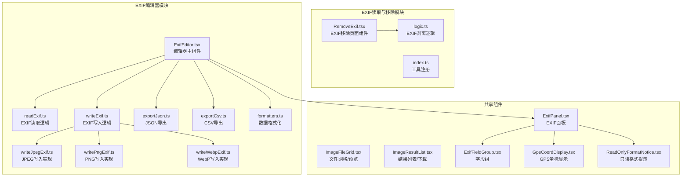
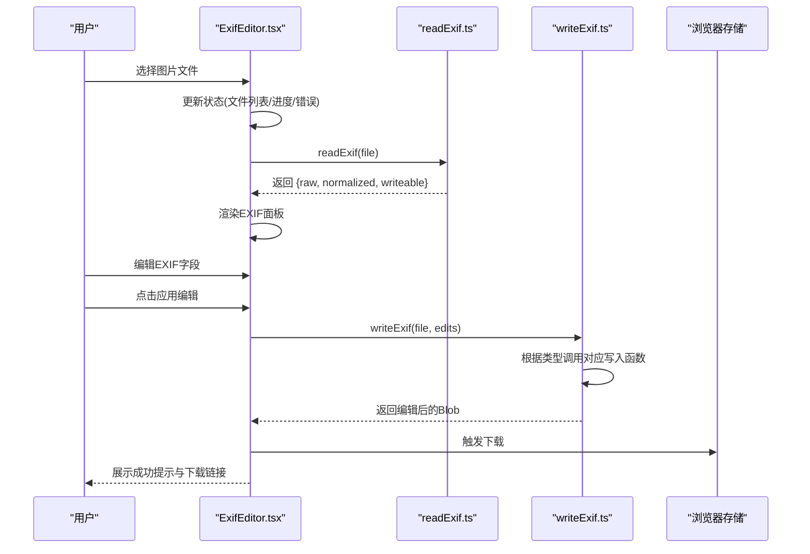
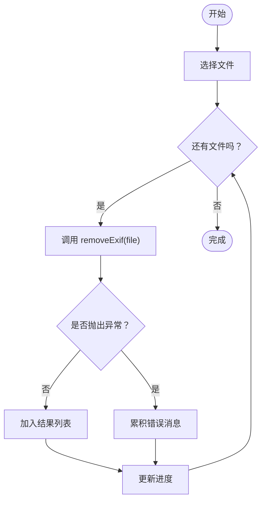
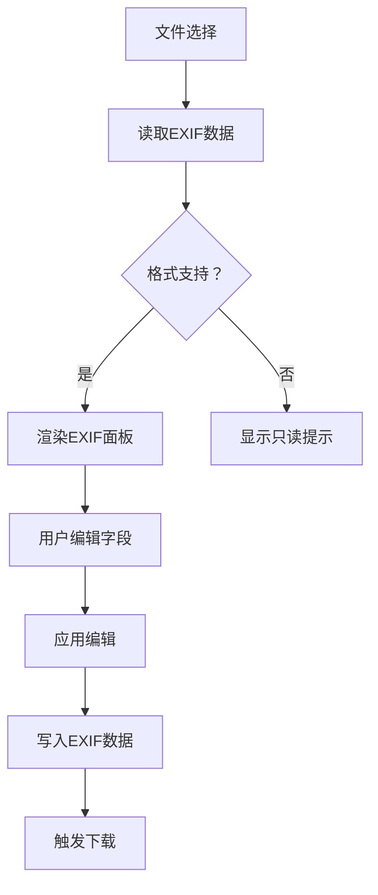
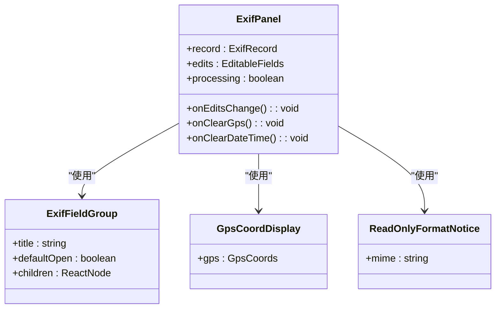
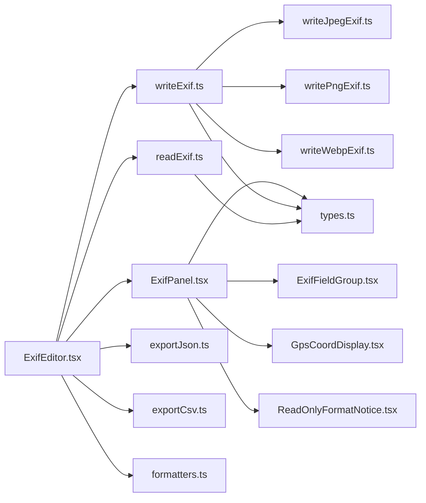

# EXIF管理

<cite>
**本文档引用的文件**
- [ExifEditor.tsx](file://src/tools/image/exif-editor/ExifEditor.tsx)
- [types.ts](file://src/tools/image/exif-editor/types.ts)
- [readExif.ts](file://src/tools/image/exif-editor/logic/readExif.ts)
- [writeExif.ts](file://src/tools/image/exif-editor/logic/writeExif.ts)
- [writeJpegExif.ts](file://src/tools/image/exif-editor/logic/writeJpegExif.ts)
- [writePngExif.ts](file://src/tools/image/exif-editor/logic/writePngExif.ts)
- [writeWebpExif.ts](file://src/tools/image/exif-editor/logic/writeWebpExif.ts)
- [exportJson.ts](file://src/tools/image/exif-editor/logic/exportJson.ts)
- [exportCsv.ts](file://src/tools/image/exif-editor/logic/exportCsv.ts)
- [formatters.ts](file://src/tools/image/exif-editor/logic/formatters.ts)
- [ExifPanel.tsx](file://src/tools/image/exif-editor/components/ExifPanel.tsx)
- [ExifFieldGroup.tsx](file://src/tools/image/exif-editor/components/ExifFieldGroup.tsx)
- [GpsCoordDisplay.tsx](file://src/tools/image/exif-editor/components/GpsCoordDisplay.tsx)
- [ReadOnlyFormatNotice.tsx](file://src/tools/image/exif-editor/components/ReadOnlyFormatNotice.tsx)
- [RemoveExif.tsx](file://src/tools/image/remove-exif/RemoveExif.tsx)
- [logic.ts](file://src/tools/image/remove-exif/logic.ts)
- [index.ts](file://src/tools/image/remove-exif/index.ts)
- [tools-image.json（英文）](file://messages/en/tools-image.json)
- [ImageResultList.tsx](file://src/components/shared/ImageResultList.tsx)
- [ImageFileGrid.tsx](file://src/components/shared/ImageFileGrid.tsx)
- [media-pipeline.ts](file://src/lib/media-pipeline.ts)
- [ffmpeg.ts](file://src/lib/ffmpeg.ts)
</cite>

## 更新摘要
**所做更改**
- 新增EXIF编辑器工具功能的完整技术文档
- 添加EXIF数据读取、编辑、写入和格式化支持的详细说明
- 更新EXIF管理工具的架构描述，包含读取器和编辑器两个核心组件
- 增加EXIF编辑器的用户界面组件和功能特性说明
- 补充EXIF数据格式化、导出和备份功能的技术细节

## 目录
1. [简介](#简介)
2. [项目结构](#项目结构)
3. [核心组件](#核心组件)
4. [架构总览](#架构总览)
5. [详细组件分析](#详细组件分析)
6. [EXIF编辑器功能详解](#exif编辑器功能详解)
7. [EXIF数据格式化与导出](#exif数据格式化与导出)
8. [依赖关系分析](#依赖关系分析)
9. [性能考量](#性能考量)
10. [故障排除指南](#故障排除指南)
11. [结论](#结论)
12. [附录](#附录)

## 简介
本文档全面介绍EXIF管理工具，重点涵盖两个核心功能模块：
- **EXIF读取与查看**：RemoveExif组件提供EXIF数据的读取、解析与移除机制
- **EXIF编辑器**：全新功能模块，支持EXIF数据的读取、编辑、写入和格式化导出

内容涵盖：
- EXIF数据的结构组成（拍摄参数、设备信息、地理位置）
- 安全性与隐私保护措施
- EXIF信息查看与编辑的实用示例
- 移除EXIF对图像质量与文件大小的影响
- 备份与恢复方法
- 不同图像格式的支持差异与兼容性
- 标准化处理与元数据清理最佳实践
- 社交媒体与版权保护中的作用与注意事项

## 项目结构
EXIF管理工具采用双模块架构，包含EXIF读取/移除功能和EXIF编辑器功能：

**图表来源**
- [ExifEditor.tsx:1-304](file://src/tools/image/exif-editor/ExifEditor.tsx#L1-L304)
- [readExif.ts:1-146](file://src/tools/image/exif-editor/logic/readExif.ts#L1-L146)
- [writeExif.ts:1-44](file://src/tools/image/exif-editor/logic/writeExif.ts#L1-L44)
- [writeJpegExif.ts:1-140](file://src/tools/image/exif-editor/logic/writeJpegExif.ts#L1-L140)
- [writePngExif.ts:1-200](file://src/tools/image/exif-editor/logic/writePngExif.ts#L1-L200)
- [writeWebpExif.ts:1-200](file://src/tools/image/exif-editor/logic/writeWebpExif.ts#L1-L200)
- [exportJson.ts:1-51](file://src/tools/image/exif-editor/logic/exportJson.ts#L1-L51)
- [exportCsv.ts:1-62](file://src/tools/image/exif-editor/logic/exportCsv.ts#L1-L62)
- [formatters.ts:1-92](file://src/tools/image/exif-editor/logic/formatters.ts#L1-L92)
- [ExifPanel.tsx:1-271](file://src/tools/image/exif-editor/components/ExifPanel.tsx#L1-L271)
- [ExifFieldGroup.tsx:1-40](file://src/tools/image/exif-editor/components/ExifFieldGroup.tsx#L1-L40)
- [GpsCoordDisplay.tsx:1-65](file://src/tools/image/exif-editor/components/GpsCoordDisplay.tsx#L1-L65)
- [ReadOnlyFormatNotice.tsx:1-27](file://src/tools/image/exif-editor/components/ReadOnlyFormatNotice.tsx#L1-L27)

**章节来源**
- [ExifEditor.tsx:1-304](file://src/tools/image/exif-editor/ExifEditor.tsx#L1-L304)
- [readExif.ts:1-146](file://src/tools/image/exif-editor/logic/readExif.ts#L1-L146)
- [writeExif.ts:1-44](file://src/tools/image/exif-editor/logic/writeExif.ts#L1-L44)
- [writeJpegExif.ts:1-140](file://src/tools/image/exif-editor/logic/writeJpegExif.ts#L1-L140)
- [writePngExif.ts:1-200](file://src/tools/image/exif-editor/logic/writePngExif.ts#L1-L200)
- [writeWebpExif.ts:1-200](file://src/tools/image/exif-editor/logic/writeWebpExif.ts#L1-L200)
- [exportJson.ts:1-51](file://src/tools/image/exif-editor/logic/exportJson.ts#L1-L51)
- [exportCsv.ts:1-62](file://src/tools/image/exif-editor/logic/exportCsv.ts#L1-L62)
- [formatters.ts:1-92](file://src/tools/image/exif-editor/logic/formatters.ts#L1-L92)
- [ExifPanel.tsx:1-271](file://src/tools/image/exif-editor/components/ExifPanel.tsx#L1-L271)
- [ExifFieldGroup.tsx:1-40](file://src/tools/image/exif-editor/components/ExifFieldGroup.tsx#L1-L40)
- [GpsCoordDisplay.tsx:1-65](file://src/tools/image/exif-editor/components/GpsCoordDisplay.tsx#L1-L65)
- [ReadOnlyFormatNotice.tsx:1-27](file://src/tools/image/exif-editor/components/ReadOnlyFormatNotice.tsx#L1-L27)

## 核心组件
EXIF管理工具包含两大核心组件：

### EXIF读取与移除组件
- **RemoveExif页面组件**：负责文件选择、进度显示、错误收集与结果展示；调用剥离逻辑并生成可下载的Blob
- **剥离逻辑模块**：针对JPEG、PNG、WebP、AVIF四种主流格式实现二进制级的元数据移除策略
- **结果与文件网格**：提供拖拽上传、批量预览、缩略图展示与一键下载

### EXIF编辑器组件
- **ExifEditor主组件**：提供完整的EXIF数据读取、编辑、写入和导出功能
- **EXIF面板组件**：支持拍摄时间、GPS坐标、相机信息、版权信息等字段的编辑
- **格式化组件**：提供GPS坐标显示、数据格式化和地图链接功能
- **导出功能**：支持JSON和CSV格式的数据导出

关键职责与行为：
- 输入校验与进度追踪：确保每次处理单个文件，维护done/total进度
- 错误处理：捕获异常并累积错误消息，避免中断整体流程
- 输出构建：根据原文件类型与剥离结果生成新的Blob与输出文件名
- 数据编辑：提供直观的表单界面，支持字段验证和批量清除功能

**章节来源**
- [RemoveExif.tsx:14-95](file://src/tools/image/remove-exif/RemoveExif.tsx#L14-L95)
- [logic.ts:450-489](file://src/tools/image/remove-exif/logic.ts#L450-L489)
- [ExifEditor.tsx:24-187](file://src/tools/image/exif-editor/ExifEditor.tsx#L24-L187)
- [ExifPanel.tsx:27-247](file://src/tools/image/exif-editor/components/ExifPanel.tsx#L27-L247)

## 架构总览
EXIF管理工具采用双模块架构，支持两种不同的工作模式：

**图表来源**
- [ExifEditor.tsx:55-119](file://src/tools/image/exif-editor/ExifEditor.tsx#L55-L119)
- [readExif.ts:20-42](file://src/tools/image/exif-editor/logic/readExif.ts#L20-L42)
- [writeExif.ts:7-25](file://src/tools/image/exif-editor/logic/writeExif.ts#L7-L25)

**章节来源**
- [ExifEditor.tsx:55-119](file://src/tools/image/exif-editor/ExifEditor.tsx#L55-L119)
- [readExif.ts:20-42](file://src/tools/image/exif-editor/logic/readExif.ts#L20-L42)
- [writeExif.ts:7-25](file://src/tools/image/exif-editor/logic/writeExif.ts#L7-L25)

## 详细组件分析

### 组件A：RemoveExif页面组件
负责文件网格交互、处理按钮状态、进度条与错误聚合，调用剥离逻辑并将返回的Blob与文件名组合为结果项。

**图表来源**
- [RemoveExif.tsx:22-48](file://src/tools/image/remove-exif/RemoveExif.tsx#L22-L48)

**章节来源**
- [RemoveExif.tsx:14-95](file://src/tools/image/remove-exif/RemoveExif.tsx#L14-L95)

### 组件B：剥离逻辑模块（按格式）
剥离逻辑针对四类图像格式分别实现：
- JPEG：扫描SOI/SOS标记段，保留SOI与SOS之前/之后的必要部分，移除APP1-APP15与COM段（保留ICC Profile）
- PNG：扫描PNG签名，识别tEXt/zTXt/iTXt/eXIf/tIME/iCCP/dSIG等块，移除元数据块后重建文件
- WebP：识别RIFF头与VP8X/EXIF/XMP块，移除EXIF/XMP并清空VP8X标志位，更新RIFF大小
- AVIF（ISO BMFF）：解析顶层box，定位meta/iinf/iloc，识别Exif/mime项ID，零填充其数据区域以保持容器结构不变

**章节来源**
- [logic.ts:14-489](file://src/tools/image/remove-exif/logic.ts#L14-L489)

### 组件C：EXIF编辑器主组件
ExifEditor.tsx作为编辑器的核心组件，提供完整的EXIF管理功能：

**图表来源**
- [ExifEditor.tsx:24-187](file://src/tools/image/exif-editor/ExifEditor.tsx#L24-L187)

**章节来源**
- [ExifEditor.tsx:24-187](file://src/tools/image/exif-editor/ExifEditor.tsx#L24-L187)

### 组件D：EXIF面板组件
ExifPanel.tsx提供结构化的EXIF数据编辑界面，包含多个功能分组：

**图表来源**
- [ExifPanel.tsx:18-247](file://src/tools/image/exif-editor/components/ExifPanel.tsx#L18-L247)
- [ExifFieldGroup.tsx:7-38](file://src/tools/image/exif-editor/components/ExifFieldGroup.tsx#L7-L38)
- [GpsCoordDisplay.tsx:15-63](file://src/tools/image/exif-editor/components/GpsCoordDisplay.tsx#L15-L63)
- [ReadOnlyFormatNotice.tsx:6-19](file://src/tools/image/exif-editor/components/ReadOnlyFormatNotice.tsx#L6-L19)

**章节来源**
- [ExifPanel.tsx:18-247](file://src/tools/image/exif-editor/components/ExifPanel.tsx#L18-L247)
- [ExifFieldGroup.tsx:7-38](file://src/tools/image/exif-editor/components/ExifFieldGroup.tsx#L7-L38)
- [GpsCoordDisplay.tsx:15-63](file://src/tools/image/exif-editor/components/GpsCoordDisplay.tsx#L15-L63)
- [ReadOnlyFormatNotice.tsx:6-19](file://src/tools/image/exif-editor/components/ReadOnlyFormatNotice.tsx#L6-L19)

## EXIF编辑器功能详解

### EXIF数据读取功能
EXIF编辑器使用exifr库进行数据读取，支持多种元数据格式：
- **解析选项**：启用TIFF、EXIF、GPS、IPTC、XMP解析，禁用ICC和JFIF
- **数据归一化**：将不同格式的EXIF字段转换为统一的结构
- **格式检测**：支持JPEG、PNG、WebP、HEIC、HEIF、AVIF、TIFF等多种格式

### EXIF数据编辑功能
编辑器提供以下编辑字段：
- **拍摄信息**：拍摄时间、相机型号、镜头型号
- **地理位置**：GPS纬度、GPS经度
- **版权信息**：作者、版权、标题、描述
- **技术参数**：ISO、光圈、快门速度、焦距等

### EXIF数据写入功能
支持三种格式的EXIF写入：
- **JPEG**：使用piexifjs库进行EXIF数据写入
- **PNG**：通过eXIf块嵌入EXIF数据
- **WebP**：在VP8X容器中嵌入EXIF数据

### 数据格式化与显示
- **GPS坐标**：支持十进制度、度分秒格式显示
- **技术参数**：ISO、光圈、快门时间等格式化显示
- **日期时间**：支持本地化格式显示

**章节来源**
- [readExif.ts:5-42](file://src/tools/image/exif-editor/logic/readExif.ts#L5-L42)
- [types.ts:7-53](file://src/tools/image/exif-editor/types.ts#L7-L53)
- [writeJpegExif.ts:18-34](file://src/tools/image/exif-editor/logic/writeJpegExif.ts#L18-L34)
- [writePngExif.ts:8-25](file://src/tools/image/exif-editor/logic/writePngExif.ts#L8-L25)
- [writeWebpExif.ts:17-32](file://src/tools/image/exif-editor/logic/writeWebpExif.ts#L17-L32)
- [formatters.ts:1-92](file://src/tools/image/exif-editor/logic/formatters.ts#L1-L92)

## EXIF数据格式化与导出

### 导出功能
EXIF编辑器提供两种数据导出格式：

#### JSON格式导出
- **结构**：包含文件信息和完整的EXIF数据
- **数据处理**：对字节数组进行十六进制编码，日期转换为ISO格式
- **用途**：便于程序处理和数据备份

#### CSV格式导出
- **结构**：扁平化的键值对格式
- **数据处理**：递归展平嵌套对象，特殊字符转义
- **用途**：便于表格处理和数据分析

### 数据格式化工具
- **GPS坐标**：支持十进制度和度分秒格式转换
- **技术参数**：ISO值、光圈值、快门时间等单位转换
- **日期时间**：本地化格式和标准格式互转

**章节来源**
- [exportJson.ts:3-51](file://src/tools/image/exif-editor/logic/exportJson.ts#L3-L51)
- [exportCsv.ts:3-62](file://src/tools/image/exif-editor/logic/exportCsv.ts#L3-L62)
- [formatters.ts:29-92](file://src/tools/image/exif-editor/logic/formatters.ts#L29-L92)

## 依赖关系分析
EXIF编辑器模块具有明确的层次结构和依赖关系：

**图表来源**
- [ExifEditor.tsx:16-20](file://src/tools/image/exif-editor/ExifEditor.tsx#L16-L20)
- [writeExif.ts:2-5](file://src/tools/image/exif-editor/logic/writeExif.ts#L2-L5)
- [ExifPanel.tsx:10-16](file://src/tools/image/exif-editor/components/ExifPanel.tsx#L10-L16)

**章节来源**
- [ExifEditor.tsx:16-20](file://src/tools/image/exif-editor/ExifEditor.tsx#L16-L20)
- [writeExif.ts:2-5](file://src/tools/image/exif-editor/logic/writeExif.ts#L2-L5)
- [ExifPanel.tsx:10-16](file://src/tools/image/exif-editor/components/ExifPanel.tsx#L10-L16)

## 性能考量
EXIF编辑器在性能方面采取了多项优化措施：

### 浏览器内处理
- **客户端处理**：所有EXIF操作在浏览器内完成，避免网络传输
- **内存管理**：使用ArrayBuffer和Uint8Array进行高效的数据处理
- **异步处理**：采用Promise和async/await避免阻塞UI线程

### 数据处理优化
- **增量处理**：EXIF数据按需解析，避免不必要的数据转换
- **格式检测**：快速判断文件格式，避免无效的处理尝试
- **缓存机制**：对已解析的数据进行缓存，减少重复计算

### 用户体验优化
- **进度反馈**：实时显示处理进度和状态
- **错误处理**：友好的错误提示和恢复机制
- **响应式设计**：适配不同屏幕尺寸和设备

**章节来源**
- [ExifEditor.tsx:35-74](file://src/tools/image/exif-editor/ExifEditor.tsx#L35-L74)
- [readExif.ts:20-42](file://src/tools/image/exif-editor/logic/readExif.ts#L20-L42)

## 故障排除指南

### 常见问题与解决方案

#### 文件格式不支持
- **问题**：某些格式无法读取或编辑
- **原因**：当前版本仅支持JPEG、PNG、WebP格式的EXIF编辑
- **解决**：使用RemoveExif组件进行移除，或转换为支持的格式

#### EXIF数据读取失败
- **问题**：EXIF面板显示为空或报错
- **原因**：文件中不存在EXIF数据或格式损坏
- **解决**：检查源文件完整性，尝试其他图片文件

#### 编辑应用失败
- **问题**：点击应用编辑后无响应或报错
- **原因**：输入数据格式不正确或浏览器限制
- **解决**：检查输入格式，确保GPS坐标为有效数值

#### 导出功能异常
- **问题**：JSON或CSV导出失败
- **原因**：浏览器阻止下载或数据格式问题
- **解决**：检查浏览器设置，确认下载权限

**章节来源**
- [ExifEditor.tsx:64-69](file://src/tools/image/exif-editor/ExifEditor.tsx#L64-L69)
- [writeExif.ts:12-14](file://src/tools/image/exif-editor/logic/writeExif.ts#L12-L14)
- [exportJson.ts:19-50](file://src/tools/image/exif-editor/logic/exportJson.ts#L19-L50)

## 结论
EXIF管理工具通过双模块架构提供了完整的EXIF数据管理解决方案。RemoveExif组件专注于隐私保护和元数据移除，而EXIF编辑器则提供了强大的数据编辑和格式化功能。两个组件都强调浏览器内处理、性能优化和用户体验，为用户提供了安全、高效、直观的EXIF管理体验。

新引入的EXIF编辑器功能特别适用于需要精细控制图像元数据的用户场景，支持多种格式的EXIF读取、编辑和导出，满足了从简单移除到复杂编辑的各种需求。

## 附录

### EXIF信息结构与组成
EXIF数据包含以下主要类别：

#### 拍摄参数
- ISO感光度、光圈值、快门速度、焦距
- 白平衡、闪光灯状态、曝光模式

#### 设备信息
- 相机制造商和型号、镜头信息
- 软件版本、色彩配置文件

#### 地理位置
- GPS坐标（纬度、经度、海拔）
- 拍摄时间戳、地理位置描述

#### 版权信息
- 作者信息、版权声明
- 标题、描述、关键词

**章节来源**
- [types.ts:7-33](file://src/tools/image/exif-editor/types.ts#L7-L33)
- [readExif.ts:60-91](file://src/tools/image/exif-editor/logic/readExif.ts#L60-L91)

### 安全性与隐私保护
- **浏览器内处理**：所有EXIF操作在本地完成，避免上传到服务器
- **隐私保护**：可移除GPS坐标、时间戳等敏感信息
- **数据安全**：支持JSON和CSV格式导出，便于安全存储
- **格式限制**：当前版本限制在支持的格式范围内操作

**章节来源**
- [tools-image.json（英文）:282-293](file://messages/en/tools-image.json#L282-L293)
- [types.ts:55-57](file://src/tools/image/exif-editor/types.ts#L55-L57)

### 实用示例
#### 查看EXIF数据
1. 上传支持的图片格式
2. 在EXIF面板中查看所有可用字段
3. 使用GPS坐标显示功能查看地理位置信息

#### 编辑EXIF数据
1. 在相应的字段中输入或修改数据
2. 点击"应用编辑"按钮保存更改
3. 下载编辑后的图片文件

#### 导出EXIF数据
1. 点击"导出JSON"或"导出CSV"按钮
2. 保存导出的文件到本地
3. 使用专业工具进行进一步处理

**章节来源**
- [ExifEditor.tsx:100-129](file://src/tools/image/exif-editor/ExifEditor.tsx#L100-L129)
- [exportJson.ts:3-17](file://src/tools/image/exif-editor/logic/exportJson.ts#L3-L17)
- [exportCsv.ts:3-16](file://src/tools/image/exif-editor/logic/exportCsv.ts#L3-L16)

### 对图像质量与文件大小的影响
- **JPEG**：重编码质量接近原图，EXIF数据移除通常减小文件大小
- **PNG**：无损重导出，质量保持不变，EXIF数据移除可能减小文件大小
- **WebP**：剥离元数据后通常体积减小，不影响像素质量
- **编辑器功能**：EXIF编辑操作保持图像质量不变

**章节来源**
- [tools-image.json（英文）:285-287](file://messages/en/tools-image.json#L285-L287)

### 备份与恢复
#### 数据备份
- **JSON导出**：使用JSON格式导出完整的EXIF数据
- **CSV导出**：使用CSV格式导出结构化的EXIF数据
- **文件备份**：在编辑前保存原始图片文件的备份

#### 数据恢复
- **编辑撤销**：使用"重置编辑"功能恢复到原始状态
- **文件替换**：使用备份文件替换当前文件
- **手动编辑**：使用专业EXIF编辑工具进行精确恢复

**章节来源**
- [exportJson.ts:14-17](file://src/tools/image/exif-editor/logic/exportJson.ts#L14-L17)
- [exportCsv.ts:13-16](file://src/tools/image/exif-editor/logic/exportCsv.ts#L13-L16)
- [ExifEditor.tsx:87-90](file://src/tools/image/exif-editor/ExifEditor.tsx#L87-L90)

### 不同图像格式的支持差异与兼容性
#### 支持的格式
- **JPEG**：完全支持读取、编辑和写入
- **PNG**：完全支持读取、编辑和写入
- **WebP**：完全支持读取、编辑和写入
- **HEIC/HEIF**：仅支持读取，不支持编辑
- **AVIF**：仅支持读取，不支持编辑
- **TIFF**：仅支持读取，不支持编辑

#### 兼容性考虑
- **浏览器支持**：依赖浏览器对各种格式的支持程度
- **功能限制**：某些格式的只读模式限制了编辑功能
- **数据完整性**：不同格式的EXIF数据结构存在差异

**章节来源**
- [types.ts:55-74](file://src/tools/image/exif-editor/types.ts#L55-L74)
- [readExif.ts:44-58](file://src/tools/image/exif-editor/logic/readExif.ts#L44-L58)
- [ReadOnlyFormatNotice.tsx:22-27](file://src/tools/image/exif-editor/components/ReadOnlyFormatNotice.tsx#L22-L27)

### 标准化处理与元数据清理最佳实践
#### 数据清理策略
- **隐私优先**：优先移除GPS坐标和时间戳等敏感信息
- **格式统一**：使用标准化的EXIF数据格式
- **质量保证**：确保编辑操作不改变图像内容质量

#### 批量处理建议
- **格式统一**：批量处理前统一图片格式
- **数据备份**：为每批处理创建完整的数据备份
- **测试验证**：对关键批次进行测试验证

**章节来源**
- [tools-image.json（英文）:282-293](file://messages/en/tools-image.json#L282-L293)

### 社交媒体与版权保护中的作用与注意事项
#### 社交平台使用
- **隐私保护**：发布前移除GPS坐标和详细拍摄信息
- **格式要求**：根据平台要求调整图片格式和EXIF数据
- **水印考虑**：结合版权水印保护原创内容

#### 版权保护策略
- **元数据保留**：保留必要的版权和作者信息
- **格式选择**：选择合适的图片格式平衡质量和元数据
- **合规要求**：遵守平台政策和相关法律法规

**章节来源**
- [tools-image.json（英文）:282-293](file://messages/en/tools-image.json#L282-L293)