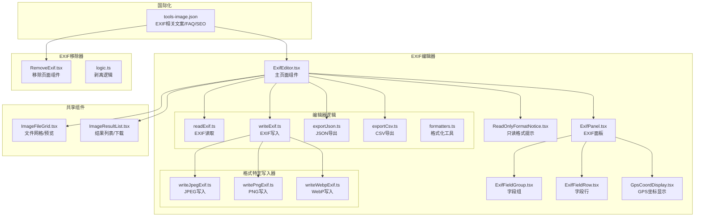
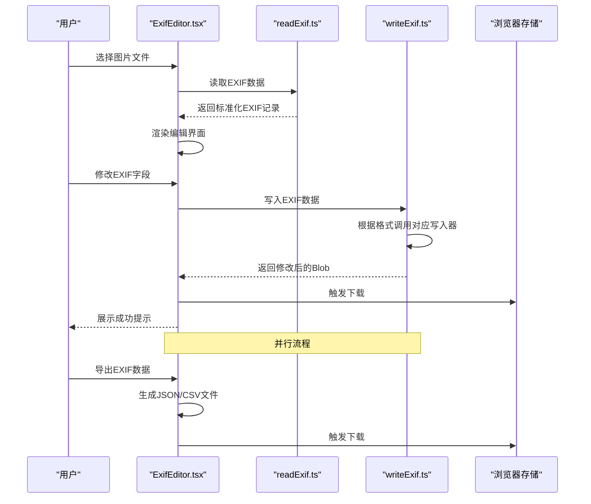
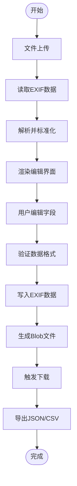
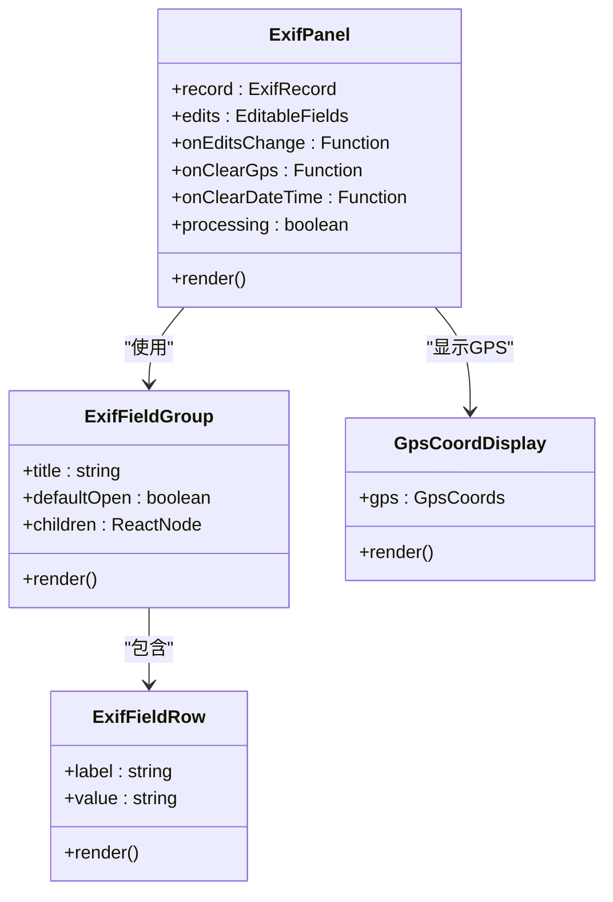
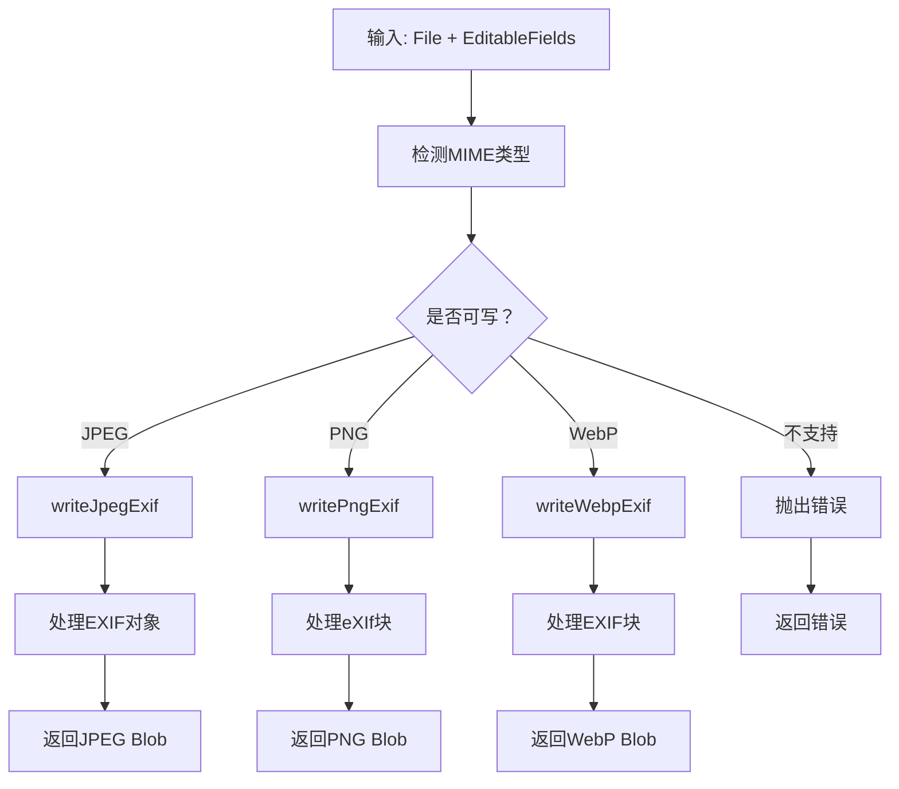
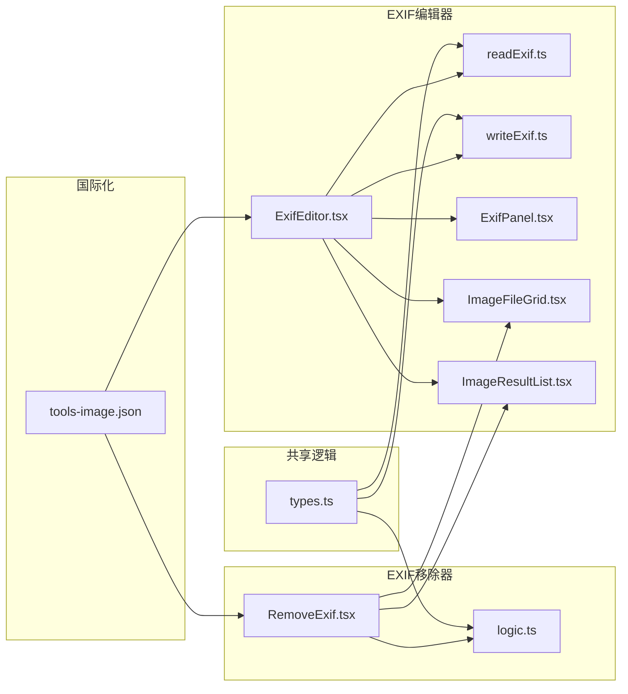

# EXIF管理

<cite>
**本文档引用的文件**
- [ExifEditor.tsx](file://src/tools/image/exif-editor/ExifEditor.tsx)
- [index.ts](file://src/tools/image/exif-editor/index.ts)
- [types.ts](file://src/tools/image/exif-editor/types.ts)
- [readExif.ts](file://src/tools/image/exif-editor/logic/readExif.ts)
- [writeExif.ts](file://src/tools/image/exif-editor/logic/writeExif.ts)
- [exportJson.ts](file://src/tools/image/exif-editor/logic/exportJson.ts)
- [exportCsv.ts](file://src/tools/image/exif-editor/logic/exportCsv.ts)
- [writeJpegExif.ts](file://src/tools/image/exif-editor/logic/writeJpegExif.ts)
- [writePngExif.ts](file://src/tools/image/exif-editor/logic/writePngExif.ts)
- [writeWebpExif.ts](file://src/tools/image/exif-editor/logic/writeWebpExif.ts)
- [ExifPanel.tsx](file://src/tools/image/exif-editor/components/ExifPanel.tsx)
- [ExifFieldGroup.tsx](file://src/tools/image/exif-editor/components/ExifFieldGroup.tsx)
- [ExifFieldRow.tsx](file://src/tools/image/exif-editor/components/ExifFieldRow.tsx)
- [GpsCoordDisplay.tsx](file://src/tools/image/exif-editor/components/GpsCoordDisplay.tsx)
- [ReadOnlyFormatNotice.tsx](file://src/tools/image/exif-editor/components/ReadOnlyFormatNotice.tsx)
- [formatters.ts](file://src/tools/image/exif-editor/logic/formatters.ts)
- [RemoveExif.tsx](file://src/tools/image/remove-exif/RemoveExif.tsx)
- [logic.ts](file://src/tools/image/remove-exif/logic.ts)
- [ImageResultList.tsx](file://src/components/shared/ImageResultList.tsx)
- [ImageFileGrid.tsx](file://src/components/shared/ImageFileGrid.tsx)
- [media-pipeline.ts](file://src/lib/media-pipeline.ts)
- [ffmpeg.ts](file://src/lib/ffmpeg.ts)
- [tools-image.json（英文）](file://messages/en/tools-image.json)
</cite>

## 更新摘要
**所做更改**
- 新增EXIF编辑器工具的完整功能分析，包括读取、编辑、写入、导出等核心能力
- 更新架构总览以反映EXIF编辑器与移除工具的双重EXIF管理方案
- 新增EXIF编辑器的组件层次结构和数据流分析
- 扩展EXIF信息结构说明，涵盖编辑器支持的所有字段类型
- 增加EXIF编辑器的用户界面和交互流程描述
- 更新性能考量，包括EXIF编辑器的处理效率和内存管理
- 新增EXIF编辑器的故障排除指南和最佳实践

## 目录
1. [简介](#简介)
2. [项目结构](#项目结构)
3. [核心组件](#核心组件)
4. [架构总览](#架构总览)
5. [详细组件分析](#详细组件分析)
6. [EXIF编辑器功能详解](#exif编辑器功能详解)
7. [依赖关系分析](#依赖关系分析)
8. [性能考量](#性能考量)
9. [故障排除指南](#故障排除指南)
10. [结论](#结论)
11. [附录](#附录)

## 简介
本文件面向EXIF管理工具，重点围绕EXIF编辑器和移除工具两大功能模块进行技术性说明。内容涵盖：
- EXIF数据的读取、解析、编辑、写入与导出机制
- EXIF信息的结构组成（拍摄参数、设备信息、地理位置、版权信息）
- 安全性与隐私保护措施
- EXIF信息查看与编辑的实用示例
- 编辑器对图像质量与文件大小的影响
- 备份与恢复方法
- 不同图像格式的支持差异与兼容性
- 标准化处理与元数据清理最佳实践
- 社交媒体与版权保护中的作用与注意事项

**更新** 新增EXIF编辑器工具的全面功能分析，提供比现有移除工具更丰富的元数据管理能力。

## 项目结构
EXIF管理功能包含两个主要工具：EXIF编辑器和EXIF移除器，采用"页面组件 + 业务逻辑 + 组件库 + 国际化 + 共享UI组件"的分层组织方式：
- EXIF编辑器：提供完整的元数据读取、编辑、写入和导出功能
- EXIF移除器：专注于EXIF元数据的剥离和清理
- 业务逻辑封装各格式的EXIF处理算法
- 组件库提供表单控件、面板布局和格式化工具
- 共享组件提供文件上传、预览与结果展示
- 国际化文件提供FAQ与SEO内容

**图表来源**
- [ExifEditor.tsx:1-304](file://src/tools/image/exif-editor/ExifEditor.tsx#L1-L304)
- [ExifPanel.tsx:1-271](file://src/tools/image/exif-editor/components/ExifPanel.tsx#L1-L271)
- [readExif.ts:1-146](file://src/tools/image/exif-editor/logic/readExif.ts#L1-L146)
- [writeExif.ts:1-44](file://src/tools/image/exif-editor/logic/writeExif.ts#L1-L44)
- [RemoveExif.tsx:1-95](file://src/tools/image/remove-exif/RemoveExif.tsx#L1-L95)
- [logic.ts:1-489](file://src/tools/image/remove-exif/logic.ts#L1-L489)

**章节来源**
- [ExifEditor.tsx:1-304](file://src/tools/image/exif-editor/ExifEditor.tsx#L1-L304)
- [index.ts:1-21](file://src/tools/image/exif-editor/index.ts#L1-L21)
- [types.ts:1-111](file://src/tools/image/exif-editor/types.ts#L1-L111)
- [ExifPanel.tsx:1-271](file://src/tools/image/exif-editor/components/ExifPanel.tsx#L1-L271)
- [readExif.ts:1-146](file://src/tools/image/exif-editor/logic/readExif.ts#L1-L146)
- [writeExif.ts:1-44](file://src/tools/image/exif-editor/logic/writeExif.ts#L1-L44)
- [RemoveExif.tsx:1-95](file://src/tools/image/remove-exif/RemoveExif.tsx#L1-L95)
- [logic.ts:1-489](file://src/tools/image/remove-exif/logic.ts#L1-L489)

## 核心组件
- **EXIF编辑器主组件**：负责文件选择、EXIF读取、编辑界面渲染、数据写入与导出功能
- **EXIF面板组件**：提供结构化的EXIF字段编辑界面，支持日期时间、GPS坐标、相机信息、版权信息等
- **格式特定写入器**：针对JPEG、PNG、WebP三种可写格式实现精确的EXIF数据写入
- **EXIF读取逻辑**：使用exifr库解析多种格式的EXIF数据，支持TIFF、EXIF、GPS、IPTC、XMP等标准
- **导出功能**：支持JSON和CSV格式的数据导出，便于备份和分析
- **EXIF移除器**：专注于EXIF元数据的剥离和清理，支持JPEG、PNG、WebP、AVIF四种格式

关键职责与行为：
- **EXIF编辑器**：提供完整的元数据生命周期管理，从读取到编辑再到写入和导出
- **EXIF移除器**：专注于元数据清理，提供精确的二进制级剥离算法
- **格式兼容性**：支持主流图像格式，包括现代格式如HEIC、AVIF、WebP等
- **用户交互**：提供直观的表单界面和实时预览功能

**章节来源**
- [ExifEditor.tsx:24-187](file://src/tools/image/exif-editor/ExifEditor.tsx#L24-L187)
- [ExifPanel.tsx:27-248](file://src/tools/image/exif-editor/components/ExifPanel.tsx#L27-L248)
- [readExif.ts:20-42](file://src/tools/image/exif-editor/logic/readExif.ts#L20-L42)
- [writeExif.ts:7-25](file://src/tools/image/exif-editor/logic/writeExif.ts#L7-L25)
- [RemoveExif.tsx:14-95](file://src/tools/image/remove-exif/RemoveExif.tsx#L14-L95)

## 架构总览
下图展示了EXIF编辑器和移除器两大工具从用户操作到最终结果的端到端流程：

**图表来源**
- [ExifEditor.tsx:55-119](file://src/tools/image/exif-editor/ExifEditor.tsx#L55-L119)
- [readExif.ts:20-42](file://src/tools/image/exif-editor/logic/readExif.ts#L20-L42)
- [writeExif.ts:7-25](file://src/tools/image/exif-editor/logic/writeExif.ts#L7-L25)

**章节来源**
- [ExifEditor.tsx:55-119](file://src/tools/image/exif-editor/ExifEditor.tsx#L55-L119)
- [readExif.ts:20-42](file://src/tools/image/exif-editor/logic/readExif.ts#L20-L42)
- [writeExif.ts:7-25](file://src/tools/image/exif-editor/logic/writeExif.ts#L7-L25)

## 详细组件分析

### 组件A：EXIF编辑器主页面组件
EXIF编辑器采用响应式设计，提供完整的元数据管理功能：
- **文件处理**：支持拖拽上传和点击选择，支持多种图像格式
- **EXIF读取**：异步读取并解析EXIF数据，提供标准化的字段映射
- **编辑界面**：动态生成可编辑的字段表单，支持GPS坐标和日期时间编辑
- **数据写入**：将修改后的EXIF数据写回到图像文件中
- **导出功能**：支持JSON和CSV格式的数据导出

**图表来源**
- [ExifEditor.tsx:55-119](file://src/tools/image/exif-editor/ExifEditor.tsx#L55-L119)

**章节来源**
- [ExifEditor.tsx:24-187](file://src/tools/image/exif-editor/ExifEditor.tsx#L24-L187)

### 组件B：EXIF面板组件
EXIF面板提供结构化的字段编辑界面，分为多个功能组：
- **日期时间组**：编辑拍摄时间、数字化时间和修改时间
- **GPS坐标组**：编辑经纬度坐标，支持清除功能
- **相机信息组**：编辑相机型号、镜头型号、制造商和软件信息
- **版权信息组**：编辑作者、版权信息、标题和描述
- **技术参数组**：显示ISO、光圈、快门速度、焦距等技术参数
- **IPTC信息组**：编辑标题和描述等IPTC标准字段

**图表来源**
- [ExifPanel.tsx:27-248](file://src/tools/image/exif-editor/components/ExifPanel.tsx#L27-L248)
- [ExifFieldGroup.tsx:7-39](file://src/tools/image/exif-editor/components/ExifFieldGroup.tsx#L7-L39)
- [ExifFieldRow.tsx:3-21](file://src/tools/image/exif-editor/components/ExifFieldRow.tsx#L3-L21)
- [GpsCoordDisplay.tsx:15-64](file://src/tools/image/exif-editor/components/GpsCoordDisplay.tsx#L15-L64)

**章节来源**
- [ExifPanel.tsx:27-248](file://src/tools/image/exif-editor/components/ExifPanel.tsx#L27-L248)
- [ExifFieldGroup.tsx:7-39](file://src/tools/image/exif-editor/components/ExifFieldGroup.tsx#L7-L39)
- [ExifFieldRow.tsx:3-21](file://src/tools/image/exif-editor/components/ExifFieldRow.tsx#L3-L21)
- [GpsCoordDisplay.tsx:15-64](file://src/tools/image/exif-editor/components/GpsCoordDisplay.tsx#L15-L64)

### 组件C：格式特定写入器
针对不同图像格式实现精确的EXIF数据写入：
- **JPEG写入器**：使用piexifjs库处理EXIF数据，支持完整的IFD结构
- **PNG写入器**：处理eXIf块，维护PNG文件结构和CRC校验
- **WebP写入器**：处理EXIF块和VP8X标志位，支持动画WebP格式

**图表来源**
- [writeExif.ts:7-25](file://src/tools/image/exif-editor/logic/writeExif.ts#L7-L25)
- [writeJpegExif.ts:18-34](file://src/tools/image/exif-editor/logic/writeJpegExif.ts#L18-L34)
- [writePngExif.ts:8-25](file://src/tools/image/exif-editor/logic/writePngExif.ts#L8-L25)
- [writeWebpExif.ts:17-32](file://src/tools/image/exif-editor/logic/writeWebpExif.ts#L17-L32)

**章节来源**
- [writeExif.ts:7-25](file://src/tools/image/exif-editor/logic/writeExif.ts#L7-L25)
- [writeJpegExif.ts:18-34](file://src/tools/image/exif-editor/logic/writeJpegExif.ts#L18-L34)
- [writePngExif.ts:8-25](file://src/tools/image/exif-editor/logic/writePngExif.ts#L8-L25)
- [writeWebpExif.ts:17-32](file://src/tools/image/exif-editor/logic/writeWebpExif.ts#L17-L32)

## EXIF编辑器功能详解

### EXIF读取与解析
EXIF编辑器使用exifr库进行深度解析，支持多种元数据标准：
- **TIFF标签**：基础图像属性和配置信息
- **EXIF标签**：拍摄参数和技术规格
- **GPS标签**：地理位置和海拔信息
- **IPTC标签**：版权和描述信息
- **XMP标签**：扩展元数据标准

解析过程包括数据类型转换、值规范化和多语言支持。

### EXIF字段编辑界面
编辑器提供直观的字段编辑界面，支持以下功能：
- **日期时间编辑**：使用datetime-local输入控件
- **GPS坐标编辑**：支持十进制度数和清除功能
- **文本字段编辑**：支持相机型号、镜头型号、作者、版权等
- **格式化显示**：技术参数自动格式化显示

### 数据导出功能
支持两种导出格式：
- **JSON格式**：完整的原始数据结构，便于程序处理
- **CSV格式**：扁平化的键值对格式，便于表格处理

**章节来源**
- [readExif.ts:5-42](file://src/tools/image/exif-editor/logic/readExif.ts#L5-L42)
- [ExifPanel.tsx:61-244](file://src/tools/image/exif-editor/components/ExifPanel.tsx#L61-L244)
- [exportJson.ts:3-17](file://src/tools/image/exif-editor/logic/exportJson.ts#L3-L17)
- [exportCsv.ts:3-16](file://src/tools/image/exif-editor/logic/exportCsv.ts#L3-L16)

## 依赖关系分析
EXIF编辑器和移除器共享相同的架构模式，但功能侧重点不同：
- **EXIF编辑器**：依赖exifr进行读取，piexifjs进行写入，提供完整的元数据管理
- **EXIF移除器**：独立实现剥离逻辑，专注于元数据清理
- **共享组件**：文件网格、结果列表等UI组件
- **工具注册**：统一的工具定义和SEO配置

**图表来源**
- [ExifEditor.tsx:12-22](file://src/tools/image/exif-editor/ExifEditor.tsx#L12-L22)
- [RemoveExif.tsx:3-11](file://src/tools/image/remove-exif/RemoveExif.tsx#L3-L11)
- [types.ts:1-111](file://src/tools/image/exif-editor/types.ts#L1-L111)

**章节来源**
- [ExifEditor.tsx:12-22](file://src/tools/image/exif-editor/ExifEditor.tsx#L12-L22)
- [RemoveExif.tsx:3-11](file://src/tools/image/remove-exif/RemoveExif.tsx#L3-L11)
- [types.ts:1-111](file://src/tools/image/exif-editor/types.ts#L1-L111)

## 性能考量
EXIF编辑器和移除器都注重性能优化：
- **EXIF编辑器**：
  - 异步处理，避免阻塞UI线程
  - 智能缓存和内存管理
  - 格式特定的高效写入算法
- **EXIF移除器**：
  - 浏览器内纯前端处理
  - 逐文件顺序处理，避免内存抖动
  - 精确的二进制操作，最小化数据复制

两者都提供实时进度反馈和错误处理机制。

**章节来源**
- [ExifEditor.tsx:55-74](file://src/tools/image/exif-editor/ExifEditor.tsx#L55-L74)
- [RemoveExif.tsx:22-48](file://src/tools/image/remove-exif/RemoveExif.tsx#L22-L48)

## 故障排除指南
**EXIF编辑器常见问题**：
- **文件格式不支持**：检查文件类型是否在支持列表中
- **EXIF数据读取失败**：确认文件包含有效的EXIF数据
- **写入失败**：检查目标格式是否支持EXIF写入
- **GPS坐标无效**：确保经纬度在有效范围内

**EXIF移除器常见问题**：
- **文件未被处理**：检查文件类型是否受支持
- **图像质量变化**：JPEG可能因重编码略有差异
- **下载失败**：确认浏览器允许下载和弹窗

**章节来源**
- [ExifEditor.tsx:100-119](file://src/tools/image/exif-editor/ExifEditor.tsx#L100-L119)
- [RemoveExif.tsx:37-44](file://src/tools/image/remove-exif/RemoveExif.tsx#L37-L44)

## 结论
EXIF编辑器和移除器共同构成了完整的EXIF管理解决方案。EXIF编辑器提供全面的元数据管理能力，包括读取、编辑、写入和导出功能；EXIF移除器专注于元数据清理和隐私保护。两者都采用纯前端实现，确保用户隐私和数据安全，为用户提供直观、高效、可靠的EXIF管理体验。

## 附录

### EXIF信息结构与组成
EXIF编辑器支持的字段类型：
- **基本属性**：文件名、MIME类型、文件大小
- **拍摄参数**：ISO、光圈、快门速度、焦距、白平衡
- **设备信息**：相机制造商、型号、软件版本、镜头信息
- **地理位置**：GPS纬度、经度、海拔
- **时间信息**：拍摄时间、数字化时间、修改时间
- **版权信息**：作者、版权、标题、描述
- **技术参数**：方向、色彩空间、图像尺寸

**章节来源**
- [types.ts:7-41](file://src/tools/image/exif-editor/types.ts#L7-L41)
- [readExif.ts:60-91](file://src/tools/image/exif-editor/logic/readExif.ts#L60-L91)

### 安全性与隐私保护
- **本地处理**：所有操作在浏览器内完成，避免上传到服务器
- **隐私保护**：可选择性清除GPS坐标、时间戳等敏感信息
- **数据安全**：支持数据导出以便备份和审计
- **格式限制**：只对支持的格式进行写入操作

**章节来源**
- [tools-image.json（英文）:282-293](file://messages/en/tools-image.json#L282-L293)

### 实用示例
- **查看EXIF**：上传图片后自动解析并显示所有可用字段
- **编辑EXIF**：在相应字段中输入或修改信息，支持GPS坐标和日期时间编辑
- **导出数据**：支持JSON和CSV格式导出，便于备份和分析
- **批量处理**：结合文件网格组件进行多文件处理

**章节来源**
- [ExifPanel.tsx:61-244](file://src/tools/image/exif-editor/components/ExifPanel.tsx#L61-L244)
- [exportJson.ts:3-17](file://src/tools/image/exif-editor/logic/exportJson.ts#L3-L17)
- [exportCsv.ts:3-16](file://src/tools/image/exif-editor/logic/exportCsv.ts#L3-L16)

### 对图像质量与文件大小的影响
- **EXIF编辑器**：写入操作可能产生轻微的质量变化，但通常可忽略
- **EXIF移除器**：
  - JPEG：重编码质量接近原图，视觉差异极小
  - PNG：无损重导出，质量与体积均保持稳定
  - WebP/AVIF：剥离元数据后通常体积减小，不影响像素质量

**章节来源**
- [tools-image.json（英文）:285-287](file://messages/en/tools-image.json#L285-L287)

### 备份与恢复
- **EXIF编辑器**：支持JSON和CSV格式导出，便于数据备份
- **EXIF移除器**：提供原文件备份选项，支持恢复操作
- **恢复方法**：使用备份文件或重新嵌入元数据

**章节来源**
- [exportJson.ts:3-17](file://src/tools/image/exif-editor/logic/exportJson.ts#L3-L17)
- [exportCsv.ts:3-16](file://src/tools/image/exif-editor/logic/exportCsv.ts#L3-L16)

### 不同图像格式的支持差异与兼容性
- **EXIF编辑器支持**：JPEG、PNG、WebP、HEIC、HEIF、AVIF、TIFF
- **EXIF移除器支持**：JPEG、PNG、WebP、AVIF
- **写入权限**：仅对JPEG、PNG、WebP提供EXIF写入功能
- **只读格式**：HEIC、HEIF、AVIF、TIFF仅支持读取和导出

**章节来源**
- [types.ts:55-74](file://src/tools/image/exif-editor/types.ts#L55-L74)
- [logic.ts:14-446](file://src/tools/image/remove-exif/logic.ts#L14-L446)

### 标准化处理与元数据清理最佳实践
- **EXIF编辑器**：提供标准化的字段映射和格式化显示
- **EXIF移除器**：提供精确的二进制级剥离算法
- **隐私保护**：优先在本地完成元数据清理
- **批量处理**：记录处理日志，便于审计和回溯

**章节来源**
- [formatters.ts:1-92](file://src/tools/image/exif-editor/logic/formatters.ts#L1-L92)

### 社交媒体与版权保护中的作用与注意事项
- **社交媒体**：发布前剥离GPS与时间戳，防止位置泄露
- **版权保护**：EXIF中可能包含软件信息与作者信息
- **合规要求**：遵循平台政策与法律法规
- **数据导出**：支持导出以便合规审计

**章节来源**
- [tools-image.json（英文）:282-293](file://messages/en/tools-image.json#L282-L293)