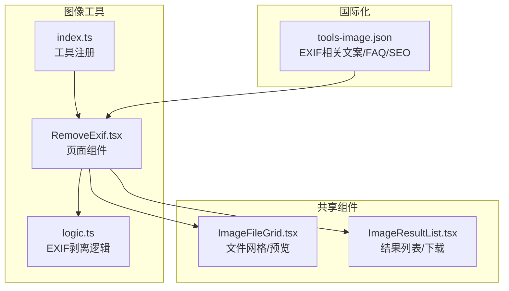
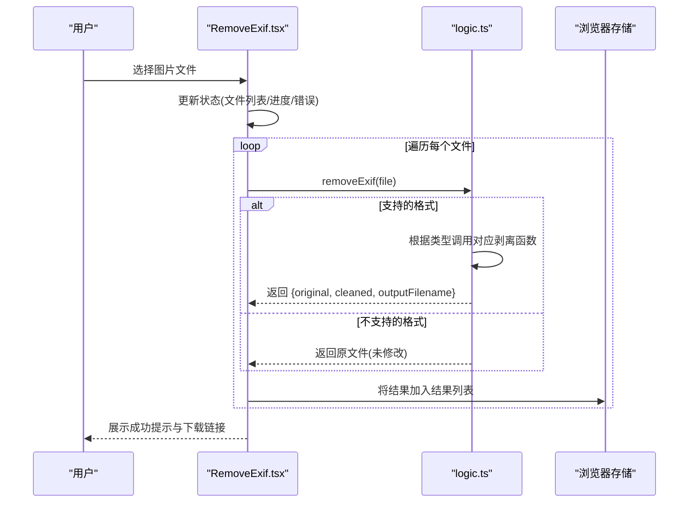
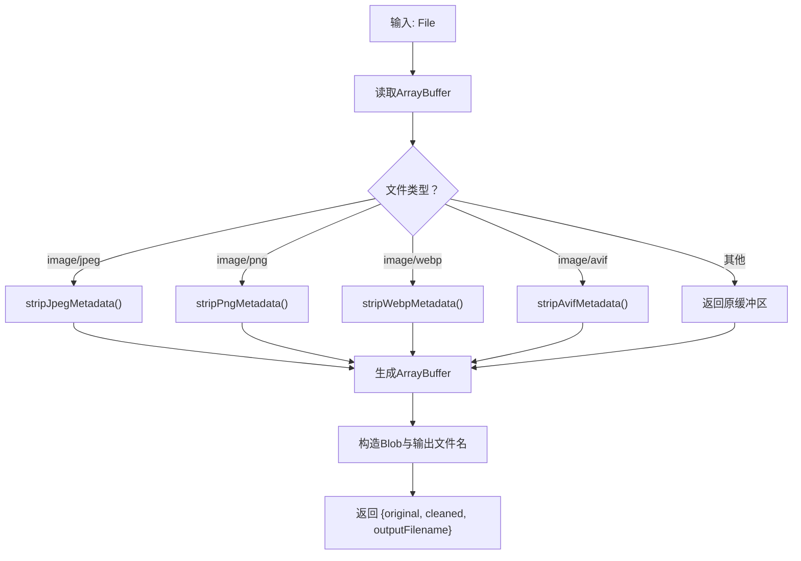
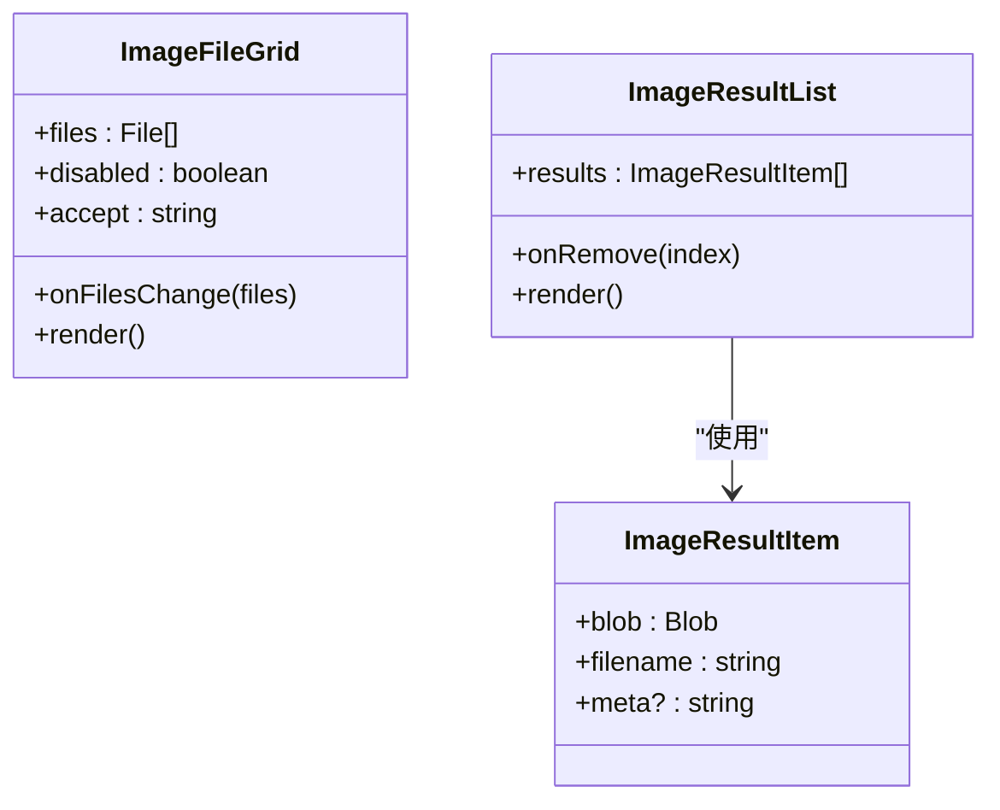
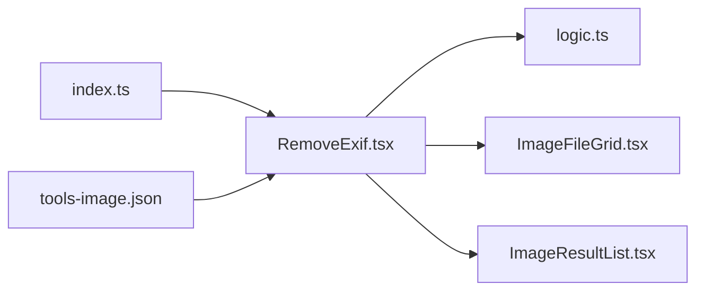

# EXIF管理

<cite>
**本文档引用的文件**
- [RemoveExif.tsx](file://src/tools/image/remove-exif/RemoveExif.tsx)
- [logic.ts](file://src/tools/image/remove-exif/logic.ts)
- [index.ts](file://src/tools/image/remove-exif/index.ts)
- [tools-image.json（英文）](file://messages/en/tools-image.json)
- [ImageResultList.tsx](file://src/components/shared/ImageResultList.tsx)
- [ImageFileGrid.tsx](file://src/components/shared/ImageFileGrid.tsx)
- [media-pipeline.ts](file://src/lib/media-pipeline.ts)
- [ffmpeg.ts](file://src/lib/ffmpeg.ts)
</cite>

## 目录
1. [简介](#简介)
2. [项目结构](#项目结构)
3. [核心组件](#核心组件)
4. [架构总览](#架构总览)
5. [详细组件分析](#详细组件分析)
6. [依赖关系分析](#依赖关系分析)
7. [性能考量](#性能考量)
8. [故障排除指南](#故障排除指南)
9. [结论](#结论)
10. [附录](#附录)

## 简介
本文件面向EXIF管理工具，重点围绕RemoveExif组件的工作原理进行技术性说明。内容涵盖：
- EXIF数据的读取、解析与移除机制
- EXIF信息的结构组成（拍摄参数、设备信息、地理位置）
- 安全性与隐私保护措施
- EXIF信息查看与编辑的实用示例
- 移除EXIF对图像质量与文件大小的影响
- 备份与恢复方法
- 不同图像格式的支持差异与兼容性
- 标准化处理与元数据清理最佳实践
- 社交媒体与版权保护中的作用与注意事项

## 项目结构
EXIF移除功能位于图像工具模块中，采用“页面组件 + 业务逻辑 + 国际化 + 共享UI组件”的分层组织方式：
- 页面组件负责用户交互与状态管理
- 业务逻辑封装各格式的EXIF剥离算法
- 共享组件提供文件上传、预览与结果展示
- 国际化文件提供FAQ与SEO内容

**图表来源**
- [RemoveExif.tsx:1-95](file://src/tools/image/remove-exif/RemoveExif.tsx#L1-L95)
- [logic.ts:1-489](file://src/tools/image/remove-exif/logic.ts#L1-L489)
- [index.ts:1-37](file://src/tools/image/remove-exif/index.ts#L1-L37)
- [ImageFileGrid.tsx:1-226](file://src/components/shared/ImageFileGrid.tsx#L1-L226)
- [ImageResultList.tsx:1-141](file://src/components/shared/ImageResultList.tsx#L1-L141)
- [tools-image.json（英文）:273-316](file://messages/en/tools-image.json#L273-L316)

**章节来源**
- [RemoveExif.tsx:1-95](file://src/tools/image/remove-exif/RemoveExif.tsx#L1-L95)
- [logic.ts:1-489](file://src/tools/image/remove-exif/logic.ts#L1-L489)
- [index.ts:1-37](file://src/tools/image/remove-exif/index.ts#L1-L37)
- [ImageFileGrid.tsx:1-226](file://src/components/shared/ImageFileGrid.tsx#L1-L226)
- [ImageResultList.tsx:1-141](file://src/components/shared/ImageResultList.tsx#L1-L141)
- [tools-image.json（英文）:273-316](file://messages/en/tools-image.json#L273-L316)

## 核心组件
- RemoveExif页面组件：负责文件选择、进度显示、错误收集与结果展示；调用剥离逻辑并生成可下载的Blob。
- 剥离逻辑模块：针对JPEG、PNG、WebP、AVIF四种主流格式实现二进制级的元数据移除策略。
- 结果与文件网格：提供拖拽上传、批量预览、缩略图展示与一键下载。

关键职责与行为：
- 输入校验与进度追踪：确保每次处理单个文件，维护done/total进度。
- 错误处理：捕获异常并累积错误消息，避免中断整体流程。
- 输出构建：根据原文件类型与剥离结果生成新的Blob与输出文件名。

**章节来源**
- [RemoveExif.tsx:14-95](file://src/tools/image/remove-exif/RemoveExif.tsx#L14-L95)
- [logic.ts:450-489](file://src/tools/image/remove-exif/logic.ts#L450-L489)
- [ImageResultList.tsx:16-78](file://src/components/shared/ImageResultList.tsx#L16-L78)

## 架构总览
下图展示了从用户操作到最终结果的端到端流程，以及各格式的剥离策略：

**图表来源**
- [RemoveExif.tsx:22-48](file://src/tools/image/remove-exif/RemoveExif.tsx#L22-L48)
- [logic.ts:450-489](file://src/tools/image/remove-exif/logic.ts#L450-L489)

**章节来源**
- [RemoveExif.tsx:22-48](file://src/tools/image/remove-exif/RemoveExif.tsx#L22-L48)
- [logic.ts:450-489](file://src/tools/image/remove-exif/logic.ts#L450-L489)

## 详细组件分析

### 组件A：RemoveExif页面组件
- 负责文件网格交互、处理按钮状态、进度条与错误聚合。
- 调用剥离逻辑，将返回的Blob与文件名组合为结果项。
- 使用共享组件渲染结果列表，并提供下载与移除功能。

**图表来源**
- [RemoveExif.tsx:22-48](file://src/tools/image/remove-exif/RemoveExif.tsx#L22-L48)

**章节来源**
- [RemoveExif.tsx:14-95](file://src/tools/image/remove-exif/RemoveExif.tsx#L14-L95)

### 组件B：剥离逻辑模块（按格式）
剥离逻辑针对四类图像格式分别实现：
- JPEG：扫描SOI/SOS标记段，保留SOI与SOS之前/之后的必要部分，移除APP1-APP15与COM段（保留ICC Profile）。
- PNG：扫描PNG签名，识别tEXt/zTXt/iTXt/eXIf/tIME/iCCP/dSIG等块，移除元数据块后重建文件。
- WebP：识别RIFF头与VP8X/EXIF/XMP块，移除EXIF/XMP并清空VP8X标志位，更新RIFF大小。
- AVIF（ISO BMFF）：解析顶层box，定位meta/iinf/iloc，识别Exif/mime项ID，零填充其数据区域以保持容器结构不变。

**图表来源**
- [logic.ts:450-489](file://src/tools/image/remove-exif/logic.ts#L450-L489)

**章节来源**
- [logic.ts:14-489](file://src/tools/image/remove-exif/logic.ts#L14-L489)

### 组件C：共享UI组件
- ImageFileGrid：支持拖拽/点击添加文件，生成缩略图URL缓存，异步加载尺寸信息，提供预览与删除。
- ImageResultList：基于Blob生成对象URL，提供缩略图、下载与移除功能，自动清理过期URL。

**图表来源**
- [ImageFileGrid.tsx:10-78](file://src/components/shared/ImageFileGrid.tsx#L10-L78)
- [ImageResultList.tsx:10-78](file://src/components/shared/ImageResultList.tsx#L10-L78)

**章节来源**
- [ImageFileGrid.tsx:1-226](file://src/components/shared/ImageFileGrid.tsx#L1-L226)
- [ImageResultList.tsx:1-141](file://src/components/shared/ImageResultList.tsx#L1-L141)

## 依赖关系分析
- RemoveExif依赖剥离逻辑模块与共享UI组件。
- 剥离逻辑内部不依赖外部库，直接通过ArrayBuffer/DataView进行二进制解析与重组。
- 工具注册文件定义了工具的分类、图标、SEO与FAQ键值，便于统一管理。

**图表来源**
- [RemoveExif.tsx:1-13](file://src/tools/image/remove-exif/RemoveExif.tsx#L1-L13)
- [index.ts:1-37](file://src/tools/image/remove-exif/index.ts#L1-L37)

**章节来源**
- [RemoveExif.tsx:1-13](file://src/tools/image/remove-exif/RemoveExif.tsx#L1-L13)
- [index.ts:1-37](file://src/tools/image/remove-exif/index.ts#L1-L37)

## 性能考量
- 浏览器内处理：所有操作在客户端完成，避免网络传输与服务器开销。
- 内存管理：剥离逻辑尽量复用缓冲区，仅在需要时复制（如AVIF零填充），并在生成Blob后返回，减少峰值内存占用。
- 批量处理：逐个文件顺序处理，避免并发导致的内存抖动。
- 进度反馈：实时更新done/total，提升用户体验。

[本节为通用性能讨论，无需特定文件来源]

## 故障排除指南
常见问题与建议：
- 文件未被处理或无结果
  - 检查文件类型是否受支持（JPEG/PNG/WebP/AVIF）。
  - 查看错误面板中的具体错误信息，逐个排查失败文件。
- 图像质量变化
  - JPEG可能因重编码略有差异；PNG为无损重导出。
- 文件大小变化
  - 移除EXIF通常会减小文件体积（取决于元数据密度）。
- 下载失败
  - 确认浏览器允许下载与弹窗；检查对象URL是否被及时释放。

**章节来源**
- [RemoveExif.tsx:37-44](file://src/tools/image/remove-exif/RemoveExif.tsx#L37-L44)
- [tools-image.json（英文）:282-293](file://messages/en/tools-image.json#L282-L293)

## 结论
RemoveExif组件通过纯前端实现，针对主流图像格式提供精确的EXIF剥离能力。其设计强调隐私保护、性能与可用性，适合在浏览器内完成元数据清理与隐私加固。结合共享UI组件与国际化内容，为用户提供直观、安全、高效的EXIF管理体验。

[本节为总结性内容，无需特定文件来源]

## 附录

### EXIF信息结构与组成
- 拍摄参数：ISO、光圈、快门速度、焦距、白平衡、闪光灯等
- 设备信息：相机型号、镜头信息、固件版本
- 地理位置：GPS坐标（纬度/经度/海拔）、拍摄时间戳
- 其他：软件版本、色彩配置文件、缩略图等

[本节为概念性说明，无需特定文件来源]

### 安全性与隐私保护
- 在浏览器内完成处理，避免上传至服务器
- 剥离EXIF可有效去除GPS、时间戳等敏感信息
- 对ICC配置文件的保留策略需谨慎评估（部分场景用于色彩管理）

**章节来源**
- [tools-image.json（英文）:282-293](file://messages/en/tools-image.json#L282-L293)

### 实用示例
- 查看EXIF：使用图像查看器或在线工具检查目标图片的元数据字段
- 编辑EXIF：可先备份原图，再进行编辑（见“备份与恢复”）
- 批量处理：在文件网格中一次性选择多张图片，统一执行剥离

[本节为概念性说明，无需特定文件来源]

### 对图像质量与文件大小的影响
- JPEG：重编码质量接近原图，视觉差异极小
- PNG：无损重导出，质量与体积均保持稳定
- WebP/AVIF：剥离元数据后通常体积减小，不影响像素质量

**章节来源**
- [tools-image.json（英文）:285-287](file://messages/en/tools-image.json#L285-L287)

### 备份与恢复
- 备份：在剥离前保存原始文件副本
- 恢复：若需回退，直接使用备份文件；若需重新嵌入元数据，可在本地使用专业工具进行写回（注意格式差异与兼容性）

[本节为概念性说明，无需特定文件来源]

### 不同图像格式的支持差异与兼容性
- JPEG：广泛支持，APP段与COM段剥离成熟
- PNG：tEXt/iTXt/eXIf等块可直接识别与移除
- WebP：EXIF/XMP位于VP8X容器内，需更新标志位与RIFF大小
- AVIF：ISO BMFF容器复杂，需解析iinf/iloc定位元数据项并零填充

**章节来源**
- [logic.ts:14-446](file://src/tools/image/remove-exif/logic.ts#L14-L446)

### 标准化处理与元数据清理最佳实践
- 优先在本地完成元数据清理，避免上传含敏感信息的图片
- 对于需要保留色彩一致性的场景，谨慎处理ICC配置文件
- 批量处理时记录日志，便于审计与回溯

[本节为通用实践建议，无需特定文件来源]

### 社交媒体与版权保护中的作用与注意事项
- 社交平台：发布前剥离GPS与时间戳，防止位置泄露
- 版权保护：EXIF中可能包含软件信息与作者信息，发布时需权衡透明度与隐私
- 合规要求：遵循平台政策与法律法规，避免违规传播

**章节来源**
- [tools-image.json（英文）:282-293](file://messages/en/tools-image.json#L282-L293)