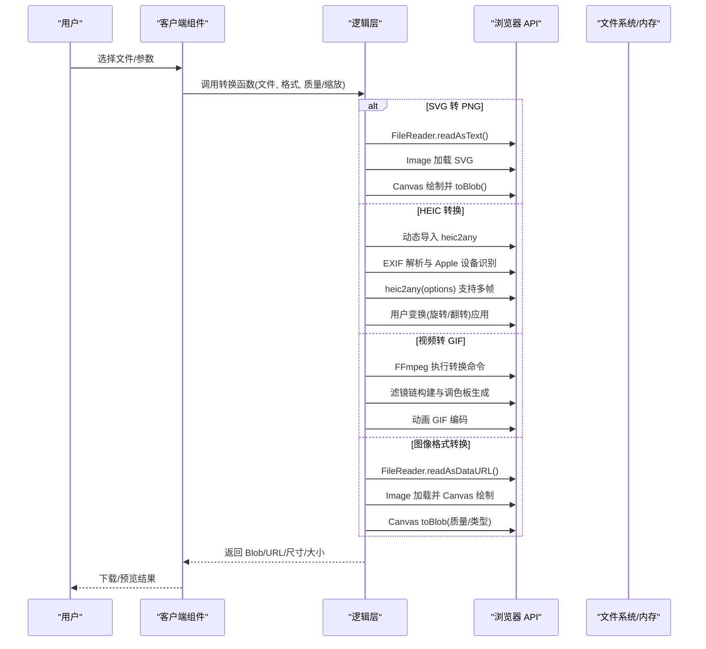
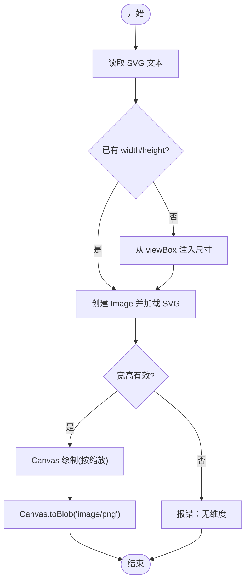
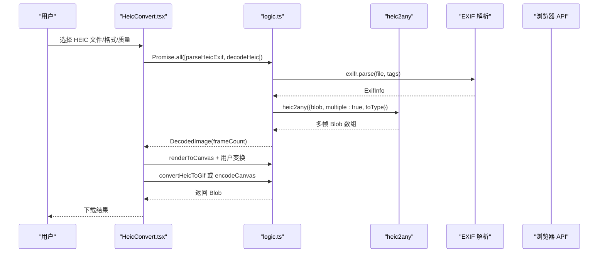
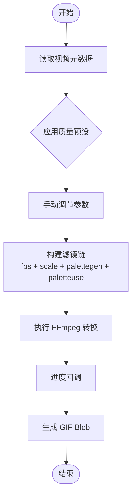
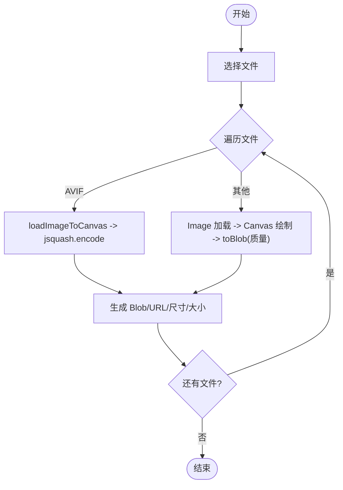
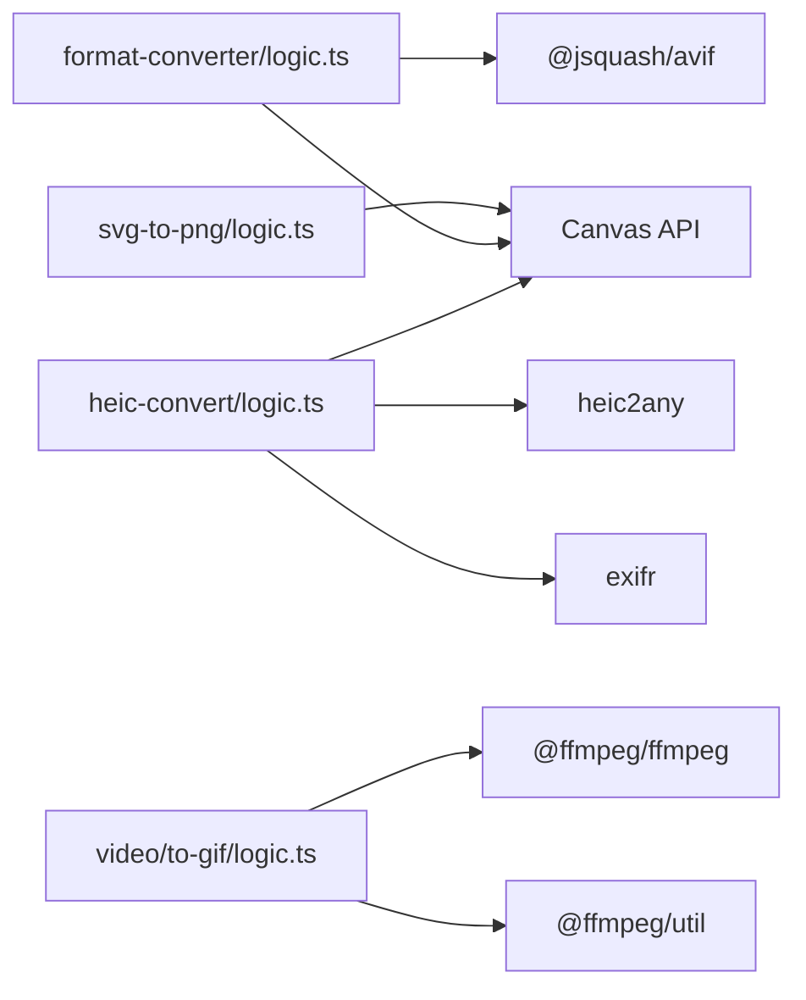

# 专用转换

<cite>
**本文引用的文件**
- [README.md](file://README.md)
- [package.json](file://package.json)
- [src/tools/image/format-converter/logic.ts](file://src/tools/image/format-converter/logic.ts)
- [src/tools/image/format-converter/FormatConverter.tsx](file://src/tools/image/format-converter/FormatConverter.tsx)
- [src/tools/image/svg-to-png/logic.ts](file://src/tools/image/svg-to-png/logic.ts)
- [src/tools/image/svg-to-png/SvgToPng.tsx](file://src/tools/image/svg-to-png/SvgToPng.tsx)
- [src/tools/image/heic-convert/logic.ts](file://src/tools/image/heic-convert/logic.ts)
- [src/tools/image/heic-convert/HeicConvert.tsx](file://src/tools/image/heic-convert/HeicConvert.tsx)
- [src/tools/video/to-gif/logic.ts](file://src/tools/video/to-gif/logic.ts)
- [src/tools/video/to-gif/VideoToGif.tsx](file://src/tools/video/to-gif/VideoToGif.tsx)
- [src/lib/media-pipeline.ts](file://src/lib/media-pipeline.ts)
- [src/lib/ffmpeg.ts](file://src/lib/ffmpeg.ts)
- [messages/zh-Hans/tools-image.json](file://messages/zh-Hans/tools-image.json)
- [messages/en/tools-image.json](file://messages/en/tools-image.json)
</cite>

## 更新摘要
**所做更改**
- 新增 HEIC 转换器重大功能增强：EXIF自动方向校正、Apple设备识别、手动旋转翻转、GIF动画输出、Burst连拍检测
- 更新HEIC转换章节以反映新增的智能EXIF处理和动画输出功能
- 扩展专用转换工具为支持多格式输出的综合转换平台
- 新增视频到 GIF 转换功能，提供完整的多媒体转换解决方案

## 目录
1. [简介](#简介)
2. [项目结构](#项目结构)
3. [核心组件](#核心组件)
4. [架构总览](#架构总览)
5. [组件详解](#组件详解)
6. [依赖关系分析](#依赖关系分析)
7. [性能考量](#性能考量)
8. [故障排除指南](#故障排除指南)
9. [结论](#结论)
10. [附录](#附录)

## 简介
本文件面向"专用转换"工具，现已发展为支持多格式输出的综合转换平台，聚焦四大核心能力：
- SVG 到 PNG 的矢量到光栅转换
- HEIC/HEIF 到通用格式（JPG/PNG/GIF）的智能转换与动画支持
- 视频到 GIF 的高质量动画面转换
- 图像格式批量转换与质量控制

文档从架构、实现原理、数据流、性能优化、跨平台兼容性、参数配置与质量设置、应用场景与故障排除等方面进行全面阐述，帮助开发者与使用者理解并高效使用这些工具。

## 项目结构
专用转换工具位于图片工具模块中，现已扩展为支持多格式输出的综合转换平台，采用"逻辑层 + 客户端组件"的分层设计：
- 逻辑层：纯函数封装转换算法与质量控制
- 客户端组件：负责 UI、参数绑定、错误提示与结果展示
- 基础设施：媒体管道与 FFmpeg 封装（用于视频/音频等其他工具，但为统一架构提供参考）

```mermaid
graph TB
subgraph "图片工具"
FC["格式转换<br/>logic.ts + FormatConverter.tsx"]
SVG["SVG 转 PNG<br/>logic.ts + SvgToPng.tsx"]
HEIC["HEIC 转换<br/>logic.ts + HeicConvert.tsx"]
END
subgraph "视频工具"
GIF["视频转 GIF<br/>logic.ts + VideoToGif.tsx"]
END
subgraph "基础设施"
MP["媒体管道<br/>media-pipeline.ts"]
FF["FFmpeg 封装<br/>ffmpeg.ts"]
END
FC --> MP
SVG --> MP
HEIC --> MP
GIF --> FF
FC --> FF
SVG --> FF
HEIC --> FF
```

**图表来源**
- [src/tools/image/format-converter/FormatConverter.tsx:18-135](file://src/tools/image/format-converter/FormatConverter.tsx#L18-L135)
- [src/tools/image/svg-to-png/SvgToPng.tsx:13-86](file://src/tools/image/svg-to-png/SvgToPng.tsx#L13-L86)
- [src/tools/image/heic-convert/HeicConvert.tsx:13-419](file://src/tools/image/heic-convert/HeicConvert.tsx#L13-L419)
- [src/tools/video/to-gif/VideoToGif.tsx:1-220](file://src/tools/video/to-gif/VideoToGif.tsx#L1-L220)
- [src/lib/media-pipeline.ts:7-175](file://src/lib/media-pipeline.ts#L7-L175)
- [src/lib/ffmpeg.ts:10-144](file://src/lib/ffmpeg.ts#L10-L144)

**章节来源**
- [README.md: 55-78:55-78](file://README.md#L55-L78)
- [package.json: 11-32:11-32](file://package.json#L11-L32)

## 核心组件
- 图像格式转换（PNG/JPG/WebP/AVIF/ICO）
  - 支持质量控制（JPG/WebP/AVIF），ICO 自动缩放至最大 256×256
  - 使用 Canvas API 进行位图生成，AVIF 使用 jsquash 编码
- SVG 转 PNG
  - 自动注入 viewBox 维度，支持 1x~4x 缩放
  - 使用 Canvas API 渲染并导出 PNG
- HEIC 转换（**重大增强**）
  - 基于 heic2any，支持 JPG/PNG/GIF 输出与质量控制（JPG）
  - **智能 EXIF 分析与自动方向校正**：解析 Make、Model、Software、Orientation、DateTimeOriginal 等信息，自动应用 EXIF 方向标签
  - **Apple 设备识别**：自动检测 iPhone、iPad 等 Apple 设备拍摄的照片，显示设备型号和 iOS 版本
  - **手动旋转翻转**：支持 90° 步进旋转、水平/垂直翻转，叠加在自动方向校正之上
  - **Burst 连拍检测**：自动检测 iPhone 连拍帧数，提供 Burst 标识和动画 GIF 输出选项
  - **GIF 动画输出**：当检测到多帧时，可直接转换为 GIF 动画
- 视频转 GIF（**新增功能**）
  - 基于 FFmpeg 的高质量动画面转换
  - 支持 FPS、尺寸、时间范围等参数调节
  - 提供小、平衡、高质量三种预设

**章节来源**
- [src/tools/image/format-converter/logic.ts: 1-161:1-161](file://src/tools/image/format-converter/logic.ts#L1-L161)
- [src/tools/image/svg-to-png/logic.ts: 1-60:1-60](file://src/tools/image/svg-to-png/logic.ts#L1-L60)
- [src/tools/image/heic-convert/logic.ts: 1-201:1-201](file://src/tools/image/heic-convert/logic.ts#L1-L201)
- [src/tools/video/to-gif/logic.ts: 1-57:1-57](file://src/tools/video/to-gif/logic.ts#L1-L57)

## 架构总览
专用转换工具现已发展为支持多格式输出的综合转换平台，遵循"纯逻辑 + 客户端 UI"的分层架构：
- 逻辑层：集中处理转换算法、质量控制、格式映射与错误处理
- UI 层：绑定参数（格式、质量、缩放）、展示进度与结果
- 基础设施：媒体管道与 FFmpeg 封装（为视频工具提供支持）



**图表来源**
- [src/tools/image/svg-to-png/logic.ts: 1-60:1-60](file://src/tools/image/svg-to-png/logic.ts#L1-L60)
- [src/tools/image/heic-convert/logic.ts: 69-97:69-97](file://src/tools/image/heic-convert/logic.ts#L69-L97)
- [src/tools/video/to-gif/logic.ts: 13-42:13-42](file://src/tools/video/to-gif/logic.ts#L13-L42)

## 组件详解

### SVG 到 PNG 转换
- 实现要点
  - 读取 SVG 文本，若缺少 width/height 且存在 viewBox，则自动注入尺寸，保证  具备内在尺寸
  - 使用 Image 加载 SVG，再以 Canvas 绘制并按缩放比例导出 PNG
  - 错误处理：无尺寸、加载失败、Canvas 失败等
- 参数配置
  - 缩放比例：1x、2x、3x、4x
- 质量控制
  - 输出为 PNG，无质量参数；缩放越高，文件体积越大
- 兼容性
  - 依赖浏览器内置 SVG 渲染引擎；外部资源/字体可能不完全渲染
- 性能
  - 仅在浏览器端进行，避免网络传输；Canvas 绘制与 toBlob 为同步阻塞，建议控制单次文件大小



**图表来源**
- [src/tools/image/svg-to-png/logic.ts: 1-60:1-60](file://src/tools/image/svg-to-png/logic.ts#L1-L60)

**章节来源**
- [src/tools/image/svg-to-png/logic.ts: 1-60:1-60](file://src/tools/image/svg-to-png/logic.ts#L1-L60)
- [src/tools/image/svg-to-png/SvgToPng.tsx: 13-86:13-86](file://src/tools/image/svg-to-png/SvgToPng.tsx#L13-L86)
- [messages/zh-Hans/tools-image.json: 537-579:537-579](file://messages/zh-Hans/tools-image.json#L537-L579)

### HEIC 转换（**重大增强**）
- 实现要点
  - 动态导入 heic2any，支持多帧输出检测
  - **智能 EXIF 分析**：解析 Make、Model、Software、Orientation、DateTimeOriginal 等信息，自动应用 EXIF 方向标签
  - **Apple 设备识别**：自动检测 iPhone、iPad 等 Apple 设备拍摄的照片，显示设备型号和 iOS 版本
  - **手动旋转翻转**：支持 90° 步进旋转、水平/垂直翻转，叠加在自动方向校正之上
  - **Burst 连拍检测**：自动检测 iPhone 连拍帧数，提供 Burst 标识
  - **GIF 动画输出**：当检测到多帧时，可直接转换为 GIF 动画
  - 支持输出 JPG/PNG/GIF，JPG 可调节质量
- 新增功能
  - **EXIF自动方向校正**：读取 EXIF Orientation 标签并应用到像素，与 Apple Photos 显示一致
  - **Apple设备识别**：自动检测 iPhone、iPad 等 Apple 设备，显示设备型号和 iOS 版本
  - **手动旋转翻转**：支持 90° 步进旋转、水平/垂直翻转，叠加在自动方向之上
  - **Burst连拍检测**：自动检测 iPhone 连拍帧数，提供 Burst 标识
  - **GIF动画输出**：当检测到多帧时，可直接转换为 GIF 动画
- 参数配置
  - 输出格式：JPG、PNG、GIF
  - 质量：JPG 范围 0.1~1（步进 0.05）
  - 变换：旋转（0/90/180/270°）、水平翻转、垂直翻转
  - Burst检测：自动检测多帧 HEIC 文件
- 质量控制
  - JPG 质量直接影响体积与视觉质量
  - PNG 为无损格式，体积较大
  - GIF 支持动画帧序列输出，但会跳过旋转和翻转操作
- 兼容性
  - 依赖 heic2any 库；浏览器对 HEIC 的支持与解码能力不同
  - GIF 输出需要浏览器支持动画 GIF
  - Apple 设备识别依赖 EXIF 数据完整性
- 性能
  - 浏览器端转换，避免上传；HEIC 解码与编码可能较耗时，建议控制并发
  - EXIF 解析和 Canvas 操作为同步阻塞，建议控制单次文件大小



**图表来源**
- [src/tools/image/heic-convert/HeicConvert.tsx: 76-134:76-134](file://src/tools/image/heic-convert/HeicConvert.tsx#L76-L134)
- [src/tools/image/heic-convert/logic.ts: 32-97:32-97](file://src/tools/image/heic-convert/logic.ts#L32-L97)

**章节来源**
- [src/tools/image/heic-convert/logic.ts: 1-201:1-201](file://src/tools/image/heic-convert/logic.ts#L1-L201)
- [src/tools/image/heic-convert/HeicConvert.tsx: 1-419:1-419](file://src/tools/image/heic-convert/HeicConvert.tsx#L1-L419)
- [messages/zh-Hans/tools-image.json: 1075-1144:1075-1144](file://messages/zh-Hans/tools-image.json#L1075-L1144)
- [messages/en/tools-image.json: 1075-1144:1075-1144](file://messages/en/tools-image.json#L1075-L1144)

### 视频转 GIF（**新增功能**）
- 实现要点
  - 基于 FFmpeg 的高质量动画面转换
  - 支持 FPS、宽度、起始/结束时间等参数调节
  - 提供小、平衡、高质量三种预设配置
  - 自动构建滤镜链：fps + scale + palettegen + paletteuse
- 参数配置
  - 质量预设：small（8fps, 50%缩放）、balanced（10fps, 75%缩放）、high（15fps, 100%缩放）
  - 手动调节：FPS（3-视频原生FPS）、缩放比例（10%-100%）
  - 时间范围：支持起始/结束时间选择
- 质量控制
  - 通过滤镜链优化颜色调色板生成
  - 支持不同的抖动算法和差异模式
- 兼容性
  - 依赖 SharedArrayBuffer 支持；不支持时显示兼容性提示
  - 需要浏览器支持 WebAssembly 和 FFmpeg
- 性能
  - 使用 FFmpeg 在浏览器端执行转换
  - 支持进度回调，实时显示转换进度



**图表来源**
- [src/tools/video/to-gif/logic.ts: 50-57:50-57](file://src/tools/video/to-gif/logic.ts#L50-L57)

**章节来源**
- [src/tools/video/to-gif/logic.ts: 1-57:1-57](file://src/tools/video/to-gif/logic.ts#L1-L57)
- [src/tools/video/to-gif/VideoToGif.tsx: 1-220:1-220](file://src/tools/video/to-gif/VideoToGif.tsx#L1-L220)

### 图像格式批量转换（PNG/JPG/WebP/AVIF/ICO）
- 实现要点
  - 通用转换函数，支持 AVIF 使用 jsquash 编码
  - ICO 自动缩放至最大 256×256
  - Canvas 绘制后导出对应 MIME 类型与质量
- 参数配置
  - 输出格式：PNG、JPG、WebP、AVIF、ICO
  - 质量：JPG/WebP/AVIF（0.1~1），PNG/ICO 无质量参数
- 质量控制
  - AVIF 使用 jsquash，质量映射为 0~100
  - ICO 自动缩放，兼顾图标尺寸规范
- 兼容性
  - AVIF 支持依赖浏览器能力；不支持时回退或提示
- 性能
  - 使用 FileReader + Image + Canvas，避免上传
  - 批量转换时串行处理，避免内存峰值过高



**图表来源**
- [src/tools/image/format-converter/logic.ts: 75-158:75-158](file://src/tools/image/format-converter/logic.ts#L75-L158)

**章节来源**
- [src/tools/image/format-converter/logic.ts: 1-161:1-161](file://src/tools/image/format-converter/logic.ts#L1-L161)
- [src/tools/image/format-converter/FormatConverter.tsx: 18-135:18-135](file://src/tools/image/format-converter/FormatConverter.tsx#L18-L135)
- [messages/zh-Hans/tools-image.json: 4-52:4-52](file://messages/zh-Hans/tools-image.json#L4-L52)

## 依赖关系分析
- 依赖库
  - @jsquash/avif：AVIF 编码
  - heic2any：HEIC/HEIF 到 JPG/PNG/GIF 转换
  - exifr：EXIF 数据解析
  - @ffmpeg/ffmpeg：视频到 GIF 转换
  - @ffmpeg/util：FFmpeg 工具函数
- 内聚与耦合
  - 专用转换逻辑内聚，UI 与逻辑分离，便于单元测试与维护
  - 与基础设施（媒体管道/FFmpeg）解耦，仅在需要时引入



**图表来源**
- [package.json: 14-20:14-20](file://package.json#L14-L20)
- [src/tools/image/format-converter/logic.ts: 64](file://src/tools/image/format-converter/logic.ts#L64)
- [src/tools/image/heic-convert/logic.ts: 9](file://src/tools/image/heic-convert/logic.ts#L9)

**章节来源**
- [package.json: 11-32:11-32](file://package.json#L11-L32)

## 性能考量
- 浏览器端处理
  - 专用转换均在浏览器完成，避免网络传输与服务器开销
- 内存与并发
  - Canvas 绘制与 toBlob 为同步阻塞，建议控制单次文件大小与并发数量
  - 批量转换采用串行队列，避免内存峰值过高
- 编码效率
  - AVIF 使用 jsquash，速度与质量可调；HEIC 转换受 heic2any 与浏览器解码能力影响
  - GIF 转换依赖 FFmpeg，需要合适的预设配置平衡质量和性能
  - EXIF 解析和 Canvas 操作为同步阻塞，建议控制单次文件大小
- 缓存与复用
  - 对于重复转换，可复用对象 URL 与中间 Canvas，减少重复计算

## 故障排除指南
- SVG 转 PNG
  - 症状：转换失败或空白 PNG
  - 排查：确认 SVG 是否包含 width/height 或有效的 viewBox；检查外部资源/字体是否可访问
  - 替代：尝试在编辑器中先内联资源或简化 SVG 结构
- HEIC 转换（**新增增强功能**）
  - 症状：转换失败或黑屏
  - 排查：确认浏览器对 HEIC 的解码支持；尝试更换输出格式（JPG/PNG/GIF）；降低质量参数
  - 新功能问题：
    - **EXIF自动方向校正失效**：检查 EXIF 数据完整性；确认 Orientation 标签存在且有效
    - **Apple设备识别失败**：确认 EXIF 中包含 Make、Model 信息；检查文件是否为真实 Apple 设备拍摄
    - **手动旋转翻转无效**：确认当前格式支持变换操作（GIF 不支持旋转/翻转）
    - **Burst连拍检测失败**：确认 HEIC 文件确实包含多帧；检查文件完整性
    - **GIF动画输出异常**：检查浏览器对动画 GIF 的支持；确认 HEIC 文件包含多帧数据
  - 替代：使用桌面端专业工具（如 macOS 预览、ImageOptim）或在线转换器
- 视频转 GIF（**新增功能**）
  - 症状：转换失败或进度条不动
  - 排查：确认浏览器支持 SharedArrayBuffer；检查视频文件格式和时长限制
  - 替代：使用桌面端 FFmpeg 或专业 GIF 制作工具
- 图像格式转换
  - 症状：ICO 尺寸异常或质量差
  - 排查：确认输入尺寸不超过 256×256；必要时先缩放再转换
  - 替代：使用专业图标制作工具（如 GIMP、Photopea）生成多尺寸 ICO
- 通用问题
  - 症状：内存不足或卡顿
  - 排查：减小文件尺寸、降低缩放/质量参数、关闭其他标签页
  - 替代：分批处理或使用桌面端工具

**章节来源**
- [src/tools/image/svg-to-png/logic.ts: 26-31:26-31](file://src/tools/image/svg-to-png/logic.ts#L26-L31)
- [src/tools/image/heic-convert/logic.ts: 32-97:32-97](file://src/tools/image/heic-convert/logic.ts#L32-L97)
- [src/tools/video/to-gif/logic.ts: 13-42:13-42](file://src/tools/video/to-gif/logic.ts#L13-L42)
- [src/tools/image/format-converter/logic.ts: 105-113:105-113](file://src/tools/image/format-converter/logic.ts#L105-L113)

## 结论
专用转换工具现已发展为支持多格式输出的综合转换平台，通过浏览器端的 Canvas API、jsquash、heic2any 和 FFmpeg，实现了：
- SVG 到 PNG 的高质量矢量到光栅转换
- HEIC/HEIF 到通用格式的跨平台兼容处理，支持智能 EXIF 方向校正、Apple 设备识别、手动旋转翻转、Burst 连拍检测和 GIF 动画输出
- iPhone Burst 照片的智能帧计数检测与处理
- 视频到 GIF 的高质量动画面转换
- 多格式批量转换与精细的质量控制

其优势在于隐私优先、离线可用、零上传，适用于图标制作、设计稿导出、格式兼容处理、社交媒体动画面制作等场景。通过合理的参数配置与性能优化，可在不同设备与浏览器环境下稳定运行。

## 附录

### 应用场景示例
- 图标制作：将 SVG 导出为 PNG（1x~4x），ICO 自动缩放至 256×256
- 设计稿导出：将矢量图转为高分辨率 PNG，满足印刷与网页使用
- 格式兼容处理：将 HEIC 转为 JPG/PNG/GIF，解决 Windows/Android 平台兼容问题
- iPhone 照片处理：自动检测 Burst 帧数，导出连拍序列或动画 GIF
- 社交媒体内容：将视频片段转换为 GIF 动画，适配社交平台要求
- 批量处理：多文件格式转换，统一质量与尺寸
- **智能方向校正**：自动应用 EXIF 方向标签，确保照片在各种设备上正确显示
- **Apple设备识别**：自动检测 Apple 设备拍摄的照片，提供设备信息和方向校正提示

**章节来源**
- [messages/zh-Hans/tools-image.json: 44-47:44-47](file://messages/zh-Hans/tools-image.json#L44-L47)
- [messages/zh-Hans/tools-image.json: 571-574:571-574](file://messages/zh-Hans/tools-image.json#L571-L574)
- [messages/zh-Hans/tools-image.json: 763-766:763-766](file://messages/zh-Hans/tools-image.json#L763-L766)
- [messages/zh-Hans/tools-image.json: 1135-1137:1135-1137](file://messages/zh-Hans/tools-image.json#L1135-L1137)

### 参数配置与质量设置
- SVG 转 PNG
  - 缩放比例：1x、2x、3x、4x
- HEIC 转换（**重大增强**）
  - 输出格式：JPG、PNG、GIF
  - 质量：0.1~1（步进 0.05）
  - 变换：旋转（0/90/180/270°）、水平翻转、垂直翻转
  - 帧计数：自动检测多帧 HEIC 文件
  - **EXIF方向校正**：自动应用 EXIF Orientation 标签
  - **Apple设备识别**：自动检测并显示设备信息
- 视频转 GIF（**新增功能**）
  - 质量预设：small（8fps, 50%缩放）、balanced（10fps, 75%缩放）、high（15fps, 100%缩放）
  - 手动调节：FPS（3-视频原生FPS）、缩放比例（10%-100%）、时间范围
- 图像格式转换
  - 输出格式：PNG、JPG、WebP、AVIF、ICO
  - 质量：JPG/WebP/AVIF（0.1~1），PNG/ICO 无质量参数
  - ICO 自动缩放至最大 256×256

**章节来源**
- [src/tools/image/svg-to-png/SvgToPng.tsx: 41-65:41-65](file://src/tools/image/svg-to-png/SvgToPng.tsx#L41-L65)
- [src/tools/image/heic-convert/HeicConvert.tsx: 57-96:57-96](file://src/tools/image/heic-convert/HeicConvert.tsx#L57-L96)
- [src/tools/image/heic-convert/HeicConvert.tsx: 344-391:344-391](file://src/tools/image/heic-convert/HeicConvert.tsx#L344-L391)
- [src/tools/video/to-gif/VideoToGif.tsx: 16-25:16-25](file://src/tools/video/to-gif/VideoToGif.tsx#L16-L25)
- [src/tools/video/to-gif/VideoToGif.tsx: 155-186:155-186](file://src/tools/video/to-gif/VideoToGif.tsx#L155-L186)
- [src/tools/image/format-converter/FormatConverter.tsx: 65-96:65-96](file://src/tools/image/format-converter/FormatConverter.tsx#L65-L96)
- [src/tools/image/format-converter/logic.ts: 105-113:105-113](file://src/tools/image/format-converter/logic.ts#L105-L113)

### 跨平台兼容性
- SVG：依赖浏览器内置 SVG 引擎；外部资源/字体可能不完全渲染
- HEIC：依赖 heic2any 与浏览器解码能力；Windows/Edge 可能需要安装 HEVC 扩展
- GIF：依赖浏览器对动画 GIF 的支持；部分浏览器可能限制动画 GIF 的播放
- 视频转 GIF：依赖 SharedArrayBuffer 支持；不支持的浏览器需要降级处理
- AVIF：依赖浏览器支持；不支持时需回退到其他格式
- **EXIF方向校正**：依赖 EXIF 数据完整性；部分文件可能缺少必要的方向信息
- **Apple设备识别**：依赖 EXIF 中的 Make、Model 信息；非 Apple 设备可能无法识别

**章节来源**
- [src/lib/media-pipeline.ts: 98-104:98-104](file://src/lib/media-pipeline.ts#L98-L104)
- [src/lib/media-pipeline.ts: 110-123:110-123](file://src/lib/media-pipeline.ts#L110-L123)
- [src/lib/media-pipeline.ts: 149-174:149-174](file://src/lib/media-pipeline.ts#L149-L174)

### 现代图像工作流中的价值与前景
- 零上传、隐私优先：适合处理敏感图像与企业资产
- 离线可用：PWA 支持与静态部署，提升可用性与可靠性
- 多格式支持：从单一静态转换扩展为支持多格式输出的综合转换平台
- **智能分析**：EXIF 信息解析与设备识别，提供更丰富的元数据处理能力
- **自动化处理**：自动方向校正、设备识别、连拍检测，减少人工干预
- 可扩展性：现有基础设施（媒体管道/FFmpeg）为后续视频/音频工具提供统一基础

**章节来源**
- [README.md: 7-15:7-15](file://README.md#L7-L15)
- [README.md: 26-34:26-34](file://README.md#L26-L34)