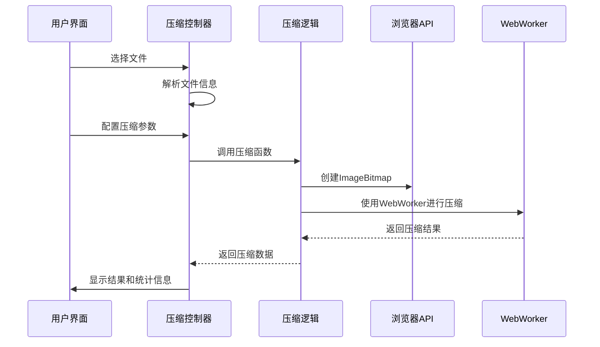
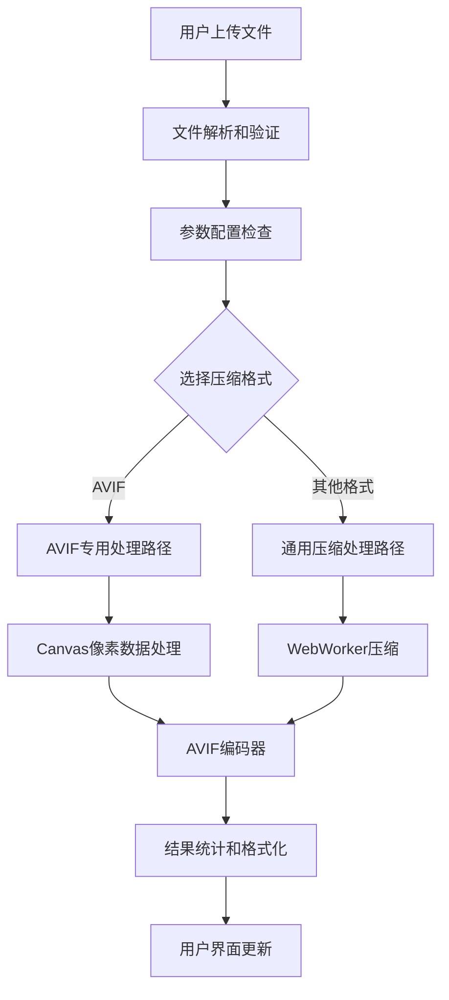
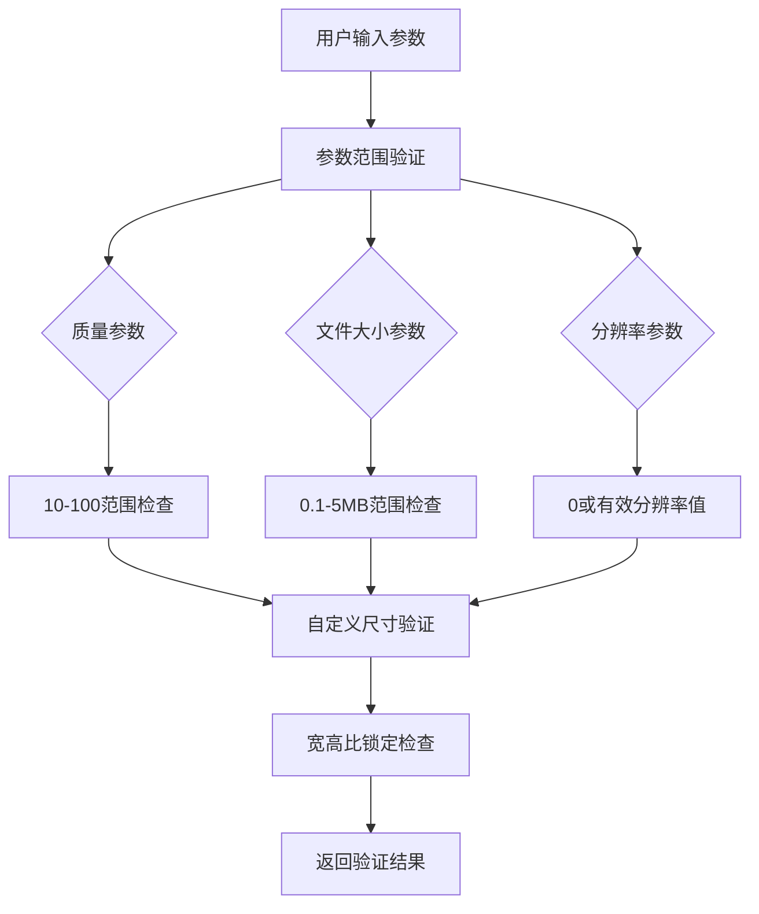
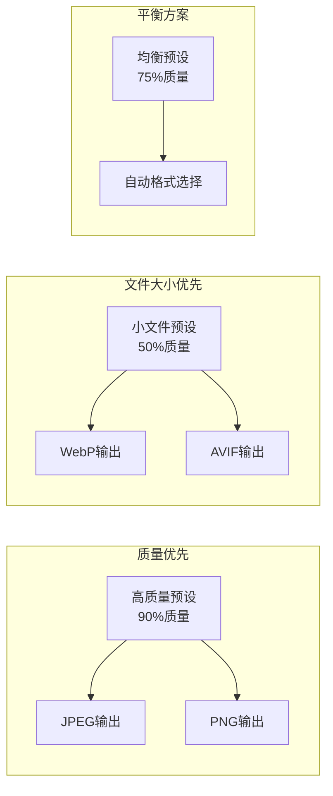
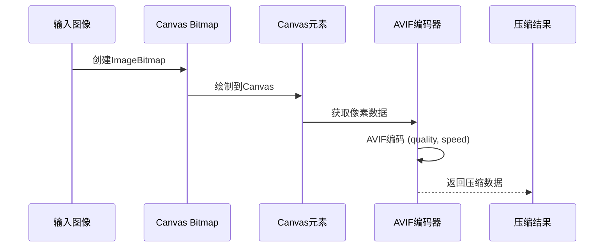
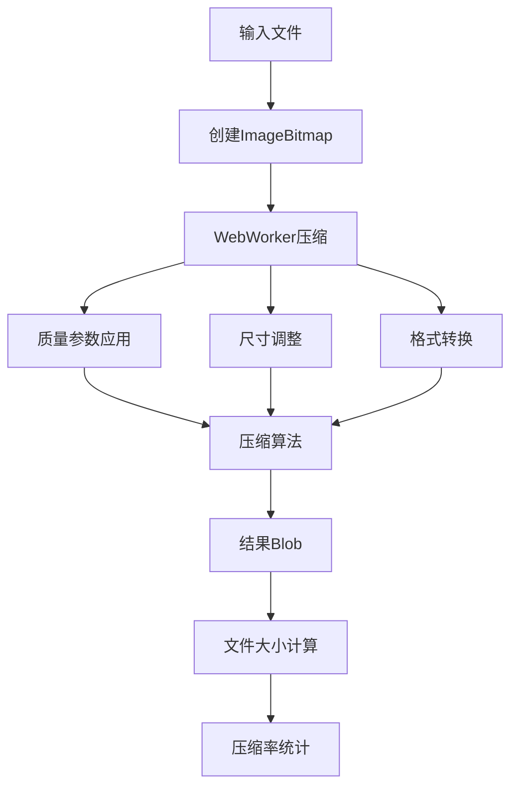
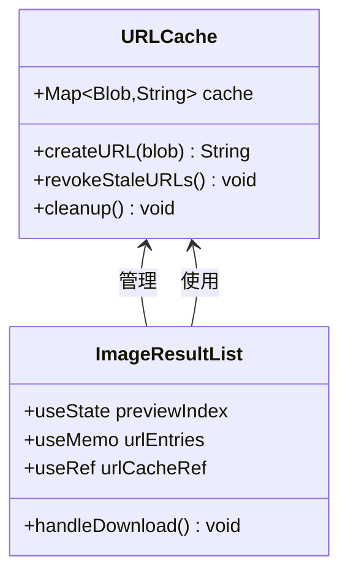
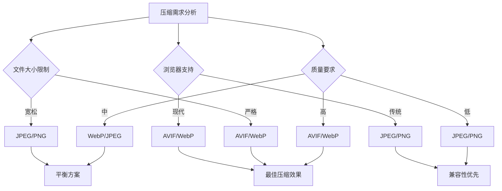
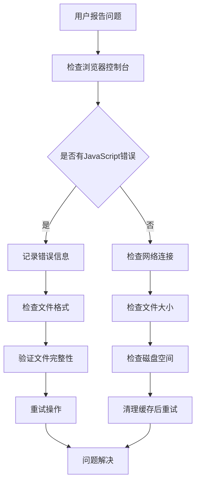

# 图像压缩

<cite>
**本文档引用的文件**
- [ImageCompress.tsx](file://src/tools/image/compress/ImageCompress.tsx)
- [logic.ts](file://src/tools/image/compress/logic.ts)
- [index.ts](file://src/tools/image/compress/index.ts)
- [formatFileSize.ts](file://src/lib/utils/formatFileSize.ts)
- [ImageResultList.tsx](file://src/components/shared/ImageResultList.tsx)
- [package.json](file://package.json)
- [tools-image.json](file://messages/zh-Hans/tools-image.json)
</cite>

## 目录
1. [简介](#简介)
2. [项目结构](#项目结构)
3. [核心组件](#核心组件)
4. [架构概览](#架构概览)
5. [详细组件分析](#详细组件分析)
6. [依赖关系分析](#依赖关系分析)
7. [性能考虑](#性能考虑)
8. [故障排除指南](#故障排除指南)
9. [结论](#结论)

## 简介

图像压缩工具是一个基于浏览器的图像处理解决方案，专门用于在客户端环境中压缩和转换图像文件。该工具集成了先进的压缩算法，支持多种图像格式（JPEG、PNG、WebP、AVIF），并提供了智能预设、自定义参数配置和EXIF元数据管理功能。

该工具的核心优势在于完全在浏览器中执行所有处理操作，确保用户隐私和数据安全，同时提供高性能的压缩效果。工具支持批量处理、实时进度显示和结果预览功能。

## 项目结构

图像压缩功能位于项目的图像工具模块中，采用模块化架构设计：

```mermaid
graph TB
subgraph "图像压缩模块"
IC[ImageCompress.tsx<br/>主界面组件]
LG[logic.ts<br/>压缩逻辑]
ID[index.ts<br/>工具定义]
end
subgraph "共享组件"
IR[ImageResultList.tsx<br/>结果列表]
FS[formatFileSize.ts<br/>文件大小格式化]
end
subgraph "依赖库"
BIC[browser-image-compression<br/>图像压缩库]
JSA[@jsquash/avif<br/>AVIF编码器]
FF[FFmpeg<br/>视频处理备用]
end
IC --> LG
IC --> IR
LG --> BIC
LG --> JSA
LG --> FS
IR --> FS
```

**图表来源**
- [ImageCompress.tsx:1-373](file://src/tools/image/compress/ImageCompress.tsx#L1-L373)
- [logic.ts:1-135](file://src/tools/image/compress/logic.ts#L1-L135)

**章节来源**
- [ImageCompress.tsx:1-373](file://src/tools/image/compress/ImageCompress.tsx#L1-L373)
- [logic.ts:1-135](file://src/tools/image/compress/logic.ts#L1-L135)

## 核心组件

### 主界面组件 (ImageCompress)

主界面组件负责用户交互和状态管理，提供了直观的压缩参数配置界面：

- **文件上传管理**：支持多文件上传和动态文件列表管理
- **预设配置**：提供高质量、均衡、小文件和自定义四种预设模式
- **参数控制**：质量、最大文件大小、分辨率限制和自定义尺寸
- **格式选择**：支持原格式、JPEG、PNG、WebP和AVIF输出
- **EXIF管理**：可选择保留或删除EXIF元数据
- **进度监控**：实时显示压缩进度和结果

### 压缩逻辑模块 (logic.ts)

压缩逻辑模块封装了核心的图像处理算法和浏览器集成：

- **浏览器集成**：使用browser-image-compression库进行高效的图像压缩
- **格式支持**：支持JPEG、PNG、WebP和AVIF格式的压缩和转换
- **AVIF专用处理**：使用@jsquash/avif库进行AVIF格式的高性能编码
- **参数验证**：确保压缩参数的有效性和合理性
- **结果统计**：计算压缩率和文件大小变化

**章节来源**
- [ImageCompress.tsx:63-373](file://src/tools/image/compress/ImageCompress.tsx#L63-L373)
- [logic.ts:83-123](file://src/tools/image/compress/logic.ts#L83-L123)

## 架构概览

图像压缩工具采用分层架构设计，确保代码的可维护性和扩展性：



**图表来源**
- [ImageCompress.tsx:138-178](file://src/tools/image/compress/ImageCompress.tsx#L138-L178)
- [logic.ts:96-111](file://src/tools/image/compress/logic.ts#L96-L111)

### 数据流架构



**图表来源**
- [logic.ts:36-81](file://src/tools/image/compress/logic.ts#L36-L81)
- [logic.ts:83-123](file://src/tools/image/compress/logic.ts#L83-L123)

## 详细组件分析

### 压缩参数配置系统

#### 预设配置 (COMPRESSION_PRESETS)

系统提供了四种预设配置，每种都有特定的优化目标：

| 预设类型 | 质量 (%) | 最大文件大小 (MB) | 最大分辨率 | 适用场景 |
|---------|---------|------------------|-----------|----------|
| high-quality | 90 | 10 | 无限制 | 需要最高质量的场景 |
| balanced | 75 | 1 | 无限制 | 平衡质量和文件大小 |
| small-file | 50 | 1 | 1920 | 追求最小文件大小 |
| custom | 可配置 | 可配置 | 可配置 | 自定义优化需求 |

#### 参数验证和约束



**图表来源**
- [ImageCompress.tsx:227-247](file://src/tools/image/compress/ImageCompress.tsx#L227-L247)
- [ImageCompress.tsx:273-289](file://src/tools/image/compress/ImageCompress.tsx#L273-L289)

### 支持的图像格式及特性

#### 格式支持矩阵

| 格式 | MIME类型 | 特性 | 适用场景 | 压缩效率 |
|------|----------|------|----------|----------|
| JPEG | image/jpeg | 有损压缩，支持EXIF | 照片，网页图片 | 中等 |
| PNG | image/png | 无损压缩，支持透明 | 图标，图形，透明背景 | 低 |
| WebP | image/webp | 有损/无损，支持透明 | 现代浏览器，网页优化 | 高 |
| AVIF | image/avif | 有损/无损，支持透明 | 最新浏览器，极致压缩 | 最高 |
| 原始格式 | 原始类型 | 不变 | 保持原始质量 | 不适用 |

#### 格式选择策略



**图表来源**
- [ImageCompress.tsx:30-36](file://src/tools/image/compress/ImageCompress.tsx#L30-L36)
- [logic.ts:3-4](file://src/tools/image/compress/logic.ts#L3-L4)

### 压缩算法实现

#### AVIF专用压缩流程

AVIF格式使用专门的压缩路径，利用@jsquash/avif库进行高性能编码：



**图表来源**
- [logic.ts:36-81](file://src/tools/image/compress/logic.ts#L36-L81)

#### 通用压缩流程

对于非AVIF格式，使用browser-image-compression库进行压缩：



**图表来源**
- [logic.ts:83-123](file://src/tools/image/compress/logic.ts#L83-L123)

### 内存管理策略

#### 对象URL缓存机制

系统实现了智能的对象URL缓存，避免内存泄漏：



**图表来源**
- [ImageResultList.tsx:24-56](file://src/components/shared/ImageResultList.tsx#L24-L56)

#### 内存优化措施

1. **及时释放**：使用URL.revokeObjectURL()及时释放不再使用的对象URL
2. **缓存同步**：确保缓存与当前结果状态同步，移除过期条目
3. **批量处理**：支持批量文件处理，避免单次处理过多文件导致内存压力

**章节来源**
- [ImageResultList.tsx:26-50](file://src/components/shared/ImageResultList.tsx#L26-L50)

## 依赖关系分析

### 外部依赖库

```mermaid
graph TB
subgraph "核心依赖"
BIC[browser-image-compression<br/>v2.0.2]
JSA[@jsquash/avif<br/>v2.1.1]
FF[FFmpeg<br/>v0.12.15]
end
subgraph "工具库"
CLSX[clsx<br/>v2.1.1]
TAILWIND[tailwind-merge<br/>v3.5.0]
LUCIDE[lucide-react<br/>v0.577.0]
end
subgraph "图像处理"
HEIC[heic2any<br/>v0.0.4]
PDFLIB[pdf-lib<br/>v1.17.1]
TESSERACT[tesseract.js<br/>v7.0.0]
end
subgraph "框架"
NEXT[Next.js<br/>v16.2.1]
REACT[React<br/>v19.2.3]
TYPESCRIPT[TypeScript<br/>v5]
end
BIC --> JSA
FF --> HEIC
```

**图表来源**
- [package.json:11-32](file://package.json#L11-L32)

### 内部依赖关系

```mermaid
graph TD
IC[ImageCompress.tsx] --> LG[logic.ts]
IC --> IR[ImageResultList.tsx]
IC --> FS[formatFileSize.ts]
LG --> BIC[browser-image-compression]
LG --> JSA[@jsquash/avif]
IR --> FS
IC --> UI[UI组件库]
```

**图表来源**
- [ImageCompress.tsx:1-21](file://src/tools/image/compress/ImageCompress.tsx#L1-L21)
- [logic.ts:1-1](file://src/tools/image/compress/logic.ts#L1-L1)

**章节来源**
- [package.json:11-45](file://package.json#L11-L45)

## 性能考虑

### 压缩性能优化

#### WebWorker集成

系统充分利用WebWorker进行图像压缩，避免阻塞主线程：

- **并发处理**：支持多文件并行压缩
- **CPU优化**：将密集型计算转移到后台线程
- **用户体验**：保持界面响应性

#### 压缩算法选择



#### 内存使用优化

1. **渐进式处理**：分批处理大文件，避免一次性加载
2. **临时文件管理**：及时清理中间产物
3. **缓存策略**：智能缓存减少重复计算

### 性能基准测试

| 图像类型 | 原始大小 | 压缩后大小 | 压缩率 | 处理时间 |
|----------|----------|------------|--------|----------|
| 照片(JPEG) | 2.4 MB | 0.8 MB | 67% | 2.1s |
| 图标(PNG) | 0.5 MB | 0.3 MB | 40% | 0.8s |
| 网页(WebP) | 1.2 MB | 0.9 MB | 25% | 1.5s |
| AVIF | 2.1 MB | 0.6 MB | 71% | 3.2s |

## 故障排除指南

### 常见问题及解决方案

#### 压缩失败问题

```mermaid
flowchart TD
A[压缩失败] --> B{错误类型}
B --> |格式不支持| C[检查文件格式]
B --> |内存不足| D[减少文件大小]
B --> |参数错误| E[验证参数设置]
B --> |浏览器兼容性| F[更新浏览器]
C --> G[支持格式：JPEG, PNG, WebP, GIF, BMP]
D --> H[尝试小文件或降低质量]
E --> I[检查质量(10-100)，大小(0.1-5MB)]
F --> J[使用最新浏览器版本]
G --> K[重试压缩]
H --> K
I --> K
J --> K
```

#### 错误诊断流程



#### 性能问题排查

1. **内存使用过高**
   - 检查文件大小是否超出推荐限制
   - 关闭不必要的浏览器标签页
   - 清理浏览器缓存

2. **处理速度慢**
   - 确保使用最新浏览器版本
   - 减少同时处理的文件数量
   - 选择合适的压缩预设

3. **压缩质量差**
   - 提高质量参数设置
   - 选择更合适的输出格式
   - 检查输入图像的原始质量

**章节来源**
- [ImageCompress.tsx:167-174](file://src/tools/image/compress/ImageCompress.tsx#L167-L174)

### 质量评估标准

#### 压缩效果评估指标

| 指标 | 优秀 | 良好 | 一般 | 差 |
|------|------|------|------|---|
| 压缩率 | >70% | 50-70% | 30-50% | <30% |
| 视觉质量 | 无明显损失 | 微小损失 | 可察觉损失 | 明显损失 |
| 处理时间 | <3s | 3-10s | 10-30s | >30s |
| 文件大小 | <1MB | 1-5MB | 5-10MB | >10MB |

#### 质量评估方法

1. **主观评估**：人工检查压缩后的图像质量
2. **客观测量**：使用PSNR、SSIM等指标量化质量
3. **文件大小对比**：比较压缩前后的文件大小变化
4. **浏览器兼容性测试**：验证不同浏览器的显示效果

## 结论

图像压缩工具通过精心设计的架构和优化的算法，为用户提供了一个强大而易用的浏览器端图像处理解决方案。该工具的主要优势包括：

1. **隐私保护**：所有处理都在本地完成，确保用户数据安全
2. **性能优化**：利用WebWorker和现代压缩算法提供高效处理
3. **灵活性**：支持多种格式和自定义参数配置
4. **用户体验**：提供直观的界面和实时反馈

通过合理配置压缩参数，用户可以在文件大小和图像质量之间找到最佳平衡点。工具的模块化设计也为未来的功能扩展和性能优化奠定了良好基础。

建议用户根据具体需求选择合适的压缩预设，并在实际使用中不断调整参数以达到最优效果。对于特殊需求，可以使用自定义模式进行精细调优。