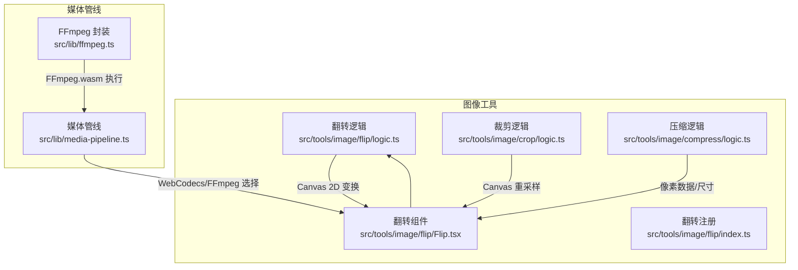
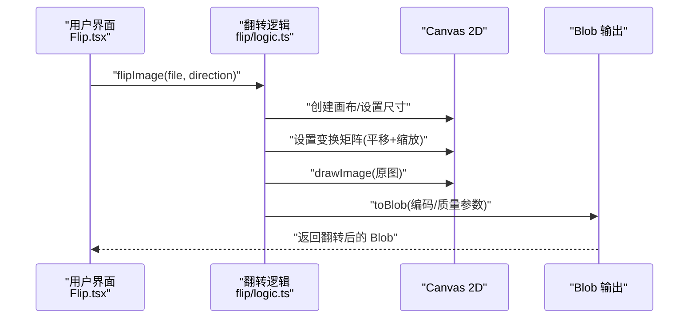
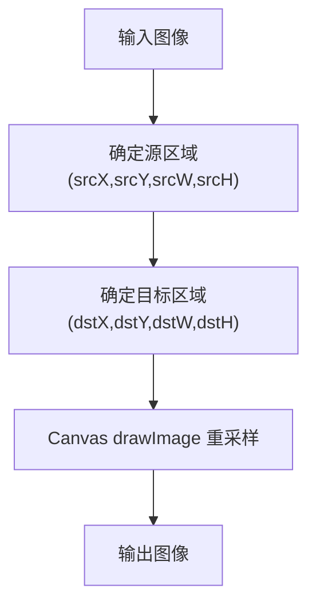
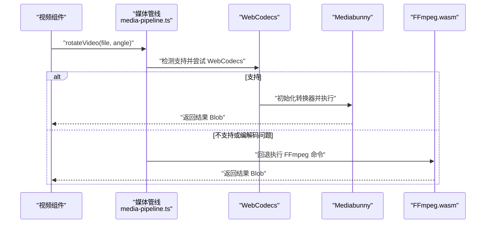
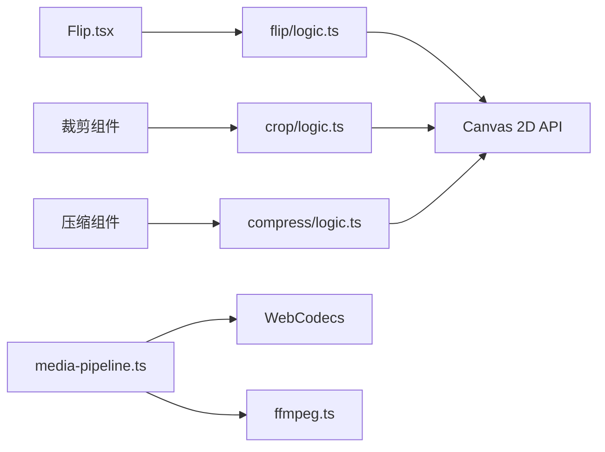

# 图像变换

<cite>
**本文引用的文件**
- [README.md](file://README.md)
- [src/tools/image/flip/logic.ts](file://src/tools/image/flip/logic.ts)
- [src/tools/image/flip/Flip.tsx](file://src/tools/image/flip/Flip.tsx)
- [src/tools/image/flip/index.ts](file://src/tools/image/flip/index.ts)
- [src/tools/image/crop/logic.ts](file://src/tools/image/crop/logic.ts)
- [src/tools/image/compress/logic.ts](file://src/tools/image/compress/logic.ts)
- [src/lib/media-pipeline.ts](file://src/lib/media-pipeline.ts)
- [src/lib/ffmpeg.ts](file://src/lib/ffmpeg.ts)
</cite>

## 目录
1. [简介](#简介)
2. [项目结构](#项目结构)
3. [核心组件](#核心组件)
4. [架构总览](#架构总览)
5. [详细组件分析](#详细组件分析)
6. [依赖关系分析](#依赖关系分析)
7. [性能考量](#性能考量)
8. [故障排查指南](#故障排查指南)
9. [结论](#结论)
10. [附录](#附录)

## 简介
本技术文档聚焦于图像变换工具，围绕翻转、旋转与透视（基于裁剪）变换展开，结合浏览器端图像处理与视频处理能力，系统阐述以下内容：
- 几何变换原理与矩阵变换思路
- 像素重采样与边界处理策略
- 水平翻转、垂直翻转、90°旋转与任意角度旋转的实现要点
- 组合使用示例与创意应用
- 大图像处理的内存优化与性能提升策略
- 变换失败的诊断与解决方法
- 在图像修复与视觉错觉中的应用价值

本项目采用浏览器原生 Canvas API 进行图像翻转与裁剪，使用 FFmpeg.wasm 与 WebCodecs/Mediabunny 进行视频旋转与编解码，确保在不上传文件的前提下完成本地处理。

章节来源
- [README.md:1-89](file://README.md#L1-L89)

## 项目结构
图像变换相关的核心位置如下：
- 图像翻转：逻辑层位于 src/tools/image/flip/logic.ts，前端组件位于 src/tools/image/flip/Flip.tsx，工具注册位于 src/tools/image/flip/index.ts
- 图像裁剪（透视基础）：逻辑层位于 src/tools/image/crop/logic.ts
- 图像压缩（像素数据与尺寸控制）：逻辑层位于 src/tools/image/compress/logic.ts
- 媒体管线与视频旋转：src/lib/media-pipeline.ts 与 src/lib/ffmpeg.ts

图表来源
- [src/tools/image/flip/logic.ts:1-43](file://src/tools/image/flip/logic.ts#L1-L43)
- [src/tools/image/flip/Flip.tsx:1-87](file://src/tools/image/flip/Flip.tsx#L1-L87)
- [src/tools/image/crop/logic.ts:1-59](file://src/tools/image/crop/logic.ts#L1-L59)
- [src/tools/image/compress/logic.ts:1-135](file://src/tools/image/compress/logic.ts#L1-L135)
- [src/lib/media-pipeline.ts:1-175](file://src/lib/media-pipeline.ts#L1-L175)
- [src/lib/ffmpeg.ts:1-144](file://src/lib/ffmpeg.ts#L1-L144)

章节来源
- [src/tools/image/flip/logic.ts:1-43](file://src/tools/image/flip/logic.ts#L1-L43)
- [src/tools/image/flip/Flip.tsx:1-87](file://src/tools/image/flip/Flip.tsx#L1-L87)
- [src/tools/image/crop/logic.ts:1-59](file://src/tools/image/crop/logic.ts#L1-L59)
- [src/tools/image/compress/logic.ts:1-135](file://src/tools/image/compress/logic.ts#L1-L135)
- [src/lib/media-pipeline.ts:1-175](file://src/lib/media-pipeline.ts#L1-L175)
- [src/lib/ffmpeg.ts:1-144](file://src/lib/ffmpeg.ts#L1-L144)

## 核心组件
- 翻转逻辑（图像）
  - 使用 Canvas 2D 上下文的变换矩阵实现镜像翻转，避免显式像素遍历，性能高且无插值误差
  - 支持水平与垂直翻转两种方向
- 裁剪逻辑（透视基础）
  - 通过 drawImage 的源区域与目标区域映射，实现仿射变换的基础能力
  - 可作为透视变换的像素重采样基础
- 压缩逻辑（像素数据与尺寸）
  - 提供尺寸缩放与像素数据读取能力，为大图像处理提供降采样与内存控制手段
- 媒体管线与 FFmpeg
  - WebCodecs 优先路径，自动回退至 FFmpeg.wasm；提供进度回调与错误分类

章节来源
- [src/tools/image/flip/logic.ts:1-43](file://src/tools/image/flip/logic.ts#L1-L43)
- [src/tools/image/crop/logic.ts:1-59](file://src/tools/image/crop/logic.ts#L1-L59)
- [src/tools/image/compress/logic.ts:1-135](file://src/tools/image/compress/logic.ts#L1-L135)
- [src/lib/media-pipeline.ts:1-175](file://src/lib/media-pipeline.ts#L1-L175)
- [src/lib/ffmpeg.ts:1-144](file://src/lib/ffmpeg.ts#L1-L144)

## 架构总览
图像变换在浏览器端的执行路径如下：
- 图像翻转：前端组件触发 -> 翻转逻辑 -> Canvas 2D 变换 -> Blob 输出
- 透视变换：基于裁剪逻辑的 drawImage 映射，实现四边形到矩形的重采样
- 旋转（视频）：优先 WebCodecs，失败时回退 FFmpeg.wasm；支持 90°/180°/270°旋转

图表来源
- [src/tools/image/flip/Flip.tsx:23-43](file://src/tools/image/flip/Flip.tsx#L23-L43)
- [src/tools/image/flip/logic.ts:5-41](file://src/tools/image/flip/logic.ts#L5-L41)

## 详细组件分析

### 翻转组件分析
- 实现原理
  - 利用 Canvas 2D 的变换矩阵：水平翻转通过“沿X轴平移+X缩放-1”实现；垂直翻转通过“沿Y轴平移+Y缩放-1”实现
  - 无需像素级循环，避免插值误差，适合高质量无损翻转
- 边界与质量
  - 仅进行几何变换，不引入额外重采样，保持原始像素精度
- 错误处理
  - 图像加载失败、Canvas 上下文不可用、toBlob 失败等场景均有明确错误抛出

图表来源
- [src/tools/image/flip/logic.ts:5-41](file://src/tools/image/flip/logic.ts#L5-L41)

章节来源
- [src/tools/image/flip/logic.ts:1-43](file://src/tools/image/flip/logic.ts#L1-L43)
- [src/tools/image/flip/Flip.tsx:13-43](file://src/tools/image/flip/Flip.tsx#L13-L43)
- [src/tools/image/flip/index.ts:1-37](file://src/tools/image/flip/index.ts#L1-L37)

### 透视与裁剪组件分析
- 实现原理
  - 裁剪逻辑通过 drawImage(srcX, srcY, srcW, srcH, dstX, dstY, dstW, dstH) 实现仿射映射
  - 透视变换可视为将四边形映射到矩形的特殊情况，可通过计算合适的四个点坐标实现
- 边界与重采样
  - drawImage 内部使用双线性插值进行重采样，保证缩放与旋转时的视觉连续性
  - 注意边界像素的映射与插值范围，避免越界导致的模糊或黑边
- 与翻转的关系
  - 裁剪与翻转可组合：先翻转再裁剪，或先裁剪再翻转，顺序不同可能影响最终效果

图表来源
- [src/tools/image/crop/logic.ts:17-38](file://src/tools/image/crop/logic.ts#L17-L38)

章节来源
- [src/tools/image/crop/logic.ts:1-59](file://src/tools/image/crop/logic.ts#L1-L59)

### 旋转（视频）组件分析
- 实现原理
  - WebCodecs 优先：通过 mediabunny 初始化输入/输出与转换器，设置视频旋转角度，硬件加速优先
  - FFmpeg 回退：当 WebCodecs 不可用或遇到特定编解码问题时，使用 FFmpeg.wasm 执行滤镜命令
- 角度支持
  - 90°/180°/270°旋转通过 transpose 滤镜链实现
- 错误处理
  - 对编解码器不支持、转换无效等情况进行分类与提示
- 性能与兼容性
  - 优先硬件加速，失败时自动回退；对 H.265/VP9/AV1 等不支持编解码的场景给出明确错误类型

图表来源
- [src/lib/media-pipeline.ts:7-91](file://src/lib/media-pipeline.ts#L7-L91)
- [src/lib/ffmpeg.ts:99-143](file://src/lib/ffmpeg.ts#L99-L143)
- [src/tools/video/rotate/logic.ts:12-35](file://src/tools/video/rotate/logic.ts#L12-L35)

章节来源
- [src/lib/media-pipeline.ts:1-175](file://src/lib/media-pipeline.ts#L1-L175)
- [src/lib/ffmpeg.ts:1-144](file://src/lib/ffmpeg.ts#L1-L144)
- [src/tools/video/rotate/logic.ts:1-102](file://src/tools/video/rotate/logic.ts#L1-L102)

### 组合使用与创意应用
- 组合示例
  - 先翻转（水平/垂直），再裁剪（透视），最后按需压缩
  - 先裁剪（局部放大），再旋转（视频 90°），最后导出
- 创意应用
  - 利用裁剪的透视映射实现“鱼眼”、“桶形畸变”等视觉效果
  - 结合翻转与裁剪实现对称构图与镜像艺术
  - 大图分块处理：先压缩/降采样，再局部裁剪与变换，减少内存峰值

章节来源
- [src/tools/image/flip/logic.ts:14-20](file://src/tools/image/flip/logic.ts#L14-L20)
- [src/tools/image/crop/logic.ts:28-38](file://src/tools/image/crop/logic.ts#L28-L38)
- [src/tools/image/compress/logic.ts:83-123](file://src/tools/image/compress/logic.ts#L83-L123)

## 依赖关系分析
- 组件耦合
  - 翻转逻辑与前端组件强耦合，职责清晰：UI 触发 -> 逻辑处理 -> 结果展示
  - 裁剪逻辑与翻转逻辑相互独立，但可被上层流程组合使用
  - 媒体管线与 FFmpeg 封装为视频旋转提供跨平台能力
- 外部依赖
  - 浏览器 Canvas 2D API（图像翻转/裁剪）
  - FFmpeg.wasm（视频旋转回退）
  - WebCodecs + Mediabunny（硬件加速优先路径）

图表来源
- [src/tools/image/flip/Flip.tsx:1-87](file://src/tools/image/flip/Flip.tsx#L1-L87)
- [src/tools/image/flip/logic.ts:1-43](file://src/tools/image/flip/logic.ts#L1-L43)
- [src/tools/image/crop/logic.ts:1-59](file://src/tools/image/crop/logic.ts#L1-L59)
- [src/tools/image/compress/logic.ts:1-135](file://src/tools/image/compress/logic.ts#L1-L135)
- [src/lib/media-pipeline.ts:1-175](file://src/lib/media-pipeline.ts#L1-L175)
- [src/lib/ffmpeg.ts:1-144](file://src/lib/ffmpeg.ts#L1-L144)

章节来源
- [src/tools/image/flip/Flip.tsx:1-87](file://src/tools/image/flip/Flip.tsx#L1-L87)
- [src/tools/image/flip/logic.ts:1-43](file://src/tools/image/flip/logic.ts#L1-L43)
- [src/tools/image/crop/logic.ts:1-59](file://src/tools/image/crop/logic.ts#L1-L59)
- [src/tools/image/compress/logic.ts:1-135](file://src/tools/image/compress/logic.ts#L1-L135)
- [src/lib/media-pipeline.ts:1-175](file://src/lib/media-pipeline.ts#L1-L175)
- [src/lib/ffmpeg.ts:1-144](file://src/lib/ffmpeg.ts#L1-L144)

## 性能考量
- Canvas 2D 变换
  - 平移+缩放矩阵实现翻转，避免像素级遍历，时间复杂度近似 O(1) 的矩阵设置，渲染阶段由 GPU 加速
- drawImage 重采样
  - 双线性插值在缩放与透视时保证视觉连续性，但会引入轻微模糊；可通过降低缩放比例或使用更高分辨率输入缓解
- 大图像处理
  - 压缩逻辑提供尺寸上限与最大边控制，可在导出前降采样，显著降低内存占用
  - FFmpeg 封装使用 WORKERFS 直接挂载文件，避免内存复制，执行完成后及时释放 MEMFS 数据
- WebCodecs 优先
  - 硬件加速显著提升视频旋转性能；对不支持的编解码器直接报错，避免无效回退带来的性能浪费

章节来源
- [src/tools/image/flip/logic.ts:14-20](file://src/tools/image/flip/logic.ts#L14-L20)
- [src/tools/image/crop/logic.ts:28-38](file://src/tools/image/crop/logic.ts#L28-L38)
- [src/tools/image/compress/logic.ts:91-102](file://src/tools/image/compress/logic.ts#L91-L102)
- [src/lib/ffmpeg.ts:105-142](file://src/lib/ffmpeg.ts#L105-L142)
- [src/lib/media-pipeline.ts:7-14](file://src/lib/media-pipeline.ts#L7-L14)

## 故障排查指南
- 翻转失败
  - 症状：抛出“Flip failed”
  - 排查：确认 toBlob 参数与图像类型；检查 Canvas 上下文是否可用；验证输入文件是否损坏
- 图像加载失败
  - 症状：抛出“Failed to load image”
  - 排查：确认文件类型受支持；检查网络与跨域；尝试更换图片格式
- 裁剪失败
  - 症状：抛出“Crop failed”或上下文不可用
  - 排查：确认裁剪区域不越界；确保 drawImage 参数合法
- 视频旋转异常
  - 症状：WebCodecs 不可用或编解码器不受支持
  - 排查：查看错误类型（WebCodecsFallbackError/UnsupportedVideoCodecError）；确认浏览器与系统支持情况；必要时改用 FFmpeg 回退路径
- 进度与内存
  - 症状：长时间无反馈或内存飙升
  - 排查：启用进度回调；对大图先压缩/降采样；确保执行完成后释放挂载与中间数据

章节来源
- [src/tools/image/flip/logic.ts:23-41](file://src/tools/image/flip/logic.ts#L23-L41)
- [src/tools/image/crop/logic.ts:23-26](file://src/tools/image/crop/logic.ts#L23-L26)
- [src/lib/media-pipeline.ts:32-53](file://src/lib/media-pipeline.ts#L32-L53)
- [src/lib/ffmpeg.ts:41-58](file://src/lib/ffmpeg.ts#L41-L58)

## 结论
本项目在浏览器端实现了高效的图像翻转与裁剪，并通过 WebCodecs 与 FFmpeg.wasm 提供了可靠的视频旋转能力。翻转采用矩阵变换，保持像素精度；裁剪提供仿射映射基础，可扩展为透视变换；压缩与尺寸控制为大图像处理提供了内存优化路径。整体架构清晰、错误处理完善、性能表现良好，适合在隐私优先的本地处理场景中广泛应用。

## 附录
- 几何与矩阵基础
  - 水平翻转：沿 X 轴平移 + 沿 X 轴缩放 -1
  - 垂直翻转：沿 Y 轴平移 + 沿 Y 轴缩放 -1
  - 透视映射：通过 drawImage 的源/目标矩形映射实现四边形到矩形的仿射变换
- 质量与插值
  - Canvas drawImage 默认双线性插值；在缩放与旋转时平衡锐度与模糊
- 应用建议
  - 先压缩/降采样，再进行多次变换，降低内存峰值
  - 对称创意：先翻转再裁剪，形成镜像构图
  - 视觉错觉：利用透视映射实现倾斜视角与空间扭曲效果