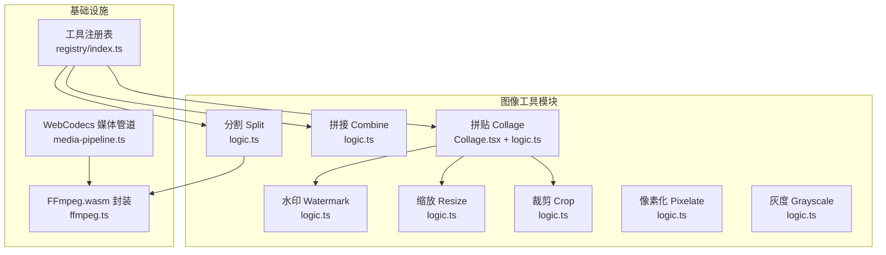
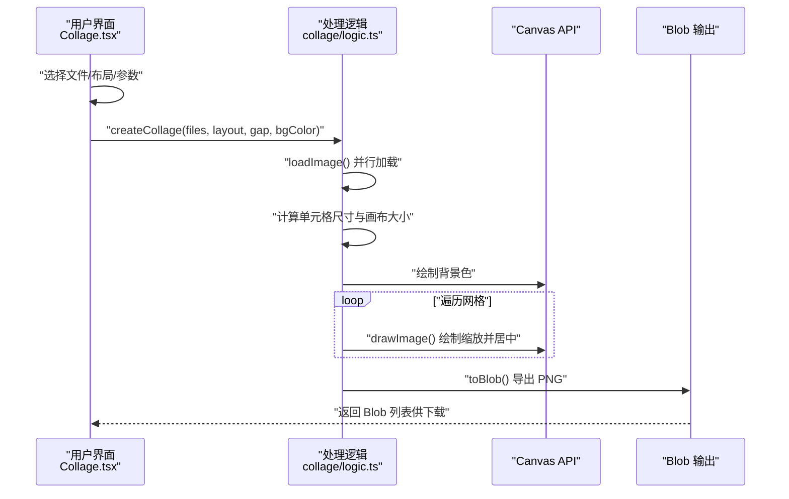
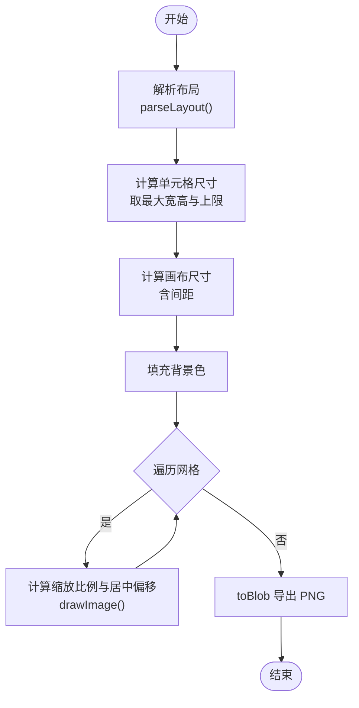
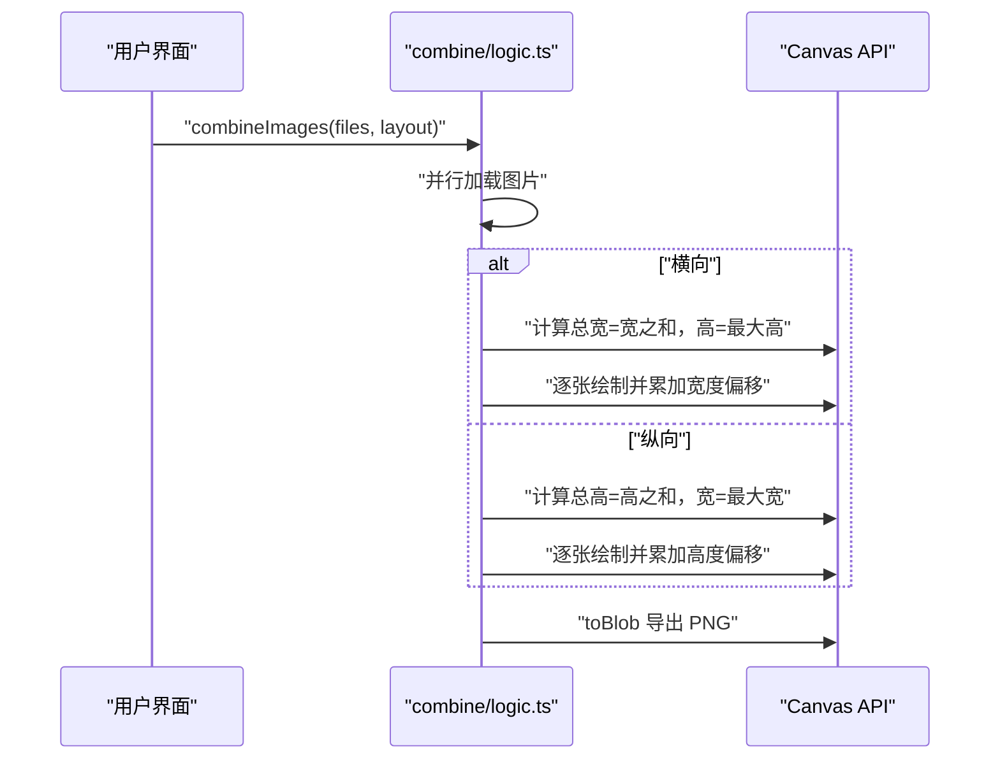
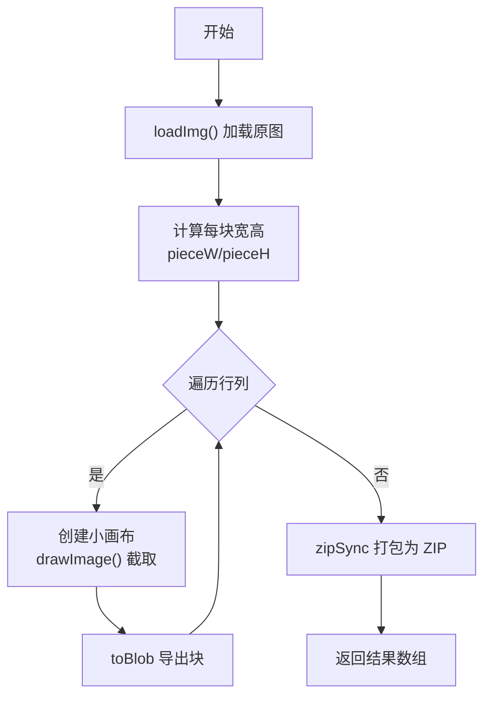
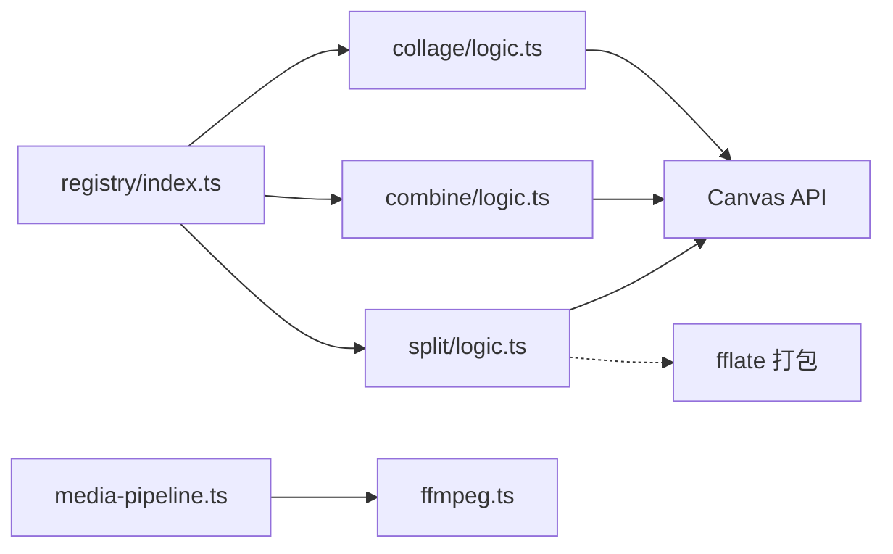

# 图像合成

<cite>
**本文引用的文件**
- [README.md](file://README.md)
- [src/lib/registry/index.ts](file://src/lib/registry/index.ts)
- [src/lib/ffmpeg.ts](file://src/lib/ffmpeg.ts)
- [src/lib/media-pipeline.ts](file://src/lib/media-pipeline.ts)
- [src/tools/image/collage/Collage.tsx](file://src/tools/image/collage/Collage.tsx)
- [src/tools/image/collage/logic.ts](file://src/tools/image/collage/logic.ts)
- [src/tools/image/combine/logic.ts](file://src/tools/image/combine/logic.ts)
- [src/tools/image/split/logic.ts](file://src/tools/image/split/logic.ts)
- [src/tools/image/watermark/logic.ts](file://src/tools/image/watermark/logic.ts)
- [src/tools/image/resize/logic.ts](file://src/tools/image/resize/logic.ts)
- [src/tools/image/crop/logic.ts](file://src/tools/image/crop/logic.ts)
- [src/tools/image/compress/logic.ts](file://src/tools/image/compress/logic.ts)
- [src/tools/image/pixelate/logic.ts](file://src/tools/image/pixelate/logic.ts)
- [src/tools/image/grayscale/logic.ts](file://src/tools/image/grayscale/logic.ts)
- [messages/zh-Hans/tools-image.json](file://messages/zh-Hans/tools-image.json)
</cite>

## 目录
1. [引言](#引言)
2. [项目结构](#项目结构)
3. [核心组件](#核心组件)
4. [架构总览](#架构总览)
5. [详细组件分析](#详细组件分析)
6. [依赖关系分析](#依赖关系分析)
7. [性能考虑](#性能考虑)
8. [故障排查指南](#故障排查指南)
9. [结论](#结论)
10. [附录](#附录)

## 引言
本技术文档围绕图像合成工具展开，重点解释图像拼接、分割与海报拼贴的实现原理，覆盖多图像处理与布局算法、对齐与重采样方法、无缝拼接技巧，并结合艺术设计原则与视觉效果优化，提供创意应用示例（全景拼接、图像分割、创意拼贴）。同时，文档涵盖性能优化与内存管理策略、不同合成模式的参数调节与效果控制、质量评估标准与对比方法，以及在内容创作与视觉设计中的应用价值与发展趋势。

## 项目结构
该项目采用 Next.js App Router 架构，图像工具集中在 src/tools/image 下，每个工具由“客户端组件 + 逻辑函数 + 注册定义”三部分组成。图像合成相关能力主要体现在拼贴（Collage）、拼接（Combine）与分割（Split）三大模块；同时，水印、裁剪、缩放、像素化、灰度等基础图像处理为合成流程提供前置/后置处理能力。

图表来源
- [src/lib/registry/index.ts:66-133](file://src/lib/registry/index.ts#L66-L133)
- [src/tools/image/collage/Collage.tsx:18-62](file://src/tools/image/collage/Collage.tsx#L18-L62)
- [src/tools/image/collage/logic.ts:38-113](file://src/tools/image/collage/logic.ts#L38-L113)
- [src/tools/image/combine/logic.ts:3-58](file://src/tools/image/combine/logic.ts#L3-L58)
- [src/tools/image/split/logic.ts:3-49](file://src/tools/image/split/logic.ts#L3-L49)
- [src/lib/ffmpeg.ts:10-82](file://src/lib/ffmpeg.ts#L10-L82)
- [src/lib/media-pipeline.ts:7-141](file://src/lib/media-pipeline.ts#L7-L141)

章节来源
- [README.md:55-78](file://README.md#L55-L78)
- [src/lib/registry/index.ts:66-133](file://src/lib/registry/index.ts#L66-L133)

## 核心组件
- 拼贴 Collage：基于 Canvas 的网格布局，支持多布局模板、间距与背景色控制，自动按最大图像尺寸计算单元格大小，避免内存溢出。
- 拼接 Combine：支持水平/垂直拼接，自动居中对齐，统一白色背景。
- 分割 Split：基于 Canvas 的规则网格切分，支持打包下载。
- 水印 Watermark：支持文本水印与平铺水印，透明度与位置可控。
- 缩放 Resize：等比缩放至目标分辨率。
- 裁剪 Crop：矩形区域裁剪。
- 像素化 Pixelate：降采样像素化效果。
- 灰度 Grayscale：RGB 加权灰度转换。
- FFmpeg.wasm：单线程队列封装，WORKERFS 直挂载输入文件，避免内存拷贝。
- WebCodecs 媒体管道：硬件加速视频解码/编码的检测与回退策略。

章节来源
- [src/tools/image/collage/logic.ts:1-114](file://src/tools/image/collage/logic.ts#L1-L114)
- [src/tools/image/combine/logic.ts:1-79](file://src/tools/image/combine/logic.ts#L1-L79)
- [src/tools/image/split/logic.ts:1-81](file://src/tools/image/split/logic.ts#L1-L81)
- [src/tools/image/watermark/logic.ts:1-99](file://src/tools/image/watermark/logic.ts#L1-L99)
- [src/tools/image/resize/logic.ts:1-46](file://src/tools/image/resize/logic.ts#L1-L46)
- [src/tools/image/crop/logic.ts:1-58](file://src/tools/image/crop/logic.ts#L1-L58)
- [src/tools/image/pixelate/logic.ts:1-48](file://src/tools/image/pixelate/logic.ts#L1-L48)
- [src/tools/image/grayscale/logic.ts:1-40](file://src/tools/image/grayscale/logic.ts#L1-L40)
- [src/lib/ffmpeg.ts:10-144](file://src/lib/ffmpeg.ts#L10-L144)
- [src/lib/media-pipeline.ts:7-175](file://src/lib/media-pipeline.ts#L7-L175)

## 架构总览
图像合成以“工具注册表”为入口，客户端组件负责交互与状态管理，逻辑函数负责纯函数式处理（Canvas/FFmpeg），最终通过 Blob 输出结果。拼贴与拼接使用 Canvas API 实现，分割使用 Canvas + FFmpeg（通过 fflate 打包）实现，水印与基础变换作为合成前/后的增强手段。

图表来源
- [src/tools/image/collage/Collage.tsx:45-62](file://src/tools/image/collage/Collage.tsx#L45-L62)
- [src/tools/image/collage/logic.ts:38-113](file://src/tools/image/collage/logic.ts#L38-L113)

## 详细组件分析

### 拼贴 Collage 组件
- 功能要点
  - 多布局模板：2x1、1x2、2x2、3x1、1x3、2x3，自动根据图片数量筛选可用布局。
  - 参数控制：间距 gap、背景色 bgColor、网格单元格尺寸按最大图像尺寸限制，防止内存溢出。
  - 对齐与缩放：单元内采用“等比缩放+居中”策略，保证不裁剪且完整显示。
  - 内存管理：加载完成后及时撤销 ObjectURL，避免泄漏。
- 数据流
  - 输入：File[]、布局字符串、gap、bgColor。
  - 处理：解析布局 → 计算单元格 → 绘制背景 → 循环绘制图像 → 导出 Blob。
- 错误处理
  - 图片加载失败、Canvas 获取失败、toBlob 失败均抛出错误并记录。

图表来源
- [src/tools/image/collage/logic.ts:23-60](file://src/tools/image/collage/logic.ts#L23-L60)
- [src/tools/image/collage/logic.ts:72-96](file://src/tools/image/collage/logic.ts#L72-L96)

章节来源
- [src/tools/image/collage/Collage.tsx:18-62](file://src/tools/image/collage/Collage.tsx#L18-L62)
- [src/tools/image/collage/logic.ts:1-114](file://src/tools/image/collage/logic.ts#L1-L114)

### 拼接 Combine 组件
- 功能要点
  - 支持横向与纵向拼接，自动计算总宽高并进行垂直/水平居中对齐。
  - 统一白色背景，避免底色影响视觉对比。
- 处理流程
  - 并行加载所有图片 → 计算总尺寸 → 绘制背景 → 逐张绘制并累加偏移 → 导出 Blob。

图表来源
- [src/tools/image/combine/logic.ts:3-58](file://src/tools/image/combine/logic.ts#L3-L58)

章节来源
- [src/tools/image/combine/logic.ts:1-79](file://src/tools/image/combine/logic.ts#L1-L79)

### 分割 Split 组件
- 功能要点
  - 规则网格切分：最后一列/行吸收余数像素，确保完整覆盖。
  - 输出打包：使用 fflate 将切分结果打包为 ZIP，便于批量下载。
- 处理流程
  - 加载原图 → 计算每块宽高 → 逐块绘制到独立 Canvas → 导出 Blob → 打包为 ZIP。

图表来源
- [src/tools/image/split/logic.ts:3-49](file://src/tools/image/split/logic.ts#L3-L49)

章节来源
- [src/tools/image/split/logic.ts:1-81](file://src/tools/image/split/logic.ts#L1-L81)

### 水印 Watermark 组件
- 功能要点
  - 文本水印：支持中心、四角与平铺模式，透明度与字号可调。
  - 字体渲染：使用 Canvas 文本测量与绘制 API。
- 处理流程
  - 读取文件 → 绘制原图 → 设置全局透明度与字体样式 → 绘制文本 → 导出 Blob。

章节来源
- [src/tools/image/watermark/logic.ts:1-99](file://src/tools/image/watermark/logic.ts#L1-L99)

### 基础图像处理（缩放、裁剪、像素化、灰度）
- 缩放 Resize：等比缩放至目标分辨率，保持纵横比。
- 裁剪 Crop：按指定矩形区域裁剪。
- 像素化 Pixelate：双通道降采样再上采样，形成像素块效果。
- 灰度 Grayscale：使用 RGB 权重公式进行像素级灰度转换。

章节来源
- [src/tools/image/resize/logic.ts:1-46](file://src/tools/image/resize/logic.ts#L1-L46)
- [src/tools/image/crop/logic.ts:1-58](file://src/tools/image/crop/logic.ts#L1-L58)
- [src/tools/image/pixelate/logic.ts:1-48](file://src/tools/image/pixelate/logic.ts#L1-L48)
- [src/tools/image/grayscale/logic.ts:1-40](file://src/tools/image/grayscale/logic.ts#L1-L40)

### FFmpeg.wasm 与媒体管道
- FFmpeg 封装
  - 单例懒加载，Promise 队列串行执行，避免并发冲突。
  - 使用 WORKERFS 直接挂载 Blob 文件，避免内存复制，执行后立即释放 MEMFS。
  - 进度事件映射到 0-100 整数范围。
- 媒体管道
  - 检测 WebCodecs 支持与硬件编解码能力，必要时回退到 FFmpeg。
  - 提供 HEVC/AVC 编码能力检测与扩展建议提示。

章节来源
- [src/lib/ffmpeg.ts:10-144](file://src/lib/ffmpeg.ts#L10-L144)
- [src/lib/media-pipeline.ts:7-175](file://src/lib/media-pipeline.ts#L7-L175)

## 依赖关系分析
- 工具注册表集中管理所有工具元信息与导入路径，确保运行时动态加载。
- 拼贴/拼接/分割等图像合成逻辑均为纯函数，依赖 Canvas API；分割还依赖 FFmpeg（通过 fflate 打包）。
- 媒体管道与 FFmpeg 封装为视频/音频处理提供底层能力，图像合成工具不直接依赖，但可作为扩展方向。

图表来源
- [src/lib/registry/index.ts:66-133](file://src/lib/registry/index.ts#L66-L133)
- [src/tools/image/collage/logic.ts:38-113](file://src/tools/image/collage/logic.ts#L38-L113)
- [src/tools/image/combine/logic.ts:3-58](file://src/tools/image/combine/logic.ts#L3-L58)
- [src/tools/image/split/logic.ts:3-49](file://src/tools/image/split/logic.ts#L3-L49)
- [src/lib/media-pipeline.ts:7-175](file://src/lib/media-pipeline.ts#L7-L175)
- [src/lib/ffmpeg.ts:10-144](file://src/lib/ffmpeg.ts#L10-L144)

章节来源
- [src/lib/registry/index.ts:66-133](file://src/lib/registry/index.ts#L66-L133)

## 性能考虑
- Canvas 渲染优化
  - 单次绘制：先绘制背景，再绘制前景，减少重复合成。
  - 居中缩放：使用最小缩放比例保证完整显示，避免额外裁剪步骤。
  - 内存释放：绘制完成后立即撤销 ObjectURL，避免内存泄漏。
- 并行加载
  - 使用 Promise.all 并行加载图片，缩短首帧时间。
- 输出格式
  - 默认 PNG 无损，若追求体积可结合压缩工具链（见压缩逻辑）。
- FFmpeg 流程
  - WORKERFS 直挂载输入文件，避免两次内存拷贝；执行后立即删除 MEMFS 文件，降低峰值内存。
  - 进度回调统一映射到整数百分比，便于 UI 更新。
- WebCodecs 回退
  - 当检测到不支持的编解码器时，自动回退到 FFmpeg，保证兼容性与稳定性。

章节来源
- [src/tools/image/collage/logic.ts:48-50](file://src/tools/image/collage/logic.ts#L48-L50)
- [src/tools/image/collage/logic.ts:110-112](file://src/tools/image/collage/logic.ts#L110-L112)
- [src/lib/ffmpeg.ts:105-142](file://src/lib/ffmpeg.ts#L105-L142)
- [src/lib/media-pipeline.ts:59-91](file://src/lib/media-pipeline.ts#L59-L91)

## 故障排查指南
- 图片加载失败
  - 现象：抛出“Failed to load image”错误。
  - 排查：确认文件类型受支持、网络可达、URL 有效。
- Canvas 上下文不可用
  - 现象：上下文获取失败导致处理中断。
  - 排查：确认 Canvas 元素已正确创建且未被销毁。
- 导出 Blob 失败
  - 现象：toBlob 返回空，导出失败。
  - 排查：检查输出格式与质量参数是否合理，尝试更换 PNG/JPEG。
- FFmpeg 进度异常
  - 现象：进度回调出现负值或大于 1。
  - 排查：确认进度事件映射逻辑（已归一化到 0-100）。
- WebCodecs 不支持
  - 现象：某些编解码器无法解码或编码。
  - 排查：根据回退策略改用 FFmpeg；在 Windows Chromium 浏览器提示安装 HEVC 扩展。

章节来源
- [src/tools/image/collage/logic.ts:14-20](file://src/tools/image/collage/logic.ts#L14-L20)
- [src/tools/image/combine/logic.ts:68-78](file://src/tools/image/combine/logic.ts#L68-L78)
- [src/lib/ffmpeg.ts:52-57](file://src/lib/ffmpeg.ts#L52-L57)
- [src/lib/media-pipeline.ts:32-53](file://src/lib/media-pipeline.ts#L32-L53)

## 结论
本项目以 Canvas 为核心实现了高效的图像合成能力，覆盖拼贴、拼接与分割三大场景，并通过水印、裁剪、缩放、像素化与灰度等基础处理完善了创作流程。借助 FFmpeg.wasm 与 WebCodecs 媒体管道，系统在浏览器端实现了高性能与高兼容性的平衡。未来可在以下方向拓展：引入更高级的对齐与无缝拼接算法、支持 HDR/多通道处理、集成 AI 增强与智能布局推荐。

## 附录

### 合成模式与参数调节
- 拼贴 Collage
  - 布局模板：2x1、1x2、2x2、3x1、1x3、2x3
  - 参数：间距 gap（0-20px）、背景色 bgColor（十六进制）
  - 适用：社交分享、主题海报、产品展示
- 拼接 Combine
  - 模式：horizontal/vertical
  - 参数：自动居中对齐，白色背景
  - 适用：长图拼接、时间轴串联
- 分割 Split
  - 参数：行数 rows、列数 cols
  - 输出：PNG 切片 + ZIP 打包
  - 适用：素材切分、批量处理

章节来源
- [src/tools/image/collage/logic.ts:1-36](file://src/tools/image/collage/logic.ts#L1-L36)
- [src/tools/image/combine/logic.ts:1-79](file://src/tools/image/combine/logic.ts#L1-L79)
- [src/tools/image/split/logic.ts:1-81](file://src/tools/image/split/logic.ts#L1-L81)

### 质量评估与视觉效果对比
- 质量指标
  - PSNR/SSIM：衡量与参考图像的失真程度（建议在离线环境使用专业工具评估）。
  - 文件大小与加载速度：对比 PNG/JPEG/WebP/AVIF 的体积与首屏渲染时间。
  - 视觉感知：主观评分，关注边缘锐利度、色彩保真度、噪点与伪影。
- 对比方法
  - 固定分辨率与压缩比，分别导出不同格式，进行 A/B 测试。
  - 针对不同场景（网页展示、打印、移动端）设定不同的质量权重。

### 应用价值与创意示例
- 社交媒体拼贴：将多张照片按模板排列，搭配水印与边框，提升视觉层次。
- 产品展示海报：横向拼接多角度照片，配合文字与品牌元素，形成统一风格。
- 创意拼贴：利用像素化、灰度等特效，打造复古或抽象风格作品。
- 素材管理：分割大图用于批量处理与存储，ZIP 打包便于传输与归档。

章节来源
- [messages/zh-Hans/tools-image.json:795-810](file://messages/zh-Hans/tools-image.json#L795-L810)