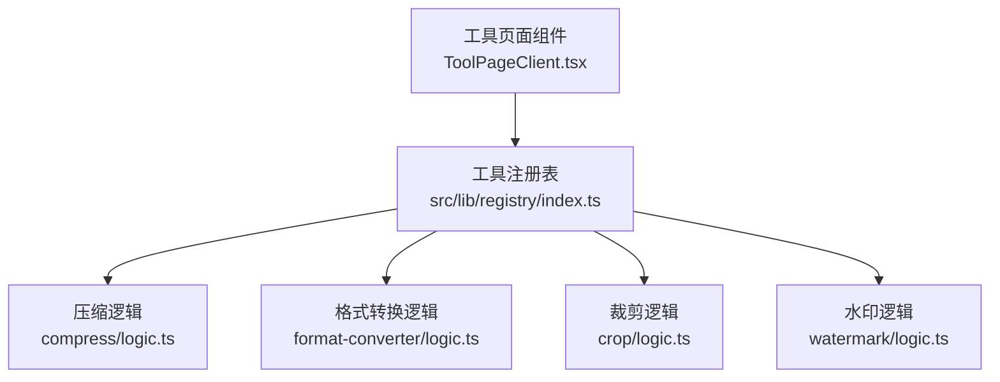
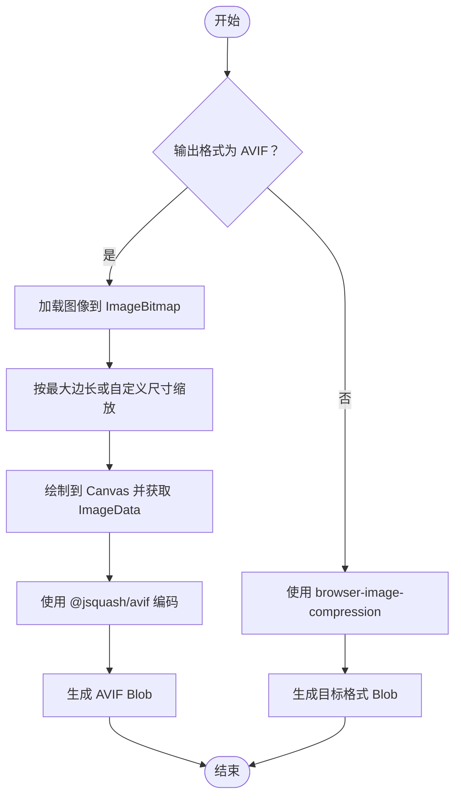
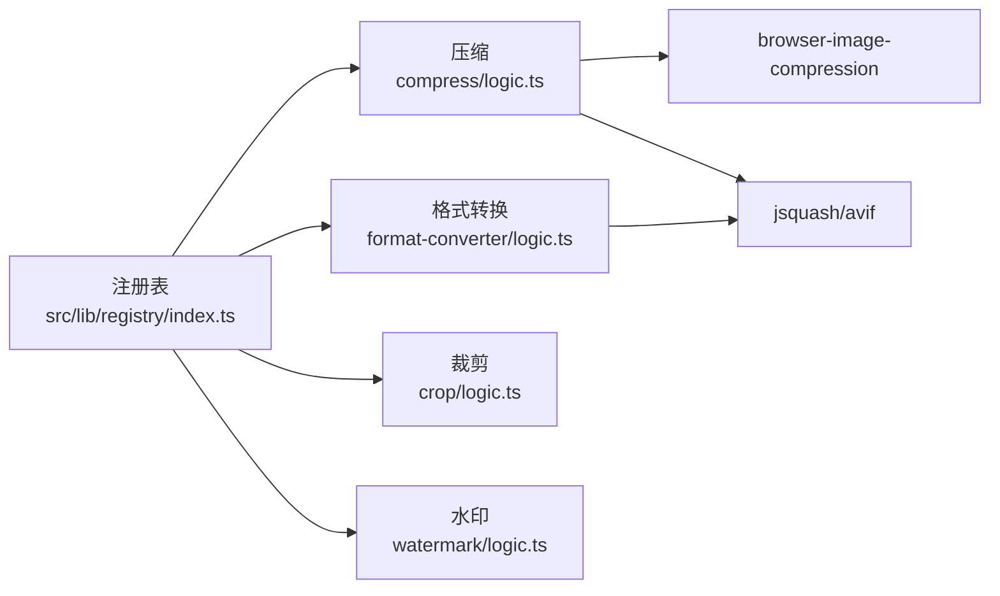

# 图像工具

<cite>
**本文引用的文件**
- [README.md](file://README.md)
- [src/lib/registry/index.ts](file://src/lib/registry/index.ts)
- [src/tools/image/compress/logic.ts](file://src/tools/image/compress/logic.ts)
- [src/tools/image/format-converter/logic.ts](file://src/tools/image/format-converter/logic.ts)
- [src/tools/image/crop/logic.ts](file://src/tools/image/crop/logic.ts)
- [src/tools/image/watermark/logic.ts](file://src/tools/image/watermark/logic.ts)
- [src/tools/image/grayscale/logic.ts](file://src/tools/image/grayscale/logic.ts)
- [src/tools/image/flip/logic.ts](file://src/tools/image/flip/logic.ts)
- [src/tools/image/add-text/logic.ts](file://src/tools/image/add-text/logic.ts)
- [src/tools/image/add-border/logic.ts](file://src/tools/image/add-border/logic.ts)
- [src/tools/image/circle-crop/logic.ts](file://src/tools/image/circle-crop/logic.ts)
- [src/tools/image/pixelate/logic.ts](file://src/tools/image/pixelate/logic.ts)
- [src/tools/image/svg-to-png/logic.ts](file://src/tools/image/svg-to-png/logic.ts)
- [src/tools/image/heic-convert/logic.ts](file://src/tools/image/heic-convert/logic.ts)
- [src/tools/image/combine/logic.ts](file://src/tools/image/combine/logic.ts)
- [src/tools/image/split/logic.ts](file://src/tools/image/split/logic.ts)
- [src/tools/image/collage/logic.ts](file://src/tools/image/collage/logic.ts)
- [src/tools/image/remove-exif/logic.ts](file://src/tools/image/remove-exif/logic.ts)
</cite>

## 目录
1. [简介](#简介)
2. [项目结构](#项目结构)
3. [核心组件](#核心组件)
4. [架构总览](#架构总览)
5. [详细组件分析](#详细组件分析)
6. [依赖关系分析](#依赖关系分析)
7. [性能考虑](#性能考虑)
8. [故障排除指南](#故障排除指南)
9. [结论](#结论)
10. [附录](#附录)

## 简介
本文件为浏览器端图像工具模块的全面技术文档，覆盖 17 个图像处理工具的功能分类与实现要点，包括压缩、格式转换、裁剪、水印、EXIF 删除、灰度处理、翻转、文字添加、边框添加、圆形裁剪、马赛克、SVG 转 PNG、HEIC 转换、图像拼接、图像分割与海报拼贴等。文档解释各算法的原理与实现方式（像素操作、滤镜应用、格式转换），并给出支持的图像格式、质量控制参数、性能优化策略、质量评估方法与视觉效果对比、使用示例与参数调优建议，以及与 browser-image-compression 库的集成方式。内容兼顾新手入门与专业开发者参考。

## 项目结构
图像工具位于 src/tools/image 下，每个工具由三部分组成：
- index.ts：工具元数据与路由入口
- {ToolName}.tsx：客户端交互组件
- logic.ts：纯逻辑处理函数（浏览器端）

工具注册通过 src/lib/registry/index.ts 统一管理，按类别与特性排序，便于前端页面渲染与导航。

```mermaid
graph TB
subgraph "工具注册"
REG["src/lib/registry/index.ts"]
end
subgraph "图像工具"
IMG_COMP["compress/logic.ts"]
IMG_FMT["format-converter/logic.ts"]
IMG_CROP["crop/logic.ts"]
IMG_WM["watermark/logic.ts"]
IMG_GRAY["grayscale/logic.ts"]
IMG_FLIP["flip/logic.ts"]
IMG_TEXT["add-text/logic.ts"]
IMG_BORDER["add-border/logic.ts"]
IMG_CCROP["circle-crop/logic.ts"]
IMG_PIXEL["pixelate/logic.ts"]
IMG_SVG["svg-to-png/logic.ts"]
IMG_HEIC["heic-convert/logic.ts"]
IMG_COMB["combine/logic.ts"]
IMG_SPLIT["split/logic.ts"]
IMG_COLL["collage/logic.ts"]
IMG_EXIF["remove-exif/logic.ts"]
end
REG --> IMG_COMP
REG --> IMG_FMT
REG --> IMG_CROP
REG --> IMG_WM
REG --> IMG_GRAY
REG --> IMG_FLIP
REG --> IMG_TEXT
REG --> IMG_BORDER
REG --> IMG_CCROP
REG --> IMG_PIXEL
REG --> IMG_SVG
REG --> IMG_HEIC
REG --> IMG_COMB
REG --> IMG_SPLIT
REG --> IMG_COLL
REG --> IMG_EXIF
```

图表来源
- [src/lib/registry/index.ts:66-133](file://src/lib/registry/index.ts#L66-L133)

章节来源
- [README.md:55-78](file://README.md#L55-L78)
- [src/lib/registry/index.ts:1-164](file://src/lib/registry/index.ts#L1-L164)

## 核心组件
本节概述 17 个图像工具的职责与典型流程。所有处理均在浏览器端完成，依赖 Canvas 与 Web APIs 进行像素级操作与格式转换；部分工具使用第三方库（如 browser-image-compression、@jsquash/avif）以提升压缩与编码效率。

- 压缩（compress/logic.ts）
  - 支持原格式与多目标格式（JPEG/PNG/WebP/AVIF），提供预设与自定义质量、尺寸与最大体积控制。
  - 对 AVIF 使用专用编码路径，其他格式委托 browser-image-compression。
- 格式转换（format-converter/logic.ts）
  - 将输入图像转换为目标格式（PNG/JPEG/WebP/AVIF/ICO），自动计算尺寸与文件名扩展名。
  - AVIF 使用 @jsquash/avif 编码，其他格式通过 Canvas.toBlob 输出。
- 裁剪（crop/logic.ts）
  - 指定矩形区域进行像素级裁剪，保持原格式质量。
- 水印（watermark/logic.ts）
  - 文字水印支持多位置与平铺布局，可调节字体大小、颜色与透明度。
- 灰度（grayscale/logic.ts）
  - 基于像素通道变换实现灰度化。
- 翻转（flip/logic.ts）
  - 水平/垂直翻转，保持画布尺寸不变。
- 文字添加（add-text/logic.ts）
  - 在指定位置绘制文字，支持对齐与间距。
- 边框添加（add-border/logic.ts）
  - 在图像边缘绘制指定宽度与颜色的矩形边框。
- 圆形裁剪（circle-crop/logic.ts）
  - 以圆形蒙版裁剪，常用于头像处理。
- 马赛克（pixelate/logic.ts）
  - 将像素块化，形成马赛克效果。
- SVG 转 PNG（svg-to-png/logic.ts）
  - 加载 SVG 并渲染至 Canvas，再导出 PNG。
- HEIC 转换（heic-convert/logic.ts）
  - 通过 Canvas 渲染 HEIC，再导出目标格式。
- 图像拼接（combine/logic.ts）
  - 将多张图像按水平或垂直方向拼接为一张大图。
- 图像分割（split/logic.ts）
  - 将单张图像按固定列/行数切分为若干小图。
- 海报拼贴（collage/logic.ts）
  - 将多张图像随机或规则排列组合成拼贴海报。
- EXIF 删除（remove-exif/logic.ts）
  - 通过 Canvas 重绘丢弃 EXIF，避免元数据泄露。

章节来源
- [src/tools/image/compress/logic.ts:1-135](file://src/tools/image/compress/logic.ts#L1-L135)
- [src/tools/image/format-converter/logic.ts:1-161](file://src/tools/image/format-converter/logic.ts#L1-L161)
- [src/tools/image/crop/logic.ts:1-59](file://src/tools/image/crop/logic.ts#L1-L59)
- [src/tools/image/watermark/logic.ts:1-100](file://src/tools/image/watermark/logic.ts#L1-L100)

## 架构总览
图像工具采用“注册表 + 工具模块”的解耦设计：注册表集中管理工具元数据与导入，工具模块各自提供逻辑层（logic.ts）。浏览器端处理链路统一使用 Canvas 进行像素操作与格式转换，并通过 Blob 输出结果。

图表来源
- [src/lib/registry/index.ts:66-133](file://src/lib/registry/index.ts#L66-L133)

## 详细组件分析

### 压缩（compress/logic.ts）
- 功能要点
  - 支持输出格式：原格式、JPEG、PNG、WebP、AVIF。
  - 参数：质量（百分比）、最大体积（MB）、最大边长、是否保留 EXIF、自定义宽高。
  - 预设：高质量、均衡、小文件、自定义。
  - AVIF 路径：将图像加载到 ImageBitmap，绘制到 Canvas 获取 ImageData，使用 @jsquash/avif 编码。
  - 其他格式：委托 browser-image-compression，启用 Web Worker 与初始质量参数。
- 性能与质量
  - Web Worker 减少主线程阻塞；AVIF 编码速度与质量可调（quality 与 speed）。
  - 通过 maxWidthOrHeight 控制分辨率，避免超大图导致内存压力。
- 使用建议
  - 小文件优先：降低质量与限制最大边长。
  - 保真场景：提高质量并允许更大体积，必要时选择 AVIF。
- 关键流程图

图表来源
- [src/tools/image/compress/logic.ts:36-123](file://src/tools/image/compress/logic.ts#L36-L123)

章节来源
- [src/tools/image/compress/logic.ts:1-135](file://src/tools/image/compress/logic.ts#L1-L135)

### 格式转换（format-converter/logic.ts）
- 功能要点
  - 目标格式：PNG、JPEG、WebP、AVIF、ICO。
  - 自动推断尺寸并绘制到 Canvas，再以 toBlob 导出。
  - ICO 限制最大尺寸（通常 256x256），AVIF 使用 @jsquash/avif。
- 质量控制
  - JPEG/WebP/ICO：质量参数（0~1）；PNG 无损压缩。
- 使用建议
  - 网页展示优选 WebP/AVIF；图标使用 ICO；照片分享优先 JPEG/PNG。

章节来源
- [src/tools/image/format-converter/logic.ts:1-161](file://src/tools/image/format-converter/logic.ts#L1-L161)

### 裁剪（crop/logic.ts）
- 功能要点
  - 输入裁剪区域（x,y,width,height），从原图中截取并导出。
  - 保持原格式质量与比例。
- 使用建议
  - 先缩放再裁剪可减少内存占用；注意坐标与尺寸边界。

章节来源
- [src/tools/image/crop/logic.ts:1-59](file://src/tools/image/crop/logic.ts#L1-L59)

### 水印（watermark/logic.ts）
- 功能要点
  - 支持九宫格定位与平铺模式；可设置字体大小、颜色与透明度。
  - 平铺模式通过旋转与重复绘制实现。
- 使用建议
  - 透明度与字号需与背景对比度平衡；平铺水印适合版权保护。

章节来源
- [src/tools/image/watermark/logic.ts:1-100](file://src/tools/image/watermark/logic.ts#L1-L100)

### 灰度（grayscale/logic.ts）
- 实现原理
  - 通过像素通道变换将 RGB 转为灰度值，常见公式为加权平均。
- 使用建议
  - 作为滤镜前置步骤，配合其他效果增强对比度。

章节来源
- [src/tools/image/grayscale/logic.ts](file://src/tools/image/grayscale/logic.ts)

### 翻转（flip/logic.ts）
- 实现原理
  - 利用 Canvas 的镜像绘制矩阵实现水平/垂直翻转。
- 使用建议
  - 翻转前后保持画布尺寸一致，避免失真。

章节来源
- [src/tools/image/flip/logic.ts](file://src/tools/image/flip/logic.ts)

### 文字添加（add-text/logic.ts）
- 实现原理
  - 在 Canvas 上测量文本尺寸，按指定位置绘制文字。
- 使用建议
  - 字体大小与画布尺寸匹配，避免溢出；设置合适的内边距。

章节来源
- [src/tools/image/add-text/logic.ts](file://src/tools/image/add-text/logic.ts)

### 边框添加（add-border/logic.ts）
- 实现原理
  - 在图像外侧绘制指定宽度与颜色的矩形边框。
- 使用建议
  - 边框宽度不宜过大，以免影响主体内容。

章节来源
- [src/tools/image/add-border/logic.ts](file://src/tools/image/add-border/logic.ts)

### 圆形裁剪（circle-crop/logic.ts）
- 实现原理
  - 使用圆形蒙版对图像进行裁剪，常用于头像。
- 使用建议
  - 蒙版半径与图像中心对齐，确保主体居中。

章节来源
- [src/tools/image/circle-crop/logic.ts](file://src/tools/image/circle-crop/logic.ts)

### 马赛克（pixelate/logic.ts）
- 实现原理
  - 将图像划分为像素块，对每个块取中心像素颜色，形成马赛克效果。
- 使用建议
  - 像素块大小与模糊程度成反比，适度控制以平衡隐私与可辨识度。

章节来源
- [src/tools/image/pixelate/logic.ts](file://src/tools/image/pixelate/logic.ts)

### SVG 转 PNG（svg-to-png/logic.ts）
- 实现原理
  - 将 SVG 加载为 Image 并绘制到 Canvas，再导出 PNG。
- 使用建议
  - 注意 SVG 尺寸与视口，必要时设置 Canvas 尺寸。

章节来源
- [src/tools/image/svg-to-png/logic.ts](file://src/tools/image/svg-to-png/logic.ts)

### HEIC 转换（heic-convert/logic.ts）
- 实现原理
  - 通过 Canvas 渲染 HEIC，再导出目标格式。
- 使用建议
  - 若浏览器不支持 HEIC，可先转换为通用格式再处理。

章节来源
- [src/tools/image/heic-convert/logic.ts](file://src/tools/image/heic-convert/logic.ts)

### 图像拼接（combine/logic.ts）
- 实现原理
  - 将多张图像按水平或垂直方向拼接为一张大图，保持统一尺寸。
- 使用建议
  - 拼接前统一尺寸与方向，避免留白。

章节来源
- [src/tools/image/combine/logic.ts](file://src/tools/image/combine/logic.ts)

### 图像分割（split/logic.ts）
- 实现原理
  - 将单张图像按固定列/行数切分为若干小图。
- 使用建议
  - 切分后的小图尺寸需整除原图，避免裁剪误差。

章节来源
- [src/tools/image/split/logic.ts](file://src/tools/image/split/logic.ts)

### 海报拼贴（collage/logic.ts）
- 实现原理
  - 将多张图像随机或规则排列组合成拼贴海报。
- 使用建议
  - 控制图像比例与间距，避免重叠与拥挤。

章节来源
- [src/tools/image/collage/logic.ts](file://src/tools/image/collage/logic.ts)

### EXIF 删除（remove-exif/logic.ts）
- 实现原理
  - 通过 Canvas 重绘丢弃 EXIF，避免元数据泄露。
- 使用建议
  - 处理前备份原图，确认 EXIF 已移除后再下载。

章节来源
- [src/tools/image/remove-exif/logic.ts](file://src/tools/image/remove-exif/logic.ts)

## 依赖关系分析
- 工具注册
  - 所有图像工具在注册表中集中导入与排序，便于前端按类别展示与导航。
- 第三方库
  - browser-image-compression：通用图像压缩（JPEG/PNG/WebP），支持 Web Worker 与质量控制。
  - @jsquash/avif：AVIF 编码，提供高质量压缩能力。
- 浏览器 API
  - Canvas、toBlob、ImageBitmap、FileReader、URL.createObjectURL 等构成核心处理管线。

图表来源
- [src/lib/registry/index.ts:10-64](file://src/lib/registry/index.ts#L10-L64)
- [src/tools/image/compress/logic.ts:1](file://src/tools/image/compress/logic.ts#L1)
- [src/tools/image/format-converter/logic.ts:64](file://src/tools/image/format-converter/logic.ts#L64)

章节来源
- [src/lib/registry/index.ts:1-164](file://src/lib/registry/index.ts#L1-L164)
- [src/tools/image/compress/logic.ts:1-135](file://src/tools/image/compress/logic.ts#L1-L135)
- [src/tools/image/format-converter/logic.ts:1-161](file://src/tools/image/format-converter/logic.ts#L1-L161)

## 性能考虑
- 主线程与内存
  - 大图处理前先缩放，避免内存峰值过高；Canvas 尺寸与像素数量直接影响内存占用。
  - 使用 Web Worker（browser-image-compression 已启用）分离压缩任务。
- 编码策略
  - AVIF：质量与速度可调；对静态图像更友好；浏览器兼容性需关注。
  - JPEG/WebP：根据用途选择质量参数；PNG 无损但体积较大。
- I/O 与下载
  - 使用 Blob URL 预览，完成后及时 revoke；批量导出时合并下载以减少请求次数。
- 用户体验
  - 提供进度提示与取消机制；对超大文件给出警告与降级建议。

## 故障排除指南
- 常见错误与处理
  - Canvas 上下文不可用：检查浏览器兼容性与上下文类型；确保 DOM 已挂载。
  - 图像加载失败：确认文件类型与 MIME；检查 FileReader 错误回调。
  - 转换失败：验证 toBlob 回调与格式支持；对 AVIF 检查 @jsquash/avif 是否正确引入。
  - Web Worker 失败：回退到主线程；检查浏览器对 Web Worker 的支持。
- 质量与效果
  - 压缩后质量下降：提高质量参数或选择更高压缩比的格式（如 AVIF）。
  - 水印不清晰：增大字体或提高导出质量；调整透明度与对比度。
  - 裁剪错位：核对坐标与尺寸边界，确保与原图比例一致。
- 兼容性
  - HEIC/AVIF：不同浏览器支持度不同，提供降级方案（如 JPEG/PNG）。
  - ICO：尺寸限制与浏览器差异，建议不超过 256x256。

## 结论
本图像工具模块以浏览器端为核心，结合 Canvas 与第三方库实现了从基础裁剪、水印到高级压缩与格式转换的全链路处理。通过注册表统一管理与模块化设计，既满足新手快速上手，又为专业开发者提供了可扩展的实现范式。遵循本文的参数调优与性能建议，可在保证质量的同时获得更佳的用户体验。

## 附录

### 支持的图像格式与特性
- 压缩与转换：JPEG、PNG、WebP、AVIF、ICO（部分工具）
- 处理能力：像素级操作、滤镜、蒙版、拼接、分割、拼贴、EXIF 删除
- 兼容性：AVIF/HEIC 需浏览器支持；Web Worker 提升压缩性能

### 质量评估与视觉对比
- 客观指标：文件体积、压缩率、分辨率、色彩保真度（PSNR/SSIM 可选）
- 主观评估：对比原图与处理后图的细节、噪点与伪影
- 建议流程：设定基线质量（如 80），逐步调整参数并记录对比

### 使用示例与参数调优
- 压缩
  - 小文件优先：降低质量与限制最大边长；必要时开启 AVIF。
  - 保真场景：提高质量并允许更大体积；优先选择 AVIF。
- 格式转换
  - 网站展示：WebP/AVIF；图标：ICO；照片：JPEG/PNG。
- 水印
  - 透明度与字号需与背景对比度平衡；平铺水印适合版权保护。
- 裁剪/拼接/分割/拼贴
  - 先统一尺寸与比例；注意边界与留白；控制元素密度避免拥挤。