# 图像文字叠加

<cite>
**本文档引用的文件**
- [AddText.tsx](file://src/tools/image/add-text/AddText.tsx)
- [logic.ts](file://src/tools/image/add-text/logic.ts)
- [index.ts](file://src/tools/image/add-text/index.ts)
- [EditorContext.tsx](file://src/tools/image/add-text/EditorContext.tsx)
- [reducer.ts](file://src/tools/image/add-text/lib/reducer.ts)
- [renderer.ts](file://src/tools/image/add-text/lib/renderer.ts)
- [exporter.ts](file://src/tools/image/add-text/lib/exporter.ts)
- [textWrap.ts](file://src/tools/image/add-text/lib/textWrap.ts)
- [hitTest.ts](file://src/tools/image/add-text/lib/hitTest.ts)
- [presets.ts](file://src/tools/image/add-text/lib/presets.ts)
- [EditorCanvas.tsx](file://src/tools/image/add-text/components/EditorCanvas.tsx)
- [TextStyleControls.tsx](file://src/tools/image/add-text/components/TextStyleControls.tsx)
- [ExportPanel.tsx](file://src/tools/image/add-text/components/ExportPanel.tsx)
- [ImageWatermark.tsx](file://src/tools/image/watermark/ImageWatermark.tsx)
- [watermark逻辑.ts](file://src/tools/image/watermark/logic.ts)
</cite>

## 目录
1. [简介](#简介)
2. [项目结构](#项目结构)
3. [核心组件](#核心组件)
4. [架构概览](#架构概览)
5. [详细组件分析](#详细组件分析)
6. [依赖关系分析](#依赖关系分析)
7. [性能考虑](#性能考虑)
8. [故障排除指南](#故障排除指南)
9. [结论](#结论)

## 简介

图像文字叠加是媒体工具箱中的一个核心功能模块，允许用户在图像上添加、编辑和导出文本水印。该系统提供了丰富的文本样式控制、实时预览、批量处理和高质量导出功能。

与传统的简单文字叠加不同，本系统实现了完整的图形编辑器架构，支持多层文本、复杂样式效果、精确的交互控制和专业的导出选项。

## 项目结构

图像文字叠加功能位于 `src/tools/image/add-text/` 目录下，采用模块化设计：

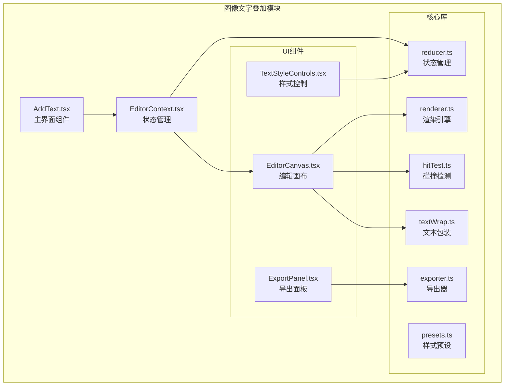

**图表来源**
- [AddText.tsx:1-182](file://src/tools/image/add-text/AddText.tsx#L1-L182)
- [EditorContext.tsx:1-185](file://src/tools/image/add-text/EditorContext.tsx#L1-L185)

**章节来源**
- [AddText.tsx:1-182](file://src/tools/image/add-text/AddText.tsx#L1-L182)
- [index.ts:1-37](file://src/tools/image/add-text/index.ts#L1-L37)

## 核心组件

### 主要功能特性

1. **多层文本编辑**：支持同时添加多个文本图层，每层可独立控制
2. **丰富样式控制**：字体、颜色、阴影、描边、渐变等全方位样式
3. **精确交互**：拖拽移动、旋转缩放、智能吸附对齐
4. **实时预览**：所见即所得的编辑体验
5. **高质量导出**：支持PNG、JPEG、WebP格式，可调节质量参数

### 技术架构

系统采用分层架构设计，确保代码的可维护性和扩展性：

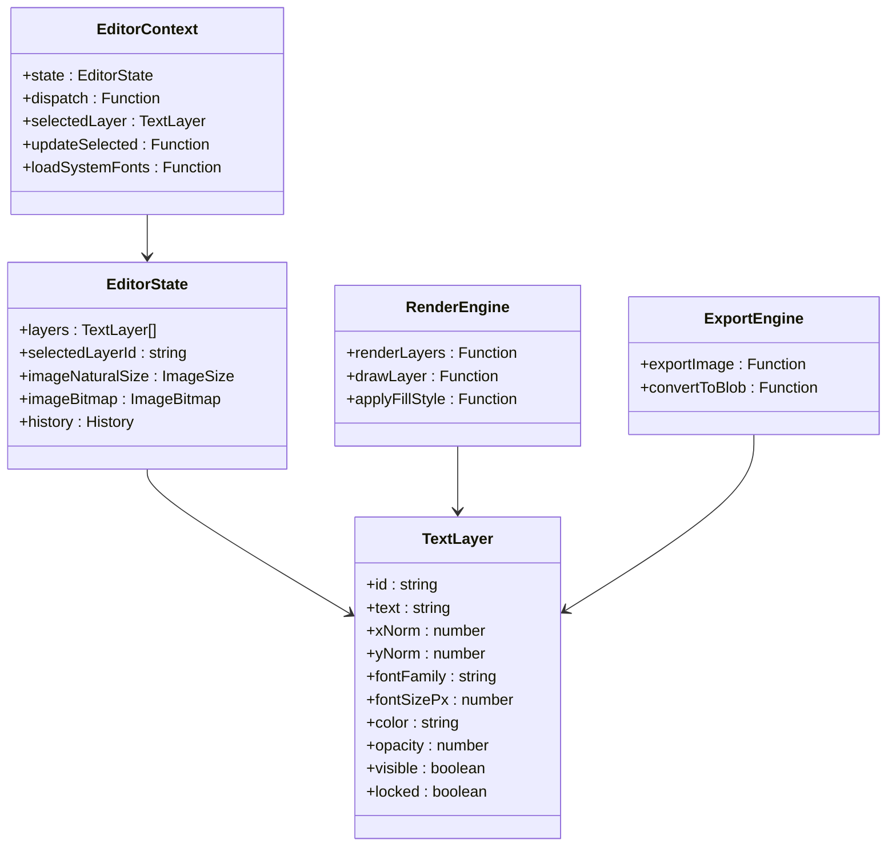

**图表来源**
- [EditorContext.tsx:33-49](file://src/tools/image/add-text/EditorContext.tsx#L33-L49)
- [reducer.ts:55-61](file://src/tools/image/add-text/lib/reducer.ts#L55-L61)
- [reducer.ts:8-48](file://src/tools/image/add-text/lib/reducer.ts#L8-L48)

**章节来源**
- [EditorContext.tsx:64-178](file://src/tools/image/add-text/EditorContext.tsx#L64-L178)
- [reducer.ts:135-265](file://src/tools/image/add-text/lib/reducer.ts#L135-L265)

## 架构概览

### 数据流架构

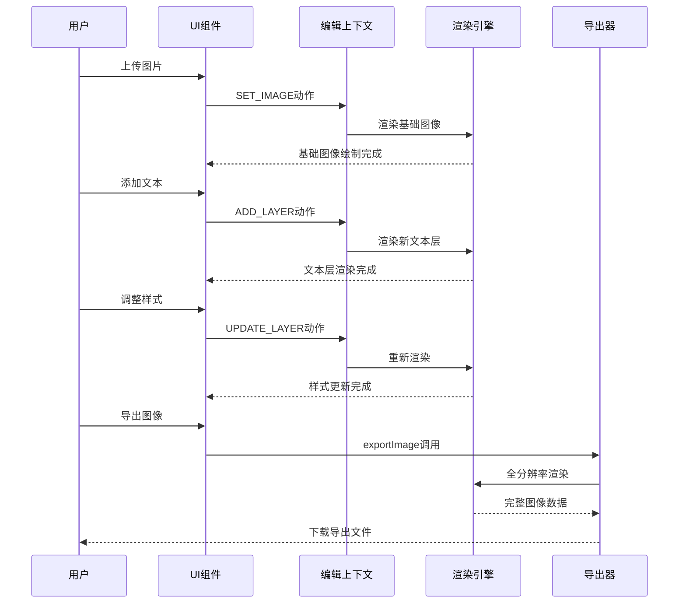

**图表来源**
- [AddText.tsx:45-78](file://src/tools/image/add-text/AddText.tsx#L45-L78)
- [EditorContext.tsx:115-124](file://src/tools/image/add-text/EditorContext.tsx#L115-L124)
- [exporter.ts:21-66](file://src/tools/image/add-text/lib/exporter.ts#L21-L66)

### 状态管理流程

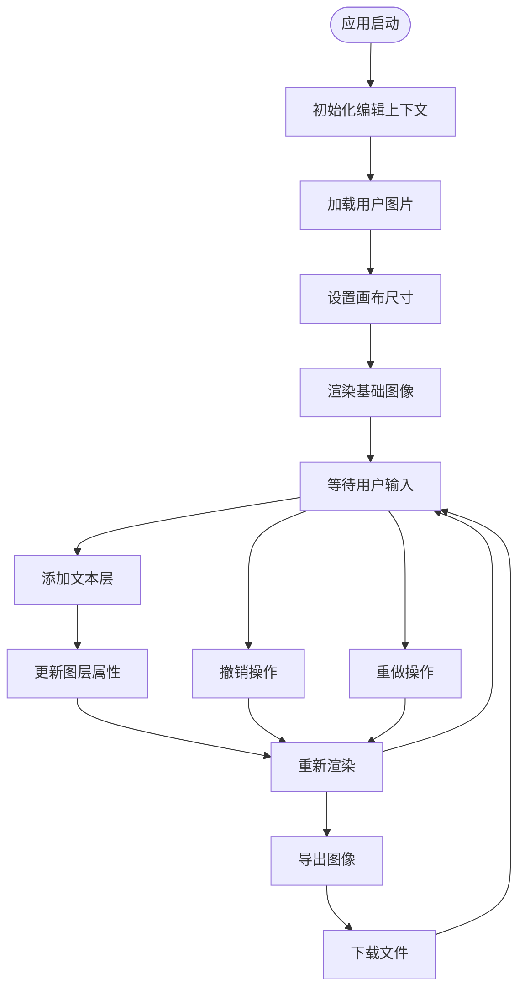

**图表来源**
- [reducer.ts:135-265](file://src/tools/image/add-text/lib/reducer.ts#L135-L265)
- [renderer.ts:18-25](file://src/tools/image/add-text/lib/renderer.ts#L18-L25)

**章节来源**
- [renderer.ts:18-496](file://src/tools/image/add-text/lib/renderer.ts#L18-L496)
- [exporter.ts:21-66](file://src/tools/image/add-text/lib/exporter.ts#L21-L66)

## 详细组件分析

### 编辑上下文系统

编辑上下文是整个系统的中枢，负责管理全局状态和提供响应式更新机制。

#### 状态结构设计

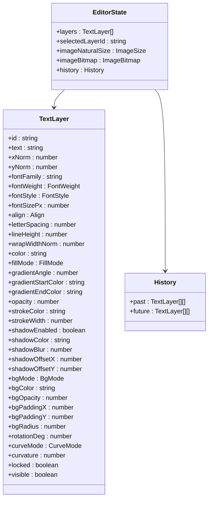

**图表来源**
- [reducer.ts:55-61](file://src/tools/image/add-text/lib/reducer.ts#L55-L61)
- [reducer.ts:8-48](file://src/tools/image/add-text/lib/reducer.ts#L8-L48)

#### 历史管理机制

系统实现了智能的历史记录管理，支持撤销和重做功能：

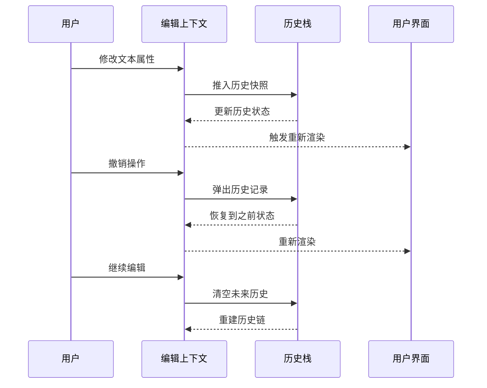

**图表来源**
- [reducer.ts:220-245](file://src/tools/image/add-text/lib/reducer.ts#L220-L245)

**章节来源**
- [EditorContext.tsx:64-178](file://src/tools/image/add-text/EditorContext.tsx#L64-L178)
- [reducer.ts:135-265](file://src/tools/image/add-text/lib/reducer.ts#L135-L265)

### 渲染引擎

渲染引擎是系统的核心，负责将抽象的文本图层转换为最终的像素输出。

#### 渲染管道

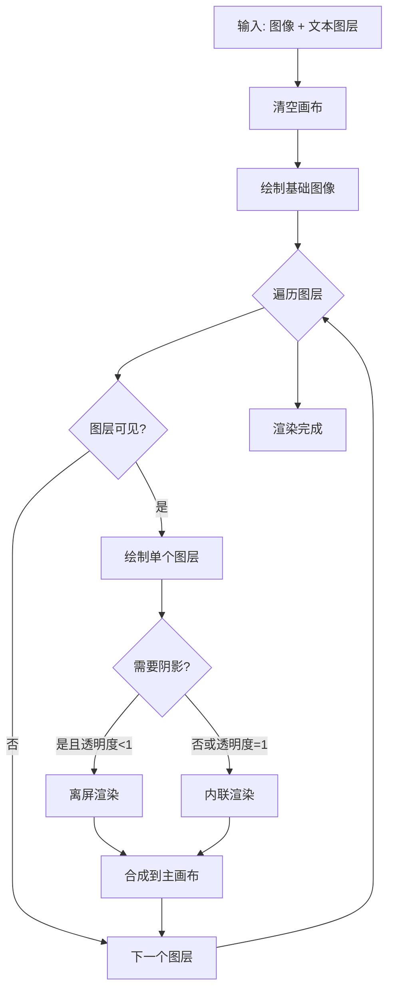

**图表来源**
- [renderer.ts:18-25](file://src/tools/image/add-text/lib/renderer.ts#L18-L25)
- [renderer.ts:39-60](file://src/tools/image/add-text/lib/renderer.ts#L39-L60)

#### 高级渲染技术

系统实现了多种高级渲染技术以确保视觉质量和性能：

1. **离屏渲染**：当文本具有阴影且透明度小于1时，使用离屏画布避免alpha混合错误
2. **弧形文本**：支持沿弧线排列的文本效果
3. **智能背景**：支持全包围、行包围和单词包围三种背景模式
4. **渐变填充**：支持线性渐变的动态计算

**章节来源**
- [renderer.ts:248-332](file://src/tools/image/add-text/lib/renderer.ts#L248-L332)
- [renderer.ts:152-198](file://src/tools/image/add-text/lib/renderer.ts#L152-L198)

### 导出系统

导出系统提供了高质量的图像导出功能，支持多种格式和质量选项。

#### 导出流程

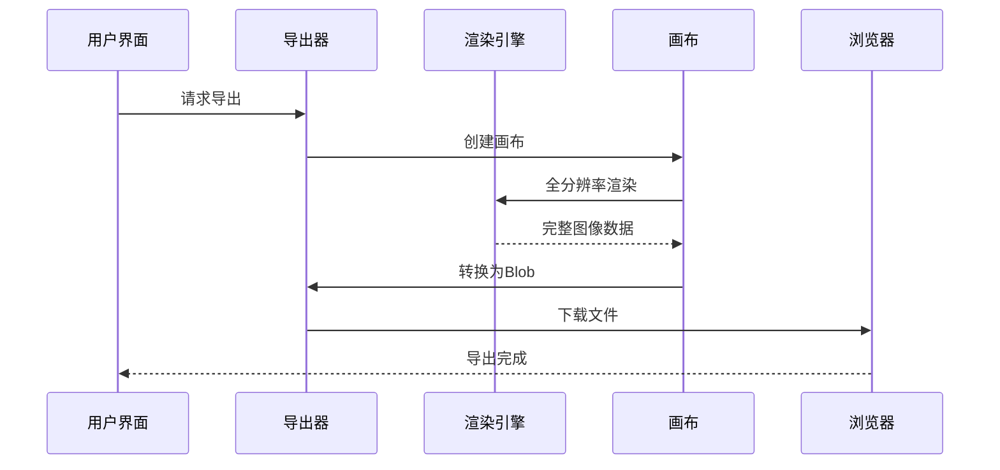

**图表来源**
- [exporter.ts:21-66](file://src/tools/image/add-text/lib/exporter.ts#L21-L66)

#### 格式支持

系统支持以下导出格式：

| 格式 | MIME类型 | 特点 | 适用场景 |
|------|----------|------|----------|
| PNG | image/png | 无损压缩 | 需要透明度的图像 |
| JPEG | image/jpeg | 有损压缩 | 照片类图像 |
| WebP | image/webp | 现代压缩 | 网络优化 |

**章节来源**
- [exporter.ts:11-15](file://src/tools/image/add-text/lib/exporter.ts#L11-L15)
- [exporter.ts:52-66](file://src/tools/image/add-text/lib/exporter.ts#L52-L66)

### 用户界面组件

#### 编辑画布

编辑画布是用户交互的核心区域，提供了直观的可视化编辑体验。

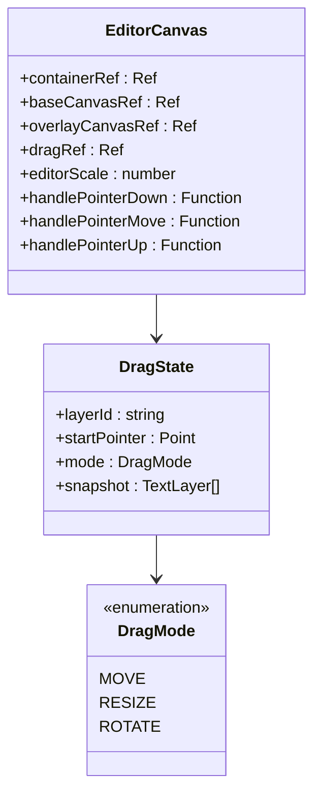

**图表来源**
- [EditorCanvas.tsx:65-485](file://src/tools/image/add-text/components/EditorCanvas.tsx#L65-L485)

#### 样式控制面板

样式控制面板提供了丰富的文本样式调整选项：

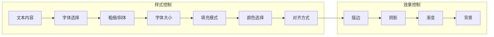

**图表来源**
- [TextStyleControls.tsx:9-179](file://src/tools/image/add-text/components/TextStyleControls.tsx#L9-L179)

**章节来源**
- [EditorCanvas.tsx:224-485](file://src/tools/image/add-text/components/EditorCanvas.tsx#L224-L485)
- [TextStyleControls.tsx:9-179](file://src/tools/image/add-text/components/TextStyleControls.tsx#L9-L179)

## 依赖关系分析

### 内部依赖关系

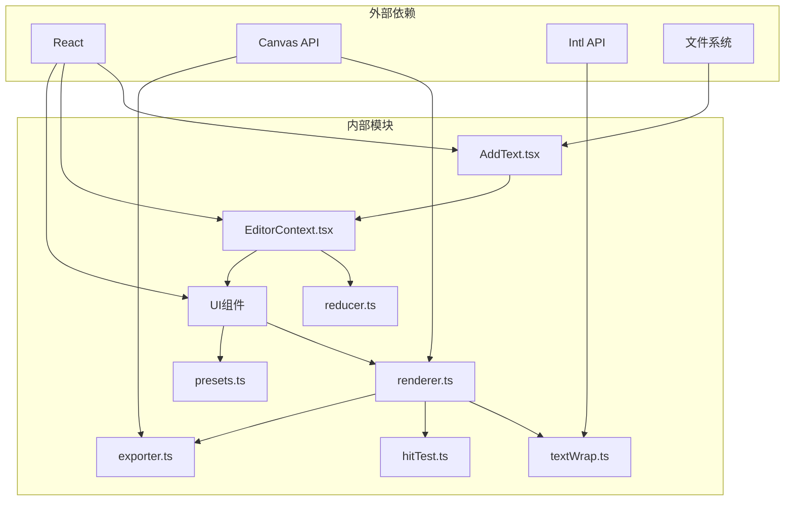

**图表来源**
- [AddText.tsx:1-182](file://src/tools/image/add-text/AddText.tsx#L1-L182)
- [EditorContext.tsx:1-185](file://src/tools/image/add-text/EditorContext.tsx#L1-L185)

### 外部API集成

系统集成了多个浏览器API以提供增强功能：

1. **Canvas API**：用于图像渲染和导出
2. **Local Font Access API**：访问系统字体
3. **Intl.Segmenter**：支持多语言文本分割
4. **OffscreenCanvas**：后台渲染支持

**章节来源**
- [EditorContext.tsx:126-154](file://src/tools/image/add-text/EditorContext.tsx#L126-L154)
- [textWrap.ts:5-19](file://src/tools/image/add-text/lib/textWrap.ts#L5-L19)

## 性能考虑

### 渲染性能优化

系统采用了多项性能优化策略：

1. **增量渲染**：只重新渲染发生变化的图层
2. **离屏缓存**：复杂效果使用离屏画布缓存
3. **智能缩放**：根据屏幕密度调整画布分辨率
4. **内存管理**：及时释放ImageBitmap资源

### 内存管理

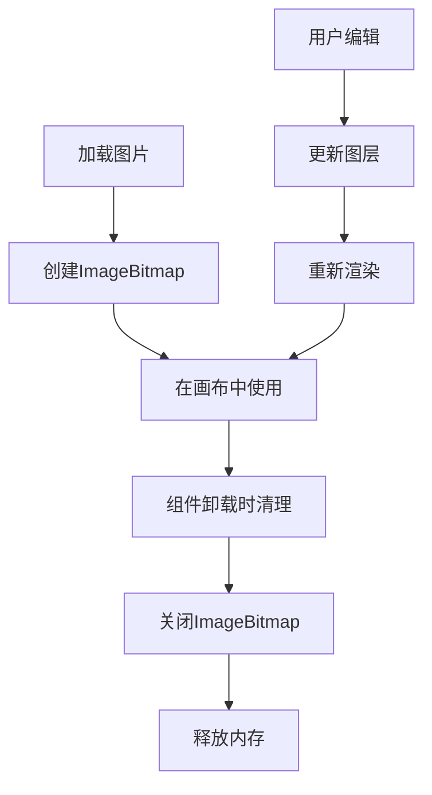

**图表来源**
- [AddText.tsx:38-78](file://src/tools/image/add-text/AddText.tsx#L38-L78)
- [EditorContext.tsx:70-79](file://src/tools/image/add-text/EditorContext.tsx#L70-L79)

### 导出性能

导出过程经过了专门的性能优化：

1. **OffscreenCanvas优先**：现代浏览器使用离屏画布
2. **质量平衡**：在质量与速度之间找到最佳平衡点
3. **异步处理**：避免阻塞主线程
4. **错误恢复**：处理各种导出失败情况

## 故障排除指南

### 常见问题及解决方案

#### 图像加载问题

**问题**：图片无法加载或显示空白
**可能原因**：
- 文件格式不支持
- 文件损坏
- 内存不足

**解决方法**：
1. 检查文件格式是否为常见的图片格式
2. 尝试重新上传文件
3. 关闭其他占用内存的应用程序

#### 文本渲染异常

**问题**：文本显示不正确或样式错乱
**可能原因**：
- 字体加载失败
- 字符编码问题
- 浏览器兼容性

**解决方法**：
1. 切换到系统默认字体
2. 检查文本内容的特殊字符
3. 更新浏览器版本

#### 导出失败

**问题**：导出过程中出现错误
**可能原因**：
- 内存不足
- 浏览器限制
- 文件过大

**解决方法**：
1. 减小图像尺寸或质量
2. 关闭其他标签页释放内存
3. 尝试不同的浏览器

**章节来源**
- [AddText.tsx:58-76](file://src/tools/image/add-text/AddText.tsx#L58-L76)
- [exporter.ts:81-98](file://src/tools/image/add-text/lib/exporter.ts#L81-L98)

### 开发者调试

#### 调试工具

系统提供了完善的调试机制：

1. **状态检查**：通过浏览器开发者工具查看当前状态
2. **渲染监控**：监控渲染性能指标
3. **内存泄漏检测**：定期检查内存使用情况

#### 错误处理

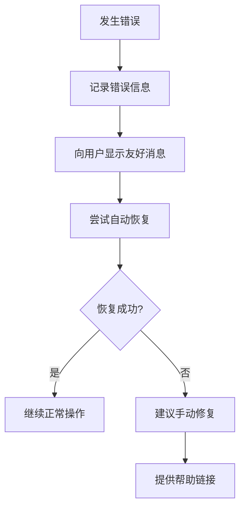

## 结论

图像文字叠加功能展现了现代Web应用的技术水平，通过精心设计的架构和丰富的功能特性，为用户提供了专业级的图像编辑体验。

### 技术亮点

1. **完整的编辑器架构**：从状态管理到渲染引擎的完整实现
2. **高性能渲染**：利用Canvas API和现代浏览器特性
3. **丰富的交互体验**：直观的拖拽操作和实时预览
4. **专业的导出功能**：支持多种格式和质量选项

### 未来发展方向

1. **移动端优化**：提升触摸交互体验
2. **AI辅助功能**：集成智能排版和样式推荐
3. **云存储集成**：支持在线保存和协作
4. **插件系统**：扩展更多自定义功能

该系统不仅满足了当前的功能需求，更为未来的功能扩展奠定了坚实的基础，是一个值得学习和参考的优秀项目实现。