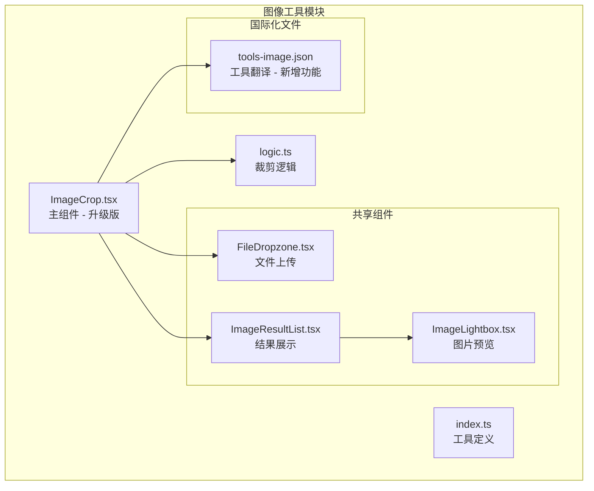
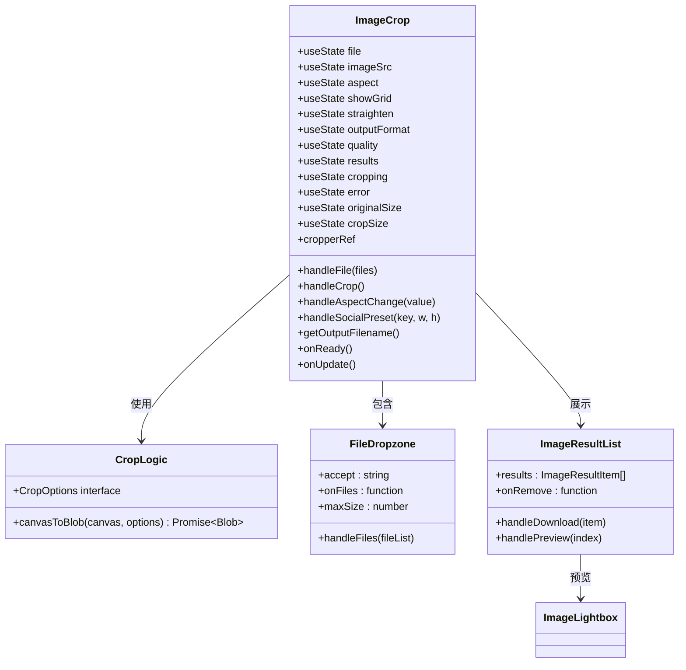
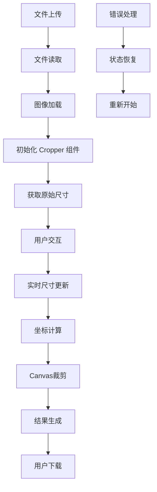
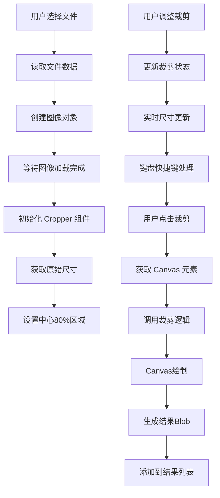
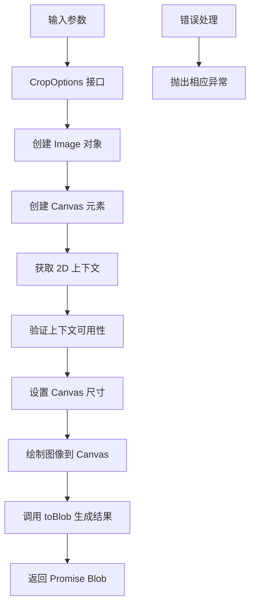
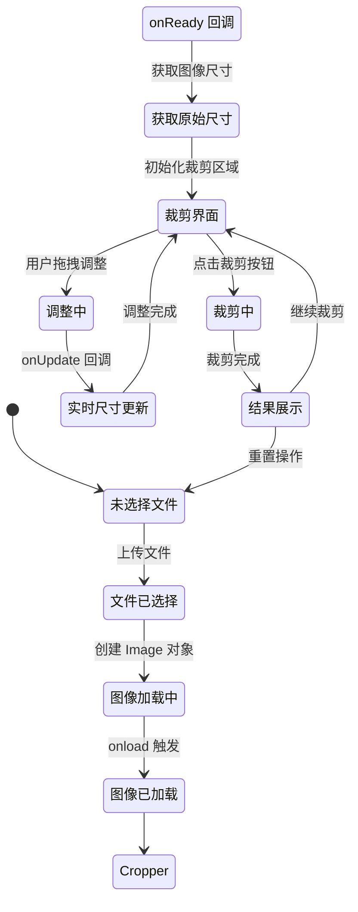
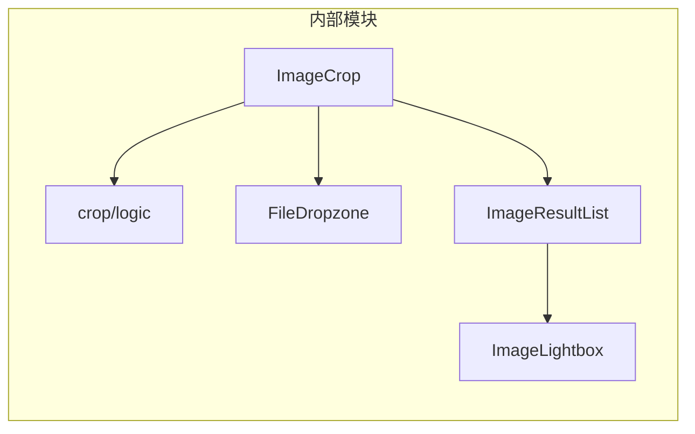
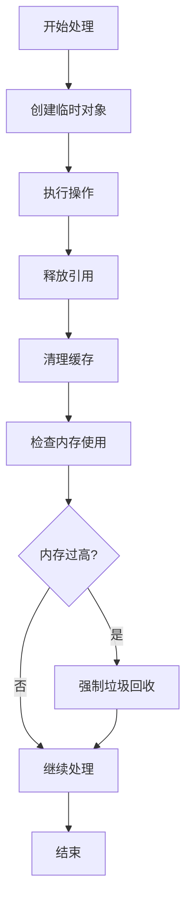
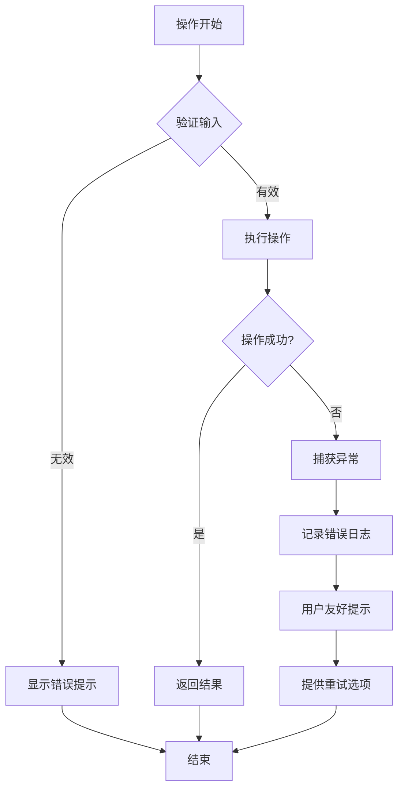

# 图像裁剪

<cite>
**本文档引用的文件**
- [ImageCrop.tsx](file://src/tools/image/crop/ImageCrop.tsx)
- [logic.ts](file://src/tools/image/crop/logic.ts)
- [index.ts](file://src/tools/image/crop/index.ts)
- [ImageResultList.tsx](file://src/components/shared/ImageResultList.tsx)
- [FileDropzone.tsx](file://src/components/shared/FileDropzone.tsx)
- [ImageLightbox.tsx](file://src/components/shared/ImageLightbox.tsx)
- [tools-image.json](file://messages/en/tools-image.json)
- [package.json](file://package.json)
</cite>

## 更新摘要
**变更内容**
- 从 react-image-crop 迁移到 react-advanced-cropper v0.20.1
- 新增实时维度显示功能（原始尺寸和输出尺寸）
- 添加键盘快捷键支持（+/- 缩放、Enter 裁剪、Escape 重置）
- 集成社交媒体预设（Instagram、YouTube、Facebook 等）
- 增强图像变换工具（旋转、翻转、直角校正）
- 改进 UI 设计和用户体验
- 新增网格覆盖和工具栏功能

## 目录
1. [简介](#简介)
2. [项目结构](#项目结构)
3. [核心组件](#核心组件)
4. [架构概览](#架构概览)
5. [详细组件分析](#详细组件分析)
6. [依赖关系分析](#依赖关系分析)
7. [性能考虑](#性能考虑)
8. [故障排除指南](#故障排除指南)
9. [结论](#结论)

## 简介

图像裁剪工具是一个基于浏览器的在线图像处理工具，现已升级为基于 react-advanced-cropper 的现代化版本。该工具提供了丰富的交互式裁剪功能，包括实时预览、键盘快捷键、社交媒体预设和高级图像变换工具。

**重大升级特性**：
- **react-advanced-cropper 集成**：提供更强大的裁剪引擎和更好的用户体验
- **实时维度显示**：显示原始图像尺寸和输出尺寸百分比
- **键盘快捷键**：+/- 缩放、Enter 裁剪、Escape 重置
- **社交媒体预设**：一键应用 Instagram、YouTube、Facebook 等平台尺寸
- **高级变换工具**：旋转、翻转、直角校正和网格覆盖
- **增强的 UI 设计**：现代化的工具栏和标签页界面

## 项目结构

图像裁剪工具位于项目的图像处理工具模块中，采用清晰的文件组织结构：



**图表来源**
- [ImageCrop.tsx:1-573](file://src/tools/image/crop/ImageCrop.tsx#L1-L573)
- [logic.ts:1-30](file://src/tools/image/crop/logic.ts#L1-L30)
- [index.ts:1-37](file://src/tools/image/crop/index.ts#L1-L37)

**章节来源**
- [ImageCrop.tsx:1-573](file://src/tools/image/crop/ImageCrop.tsx#L1-L573)
- [logic.ts:1-30](file://src/tools/image/crop/logic.ts#L1-L30)
- [index.ts:1-37](file://src/tools/image/crop/index.ts#L1-L37)

## 核心组件

### 主要组件架构

图像裁剪工具由以下核心组件构成，现已升级为更强大的版本：

1. **ImageCrop 组件** - 主要的裁剪界面组件，基于 react-advanced-cropper
2. **裁剪逻辑模块** - 处理实际的图像裁剪操作
3. **文件上传组件** - 提供拖拽和文件选择功能
4. **结果展示组件** - 显示和管理裁剪结果
5. **国际化支持** - 多语言界面支持，包含新功能翻译

### 组件关系图



**图表来源**
- [ImageCrop.tsx:62-89](file://src/tools/image/crop/ImageCrop.tsx#L62-L89)
- [logic.ts:1-30](file://src/tools/image/crop/logic.ts#L1-L30)
- [FileDropzone.tsx:39-47](file://src/components/shared/FileDropzone.tsx#L39-L47)
- [ImageResultList.tsx:16-19](file://src/components/shared/ImageResultList.tsx#L16-L19)

**章节来源**
- [ImageCrop.tsx:62-89](file://src/tools/image/crop/ImageCrop.tsx#L62-L89)
- [logic.ts:1-30](file://src/tools/image/crop/logic.ts#L1-L30)

## 架构概览

### 整体工作流程

图像裁剪工具采用事件驱动的架构模式，通过状态管理和异步处理实现完整的裁剪流程，现已集成 react-advanced-cropper：


**图表来源**
- [ImageCrop.tsx:142-150](file://src/tools/image/crop/ImageCrop.tsx#L142-L150)
- [ImageCrop.tsx:133-140](file://src/tools/image/crop/ImageCrop.tsx#L133-L140)
- [logic.ts:9-29](file://src/tools/image/crop/logic.ts#L9-L29)

### 数据流架构



**图表来源**
- [ImageCrop.tsx:93-101](file://src/tools/image/crop/ImageCrop.tsx#L93-L101)
- [ImageCrop.tsx:142-150](file://src/tools/image/crop/ImageCrop.tsx#L142-L150)
- [logic.ts:9-29](file://src/tools/image/crop/logic.ts#L9-L29)

## 详细组件分析

### ImageCrop 主组件

#### 核心状态管理

ImageCrop 组件管理多个关键状态变量，现已扩展以支持新功能：

| 状态变量 | 类型 | 描述 | 默认值 |
|---------|------|------|--------|
| file | File \| null | 上传的原始文件 | null |
| imageSrc | string | 图像数据URL | "" |
| aspect | number | 选择的比例值 | 0 |
| showGrid | boolean | 是否显示网格 | true |
| straighten | number | 直角校正角度 | 0 |
| outputFormat | string | 输出格式 | "" |
| quality | number | 压缩质量 | 92 |
| activePreset | string \| null | 激活的社交媒体预设 | null |
| originalSize | {w: number, h: number} | 原始图像尺寸 | {w: 0, h: 0} |
| cropSize | {w: number, h: number} | 裁剪后尺寸 | {w: 0, h: 0} |
| results | ImageResultItem[] | 裁剪结果列表 | [] |
| cropping | boolean | 裁剪进行中状态 | false |
| error | string | 错误信息 | "" |

#### 裁剪算法实现



**图表来源**
- [ImageCrop.tsx:93-101](file://src/tools/image/crop/ImageCrop.tsx#L93-L101)
- [ImageCrop.tsx:174-207](file://src/tools/image/crop/ImageCrop.tsx#L174-L207)

#### 比例裁剪机制

系统支持多种预设比例和社交媒体预设：

| 比例类型 | 数值 | 用途 | 推荐场景 |
|---------|------|------|----------|
| 自由裁剪 | 0 | 无约束裁剪 | 自定义尺寸需求 |
| 1:1 | 1 | 正方形裁剪 | 头像制作、图标 |
| 4:3 | 1.33 | 标准矩形 | 传统照片 |
| 3:4 | 0.75 | 竖向矩形 | 竖屏截图 |
| 16:9 | 1.78 | 宽屏比例 | 视频截图、横幅 |
| 9:16 | 0.56 | 竖向宽屏 | 手机竖屏内容 |
| 3:2 | 1.5 | 摄影标准 | DSLR照片 |
| 2:3 | 0.67 | 竖向摄影 | 竖向照片 |

**新增社交媒体预设**：

| 平台 | 尺寸 | 用途 |
|------|------|------|
| Instagram Post | 1080×1080 | 社交媒体帖子 |
| Instagram Story | 1080×1920 | Instagram 故事 |
| Facebook Cover | 820×312 | Facebook 封面 |
| YouTube Thumbnail | 1280×720 | YouTube 缩略图 |
| X/Twitter Header | 1500×500 | Twitter/X 头部 |
| LinkedIn Post | 1200×627 | LinkedIn 文章 |

**章节来源**
- [ImageCrop.tsx:29-47](file://src/tools/image/crop/ImageCrop.tsx#L29-L47)
- [ImageCrop.tsx:159-162](file://src/tools/image/crop/ImageCrop.tsx#L159-L162)

### Canvas 裁剪算法

#### 核心裁剪流程

裁剪逻辑基于 HTML5 Canvas API 实现，确保高质量的图像处理：



**图表来源**
- [logic.ts:9-29](file://src/tools/image/crop/logic.ts#L9-L29)

#### 坐标转换算法

系统实现了精确的坐标转换机制，确保显示尺寸与实际尺寸的一致性：

```mermaid
flowchart LR
subgraph "显示坐标系"
A[x_px, y_px, w_px, h_px]
end
subgraph "自然坐标系"
B[x_n, y_n, w_n, h_n]
end
subgraph "转换因子"
C[scaleX = nWidth/wWidth]
D[scaleY = nHeight/wHeight]
end
A --> C
C --> D
D --> B
B --> E[x_n = round(x_px * scaleX)]
B --> F[y_n = round(y_px * scaleY)]
B --> G[w_n = round(w_px * scaleX)]
B --> H[h_n = round(h_px * scaleY)]
```

**图表来源**
- [ImageCrop.tsx:133-140](file://src/tools/image/crop/ImageCrop.tsx#L133-L140)

**章节来源**
- [logic.ts:1-30](file://src/tools/image/crop/logic.ts#L1-L30)

### 用户交互设计

#### 实时预览机制

系统采用 React 的响应式状态管理实现实时预览，现已集成 react-advanced-cropper：



#### 键盘快捷键支持

系统集成了完整的键盘快捷键支持：

| 快捷键 | 功能 | 说明 |
|--------|------|------|
| Enter | 裁剪 | 立即执行裁剪操作 |
| Escape | 重置 | 重置所有裁剪设置 |
| + | 放大 | 增加图像缩放级别 |
| - | 缩小 | 减少图像缩放级别 |

#### 边界处理策略

系统实现了完善的边界条件处理：

| 处理场景 | 策略 | 实现方式 |
|---------|------|----------|
| 超大图像 | 缩放显示 | 最大高度400px限制 |
| 超小图像 | 放大显示 | 自适应缩放 |
| 比例溢出 | 自动调整 | 计算最大可容纳尺寸 |
| 错误文件 | 友好提示 | 错误边界检测 |
| 内存不足 | 进度反馈 | 异步处理避免阻塞 |

**新增功能**：
- **实时尺寸显示**：显示原始图像尺寸和输出尺寸百分比
- **网格覆盖**：可切换的规则分割线网格
- **图像变换工具**：旋转、翻转、直角校正
- **社交媒体预设**：一键应用平台特定尺寸

**章节来源**
- [ImageCrop.tsx:214-250](file://src/tools/image/crop/ImageCrop.tsx#L214-L250)
- [ImageCrop.tsx:298-322](file://src/tools/image/crop/ImageCrop.tsx#L298-L322)
- [ImageCrop.tsx:324-425](file://src/tools/image/crop/ImageCrop.tsx#L324-L425)

## 依赖关系分析

### 外部依赖

图像裁剪工具依赖以下关键外部库，现已升级：

```mermaid
graph TB
subgraph "核心依赖"
RAC[react-advanced-cropper<br/>v0.20.1]
RI[react<br/>v19.2.3]
ND[next<br/>v16.2.1]
end
subgraph "工具库"
BI[browser-image-compression<br/>v2.0.2]
HE[heic2any<br/>v0.0.4]
FF[@ffmpeg/ffmpeg<br/>v0.12.15]
end
subgraph "UI组件"
LC[lucide-react<br/>图标库]
TW[tailwind-merge<br/>样式合并]
end
IC[ImageCrop组件] --> RAC
IC --> RI
IC --> ND
IC --> BI
IC --> LC
```

**图表来源**
- [package.json:30](file://package.json#L30)
- [package.json:11-32](file://package.json#L11-L32)

### 内部组件依赖



**图表来源**
- [ImageCrop.tsx:8-12](file://src/tools/image/crop/ImageCrop.tsx#L8-L12)
- [ImageResultList.tsx:7](file://src/components/shared/ImageResultList.tsx#L7)

**章节来源**
- [package.json:30](file://package.json#L30)
- [ImageCrop.tsx:8-12](file://src/tools/image/crop/ImageCrop.tsx#L8-L12)

## 性能考虑

### 大图像处理优化

针对大尺寸图像的处理策略：

1. **延迟加载机制**
   - 图像以DataURL形式加载，避免服务器请求
   - 使用maxHeight限制防止DOM过大

2. **Canvas内存管理**
   - 及时释放Canvas和Image对象引用
   - 使用WeakMap缓存URL避免内存泄漏

3. **异步处理**
   - 裁剪操作使用Promise避免UI阻塞
   - 分批处理多个结果避免内存峰值

4. **react-advanced-cropper 优化**
   - 更高效的渲染机制
   - 改进的缩放和变换性能
   - 优化的事件处理

### 内存管理策略



### 性能监控指标

| 指标类型 | 目标值 | 监控方法 |
|---------|--------|----------|
| 响应时间 | < 2秒 | 用户操作到界面更新 |
| 内存使用 | < 500MB | 浏览器性能面板 |
| FPS流畅度 | > 30fps | requestAnimationFrame监控 |
| 处理速度 | > 100KB/s | 文件大小/处理时间 |

## 故障排除指南

### 常见问题及解决方案

#### 图像无法加载

**症状**: 上传后无反应或显示错误

**可能原因**:
1. 文件格式不支持
2. 文件损坏
3. 浏览器兼容性问题

**解决步骤**:
1. 检查文件扩展名（支持JPG、PNG、WEBP等）
2. 验证文件完整性
3. 尝试其他浏览器
4. 减小文件尺寸

#### 裁剪结果质量差

**症状**: 输出图像模糊或失真

**可能原因**:
1. 原始图像分辨率过低
2. Canvas渲染参数不当
3. 浏览器图形驱动问题

**解决步骤**:
1. 使用更高分辨率的源图像
2. 检查浏览器图形设置
3. 更新显卡驱动
4. 尝试禁用硬件加速

#### 内存使用过高

**症状**: 页面卡顿或浏览器崩溃

**可能原因**:
1. 处理超大图像
2. 同时处理多个图像
3. 内存泄漏

**解决步骤**:
1. 关闭其他标签页释放内存
2. 重启浏览器
3. 使用更小的图像尺寸
4. 分批处理图像

#### react-advanced-cropper 特定问题

**症状**: 裁剪界面不响应或显示异常

**可能原因**:
1. Cropper 组件初始化失败
2. 事件监听器冲突
3. 样式覆盖问题

**解决步骤**:
1. 检查网络连接和资源加载
2. 清除浏览器缓存
3. 检查自定义样式覆盖
4. 重新初始化 Cropper 组件

### 错误处理机制

系统实现了多层次的错误处理：



**章节来源**
- [ImageCrop.tsx:201-207](file://src/tools/image/crop/ImageCrop.tsx#L201-L207)
- [logic.ts:16-28](file://src/tools/image/crop/logic.ts#L16-L28)

## 结论

图像裁剪工具经过重大升级，现已发展为一个功能完整、用户体验优秀的浏览器端图像处理工具。其主要优势包括：

### 技术优势
- **react-advanced-cropper 集成**：提供更强大的裁剪引擎和更好的用户体验
- **完全本地化**: 所有处理都在浏览器中完成，保护用户隐私
- **高质量输出**: 基于Canvas API，保持原图质量
- **响应式设计**: 适配各种设备和屏幕尺寸
- **实时预览**: 即时反馈用户操作结果
- **键盘快捷键**: 提升专业用户的工作效率

### 功能特色
- **多模式支持**: 预设比例、自由裁剪、社交媒体预设
- **智能缩放**: 自动处理不同分辨率图像
- **批量处理**: 支持多个图像同时处理
- **结果管理**: 方便的结果查看和下载
- **图像变换**: 旋转、翻转、直角校正
- **网格覆盖**: 规则分割线辅助构图
- **实时尺寸显示**: 显示原始和输出尺寸

### 应用场景
该工具适用于多种专业和日常应用场景：
- **社交媒体**: 制作符合平台要求的头像和封面
- **电商网站**: 规范产品图片尺寸和比例
- **内容创作**: 快速处理和优化图片素材
- **个人使用**: 照片整理和分享准备
- **专业设计**: 需要精确裁剪和变换的场景

通过持续的性能优化和用户体验改进，该工具为用户提供了一个强大而易用的图像裁剪解决方案。react-advanced-cropper 的集成进一步提升了工具的专业性和可靠性，使其成为现代网页应用的理想选择。