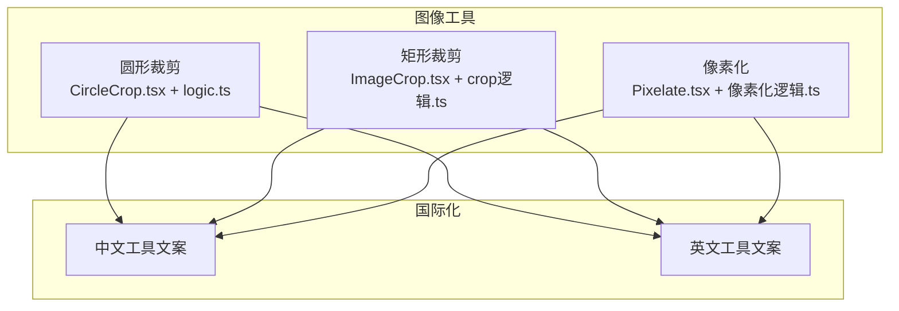
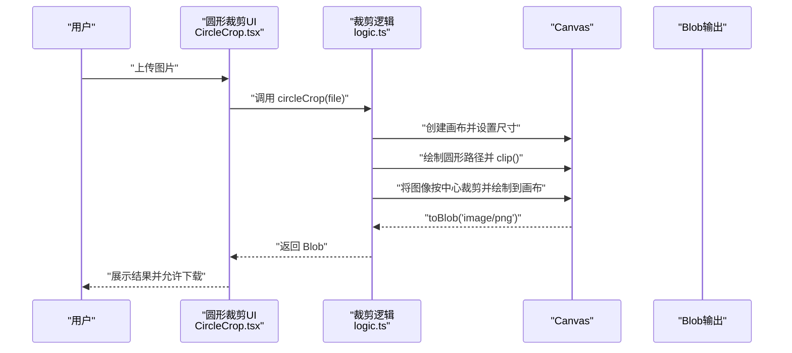
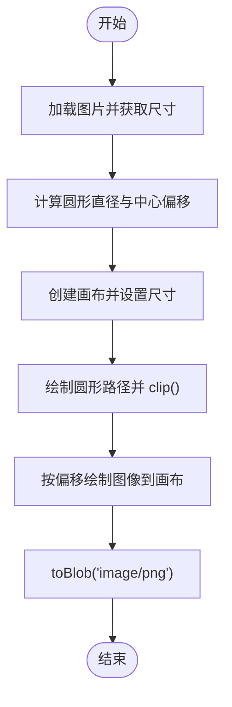
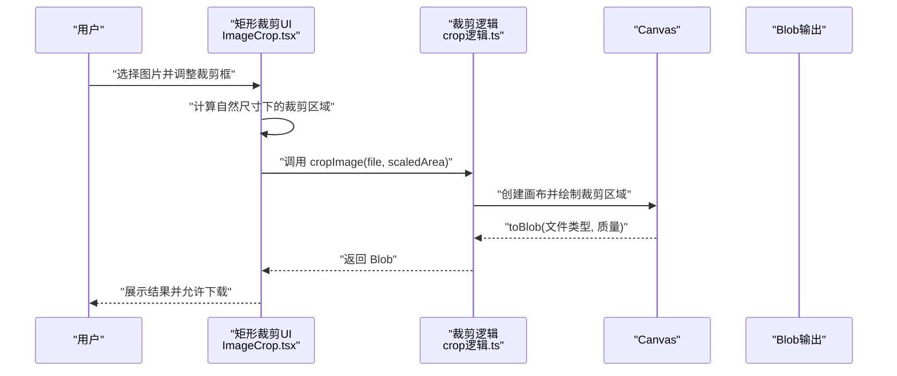
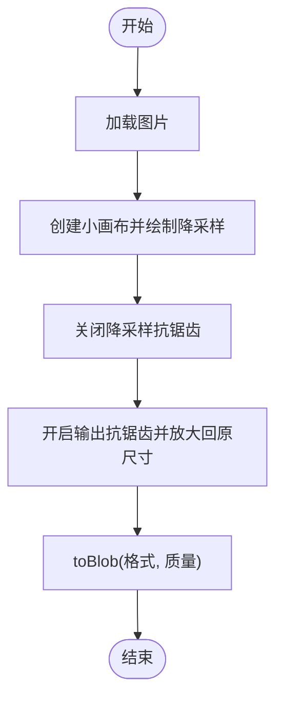
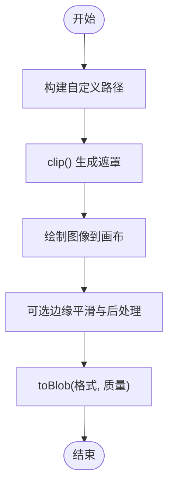
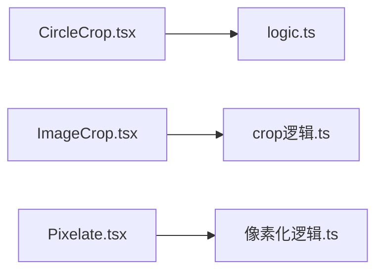

# 形状裁剪

<cite>
**本文引用的文件**
- [CircleCrop.tsx](file://src/tools/image/circle-crop/CircleCrop.tsx)
- [logic.ts](file://src/tools/image/circle-crop/logic.ts)
- [ImageCrop.tsx](file://src/tools/image/crop/ImageCrop.tsx)
- [crop逻辑.ts](file://src/tools/image/crop/logic.ts)
- [Pixelate.tsx](file://src/tools/image/pixelate/Pixelate.tsx)
- [像素化逻辑.ts](file://src/tools/image/pixelate/logic.ts)
- [工具国际化-中文](file://messages/zh-Hans/tools-image.json)
- [工具国际化-英文](file://messages/en/tools-image.json)
</cite>

## 目录
1. [简介](#简介)
2. [项目结构](#项目结构)
3. [核心组件](#核心组件)
4. [架构总览](#架构总览)
5. [详细组件分析](#详细组件分析)
6. [依赖关系分析](#依赖关系分析)
7. [性能考虑](#性能考虑)
8. [故障排查指南](#故障排查指南)
9. [结论](#结论)
10. [附录](#附录)

## 简介
本文件围绕“形状裁剪”工具进行全面技术说明，重点覆盖圆形裁剪的实现原理（蒙版生成与像素遮罩）、精确度与边缘平滑策略、参数调节与自定义路径绘制、与背景融合及透明度处理、性能优化与实时预览、创意应用场景以及质量评估与对比。当前仓库中提供了“圆形裁剪”“矩形裁剪”“像素化”等工具，本文将以这些实现为基础，扩展到通用形状裁剪的数学基础与工程实践。

## 项目结构
- 图像处理工具位于 src/tools/image 下，按功能模块划分：
  - 圆形裁剪：CircleCrop.tsx + logic.ts
  - 矩形裁剪：ImageCrop.tsx + crop逻辑.ts
  - 像素化：Pixelate.tsx + 像素化逻辑.ts
- 国际化文案集中于 messages/*/tools-image.json，包含各工具的名称、描述、使用说明、特性列表与隐私说明等。

**图表来源**
- [CircleCrop.tsx:1-67](file://src/tools/image/circle-crop/CircleCrop.tsx#L1-L67)
- [logic.ts:1-40](file://src/tools/image/circle-crop/logic.ts#L1-L40)
- [ImageCrop.tsx:1-196](file://src/tools/image/crop/ImageCrop.tsx#L1-L196)
- [crop逻辑.ts:1-59](file://src/tools/image/crop/logic.ts#L1-L59)
- [Pixelate.tsx:1-88](file://src/tools/image/pixelate/Pixelate.tsx#L1-L88)
- [像素化逻辑.ts:1-49](file://src/tools/image/pixelate/logic.ts#L1-L49)
- [工具国际化-中文:494-535](file://messages/zh-Hans/tools-image.json#L494-L535)
- [工具国际化-英文:494-535](file://messages/en/tools-image.json#L494-L535)

**章节来源**
- [CircleCrop.tsx:1-67](file://src/tools/image/circle-crop/CircleCrop.tsx#L1-L67)
- [logic.ts:1-40](file://src/tools/image/circle-crop/logic.ts#L1-L40)
- [ImageCrop.tsx:1-196](file://src/tools/image/crop/ImageCrop.tsx#L1-L196)
- [crop逻辑.ts:1-59](file://src/tools/image/crop/logic.ts#L1-L59)
- [Pixelate.tsx:1-88](file://src/tools/image/pixelate/Pixelate.tsx#L1-L88)
- [像素化逻辑.ts:1-49](file://src/tools/image/pixelate/logic.ts#L1-L49)
- [工具国际化-中文:494-535](file://messages/zh-Hans/tools-image.json#L494-L535)
- [工具国际化-英文:494-535](file://messages/en/tools-image.json#L494-L535)

## 核心组件
- 圆形裁剪（Circle Crop）
  - UI层：负责文件上传、状态管理、错误提示与结果展示。
  - 逻辑层：基于 Canvas 的路径裁剪与蒙版生成，输出 PNG（含透明通道）。
- 矩形裁剪（Image Crop）
  - UI层：基于交互式裁剪库，支持固定比例与自由裁剪，提供缩放与预览。
  - 逻辑层：将显示尺寸映射回自然尺寸，执行精确裁剪并输出 Blob。
- 像素化（Pixelate）
  - UI层：滑块调节像素块大小，支持预览与批量处理。
  - 逻辑层：双通道降采样与放大，避免同画布源/目标重叠导致的像素污染。

**章节来源**
- [CircleCrop.tsx:13-66](file://src/tools/image/circle-crop/CircleCrop.tsx#L13-L66)
- [logic.ts:1-40](file://src/tools/image/circle-crop/logic.ts#L1-L40)
- [ImageCrop.tsx:27-195](file://src/tools/image/crop/ImageCrop.tsx#L27-L195)
- [crop逻辑.ts:8-58](file://src/tools/image/crop/logic.ts#L8-L58)
- [Pixelate.tsx:13-87](file://src/tools/image/pixelate/Pixelate.tsx#L13-L87)
- [像素化逻辑.ts:1-49](file://src/tools/image/pixelate/logic.ts#L1-L49)

## 架构总览
圆形裁剪的端到端流程如下：

**图表来源**
- [CircleCrop.tsx:20-38](file://src/tools/image/circle-crop/CircleCrop.tsx#L20-L38)
- [logic.ts:1-40](file://src/tools/image/circle-crop/logic.ts#L1-L40)

## 详细组件分析

### 圆形裁剪实现原理
- 蒙版生成与像素遮罩
  - 使用路径绘制圆形，调用 clip() 创建遮罩，仅保留圆形区域内的像素。
  - 输出为 PNG，以保留透明背景。
- 数学基础
  - 以较短边作为直径，确保圆形完全包含在图像内；偏移量用于将圆形定位到图像中心。
- 边缘平滑与精确度
  - Canvas 默认抗锯齿策略在路径边缘产生柔和过渡；可通过调整采样策略与后处理进一步优化。
- 参数与自定义
  - 当前实现为自动中心裁剪；若需自定义路径，可在逻辑层扩展为任意路径绘制与裁剪。

**图表来源**
- [logic.ts:6-19](file://src/tools/image/circle-crop/logic.ts#L6-L19)

**章节来源**
- [logic.ts:1-40](file://src/tools/image/circle-crop/logic.ts#L1-L40)

### 矩形裁剪与交互式预览
- 交互式裁剪
  - 使用第三方裁剪库，支持固定比例与自由裁剪，提供缩放与预览。
- 尺寸映射
  - 将显示尺寸映射到自然尺寸，保证裁剪精度不受缩放影响。
- 输出与批量
  - 支持批量处理与结果列表管理。

**图表来源**
- [ImageCrop.tsx:97-121](file://src/tools/image/crop/ImageCrop.tsx#L97-L121)
- [crop逻辑.ts:8-58](file://src/tools/image/crop/logic.ts#L8-L58)

**章节来源**
- [ImageCrop.tsx:27-195](file://src/tools/image/crop/ImageCrop.tsx#L27-L195)
- [crop逻辑.ts:8-58](file://src/tools/image/crop/logic.ts#L8-L58)

### 像素化与边缘平滑
- 双通道降采样
  - 先在较小画布上绘制，再放大回原尺寸，避免同画布源/目标重叠导致的颜色污染。
- 抗锯齿与像素块大小
  - 降采样阶段启用抗锯齿，输出阶段关闭以形成清晰的像素块。

**图表来源**
- [像素化逻辑.ts:14-27](file://src/tools/image/pixelate/logic.ts#L14-L27)

**章节来源**
- [Pixelate.tsx:13-87](file://src/tools/image/pixelate/Pixelate.tsx#L13-L87)
- [像素化逻辑.ts:1-49](file://src/tools/image/pixelate/logic.ts#L1-L49)

### 多边形与自定义形状裁剪（扩展思路）
- 数学基础
  - 多边形：由顶点序列构成，可使用奇偶规则或非零环绕数判断点是否在多边形内。
  - 椭圆形：基于椭圆方程或参数方程，结合矩阵变换实现旋转与缩放。
- 蒙版生成
  - 使用路径 API 绘制任意闭合曲线，clip() 生成遮罩。
- 边缘平滑
  - 通过子像素采样与混合策略减少锯齿；必要时采用多重采样或后处理滤镜。
- 参数调节
  - 提供顶点编辑、旋转角度、缩放因子、平滑半径等参数面板。
- 自定义路径绘制
  - 支持导入 SVG 路径或手绘路径，转换为 Canvas 路径后进行裁剪。

[本图为概念性扩展示意，不对应具体源码文件，故不附“图表来源”]

### 与背景融合与透明度处理
- 背景融合
  - 圆形裁剪输出 PNG，透明区域可无缝叠加到任意背景。
- 透明度控制
  - 可在 UI 中增加透明度滑块，配合合成模式实现渐变或阴影效果。
- 性能权衡
  - 透明通道会增加内存占用与合成成本，建议在不需要透明时输出为 JPEG。

[本节为通用实践说明，不涉及具体源码文件]

### 创意应用示例
- 头像制作：圆形裁剪生成透明背景头像，适配社交平台与聊天工具。
- 徽标设计：矩形裁剪统一产品图比例，结合边框与阴影提升质感。
- 艺术效果：像素化用于隐私保护与复古风格，多边形裁剪打造几何艺术。

**章节来源**
- [工具国际化-中文:527-529](file://messages/zh-Hans/tools-image.json#L527-L529)
- [工具国际化-英文:527-529](file://messages/en/tools-image.json#L527-L529)

## 依赖关系分析
- 组件耦合
  - UI 组件仅负责状态与事件，业务逻辑集中在独立的 logic.ts 中，耦合度低、可测试性强。
- 外部依赖
  - 矩形裁剪依赖第三方裁剪库；圆形与像素化依赖 Canvas API。
- 潜在循环依赖
  - 各工具相互独立，无循环依赖风险。

**图表来源**
- [CircleCrop.tsx:1-67](file://src/tools/image/circle-crop/CircleCrop.tsx#L1-L67)
- [logic.ts:1-40](file://src/tools/image/circle-crop/logic.ts#L1-L40)
- [ImageCrop.tsx:1-196](file://src/tools/image/crop/ImageCrop.tsx#L1-L196)
- [crop逻辑.ts:1-59](file://src/tools/image/crop/logic.ts#L1-L59)
- [Pixelate.tsx:1-88](file://src/tools/image/pixelate/Pixelate.tsx#L1-L88)
- [像素化逻辑.ts:1-49](file://src/tools/image/pixelate/logic.ts#L1-L49)

**章节来源**
- [CircleCrop.tsx:1-67](file://src/tools/image/circle-crop/CircleCrop.tsx#L1-L67)
- [ImageCrop.tsx:1-196](file://src/tools/image/crop/ImageCrop.tsx#L1-L196)
- [Pixelate.tsx:1-88](file://src/tools/image/pixelate/Pixelate.tsx#L1-L88)

## 性能考虑
- Canvas 渲染
  - 对大图进行缩放与多次绘制时，优先使用离屏画布（OffscreenCanvas）以避免主线程阻塞。
- 采样与抗锯齿
  - 降采样阶段启用抗锯齿，输出阶段关闭，平衡清晰度与性能。
- 内存管理
  - 及时 revoke ObjectURL，避免内存泄漏；对超大图像提供进度反馈与取消机制。
- 实时预览
  - 矩形裁剪通过缩放与映射实现预览；圆形裁剪可提供动态半径与中心拖拽的预览。

[本节为通用性能指导，不涉及具体源码文件]

## 故障排查指南
- 图片加载失败
  - 检查文件类型与大小限制；确认 FileReader 与 Image 对象的 onload/onerror 分支。
- 裁剪结果异常
  - 核对自然尺寸与显示尺寸的映射关系；确保裁剪区域在图像边界内。
- 输出为空或格式错误
  - 确认 toBlob 的参数与回调；检查 MIME 类型与质量设置。
- 性能问题
  - 大图处理时启用异步与分块策略；避免在主线程执行长时间任务。

**章节来源**
- [crop逻辑.ts:16-56](file://src/tools/image/crop/logic.ts#L16-L56)
- [logic.ts:33-37](file://src/tools/image/circle-crop/logic.ts#L33-L37)

## 结论
本项目中的圆形裁剪、矩形裁剪与像素化工具展示了基于 Canvas 的高效图像处理范式。圆形裁剪通过路径与遮罩实现精确的圆形输出；矩形裁剪提供直观的交互式预览；像素化通过双通道采样保障清晰度。在此基础上，可扩展多边形与自定义形状裁剪，结合边缘平滑与透明度处理，满足更丰富的创意与设计需求。

## 附录
- 质量评估标准
  - 视觉质量：边缘锐利度、色彩保真度、抗锯齿效果。
  - 功能质量：裁剪精度、边界处理、透明度一致性。
  - 性能质量：处理速度、内存占用、并发能力。
- 视觉效果对比
  - 不同形状与参数组合的对比清单，建议包含：圆形 vs 椭圆 vs 多边形；不同平滑级别；不同输出格式（PNG/JPEG）。

[本节为通用评估框架，不涉及具体源码文件]