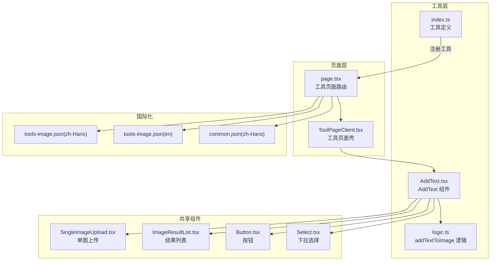
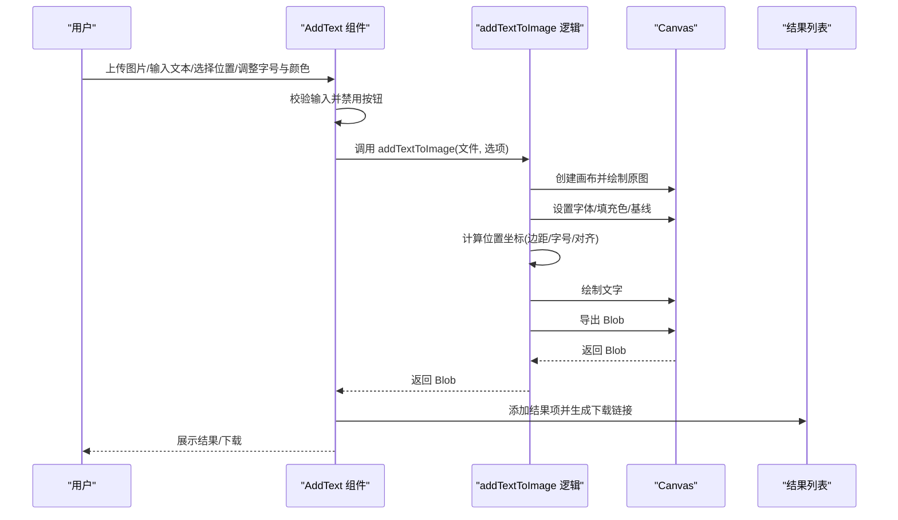
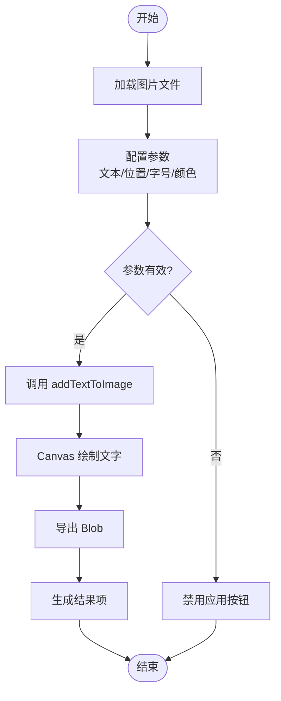
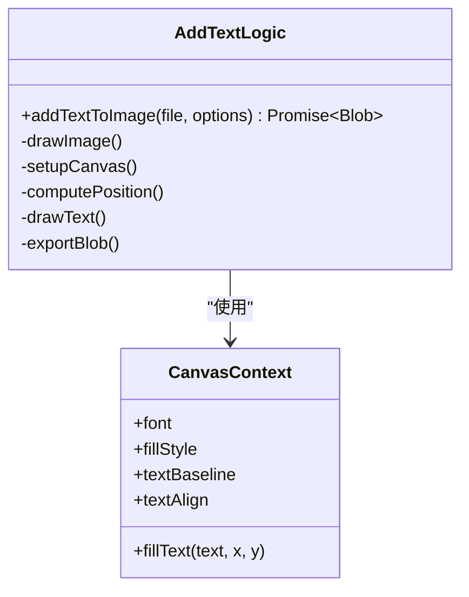
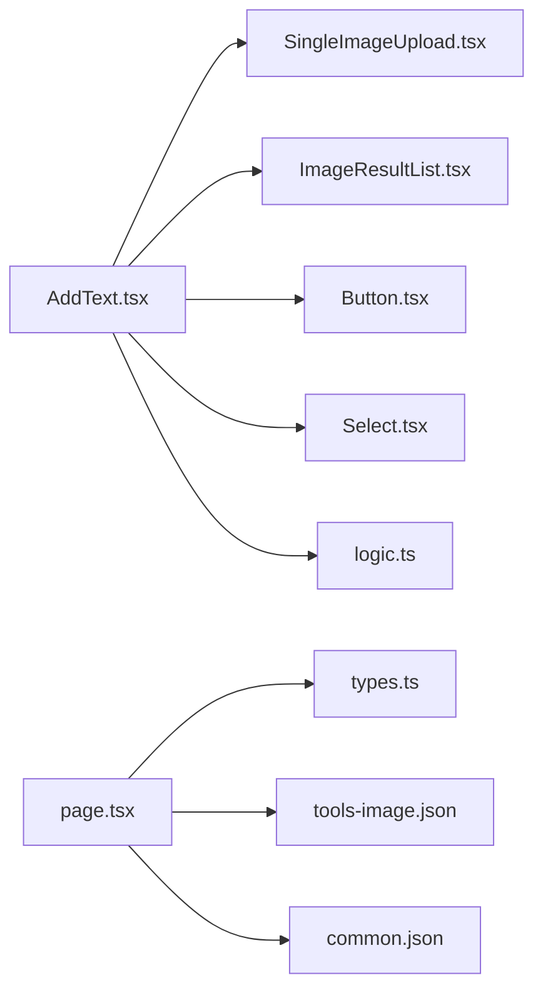

# 文字叠加

<cite>
**本文引用的文件**
- [AddText.tsx](file://src/tools/image/add-text/AddText.tsx)
- [logic.ts](file://src/tools/image/add-text/logic.ts)
- [index.ts](file://src/tools/image/add-text/index.ts)
- [SingleImageUpload.tsx](file://src/components/shared/SingleImageUpload.tsx)
- [ImageResultList.tsx](file://src/components/shared/ImageResultList.tsx)
- [Button.tsx](file://src/components/ui/Button.tsx)
- [Select.tsx](file://src/components/ui/Select.tsx)
- [tools-image.json(zh-Hans)](file://messages/zh-Hans/tools-image.json)
- [tools-image.json(en)](file://messages/en/tools-image.json)
- [common.json(zh-Hans)](file://messages/zh-Hans/common.json)
- [types.ts](file://src/lib/registry/types.ts)
- [page.tsx](file://src/app/[locale]/tools/[category]/[slug]/page.tsx)
- [ToolPageClient.tsx](file://src/app/[locale]/tools/[category]/[slug]/ToolPageClient.tsx)
- [Button.tsx(ui)](file://src/components/ui/Button.tsx)
</cite>

## 目录
1. [简介](#简介)
2. [项目结构](#项目结构)
3. [核心组件](#核心组件)
4. [架构总览](#架构总览)
5. [详细组件分析](#详细组件分析)
6. [依赖关系分析](#依赖关系分析)
7. [性能考虑](#性能考虑)
8. [故障排查指南](#故障排查指南)
9. [结论](#结论)
10. [附录](#附录)

## 简介
本文件为“文字叠加”工具的全面技术文档，围绕 AddText 组件的实现机制展开，重点覆盖以下方面：
- Canvas 文字渲染与字体处理技术
- 文字样式定制（字体选择、大小调整、颜色配置）
- 文字布局算法（居中对齐、边距控制、多行文本处理）
- 创意应用示例（标题添加、装饰文字、艺术效果）
- 性能优化与缓存策略
- 字体格式支持与加载机制
- 特殊字符与国际化支持
- 质量评估标准与视觉效果对比
- 图像编辑中的应用场景与设计原则

## 项目结构
文字叠加工具位于图像工具类别下，采用“页面路由 + 工具页面壳 + 客户端组件 + 业务逻辑”的分层组织：
- 页面路由负责国际化消息加载与 SEO 结构化数据生成
- 工具页面壳负责面包屑、相关工具与 FAQ 的展示
- 客户端组件负责 UI 交互与业务逻辑调用
- 业务逻辑封装在独立模块中，便于复用与测试

**图表来源**
- [page.tsx:33-108](file://src/app/[locale]/tools/[category]/[slug]/page.tsx#L33-L108)
- [ToolPageClient.tsx:29-58](file://src/app/[locale]/tools/[category]/[slug]/ToolPageClient.tsx#L29-L58)
- [AddText.tsx:22-156](file://src/tools/image/add-text/AddText.tsx#L22-L156)
- [logic.ts:8-84](file://src/tools/image/add-text/logic.ts#L8-L84)
- [index.ts:3-36](file://src/tools/image/add-text/index.ts#L3-L36)

**章节来源**
- [page.tsx:33-108](file://src/app/[locale]/tools/[category]/[slug]/page.tsx#L33-L108)
- [ToolPageClient.tsx:29-58](file://src/app/[locale]/tools/[category]/[slug]/ToolPageClient.tsx#L29-L58)
- [AddText.tsx:22-156](file://src/tools/image/add-text/AddText.tsx#L22-L156)
- [logic.ts:8-84](file://src/tools/image/add-text/logic.ts#L8-L84)
- [index.ts:3-36](file://src/tools/image/add-text/index.ts#L3-L36)

## 核心组件
- AddText 组件：负责用户交互（文本输入、位置选择、字号与颜色配置）、调用业务逻辑、展示结果与错误信息
- addTextToImage 逻辑：封装 Canvas 文字渲染、布局计算与图像导出
- 工具注册：通过 index.ts 定义工具元数据、SEO 与相关工具

关键实现要点：
- 使用 Canvas 2D API 进行文字绘制，设置字体、填充色与基线
- 基于预设位置枚举实现五点布局（居中、四角）
- 边距常量与字号参与定位计算，保证文字在不同尺寸图像上的可读性
- 导出 Blob 并通过 URL.createObjectURL 提供下载

**章节来源**
- [AddText.tsx:22-156](file://src/tools/image/add-text/AddText.tsx#L22-L156)
- [logic.ts:8-84](file://src/tools/image/add-text/logic.ts#L8-L84)
- [index.ts:3-36](file://src/tools/image/add-text/index.ts#L3-L36)

## 架构总览
文字叠加的端到端流程如下：

**图表来源**
- [AddText.tsx:39-64](file://src/tools/image/add-text/AddText.tsx#L39-L64)
- [logic.ts:17-83](file://src/tools/image/add-text/logic.ts#L17-L83)

**章节来源**
- [AddText.tsx:39-64](file://src/tools/image/add-text/AddText.tsx#L39-L64)
- [logic.ts:17-83](file://src/tools/image/add-text/logic.ts#L17-L83)

## 详细组件分析

### AddText 组件
职责与交互：
- 文件选择：委托 SingleImageUpload 组件处理
- 参数配置：文本、位置、字号、颜色
- 处理流程：调用 addTextToImage，捕获异常并记录埋点
- 结果展示：通过 ImageResultList 展示与下载

交互细节：
- 位置枚举："center"、"top-left"、"top-right"、"bottom-left"、"bottom-right"
- 字号范围：12-120px，步进式滑块
- 颜色选择：HTML color 输入控件
- 错误提示：统一的错误气泡提示
- 结果管理：支持多结果叠加与移除

**图表来源**
- [AddText.tsx:33-64](file://src/tools/image/add-text/AddText.tsx#L33-L64)
- [logic.ts:17-83](file://src/tools/image/add-text/logic.ts#L17-L83)

**章节来源**
- [AddText.tsx:22-156](file://src/tools/image/add-text/AddText.tsx#L22-L156)

### addTextToImage 逻辑
Canvas 文字渲染与布局：
- 创建与原图同尺寸画布，先绘制原图
- 设置字体（字号 + 默认无衬线字体）、填充色、基线为"middle"
- 根据位置枚举计算 x/y 坐标，结合边距与字号保证可读性
- 使用 fillText 绘制文本
- 导出 Blob，质量与格式继承源文件类型

**图表来源**
- [logic.ts:8-84](file://src/tools/image/add-text/logic.ts#L8-L84)

**章节来源**
- [logic.ts:8-84](file://src/tools/image/add-text/logic.ts#L8-L84)

### 工具注册与页面路由
- 工具注册：定义 slug、类别、图标、SEO 结构化数据、FAQ 与相关工具
- 页面路由：加载国际化消息、生成 SEO 与 JSON-LD、懒加载工具组件
- 客户端壳：提供面包屑、相关工具与 FAQ 区域

**章节来源**
- [index.ts:3-36](file://src/tools/image/add-text/index.ts#L3-L36)
- [page.tsx:33-108](file://src/app/[locale]/tools/[category]/[slug]/page.tsx#L33-L108)
- [ToolPageClient.tsx:29-58](file://src/app/[locale]/tools/[category]/[slug]/ToolPageClient.tsx#L29-L58)

### 国际化与文案
- 工具文案：包含名称、描述、占位符、位置枚举、FAQ 等
- 通用文案：包含下载、处理、隐私提示等
- 支持多语言：zh-Hans 与 en

**章节来源**
- [tools-image.json(zh-Hans):581-634](file://messages/zh-Hans/tools-image.json#L581-L634)
- [tools-image.json(en):581-634](file://messages/en/tools-image.json#L581-L634)
- [common.json(zh-Hans):1-508](file://messages/zh-Hans/common.json#L1-L508)

## 依赖关系分析
- 组件耦合
  - AddText 依赖：SingleImageUpload、ImageResultList、Button、Select、analytics
  - 逻辑模块独立，仅依赖浏览器原生 API（Image、Canvas、Blob、URL）
- 外部依赖
  - 国际化消息与 SEO 结构化数据
  - 工具注册类型定义

**图表来源**
- [AddText.tsx:5-10](file://src/tools/image/add-text/AddText.tsx#L5-L10)
- [logic.ts:1-16](file://src/tools/image/add-text/logic.ts#L1-L16)
- [page.tsx:1-12](file://src/app/[locale]/tools/[category]/[slug]/page.tsx#L1-L12)
- [types.ts:5-16](file://src/lib/registry/types.ts#L5-L16)

**章节来源**
- [AddText.tsx:5-10](file://src/tools/image/add-text/AddText.tsx#L5-L10)
- [logic.ts:1-16](file://src/tools/image/add-text/logic.ts#L1-L16)
- [page.tsx:1-12](file://src/app/[locale]/tools/[category]/[slug]/page.tsx#L1-L12)
- [types.ts:5-16](file://src/lib/registry/types.ts#L5-L16)

## 性能考虑
- Canvas 渲染性能
  - 仅在必要时创建画布与上下文，避免重复实例化
  - 文本绘制为一次性操作，复杂度近似 O(n)，n 为文本长度
- 内存与 URL 管理
  - 使用 URL.createObjectURL 生成临时下载链接，处理完成后及时 revoke
  - 结果列表组件维护 Blob→URL 缓存，避免重复创建与泄漏
- 导出策略
  - 导出质量与格式尽量继承源文件类型，减少二次编码开销
- 可扩展优化
  - 对于超大图像，可考虑分块渲染或降采样
  - 多行文本可通过 measureText 估算宽度并自动换行（当前实现为单行）

**章节来源**
- [logic.ts:17-83](file://src/tools/image/add-text/logic.ts#L17-L83)
- [ImageResultList.tsx:26-50](file://src/components/shared/ImageResultList.tsx#L26-L50)

## 故障排查指南
- 图片加载失败
  - 现象：抛出“Failed to load image”
  - 排查：检查文件类型、网络环境；确认 URL.revokeObjectURL 已在错误路径调用
- 导出为空
  - 现象：canvas.toBlob 回调中 blob 为空
  - 排查：确认导出类型与质量参数；检查源文件是否损坏
- 位置计算异常
  - 现象：文字溢出或位置偏移
  - 排查：核对边距与字号；确保画布尺寸与原图一致
- 国际化缺失
  - 现象：界面显示键名而非文案
  - 排查：确认 locale 与消息文件加载；检查命名空间与键名

**章节来源**
- [logic.ts:78-83](file://src/tools/image/add-text/logic.ts#L78-L83)
- [AddText.tsx:57-63](file://src/tools/image/add-text/AddText.tsx#L57-L63)

## 结论
文字叠加工具通过简洁的 UI 与稳定的 Canvas 文字渲染实现了“所见即所得”的文字叠加体验。其设计遵循“纯前端、零上传”的隐私优先原则，具备良好的可扩展性与国际化支持。未来可在多行文本、字体加载与性能优化方面进一步完善。

## 附录

### 文字样式定制与布局算法
- 样式定制
  - 字体：使用默认 sans-serif 字体，可扩展为自定义字体（需引入字体文件与 measureText）
  - 大小：12-120px 范围滑块
  - 颜色：HTML color 输入控件
- 布局算法
  - 居中：textAlign=center，x=画布宽度/2，y=画布高度/2
  - 四角：textAlign 根据方向设置为 left/right，x/y 基于 margin 与 fontSize 计算
  - 边距控制：统一 margin=20，避免贴边
- 多行文本处理
  - 当前实现为单行；可扩展为按宽度 measureText 自动换行

**章节来源**
- [AddText.tsx:106-131](file://src/tools/image/add-text/AddText.tsx#L106-L131)
- [logic.ts:31-63](file://src/tools/image/add-text/logic.ts#L31-L63)

### 字体格式支持与加载机制
- 浏览器默认字体：使用默认 sans-serif 字体，跨平台一致
- 自定义字体：可通过 @font-face 引入，但需注意跨域与字体加载时机
- 加载策略：当前实现不包含字体文件，建议在应用层统一管理字体资源

**章节来源**
- [tools-image.json(zh-Hans):604-606](file://messages/zh-Hans/tools-image.json#L604-L606)
- [tools-image.json(en):604-606](file://messages/en/tools-image.json#L604-L606)

### 特殊字符与国际化支持
- 特殊字符：Canvas 文本渲染支持 Unicode，可显示表情、符号与多语言字符
- 国际化：工具文案与通用文案分离，支持 zh-Hans 与 en

**章节来源**
- [tools-image.json(zh-Hans):581-634](file://messages/zh-Hans/tools-image.json#L581-L634)
- [tools-image.json(en):581-634](file://messages/en/tools-image.json#L581-L634)
- [common.json(zh-Hans):1-508](file://messages/zh-Hans/common.json#L1-L508)

### 质量评估标准与视觉效果对比
- 可读性：字号与对比度（前景色与背景纹理）决定可读性
- 一致性：同一图像上文字的字号、颜色与位置保持统一
- 性能：处理时间与内存占用随图像尺寸线性增长
- 建议：在高对比度背景下使用深色文字，在浅色背景使用浅色文字

[本节为通用指导，不直接分析具体文件]

### 应用场景与设计原则
- 标题添加：居中或顶部居中，字号较大，颜色与主题协调
- 装饰文字：使用半透明或艺术字体，避免遮挡主体
- 艺术效果：结合滤镜与叠加，形成视觉层次
- 设计原则：留白、对齐、对比、层次

[本节为通用指导，不直接分析具体文件]