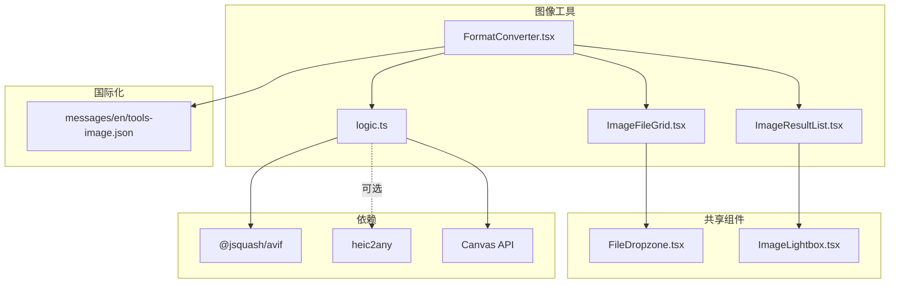
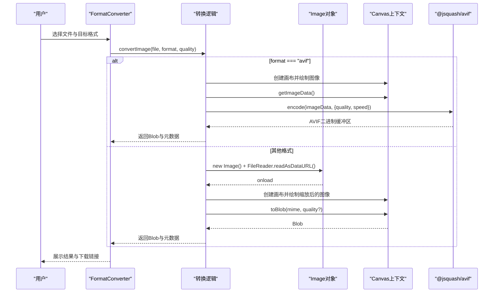
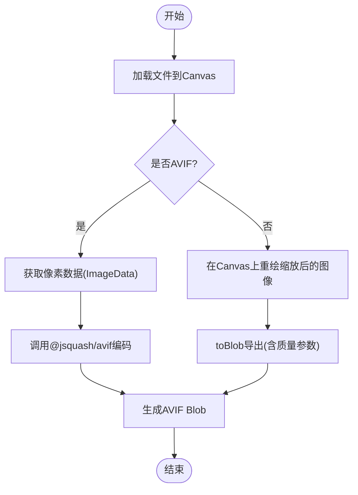
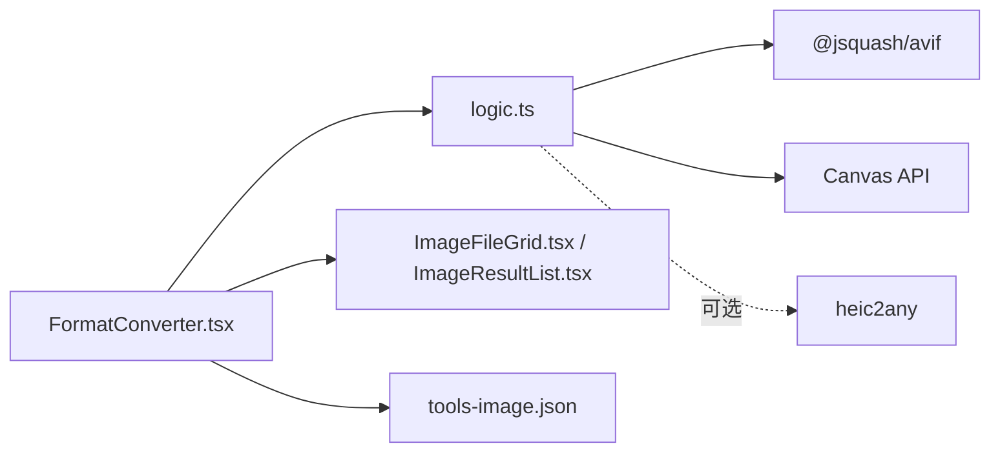

# 格式转换

<cite>
**本文引用的文件**
- [FormatConverter.tsx](file://src/tools/image/format-converter/FormatConverter.tsx)
- [logic.ts](file://src/tools/image/format-converter/logic.ts)
- [ImageResultList.tsx](file://src/components/shared/ImageResultList.tsx)
- [ImageFileGrid.tsx](file://src/components/shared/ImageFileGrid.tsx)
- [tools-image.json](file://messages/en/tools-image.json)
- [package.json](file://package.json)
- [media-pipeline.ts](file://src/lib/media-pipeline.ts)
- [logic.ts](file://src/tools/image/heic-convert/logic.ts)
- [logic.ts](file://src/tools/image/grayscale/logic.ts)
- [logic.ts](file://src/tools/image/pixelate/logic.ts)
</cite>

## 目录
1. [简介](#简介)
2. [项目结构](#项目结构)
3. [核心组件](#核心组件)
4. [架构总览](#架构总览)
5. [详细组件分析](#详细组件分析)
6. [依赖关系分析](#依赖关系分析)
7. [性能考量](#性能考量)
8. [故障排查指南](#故障排查指南)
9. [结论](#结论)
10. [附录](#附录)

## 简介
本技术文档围绕图像格式转换工具“FormatConverter”展开，系统阐述其工作原理与实现细节，重点覆盖以下方面：
- Canvas API 的使用与图像数据的像素级操作
- 各种图像格式的特点与转换过程中的质量控制
- 支持的输入输出格式（JPEG、PNG、WEBP、AVIF、ICO）及其适用场景
- 质量参数与压缩策略、颜色空间与 alpha 通道处理
- 具体转换示例与格式选择指南
- 内存使用与处理时间优化方法

该工具完全在浏览器端运行，不上传任何图像到服务器，所有处理均通过 Canvas API 和相关编码库完成。

## 项目结构
FormatConverter 所在模块位于图像工具集合中，采用按功能分层的组织方式：
- 工具页面组件：负责用户交互与结果展示
- 工具逻辑模块：封装图像加载、Canvas 绘制、格式转换与质量控制
- 共享组件：文件网格、结果列表、预览与下载
- 国际化文案：提供多语言支持与 SEO 内容
- 依赖管理：通过包管理器引入必要的图像处理库

图表来源
- [FormatConverter.tsx:1-135](file://src/tools/image/format-converter/FormatConverter.tsx#L1-L135)
- [logic.ts:1-161](file://src/tools/image/format-converter/logic.ts#L1-L161)
- [ImageFileGrid.tsx:1-226](file://src/components/shared/ImageFileGrid.tsx#L1-L226)
- [ImageResultList.tsx:1-141](file://src/components/shared/ImageResultList.tsx#L1-L141)
- [tools-image.json:1-822](file://messages/en/tools-image.json#L1-L822)
- [package.json:1-45](file://package.json#L1-L45)

章节来源
- [FormatConverter.tsx:1-135](file://src/tools/image/format-converter/FormatConverter.tsx#L1-L135)
- [logic.ts:1-161](file://src/tools/image/format-converter/logic.ts#L1-L161)
- [ImageFileGrid.tsx:1-226](file://src/components/shared/ImageFileGrid.tsx#L1-L226)
- [ImageResultList.tsx:1-141](file://src/components/shared/ImageResultList.tsx#L1-L141)
- [tools-image.json:1-822](file://messages/en/tools-image.json#L1-L822)
- [package.json:1-45](file://package.json#L1-L45)

## 核心组件
- FormatConverter 页面组件：提供文件选择、格式选择、质量滑块、批量转换与结果展示
- 转换逻辑模块：封装 Canvas 加载、绘制、导出与 AVIF 编码流程
- 结果列表组件：管理 Blob URL 生命周期、预览与下载
- 文件网格组件：拖拽上传、尺寸预览、批量管理

章节来源
- [FormatConverter.tsx:18-135](file://src/tools/image/format-converter/FormatConverter.tsx#L18-L135)
- [logic.ts:75-158](file://src/tools/image/format-converter/logic.ts#L75-L158)
- [ImageResultList.tsx:21-141](file://src/components/shared/ImageResultList.tsx#L21-L141)
- [ImageFileGrid.tsx:17-226](file://src/components/shared/ImageFileGrid.tsx#L17-L226)

## 架构总览
FormatConverter 的处理流程分为两条主线：
- 非 AVIF 转换：通过 FileReader 将文件读取为 DataURL，再用 Image 对象加载，绘制到 Canvas，最后调用 toBlob 导出指定格式
- AVIF 转换：先将图像绘制到 Canvas，获取 ImageData 进行像素级访问，再使用 @jsquash/avif 编码生成 AVIF

图表来源
- [FormatConverter.tsx:28-55](file://src/tools/image/format-converter/FormatConverter.tsx#L28-L55)
- [logic.ts:75-158](file://src/tools/image/format-converter/logic.ts#L75-L158)

## 详细组件分析

### FormatConverter 页面组件
- 文件管理：通过 ImageFileGrid 提供拖拽上传、批量选择、尺寸与大小预览
- 质量控制：仅在 JPEG/WebP/AVIF 时显示质量滑块；ICO 不支持质量参数
- 转换流程：逐个文件调用 convertImage，更新进度与错误信息
- 结果展示：使用 ImageResultList 渲染缩略图、元数据与下载按钮

章节来源
- [FormatConverter.tsx:18-135](file://src/tools/image/format-converter/FormatConverter.tsx#L18-L135)
- [ImageFileGrid.tsx:17-226](file://src/components/shared/ImageFileGrid.tsx#L17-L226)
- [ImageResultList.tsx:21-141](file://src/components/shared/ImageResultList.tsx#L21-L141)

### 转换逻辑模块（Canvas 与像素级操作）
- MIME 映射与扩展名：统一管理输出格式的 MIME 类型与文件扩展名
- Canvas 加载与绘制：创建离屏画布，将 Image 绘制到画布以获得精确宽高
- 非 AVIF 转换：toBlob 导出，质量参数仅对非 PNG/ICO 生效
- AVIF 转换：使用 @jsquash/avif，将 ImageData 传入编码器，速度与质量可调
- ICO 处理：限制最大尺寸为 256×256，并自动缩放

图表来源
- [logic.ts:29-158](file://src/tools/image/format-converter/logic.ts#L29-L158)

章节来源
- [logic.ts:1-161](file://src/tools/image/format-converter/logic.ts#L1-L161)

### 结果列表组件（Blob URL 生命周期管理）
- URL 缓存：使用 useRef 维护 Blob→URL 的映射，避免重复创建与泄漏
- 清理策略：当结果移除或不再存在时，及时撤销 URL
- 下载行为：通过 a.download 触发浏览器下载，文件名经品牌化处理

章节来源
- [ImageResultList.tsx:21-141](file://src/components/shared/ImageResultList.tsx#L21-L141)

### 文件网格组件（预览与维度计算）
- 预览 URL：为每个文件创建临时 URL 并缓存，异步加载 Image 获取自然尺寸
- 拖拽与过滤：支持多文件拖放，按 accept 条件筛选
- 维度与大小：实时显示宽度×高度与文件大小

章节来源
- [ImageFileGrid.tsx:17-226](file://src/components/shared/ImageFileGrid.tsx#L17-L226)

### HEIC 转换（对比参考）
- 使用 heic2any 动态导入，支持输出为 JPEG 或 PNG
- 质量参数传递给 heic2any，返回单个或数组形式的 Blob

章节来源
- [logic.ts:1-23](file://src/tools/image/heic-convert/logic.ts#L1-L23)

### 像素级操作示例（灰度与马赛克）
- 灰度：通过 getImageData 遍历像素，按标准亮度公式混合 RGB
- 马赛克：先将原图缩小至小画布，再放大回原尺寸，形成像素块效果

章节来源
- [logic.ts:1-40](file://src/tools/image/grayscale/logic.ts#L1-L40)
- [logic.ts:1-48](file://src/tools/image/pixelate/logic.ts#L1-L48)

## 依赖关系分析
- @jsquash/avif：用于 AVIF 编码，提供高质量压缩与可调速度
- heic2any：用于 HEIC/HEIF 到常见格式的转换
- Canvas API：通用图像加载、绘制与导出的核心能力
- 浏览器图像压缩库：在其他图像工具中用于压缩与格式转换（此处为背景知识）

图表来源
- [FormatConverter.tsx:1-135](file://src/tools/image/format-converter/FormatConverter.tsx#L1-L135)
- [logic.ts:1-161](file://src/tools/image/format-converter/logic.ts#L1-L161)
- [package.json:11-32](file://package.json#L11-L32)

章节来源
- [package.json:11-32](file://package.json#L11-L32)

## 性能考量
- Canvas 绘制与 toBlob：在大图时会占用较多内存，建议优先进行尺寸缩放后再导出
- AVIF 编码：速度与质量可调，速度越快质量越低；对于超大图建议分块或降采样
- Blob URL 管理：及时撤销 URL，避免内存泄漏
- 质量参数：JPEG/WebP/AVIF 的质量越高，体积越大；根据用途权衡
- ICO 限制：最大 256×256，避免不必要的大图处理

[本节为通用性能指导，无需特定文件引用]

## 故障排查指南
- 图像无法加载：检查文件类型与浏览器兼容性；确认 FileReader 与 Image.onload 是否触发
- Canvas 上下文为空：确保在支持的环境中运行，避免在无 DOM 的 SSR 环境直接调用
- AVIF 编码失败：确认浏览器对 AVIF 的支持情况；必要时回退到其他格式
- 质量参数无效：PNG/ICO 不支持质量参数；仅对 JPEG/WebP/AVIF 生效
- 内存不足：尝试降低分辨率或关闭其他标签页释放内存

章节来源
- [logic.ts:29-54](file://src/tools/image/format-converter/logic.ts#L29-L54)
- [logic.ts:96-158](file://src/tools/image/format-converter/logic.ts#L96-L158)

## 结论
FormatConverter 通过 Canvas API 实现了浏览器端的图像格式转换，具备以下优势：
- 完全本地处理，隐私安全
- 支持主流现代格式（PNG、JPG、WebP、AVIF、ICO），并提供质量控制
- 通过像素级操作与编码库实现高质量输出
- 提供直观的批量转换体验与结果管理

在实际使用中，建议根据用途选择合适格式与质量参数，并注意内存与性能约束。

[本节为总结性内容，无需特定文件引用]

## 附录

### 支持的输入输出格式与适用场景
- PNG：无损压缩，适合需要透明度与高质量的场景；文件较大
- JPEG：有损压缩，适合照片与网页图片；质量可调
- WebP：现代压缩格式，通常比 JPEG 更小；浏览器支持良好
- AVIF：新一代高压缩比格式，适合现代浏览器；编码速度可调
- ICO：常用于网站 favicon，最大尺寸限制为 256×256

章节来源
- [tools-image.json:18-30](file://messages/en/tools-image.json#L18-L30)
- [logic.ts:13-27](file://src/tools/image/format-converter/logic.ts#L13-L27)

### 质量参数与推荐设置
- JPEG/WebP/AVIF：质量越高体积越大，建议从 80%-90% 开始测试
- PNG/ICO：不支持质量参数，优先考虑尺寸与格式特性
- AVIF：速度与质量平衡，建议中等速度以兼顾性能与体积

章节来源
- [FormatConverter.tsx:82-96](file://src/tools/image/format-converter/FormatConverter.tsx#L82-L96)
- [logic.ts:64-73](file://src/tools/image/format-converter/logic.ts#L64-L73)

### 颜色空间与 alpha 通道处理
- Canvas 默认使用 sRGB 颜色空间；若需严格色彩管理，应在导出前进行色彩配置
- PNG 支持 alpha 通道；ICO 输出为 PNG 内部格式，透明度由 PNG 保证
- WebP/AVIF 在支持 alpha 的前提下可保留透明度；不支持时会丢失透明信息

章节来源
- [logic.ts:13-19](file://src/tools/image/format-converter/logic.ts#L13-L19)
- [tools-image.json:18-30](file://messages/en/tools-image.json#L18-L30)

### 转换示例与格式选择指南
- 网站图片优化：优先选择 WebP 或 AVIF；质量 80%-90%
- 兼容性优先：选择 JPEG；质量 85%-95%
- 透明背景：选择 PNG；如需更小体积可考虑 WebP/AVIF（若支持透明）
- 网站 favicon：选择 ICO；尺寸不超过 256×256

章节来源
- [tools-image.json:34-52](file://messages/en/tools-image.json#L34-L52)
- [logic.ts:105-113](file://src/tools/image/format-converter/logic.ts#L105-L113)

### 内存使用与处理时间优化方法
- 预先缩放：在导出前按目标尺寸缩放，显著降低内存占用
- 分批处理：对大批量文件采用队列与进度提示，避免阻塞 UI
- 及时清理：撤销 Blob URL，减少内存压力
- 编码参数：AVIF 适当提高速度降低质量，换取更快处理时间

章节来源
- [logic.ts:56-73](file://src/tools/image/format-converter/logic.ts#L56-L73)
- [ImageResultList.tsx:26-50](file://src/components/shared/ImageResultList.tsx#L26-L50)