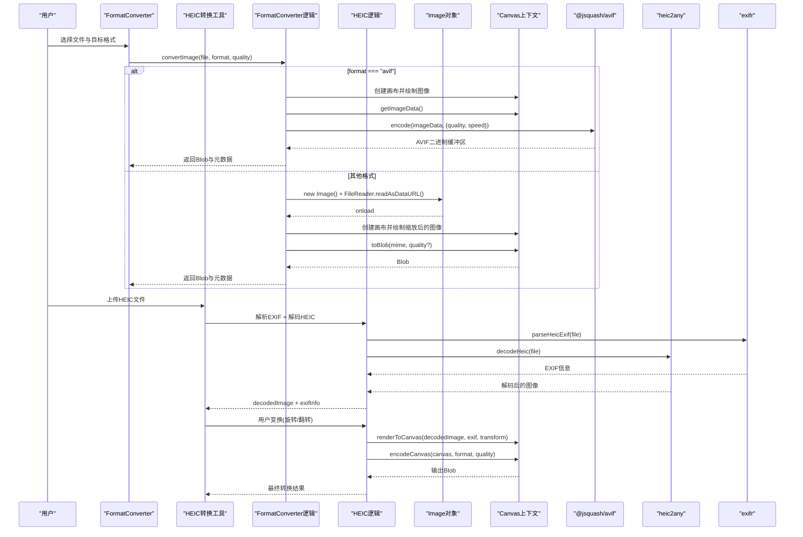
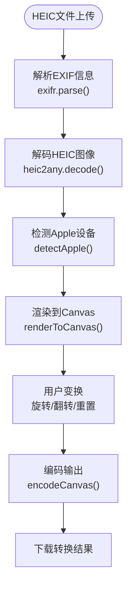
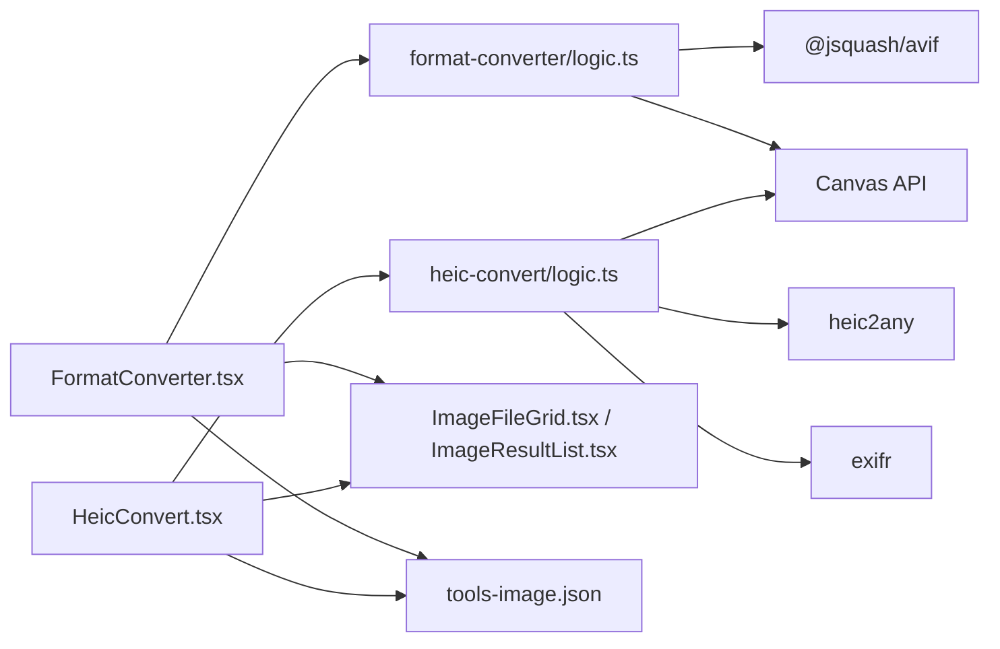

# 格式转换

<cite>
**本文引用的文件**
- [FormatConverter.tsx](file://src/tools/image/format-converter/FormatConverter.tsx)
- [logic.ts](file://src/tools/image/format-converter/logic.ts)
- [HeicConvert.tsx](file://src/tools/image/heic-convert/HeicConvert.tsx)
- [logic.ts](file://src/tools/image/heic-convert/logic.ts)
- [ImageResultList.tsx](file://src/components/shared/ImageResultList.tsx)
- [ImageFileGrid.tsx](file://src/components/shared/ImageFileGrid.tsx)
- [tools-image.json](file://messages/en/tools-image.json)
- [package.json](file://package.json)
- [media-pipeline.ts](file://src/lib/media-pipeline.ts)
</cite>

## 更新摘要
**变更内容**
- 新增HEIC转换工具的详细架构分析，展示从简单格式转换到复杂EXIF解析和Canvas操作的升级
- 更新HEIC转换流程图，反映EXIF解析、图像渲染和用户变换处理
- 增加HEIC专用的颜色空间处理和Apple设备检测功能
- 补充HEIC转换的质量控制和动画GIF支持
- 更新依赖关系分析，突出exifr和heic2any库的重要性

## 目录
1. [简介](#简介)
2. [项目结构](#项目结构)
3. [核心组件](#核心组件)
4. [架构总览](#架构总览)
5. [详细组件分析](#详细组件分析)
6. [HEIC转换工具架构](#heic转换工具架构)
7. [依赖关系分析](#依赖关系分析)
8. [性能考量](#性能考量)
9. [故障排查指南](#故障排查指南)
10. [结论](#结论)
11. [附录](#附录)

## 简介
本技术文档围绕图像格式转换工具展开，系统阐述FormatConverter和HEIC转换工具的工作原理与实现细节，重点覆盖以下方面：
- Canvas API 的使用与图像数据的像素级操作
- 各种图像格式的特点与转换过程中的质量控制
- 支持的输入输出格式（JPEG、PNG、WEBP、AVIF、ICO）及其适用场景
- EXIF解析、颜色空间转换和alpha通道处理的技术细节
- 质量参数与压缩策略、用户变换与Apple设备检测
- 具体转换示例与格式选择指南
- 内存使用与处理时间优化方法

该工具完全在浏览器端运行，不上传任何图像到服务器，所有处理均通过 Canvas API 和相关编码库完成。

## 项目结构
格式转换工具模块位于图像工具集合中，采用按功能分层的组织方式：
- **FormatConverter**：通用图像格式转换工具，支持批量处理和质量控制
- **HEIC转换工具**：专门处理Apple HEIC/HEIF格式，包含EXIF解析和用户变换
- 工具逻辑模块：封装图像加载、Canvas绘制、格式转换与质量控制
- 共享组件：文件网格、结果列表、预览与下载
- 国际化文案：提供多语言支持与SEO内容
- 依赖管理：通过包管理器引入必要的图像处理库

```mermaid
graph TB
subgraph "图像工具"
FC["FormatConverter.tsx"]
HC["HeicConvert.tsx"]
FCLOGIC["format-converter/logic.ts"]
HCLOGIC["heic-convert/logic.ts"]
IG["ImageFileGrid.tsx"]
RL["ImageResultList.tsx"]
end
subgraph "共享组件"
FZ["FileDropzone.tsx"]
LB["ImageLightbox.tsx"]
end
subgraph "国际化"
TI["messages/en/tools-image.json"]
end
subgraph "依赖"
AVIF["@jsquash/avif"]
HEIC["heic2any"]
EXIFR["exifr"]
CANVAS["Canvas API"]
END
FC --> FCLOGIC
HC --> HCLOGIC
FC --> IG
FC --> RL
HC --> IG
HC --> RL
IG --> FZ
RL --> LB
FCLOGIC --> AVIF
FCLOGIC --> CANVAS
HCLOGIC --> HEIC
HCLOGIC --> EXIFR
HCLOGIC --> CANVAS
FC --> TI
HC --> TI
```

**图表来源**
- [FormatConverter.tsx:1-135](file://src/tools/image/format-converter/FormatConverter.tsx#L1-L135)
- [HeicConvert.tsx:1-419](file://src/tools/image/heic-convert/HeicConvert.tsx#L1-L419)
- [logic.ts:1-161](file://src/tools/image/format-converter/logic.ts#L1-L161)
- [logic.ts:1-201](file://src/tools/image/heic-convert/logic.ts#L1-L201)

**章节来源**
- [FormatConverter.tsx:1-135](file://src/tools/image/format-converter/FormatConverter.tsx#L1-L135)
- [HeicConvert.tsx:1-419](file://src/tools/image/heic-convert/HeicConvert.tsx#L1-L419)
- [logic.ts:1-161](file://src/tools/image/format-converter/logic.ts#L1-L161)
- [logic.ts:1-201](file://src/tools/image/heic-convert/logic.ts#L1-L201)

## 核心组件
- **FormatConverter 页面组件**：提供文件选择、格式选择、质量滑块、批量转换与结果展示
- **HEIC转换工具**：专门处理Apple HEIC/HEIF格式，支持EXIF解析、自动方向校正、手动旋转翻转
- **转换逻辑模块**：封装 Canvas 加载、绘制、导出与编码流程
- **结果列表组件**：管理 Blob URL 生命周期、预览与下载
- **文件网格组件**：拖拽上传、尺寸预览、批量管理

**章节来源**
- [FormatConverter.tsx:18-135](file://src/tools/image/format-converter/FormatConverter.tsx#L18-L135)
- [HeicConvert.tsx:42-419](file://src/tools/image/heic-convert/HeicConvert.tsx#L42-L419)
- [logic.ts:75-158](file://src/tools/image/format-converter/logic.ts#L75-L158)
- [ImageResultList.tsx:21-141](file://src/components/shared/ImageResultList.tsx#L21-L141)
- [ImageFileGrid.tsx:17-226](file://src/components/shared/ImageFileGrid.tsx#L17-L226)

## 架构总览
格式转换工具的处理流程分为两条主线：
- **FormatConverter**：通用转换流程，通过FileReader将文件读取为DataURL，再用Image对象加载，绘制到Canvas，最后调用toBlob导出指定格式
- **HEIC转换工具**：复杂处理流程，包含EXIF解析、图像解码、Canvas渲染和用户变换



**图表来源**
- [FormatConverter.tsx:28-55](file://src/tools/image/format-converter/FormatConverter.tsx#L28-L55)
- [logic.ts:75-158](file://src/tools/image/format-converter/logic.ts#L75-L158)
- [HeicConvert.tsx:76-134](file://src/tools/image/heic-convert/HeicConvert.tsx#L76-L134)
- [logic.ts:32-88](file://src/tools/image/heic-convert/logic.ts#L32-88)

## 详细组件分析

### FormatConverter 页面组件
- **文件管理**：通过 ImageFileGrid 提供拖拽上传、批量选择、尺寸与大小预览
- **质量控制**：仅在 JPEG/WebP/AVIF 时显示质量滑块；ICO 不支持质量参数
- **转换流程**：逐个文件调用 convertImage，更新进度与错误信息
- **结果展示**：使用 ImageResultList 渲染缩略图、元数据与下载按钮

**章节来源**
- [FormatConverter.tsx:18-135](file://src/tools/image/format-converter/FormatConverter.tsx#L18-L135)
- [ImageFileGrid.tsx:17-226](file://src/components/shared/ImageFileGrid.tsx#L17-L226)
- [ImageResultList.tsx:21-141](file://src/components/shared/ImageResultList.tsx#L21-L141)

### 转换逻辑模块（Canvas 与像素级操作）
- **MIME 映射与扩展名**：统一管理输出格式的 MIME 类型与文件扩展名
- **Canvas 加载与绘制**：创建离屏画布，将 Image 绘制到画布以获得精确宽高
- **非 AVIF 转换**：toBlob 导出，质量参数仅对非 PNG/ICO 生效
- **AVIF 转换**：使用 @jsquash/avif，将 ImageData 传入编码器，速度与质量可调
- **ICO 处理**：限制最大尺寸为 256×256，并自动缩放


**图表来源**
- [logic.ts:29-158](file://src/tools/image/format-converter/logic.ts#L29-L158)

**章节来源**
- [logic.ts:1-161](file://src/tools/image/format-converter/logic.ts#L1-L161)

### 结果列表组件（Blob URL 生命周期管理）
- **URL 缓存**：使用 useRef 维护 Blob→URL 的映射，避免重复创建与泄漏
- **清理策略**：当结果移除或不再存在时，及时撤销 URL
- **下载行为**：通过 a.download 触发浏览器下载，文件名经品牌化处理

**章节来源**
- [ImageResultList.tsx:21-141](file://src/components/shared/ImageResultList.tsx#L21-L141)

### 文件网格组件（预览与维度计算）
- **预览 URL**：为每个文件创建临时 URL 并缓存，异步加载 Image 获取自然尺寸
- **拖拽与过滤**：支持多文件拖放，按 accept 条件筛选
- **维度与大小**：实时显示宽度×高度与文件大小

**章节来源**
- [ImageFileGrid.tsx:17-226](file://src/components/shared/ImageFileGrid.tsx#L17-L226)

## HEIC转换工具架构

### HEIC转换工具概述
HEIC转换工具是一个复杂的图像处理系统，专门针对Apple设备的HEIC/HEIF格式设计。它不仅处理基本的格式转换，还包含了EXIF解析、图像渲染和用户交互等多个层面的功能。

### 核心架构组件
- **EXIF解析**：使用exifr库解析Apple设备的EXIF信息，包括设备型号、软件版本和图像方向
- **图像解码**：通过heic2any库将HEIC/HEIF格式解码为标准图像格式
- **Canvas渲染**：应用EXIF方向信息和用户变换到最终输出
- **用户界面**：提供旋转、翻转、重置等交互功能



**图表来源**
- [HeicConvert.tsx:76-134](file://src/tools/image/heic-convert/HeicConvert.tsx#L76-L134)
- [logic.ts:32-88](file://src/tools/image/heic-convert/logic.ts#L32-88)
- [logic.ts:112-149](file://src/tools/image/heic-convert/logic.ts#L112-149)

### EXIF解析与Apple设备检测
- **EXIF信息提取**：解析Make、Model、Software、Orientation、DateTimeOriginal等关键信息
- **Apple设备识别**：通过Make字段检测Apple设备，提取设备型号和iOS版本
- **方向校正**：根据EXIF Orientation标签自动调整图像方向

**章节来源**
- [logic.ts:32-67](file://src/tools/image/heic-convert/logic.ts#L32-67)
- [logic.ts:60-67](file://src/tools/image/heic-convert/logic.ts#L60-67)

### Canvas渲染与用户变换
- **EXIF方向应用**：支持1-8范围的EXIF方向值，正确旋转和翻转图像
- **用户变换叠加**：在EXIF方向基础上，支持90°步进的旋转和水平/垂直翻转
- **动态预览**：每次变换都重新渲染Canvas，提供实时预览效果

**章节来源**
- [logic.ts:112-149](file://src/tools/image/heic-convert/logic.ts#L112-149)
- [logic.ts:151-180](file://src/tools/image/heic-convert/logic.ts#L151-180)

### GIF动画支持
- **Burst检测**：自动检测连拍模式的多帧图像
- **GIF转换**：将多帧HEIC图像转换为动画GIF
- **格式切换**：根据检测结果动态启用GIF输出选项

**章节来源**
- [logic.ts:90-97](file://src/tools/image/heic-convert/logic.ts#L90-97)
- [HeicConvert.tsx:212](file://src/tools/image/heic-convert/HeicConvert.tsx#L212)

## 依赖关系分析
- **@jsquash/avif**：用于 AVIF 编码，提供高质量压缩与可调速度
- **heic2any**：用于 HEIC/HEIF 到常见格式的转换
- **exifr**：用于EXIF元数据解析，支持Apple设备信息提取
- **Canvas API**：通用图像加载、绘制与导出的核心能力
- **React Hooks**：状态管理和生命周期控制



**图表来源**
- [FormatConverter.tsx:1-135](file://src/tools/image/format-converter/FormatConverter.tsx#L1-L135)
- [HeicConvert.tsx:1-419](file://src/tools/image/heic-convert/HeicConvert.tsx#L1-L419)
- [logic.ts:1-161](file://src/tools/image/format-converter/logic.ts#L1-L161)
- [logic.ts:1-201](file://src/tools/image/heic-convert/logic.ts#L1-L201)
- [package.json:11-32](file://package.json#L11-L32)

**章节来源**
- [package.json:11-32](file://package.json#L11-L32)

## 性能考量
- **Canvas 绘制与 toBlob**：在大图时会占用较多内存，建议优先进行尺寸缩放后再导出
- **AVIF 编码**：速度与质量可调，速度越快质量越低；对于超大图建议分块或降采样
- **HEIC解码**：heic2any使用WebAssembly，解码性能良好但可能消耗较多CPU资源
- **EXIF解析**：exifr解析相对轻量，但在大量文件处理时仍需考虑性能影响
- **Blob URL 管理**：及时撤销 URL，避免内存泄漏
- **质量参数**：JPEG/WebP/AVIF 的质量越高，体积越大；根据用途权衡
- **ICO 限制**：最大 256×256，避免不必要的大图处理

## 故障排查指南
- **图像无法加载**：检查文件类型与浏览器兼容性；确认 FileReader 与 Image.onload 是否触发
- **Canvas 上下文为空**：确保在支持的环境中运行，避免在无 DOM 的 SSR 环境直接调用
- **AVIF 编码失败**：确认浏览器对 AVIF 的支持情况；必要时回退到其他格式
- **HEIC解码失败**：检查文件完整性，确认heic2any库可用性
- **EXIF解析错误**：某些HEIC文件可能缺少EXIF信息，工具会优雅降级
- **质量参数无效**：PNG/ICO 不支持质量参数；仅对 JPEG/WebP/AVIF 生效
- **内存不足**：尝试降低分辨率或关闭其他标签页释放内存

**章节来源**
- [logic.ts:29-54](file://src/tools/image/format-converter/logic.ts#L29-L54)
- [logic.ts:96-158](file://src/tools/image/format-converter/logic.ts#L96-L158)
- [HeicConvert.tsx:124-133](file://src/tools/image/heic-convert/HeicConvert.tsx#L124-L133)

## 结论
格式转换工具通过多种架构实现了浏览器端的图像格式转换，具备以下优势：
- **FormatConverter**：通用图像格式转换，支持批量处理和质量控制
- **HEIC转换工具**：专门处理Apple HEIC/HEIF格式，包含EXIF解析、自动方向校正和用户交互
- **完全本地处理**：隐私安全，所有处理均在浏览器端完成
- **支持主流现代格式**：PNG、JPG、WebP、AVIF、ICO，以及HEIC专用功能
- **通过像素级操作与编码库实现高质量输出**
- **提供直观的批量转换体验与结果管理**

在实际使用中，建议根据用途选择合适格式与质量参数，并注意内存与性能约束。HEIC转换工具特别适用于处理iPhone等Apple设备的照片，提供了完整的EXIF处理和用户变换功能。

## 附录

### 支持的输入输出格式与适用场景
- **PNG**：无损压缩，适合需要透明度与高质量的场景；文件较大
- **JPEG**：有损压缩，适合照片与网页图片；质量可调
- **WebP**：现代压缩格式，通常比 JPEG 更小；浏览器支持良好
- **AVIF**：新一代高压缩比格式，适合现代浏览器；编码速度可调
- **ICO**：常用于网站 favicon，最大尺寸限制为 256×256
- **HEIC/HEIF**：Apple设备默认格式，支持EXIF解析和自动方向校正

**章节来源**
- [tools-image.json:18-30](file://messages/en/tools-image.json#L18-L30)
- [logic.ts:13-27](file://src/tools/image/format-converter/logic.ts#L13-L27)
- [tools-image.json:1074-1080](file://messages/en/tools-image.json#L1074-L1080)

### 质量参数与推荐设置
- **JPEG/WebP/AVIF**：质量越高体积越大，建议从 80%-90% 开始测试
- **PNG/ICO**：不支持质量参数，优先考虑尺寸与格式特性
- **AVIF**：速度与质量平衡，建议中等速度以兼顾性能与体积
- **HEIC转换**：JPG质量参数可调，PNG为无损格式

**章节来源**
- [FormatConverter.tsx:82-96](file://src/tools/image/format-converter/FormatConverter.tsx#L82-L96)
- [logic.ts:64-73](file://src/tools/image/format-converter/logic.ts#L64-L73)
- [HeicConvert.tsx:375-390](file://src/tools/image/heic-convert/HeicConvert.tsx#L375-L390)

### 颜色空间与 alpha 通道处理
- **Canvas 默认使用 sRGB 颜色空间**；若需严格色彩管理，应在导出前进行色彩配置
- **PNG 支持 alpha 通道**；ICO 输出为 PNG 内部格式，透明度由 PNG 保证
- **WebP/AVIF 在支持 alpha 的前提下可保留透明度**；不支持时会丢失透明信息
- **HEIC转换**：自动应用EXIF方向信息，保持与Apple Photos一致的显示效果

**章节来源**
- [logic.ts:13-19](file://src/tools/image/format-converter/logic.ts#L13-L19)
- [tools-image.json:18-30](file://messages/en/tools-image.json#L18-L30)
- [logic.ts:151-180](file://src/tools/image/heic-convert/logic.ts#L151-180)

### 转换示例与格式选择指南
- **网站图片优化**：优先选择 WebP 或 AVIF；质量 80%-90%
- **兼容性优先**：选择 JPEG；质量 85%-95%
- **透明背景**：选择 PNG；如需更小体积可考虑 WebP/AVIF（若支持透明）
- **网站 favicon**：选择 ICO；尺寸不超过 256×256
- **iPhone照片处理**：使用HEIC转换工具，自动处理EXIF方向信息
- **批量HEIC处理**：利用HEIC工具的连拍检测和GIF转换功能

**章节来源**
- [tools-image.json:34-52](file://messages/en/tools-image.json#L34-L52)
- [logic.ts:105-113](file://src/tools/image/format-converter/logic.ts#L105-L113)
- [tools-image.json:1122-1138](file://messages/en/tools-image.json#L1122-L1138)

### 内存使用与处理时间优化方法
- **预先缩放**：在导出前按目标尺寸缩放，显著降低内存占用
- **分批处理**：对大批量文件采用队列与进度提示，避免阻塞 UI
- **及时清理**：撤销 Blob URL，减少内存压力
- **编码参数**：AVIF 适当提高速度降低质量，换取更快处理时间
- **HEIC优化**：利用heic2any的WebAssembly加速，合理设置EXIF解析范围
- **Canvas复用**：在HEIC工具中复用Canvas实例，减少DOM操作开销

**章节来源**
- [logic.ts:56-73](file://src/tools/image/format-converter/logic.ts#L56-L73)
- [ImageResultList.tsx:26-50](file://src/components/shared/ImageResultList.tsx#L26-L50)
- [HeicConvert.tsx:136-140](file://src/tools/image/heic-convert/HeicConvert.tsx#L136-L140)