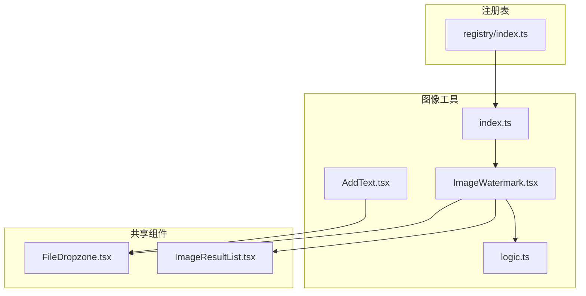
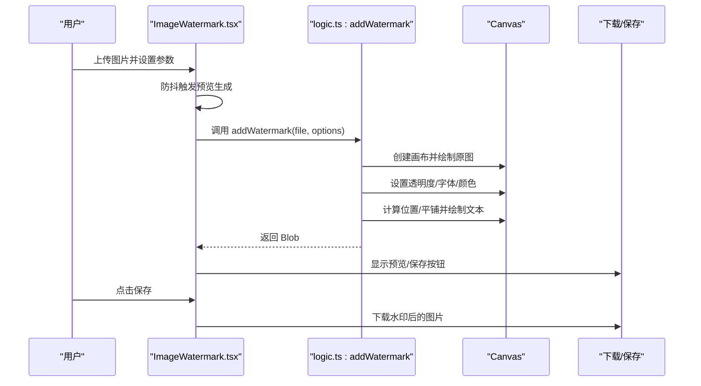
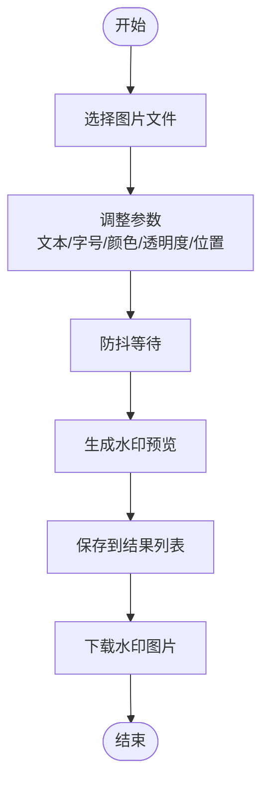
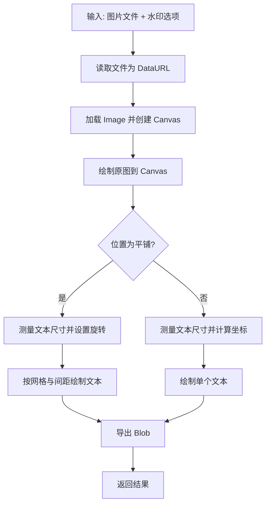
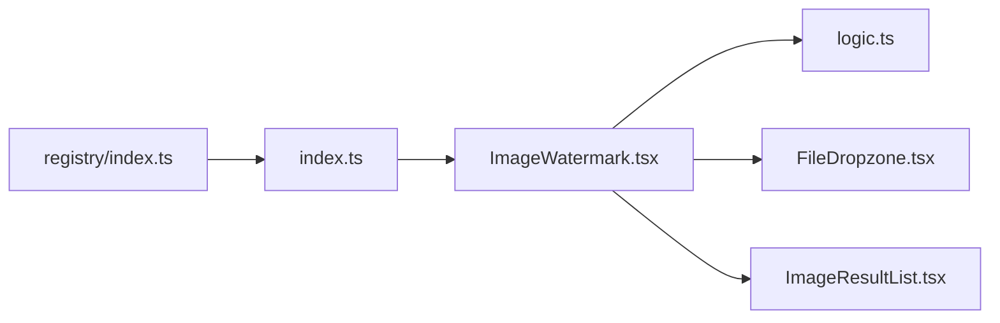

# 水印工具

<cite>
**本文档引用的文件**
- [ImageWatermark.tsx](file://src/tools/image/watermark/ImageWatermark.tsx)
- [logic.ts](file://src/tools/image/watermark/logic.ts)
- [index.ts](file://src/tools/image/watermark/index.ts)
- [ImageResultList.tsx](file://src/components/shared/ImageResultList.tsx)
- [FileDropzone.tsx](file://src/components/shared/FileDropzone.tsx)
- [AddText.tsx](file://src/tools/image/add-text/AddText.tsx)
- [AddWatermarkPdf.tsx](file://src/tools/pdf/add-watermark/AddWatermarkPdf.tsx)
- [registry/index.ts](file://src/lib/registry/index.ts)
- [media-pipeline.ts](file://src/lib/media-pipeline.ts)
</cite>

## 目录
1. [简介](#简介)
2. [项目结构](#项目结构)
3. [核心组件](#核心组件)
4. [架构总览](#架构总览)
5. [详细组件分析](#详细组件分析)
6. [依赖关系分析](#依赖关系分析)
7. [性能考量](#性能考量)
8. [故障排除指南](#故障排除指南)
9. [结论](#结论)
10. [附录](#附录)

## 简介
本文件为图像水印工具的技术文档，聚焦于 ImageWatermark 组件的实现原理与使用方法。该工具基于浏览器 Canvas API 实现文字水印的实时预览与生成，支持多位置布局（居中、四角、平铺）、透明度调节、字体大小与颜色控制，并提供结果保存与批量管理能力。文档同时涵盖水印制作策略、版权保护建议、抗篡改与数字签名集成思路、质量控制与文件大小优化方法，以及效果评估与用户接受度测试指导。

## 项目结构
图像水印工具位于图像工具模块下，采用“页面组件 + 业务逻辑 + 注册表”的分层组织方式：
- 页面组件负责用户交互与实时预览
- 业务逻辑封装 Canvas 水印绘制与导出
- 注册表将工具纳入系统路由与导航体系
- 共享组件提供文件上传、结果列表等通用能力

图表来源
- [ImageWatermark.tsx:1-216](file://src/tools/image/watermark/ImageWatermark.tsx#L1-L216)
- [logic.ts:1-100](file://src/tools/image/watermark/logic.ts#L1-L100)
- [index.ts:1-37](file://src/tools/image/watermark/index.ts#L1-L37)
- [FileDropzone.tsx:1-144](file://src/components/shared/FileDropzone.tsx#L1-L144)
- [ImageResultList.tsx:1-141](file://src/components/shared/ImageResultList.tsx#L1-L141)
- [registry/index.ts:1-164](file://src/lib/registry/index.ts#L1-L164)

章节来源
- [ImageWatermark.tsx:1-216](file://src/tools/image/watermark/ImageWatermark.tsx#L1-L216)
- [logic.ts:1-100](file://src/tools/image/watermark/logic.ts#L1-L100)
- [index.ts:1-37](file://src/tools/image/watermark/index.ts#L1-L37)
- [registry/index.ts:1-164](file://src/lib/registry/index.ts#L1-L164)

## 核心组件
- ImageWatermark 页面组件：提供文件选择、参数调整、实时预览与结果保存功能；内部通过防抖机制在参数变化时重新生成水印预览。
- addWatermark 业务逻辑：基于 Canvas 将文本水印绘制到原图上，支持多位置布局与平铺模式，最终导出为 Blob。
- 文件上传与结果展示：FileDropzone 负责文件拖拽上传与尺寸提示；ImageResultList 负责结果列表渲染、预览与下载。

章节来源
- [ImageWatermark.tsx:25-96](file://src/tools/image/watermark/ImageWatermark.tsx#L25-L96)
- [logic.ts:9-99](file://src/tools/image/watermark/logic.ts#L9-L99)
- [FileDropzone.tsx:42-143](file://src/components/shared/FileDropzone.tsx#L42-L143)
- [ImageResultList.tsx:21-140](file://src/components/shared/ImageResultList.tsx#L21-L140)

## 架构总览
图像水印工具采用前端纯浏览器处理架构，避免服务端依赖，提升隐私性与响应速度。整体流程如下：

图表来源
- [ImageWatermark.tsx:61-81](file://src/tools/image/watermark/ImageWatermark.tsx#L61-L81)
- [logic.ts:13-98](file://src/tools/image/watermark/logic.ts#L13-L98)

## 详细组件分析

### ImageWatermark 页面组件
- 功能要点
  - 文件上传：使用 FileDropzone 接受图片文件，生成预览 URL 并清理旧 URL。
  - 参数控制：文本、字号、颜色、透明度、位置（居中、四角、平铺）。
  - 实时预览：参数变更后通过防抖在约 300ms 后重新生成水印预览。
  - 结果管理：将生成的 Blob 存入结果列表，支持预览、删除与下载。
- 关键交互
  - 防抖控制：利用 setTimeout 与清理逻辑避免频繁重绘。
  - URL 生命周期：使用 URL.createObjectURL 与 URL.revokeObjectURL 管理内存。
  - 国际化：通过 useTranslations 获取文案，确保多语言支持。

图表来源
- [ImageWatermark.tsx:42-96](file://src/tools/image/watermark/ImageWatermark.tsx#L42-L96)
- [ImageWatermark.tsx:61-88](file://src/tools/image/watermark/ImageWatermark.tsx#L61-L88)

章节来源
- [ImageWatermark.tsx:25-215](file://src/tools/image/watermark/ImageWatermark.tsx#L25-L215)

### addWatermark 业务逻辑
- 功能要点
  - 原图加载：使用 FileReader 读取文件，Image 加载后创建等比画布。
  - 文本绘制：设置全局透明度、填充色与字体大小；根据位置计算坐标。
  - 平铺模式：对文本进行旋转与网格平铺，支持间距控制。
  - 导出策略：调用 canvas.toBlob 导出为指定类型与质量参数的 Blob。
- 关键算法
  - 文本测量：使用 measureText 获取宽度与高度，用于定位与平铺。
  - 位置计算：针对不同位置（中心、四角）计算基线坐标。
  - 平铺算法：旋转画布后按行/列遍历绘制，形成瓦片效果。

图表来源
- [logic.ts:13-98](file://src/tools/image/watermark/logic.ts#L13-L98)

章节来源
- [logic.ts:1-100](file://src/tools/image/watermark/logic.ts#L1-L100)

### 文件上传与结果展示
- FileDropzone
  - 支持拖拽/点击上传，可限制文件类型与大小，显示格式与大小提示。
  - 触发埋点事件，便于统计工具使用情况。
- ImageResultList
  - 维护 Blob→URL 缓存，自动清理过期 URL，避免内存泄漏。
  - 提供预览弹窗、删除与下载功能，下载时使用品牌命名规则。

章节来源
- [FileDropzone.tsx:42-143](file://src/components/shared/FileDropzone.tsx#L42-L143)
- [ImageResultList.tsx:21-140](file://src/components/shared/ImageResultList.tsx#L21-L140)

### 工具注册与关联
- 注册表将水印工具纳入系统，定义分类、图标、SEO 类型与 FAQ 列表。
- 与其他图像工具（裁剪、压缩、添加文字等）建立关联，便于用户发现与组合使用。

章节来源
- [index.ts:3-36](file://src/tools/image/watermark/index.ts#L3-L36)
- [registry/index.ts:66-133](file://src/lib/registry/index.ts#L66-L133)

### 与文本添加工具的关系
- AddText 工具提供独立的文字叠加功能，参数与位置控制与水印工具一致，适合批量处理或无透明度需求场景。
- 两者均基于 Canvas 绘制文本，可作为水印工具的补充或替代方案。

章节来源
- [AddText.tsx:22-156](file://src/tools/image/add-text/AddText.tsx#L22-L156)

### PDF 水印工具（对比参考）
- AddWatermarkPdf 提供 PDF 文本水印功能，参数包括文本、透明度与字号范围，强调隐私与错误处理。
- 与图像水印工具相比，PDF 版本面向文档场景，参数范围与默认值有所不同。

章节来源
- [AddWatermarkPdf.tsx:10-146](file://src/tools/pdf/add-watermark/AddWatermarkPdf.tsx#L10-L146)

## 依赖关系分析
- 组件耦合
  - ImageWatermark 依赖 logic.ts 的 addWatermark，依赖共享组件 FileDropzone 与 ImageResultList。
  - 注册表通过 index.ts 将工具元数据注入系统，便于路由与导航。
- 外部依赖
  - 浏览器 Canvas API：用于图像绘制与导出。
  - FileReader/URL API：用于文件读取与对象 URL 管理。
  - 国际化框架：通过 useTranslations 提供多语言文案。
- 可能的循环依赖
  - 当前结构清晰，未见直接循环依赖；注册表仅导入元数据，不引入组件。

图表来源
- [ImageWatermark.tsx:5-12](file://src/tools/image/watermark/ImageWatermark.tsx#L5-L12)
- [index.ts:3-8](file://src/tools/image/watermark/index.ts#L3-L8)
- [registry/index.ts:18-18](file://src/lib/registry/index.ts#L18-L18)

章节来源
- [ImageWatermark.tsx:1-12](file://src/tools/image/watermark/ImageWatermark.tsx#L1-L12)
- [index.ts:1-37](file://src/tools/image/watermark/index.ts#L1-L37)
- [registry/index.ts:1-164](file://src/lib/registry/index.ts#L1-L164)

## 性能考量
- 实时预览优化
  - 防抖机制：参数变更后延迟生成预览，减少频繁重绘。
  - URL 缓存：复用对象 URL，避免重复创建与泄露。
- Canvas 性能
  - 使用等比画布，避免不必要的缩放。
  - 平铺模式下合理设置间距与旋转角度，平衡覆盖密度与渲染开销。
- 导出质量与体积
  - 默认导出质量参数已设定，可在保证视觉质量前提下控制体积。
  - 对于大图处理，建议先进行压缩或分块处理，避免内存压力。
- 浏览器兼容性
  - 本项目同时提供基于 WebCodecs 的媒体处理能力，可作为视频/音频处理的硬件加速方案；图像水印工具完全运行在前端，无需额外依赖。

章节来源
- [ImageWatermark.tsx:61-88](file://src/tools/image/watermark/ImageWatermark.tsx#L61-L88)
- [ImageResultList.tsx:26-50](file://src/components/shared/ImageResultList.tsx#L26-L50)
- [media-pipeline.ts:7-14](file://src/lib/media-pipeline.ts#L7-L14)

## 故障排除指南
- 预览失败
  - 检查文件是否成功读取与加载，确认 FileReader 与 Image 的回调是否执行。
  - 确认 Canvas 上下文可用，避免在不可用上下文中绘制。
- 导出为空
  - 确保 canvas.toBlob 回调被触发且返回非空 Blob。
  - 检查文件类型与导出参数是否正确。
- 内存泄漏
  - 确保每次替换预览或结果时调用 URL.revokeObjectURL 清理旧 URL。
  - ImageResultList 已内置缓存与清理逻辑，仍需确保组件卸载时清理。
- 错误处理
  - 在参数缺失或无效时，组件应静默忽略或给出明确提示。
  - 对于 PDF 水印工具，提供错误状态展示与日志记录以便排查。

章节来源
- [logic.ts:13-27](file://src/tools/image/watermark/logic.ts#L13-L27)
- [logic.ts:81-91](file://src/tools/image/watermark/logic.ts#L81-L91)
- [ImageResultList.tsx:26-50](file://src/components/shared/ImageResultList.tsx#L26-L50)

## 结论
图像水印工具通过简洁的前端架构实现了高效、可定制的文字水印功能。其核心优势在于实时预览、灵活的位置与透明度控制、以及完善的资源管理。结合批量处理与结果管理能力，可满足多种版权保护与品牌标识场景的需求。未来可在平铺密度、字体渲染优化与导出格式扩展方面进一步增强。

## 附录

### 水印制作方法与策略
- 文字水印
  - 位置：优先使用四角或中心偏下的位置，避免遮挡主体内容。
  - 透明度：建议在 0.3-0.7 区间，兼顾可见性与美观。
  - 字体与颜色：浅色背景用深色文字，深色背景用浅色文字；字号适中，避免过大影响观感。
- 批量水印处理
  - 使用 ImageResultList 管理多个结果，统一命名与下载。
  - 对于大量图片，建议分批处理并监控内存占用。
- 位置控制、缩放与旋转
  - 位置：居中、四角与平铺三种模式，平铺时可配合旋转角度增强覆盖。
  - 缩放：通过字号与画布尺寸控制缩放比例，确保在不同分辨率下的一致性。
  - 旋转：平铺模式下可设置轻微旋转，提升视觉层次。

章节来源
- [ImageWatermark.tsx:16-23](file://src/tools/image/watermark/ImageWatermark.tsx#L16-L23)
- [logic.ts:34-79](file://src/tools/image/watermark/logic.ts#L34-L79)

### 版权保护与抗篡改建议
- 版权保护策略
  - 水印内容：包含版权信息、作者名、时间戳或唯一标识。
  - 可见性：在缩略图与预览图中也保留弱水印，防止直接替换。
- 抗篡改技术
  - 嵌入隐藏信息：在图像元数据或像素中嵌入不可见标识，结合哈希校验。
  - 数字签名：对水印后的图像进行摘要与签名，提供溯源证据。
- 注意事项
  - 避免在关键区域放置强水印，以免影响图像用途。
  - 对于可编辑格式（如 PSD），建议导出为不可修改格式后再添加水印。

### 水印质量与文件大小控制
- 质量控制
  - 选择合适的导出质量参数，平衡清晰度与体积。
  - 对高分辨率图片先进行降采样再添加水印，降低渲染成本。
- 文件大小优化
  - 使用合适的导出格式（如 JPEG 对照片、PNG 对图标）。
  - 控制透明度与覆盖范围，减少冗余像素。

### 效果评估与用户接受度测试
- 评估标准
  - 可见性：在不同背景下均清晰可辨。
  - 美观性：不破坏图像构图与主题风格。
  - 性能：预览与导出响应迅速，无明显卡顿。
- 测试方法
  - A/B 测试：对比不同透明度、字号与位置的效果。
  - 用户调研：收集目标用户对水印风格与强度的偏好。
  - 场景验证：在典型应用场景（社交分享、商业展示、版权保护）中验证实用性。