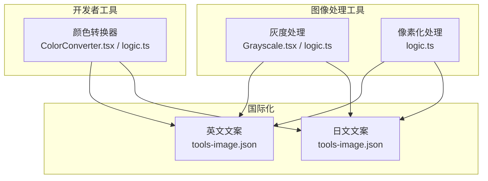
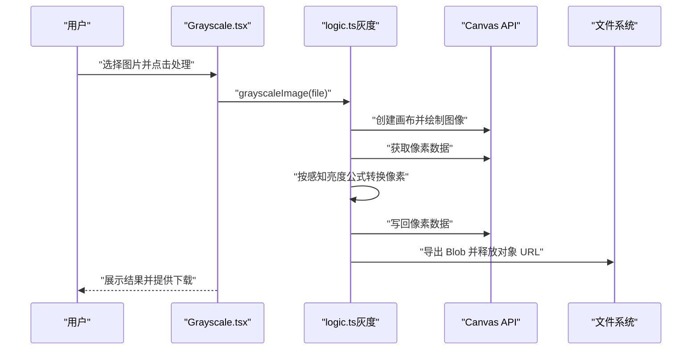
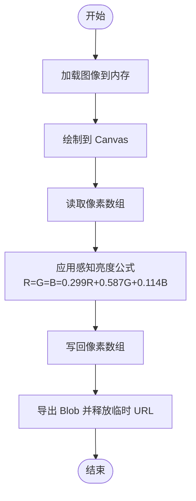
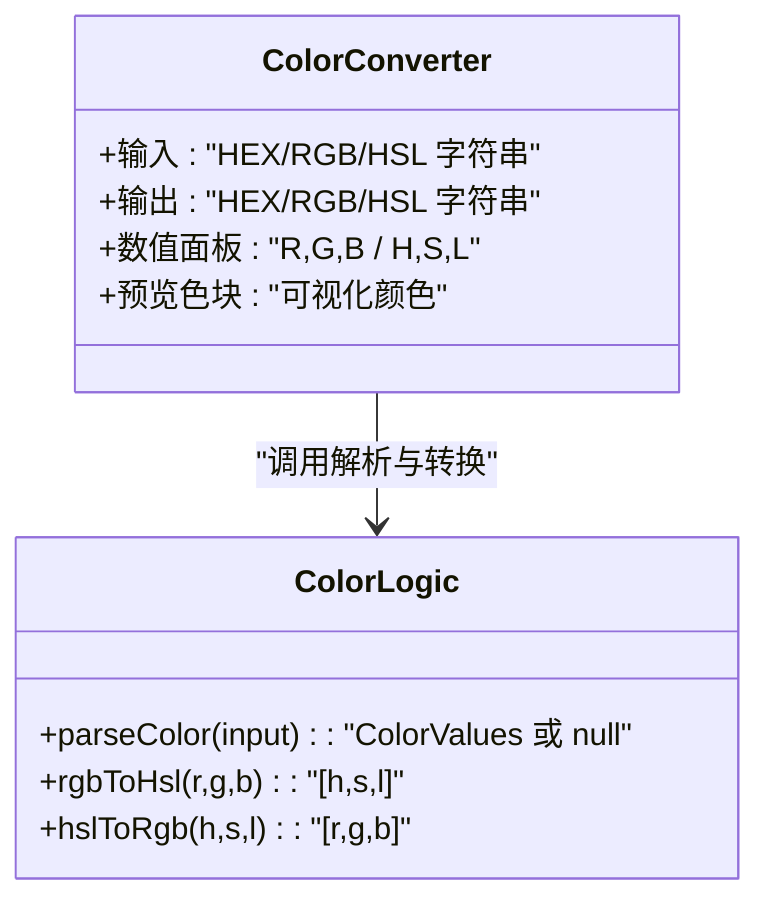
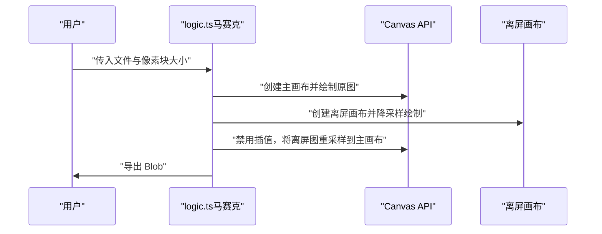
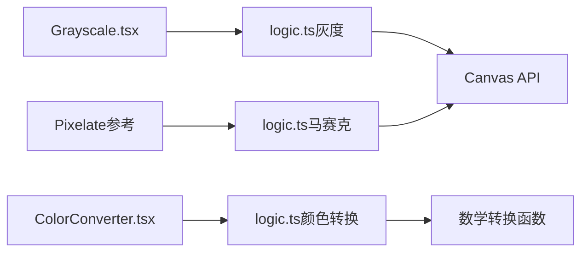

# 色彩效果

<cite>
**本文引用的文件**
- [Grayscale.tsx](file://src/tools/image/grayscale/Grayscale.tsx)
- [logic.ts（灰度）](file://src/tools/image/grayscale/logic.ts)
- [ColorConverter.tsx](file://src/tools/developer/color-converter/ColorConverter.tsx)
- [logic.ts（颜色转换）](file://src/tools/developer/color-converter/logic.ts)
- [logic.ts（马赛克）](file://src/tools/image/pixelate/logic.ts)
- [tools-image.json（英文）](file://messages/en/tools-image.json)
- [tools-image.json（日文）](file://messages/ja/tools-image.json)
</cite>

## 目录
1. [简介](#简介)
2. [项目结构](#项目结构)
3. [核心组件](#核心组件)
4. [架构总览](#架构总览)
5. [详细组件分析](#详细组件分析)
6. [依赖关系分析](#依赖关系分析)
7. [性能考量](#性能考量)
8. [故障排查指南](#故障排查指南)
9. [结论](#结论)
10. [附录](#附录)

## 简介
本技术文档围绕“色彩效果”主题，系统梳理并解释灰度处理、色彩空间转换与像素化等图像处理能力的实现原理与使用方法。重点覆盖以下方面：
- 灰度处理：基于感知亮度的像素级转换，保留原图分辨率与质量。
- 色彩空间转换：支持 HEX、RGB、HSL 互转，提供数值与可视化预览。
- 其他视觉效果：以像素化为例，展示基于降采样与重采样的图像风格化处理思路。
- 参数调节与组合：如何通过现有实现扩展参数（如灰度强度、像素块大小），以及效果组合的创意实践。
- 性能优化与实时预览：浏览器端 Canvas 处理的性能策略与交互体验建议。
- 显示设备适配：不同显示器色域与白平衡对结果的影响及应对方法。

## 项目结构
与“色彩效果”直接相关的核心模块位于以下路径：
- 图像灰度处理：src/tools/image/grayscale
- 颜色空间转换：src/tools/developer/color-converter
- 像素化效果：src/tools/image/pixelate
- 国际化文案：messages/<lang>/tools-image.json

图表来源
- [Grayscale.tsx:1-69](file://src/tools/image/grayscale/Grayscale.tsx#L1-L69)
- [logic.ts（灰度）:1-41](file://src/tools/image/grayscale/logic.ts#L1-L41)
- [ColorConverter.tsx:1-99](file://src/tools/developer/color-converter/ColorConverter.tsx#L1-L99)
- [logic.ts（颜色转换）:1-114](file://src/tools/developer/color-converter/logic.ts#L1-L114)
- [logic.ts（马赛克）:1-48](file://src/tools/image/pixelate/logic.ts#L1-L48)
- [tools-image.json（英文）:381-394](file://messages/en/tools-image.json#L381-L394)
- [tools-image.json（日文）:365-377](file://messages/ja/tools-image.json#L365-L377)

章节来源
- [Grayscale.tsx:1-69](file://src/tools/image/grayscale/Grayscale.tsx#L1-L69)
- [logic.ts（灰度）:1-41](file://src/tools/image/grayscale/logic.ts#L1-L41)
- [ColorConverter.tsx:1-99](file://src/tools/developer/color-converter/ColorConverter.tsx#L1-L99)
- [logic.ts（颜色转换）:1-114](file://src/tools/developer/color-converter/logic.ts#L1-L114)
- [logic.ts（马赛克）:1-48](file://src/tools/image/pixelate/logic.ts#L1-L48)
- [tools-image.json（英文）:381-394](file://messages/en/tools-image.json#L381-L394)
- [tools-image.json（日文）:365-377](file://messages/ja/tools-image.json#L365-L377)

## 核心组件
- 灰度处理（Grayscale）
  - 前端界面负责文件上传、触发处理、错误提示与结果展示。
  - 后端逻辑基于 Canvas 的像素级操作，采用感知亮度加权公式进行灰度转换。
- 颜色转换器（ColorConverter）
  - 支持输入 HEX、RGB、HSL，输出对应格式与数值，并提供可视化色块与复制功能。
  - 内部实现 RGB↔HSL 双向转换算法。
- 像素化（Pixelate）
  - 通过两次采样（降采样+重采样）实现像素块化效果，支持像素块大小参数化。

章节来源
- [Grayscale.tsx:13-68](file://src/tools/image/grayscale/Grayscale.tsx#L13-L68)
- [logic.ts（灰度）:1-41](file://src/tools/image/grayscale/logic.ts#L1-L41)
- [ColorConverter.tsx:8-98](file://src/tools/developer/color-converter/ColorConverter.tsx#L8-L98)
- [logic.ts（颜色转换）:13-114](file://src/tools/developer/color-converter/logic.ts#L13-L114)
- [logic.ts（马赛克）:1-48](file://src/tools/image/pixelate/logic.ts#L1-L48)

## 架构总览
下图展示了“色彩效果”相关模块的调用关系与数据流：

图表来源
- [Grayscale.tsx:20-40](file://src/tools/image/grayscale/Grayscale.tsx#L20-L40)
- [logic.ts（灰度）:1-41](file://src/tools/image/grayscale/logic.ts#L1-L41)

## 详细组件分析

### 灰度处理（Grayscale）
- 实现原理
  - 使用 Canvas 绘制图像后读取像素数据，逐像素应用感知亮度加权公式，将 R/G/B 通道统一为灰度值。
  - 通过 toBlob 导出结果，维持原图格式与高质量。
- 数学基础
  - 感知亮度公式：gray = 0.299×R + 0.587×G + 0.114×B
  - 该权重反映人眼对绿光最敏感、对红光次之、对蓝光最不敏感的特性。
- 参数与可扩展性
  - 当前实现为全量灰度转换；若需“灰度强度”参数，可在公式中引入混合系数，将原 RGB 与计算灰度线性插值。
- 错误处理
  - 加载失败或导出失败时抛出错误并记录分析事件。
- 国际化文案
  - 英文与日文文案强调“基于亮度的转换”、“即时处理”、“保持分辨率”等关键点。

图表来源
- [logic.ts（灰度）:15-19](file://src/tools/image/grayscale/logic.ts#L15-L19)

章节来源
- [Grayscale.tsx:20-40](file://src/tools/image/grayscale/Grayscale.tsx#L20-L40)
- [logic.ts（灰度）:1-41](file://src/tools/image/grayscale/logic.ts#L1-L41)
- [tools-image.json（英文）:381-394](file://messages/en/tools-image.json#L381-L394)
- [tools-image.json（日文）:371-372](file://messages/ja/tools-image.json#L371-L372)

### 颜色空间转换（ColorConverter）
- 功能概述
  - 输入支持 HEX、RGB、HSL；输出同时展示目标格式字符串与数值面板。
  - 提供可视化色块，便于直观比对不同空间下的颜色表达。
- 算法要点
  - HEX→RGB：解析六位/三位十六进制，扩展为完整 RGB。
  - RGB→HSL：先归一化到 0..1，再计算最大/最小值、亮度、饱和度与色相。
  - HSL→RGB：使用分段插值函数 hue2rgb 计算三通道最终值。
- 参数与扩展
  - 可在此基础上扩展“色调旋转”、“饱和度/亮度调节”等参数，作为更复杂的色彩调整入口。
- 用户体验
  - 输入为空时清空结果；输入无效时提示错误信息；支持一键复制输出格式文本。

图表来源
- [ColorConverter.tsx:12-15](file://src/tools/developer/color-converter/ColorConverter.tsx#L12-L15)
- [logic.ts（颜色转换）:13-114](file://src/tools/developer/color-converter/logic.ts#L13-L114)

章节来源
- [ColorConverter.tsx:1-99](file://src/tools/developer/color-converter/ColorConverter.tsx#L1-L99)
- [logic.ts（颜色转换）:1-114](file://src/tools/developer/color-converter/logic.ts#L1-L114)

### 像素化（Pixelate）
- 实现思路
  - 先将图像按像素块大小降采样至小尺寸画布，再将该小图以禁用插值的方式重采样到原尺寸，形成块状像素效果。
  - 使用离屏画布避免同画布源/目标重叠导致的渲染问题。
- 参数化
  - pixelSize 控制像素块大小；值越大，块感越强，细节损失越多。
- 适用场景
  - 隐私保护（人脸/车牌模糊）、复古风格、低像素艺术风格等。

图表来源
- [logic.ts（马赛克）:1-48](file://src/tools/image/pixelate/logic.ts#L1-L48)

章节来源
- [logic.ts（马赛克）:1-48](file://src/tools/image/pixelate/logic.ts#L1-L48)

### 色彩调整参数与组合使用
- 可调节参数（基于现有实现的扩展方向）
  - 灰度强度：在全灰度与原图之间线性混合，形成从彩色到灰度的渐变效果。
  - 饱和度：在 HSL 空间中对 S 进行缩放或偏移。
  - 亮度：在 HSL 空间中对 L 进行缩放或偏移。
  - 对比度：通过非线性映射（伽马校正或 S 曲线）增强明暗层次。
  - 色调：在 HSL 空间中对 H 进行循环偏移。
- 组合示例（创意实践）
  - “怀旧胶片”：降低饱和度、轻微提升黄/橙色调、适度提高对比度。
  - “极简黑白”：高对比度、窄中间调、纯灰度。
  - “情绪化滤镜”：根据场景选择暖/冷色调，结合亮度与对比度微调。
- 注意事项
  - 参数调整应遵循“先整体、后局部”的顺序，避免过度处理导致失真。
  - 不同图像内容（皮肤、天空、植被）对参数的敏感度不同，需分别优化。

## 依赖关系分析
- 组件内聚与耦合
  - 灰度与像素化均以内存中的像素数组为核心数据结构，耦合度低，易于独立扩展。
  - 颜色转换器与灰度处理无直接耦合，但共享“色彩空间理解”的通用知识。
- 外部依赖
  - 浏览器 Canvas API：用于图像绘制、像素读写与导出。
  - 文件系统与对象 URL：用于临时存储与释放大图像资源。
- 潜在环路
  - 当前模块间无循环依赖，结构清晰。

图表来源
- [Grayscale.tsx:1-69](file://src/tools/image/grayscale/Grayscale.tsx#L1-L69)
- [logic.ts（灰度）:1-41](file://src/tools/image/grayscale/logic.ts#L1-L41)
- [ColorConverter.tsx:1-99](file://src/tools/developer/color-converter/ColorConverter.tsx#L1-L99)
- [logic.ts（颜色转换）:1-114](file://src/tools/developer/color-converter/logic.ts#L1-L114)
- [logic.ts（马赛克）:1-48](file://src/tools/image/pixelate/logic.ts#L1-L48)

章节来源
- [Grayscale.tsx:1-69](file://src/tools/image/grayscale/Grayscale.tsx#L1-L69)
- [logic.ts（灰度）:1-41](file://src/tools/image/grayscale/logic.ts#L1-L41)
- [ColorConverter.tsx:1-99](file://src/tools/developer/color-converter/ColorConverter.tsx#L1-L99)
- [logic.ts（颜色转换）:1-114](file://src/tools/developer/color-converter/logic.ts#L1-L114)
- [logic.ts（马赛克）:1-48](file://src/tools/image/pixelate/logic.ts#L1-L48)

## 性能考量
- 浏览器端处理优势
  - 所有处理在客户端完成，无需上传至服务器，隐私与速度兼顾。
- 像素级处理的性能策略
  - 使用单次遍历修改像素数组，避免多次上下文切换。
  - 在灰度处理中，逐像素加权计算的时间复杂度为 O(N)，N 为像素总数。
- 导出与内存管理
  - 使用 toBlob 导出时指定合适的质量参数，兼顾体积与质量。
  - 及时释放对象 URL，防止内存泄漏。
- 实时预览建议
  - 对于参数化效果（如灰度强度、饱和度、亮度），可采用滑杆控件动态更新，先在离屏 Canvas 上预览，再一次性写入主画布。
- 大图优化
  - 对超大图像可考虑分块处理或降低预览分辨率，减少主线程阻塞。

## 故障排查指南
- 常见问题与解决
  - 图像无法加载：检查文件类型是否受支持，确认对象 URL 是否正确创建与释放。
  - 导出失败：确认 Canvas 已完成绘制与像素写回，toBlob 的回调是否被触发。
  - 结果异常（如全黑/全白）：检查像素数组索引与边界条件，确保通道值在合法范围内。
- 日志与追踪
  - 处理开始与结束时间可用于性能监控；错误信息用于定位问题根因。
- 用户提示
  - 文案明确告知处理过程、质量保留与隐私保障，提升用户信任度。

章节来源
- [Grayscale.tsx:33-37](file://src/tools/image/grayscale/Grayscale.tsx#L33-L37)
- [logic.ts（灰度）:34-37](file://src/tools/image/grayscale/logic.ts#L34-L37)
- [tools-image.json（英文）:389-394](file://messages/en/tools-image.json#L389-L394)

## 结论
本项目在浏览器端提供了高效的图像色彩效果能力：灰度处理基于感知亮度公式，颜色转换覆盖常用色彩空间，像素化则展示了风格化处理的通用思路。通过参数化扩展与合理性能策略，可进一步满足多样化的视觉创作需求。建议在实际工程中结合业务场景，逐步引入更多色彩调整参数与组合效果，并配套完善的实时预览与错误处理机制。

## 附录
- 色彩空间转换算法速查
  - RGB→HSL：归一化后计算最大/最小值、亮度、饱和度与色相。
  - HSL→RGB：使用分段插值函数 hue2rgb 计算三通道值。
- 视觉评估标准与艺术指导
  - 评估维度：自然度、对比度、细节保留、风格一致性。
  - 艺术指导：根据内容语义选择合适的色调与对比度，避免过度处理破坏真实感。
- 显示设备适配
  - 不同显示器色域与白平衡会影响最终呈现；建议在多种设备上验证效果，并提供“软校准”提示（如在标准 D65 白点下观察）。