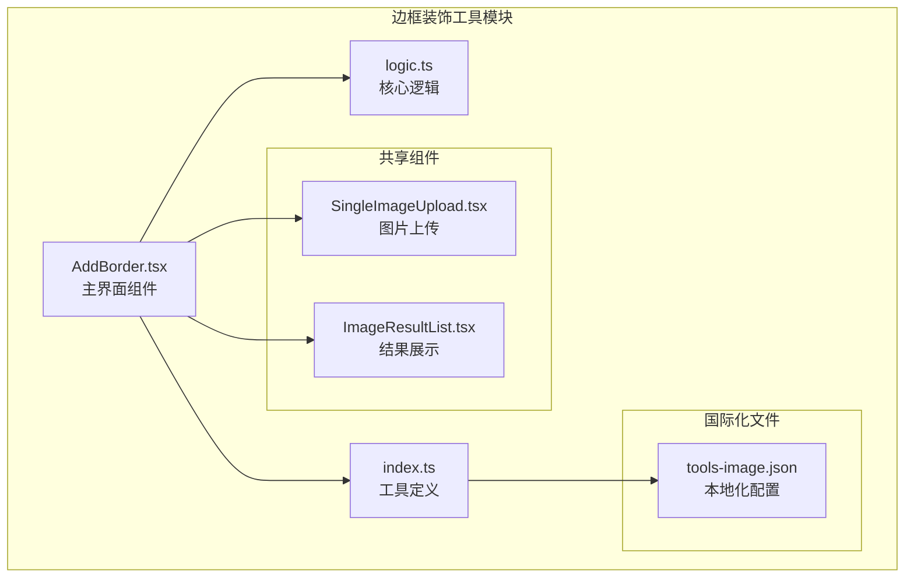
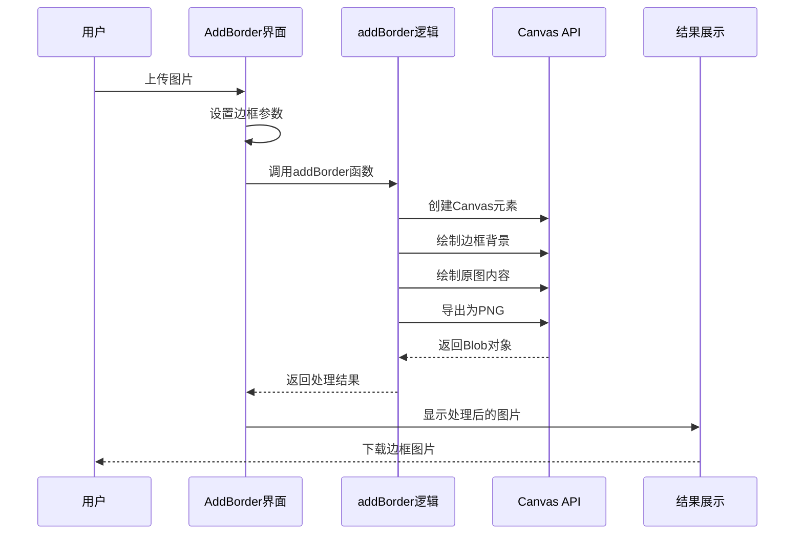
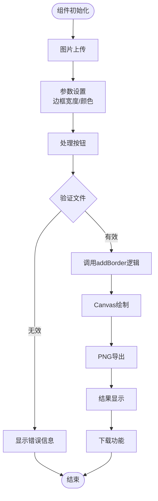
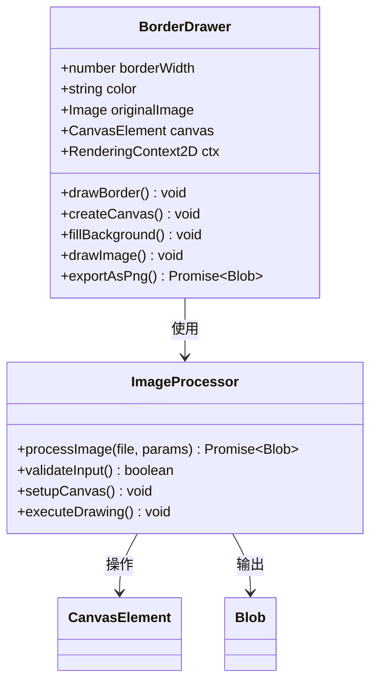
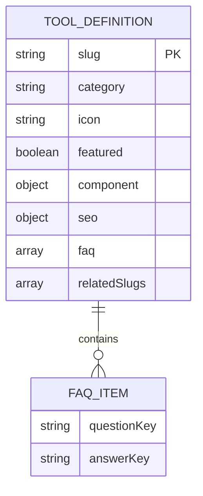
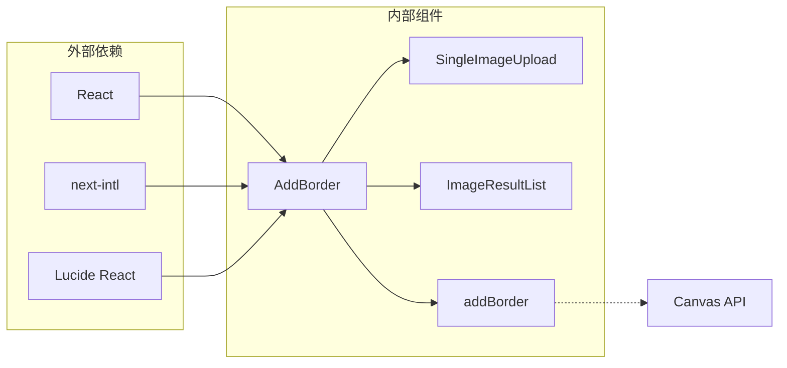

# 边框装饰

<cite>
**本文档引用的文件**
- [AddBorder.tsx](file://src/tools/image/add-border/AddBorder.tsx)
- [logic.ts](file://src/tools/image/add-border/logic.ts)
- [index.ts](file://src/tools/image/add-border/index.ts)
- [ImageResultList.tsx](file://src/components/shared/ImageResultList.tsx)
- [SingleImageUpload.tsx](file://src/components/shared/SingleImageUpload.tsx)
- [tools-image.json](file://messages/zh-Hans/tools-image.json)
</cite>

## 目录
1. [简介](#简介)
2. [项目结构](#项目结构)
3. [核心组件](#核心组件)
4. [架构概览](#架构概览)
5. [详细组件分析](#详细组件分析)
6. [依赖关系分析](#依赖关系分析)
7. [性能考量](#性能考量)
8. [故障排除指南](#故障排除指南)
9. [结论](#结论)
10. [附录](#附录)

## 简介
边框装饰工具是一个专注于为图像添加边框装饰的在线工具。该工具允许用户自定义边框宽度、颜色，并提供实时预览和批量处理功能。所有处理过程均在浏览器端完成，确保用户隐私和数据安全。

## 项目结构
边框装饰工具位于图像处理工具模块中，采用标准的Next.js组件结构：

**图表来源**
- [AddBorder.tsx:1-100](file://src/tools/image/add-border/AddBorder.tsx#L1-L100)
- [logic.ts:1-38](file://src/tools/image/add-border/logic.ts#L1-L38)
- [index.ts:1-37](file://src/tools/image/add-border/index.ts#L1-L37)

**章节来源**
- [AddBorder.tsx:1-100](file://src/tools/image/add-border/AddBorder.tsx#L1-L100)
- [index.ts:1-37](file://src/tools/image/add-border/index.ts#L1-L37)

## 核心组件
边框装饰工具由以下核心组件构成：

### 主界面组件 (AddBorder)
负责用户交互界面，包括文件上传、参数设置和结果展示。

### 核心逻辑组件 (addBorder)
实现具体的边框绘制算法，使用Canvas API进行图像处理。

### 工具定义组件 (index)
定义工具的基本信息、SEO配置和相关工具关联。

**章节来源**
- [AddBorder.tsx:13-100](file://src/tools/image/add-border/AddBorder.tsx#L13-L100)
- [logic.ts:1-38](file://src/tools/image/add-border/logic.ts#L1-L38)
- [index.ts:1-37](file://src/tools/image/add-border/index.ts#L1-L37)

## 架构概览
边框装饰工具采用客户端渲染架构，所有图像处理在浏览器端完成：

**图表来源**
- [AddBorder.tsx:22-40](file://src/tools/image/add-border/AddBorder.tsx#L22-L40)
- [logic.ts:6-37](file://src/tools/image/add-border/logic.ts#L6-L37)

## 详细组件分析

### AddBorder 主界面组件
AddBorder组件实现了完整的用户交互流程：

**图表来源**
- [AddBorder.tsx:22-40](file://src/tools/image/add-border/AddBorder.tsx#L22-L40)

#### 参数控制机制
组件提供了直观的参数控制界面：
- 边框宽度：1-100像素范围的滑块控件
- 边框颜色：颜色选择器，支持十六进制颜色值
- 实时预览：参数变化时即时反映到处理结果

#### 错误处理机制
实现了完善的错误处理：
- 文件加载失败处理
- 处理过程异常捕获
- 用户友好的错误提示

**章节来源**
- [AddBorder.tsx:13-100](file://src/tools/image/add-border/AddBorder.tsx#L13-L100)

### addBorder 核心逻辑组件
核心逻辑组件实现了高效的边框绘制算法：

**图表来源**
- [logic.ts:1-38](file://src/tools/image/add-border/logic.ts#L1-L38)

#### Canvas绘制算法
核心绘制算法包含以下关键步骤：
1. **Canvas初始化**：根据原图尺寸和边框宽度计算新尺寸
2. **背景填充**：使用指定颜色填充整个Canvas
3. **图像绘制**：将原图绘制到Canvas的偏移位置
4. **格式导出**：将Canvas内容导出为PNG格式

#### 性能优化策略
- 使用URL.createObjectURL创建临时URL，避免内存泄漏
- 及时释放Canvas资源和URL引用
- 采用Promise封装异步处理流程

**章节来源**
- [logic.ts:1-38](file://src/tools/image/add-border/logic.ts#L1-L38)

### 工具定义组件
工具定义组件提供了完整的工具元数据：

**图表来源**
- [index.ts:3-34](file://src/tools/image/add-border/index.ts#L3-L34)

**章节来源**
- [index.ts:1-37](file://src/tools/image/add-border/index.ts#L1-L37)

## 依赖关系分析

### 组件间依赖关系

**图表来源**
- [AddBorder.tsx:3-9](file://src/tools/image/add-border/AddBorder.tsx#L3-L9)

### 国际化依赖
工具完全支持多语言国际化，通过tools-image.json文件管理本地化字符串。

**章节来源**
- [AddBorder.tsx:3-9](file://src/tools/image/add-border/AddBorder.tsx#L3-L9)
- [tools-image.json:449-493](file://messages/zh-Hans/tools-image.json#L449-L493)

## 性能考量

### 浏览器端处理优势
- **零服务器负载**：所有图像处理在客户端完成
- **实时响应**：参数调整即时反映到预览
- **隐私保护**：图像数据不离开用户设备

### 内存管理策略
- 及时撤销Object URLs，防止内存泄漏
- 合理管理Canvas元素生命周期
- 批量处理时的资源回收机制

### 渲染优化技术
- 使用requestAnimationFrame优化动画
- 智能缓存预览URL，避免重复创建
- 条件渲染减少不必要的DOM更新

## 故障排除指南

### 常见问题及解决方案

#### 图片加载失败
**症状**：上传图片后显示错误信息
**原因**：图片文件损坏或格式不支持
**解决方案**：检查图片文件完整性，尝试其他格式

#### 处理超时
**症状**：处理按钮长时间处于加载状态
**原因**：图片过大或设备性能不足
**解决方案**：压缩图片尺寸或使用更高性能设备

#### 颜色显示异常
**症状**：边框颜色与预期不符
**原因**：颜色值格式错误或浏览器兼容性问题
**解决方案**：确认使用正确的十六进制颜色值

**章节来源**
- [AddBorder.tsx:33-37](file://src/tools/image/add-border/AddBorder.tsx#L33-L37)

## 结论
边框装饰工具通过简洁的用户界面和高效的Canvas API实现，为用户提供了便捷的图像边框添加功能。工具具有以下特点：

- **隐私安全**：所有处理在浏览器端完成
- **操作简便**：直观的参数控制界面
- **性能优秀**：优化的Canvas绘制算法
- **扩展性强**：模块化的组件设计

未来可以考虑增加更多边框样式选项，如渐变边框、阴影效果等高级功能。

## 附录

### 视觉设计指导
- **色彩搭配**：选择与主题内容协调的颜色
- **比例协调**：边框宽度与图片尺寸保持适当比例
- **对比度考虑**：确保边框与背景有足够的对比度

### 最佳实践建议
- 优先使用PNG格式以支持透明度
- 合理控制边框宽度，避免过度装饰
- 考虑目标平台的显示效果和性能限制