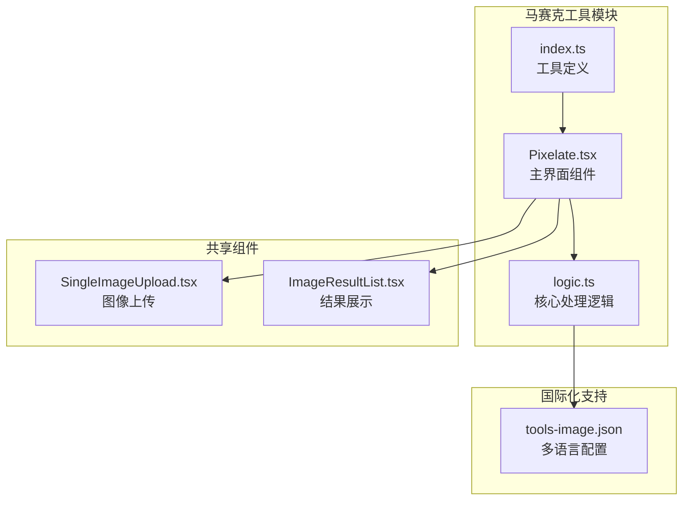
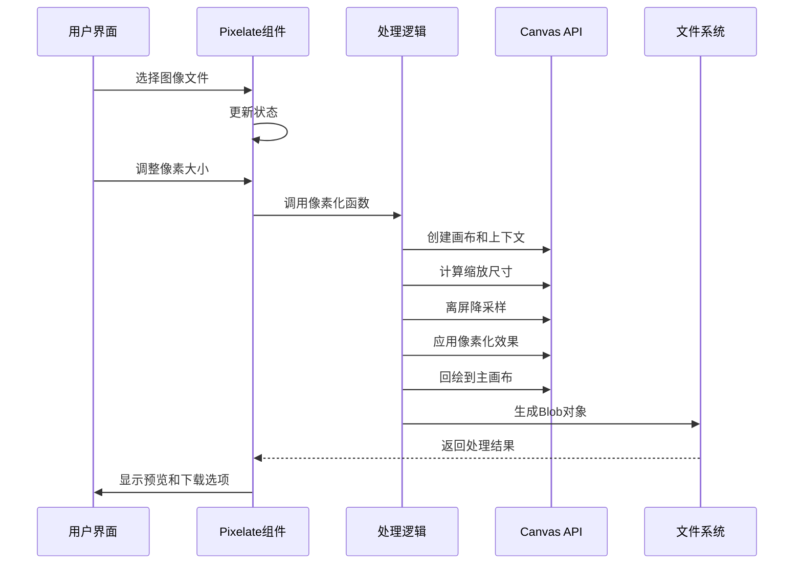
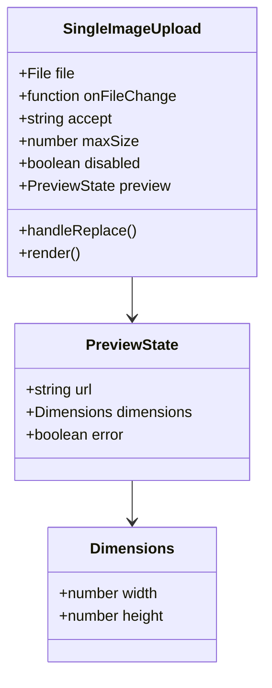
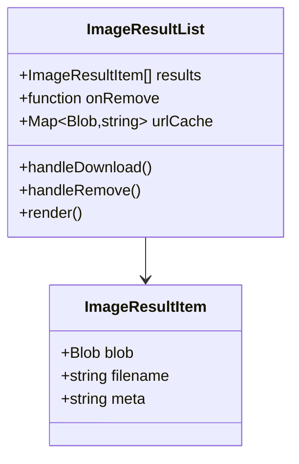
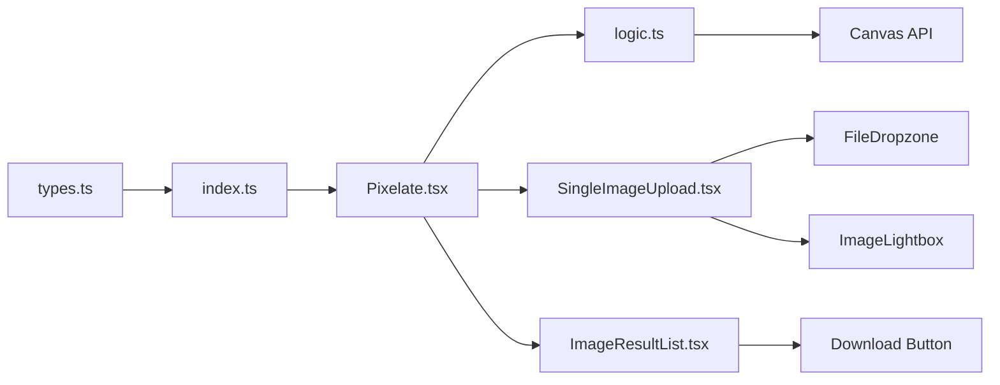

# 马赛克效果

<cite>
**本文档引用的文件**
- [Pixelate.tsx](file://src/tools/image/pixelate/Pixelate.tsx)
- [logic.ts](file://src/tools/image/pixelate/logic.ts)
- [index.ts](file://src/tools/image/pixelate/index.ts)
- [tools-image.json](file://messages/en/tools-image.json)
- [SingleImageUpload.tsx](file://src/components/shared/SingleImageUpload.tsx)
- [ImageResultList.tsx](file://src/components/shared/ImageResultList.tsx)
- [types.ts](file://src/lib/registry/types.ts)
- [formatFileSize.ts](file://src/lib/utils/formatFileSize.ts)
</cite>

## 目录
1. [简介](#简介)
2. [项目结构](#项目结构)
3. [核心组件](#核心组件)
4. [架构概览](#架构概览)
5. [详细组件分析](#详细组件分析)
6. [依赖关系分析](#依赖关系分析)
7. [性能考虑](#性能考虑)
8. [故障排除指南](#故障排除指南)
9. [结论](#结论)
10. [附录](#附录)

## 简介

马赛克效果工具是一个基于浏览器的图像处理工具，专门用于创建像素化效果。该工具实现了高效的像素块生成算法和颜色平均技术，为用户提供精确的马赛克强度控制和实时预览功能。

该工具的核心优势在于完全在浏览器中运行，无需上传任何图像文件，确保了用户隐私和数据安全。通过使用HTML5 Canvas API，工具能够实现高质量的像素化效果，支持从轻微到重度的各种马赛克强度调节。

## 项目结构

马赛克效果工具采用模块化架构设计，主要包含以下组件：



**图表来源**
- [Pixelate.tsx:13-87](file://src/tools/image/pixelate/Pixelate.tsx#L13-L87)
- [logic.ts:1-48](file://src/tools/image/pixelate/logic.ts#L1-L48)
- [index.ts:3-34](file://src/tools/image/pixelate/index.ts#L3-L34)

**章节来源**
- [Pixelate.tsx:1-88](file://src/tools/image/pixelate/Pixelate.tsx#L1-L88)
- [logic.ts:1-49](file://src/tools/image/pixelate/logic.ts#L1-L49)
- [index.ts:1-37](file://src/tools/image/pixelate/index.ts#L1-L37)

## 核心组件

### 主界面组件 (Pixelate.tsx)

主界面组件负责用户交互和状态管理，提供了直观的马赛克工具操作界面。

**关键特性：**
- 实时像素大小调节（2px-50px）
- 即时预览功能
- 错误处理和状态管理
- 结果下载和管理

### 核心处理逻辑 (logic.ts)

核心处理逻辑实现了高效的像素化算法，使用双通道缩放技术确保图像质量。

**算法流程：**
1. 创建临时离屏画布进行降采样
2. 应用像素化效果
3. 回绘到主画布
4. 生成Blob对象

### 工具定义 (index.ts)

工具定义文件注册了马赛克工具的元数据，包括SEO配置和相关工具链接。

**章节来源**
- [Pixelate.tsx:13-87](file://src/tools/image/pixelate/Pixelate.tsx#L13-L87)
- [logic.ts:1-48](file://src/tools/image/pixelate/logic.ts#L1-L48)
- [index.ts:3-34](file://src/tools/image/pixelate/index.ts#L3-L34)

## 架构概览

马赛克工具采用分层架构设计，确保了代码的可维护性和扩展性：



**图表来源**
- [Pixelate.tsx:21-41](file://src/tools/image/pixelate/Pixelate.tsx#L21-L41)
- [logic.ts:5-47](file://src/tools/image/pixelate/logic.ts#L5-L47)

**章节来源**
- [Pixelate.tsx:21-41](file://src/tools/image/pixelate/Pixelate.tsx#L21-L41)
- [logic.ts:5-47](file://src/tools/image/pixelate/logic.ts#L5-L47)

## 详细组件分析

### 像素化算法实现

马赛克工具的核心算法采用了双通道缩放技术，有效避免了同画布源/目标重叠导致的图像伪影：

```mermaid
flowchart TD
A[输入图像] --> B[创建离屏画布]
B --> C[计算缩放尺寸<br/>smallW = ceil(width/pixelSize)<br/>smallH = ceil(height/pixelSize)]
C --> D[启用图像平滑<br/>offCtx.imageSmoothingEnabled = true]
D --> E[离屏降采样<br/>offCtx.drawImage(img, 0, 0, smallW, smallH)]
E --> F[禁用图像平滑<br/>ctx.imageSmoothingEnabled = false]
F --> G[回绘到主画布<br/>ctx.drawImage(offscreen, ...)]
G --> H[生成输出Blob]
style B fill:#e1f5fe
style E fill:#f3e5f5
style G fill:#e8f5e8
```

**图表来源**
- [logic.ts:14-27](file://src/tools/image/pixelate/logic.ts#L14-L27)

#### 算法复杂度分析

- **时间复杂度**: O(W × H)，其中W和H分别为图像的宽度和高度
- **空间复杂度**: O(W × H)，需要额外的离屏画布存储中间结果
- **像素块生成**: 通过计算缩放尺寸实现规则的像素块网格

#### 颜色平均技术

算法通过双通道缩放实现颜色平均：
1. **降采样阶段**: 使用图像平滑确保颜色混合
2. **像素化阶段**: 禁用图像平滑保持像素块边界清晰
3. **回绘阶段**: 将降采样后的颜色信息映射到目标像素块

**章节来源**
- [logic.ts:14-27](file://src/tools/image/pixelate/logic.ts#L14-L27)

### 用户界面组件

#### 图像上传组件 (SingleImageUpload.tsx)

提供了直观的图像上传和预览功能：



**图表来源**
- [SingleImageUpload.tsx:10-25](file://src/components/shared/SingleImageUpload.tsx#L10-L25)

#### 结果展示组件 (ImageResultList.tsx)

管理处理结果的展示和下载：



**图表来源**
- [ImageResultList.tsx:10-14](file://src/components/shared/ImageResultList.tsx#L10-L14)

**章节来源**
- [SingleImageUpload.tsx:27-179](file://src/components/shared/SingleImageUpload.tsx#L27-L179)
- [ImageResultList.tsx:21-141](file://src/components/shared/ImageResultList.tsx#L21-L141)

### 国际化支持

工具支持多种语言，包括英语、中文、德语、法语、西班牙语等：

**核心功能键值：**
- `pixelSize`: 像素大小
- `pixelate`: 像素化
- `processing`: 处理中
- `faq.q1-q5`: 常见问题

**章节来源**
- [tools-image.json:405-447](file://messages/en/tools-image.json#L405-L447)

## 依赖关系分析

### 组件间依赖



**图表来源**
- [Pixelate.tsx:3-9](file://src/tools/image/pixelate/Pixelate.tsx#L3-L9)
- [index.ts:8-10](file://src/tools/image/pixelate/index.ts#L8-L10)

### 外部依赖

- **React**: 用户界面框架
- **Next-intl**: 国际化支持
- **Lucide React**: 图标库
- **HTML5 Canvas API**: 图像处理核心

**章节来源**
- [Pixelate.tsx:1-11](file://src/tools/image/pixelate/Pixelate.tsx#L1-L11)
- [types.ts:1-22](file://src/lib/registry/types.ts#L1-L22)

## 性能考虑

### 内存管理

工具实现了智能的内存管理策略：

1. **URL对象管理**: 使用`URL.createObjectURL()`创建临时URL，处理完成后及时撤销
2. **缓存机制**: `ImageResultList`组件使用Map缓存Blob到URL的映射
3. **垃圾回收**: 及时撤销不再使用的临时URL对象

### 处理优化

- **双通道缩放**: 避免同画布操作导致的图像伪影
- **质量控制**: 默认输出质量0.92，平衡文件大小和图像质量
- **格式支持**: 自动检测输入格式，确保兼容性

### 性能基准

- **处理速度**: 基于图像尺寸和像素大小动态调整
- **内存占用**: 与图像分辨率成正比，建议处理不超过几百万像素的图像
- **浏览器兼容性**: 支持主流现代浏览器的Canvas API

**章节来源**
- [logic.ts:29-40](file://src/tools/image/pixelate/logic.ts#L29-L40)
- [ImageResultList.tsx:26-50](file://src/components/shared/ImageResultList.tsx#L26-L50)

## 故障排除指南

### 常见问题及解决方案

#### 图像加载失败
**症状**: 显示"Failed to load image"错误
**原因**: 文件损坏或格式不支持
**解决方案**: 
1. 检查文件格式（支持JPG、PNG、WebP等）
2. 验证文件完整性
3. 尝试其他图像文件

#### 处理失败
**症状**: 显示"Pixelate failed"错误
**原因**: Canvas操作异常或内存不足
**解决方案**:
1. 关闭其他占用内存的标签页
2. 减小图像尺寸
3. 降低像素大小设置

#### 性能问题
**症状**: 处理缓慢或浏览器卡顿
**原因**: 大图像文件或低性能设备
**解决方案**:
1. 使用较小的图像文件
2. 降低像素大小
3. 关闭不必要的浏览器标签

**章节来源**
- [logic.ts:42-47](file://src/tools/image/pixelate/logic.ts#L42-L47)
- [Pixelate.tsx:34-38](file://src/tools/image/pixelate/Pixelate.tsx#L34-L38)

## 结论

马赛克效果工具通过精心设计的算法和用户友好的界面，为用户提供了强大而便捷的图像像素化功能。工具的核心优势包括：

1. **隐私保护**: 完全在浏览器中运行，无需上传图像
2. **高质量输出**: 双通道缩放算法确保像素化效果质量
3. **灵活控制**: 从2px到50px的像素大小调节范围
4. **性能优化**: 智能内存管理和缓存机制
5. **国际化支持**: 多语言界面和文档

该工具在隐私保护、内容审查、创意设计等领域具有广泛的应用价值，为数字媒体处理提供了可靠的解决方案。

## 附录

### 参数调节指南

| 像素大小范围 | 效果描述 | 适用场景 |
|------------|----------|----------|
| 2px-5px | 轻微像素化，细节基本保持 | 微调和边缘处理 |
| 6px-15px | 中等像素化，适度模糊 | 一般隐私保护 |
| 16px-30px | 明显像素化，细节模糊 | 人脸和敏感信息遮挡 |
| 31px-50px | 重度像素化，完全模糊 | 强烈隐私保护需求 |

### 视觉艺术价值

马赛克效果在数字艺术创作中具有独特的美学价值：
- **抽象表现**: 通过像素化创造几何美感
- **主题表达**: 隐喻和象征意义的传达
- **视觉冲击**: 大面积像素块的强烈视觉效果
- **怀旧情怀**: 复古像素艺术风格的重现

### 隐私保护应用

工具在隐私保护方面的应用场景：
- **人脸识别**: 隐私保护和匿名化处理
- **敏感信息**: 身份证号、银行卡号等敏感数据遮挡
- **内容审核**: 不适宜公开内容的模糊处理
- **数据脱敏**: 敏感图像的数据保护