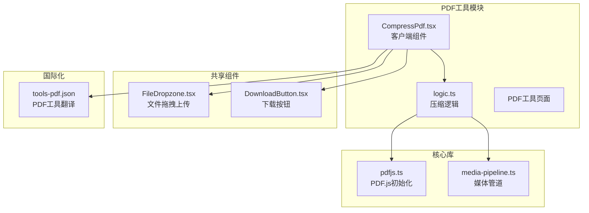
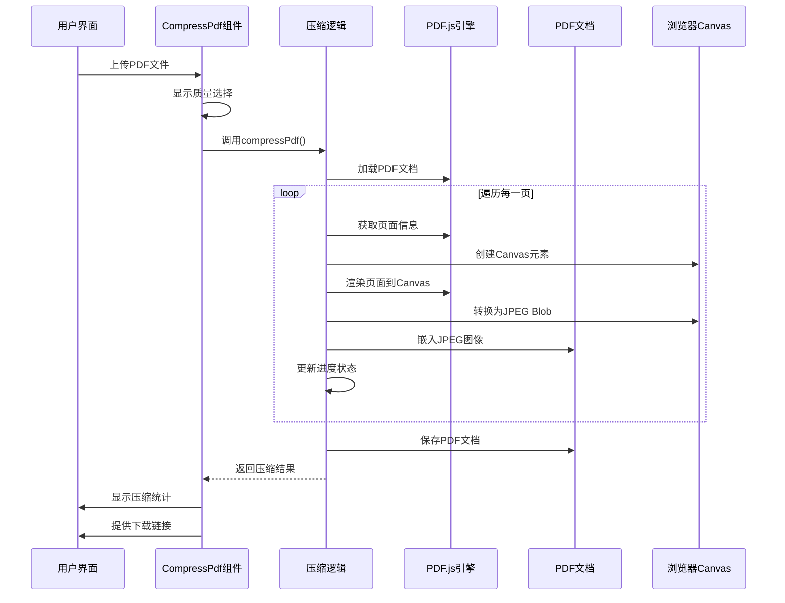
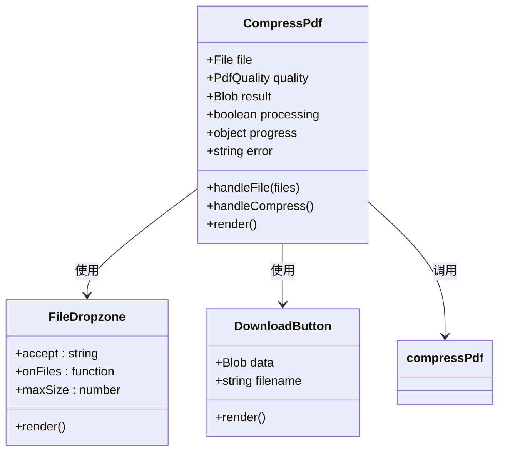
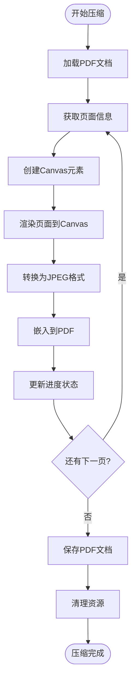
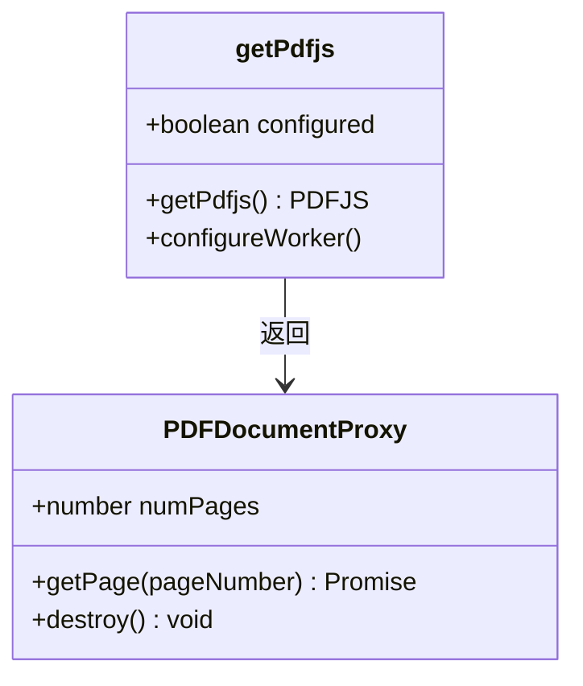
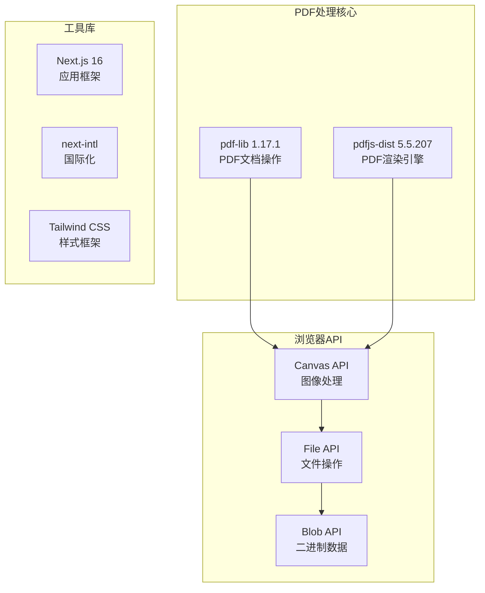

# PDF压缩工具

<cite>
**本文档引用的文件**
- [CompressPdf.tsx](file://src/tools/pdf/compress/CompressPdf.tsx)
- [logic.ts](file://src/tools/pdf/compress/logic.ts)
- [pdfjs.ts](file://src/lib/pdfjs.ts)
- [media-pipeline.ts](file://src/lib/media-pipeline.ts)
- [tools-pdf.json](file://messages/en/tools-pdf.json)
- [package.json](file://package.json)
- [README.md](file://README.md)
- [FileDropzone.tsx](file://src/components/shared/FileDropzone.tsx)
- [DownloadButton.tsx](file://src/components/shared/DownloadButton.tsx)
- [index.ts](file://src/lib/registry/index.ts)
</cite>

## 目录
1. [简介](#简介)
2. [项目结构](#项目结构)
3. [核心组件](#核心组件)
4. [架构概览](#架构概览)
5. [详细组件分析](#详细组件分析)
6. [依赖关系分析](#依赖关系分析)
7. [性能考虑](#性能考虑)
8. [故障排除指南](#故障排除指南)
9. [结论](#结论)

## 简介

PDF压缩工具是一个基于浏览器端处理的PDF文件优化解决方案。该工具通过将PDF页面重新渲染为JPEG图像来实现文件大小压缩，支持三种质量级别（高、中、低），并在本地浏览器环境中完成所有处理操作，确保用户隐私和数据安全。

该工具采用现代Web技术栈构建，利用pdfjs-dist进行PDF渲染，pdf-lib进行PDF文档重建，并通过浏览器Canvas API进行图像处理。整个流程完全在客户端执行，无需任何服务器端处理。

## 项目结构

PDF压缩工具位于项目的PDF工具模块中，采用标准的Next.js应用结构：



**图表来源**
- [CompressPdf.tsx:1-131](file://src/tools/pdf/compress/CompressPdf.tsx#L1-L131)
- [logic.ts:1-73](file://src/tools/pdf/compress/logic.ts#L1-L73)
- [pdfjs.ts:1-16](file://src/lib/pdfjs.ts#L1-L16)

**章节来源**
- [README.md:55-78](file://README.md#L55-L78)
- [package.json:11-32](file://package.json#L11-L32)

## 核心组件

### 压缩算法实现

PDF压缩工具的核心算法基于以下原理：
1. **页面重渲染**：使用pdfjs-dist将PDF页面渲染到Canvas元素
2. **图像压缩**：将Canvas内容转换为JPEG格式，使用不同的质量参数
3. **文档重建**：使用pdf-lib将压缩后的图像重新嵌入到新的PDF文档中

### 质量配置系统

工具提供三种预设的质量级别：

| 质量级别 | 缩放比例 | JPEG质量 | 适用场景 |
|---------|---------|---------|---------|
| 高质量 | 1.5 | 0.8 | 需要保持较高视觉质量的文档 |
| 中等质量 | 1.0 | 0.6 | 平衡质量和文件大小的通用场景 |
| 低质量 | 0.75 | 0.4 | 对文件大小敏感但可接受质量损失的场景 |

### 内存管理机制

系统实现了多层内存管理策略：
- **Canvas资源释放**：处理完成后立即将Canvas尺寸重置为0
- **对象URL清理**：下载完成后及时撤销临时URL
- **进度回调机制**：避免长时间阻塞UI线程

**章节来源**
- [logic.ts:6-10](file://src/tools/pdf/compress/logic.ts#L6-L10)
- [logic.ts:45-47](file://src/tools/pdf/compress/logic.ts#L45-L47)

## 架构概览



**图表来源**
- [CompressPdf.tsx:28-45](file://src/tools/pdf/compress/CompressPdf.tsx#L28-L45)
- [logic.ts:12-66](file://src/tools/pdf/compress/logic.ts#L12-L66)

## 详细组件分析

### CompressPdf 组件分析

该组件是PDF压缩工具的用户界面层，负责处理用户交互和状态管理：



**图表来源**
- [CompressPdf.tsx:10-131](file://src/tools/pdf/compress/CompressPdf.tsx#L10-L131)
- [FileDropzone.tsx:42-144](file://src/components/shared/FileDropzone.tsx#L42-L144)
- [DownloadButton.tsx:18-54](file://src/components/shared/DownloadButton.tsx#L18-L54)

### 压缩逻辑实现分析

压缩算法的核心实现具有以下特点：

#### 页面处理流程



**图表来源**
- [logic.ts:24-61](file://src/tools/pdf/compress/logic.ts#L24-L61)

#### 内存优化策略

压缩过程实现了多项内存优化措施：
- **即时Canvas释放**：处理完成后立即重置Canvas尺寸
- **异步处理**：使用Promise和async/await避免阻塞主线程
- **进度回调**：分页处理减少单次内存峰值

**章节来源**
- [logic.ts:12-66](file://src/tools/pdf/compress/logic.ts#L12-L66)

### PDF.js集成分析

PDF.js引擎的初始化和配置：



**图表来源**
- [pdfjs.ts:3-13](file://src/lib/pdfjs.ts#L3-L13)

**章节来源**
- [pdfjs.ts:1-16](file://src/lib/pdfjs.ts#L1-L16)

## 依赖关系分析

### 技术栈依赖

PDF压缩工具依赖于以下核心库：



**图表来源**
- [package.json:25-26](file://package.json#L25-L26)
- [package.json:11-32](file://package.json#L11-L32)

### 工具注册和路由

工具在系统中的注册和发现机制：

```mermaid
flowchart LR
A[工具注册表] --> B[pdfCompress]
B --> C[PDF压缩工具定义]
C --> D[slug: "compress"]
C --> E[category: "pdf"]
C --> F[featured: true]
C --> G[name: "Compress PDF"]
C --> H[description: "Reduce PDF file size"]
```

**图表来源**
- [index.ts:48](file://src/lib/registry/index.ts#L48)

**章节来源**
- [package.json:11-32](file://package.json#L11-L32)
- [index.ts:100-115](file://src/lib/registry/index.ts#L100-L115)

## 性能考虑

### 内存使用优化

PDF压缩工具采用了多层次的内存管理策略：

1. **Canvas资源管理**：每个页面处理完成后立即释放Canvas内存
2. **渐进式处理**：按页面顺序处理，避免同时加载多个大页面
3. **垃圾回收触发**：及时清理临时对象和事件监听器

### 处理速度优化

- **质量级别选择**：根据需求选择合适的质量级别平衡速度和质量
- **并发控制**：避免同时处理过多页面导致内存压力
- **进度反馈**：提供实时进度显示改善用户体验

### 浏览器兼容性

工具针对不同浏览器环境进行了优化：
- 检测Canvas支持情况
- 处理不同浏览器的Canvas实现差异
- 提供降级处理方案

## 故障排除指南

### 常见问题及解决方案

#### 1. 文件过大导致处理失败

**症状**：浏览器提示内存不足或处理超时

**解决方案**：
- 选择较低的质量级别
- 分批处理大型PDF文件
- 关闭其他占用内存的标签页

#### 2. 压缩后文件质量不佳

**症状**：压缩后的PDF图像模糊不清

**解决方案**：
- 选择高质量级别
- 检查原始PDF的分辨率
- 考虑使用专业的PDF优化软件

#### 3. 浏览器兼容性问题

**症状**：某些浏览器无法正常处理PDF

**解决方案**：
- 更新到最新版本的浏览器
- 确保Canvas功能正常
- 尝试使用其他兼容的浏览器

#### 4. 进度条不更新

**症状**：处理过程中进度条卡住不动

**解决方案**：
- 检查浏览器JavaScript是否被禁用
- 刷新页面重新开始处理
- 减少同时运行的标签页数量

### 性能监控指标

| 指标类型 | 正常范围 | 警告阈值 | 异常阈值 |
|---------|---------|---------|---------|
| 处理时间 | < 30秒/页 | < 2分钟/页 | > 5分钟/页 |
| 内存使用 | < 500MB | < 1GB | > 2GB |
| 文件大小 | 压缩率 20-80% | 压缩率 10-90% | 压缩率 > 90% |
| 处理成功率 | 100% | ≥ 95% | < 95% |

**章节来源**
- [tools-pdf.json:450-461](file://messages/en/tools-pdf.json#L450-L461)

## 结论

PDF压缩工具通过巧妙地结合PDF.js和pdf-lib两个核心库，实现了高效的浏览器端PDF压缩解决方案。该工具的主要优势包括：

1. **隐私保护**：所有处理都在本地浏览器中完成，无需上传文件到服务器
2. **灵活性**：提供三种质量级别供用户选择，满足不同需求
3. **性能优化**：采用多层内存管理和渐进式处理策略
4. **用户体验**：提供实时进度反馈和友好的界面设计

该工具特别适用于需要快速减小PDF文件大小的场景，如邮件附件、在线分享和存储优化。通过合理选择质量级别，用户可以在文件大小和视觉质量之间找到最佳平衡点。

未来可以考虑的功能扩展包括：
- 支持更多压缩算法
- 添加批量处理功能
- 提供更精细的质量控制选项
- 增强错误处理和恢复机制