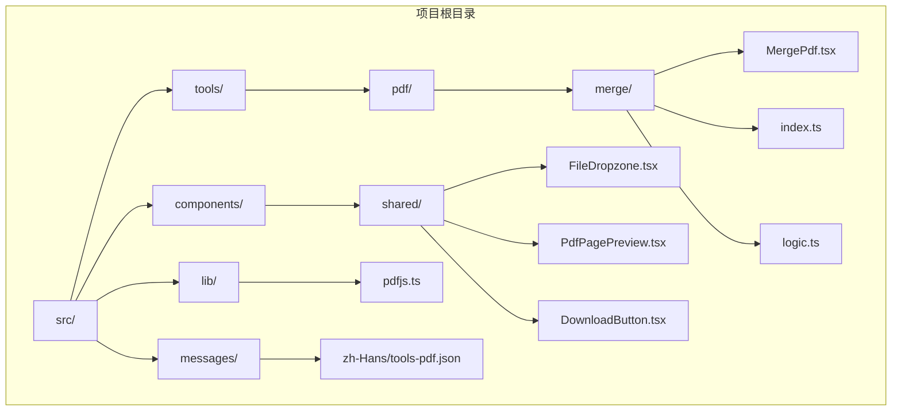
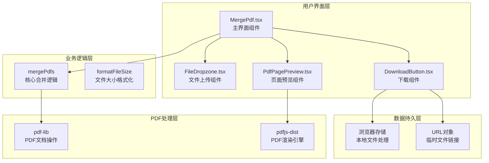
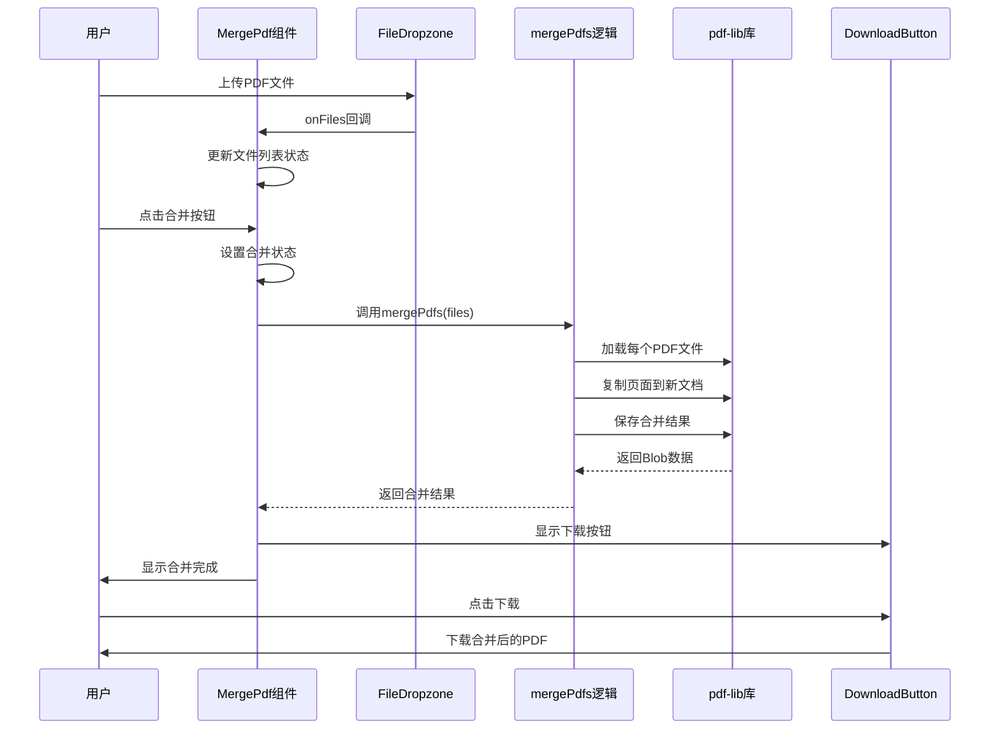
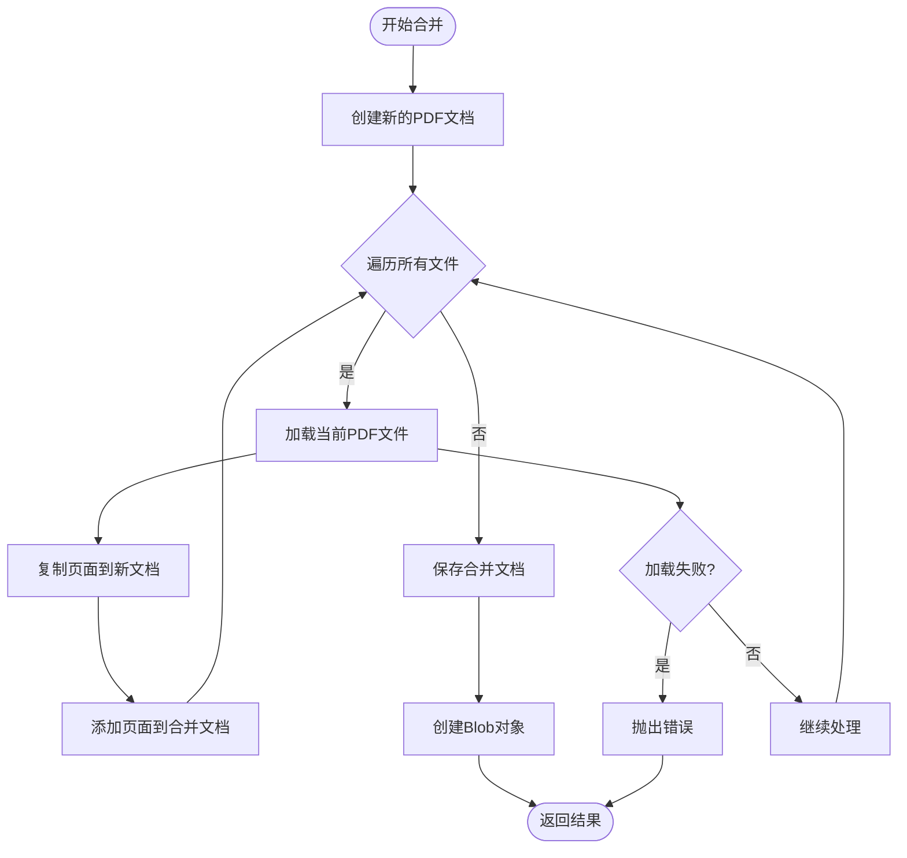
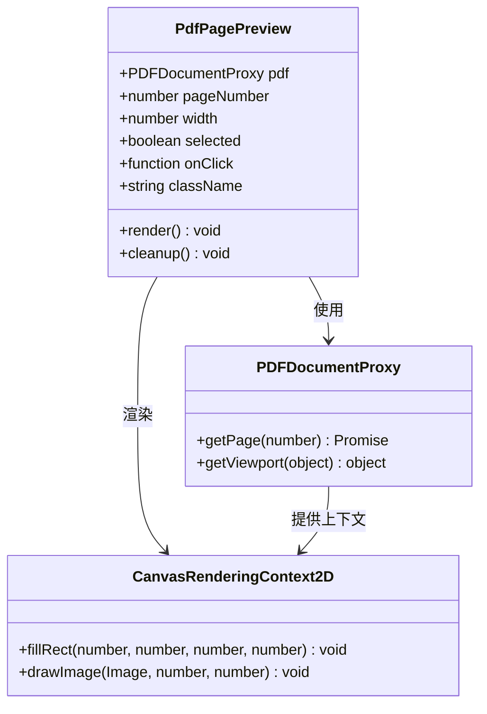
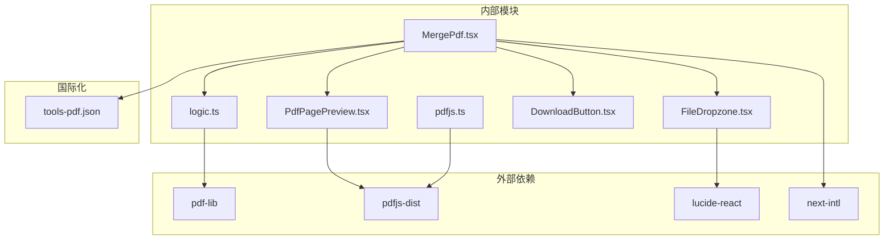
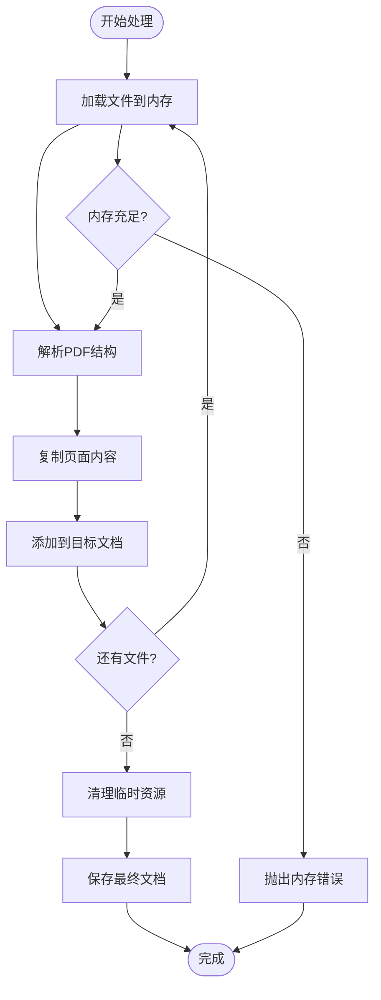
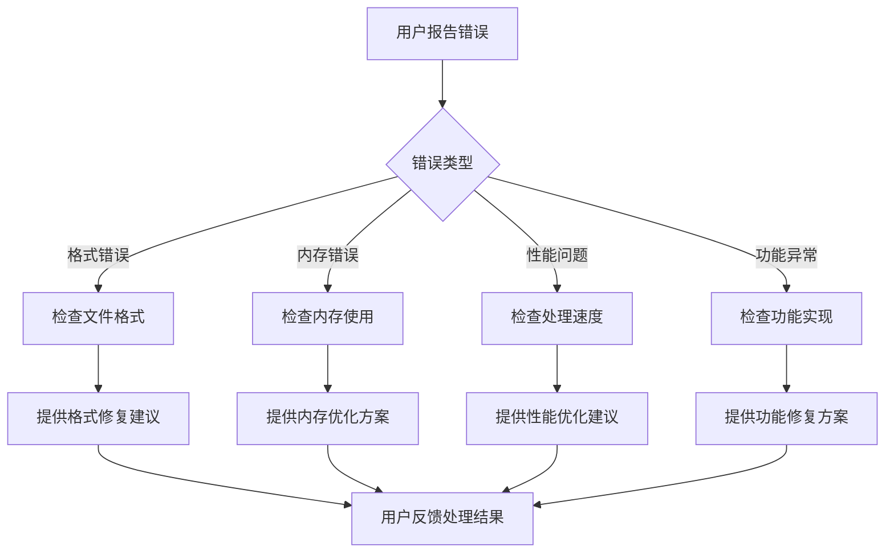

# PDF合并工具

<cite>
**本文档引用的文件**
- [MergePdf.tsx](file://src/tools/pdf/merge/MergePdf.tsx)
- [logic.ts](file://src/tools/pdf/merge/logic.ts)
- [pdfjs.ts](file://src/lib/pdfjs.ts)
- [PdfPagePreview.tsx](file://src/components/shared/PdfPagePreview.tsx)
- [FileDropzone.tsx](file://src/components/shared/FileDropzone.tsx)
- [DownloadButton.tsx](file://src/components/shared/DownloadButton.tsx)
- [tools-pdf.json](file://messages/zh-Hans/tools-pdf.json)
- [README.md](file://README.md)
</cite>

## 目录
1. [简介](#简介)
2. [项目结构](#项目结构)
3. [核心组件](#核心组件)
4. [架构概览](#架构概览)
5. [详细组件分析](#详细组件分析)
6. [依赖关系分析](#依赖关系分析)
7. [性能考虑](#性能考虑)
8. [故障排除指南](#故障排除指南)
9. [结论](#结论)
10. [附录](#附录)

## 简介

PDF合并工具是一个基于浏览器的PDF处理工具，允许用户将多个PDF文件合并为一个文档。该工具完全在本地浏览器环境中运行，无需上传文件到服务器，确保了用户隐私和数据安全。

该工具采用现代化的前端技术栈，包括Next.js 16、TypeScript、Tailwind CSS和pdf-lib库，提供了直观的用户界面和强大的PDF处理功能。所有处理过程都在用户的浏览器中完成，文件永远不会离开用户的设备。

## 项目结构

PDF合并工具位于媒体工具箱项目中，该项目是一个综合性的浏览器端多媒体处理工具集合。PDF工具模块遵循统一的架构模式，包含工具定义、客户端组件和业务逻辑分离的设计。



**图表来源**
- [README.md:55-78](file://README.md#L55-L78)
- [MergePdf.tsx:1-126](file://src/tools/pdf/merge/MergePdf.tsx#L1-L126)

**章节来源**
- [README.md:55-78](file://README.md#L55-L78)
- [MergePdf.tsx:1-126](file://src/tools/pdf/merge/MergePdf.tsx#L1-L126)

## 核心组件

PDF合并工具的核心由以下关键组件构成：

### 主要组件职责
- **MergePdf组件**: 用户界面控制器，处理文件上传、页面重组和结果下载
- **mergePdfs函数**: 核心业务逻辑，实现PDF文件的实际合并操作
- **FileDropzone组件**: 文件拖拽上传界面组件
- **PdfPagePreview组件**: PDF页面预览渲染组件
- **DownloadButton组件**: 文件下载功能组件

### 技术特性
- **隐私保护**: 所有处理在浏览器本地完成，无服务器上传
- **格式兼容**: 支持标准PDF格式，保持原始内容质量
- **内存优化**: 采用流式处理和分步加载策略
- **用户友好**: 提供直观的拖拽排序和实时预览功能

**章节来源**
- [MergePdf.tsx:11-126](file://src/tools/pdf/merge/MergePdf.tsx#L11-L126)
- [logic.ts:1-24](file://src/tools/pdf/merge/logic.ts#L1-L24)

## 架构概览

PDF合并工具采用分层架构设计，实现了清晰的关注点分离：



**图表来源**
- [MergePdf.tsx:1-126](file://src/tools/pdf/merge/MergePdf.tsx#L1-L126)
- [logic.ts:1-24](file://src/tools/pdf/merge/logic.ts#L1-L24)
- [pdfjs.ts:1-16](file://src/lib/pdfjs.ts#L1-L16)

## 详细组件分析

### MergePdf 主界面组件

MergePdf组件是PDF合并工具的用户交互核心，负责管理整个合并流程：



**图表来源**
- [MergePdf.tsx:18-32](file://src/tools/pdf/merge/MergePdf.tsx#L18-L32)
- [logic.ts:3-17](file://src/tools/pdf/merge/logic.ts#L3-L17)

#### 组件状态管理
组件维护以下关键状态：
- `files`: 用户选择的PDF文件数组
- `result`: 合并后的PDF Blob对象
- `merging`: 合并操作进行中的状态标志
- `error`: 错误信息存储

#### 文件操作功能
- **文件上传**: 支持拖拽和点击两种上传方式
- **文件移除**: 允许用户移除不需要的文件
- **文件排序**: 通过拖拽调整文件合并顺序
- **批量处理**: 支持同时处理多个PDF文件

**章节来源**
- [MergePdf.tsx:11-126](file://src/tools/pdf/merge/MergePdf.tsx#L11-L126)

### mergePdfs 核心逻辑

mergePdfs函数实现了PDF文件的合并算法，是整个工具的核心：



**图表来源**
- [logic.ts:3-17](file://src/tools/pdf/merge/logic.ts#L3-L17)

#### 算法实现细节
1. **文档创建**: 使用pdf-lib创建新的PDF文档实例
2. **文件遍历**: 依次处理每个输入的PDF文件
3. **页面复制**: 将源PDF中的所有页面复制到目标文档
4. **页面重组**: 按照输入文件的顺序添加页面
5. **结果保存**: 将合并后的文档保存为二进制数据

#### 数据处理流程
- **文件读取**: 将每个PDF文件转换为ArrayBuffer
- **文档解析**: 使用pdf-lib解析PDF文件结构
- **页面提取**: 获取源文档的所有页面索引
- **页面复制**: 复制页面内容和格式信息
- **页面粘贴**: 将页面添加到目标文档末尾

**章节来源**
- [logic.ts:1-24](file://src/tools/pdf/merge/logic.ts#L1-L24)

### PdfPagePreview 页面预览组件

PdfPagePreview组件提供了PDF页面的可视化预览功能：



**图表来源**
- [PdfPagePreview.tsx:7-23](file://src/components/shared/PdfPagePreview.tsx#L7-L23)
- [PdfPagePreview.tsx:16-52](file://src/components/shared/PdfPagePreview.tsx#L16-L52)

#### 渲染机制
组件采用渐进式渲染策略：
1. **页面获取**: 从PDF文档中获取指定页码的页面对象
2. **视口计算**: 计算合适的缩放比例以适应容器宽度
3. **画布设置**: 配置Canvas元素的尺寸和上下文
4. **页面渲染**: 使用pdfjs-dist引擎渲染页面到Canvas
5. **结果展示**: 将渲染结果作为页面预览显示

#### 性能优化
- **取消机制**: 支持组件卸载时取消正在进行的渲染任务
- **缓存策略**: 避免重复渲染相同页面
- **异步处理**: 使用Promise链处理异步渲染操作

**章节来源**
- [PdfPagePreview.tsx:1-80](file://src/components/shared/PdfPagePreview.tsx#L1-L80)

### FileDropzone 文件上传组件

FileDropzone组件提供了直观的文件拖拽上传界面：

```mermaid
stateDiagram-v2
[*] --> Idle : 初始状态
Idle --> DragOver : 拖拽进入
DragOver --> DragOver : 拖拽移动
DragOver --> Idle : 拖拽离开
DragOver --> Drop : 文件释放
Drop --> Processing : 处理文件
Processing --> Idle : 处理完成
Idle --> Click : 点击触发
Click --> HiddenInput : 显示文件选择对话框
HiddenInput --> Processing : 用户选择文件
Processing --> Idle : 文件处理完成
```

**图表来源**
- [FileDropzone.tsx:50-76](file://src/components/shared/FileDropzone.tsx#L50-L76)

#### 交互功能
- **拖拽支持**: 支持文件拖拽到指定区域
- **点击上传**: 提供传统的文件选择按钮
- **格式验证**: 验证上传文件的类型和大小
- **进度反馈**: 提供视觉反馈指示当前状态

#### 错误处理
- **类型过滤**: 自动过滤不支持的文件类型
- **大小限制**: 支持设置文件大小上限
- **用户提示**: 提供清晰的错误信息和使用指导

**章节来源**
- [FileDropzone.tsx:1-144](file://src/components/shared/FileDropzone.tsx#L1-L144)

## 依赖关系分析

PDF合并工具的依赖关系体现了清晰的模块化设计：



**图表来源**
- [MergePdf.tsx:5-9](file://src/tools/pdf/merge/MergePdf.tsx#L5-L9)
- [logic.ts:1](file://src/tools/pdf/merge/logic.ts#L1)
- [pdfjs.ts:3-12](file://src/lib/pdfjs.ts#L3-L12)

### 核心依赖分析

#### pdf-lib库
- **作用**: PDF文档创建、修改和保存的核心库
- **功能**: 页面复制、文档合并、格式保持
- **优势**: 浏览器端运行，无需服务器支持

#### pdfjs-dist库
- **作用**: PDF渲染和页面预览的渲染引擎
- **功能**: 页面渲染、视口计算、Canvas绘制
- **优势**: 高精度渲染，支持复杂PDF内容

#### 国际化支持
- **next-intl**: 多语言支持框架
- **tools-pdf.json**: PDF工具专用翻译资源
- **覆盖语言**: 21种语言的完整支持

**章节来源**
- [README.md:32](file://README.md#L32)
- [tools-pdf.json:1-681](file://messages/zh-Hans/tools-pdf.json#L1-L681)

## 性能考虑

PDF合并工具在设计时充分考虑了性能优化，特别是在浏览器环境中的内存管理和处理效率：

### 内存管理策略



#### 内存优化技术
1. **流式处理**: 采用逐步处理而非一次性加载所有文件
2. **及时释放**: 处理完成后立即释放中间变量占用的内存
3. **错误恢复**: 在内存不足时优雅降级并提供用户反馈

#### 性能监控
- **处理时间**: 实时显示合并进度和预计完成时间
- **内存使用**: 监控内存占用情况，避免浏览器警告
- **错误预防**: 预先检查文件格式和大小限制

### 处理效率优化

#### 并行处理
- **文件加载**: 多个PDF文件可以并行加载和解析
- **页面渲染**: 页面预览采用异步渲染机制
- **用户交互**: 保持界面响应性，避免阻塞主线程

#### 缓存策略
- **Worker配置**: pdfjs-dist的Web Worker只初始化一次
- **组件缓存**: 预览组件的状态和渲染结果进行缓存
- **配置复用**: 共享的工具配置和设置

## 故障排除指南

PDF合并工具可能遇到的各种问题及其解决方案：

### 常见问题及解决方案

#### PDF文件格式问题
**问题**: 上传的文件不是有效的PDF格式
**解决方案**: 
- 检查文件扩展名是否为.pdf
- 验证文件头部标识符
- 确认文件未被损坏或加密

#### 内存不足问题
**问题**: 处理大型PDF文件时出现内存警告
**解决方案**:
- 分批处理大型文件
- 关闭其他浏览器标签页释放内存
- 使用64位浏览器版本
- 考虑文件压缩后再合并

#### 页面方向不匹配
**问题**: 合并后的PDF页面方向不一致
**解决方案**:
- 使用旋转工具统一页面方向
- 在合并前检查每个PDF的页面属性
- 手动调整页面顺序以优化阅读体验

#### 字体缺失问题
**问题**: 合并后的PDF缺少特殊字体
**解决方案**:
- 确保源PDF使用标准字体
- 预先嵌入必要的字体到PDF中
- 使用字体替换工具处理缺失字体

#### 图像质量损失
**问题**: 合并过程中的图像质量下降
**解决方案**:
- 避免在合并过程中重新压缩图像
- 使用高质量的源PDF文件
- 考虑使用专门的PDF优化工具

### 错误诊断流程



### 用户支持资源

#### FAQ支持
工具内置了详细的常见问题解答，涵盖：
- 合并工作原理说明
- 文件大小限制说明
- 隐私保护措施介绍
- 离线使用功能说明

#### 技术支持
- **浏览器兼容性**: 支持主流现代浏览器
- **设备适配**: 支持桌面和移动设备
- **网络环境**: 支持离线和在线环境
- **安全保证**: 无服务器上传，数据本地处理

**章节来源**
- [tools-pdf.json:13-24](file://messages/zh-Hans/tools-pdf.json#L13-L24)

## 结论

PDF合并工具是一个设计精良的浏览器端PDF处理解决方案，具有以下突出特点：

### 技术优势
- **隐私保护**: 完全本地处理，无数据泄露风险
- **性能优秀**: 优化的内存管理和异步处理机制
- **用户体验**: 直观的界面设计和流畅的操作体验
- **功能完整**: 支持多种PDF处理场景和需求

### 架构特色
- **模块化设计**: 清晰的组件分离和职责划分
- **可扩展性**: 易于添加新功能和工具
- **国际化支持**: 全面的语言和地区化支持
- **错误处理**: 完善的异常捕获和用户反馈机制

### 应用价值
该工具为个人用户和企业客户提供了安全、高效的PDF合并解决方案，特别适用于需要频繁处理PDF文件的场景，如文档管理、报告整理、文件归档等应用场景。

## 附录

### 使用示例

#### 基本合并操作
1. 打开PDF合并工具页面
2. 通过拖拽或点击选择多个PDF文件
3. 调整文件顺序（可选）
4. 点击"合并"按钮开始处理
5. 下载合并后的PDF文件

#### 高级配置选项
- **批量处理**: 同时处理多个PDF文件
- **页面范围**: 选择特定页面范围进行合并
- **格式控制**: 控制输出PDF的格式和质量
- **预览功能**: 合并前预览结果效果

### 最佳实践建议
- **文件准备**: 合并前检查PDF文件的质量和完整性
- **内存规划**: 根据文件大小合理安排处理批次
- **备份策略**: 处理重要文件前做好备份
- **浏览器优化**: 使用最新版本的现代浏览器