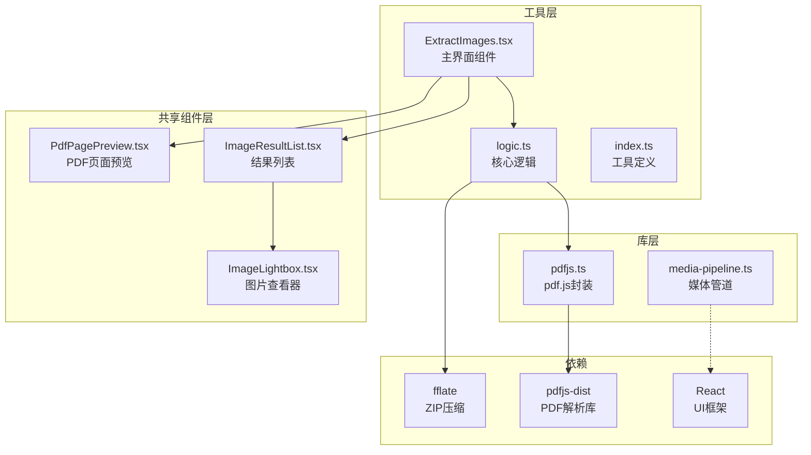
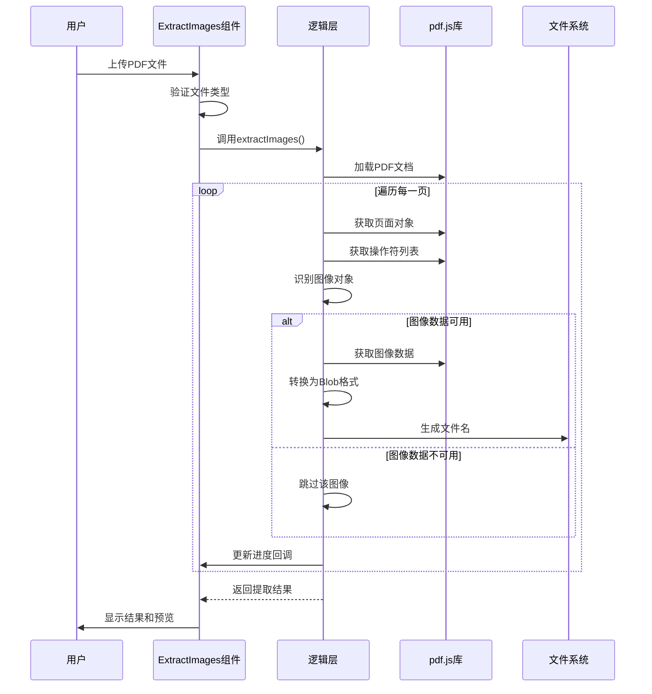
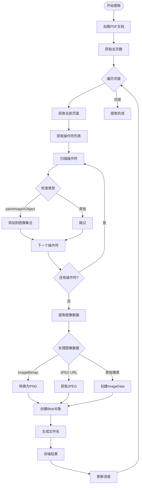
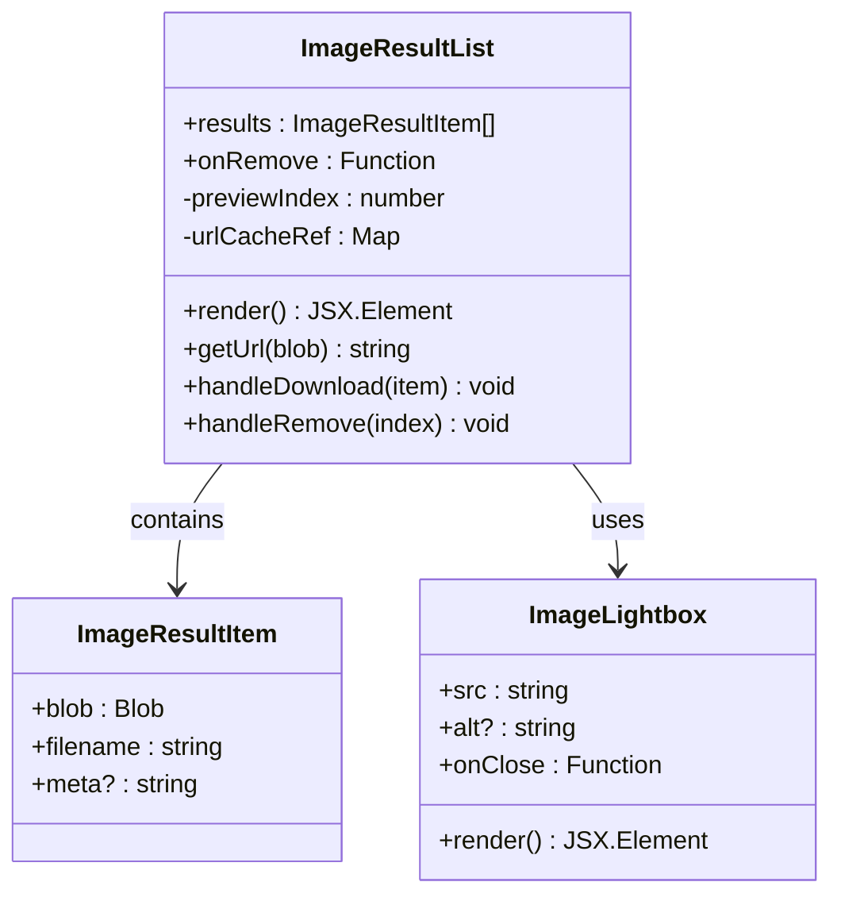
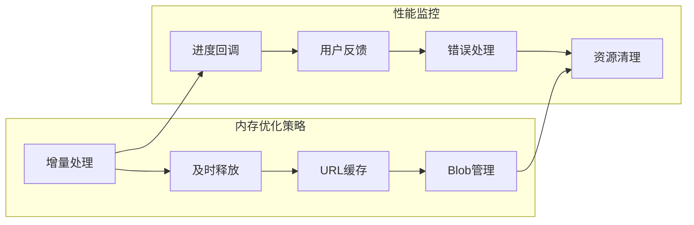

# PDF图像提取工具

<cite>
**本文档引用的文件**
- [ExtractImages.tsx](file://src/tools/pdf/extract-images/ExtractImages.tsx)
- [logic.ts](file://src/tools/pdf/extract-images/logic.ts)
- [pdfjs.ts](file://src/lib/pdfjs.ts)
- [ImageResultList.tsx](file://src/components/shared/ImageResultList.tsx)
- [ImageLightbox.tsx](file://src/components/shared/ImageLightbox.tsx)
- [PdfPagePreview.tsx](file://src/components/shared/PdfPagePreview.tsx)
- [tools-pdf.json](file://messages/en/tools-pdf.json)
- [index.ts](file://src/tools/pdf/extract-images/index.ts)
- [package.json](file://package.json)
</cite>

## 目录
1. [简介](#简介)
2. [项目结构](#项目结构)
3. [核心组件](#核心组件)
4. [架构概览](#架构概览)
5. [详细组件分析](#详细组件分析)
6. [依赖关系分析](#依赖关系分析)
7. [性能考虑](#性能考虑)
8. [故障排除指南](#故障排除指南)
9. [结论](#结论)
10. [附录](#附录)

## 简介

PDF图像提取工具是一个基于浏览器的PDF图像提取解决方案，专门设计用于从PDF文档中识别和提取嵌入的图像。该工具利用Mozilla的pdf.js库进行PDF解析和图像提取，支持多种图像格式（JPEG和PNG），并提供完整的用户界面来预览、管理和下载提取的图像。

该工具的核心特性包括：
- 自动检测PDF中的嵌入图像
- 支持多种图像格式（JPEG原生支持，其他格式转换为PNG）
- 实时进度跟踪和可视化反馈
- 批量图像下载功能
- 图像预览和缩略图显示
- 内存友好的处理机制

## 项目结构

PDF图像提取工具采用模块化架构，主要由以下组件构成：



**图表来源**
- [ExtractImages.tsx:1-133](file://src/tools/pdf/extract-images/ExtractImages.tsx#L1-L133)
- [logic.ts:1-161](file://src/tools/pdf/extract-images/logic.ts#L1-L161)
- [pdfjs.ts:1-16](file://src/lib/pdfjs.ts#L1-L16)

**章节来源**
- [ExtractImages.tsx:1-133](file://src/tools/pdf/extract-images/ExtractImages.tsx#L1-L133)
- [logic.ts:1-161](file://src/tools/pdf/extract-images/logic.ts#L1-L161)
- [pdfjs.ts:1-16](file://src/lib/pdfjs.ts#L1-L16)

## 核心组件

### 主界面组件 ExtractImages

主界面组件负责处理用户交互和协调各个子组件的工作流程。它提供了文件上传、提取控制、进度显示和结果管理等功能。

**主要功能：**
- 文件拖拽上传和验证
- 提取按钮的状态管理和禁用控制
- 进度条的实时更新
- 错误状态的显示和处理
- 结果列表的渲染和管理

### 核心逻辑组件 logic

核心逻辑组件实现了PDF图像提取的完整算法，包括PDF解析、图像识别、数据转换和格式化等步骤。

**关键特性：**
- 使用pdf.js的getOperatorList方法扫描PDF操作符列表
- 识别paintImageXObject操作符来定位图像对象
- 处理多种图像数据格式（ImageBitmap、JPEG URL、原始像素数据）
- 自动格式转换和文件命名
- 进度回调机制支持实时反馈

### 共享组件系统

工具使用了多个可复用的UI组件来提供一致的用户体验：

- **ImageResultList**: 显示提取的图像结果，支持预览、下载和移除操作
- **ImageLightbox**: 提供全屏图片查看功能
- **PdfPagePreview**: 预览PDF页面内容（用于其他PDF工具）

**章节来源**
- [ExtractImages.tsx:19-133](file://src/tools/pdf/extract-images/ExtractImages.tsx#L19-L133)
- [logic.ts:12-161](file://src/tools/pdf/extract-images/logic.ts#L12-L161)
- [ImageResultList.tsx:1-141](file://src/components/shared/ImageResultList.tsx#L1-L141)

## 架构概览

PDF图像提取工具采用分层架构设计，确保了良好的模块化和可维护性：



**图表来源**
- [ExtractImages.tsx:35-54](file://src/tools/pdf/extract-images/ExtractImages.tsx#L35-L54)
- [logic.ts:25-140](file://src/tools/pdf/extract-images/logic.ts#L25-L140)

该架构的主要优势：
- **解耦设计**: UI层与业务逻辑分离
- **错误隔离**: 单个图像提取失败不影响整体流程
- **进度反馈**: 实时显示处理进度
- **内存管理**: 及时释放不再使用的资源

## 详细组件分析

### 图像提取算法详解

#### 图像识别机制

工具使用pdf.js的高级API来识别PDF中的图像对象：



**图表来源**
- [logic.ts:26-134](file://src/tools/pdf/extract-images/logic.ts#L26-L134)

#### 数据处理流程

工具支持三种主要的图像数据格式：

1. **ImageBitmap路径**（推荐）：直接从pdf.js v5的ImageBitmap对象创建
2. **JPEG URL路径**：从远程JPEG URL获取图像数据
3. **原始像素数据路径**：处理RGB或RGBA像素数据

**章节来源**
- [logic.ts:42-131](file://src/tools/pdf/extract-images/logic.ts#L42-L131)

### 用户界面组件

#### 结果列表组件

ImageResultList组件提供了丰富的图像管理功能：



**图表来源**
- [ImageResultList.tsx:16-141](file://src/components/shared/ImageResultList.tsx#L16-L141)
- [ImageLightbox.tsx:7-60](file://src/components/shared/ImageLightbox.tsx#L7-L60)

**章节来源**
- [ImageResultList.tsx:21-141](file://src/components/shared/ImageResultList.tsx#L21-L141)
- [ImageLightbox.tsx:13-60](file://src/components/shared/ImageLightbox.tsx#L13-L60)

### 性能优化策略

#### 内存管理机制

工具采用了多项内存优化策略来处理大型PDF文件：

1. **及时释放资源**: 在PDF处理完成后调用`pdf.destroy()`释放内存
2. **URL缓存管理**: 使用WeakMap避免内存泄漏
3. **增量处理**: 逐页处理PDF，避免一次性加载所有页面
4. **Blob对象管理**: 合理使用和清理Blob对象

#### 批量处理优化



**章节来源**
- [logic.ts:135-137](file://src/tools/pdf/extract-images/logic.ts#L135-L137)
- [ImageResultList.tsx:26-50](file://src/components/shared/ImageResultList.tsx#L26-L50)

## 依赖关系分析

### 核心依赖库

工具依赖于以下关键库来实现其功能：

```mermaid
graph TB
subgraph "核心库"
PdfjsDist[pdfjs-dist v5.5.207<br/>PDF解析引擎]
Fflate[fflate v0.8.2<br/>ZIP压缩]
React[React 19.2.3<br/>UI框架]
end
subgraph "工具库"
NextIntl[next-intl v4.8.3<br/>国际化]
TailwindCSS[tailwindcss v4<br/>样式框架]
Ffmpeg[@ffmpeg/ffmpeg v0.12.15<br/>多媒体处理]
end
subgraph "应用层"
ExtractImages[ExtractImages.tsx]
Logic[logic.ts]
Components[共享组件]
end
ExtractImages --> PdfjsDist
ExtractImages --> Fflate
ExtractImages --> React
Logic --> PdfjsDist
Logic --> Fflate
Components --> React
Components --> NextIntl
```

**图表来源**
- [package.json:11-32](file://package.json#L11-L32)

### 版本兼容性

工具针对pdf.js v5进行了专门优化，充分利用了新版本的ImageBitmap支持：

- **pdf.js v5**: 主要使用ImageBitmap路径
- **向后兼容**: 支持旧版本的JPEG URL和原始像素数据路径
- **自动降级**: 当ImageBitmap不可用时自动切换到其他路径

**章节来源**
- [package.json:25-26](file://package.json#L25-L26)
- [logic.ts:57-116](file://src/tools/pdf/extract-images/logic.ts#L57-L116)

## 性能考虑

### 处理速度优化

1. **异步处理**: 使用Promise和async/await确保非阻塞操作
2. **并发控制**: 限制同时处理的图像数量
3. **缓存策略**: 缓存已处理的图像URL以提高预览性能
4. **进度反馈**: 实时进度显示提升用户体验

### 内存使用优化

1. **流式处理**: 避免将整个PDF加载到内存中
2. **及时清理**: 处理完成后立即释放临时对象
3. **Blob管理**: 合理使用和清理Blob对象
4. **URL回收**: 使用URL.revokeObjectURL及时回收内存

## 故障排除指南

### 常见问题及解决方案

#### 低分辨率图像问题

**问题描述**: 提取的图像分辨率较低

**可能原因**:
- PDF中嵌入的是低分辨率图像
- 页面缩放比例导致的分辨率损失

**解决方案**:
- 检查源PDF的质量
- 考虑使用PDF转图像工具先提高分辨率

#### 加密PDF处理

**问题描述**: 工具无法处理加密的PDF文件

**解决方案**:
- 该工具不支持密码保护的PDF
- 需要先解除PDF保护再使用此工具

#### 复合页面图像处理

**问题描述**: 复杂页面布局中的图像提取不完整

**可能原因**:
- 图像被其他元素遮挡
- PDF结构复杂导致识别困难

**解决方案**:
- 尝试不同的PDF查看器打开文件
- 检查PDF的页面结构和内容

#### 内存不足问题

**问题描述**: 处理大型PDF时出现内存不足错误

**解决方案**:
- 分批处理大型PDF文件
- 关闭其他占用内存的应用程序
- 增加浏览器的内存限制

**章节来源**
- [tools-pdf.json:643-654](file://messages/en/tools-pdf.json#L643-L654)

## 结论

PDF图像提取工具提供了一个强大而高效的解决方案，专门用于从PDF文档中提取嵌入的图像。该工具具有以下显著优势：

1. **准确性**: 利用专业的pdf.js库确保图像提取的准确性
2. **效率**: 优化的算法和内存管理确保快速处理
3. **易用性**: 直观的用户界面和完整的功能集
4. **可靠性**: 完善的错误处理和进度反馈机制

该工具特别适用于需要从PDF报告、演示文稿或扫描文档中恢复图像资产的场景。通过其模块化设计和优化的性能策略，能够有效处理各种规模的PDF文件，为用户提供流畅的使用体验。

## 附录

### 使用示例

#### 示例1：基本图像提取
1. 上传PDF文件到工具界面
2. 点击"提取图像"按钮
3. 等待进度条完成
4. 预览提取的图像
5. 下载单个或全部图像

#### 示例2：批量处理
1. 准备多个PDF文件
2. 依次处理每个文件
3. 使用ZIP下载功能获取所有图像
4. 组织和管理提取的图像文件

### 配置选项

虽然当前版本没有提供复杂的配置选项，但工具支持以下基本设置：
- 图像格式选择（自动选择最佳格式）
- 文件命名规则（基于PDF名称和页面编号）
- 下载选项（单个下载或批量ZIP）