# PDF处理工具

<cite>
**本文档引用的文件**
- [README.md](file://README.md)
- [index.ts](file://src/lib/registry/index.ts)
- [pdfjs.ts](file://src/lib/pdfjs.ts)
- [media-pipeline.ts](file://src/lib/media-pipeline.ts)
- [page.tsx](file://src/app/[locale]/tools/[category]/[slug]/page.tsx)
- [ToolPageClient.tsx](file://src/app/[locale]/tools/[category]/[slug]/ToolPageClient.tsx)
- [merge/logic.ts](file://src/tools/pdf/merge/logic.ts)
- [split/logic.ts](file://src/tools/pdf/split/logic.ts)
- [compress/logic.ts](file://src/tools/pdf/compress/logic.ts)
- [extract-text/logic.ts](file://src/tools/pdf/extract-text/logic.ts)
- [extract-images/logic.ts](file://src/tools/pdf/extract-images/logic.ts)
- [add-watermark/logic.ts](file://src/tools/pdf/add-watermark/logic.ts)
- [add-page-numbers/logic.ts](file://src/tools/pdf/add-page-numbers/logic.ts)
- [delete-pages/logic.ts](file://src/tools/pdf/delete-pages/logic.ts)
- [crop/logic.ts](file://src/tools/pdf/crop/logic.ts)
- [rotate/logic.ts](file://src/tools/pdf/rotate/logic.ts)
- [rearrange/logic.ts](file://src/tools/pdf/rearrange/logic.ts)
- [images-to-pdf/logic.ts](file://src/tools/pdf/images-to-pdf/logic.ts)
- [to-image/logic.ts](file://src/tools/pdf/to-image/logic.ts)
- [esign/logic.ts](file://src/tools/pdf/esign/logic.ts)
</cite>

## 目录
1. [简介](#简介)
2. [项目结构](#项目结构)
3. [核心组件](#核心组件)
4. [架构概览](#架构概览)
5. [详细组件分析](#详细组件分析)
6. [依赖关系分析](#依赖关系分析)
7. [性能考虑](#性能考虑)
8. [故障排除指南](#故障排除指南)
9. [结论](#结论)

## 简介

PrivaDeck 是一个基于浏览器的多媒体工具箱，所有文件处理均在本地完成，确保用户隐私安全。该项目提供了14个PDF处理工具，涵盖PDF压缩优化、合并拆分、文本提取、图像提取、水印添加、页码添加、页面删除、页面裁剪、页面旋转、页面重新排列、图片转PDF、PDF转图片和电子签名等功能。

该项目采用现代前端技术栈，使用Next.js 16框架、TypeScript语言、Tailwind CSS样式，并通过FFmpeg.wasm、pdf-lib和pdfjs-dist等库实现媒体处理功能。所有处理都在浏览器端完成，文件绝不离开设备，支持PWA安装和离线使用。

## 项目结构

PrivaDeck项目采用模块化的组织方式，PDF工具位于`src/tools/pdf/`目录下，每个工具都有独立的目录结构：

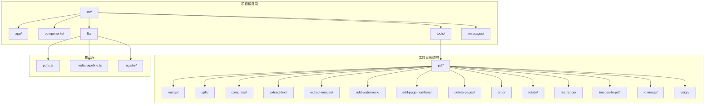

**图表来源**
- [README.md:55-78](file://README.md#L55-L78)
- [index.ts:100-133](file://src/lib/registry/index.ts#L100-L133)

**章节来源**
- [README.md:16-25](file://README.md#L16-L25)
- [README.md:55-78](file://README.md#L55-L78)

## 核心组件

### PDF处理技术栈

项目采用以下核心技术来实现PDF处理功能：

1. **pdf-lib**: 用于PDF文档的创建、修改和保存
2. **pdfjs-dist**: 用于PDF文档的解析、文本提取和图像提取
3. **浏览器Canvas API**: 用于图像渲染和格式转换
4. **FFmpeg.wasm**: 用于视频/音频处理（在PDF工具中主要用于图像处理）

### 工具注册机制

所有PDF工具都通过统一的注册表进行管理，支持动态加载和懒加载：

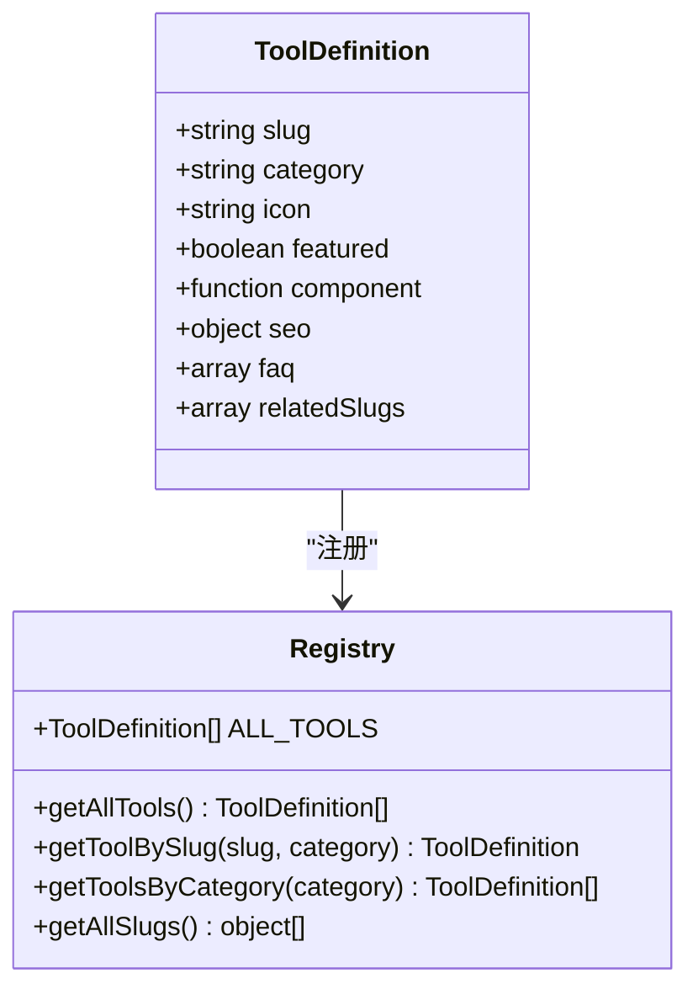

**图表来源**
- [index.ts:100-133](file://src/lib/registry/index.ts#L100-L133)

**章节来源**
- [index.ts:1-164](file://src/lib/registry/index.ts#L1-L164)

## 架构概览

PrivaDeck的PDF处理架构采用分层设计，确保功能模块的独立性和可维护性：

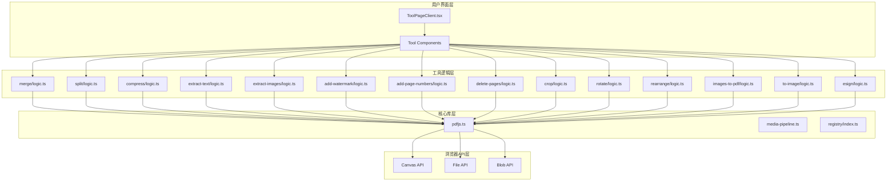

**图表来源**
- [ToolPageClient.tsx:29-58](file://src/app/[locale]/tools/[category]/[slug]/ToolPageClient.tsx#L29-L58)
- [pdfjs.ts:3-13](file://src/lib/pdfjs.ts#L3-L13)

## 详细组件分析

### PDF合并工具 (Merge PDF)

PDF合并工具支持将多个PDF文件合并成一个文件：

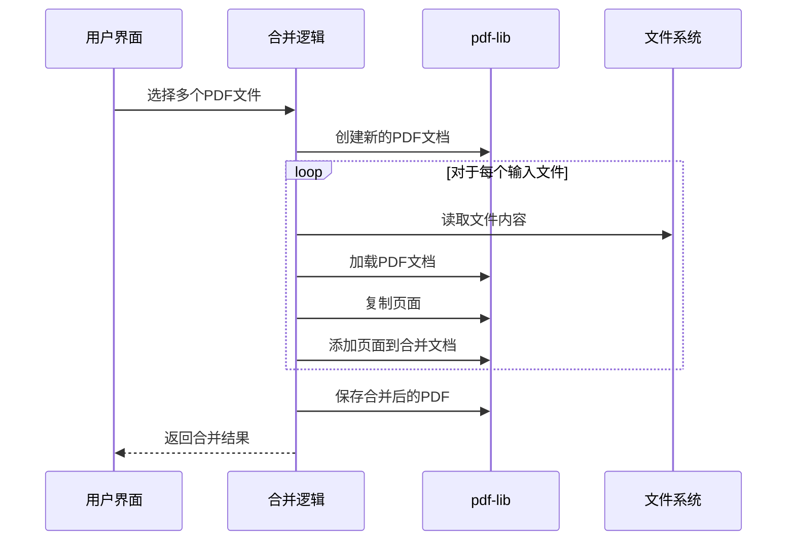

**图表来源**
- [merge/logic.ts:3-17](file://src/tools/pdf/merge/logic.ts#L3-L17)

**章节来源**
- [merge/logic.ts:1-24](file://src/tools/pdf/merge/logic.ts#L1-L24)

### PDF压缩工具 (Compress PDF)

PDF压缩工具通过重新渲染页面来减小文件大小：

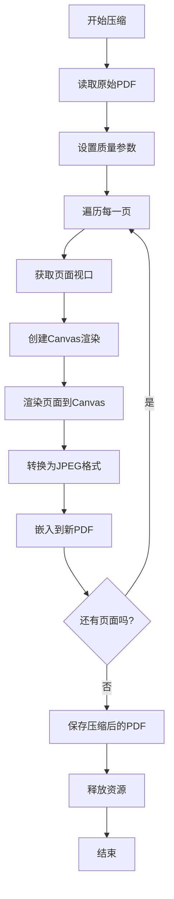

**图表来源**
- [compress/logic.ts:12-66](file://src/tools/pdf/compress/logic.ts#L12-L66)

**章节来源**
- [compress/logic.ts:1-73](file://src/tools/pdf/compress/logic.ts#L1-L73)

### 文本提取工具 (Extract Text)

文本提取工具从PDF中提取可编辑文本内容：

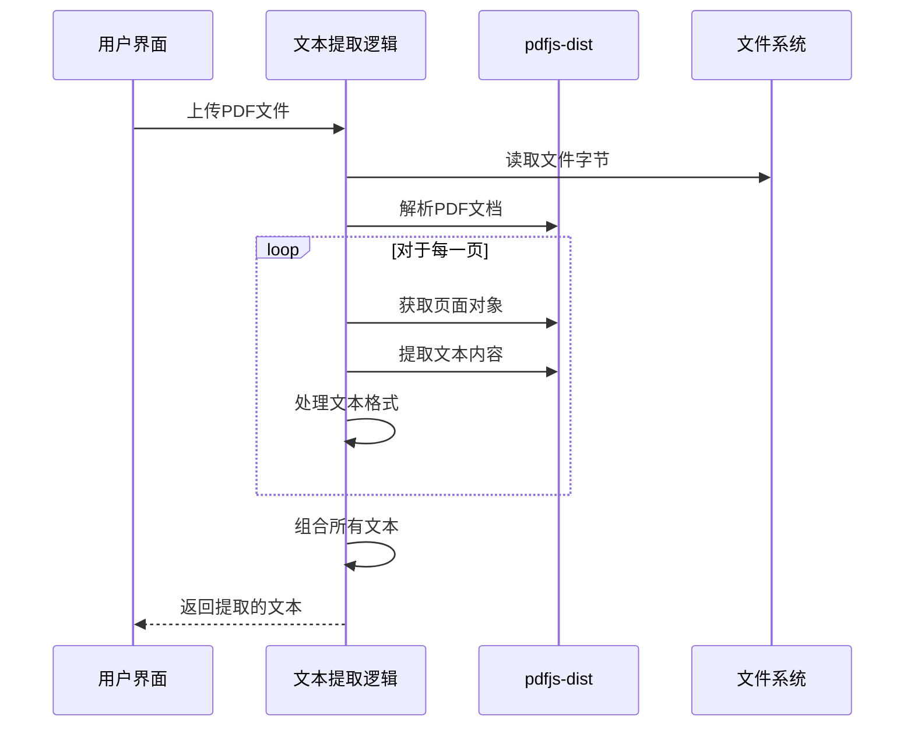

**图表来源**
- [extract-text/logic.ts:3-24](file://src/tools/pdf/extract-text/logic.ts#L3-L24)

**章节来源**
- [extract-text/logic.ts:1-25](file://src/tools/pdf/extract-text/logic.ts#L1-L25)

### 图像提取工具 (Extract Images)

图像提取工具支持从PDF中提取所有图像：

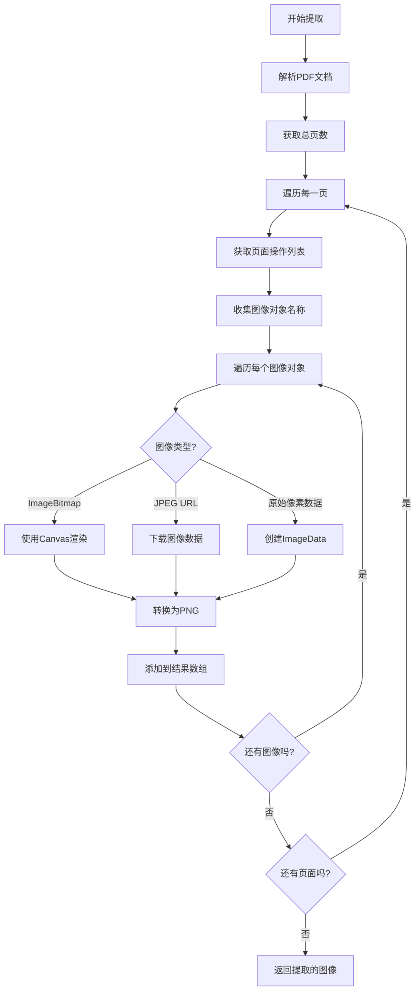

**图表来源**
- [extract-images/logic.ts:12-140](file://src/tools/pdf/extract-images/logic.ts#L12-L140)

**章节来源**
- [extract-images/logic.ts:1-161](file://src/tools/pdf/extract-images/logic.ts#L1-L161)

### 水印添加工具 (Add Watermark)

水印添加工具支持在PDF页面上添加文本或图像水印：

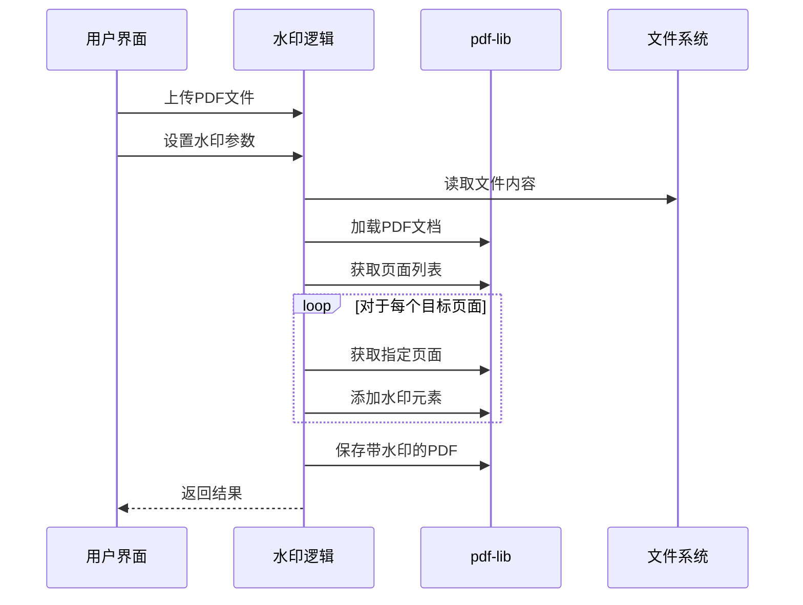

**图表来源**
- [add-watermark/logic.ts:1-40](file://src/tools/pdf/add-watermark/logic.ts#L1-L40)

**章节来源**
- [add-watermark/logic.ts:1-40](file://src/tools/pdf/add-watermark/logic.ts#L1-L40)

### 页码添加工具 (Add Page Numbers)

页码添加工具支持在PDF页面上添加页码：

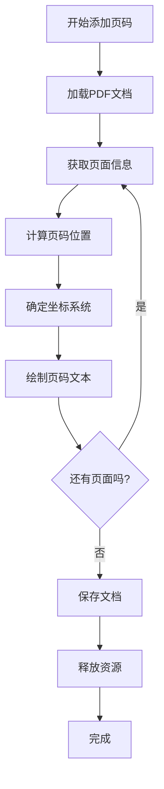

**图表来源**
- [add-page-numbers/logic.ts:50-87](file://src/tools/pdf/add-page-numbers/logic.ts#L50-L87)

**章节来源**
- [add-page-numbers/logic.ts:1-93](file://src/tools/pdf/add-page-numbers/logic.ts#L1-L93)

### 页面删除工具 (Delete Pages)

页面删除工具支持删除指定的PDF页面：

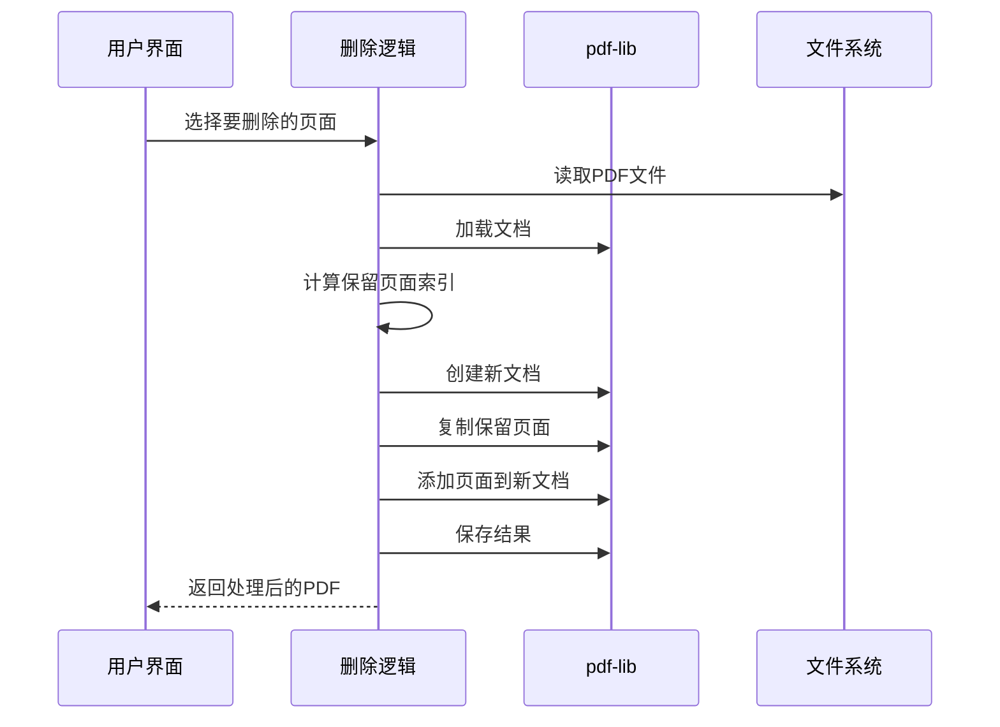

**图表来源**
- [delete-pages/logic.ts:3-26](file://src/tools/pdf/delete-pages/logic.ts#L3-L26)

**章节来源**
- [delete-pages/logic.ts:1-39](file://src/tools/pdf/delete-pages/logic.ts#L1-L39)

### 页面裁剪工具 (Crop Pages)

页面裁剪工具支持按边距裁剪PDF页面：

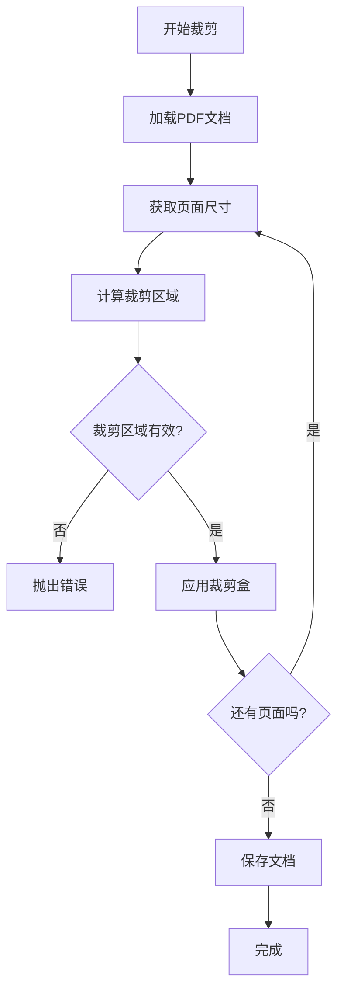

**图表来源**
- [crop/logic.ts:11-33](file://src/tools/pdf/crop/logic.ts#L11-L33)

**章节来源**
- [crop/logic.ts:1-49](file://src/tools/pdf/crop/logic.ts#L1-L49)

### 页面旋转工具 (Rotate Pages)

页面旋转工具支持按角度旋转PDF页面：

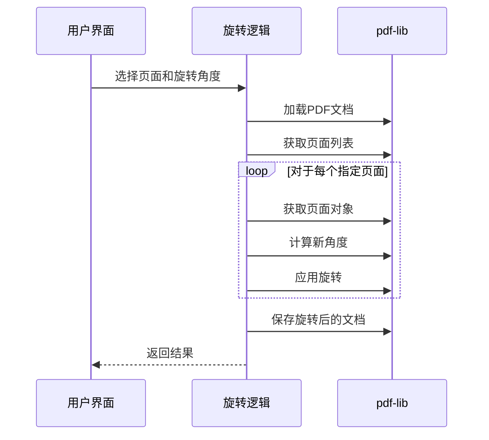

**图表来源**
- [rotate/logic.ts:3-23](file://src/tools/pdf/rotate/logic.ts#L3-L23)

**章节来源**
- [rotate/logic.ts:1-30](file://src/tools/pdf/rotate/logic.ts#L1-L30)

### 页面重新排列工具 (Rearrange Pages)

页面重新排列工具支持重新排序PDF页面：

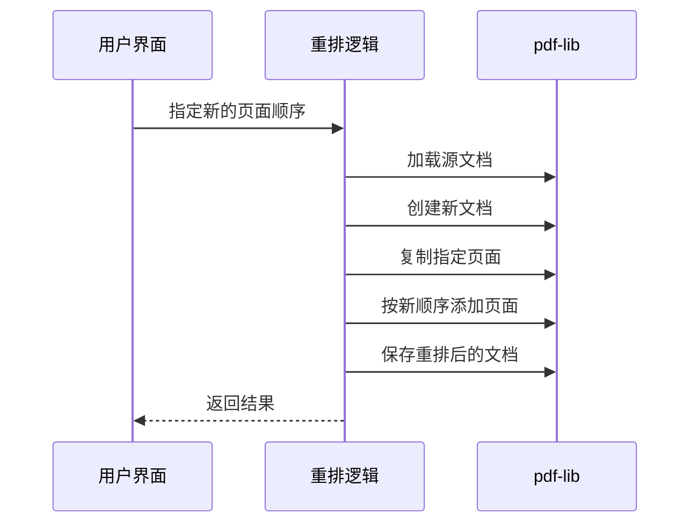

**图表来源**
- [rearrange/logic.ts:3-18](file://src/tools/pdf/rearrange/logic.ts#L3-L18)

**章节来源**
- [rearrange/logic.ts:1-25](file://src/tools/pdf/rearrange/logic.ts#L1-L25)

### 图片转PDF工具 (Images to PDF)

图片转PDF工具支持将图片转换为PDF文档：

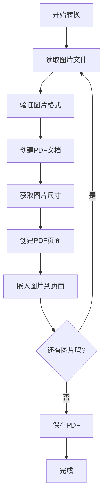

**图表来源**
- [images-to-pdf/logic.ts:1-40](file://src/tools/pdf/images-to-pdf/logic.ts#L1-L40)

**章节来源**
- [images-to-pdf/logic.ts:1-40](file://src/tools/pdf/images-to-pdf/logic.ts#L1-L40)

### PDF转图片工具 (PDF to Image)

PDF转图片工具支持将PDF页面转换为图片：

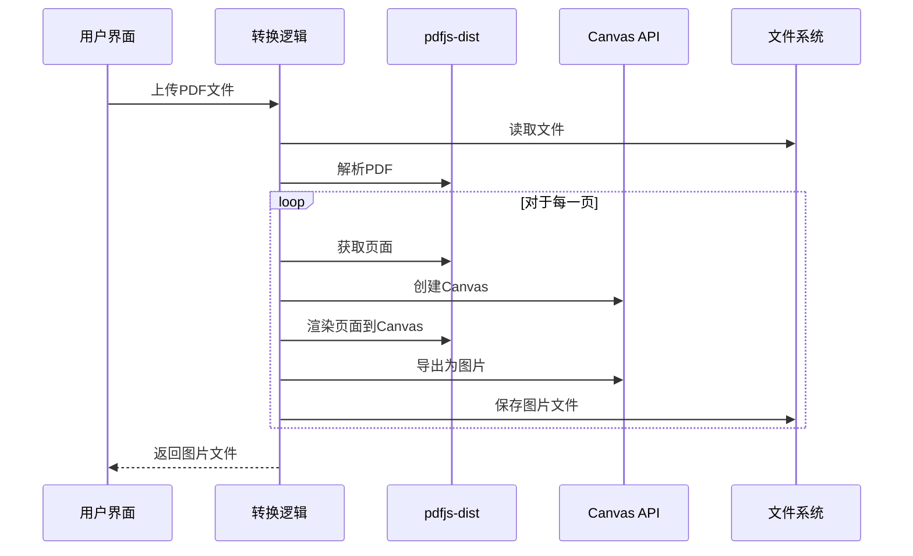

**图表来源**
- [to-image/logic.ts:1-40](file://src/tools/pdf/to-image/logic.ts#L1-L40)

**章节来源**
- [to-image/logic.ts:1-40](file://src/tools/pdf/to-image/logic.ts#L1-L40)

### 电子签名工具 (Electronic Signature)

电子签名工具支持在PDF上添加数字签名：

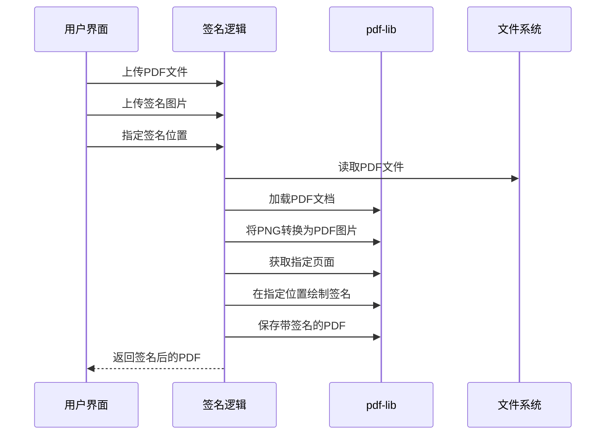

**图表来源**
- [esign/logic.ts:4-40](file://src/tools/pdf/esign/logic.ts#L4-L40)

**章节来源**
- [esign/logic.ts:1-40](file://src/tools/pdf/esign/logic.ts#L1-L40)

## 依赖关系分析

### 核心依赖关系

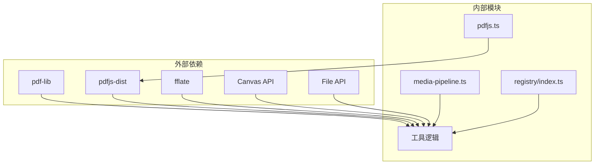

**图表来源**
- [pdfjs.ts:1-16](file://src/lib/pdfjs.ts#L1-L16)
- [media-pipeline.ts:1-105](file://src/lib/media-pipeline.ts#L1-L105)

### 工具间依赖关系

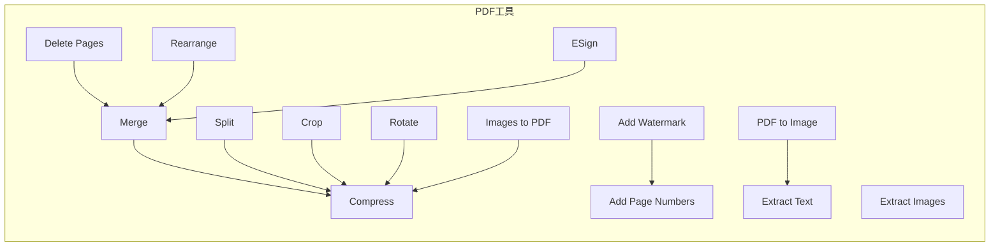

**图表来源**
- [index.ts:100-133](file://src/lib/registry/index.ts#L100-L133)

**章节来源**
- [index.ts:100-133](file://src/lib/registry/index.ts#L100-L133)

## 性能考虑

### 内存管理

PDF处理涉及大量内存操作，项目采用了多种内存管理策略：

1. **及时释放资源**: 所有PDF文档在处理完成后都会被销毁
2. **Canvas内存回收**: 渲染完成后会重置Canvas尺寸以释放GPU内存
3. **渐进式处理**: 支持进度回调，避免长时间阻塞UI

### 并行处理

对于多页PDF文档，项目支持并行处理策略：

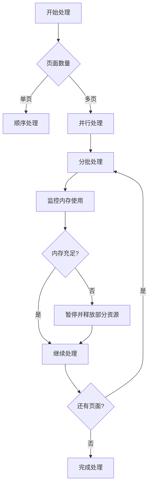

### 缓存策略

项目实现了智能缓存机制：

1. **组件懒加载**: 使用React.lazy实现按需加载
2. **工具注册缓存**: 注册表结果会被缓存
3. **Worker配置缓存**: PDF.js Worker只初始化一次

## 故障排除指南

### 常见问题及解决方案

#### PDF解析失败
- **症状**: 无法打开某些PDF文件
- **原因**: PDF格式不兼容或损坏
- **解决方案**: 检查PDF版本兼容性，尝试修复损坏的文件

#### 内存不足错误
- **症状**: 处理大文件时出现内存警告
- **原因**: PDF页面过多或图像分辨率过高
- **解决方案**: 降低图像质量设置，分批处理大文件

#### 图像提取失败
- **症状**: 图像提取工具无法提取某些图像
- **原因**: 图像编码格式不支持
- **解决方案**: 更新到最新版本，检查PDF中图像的编码格式

#### 水印位置错误
- **症状**: 水印位置与预期不符
- **原因**: 坐标系统理解错误
- **解决方案**: 使用正确的坐标参考系，考虑页面旋转影响

### 调试技巧

1. **启用详细日志**: 使用浏览器开发者工具查看控制台输出
2. **监控内存使用**: 使用性能面板监控内存占用
3. **测试不同PDF**: 准备多种格式的测试PDF文件
4. **检查浏览器兼容性**: 确保目标浏览器支持所需API

**章节来源**
- [pdfjs.ts:1-16](file://src/lib/pdfjs.ts#L1-L16)
- [media-pipeline.ts:32-53](file://src/lib/media-pipeline.ts#L32-L53)

## 结论

PrivaDeck的PDF处理工具箱提供了完整的PDF处理解决方案，具有以下特点：

1. **隐私保护**: 所有处理都在浏览器本地完成，确保用户数据安全
2. **功能完整**: 涵盖了PDF处理的主要需求场景
3. **性能优化**: 采用多种优化策略确保处理效率
4. **易于使用**: 提供直观的用户界面和清晰的操作流程
5. **可扩展性**: 模块化设计便于添加新功能

该工具箱适合个人用户和企业用户的各种PDF处理需求，在保证隐私安全的同时提供了专业的PDF处理能力。通过合理的参数配置和最佳实践，用户可以高效地完成各种PDF处理任务。