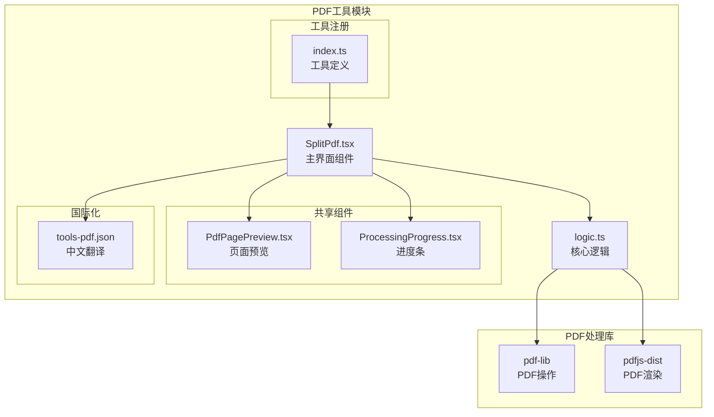
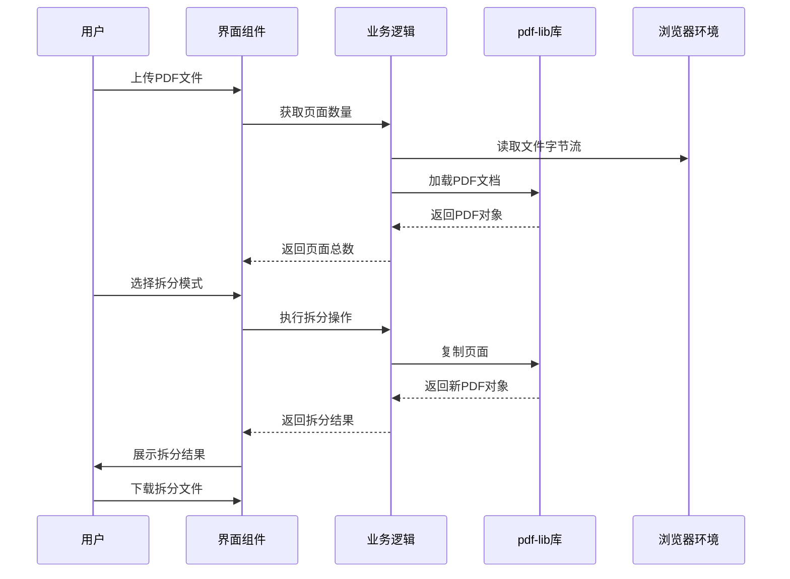
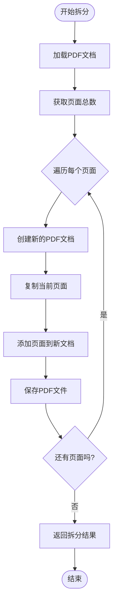
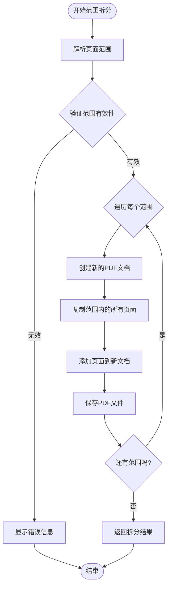
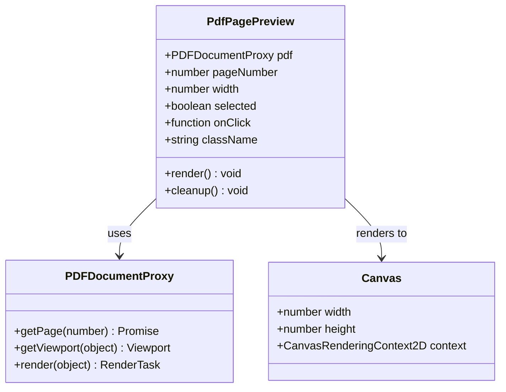
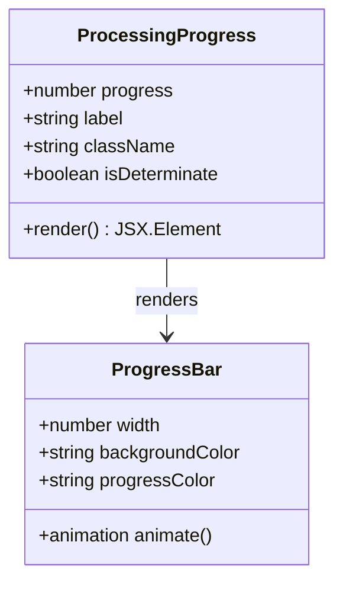
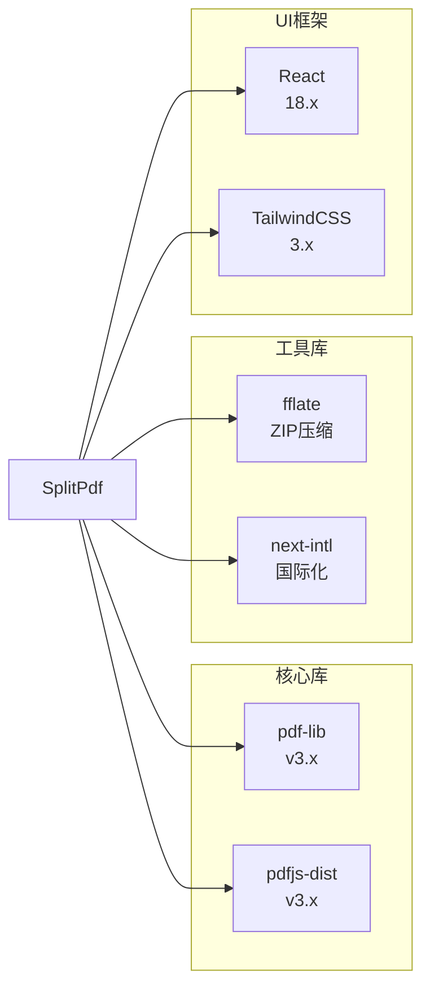
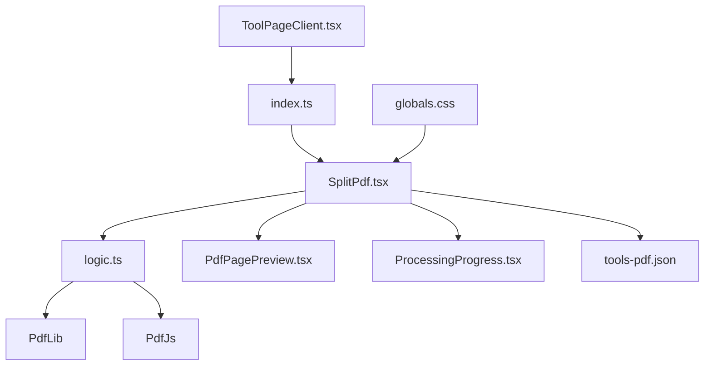
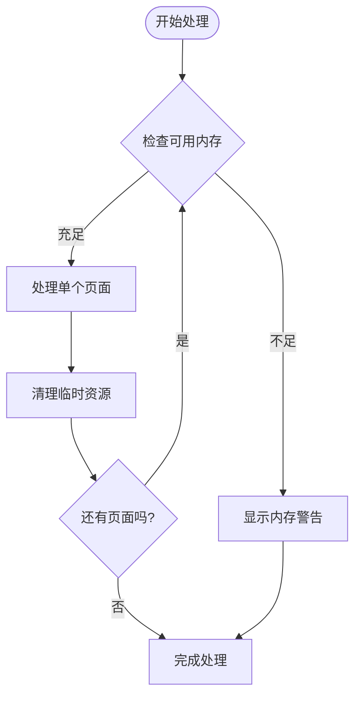
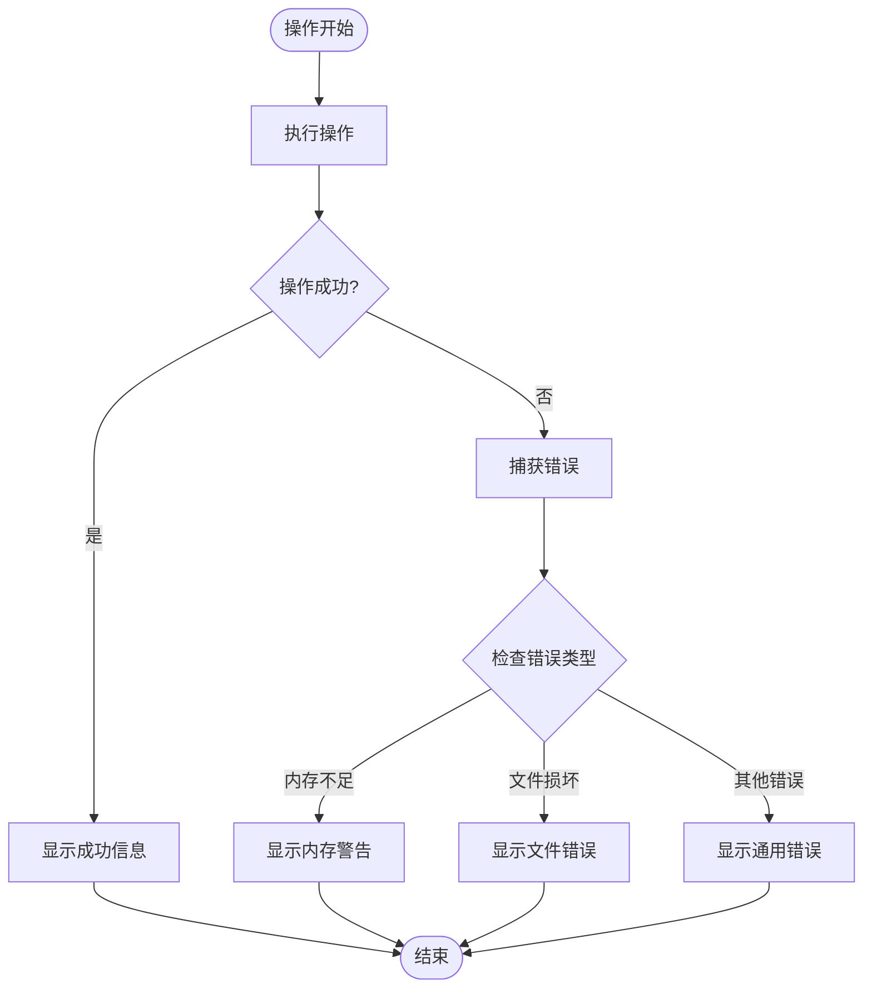

# PDF拆分工具

<cite>
**本文档引用的文件**
- [SplitPdf.tsx](file://src/tools/pdf/split/SplitPdf.tsx)
- [logic.ts](file://src/tools/pdf/split/logic.ts)
- [PdfPagePreview.tsx](file://src/components/shared/PdfPagePreview.tsx)
- [ProcessingProgress.tsx](file://src/components/shared/ProcessingProgress.tsx)
- [pdfjs.ts](file://src/lib/pdfjs.ts)
- [tools-pdf.json](file://messages/zh-Hans/tools-pdf.json)
- [ToolPageClient.tsx](file://src/app/[locale]/tools/[category]/[slug]/ToolPageClient.tsx)
- [index.ts](file://src/tools/pdf/split/index.ts)
- [globals.css](file://src/app/globals.css)
</cite>

## 目录
1. [简介](#简介)
2. [项目结构](#项目结构)
3. [核心组件](#核心组件)
4. [架构概览](#架构概览)
5. [详细组件分析](#详细组件分析)
6. [依赖关系分析](#依赖关系分析)
7. [性能考虑](#性能考虑)
8. [故障排除指南](#故障排除指南)
9. [结论](#结论)

## 简介

PDF拆分工具是一个基于浏览器的PDF处理工具，允许用户将PDF文档拆分为单独的页面或自定义页面范围。该工具完全在浏览器中运行，无需上传文件到服务器，确保用户隐私和数据安全。

该工具提供了两种主要的拆分模式：
- **逐页拆分**：将PDF的每个页面拆分为独立的PDF文件
- **范围拆分**：允许用户指定自定义的页面范围进行拆分

## 项目结构

PDF拆分工具位于项目的PDF工具模块中，采用模块化的设计结构：

**图表来源**
- [SplitPdf.tsx:1-158](file://src/tools/pdf/split/SplitPdf.tsx#L1-L158)
- [logic.ts:1-73](file://src/tools/pdf/split/logic.ts#L1-L73)
- [PdfPagePreview.tsx:1-80](file://src/components/shared/PdfPagePreview.tsx#L1-L80)
- [ProcessingProgress.tsx:1-47](file://src/components/shared/ProcessingProgress.tsx#L1-L47)

**章节来源**
- [SplitPdf.tsx:1-158](file://src/tools/pdf/split/SplitPdf.tsx#L1-L158)
- [logic.ts:1-73](file://src/tools/pdf/split/logic.ts#L1-L73)
- [index.ts:1-36](file://src/tools/pdf/split/index.ts#L1-L36)

## 核心组件

### 主界面组件 (SplitPdf)

主界面组件负责处理用户交互和展示拆分结果。它包含了文件上传、拆分模式选择、范围输入和结果展示等功能。

**主要功能特性：**
- 支持拖拽上传PDF文件
- 实时显示PDF页面总数
- 两种拆分模式切换
- 自定义页面范围输入
- 拆分结果列表展示
- 错误处理和状态管理

### 核心逻辑模块 (logic.ts)

核心逻辑模块实现了PDF拆分的具体算法，使用pdf-lib库进行PDF操作。

**核心函数：**
- `splitByPages()`: 实现逐页拆分功能
- `splitByRange()`: 实现范围拆分功能
- `getPdfPageCount()`: 获取PDF页面数量
- `formatFileSize()`: 格式化文件大小显示

**章节来源**
- [SplitPdf.tsx:18-158](file://src/tools/pdf/split/SplitPdf.tsx#L18-L158)
- [logic.ts:3-73](file://src/tools/pdf/split/logic.ts#L3-L73)

## 架构概览

PDF拆分工具采用分层架构设计，确保了良好的代码组织和可维护性：

**图表来源**
- [SplitPdf.tsx:28-73](file://src/tools/pdf/split/SplitPdf.tsx#L28-L73)
- [logic.ts:9-60](file://src/tools/pdf/split/logic.ts#L9-L60)

## 详细组件分析

### 页面拆分算法

#### 逐页拆分实现

逐页拆分是最基础的拆分模式，将PDF的每个页面分别保存为独立的PDF文件：

**图表来源**
- [logic.ts:9-29](file://src/tools/pdf/split/logic.ts#L9-L29)

#### 范围拆分实现

范围拆分允许用户指定自定义的页面范围进行拆分：

**图表来源**
- [SplitPdf.tsx:37-48](file://src/tools/pdf/split/SplitPdf.tsx#L37-L48)
- [logic.ts:31-60](file://src/tools/pdf/split/logic.ts#L31-L60)

### 页面预览功能

页面预览组件提供了PDF页面的可视化预览功能：

**图表来源**
- [PdfPagePreview.tsx:7-23](file://src/components/shared/PdfPagePreview.tsx#L7-L23)

### 进度跟踪系统

进度跟踪组件提供了实时的处理进度显示：

**图表来源**
- [ProcessingProgress.tsx:6-18](file://src/components/shared/ProcessingProgress.tsx#L6-L18)

**章节来源**
- [PdfPagePreview.tsx:16-80](file://src/components/shared/PdfPagePreview.tsx#L16-L80)
- [ProcessingProgress.tsx:14-47](file://src/components/shared/ProcessingProgress.tsx#L14-L47)

## 依赖关系分析

### 外部依赖

PDF拆分工具依赖以下关键库：

**图表来源**
- [package.json](file://package.json)

### 内部模块依赖

**图表来源**
- [SplitPdf.tsx:8-14](file://src/tools/pdf/split/SplitPdf.tsx#L8-L14)
- [index.ts:3-8](file://src/tools/pdf/split/index.ts#L3-L8)

**章节来源**
- [SplitPdf.tsx:3-14](file://src/tools/pdf/split/SplitPdf.tsx#L3-L14)
- [index.ts:1-36](file://src/tools/pdf/split/index.ts#L1-L36)

## 性能考虑

### 内存管理策略

PDF拆分工具采用了多项内存管理策略来优化性能：

1. **渐进式处理**：每次只处理一个页面，避免同时加载整个PDF文档
2. **及时释放**：在处理完每个页面后立即释放相关资源
3. **Canvas内存回收**：在图像处理完成后重置Canvas尺寸以释放GPU内存

### 性能优化技术

### 处理速度优化

- **异步处理**：使用Promise和async/await确保UI响应性
- **批量操作**：支持一次性处理多个拆分任务
- **缓存机制**：复用已加载的PDF文档对象

## 故障排除指南

### 常见问题及解决方案

#### PDF文件加载失败

**症状**：上传PDF文件后无法获取页面数量
**原因**：文件损坏或格式不支持
**解决方案**：
1. 验证PDF文件完整性
2. 尝试使用其他PDF查看器打开文件
3. 检查文件是否受DRM保护

#### 拆分过程中断

**症状**：拆分过程意外停止
**原因**：内存不足或浏览器限制
**解决方案**：
1. 关闭其他占用内存的标签页
2. 尝试拆分较小的页面范围
3. 在更高性能的设备上重试

#### 页面范围无效

**症状**：输入页面范围后提示错误
**原因**：范围格式不正确或超出PDF页面范围
**解决方案**：
1. 确认页面范围格式为"起始-结束"
2. 检查起始页号不超过PDF总页数
3. 确保结束页号大于等于起始页号

### 错误处理机制

**章节来源**
- [SplitPdf.tsx:67-72](file://src/tools/pdf/split/SplitPdf.tsx#L67-L72)
- [logic.ts:62-66](file://src/tools/pdf/split/logic.ts#L62-L66)

## 结论

PDF拆分工具是一个功能完整、性能优良的浏览器端PDF处理工具。它通过以下特点确保了优秀的用户体验：

**技术优势：**
- 完全本地处理，保障用户隐私
- 基于现代Web技术栈构建
- 优化的内存管理和性能表现
- 直观易用的用户界面

**功能特色：**
- 支持多种拆分模式
- 实时页面预览
- 进度跟踪和状态反馈
- 国际化支持

该工具为用户提供了便捷的PDF拆分解决方案，特别适合需要在浏览器环境中处理PDF文件的场景。通过持续的性能优化和功能扩展，该工具将继续为用户提供更好的服务体验。