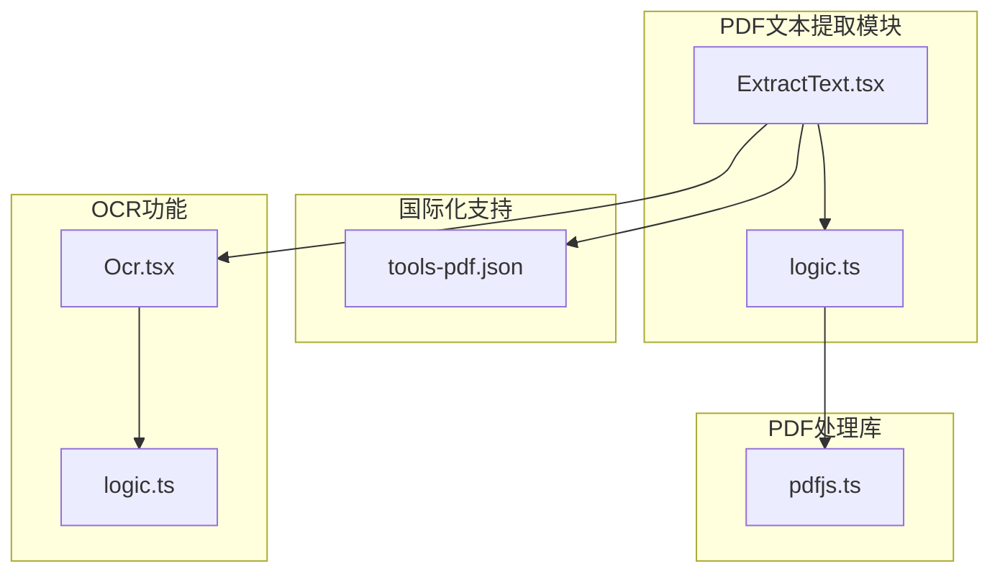
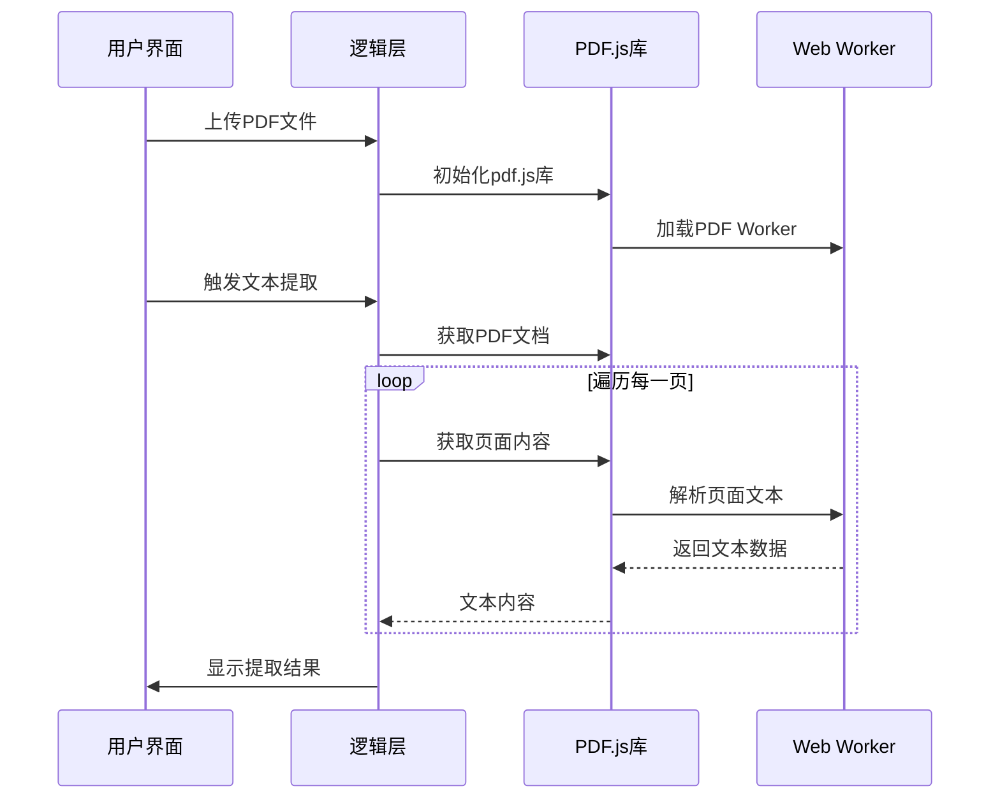
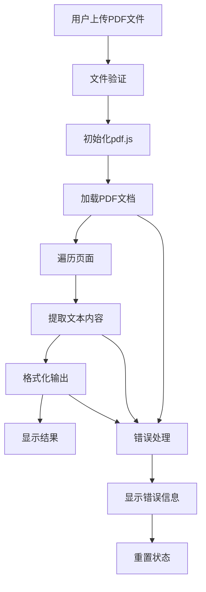
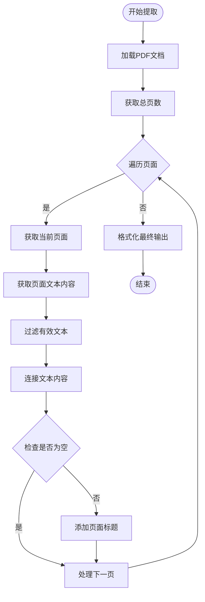
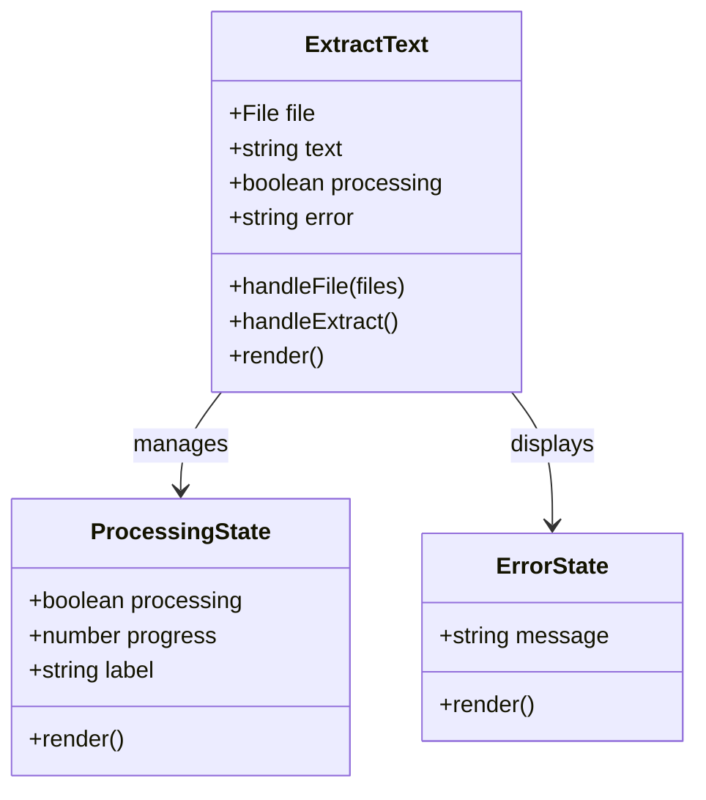
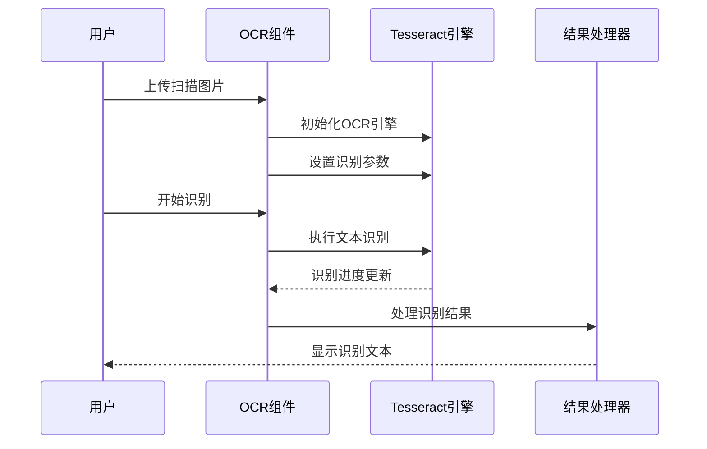
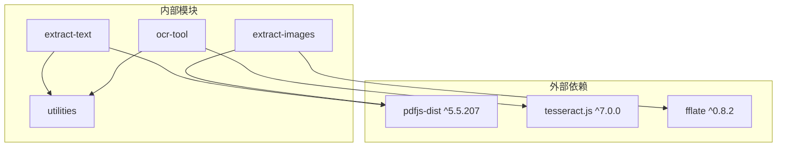
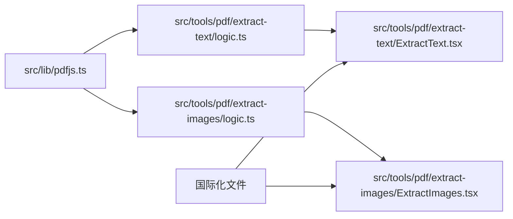
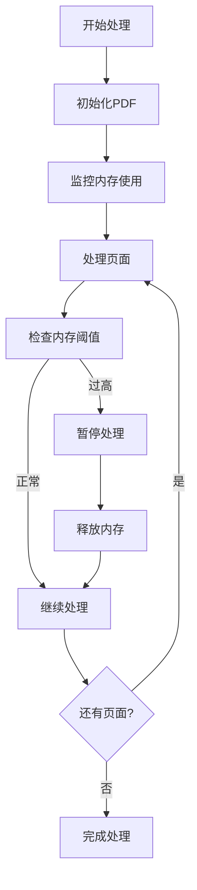
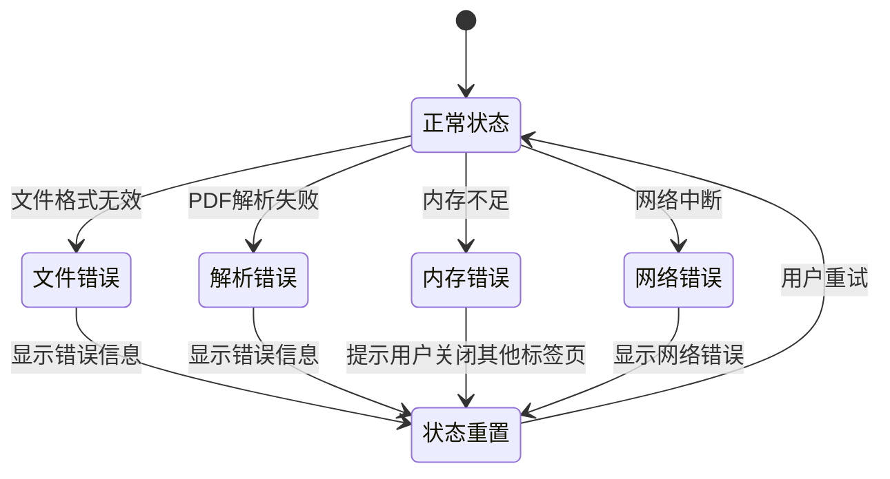

# PDF文本提取工具

<cite>
**本文档引用的文件**
- [src/tools/pdf/extract-text/logic.ts](file://src/tools/pdf/extract-text/logic.ts)
- [src/tools/pdf/extract-text/ExtractText.tsx](file://src/tools/pdf/extract-text/ExtractText.tsx)
- [src/lib/pdfjs.ts](file://src/lib/pdfjs.ts)
- [messages/zh-Hans/tools-pdf.json](file://messages/zh-Hans/tools-pdf.json)
- [src/tools/developer/ocr/Ocr.tsx](file://src/tools/developer/ocr/Ocr.tsx)
- [src/tools/developer/ocr/logic.ts](file://src/tools/developer/ocr/logic.ts)
- [src/tools/pdf/extract-images/logic.ts](file://src/tools/pdf/extract-images/logic.ts)
- [src/components/shared/ProcessingProgress.tsx](file://src/components/shared/ProcessingProgress.tsx)
- [src/components/shared/FFmpegLoadingState.tsx](file://src/components/shared/FFmpegLoadingState.tsx)
- [package.json](file://package.json)
</cite>

## 目录
1. [简介](#简介)
2. [项目结构](#项目结构)
3. [核心组件](#核心组件)
4. [架构概览](#架构概览)
5. [详细组件分析](#详细组件分析)
6. [依赖关系分析](#依赖关系分析)
7. [性能考虑](#性能考虑)
8. [故障排除指南](#故障排除指南)
9. [结论](#结论)

## 简介

PDF文本提取工具是一个基于浏览器的PDF处理工具，专门用于从PDF文档中提取纯文本内容。该工具利用Mozilla的pdf.js库实现PDF解析和文本提取，支持多种PDF格式，包括文本型PDF和扫描版PDF的处理。

该工具的主要特点包括：
- 基于浏览器的纯前端实现，无需服务器处理
- 支持从PDF文档中提取纯文本内容
- 提供用户友好的界面，支持文件拖拽上传
- 实时进度显示和错误处理机制
- 支持大文件处理和性能优化

## 项目结构

该项目采用模块化的React Next.js架构，PDF文本提取功能位于`src/tools/pdf/extract-text/`目录下：

**图表来源**
- [src/tools/pdf/extract-text/ExtractText.tsx:1-77](file://src/tools/pdf/extract-text/ExtractText.tsx#L1-L77)
- [src/tools/pdf/extract-text/logic.ts:1-25](file://src/tools/pdf/extract-text/logic.ts#L1-L25)
- [src/lib/pdfjs.ts:1-16](file://src/lib/pdfjs.ts#L1-L16)

**章节来源**
- [src/tools/pdf/extract-text/ExtractText.tsx:1-77](file://src/tools/pdf/extract-text/ExtractText.tsx#L1-L77)
- [src/tools/pdf/extract-text/logic.ts:1-25](file://src/tools/pdf/extract-text/logic.ts#L1-L25)
- [src/lib/pdfjs.ts:1-16](file://src/lib/pdfjs.ts#L1-L16)

## 核心组件

### 文本提取逻辑组件

文本提取功能的核心实现位于`logic.ts`文件中，该组件负责：
- 加载pdf.js库并配置worker
- 读取PDF文件字节流
- 遍历PDF的每一页
- 提取文本内容并格式化输出

### 用户界面组件

`ExtractText.tsx`提供了完整的用户交互界面，包括：
- 文件拖拽上传区域
- 处理状态显示
- 提取结果展示
- 错误处理和用户反馈

### PDF.js集成层

`pdfjs.ts`文件实现了pdf.js库的懒加载和配置：
- 动态导入pdf.js库
- 配置Web Worker路径
- 提供统一的PDF处理接口

**章节来源**
- [src/tools/pdf/extract-text/logic.ts:1-25](file://src/tools/pdf/extract-text/logic.ts#L1-L25)
- [src/tools/pdf/extract-text/ExtractText.tsx:1-77](file://src/tools/pdf/extract-text/ExtractText.tsx#L1-L77)
- [src/lib/pdfjs.ts:1-16](file://src/lib/pdfjs.ts#L1-L16)

## 架构概览

该PDF文本提取工具采用分层架构设计，确保了良好的可维护性和扩展性：

**图表来源**
- [src/tools/pdf/extract-text/ExtractText.tsx:25-39](file://src/tools/pdf/extract-text/ExtractText.tsx#L25-L39)
- [src/tools/pdf/extract-text/logic.ts:3-24](file://src/tools/pdf/extract-text/logic.ts#L3-L24)
- [src/lib/pdfjs.ts:3-12](file://src/lib/pdfjs.ts#L3-L12)

### 数据流架构

**图表来源**
- [src/tools/pdf/extract-text/ExtractText.tsx:17-39](file://src/tools/pdf/extract-text/ExtractText.tsx#L17-L39)
- [src/tools/pdf/extract-text/logic.ts:9-23](file://src/tools/pdf/extract-text/logic.ts#L9-L23)

## 详细组件分析

### 文本提取算法实现

文本提取功能的核心算法具有以下特点：

#### 文本提取流程

**图表来源**
- [src/tools/pdf/extract-text/logic.ts:9-23](file://src/tools/pdf/extract-text/logic.ts#L9-L23)

#### 文本过滤和格式化

提取算法采用了多层过滤机制：
- 类型检查：确保只处理包含字符串属性的文本项
- 内容验证：过滤空字符串和空白字符
- 格式标准化：统一文本分隔符和换行符

### 用户界面组件分析

#### 状态管理架构

**图表来源**
- [src/tools/pdf/extract-text/ExtractText.tsx:10-77](file://src/tools/pdf/extract-text/ExtractText.tsx#L10-L77)

#### 国际化支持

工具提供了全面的国际化支持，包括：
- 多语言界面文本
- 错误消息本地化
- 用户提示和帮助信息

**章节来源**
- [src/tools/pdf/extract-text/ExtractText.tsx:10-77](file://src/tools/pdf/extract-text/ExtractText.tsx#L10-L77)
- [messages/zh-Hans/tools-pdf.json:340-383](file://messages/zh-Hans/tools-pdf.json#L340-L383)

### OCR集成机制

虽然主要功能是提取PDF中的嵌入文本，但工具也集成了OCR功能来处理扫描版PDF：

#### OCR处理流程

**图表来源**
- [src/tools/developer/ocr/Ocr.tsx:28-42](file://src/tools/developer/ocr/Ocr.tsx#L28-L42)
- [src/tools/developer/ocr/logic.ts:23-40](file://src/tools/developer/ocr/logic.ts#L23-L40)

**章节来源**
- [src/tools/developer/ocr/Ocr.tsx:1-90](file://src/tools/developer/ocr/Ocr.tsx#L1-L90)
- [src/tools/developer/ocr/logic.ts:1-41](file://src/tools/developer/ocr/logic.ts#L1-L41)

## 依赖关系分析

### 核心依赖关系

**图表来源**
- [package.json:11-31](file://package.json#L11-L31)

### 模块间依赖

**图表来源**
- [src/lib/pdfjs.ts:1-16](file://src/lib/pdfjs.ts#L1-L16)
- [src/tools/pdf/extract-text/logic.ts:1-25](file://src/tools/pdf/extract-text/logic.ts#L1-L25)
- [src/tools/pdf/extract-images/logic.ts:1-161](file://src/tools/pdf/extract-images/logic.ts#L1-L161)

**章节来源**
- [package.json:11-31](file://package.json#L11-L31)

## 性能考虑

### 大文件处理优化

该工具针对大文件处理进行了专门优化：

#### 内存管理策略

- **渐进式处理**：逐页处理PDF，避免一次性加载整个文档
- **及时释放**：处理完成后及时销毁PDF对象
- **增量渲染**：文本结果按页增量显示，减少DOM压力

#### 性能监控

### 错误恢复机制

工具实现了多层次的错误处理和恢复机制：

#### 错误分类处理

**章节来源**
- [src/tools/pdf/extract-text/ExtractText.tsx:33-38](file://src/tools/pdf/extract-text/ExtractText.tsx#L33-L38)
- [src/tools/pdf/extract-images/logic.ts:135-137](file://src/tools/pdf/extract-images/logic.ts#L135-L137)

## 故障排除指南

### 常见问题及解决方案

#### 扫描版PDF无法提取文本

**问题描述**：用户上传的扫描版PDF无法提取文本内容。

**解决方案**：
1. 使用OCR工具先进行文字识别
2. 将识别结果复制到文本编辑器中
3. 对于复杂布局的文档，考虑使用专业的OCR软件

#### 大文件处理缓慢

**问题描述**：处理超过100页的大型PDF文档时响应缓慢。

**优化建议**：
1. 关闭其他占用内存的浏览器标签页
2. 使用现代浏览器的最新版本
3. 考虑将大文件分割为较小的文档分别处理

#### 内存不足错误

**问题描述**：处理大型PDF时出现内存不足错误。

**解决方法**：
1. 确保有足够的可用内存（至少2GB）
2. 关闭其他内存密集型应用程序
3. 分批处理超大文档

#### 字体渲染问题

**问题描述**：提取的文本缺少某些特殊字符或符号。

**处理方案**：
1. 检查源PDF的字体嵌入情况
2. 使用支持更多字符集的字体
3. 考虑重新创建PDF以确保字体正确嵌入

**章节来源**
- [messages/zh-Hans/tools-pdf.json:350-361](file://messages/zh-Hans/tools-pdf.json#L350-L361)

### 调试和诊断

#### 开发者工具使用

1. **浏览器开发者工具**：检查网络请求和JavaScript错误
2. **内存分析**：监控内存使用情况，识别内存泄漏
3. **性能分析**：分析处理时间，识别性能瓶颈

#### 日志记录

工具提供了详细的日志记录机制：
- 处理进度跟踪
- 错误信息记录
- 性能指标收集

## 结论

PDF文本提取工具是一个功能完善、用户友好的浏览器端PDF处理工具。其主要优势包括：

### 技术优势

- **纯前端实现**：完全在浏览器中运行，保护用户隐私
- **高效的文本提取**：基于pdf.js的高性能文本解析
- **用户友好界面**：直观的操作界面和实时反馈
- **国际化支持**：支持多种语言的用户界面

### 功能特性

- **准确的文本提取**：能够准确提取PDF中的嵌入文本
- **灵活的处理方式**：支持单页和整页文本提取
- **完善的错误处理**：提供详细的错误信息和恢复机制
- **性能优化**：针对大文件处理进行了专门优化

### 应用场景

该工具适用于各种PDF文本提取需求：
- 学术研究：从PDF论文中提取引用和参考文献
- 商务办公：从合同和报告中提取关键信息
- 教育领域：从教材和课件中提取学习内容
- 个人使用：从各种文档中提取和整理文本信息

### 发展方向

未来可以考虑的功能增强：
- 支持更多PDF格式和特性
- 增强OCR功能以处理扫描版PDF
- 提供文本格式化和导出选项
- 优化大文件处理性能
- 增加批量处理功能

该工具为用户提供了一个安全、高效、易用的PDF文本提取解决方案，满足了现代数字办公的各种需求。