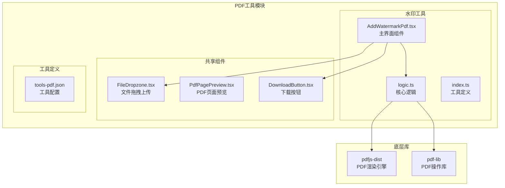
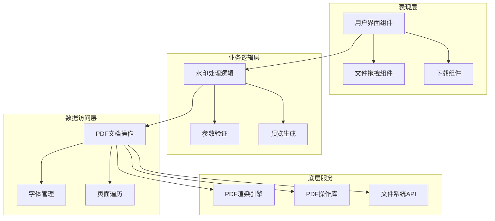
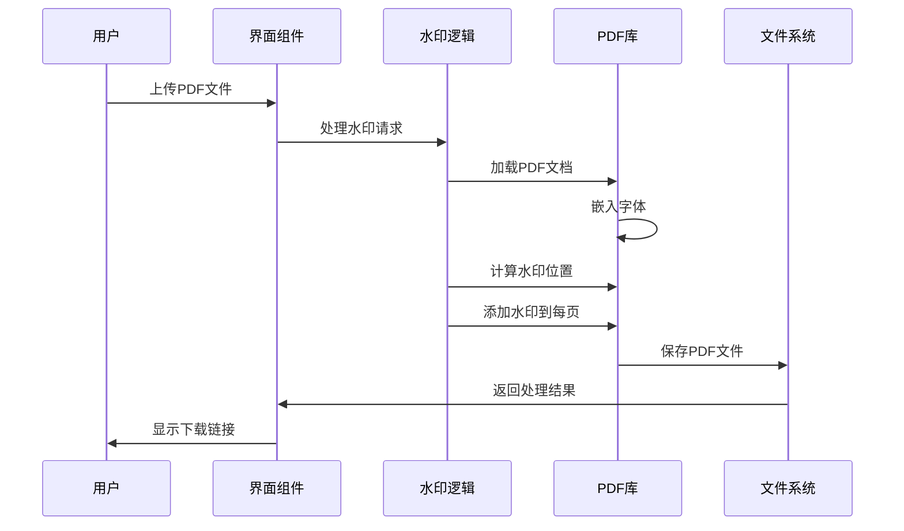
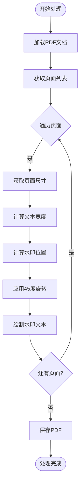
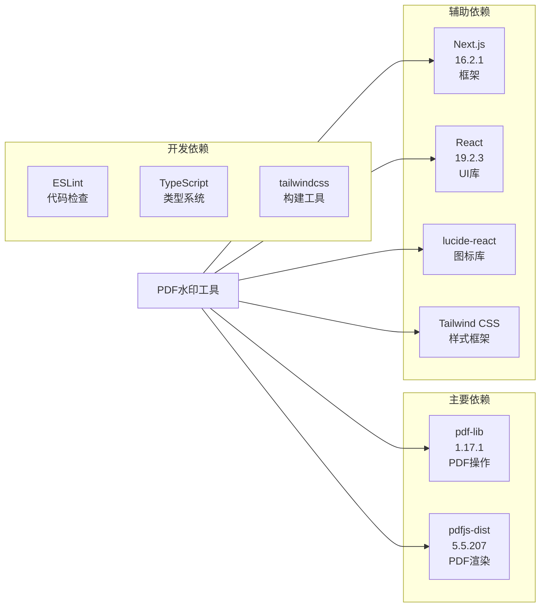
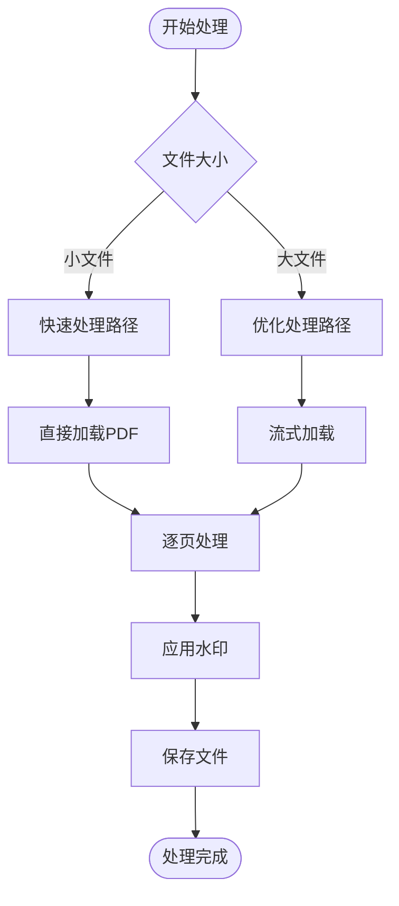
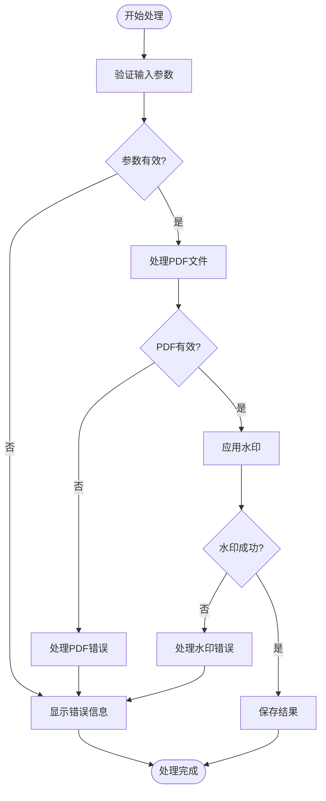

# PDF水印工具

<cite>
**本文档引用的文件**
- [AddWatermarkPdf.tsx](file://src/tools/pdf/add-watermark/AddWatermarkPdf.tsx)
- [logic.ts](file://src/tools/pdf/add-watermark/logic.ts)
- [index.ts](file://src/tools/pdf/add-watermark/index.ts)
- [pdfjs.ts](file://src/lib/pdfjs.ts)
- [media-pipeline.ts](file://src/lib/media-pipeline.ts)
- [tools-pdf.json](file://messages/zh-Hans/tools-pdf.json)
- [PdfPagePreview.tsx](file://src/components/shared/PdfPagePreview.tsx)
- [FileDropzone.tsx](file://src/components/shared/FileDropzone.tsx)
- [DownloadButton.tsx](file://src/components/shared/DownloadButton.tsx)
- [globals.css](file://src/app/globals.css)
- [package.json](file://package.json)
</cite>

## 目录
1. [简介](#简介)
2. [项目结构](#项目结构)
3. [核心组件](#核心组件)
4. [架构概览](#架构概览)
5. [详细组件分析](#详细组件分析)
6. [依赖关系分析](#依赖关系分析)
7. [性能考虑](#性能考虑)
8. [故障排除指南](#故障排除指南)
9. [结论](#结论)

## 简介

PDF水印工具是一个基于浏览器的PDF处理工具，专门用于为PDF文档添加对角线文字水印。该工具采用纯前端技术实现，所有处理过程都在用户的浏览器中完成，确保了数据隐私和安全。

该工具的核心特性包括：
- 支持自定义水印文本、透明度和字号
- 采用经典的对角线水印布局
- 完全在浏览器中处理，无需服务器上传
- 提供实时预览和下载功能
- 支持多种语言界面

## 项目结构

PDF水印工具位于媒体工具箱项目的PDF工具模块中，采用模块化的设计架构：

**图表来源**
- [AddWatermarkPdf.tsx:1-147](file://src/tools/pdf/add-watermark/AddWatermarkPdf.tsx#L1-L147)
- [logic.ts:1-41](file://src/tools/pdf/add-watermark/logic.ts#L1-L41)
- [index.ts:1-37](file://src/tools/pdf/add-watermark/index.ts#L1-L37)

**章节来源**
- [AddWatermarkPdf.tsx:1-147](file://src/tools/pdf/add-watermark/AddWatermarkPdf.tsx#L1-L147)
- [logic.ts:1-41](file://src/tools/pdf/add-watermark/logic.ts#L1-L41)
- [index.ts:1-37](file://src/tools/pdf/add-watermark/index.ts#L1-L37)

## 核心组件

### 主界面组件 (AddWatermarkPdf)

主界面组件负责用户交互和状态管理，提供了完整的水印配置界面：

- **文件上传处理**：支持PDF文件拖拽上传和手动选择
- **水印参数配置**：文本内容、透明度、字号调节
- **实时预览**：处理过程中的状态反馈
- **下载功能**：处理完成后提供文件下载

### 核心逻辑组件 (logic.ts)

核心逻辑组件实现了PDF水印添加的具体算法：

- **PDF文档加载**：使用pdf-lib库加载PDF文件
- **字体嵌入**：嵌入Helvetica字体确保跨平台兼容性
- **水印计算**：计算对角线水印的位置和旋转角度
- **批量处理**：为PDF中的每一页添加水印

### 工具定义组件 (index.ts)

工具定义组件提供了工具的元数据和配置信息：

- **工具标识**：唯一工具标识符
- **分类信息**：PDF工具分类
- **SEO配置**：搜索引擎优化设置
- **相关工具**：推荐的关联工具

**章节来源**
- [AddWatermarkPdf.tsx:10-147](file://src/tools/pdf/add-watermark/AddWatermarkPdf.tsx#L10-L147)
- [logic.ts:3-34](file://src/tools/pdf/add-watermark/logic.ts#L3-L34)
- [index.ts:3-37](file://src/tools/pdf/add-watermark/index.ts#L3-L37)

## 架构概览

PDF水印工具采用分层架构设计，确保了代码的可维护性和扩展性：

**图表来源**
- [AddWatermarkPdf.tsx:1-147](file://src/tools/pdf/add-watermark/AddWatermarkPdf.tsx#L1-L147)
- [logic.ts:1-41](file://src/tools/pdf/add-watermark/logic.ts#L1-L41)
- [pdfjs.ts:1-16](file://src/lib/pdfjs.ts#L1-L16)

### 数据流架构

**图表来源**
- [AddWatermarkPdf.tsx:28-46](file://src/tools/pdf/add-watermark/AddWatermarkPdf.tsx#L28-L46)
- [logic.ts:7-34](file://src/tools/pdf/add-watermark/logic.ts#L7-L34)

## 详细组件分析

### 水印算法实现

#### 文本水印渲染算法

水印算法采用了经典的对角线布局策略，通过数学计算确保水印在页面中心位置且以45度角显示：

**图表来源**
- [logic.ts:12-30](file://src/tools/pdf/add-watermark/logic.ts#L12-L30)

#### 位置计算算法

水印位置计算是算法的核心部分，涉及三角函数计算和坐标系转换：

| 参数 | 描述 | 计算公式 |
|------|------|----------|
| 角度 | 水印旋转角度 | π/4 弧度（45度） |
| 正弦值 | sin(π/4) | √2/2 ≈ 0.707 |
| 余弦值 | cos(π/4) | √2/2 ≈ 0.707 |
| 文本宽度 | 水印文本像素宽度 | font.widthOfTextAtSize() |
| X坐标 | 水印水平位置 | width/2 - (textWidth/2)*cos + (fontSize/2)*sin |
| Y坐标 | 水印垂直位置 | height/2 - (textWidth/2)*sin - (fontSize/2)*cos |

#### 透明度和颜色控制

水印的视觉效果通过以下参数控制：

- **透明度**：0.1-0.5范围内的数值，影响水印的可见度
- **颜色**：使用rgb(0.5, 0.5, 0.5)创建灰色水印
- **字体**：使用Helvetica字体确保跨平台兼容性

**章节来源**
- [logic.ts:16-29](file://src/tools/pdf/add-watermark/logic.ts#L16-L29)

### 用户界面组件

#### 文件上传组件 (FileDropzone)

文件上传组件提供了直观的拖拽上传体验：

- **拖拽支持**：支持PDF文件的拖拽操作
- **格式验证**：自动验证文件类型
- **大小限制**：可配置文件大小限制
- **隐私保护**：明确提示数据本地处理

#### 下载组件 (DownloadButton)

下载组件实现了安全的文件下载功能：

- **Blob处理**：支持Blob对象的直接下载
- **URL管理**：自动创建和清理临时URL
- **文件命名**：使用品牌化的文件名
- **分析追踪**：记录下载行为

**章节来源**
- [FileDropzone.tsx:42-144](file://src/components/shared/FileDropzone.tsx#L42-L144)
- [DownloadButton.tsx:18-54](file://src/components/shared/DownloadButton.tsx#L18-L54)

### 国际化支持

工具提供了全面的国际化支持，包括：

- **多语言界面**：支持12种语言的用户界面
- **工具描述**：每种语言都有详细的工具说明
- **FAQ支持**：针对水印工具的常见问题解答
- **SEO优化**：每种语言都有对应的SEO内容

**章节来源**
- [tools-pdf.json:485-531](file://messages/zh-Hans/tools-pdf.json#L485-L531)

## 依赖关系分析

### 核心依赖库

PDF水印工具依赖于以下关键库：

**图表来源**
- [package.json:11-32](file://package.json#L11-L32)

### 依赖版本兼容性

| 依赖库 | 当前版本 | 最小版本 | 兼容性状态 |
|--------|----------|----------|------------|
| pdf-lib | 1.17.1 | 1.0.0 | ✅ 兼容 |
| pdfjs-dist | 5.5.207 | 2.0.0 | ✅ 兼容 |
| next | 16.2.1 | 12.0.0 | ✅ 兼容 |
| react | 19.2.3 | 18.0.0 | ✅ 兼容 |

**章节来源**
- [package.json:1-45](file://package.json#L1-L45)

## 性能考虑

### 浏览器性能优化

PDF水印工具在设计时充分考虑了浏览器性能：

- **内存管理**：及时释放PDF对象和临时数据
- **异步处理**：使用Promise和async/await避免阻塞UI
- **增量处理**：逐页处理PDF，避免一次性加载整个文档
- **缓存策略**：复用字体和页面对象减少重复计算

### 处理速度优化

### 内存使用优化

- **页面级处理**：每次只处理单个页面，减少内存占用
- **字体缓存**：嵌入字体后缓存以避免重复嵌入
- **对象复用**：复用PDF文档对象和字体对象
- **垃圾回收**：及时清理临时变量和DOM元素

## 故障排除指南

### 常见问题及解决方案

#### 水印模糊问题

**问题描述**：水印文本显示模糊不清

**可能原因**：
- 字体渲染问题
- DPI设置不当
- PDF分辨率过低

**解决方案**：
- 确保使用矢量字体（Helvetica）
- 调整字号参数（建议20-80px范围）
- 检查源PDF的分辨率

#### 位置偏移问题

**问题描述**：水印位置不在预期位置

**可能原因**：
- 页面尺寸计算错误
- 旋转角度补偿不正确
- 坐标系转换问题

**解决方案**：
- 验证页面尺寸获取
- 检查三角函数计算
- 确认坐标系原点位置

#### 打印兼容性问题

**问题描述**：水印在打印时不可见或显示异常

**可能原因**：
- CMYK颜色模式
- 打印机驱动程序
- 纸张类型设置

**解决方案**：
- 使用RGB颜色模式
- 测试不同打印机设置
- 调整水印透明度

### 错误处理机制

**图表来源**
- [AddWatermarkPdf.tsx:40-46](file://src/tools/pdf/add-watermark/AddWatermarkPdf.tsx#L40-L46)

### 调试和监控

- **控制台日志**：详细的错误信息输出
- **进度指示**：处理状态的实时反馈
- **文件大小监控**：处理前后文件大小对比
- **性能指标**：处理时间统计和内存使用

**章节来源**
- [AddWatermarkPdf.tsx:40-46](file://src/tools/pdf/add-watermark/AddWatermarkPdf.tsx#L40-L46)
- [logic.ts:36-40](file://src/tools/pdf/add-watermark/logic.ts#L36-L40)

## 结论

PDF水印工具是一个功能完整、性能优秀的浏览器端PDF处理工具。通过采用现代前端技术和精心设计的算法，该工具实现了：

- **隐私保护**：所有处理过程在浏览器中完成
- **高质量输出**：使用专业的PDF库确保输出质量
- **用户友好**：直观的界面和实时反馈
- **可扩展性**：模块化的架构便于功能扩展

该工具为用户提供了一个安全、可靠、高效的PDF水印解决方案，特别适合处理机密文档和需要保护知识产权的场景。通过持续的优化和改进，该工具将继续为用户提供更好的服务体验。