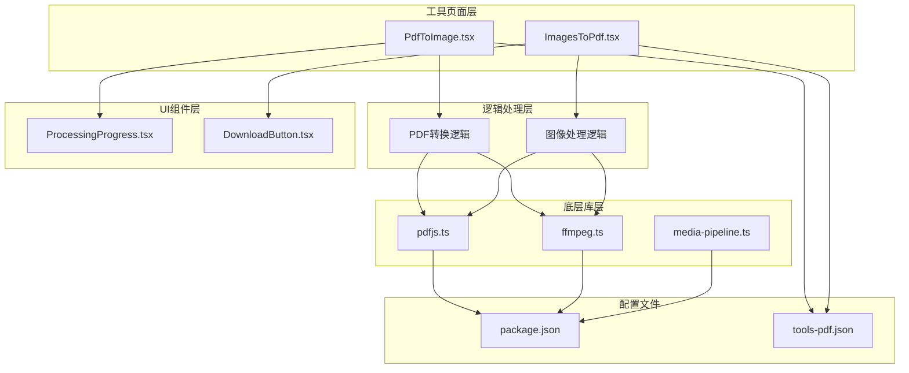
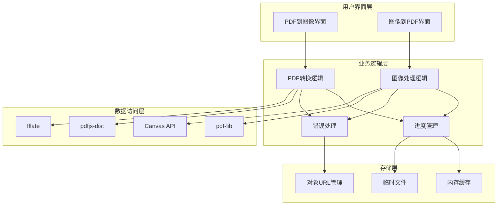
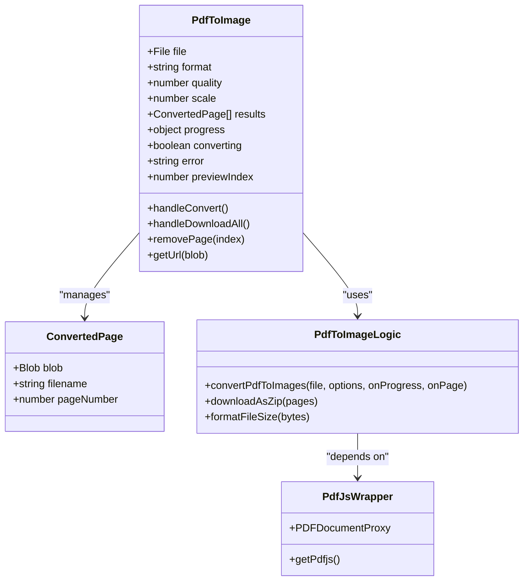
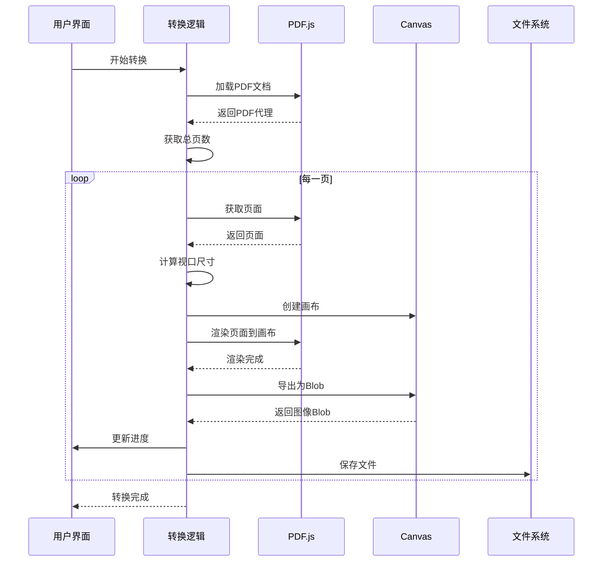
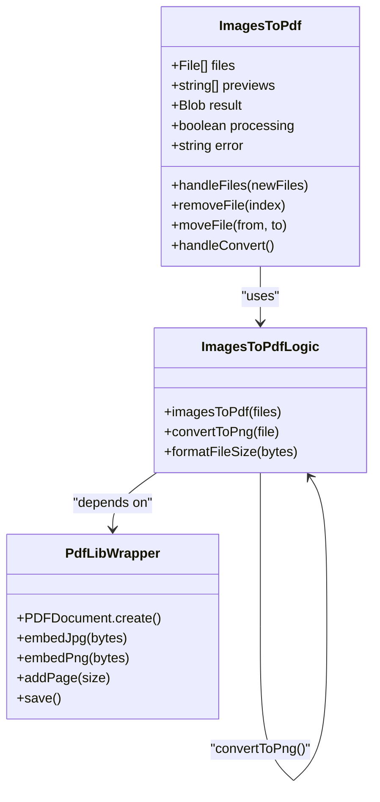
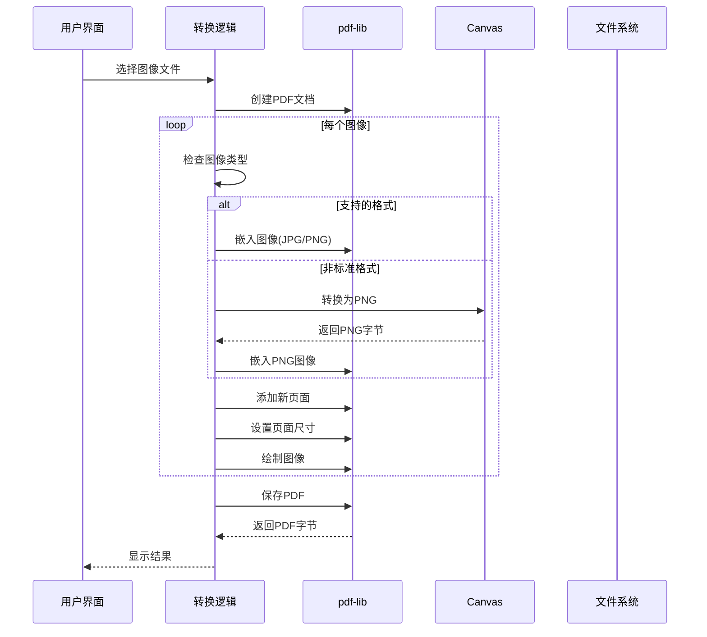
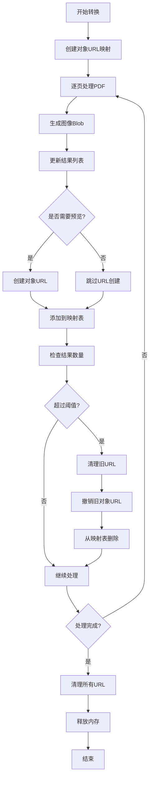
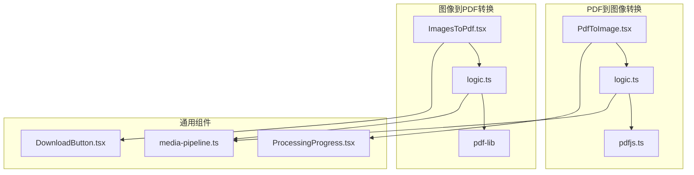
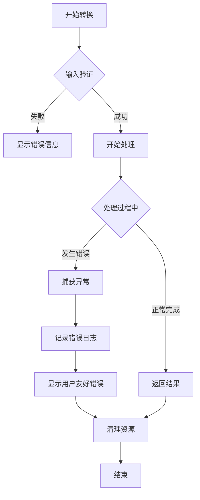

# PDF转换工具

<cite>
**本文档引用的文件**
- [PdfToImage.tsx](file://src/tools/pdf/to-image/PdfToImage.tsx)
- [logic.ts](file://src/tools/pdf/to-image/logic.ts)
- [ImagesToPdf.tsx](file://src/tools/pdf/images-to-pdf/ImagesToPdf.tsx)
- [logic.ts](file://src/tools/pdf/images-to-pdf/logic.ts)
- [pdfjs.ts](file://src/lib/pdfjs.ts)
- [ffmpeg.ts](file://src/lib/ffmpeg.ts)
- [media-pipeline.ts](file://src/lib/media-pipeline.ts)
- [tools-pdf.json](file://messages/en/tools-pdf.json)
- [ProcessingProgress.tsx](file://src/components/shared/ProcessingProgress.tsx)
- [DownloadButton.tsx](file://src/components/shared/DownloadButton.tsx)
- [package.json](file://package.json)
</cite>

## 目录
1. [简介](#简介)
2. [项目结构](#项目结构)
3. [核心组件](#核心组件)
4. [架构概览](#架构概览)
5. [详细组件分析](#详细组件分析)
6. [依赖关系分析](#依赖关系分析)
7. [性能考虑](#性能考虑)
8. [故障排除指南](#故障排除指南)
9. [结论](#结论)

## 简介

PDF转换工具是一个基于浏览器的PDF处理解决方案，专注于PDF与图像之间的双向转换。该工具提供了完整的PDF到图像转换和图像到PDF转换功能，所有处理都在用户的浏览器中本地完成，确保数据隐私和安全。

该工具的核心特性包括：
- **完全本地处理**：所有PDF转换操作在浏览器中执行，无需上传到服务器
- **高质量转换**：支持PNG和JPG格式，可调节分辨率和质量
- **批量处理**：支持多页PDF的批量转换和多图像的批量合并
- **实时预览**：转换过程中的进度跟踪和结果预览功能
- **内存优化**：智能的内存管理和URL清理机制
- **国际化支持**：多语言界面支持

## 项目结构

该项目采用模块化架构设计，主要分为以下几个核心部分：



**图表来源**
- [PdfToImage.tsx:1-229](file://src/tools/pdf/to-image/PdfToImage.tsx#L1-L229)
- [ImagesToPdf.tsx:1-156](file://src/tools/pdf/images-to-pdf/ImagesToPdf.tsx#L1-L156)
- [pdfjs.ts:1-16](file://src/lib/pdfjs.ts#L1-L16)
- [ffmpeg.ts:1-144](file://src/lib/ffmpeg.ts#L1-L144)

**章节来源**
- [package.json:1-45](file://package.json#L1-L45)

## 核心组件

### PDF到图像转换组件

PDF到图像转换功能由以下核心组件构成：

- **PdfToImage.tsx**：主界面组件，负责用户交互和状态管理
- **logic.ts**：转换逻辑实现，包含PDF渲染和图像生成
- **pdfjs.ts**：PDF.js库的初始化和配置

### 图像到PDF转换组件

图像到PDF转换功能由以下核心组件构成：

- **ImagesToPdf.tsx**：主界面组件，负责图像上传和PDF生成
- **logic.ts**：转换逻辑实现，包含图像嵌入和PDF构建
- **pdf-lib**：PDF文档创建和管理

### 底层支持组件

- **ProcessingProgress.tsx**：进度条组件，提供实时进度反馈
- **DownloadButton.tsx**：下载按钮组件，支持多种文件格式下载
- **media-pipeline.ts**：媒体处理管道，提供WebCodecs支持检测

**章节来源**
- [PdfToImage.tsx:17-229](file://src/tools/pdf/to-image/PdfToImage.tsx#L17-L229)
- [ImagesToPdf.tsx:11-156](file://src/tools/pdf/images-to-pdf/ImagesToPdf.tsx#L11-L156)

## 架构概览

该PDF转换工具采用分层架构设计，确保了良好的可维护性和扩展性：



**图表来源**
- [logic.ts:1-86](file://src/tools/pdf/to-image/logic.ts#L1-L86)
- [logic.ts:1-68](file://src/tools/pdf/images-to-pdf/logic.ts#L1-L68)

## 详细组件分析

### PDF到图像转换组件分析

#### 核心类图



**图表来源**
- [PdfToImage.tsx:17-229](file://src/tools/pdf/to-image/PdfToImage.tsx#L17-L229)
- [logic.ts:4-86](file://src/tools/pdf/to-image/logic.ts#L4-L86)
- [pdfjs.ts:3-16](file://src/lib/pdfjs.ts#L3-L16)

#### 转换流程序列图



**图表来源**
- [logic.ts:16-65](file://src/tools/pdf/to-image/logic.ts#L16-L65)

#### 转换算法技术细节

PDF到图像转换的核心算法包含以下关键技术点：

1. **PDF渲染引擎**：使用pdfjs-dist库进行高精度PDF渲染
2. **Canvas渲染**：通过HTML5 Canvas API将PDF内容绘制到画布
3. **图像导出**：利用Canvas.toBlob()方法将画布内容导出为指定格式
4. **质量控制**：支持JPG质量压缩和PNG无损压缩

**章节来源**
- [logic.ts:16-65](file://src/tools/pdf/to-image/logic.ts#L16-L65)

### 图像到PDF转换组件分析

#### 核心类图



**图表来源**
- [ImagesToPdf.tsx:11-156](file://src/tools/pdf/images-to-pdf/ImagesToPdf.tsx#L11-L156)
- [logic.ts:3-68](file://src/tools/pdf/images-to-pdf/logic.ts#L3-L68)

#### 转换流程序列图



**图表来源**
- [logic.ts:3-31](file://src/tools/pdf/images-to-pdf/logic.ts#L3-L31)

#### 转换算法技术细节

图像到PDF转换的核心算法包含以下关键技术点：

1. **格式检测**：自动识别图像格式并选择合适的嵌入方式
2. **格式转换**：对不支持的格式（如GIF、WebP）进行PNG转换
3. **页面布局**：根据图像尺寸自动调整PDF页面大小
4. **质量保持**：直接嵌入原始图像数据，避免重新编码损失

**章节来源**
- [logic.ts:3-31](file://src/tools/pdf/images-to-pdf/logic.ts#L3-L31)

### 性能优化和内存管理

#### 内存管理策略

该工具实现了多层次的内存管理策略：



**图表来源**
- [PdfToImage.tsx:32-64](file://src/tools/pdf/to-image/PdfToImage.tsx#L32-L64)

#### 性能优化技术

1. **异步处理**：使用Promise和async/await实现非阻塞的转换流程
2. **进度回调**：实时更新转换进度，提供良好的用户体验
3. **批量下载**：支持ZIP格式批量下载，减少HTTP请求次数
4. **缓存机制**：使用Ref和Map缓存已处理的图像URL，避免重复计算

**章节来源**
- [PdfToImage.tsx:84-110](file://src/tools/pdf/to-image/PdfToImage.tsx#L84-L110)

## 依赖关系分析

### 外部依赖分析

该工具依赖于多个专业的JavaScript库来实现PDF处理功能：

```mermaid
graph LR
subgraph "PDF处理库"
A[pdfjs-dist]
B[pdf-lib]
end
subgraph "图像处理库"
C[fflate]
D[Canvas API]
end
subgraph "媒体处理库"
E[@ffmpeg/ffmpeg]
F[mediabunny]
end
subgraph "UI框架"
G[React]
H[Next.js]
I[Tailwind CSS]
end
A --> G
B --> G
C --> G
E --> F
F --> G
G --> I
H --> G
```

**图表来源**
- [package.json:11-32](file://package.json#L11-L32)

### 内部依赖关系



**图表来源**
- [PdfToImage.tsx:10-15](file://src/tools/pdf/to-image/PdfToImage.tsx#L10-L15)
- [ImagesToPdf.tsx:8-9](file://src/tools/pdf/images-to-pdf/ImagesToPdf.tsx#L8-L9)

**章节来源**
- [package.json:11-32](file://package.json#L11-L32)

## 性能考虑

### 浏览器兼容性

该工具针对现代浏览器进行了优化，同时考虑了不同浏览器的性能差异：

1. **WebCodecs支持检测**：通过`media-pipeline.ts`检测浏览器对WebCodecs的支持情况
2. **降级策略**：当WebCodecs不可用时，自动回退到传统处理方式
3. **内存限制**：合理设置转换任务的内存使用上限，避免浏览器崩溃

### 处理速度优化

1. **增量渲染**：PDF页面按顺序处理，支持中断和恢复
2. **并行处理**：在可能的情况下并行处理多个页面
3. **缓存策略**：缓存中间结果，减少重复计算

### 内存使用优化

1. **对象URL管理**：及时撤销不再使用的对象URL，释放内存
2. **垃圾回收**：定期清理临时变量和DOM元素
3. **流式处理**：对于大文件，采用流式处理方式减少内存占用

## 故障排除指南

### 常见问题及解决方案

#### PDF加载失败

**问题描述**：PDF文件无法加载或显示空白页面

**可能原因**：
1. PDF文件损坏或格式不支持
2. 浏览器安全策略限制
3. 内存不足导致转换失败

**解决方案**：
1. 验证PDF文件完整性
2. 尝试在其他浏览器中打开
3. 减少同时处理的页面数量

#### 图像质量损失

**问题描述**：转换后的图像质量不如预期

**可能原因**：
1. JPG质量设置过低
2. 分辨率缩放过度
3. PDF本身质量较差

**解决方案**：
1. 提高JPG质量设置（建议≥80%）
2. 使用较低的缩放倍数（≤2x）
3. 从高质量的源PDF开始转换

#### 内存溢出错误

**问题描述**：转换过程中出现内存不足错误

**可能原因**：
1. PDF页面过多或过大
2. 浏览器内存限制
3. 同时运行多个转换任务

**解决方案**：
1. 分批处理PDF页面
2. 关闭其他占用内存的标签页
3. 使用更高性能的设备

#### 格式不支持

**问题描述**：某些图像格式无法转换为PDF

**可能原因**：
1. 图像格式不受pdf-lib支持
2. 图像损坏或格式异常

**解决方案**：
1. 将图像转换为JPG或PNG格式
2. 使用图像编辑软件修复图像
3. 重新保存图像文件

**章节来源**
- [logic.ts:46-52](file://src/tools/pdf/to-image/logic.ts#L46-L52)
- [logic.ts:14-18](file://src/tools/pdf/images-to-pdf/logic.ts#L14-L18)

### 错误处理机制

该工具实现了完善的错误处理机制：



**图表来源**
- [PdfToImage.tsx:103-109](file://src/tools/pdf/to-image/PdfToImage.tsx#L103-L109)

## 结论

PDF转换工具是一个功能完整、性能优秀的浏览器端PDF处理解决方案。通过精心设计的架构和优化的算法，该工具能够在保证高质量转换的同时，提供流畅的用户体验。

### 主要优势

1. **完全本地处理**：确保用户数据的安全性和隐私性
2. **高质量转换**：支持多种输出格式和质量控制选项
3. **用户友好**：直观的界面设计和实时进度反馈
4. **性能优化**：智能的内存管理和处理策略
5. **扩展性强**：模块化的架构便于功能扩展

### 技术特色

- 基于pdfjs-dist的精确PDF渲染
- 基于pdf-lib的可靠PDF生成
- 智能的图像格式转换和优化
- 完善的错误处理和用户反馈机制

### 未来发展方向

1. **WebAssembly优化**：进一步提升转换性能
2. **批量处理增强**：支持更大规模的批量转换任务
3. **格式扩展**：支持更多PDF和图像格式
4. **云端集成**：在保持隐私的前提下提供云端备份功能

该工具为PDF处理需求提供了一个强大而易用的解决方案，适合个人用户和企业环境的各种应用场景。