# PDF页面管理工具

<cite>
**本文档引用的文件**
- [src/tools/pdf/delete-pages/logic.ts](file://src/tools/pdf/delete-pages/logic.ts)
- [src/tools/pdf/delete-pages/DeletePages.tsx](file://src/tools/pdf/delete-pages/DeletePages.tsx)
- [src/tools/pdf/crop/logic.ts](file://src/tools/pdf/crop/logic.ts)
- [src/tools/pdf/crop/CropPdf.tsx](file://src/tools/pdf/crop/CropPdf.tsx)
- [src/tools/pdf/rotate/logic.ts](file://src/tools/pdf/rotate/logic.ts)
- [src/tools/pdf/rotate/RotatePdf.tsx](file://src/tools/pdf/rotate/RotatePdf.tsx)
- [src/tools/pdf/rearrange/logic.ts](file://src/tools/pdf/rearrange/logic.ts)
- [src/tools/pdf/rearrange/RearrangePdf.tsx](file://src/tools/pdf/rearrange/RearrangePdf.tsx)
- [src/components/shared/PdfPagePreview.tsx](file://src/components/shared/PdfPagePreview.tsx)
- [src/lib/pdfjs.ts](file://src/lib/pdfjs.ts)
- [messages/zh-Hans/tools-pdf.json](file://messages/zh-Hans/tools-pdf.json)
- [package.json](file://package.json)
</cite>

## 目录
1. [简介](#简介)
2. [项目结构](#项目结构)
3. [核心组件](#核心组件)
4. [架构概览](#架构概览)
5. [详细组件分析](#详细组件分析)
6. [依赖关系分析](#依赖关系分析)
7. [性能考虑](#性能考虑)
8. [故障排除指南](#故障排除指南)
9. [结论](#结论)

## 简介

PDF页面管理工具是一个基于Web的PDF编辑器，专注于提供直观的页面管理功能。该工具允许用户执行多种PDF页面操作，包括页面删除、页面裁剪、页面旋转和页面重新排列。所有处理都在浏览器本地完成，确保用户隐私和数据安全。

该工具采用现代化的React技术栈构建，使用pdf-lib和pdfjs-dist库来处理PDF文档操作。界面设计注重用户体验，提供实时预览、批量操作和撤销机制等功能。

## 项目结构

项目采用模块化的文件组织结构，每个PDF工具都有独立的逻辑层和界面层：

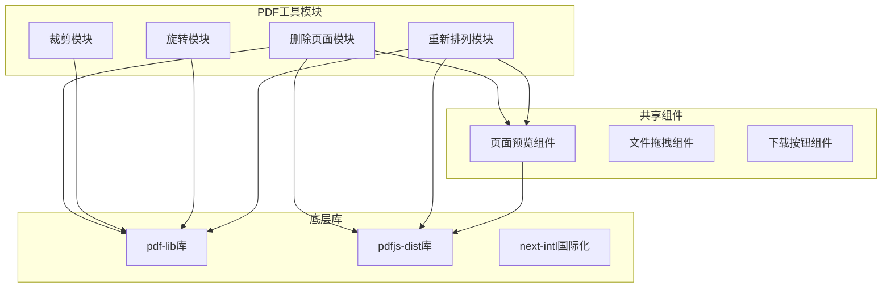

**图表来源**
- [src/tools/pdf/delete-pages/logic.ts:1-39](file://src/tools/pdf/delete-pages/logic.ts#L1-L39)
- [src/tools/pdf/crop/logic.ts:1-49](file://src/tools/pdf/crop/logic.ts#L1-L49)
- [src/tools/pdf/rotate/logic.ts:1-30](file://src/tools/pdf/rotate/logic.ts#L1-L30)
- [src/tools/pdf/rearrange/logic.ts:1-25](file://src/tools/pdf/rearrange/logic.ts#L1-L25)

**章节来源**
- [package.json:11-31](file://package.json#L11-L31)

## 核心组件

### 删除页面功能

删除页面功能允许用户选择并删除PDF文档中的指定页面。该功能的核心算法基于页面索引过滤机制：

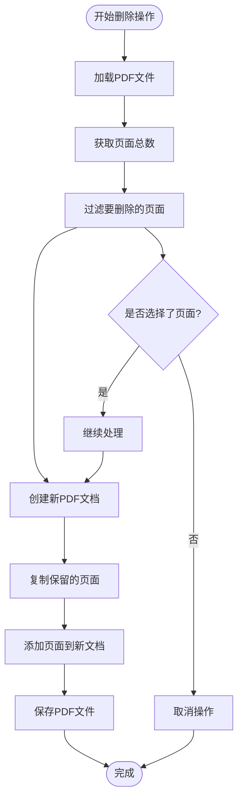

**图表来源**
- [src/tools/pdf/delete-pages/logic.ts:3-26](file://src/tools/pdf/delete-pages/logic.ts#L3-L26)

### 裁剪功能

裁剪功能通过调整PDF页面的裁剪框来移除页面边缘的空白区域。该功能支持四个方向的独立边距设置：

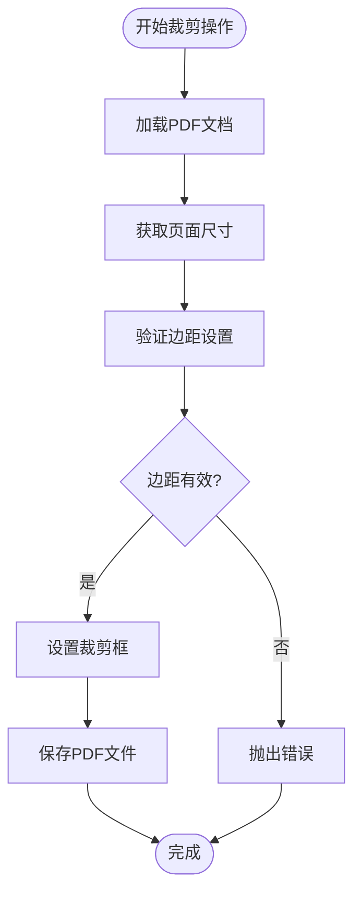

**图表来源**
- [src/tools/pdf/crop/logic.ts:11-33](file://src/tools/pdf/crop/logic.ts#L11-L33)

### 旋转功能

旋转功能支持对PDF文档中的所有页面进行统一旋转操作，支持90°、180°和270°三种角度：

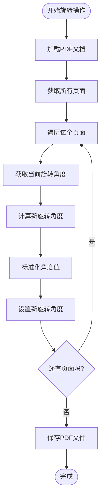

**图表来源**
- [src/tools/pdf/rotate/logic.ts:3-23](file://src/tools/pdf/rotate/logic.ts#L3-L23)

### 重新排列功能

重新排列功能允许用户通过拖拽操作重新排序PDF页面：

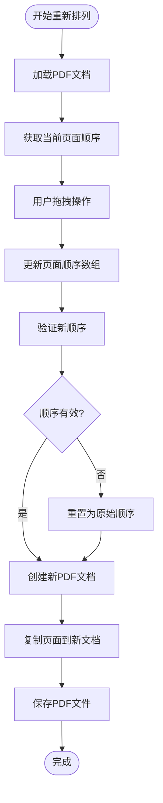

**图表来源**
- [src/tools/pdf/rearrange/logic.ts:3-18](file://src/tools/pdf/rearrange/logic.ts#L3-L18)

**章节来源**
- [src/tools/pdf/delete-pages/logic.ts:1-39](file://src/tools/pdf/delete-pages/logic.ts#L1-L39)
- [src/tools/pdf/crop/logic.ts:1-49](file://src/tools/pdf/crop/logic.ts#L1-L49)
- [src/tools/pdf/rotate/logic.ts:1-30](file://src/tools/pdf/rotate/logic.ts#L1-L30)
- [src/tools/pdf/rearrange/logic.ts:1-25](file://src/tools/pdf/rearrange/logic.ts#L1-L25)

## 架构概览

该工具采用分层架构设计，确保功能模块的独立性和可维护性：

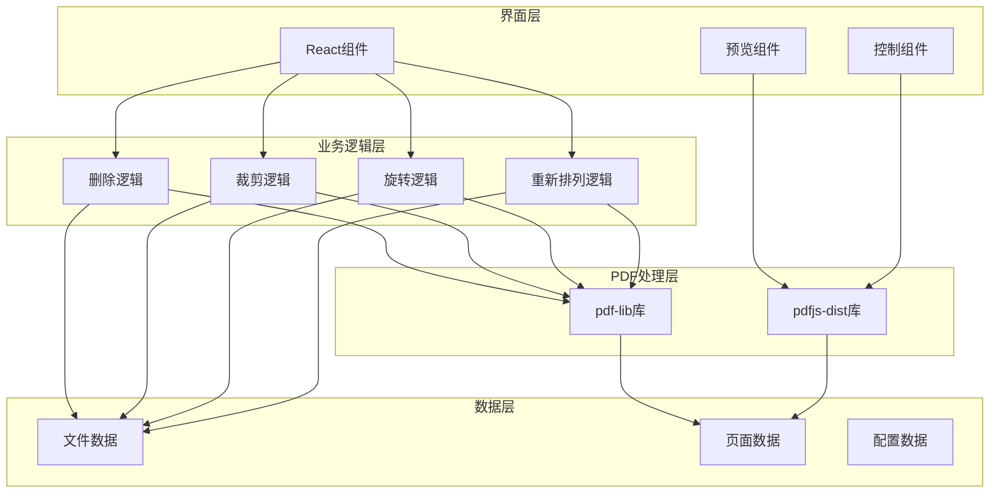

**图表来源**
- [src/tools/pdf/delete-pages/DeletePages.tsx:1-127](file://src/tools/pdf/delete-pages/DeletePages.tsx#L1-L127)
- [src/tools/pdf/crop/CropPdf.tsx:1-130](file://src/tools/pdf/crop/CropPdf.tsx#L1-L130)
- [src/tools/pdf/rotate/RotatePdf.tsx:1-123](file://src/tools/pdf/rotate/RotatePdf.tsx#L1-L123)
- [src/tools/pdf/rearrange/RearrangePdf.tsx:1-156](file://src/tools/pdf/rearrange/RearrangePdf.tsx#L1-L156)

## 详细组件分析

### 删除页面组件分析

删除页面组件实现了完整的页面选择和删除流程：

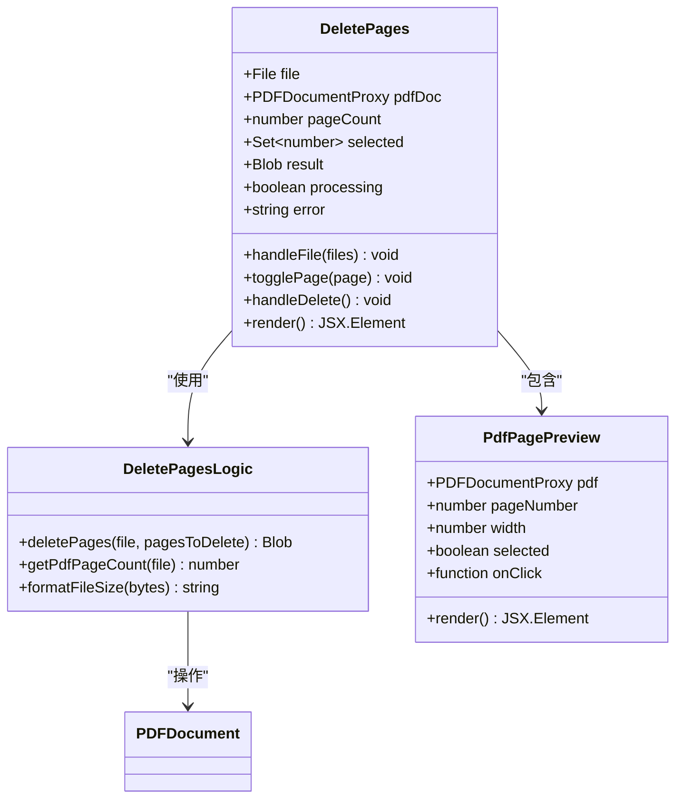

**图表来源**
- [src/tools/pdf/delete-pages/DeletePages.tsx:13-127](file://src/tools/pdf/delete-pages/DeletePages.tsx#L13-L127)
- [src/tools/pdf/delete-pages/logic.ts:3-39](file://src/tools/pdf/delete-pages/logic.ts#L3-L39)
- [src/components/shared/PdfPagePreview.tsx:16-80](file://src/components/shared/PdfPagePreview.tsx#L16-L80)

#### 删除操作序列图

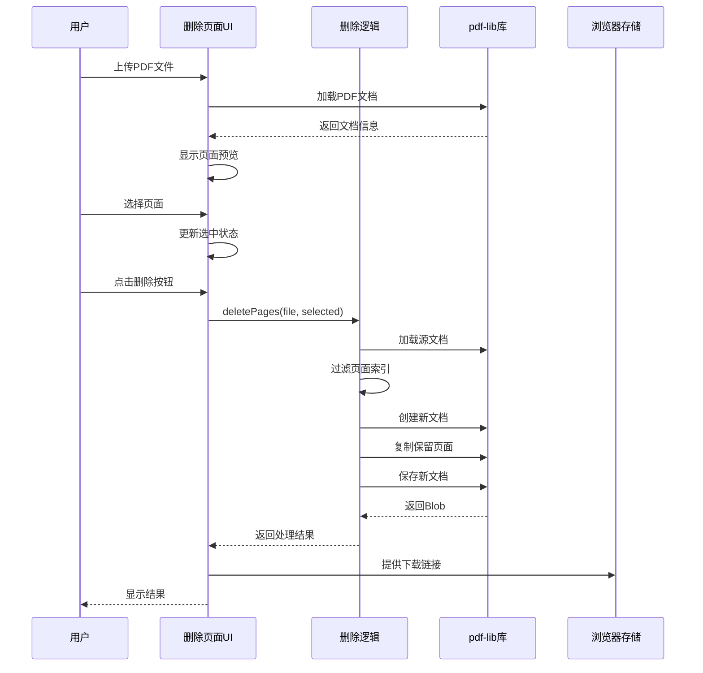

**图表来源**
- [src/tools/pdf/delete-pages/DeletePages.tsx:51-65](file://src/tools/pdf/delete-pages/DeletePages.tsx#L51-L65)
- [src/tools/pdf/delete-pages/logic.ts:3-26](file://src/tools/pdf/delete-pages/logic.ts#L3-L26)

**章节来源**
- [src/tools/pdf/delete-pages/DeletePages.tsx:1-127](file://src/tools/pdf/delete-pages/DeletePages.tsx#L1-L127)
- [src/tools/pdf/delete-pages/logic.ts:1-39](file://src/tools/pdf/delete-pages/logic.ts#L1-L39)

### 裁剪组件分析

裁剪组件提供了精确的页面边距控制功能：

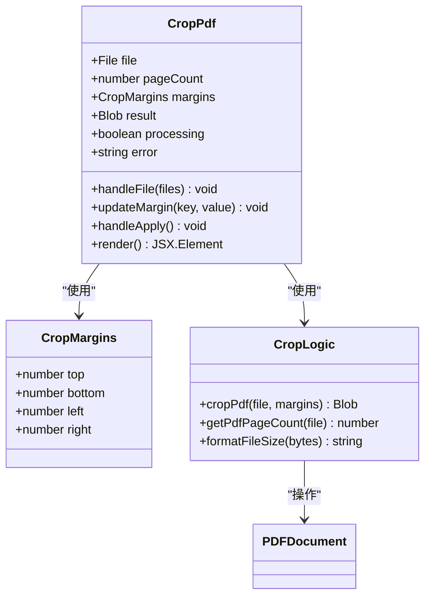

**图表来源**
- [src/tools/pdf/crop/CropPdf.tsx:10-130](file://src/tools/pdf/crop/CropPdf.tsx#L10-L130)
- [src/tools/pdf/crop/logic.ts:4-33](file://src/tools/pdf/crop/logic.ts#L4-L33)

#### 裁剪操作流程图

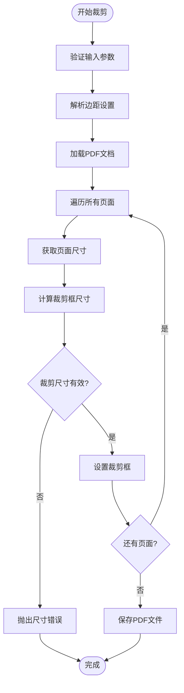

**图表来源**
- [src/tools/pdf/crop/logic.ts:11-33](file://src/tools/pdf/crop/logic.ts#L11-L33)

**章节来源**
- [src/tools/pdf/crop/CropPdf.tsx:1-130](file://src/tools/pdf/crop/CropPdf.tsx#L1-L130)
- [src/tools/pdf/crop/logic.ts:1-49](file://src/tools/pdf/crop/logic.ts#L1-L49)

### 旋转组件分析

旋转组件提供了统一的页面旋转功能：

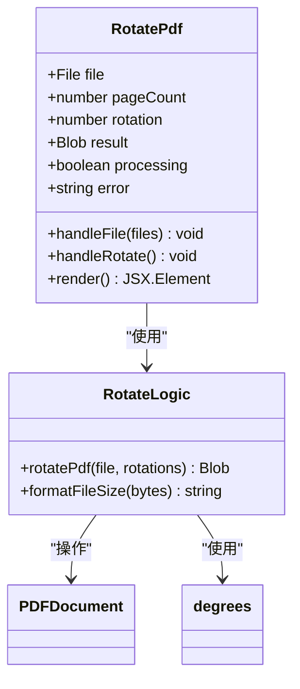

**图表来源**
- [src/tools/pdf/rotate/RotatePdf.tsx:11-123](file://src/tools/pdf/rotate/RotatePdf.tsx#L11-L123)
- [src/tools/pdf/rotate/logic.ts:3-30](file://src/tools/pdf/rotate/logic.ts#L3-L30)

#### 旋转操作序列图

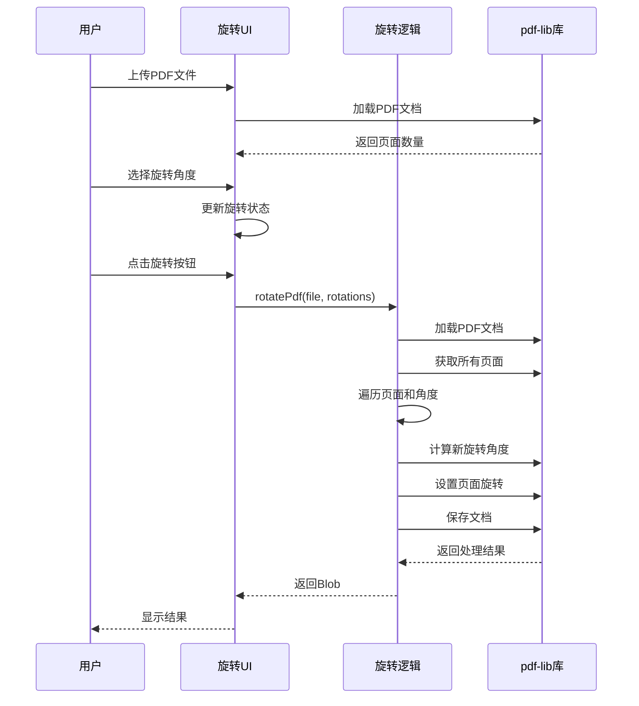

**图表来源**
- [src/tools/pdf/rotate/RotatePdf.tsx:36-55](file://src/tools/pdf/rotate/RotatePdf.tsx#L36-L55)
- [src/tools/pdf/rotate/logic.ts:3-23](file://src/tools/pdf/rotate/logic.ts#L3-L23)

**章节来源**
- [src/tools/pdf/rotate/RotatePdf.tsx:1-123](file://src/tools/pdf/rotate/RotatePdf.tsx#L1-L123)
- [src/tools/pdf/rotate/logic.ts:1-30](file://src/tools/pdf/rotate/logic.ts#L1-L30)

### 重新排列组件分析

重新排列组件提供了直观的页面拖拽排序功能：

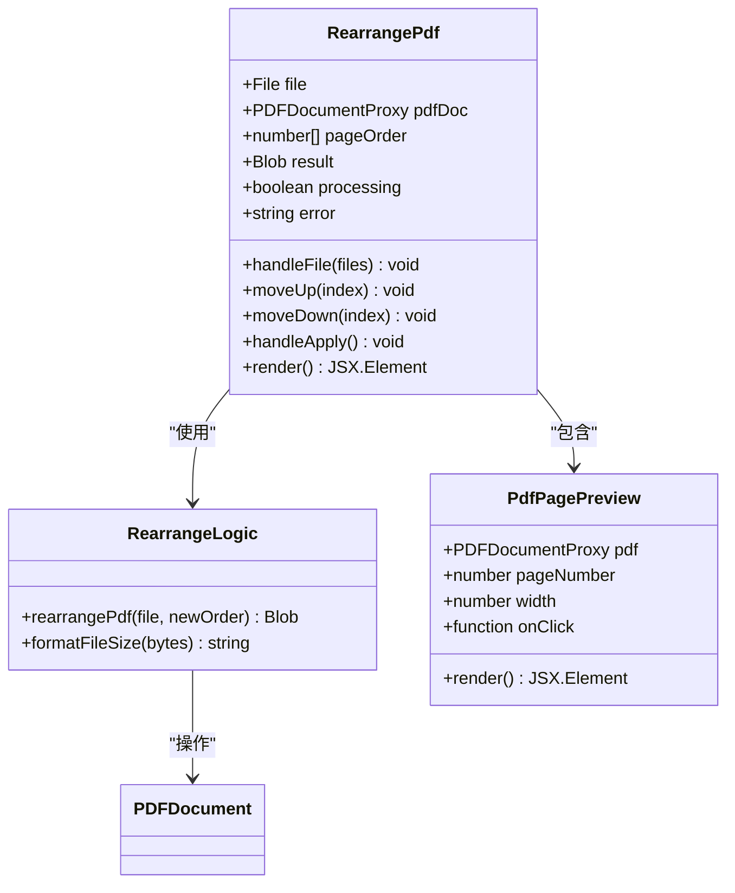

**图表来源**
- [src/tools/pdf/rearrange/RearrangePdf.tsx:14-156](file://src/tools/pdf/rearrange/RearrangePdf.tsx#L14-L156)
- [src/tools/pdf/rearrange/logic.ts:3-18](file://src/tools/pdf/rearrange/logic.ts#L3-L18)
- [src/components/shared/PdfPagePreview.tsx:16-80](file://src/components/shared/PdfPagePreview.tsx#L16-L80)

**章节来源**
- [src/tools/pdf/rearrange/RearrangePdf.tsx:1-156](file://src/tools/pdf/rearrange/RearrangePdf.tsx#L1-L156)
- [src/tools/pdf/rearrange/logic.ts:1-25](file://src/tools/pdf/rearrange/logic.ts#L1-L25)

## 依赖关系分析

该工具的依赖关系主要围绕PDF处理库和React生态系统：

```mermaid
graph TB
subgraph "核心依赖"
React[react 19.2.3]
Next[Next.js 16.2.1]
PdfLib[pdf-lib 1.17.1]
PdfJsDist[pdfjs-dist 5.5.207]
end
subgraph "UI组件库"
Lucide[lucide-react]
Tailwind[tailwindcss]
clsx[clsx]
end
subgraph "国际化"
NextIntl[next-intl 4.8.3]
end
subgraph "工具库"
Ffmpeg[@ffmpeg/ffmpeg 0.12.15]
BrowserCompression[browser-image-compression]
Fflate[fflate 0.8.2]
end
DeletePages --> PdfLib
CropPdf --> PdfLib
RotatePdf --> PdfLib
RearrangePdf --> PdfLib
DeletePages --> PdfJsDist
RearrangePdf --> PdfJsDist
DeletePages --> NextIntl
CropPdf --> NextIntl
RotatePdf --> NextIntl
RearrangePdf --> NextIntl
AllComponents --> React
AllComponents --> Next
AllComponents --> Lucide
AllComponents --> Tailwind
```

**图表来源**
- [package.json:11-31](file://package.json#L11-L31)

**章节来源**
- [package.json:1-45](file://package.json#L1-L45)

## 性能考虑

### 内存管理

所有PDF操作都在浏览器内存中进行，需要注意以下性能优化：

1. **渐进式加载**: 使用pdfjs-dist的异步加载机制，避免阻塞主线程
2. **及时释放**: 在组件卸载时销毁PDF文档实例，释放内存
3. **批量操作**: 对于大量页面的操作，考虑分批处理以避免长时间锁定UI

### 处理速度优化

1. **页面预览缓存**: PdfPagePreview组件缓存渲染结果，避免重复计算
2. **增量更新**: 当用户修改设置时，只重新渲染受影响的部分
3. **防抖处理**: 对频繁触发的操作（如边距调整）使用防抖机制

### 大文件处理

1. **分页加载**: 对于超大PDF文件，考虑实现分页加载和懒加载机制
2. **进度反馈**: 提供详细的处理进度和预计完成时间
3. **错误恢复**: 实现断点续传和错误恢复机制

## 故障排除指南

### 常见问题及解决方案

#### 页面索引错误

**问题**: 页面索引从0开始还是从1开始

**解决方案**: 
- 删除和重新排列功能使用1基索引（第1页、第2页...）
- pdf-lib内部使用0基索引，逻辑层已正确转换

#### 内容丢失问题

**问题**: 裁剪操作导致内容丢失

**解决方案**:
- 确保裁剪边距不超过页面尺寸
- 使用点（pt）作为单位，1pt = 1/72英寸
- 预览裁剪效果后再应用

#### 格式不兼容问题

**问题**: 某些PDF文件无法正常处理

**解决方案**:
- 检查PDF版本兼容性
- 验证PDF文件完整性
- 提供降级处理方案

#### 性能问题

**问题**: 大文件处理缓慢

**解决方案**:
- 实现进度条和取消机制
- 提供处理时间估算
- 考虑Web Worker进行后台处理

**章节来源**
- [src/tools/pdf/crop/logic.ts:23-27](file://src/tools/pdf/crop/logic.ts#L23-L27)
- [src/tools/pdf/delete-pages/DeletePages.tsx:56-64](file://src/tools/pdf/delete-pages/DeletePages.tsx#L56-L64)

## 结论

PDF页面管理工具提供了一个功能完整、用户友好的PDF编辑解决方案。通过精心设计的架构和算法，该工具能够高效地处理各种PDF页面操作，同时确保用户数据的安全性和隐私保护。

### 主要优势

1. **完全本地化**: 所有处理都在浏览器中完成，无需上传文件
2. **直观界面**: 提供实时预览和拖拽操作
3. **功能完整**: 支持删除、裁剪、旋转、重新排列等核心功能
4. **性能优化**: 采用渐进式加载和内存管理策略
5. **国际化支持**: 多语言界面，支持全球用户

### 技术特色

- 基于React和TypeScript的现代化前端架构
- 使用pdf-lib和pdfjs-dist处理PDF操作
- 实现了完整的页面索引管理和内容重排机制
- 提供了完善的错误处理和用户反馈机制

该工具为PDF页面管理提供了一个可靠、高效的解决方案，适合个人用户和企业环境的各种使用场景。