# PDF高级工具

<cite>
**本文档引用的文件**
- [logic.ts](file://src/tools/pdf/add-page-numbers/logic.ts)
- [AddPageNumbers.tsx](file://src/tools/pdf/add-page-numbers/AddPageNumbers.tsx)
- [logic.ts](file://src/tools/pdf/esign/logic.ts)
- [ESign.tsx](file://src/tools/pdf/esign/ESign.tsx)
- [logic.ts](file://src/tools/pdf/add-watermark/logic.ts)
- [logic.ts](file://src/tools/pdf/compress/logic.ts)
- [pdfjs.ts](file://src/lib/pdfjs.ts)
- [tools-pdf.json](file://messages/zh-Hans/tools-pdf.json)
- [package.json](file://package.json)
- [README.md](file://README.md)
</cite>

## 目录
1. [简介](#简介)
2. [项目结构](#项目结构)
3. [核心组件](#核心组件)
4. [架构概览](#架构概览)
5. [详细组件分析](#详细组件分析)
6. [依赖关系分析](#依赖关系分析)
7. [性能考虑](#性能考虑)
8. [故障排除指南](#故障排除指南)
9. [结论](#结论)
10. [附录](#附录)

## 简介

PDF高级工具是一个基于浏览器的PDF处理工具集，专注于提供强大的PDF编辑功能。该项目采用纯前端技术栈，所有处理都在浏览器本地完成，确保用户隐私和数据安全。项目包含14个PDF工具，涵盖合并、拆分、压缩、转图片、提取文本、电子签名等核心功能。

该项目的核心优势在于：
- **隐私保护**：所有文件处理都在浏览器本地完成，文件永不离开用户设备
- **离线可用**：页面加载后可完全离线使用，支持PWA安装
- **多语言支持**：支持21种语言，包括简体中文、繁体中文、英语等
- **高性能**：使用pdf-lib和pdfjs-dist等专业库，确保处理效率

## 项目结构

项目采用模块化的组织方式，按照功能分类管理不同类型的工具：

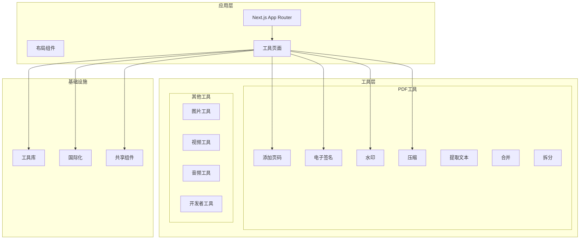

**图表来源**
- [README.md:55-78](file://README.md#L55-L78)

**章节来源**
- [README.md:16-25](file://README.md#L16-L25)
- [README.md:55-78](file://README.md#L55-L78)

## 核心组件

### PDF处理库架构

项目使用两个核心PDF处理库来实现不同的功能：

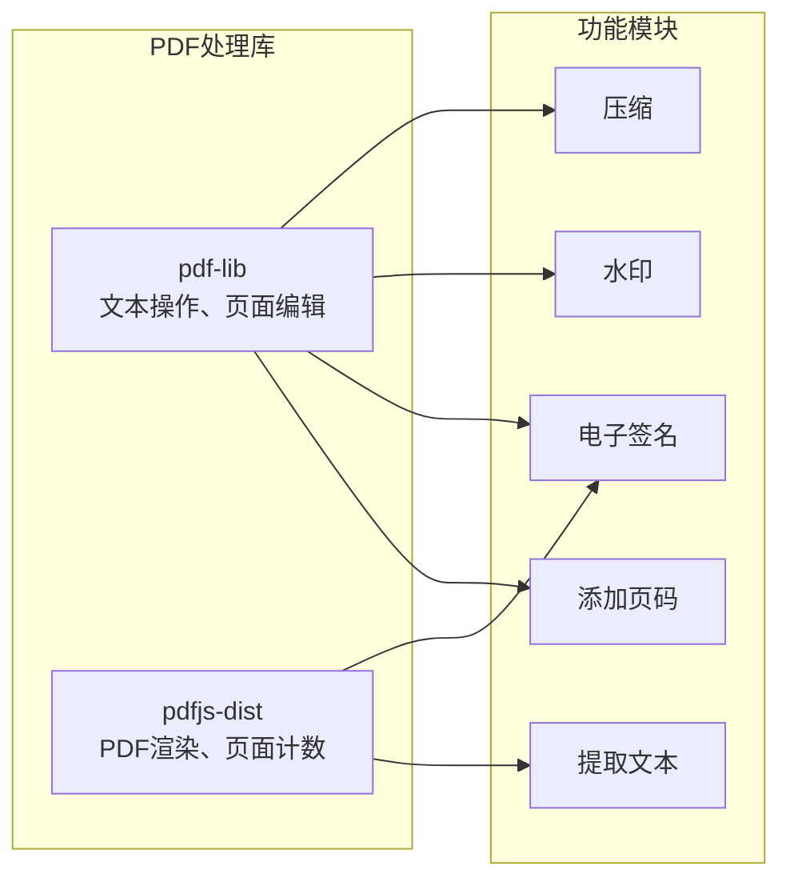

**图表来源**
- [package.json:25-26](file://package.json#L25-L26)

### 数据流架构

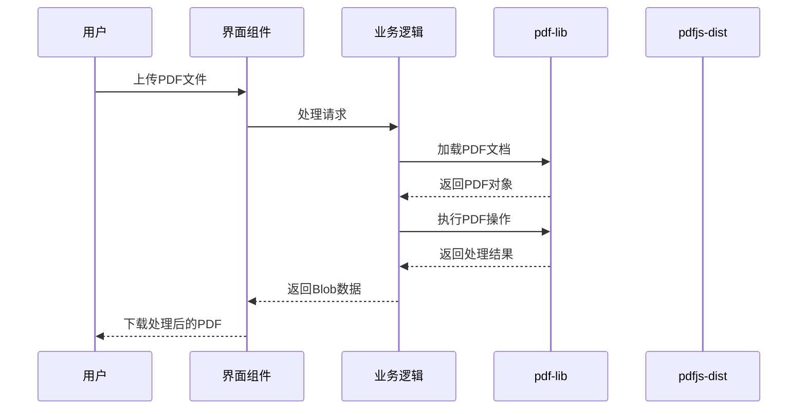

**图表来源**
- [logic.ts:13-87](file://src/tools/pdf/add-page-numbers/logic.ts#L13-L87)
- [logic.ts:4-49](file://src/tools/pdf/esign/logic.ts#L4-L49)

**章节来源**
- [package.json:32](file://package.json#L32)

## 架构概览

### 技术栈架构

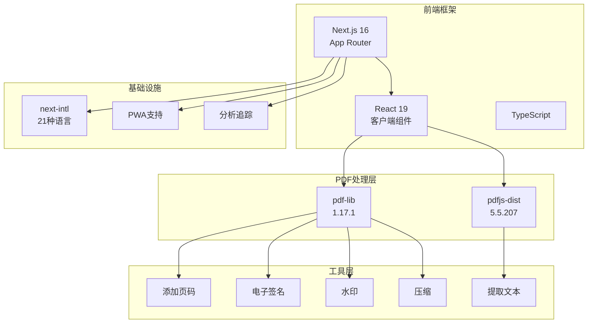

**图表来源**
- [package.json:22-31](file://package.json#L22-L31)
- [README.md:26-33](file://README.md#L26-L33)

### 组件交互流程

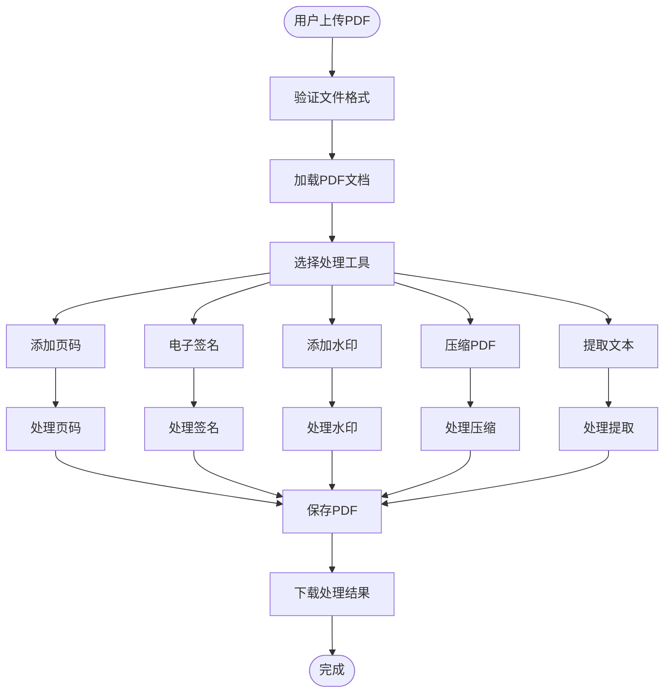

**图表来源**
- [AddPageNumbers.tsx:54-73](file://src/tools/pdf/add-page-numbers/AddPageNumbers.tsx#L54-L73)
- [ESign.tsx:120-146](file://src/tools/pdf/esign/ESign.tsx#L120-L146)

**章节来源**
- [README.md:26-33](file://README.md#L26-L33)

## 详细组件分析

### 添加页码功能

#### 实现原理

添加页码功能通过pdf-lib库实现，支持多种位置和格式的页码标注：

```mermaid
classDiagram
class NumberPosition {
<<enumeration>>
"bottom-center"
"bottom-left"
"bottom-right"
"top-center"
"top-left"
"top-right"
}
class NumberFormat {
<<enumeration>>
"number"
"pageN"
"nOfTotal"
}
class AddPageNumbersLogic {
+addPageNumbers(file, options) Blob
+formatFileSize(bytes) string
-calculateTextPosition() void
-handleRotation() void
}
class PageNumberOptions {
+position : NumberPosition
+fontSize : number
+format : NumberFormat
+startPage : number
}
AddPageNumbersLogic --> NumberPosition
AddPageNumbersLogic --> NumberFormat
AddPageNumbersLogic --> PageNumberOptions
```

**图表来源**
- [logic.ts:3-11](file://src/tools/pdf/add-page-numbers/logic.ts#L3-L11)
- [logic.ts:13-21](file://src/tools/pdf/add-page-numbers/logic.ts#L13-L21)

#### 算法机制

页码添加算法包含以下关键步骤：

1. **页面遍历**：遍历PDF中的所有页面
2. **条件判断**：根据起始页参数跳过前面的页面
3. **格式化**：根据选择的格式生成页码文本
4. **坐标计算**：处理页面旋转和坐标变换
5. **文本绘制**：使用pdf-lib绘制页码

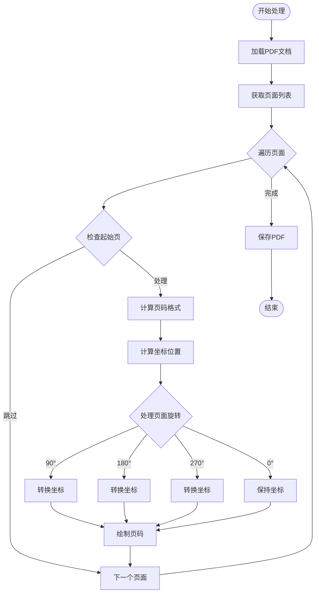

**图表来源**
- [logic.ts:28-83](file://src/tools/pdf/add-page-numbers/logic.ts#L28-L83)

#### 配置选项

| 选项 | 类型 | 默认值 | 描述 |
|------|------|--------|------|
| position | NumberPosition | "bottom-center" | 页码位置 |
| fontSize | number | 12 | 字体大小（像素） |
| format | NumberFormat | "number" | 页码格式 |
| startPage | number | 1 | 起始页码 |

**章节来源**
- [logic.ts:13-21](file://src/tools/pdf/add-page-numbers/logic.ts#L13-L21)
- [AddPageNumbers.tsx:26-32](file://src/tools/pdf/add-page-numbers/AddPageNumbers.tsx#L26-L32)

### 电子签名功能

#### 实现原理

电子签名功能结合了Canvas绘图和pdf-lib嵌入技术：

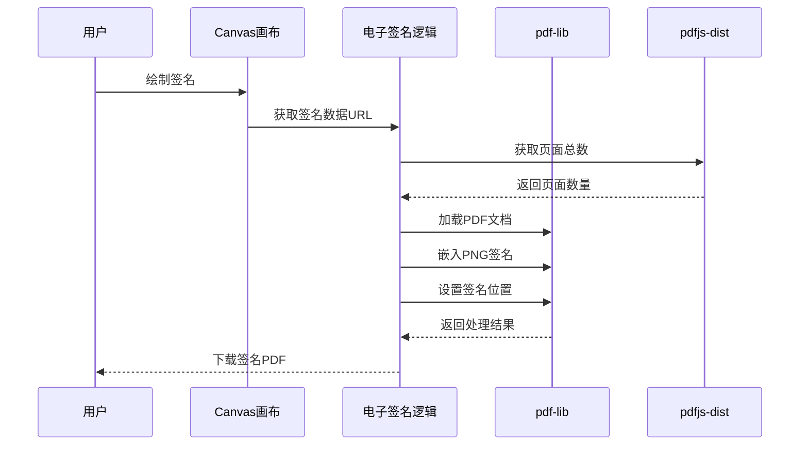

**图表来源**
- [ESign.tsx:120-146](file://src/tools/pdf/esign/ESign.tsx#L120-L146)
- [logic.ts:4-49](file://src/tools/pdf/esign/logic.ts#L4-L49)

#### 技术实现

电子签名功能包含以下关键技术点：

1. **Canvas签名绘制**：使用HTML5 Canvas API绘制用户手写签名
2. **数据URL转换**：将Canvas内容转换为PNG数据URL
3. **PDF嵌入**：使用pdf-lib将PNG图像嵌入到PDF中
4. **坐标系统**：处理PDF坐标系统与Canvas坐标系统的差异

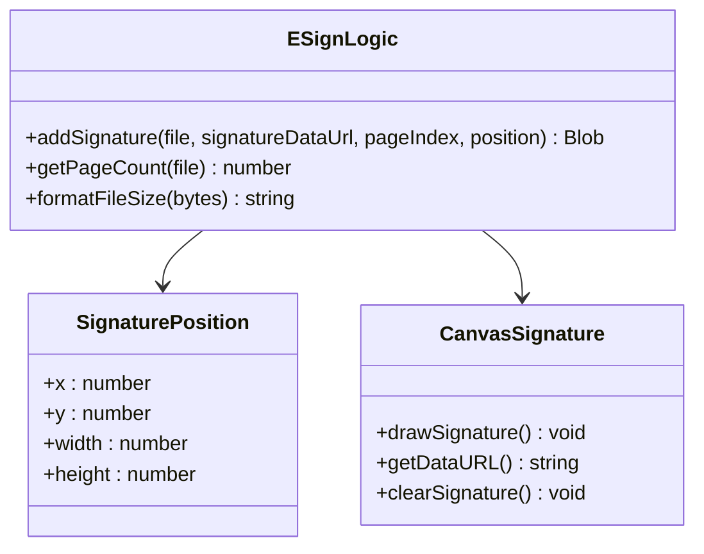

**图表来源**
- [logic.ts:4-9](file://src/tools/pdf/esign/logic.ts#L4-L9)
- [ESign.tsx:105-146](file://src/tools/pdf/esign/ESign.tsx#L105-L146)

#### 用户界面设计

电子签名界面提供了直观的操作体验：

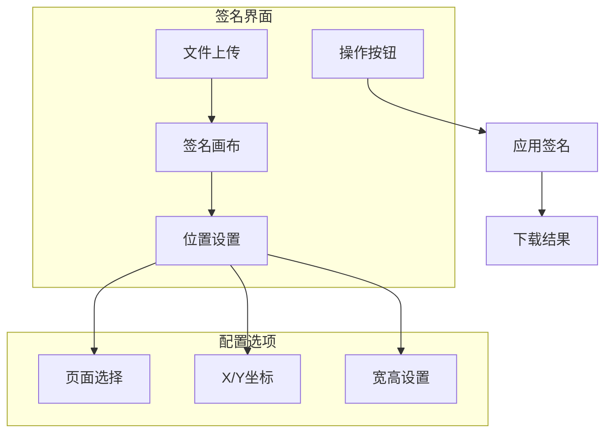

**图表来源**
- [ESign.tsx:148-275](file://src/tools/pdf/esign/ESign.tsx#L148-L275)

**章节来源**
- [ESign.tsx:105-146](file://src/tools/pdf/esign/ESign.tsx#L105-L146)
- [logic.ts:4-49](file://src/tools/pdf/esign/logic.ts#L4-L49)

### 水印功能

#### 实现原理

水印功能通过pdf-lib的文本绘制功能实现对角线水印效果：

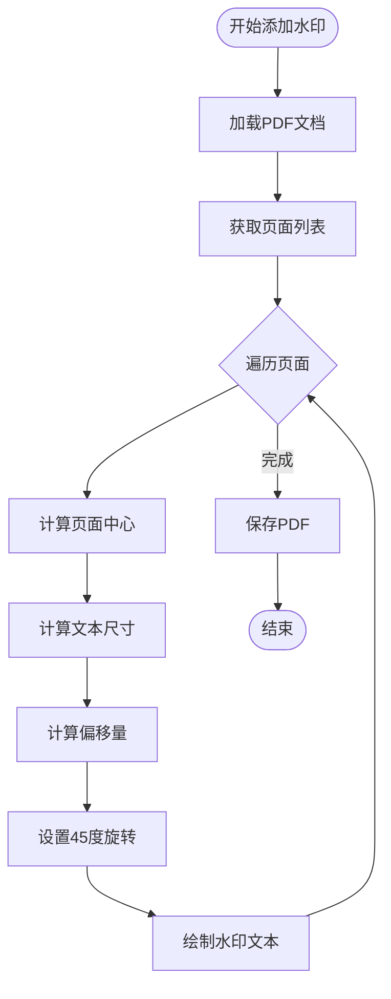

**图表来源**
- [logic.ts:3-34](file://src/tools/pdf/add-watermark/logic.ts#L3-L34)

#### 配置选项

| 选项 | 类型 | 默认值 | 描述 |
|------|------|--------|------|
| text | string | "机密" | 水印文本内容 |
| opacity | number | 0.5 | 水印透明度（0-1） |
| fontSize | number | 12 | 字体大小（像素） |

**章节来源**
- [logic.ts:3-6](file://src/tools/pdf/add-watermark/logic.ts#L3-L6)

### PDF压缩功能

#### 实现原理

PDF压缩功能通过pdfjs-dist渲染和pdf-lib重建实现：

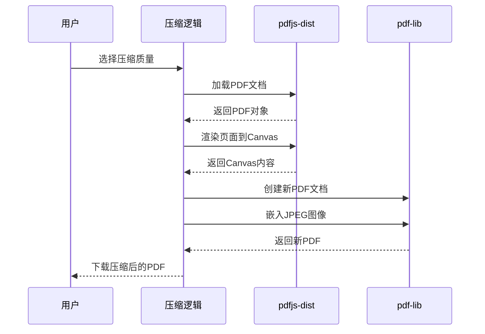

**图表来源**
- [logic.ts:12-66](file://src/tools/pdf/compress/logic.ts#L12-L66)

#### 压缩质量配置

| 质量等级 | 缩放比例 | JPEG质量 | 文件大小影响 |
|----------|----------|----------|--------------|
| high | 1.5 | 0.8 | 较小，质量高 |
| medium | 1.0 | 0.6 | 中等，平衡 |
| low | 0.75 | 0.4 | 最小，质量较低 |

**章节来源**
- [logic.ts:6-10](file://src/tools/pdf/compress/logic.ts#L6-L10)

## 依赖关系分析

### 核心依赖关系

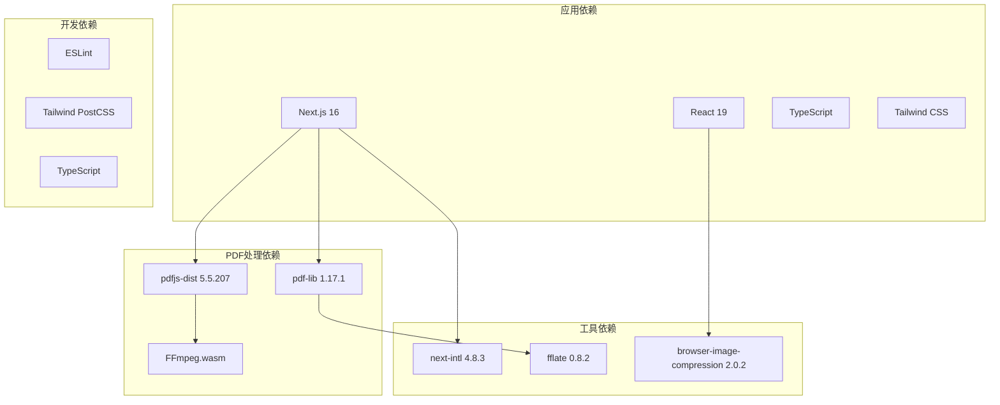

**图表来源**
- [package.json:11-32](file://package.json#L11-L32)

### 工具间依赖关系

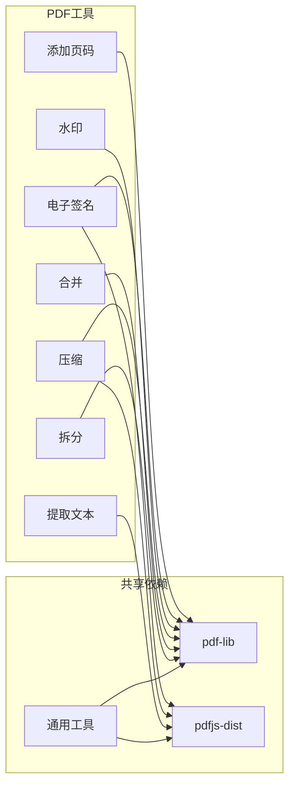

**图表来源**
- [package.json:25-26](file://package.json#L25-L26)

**章节来源**
- [package.json:11-44](file://package.json#L11-L44)

## 性能考虑

### 浏览器性能优化

项目在设计时充分考虑了浏览器性能限制：

1. **内存管理**：及时释放Canvas和PDF对象
2. **异步处理**：使用Promise和async/await避免阻塞UI
3. **进度反馈**：提供处理进度指示器
4. **文件大小限制**：根据设备内存动态调整处理策略

### 处理速度优化

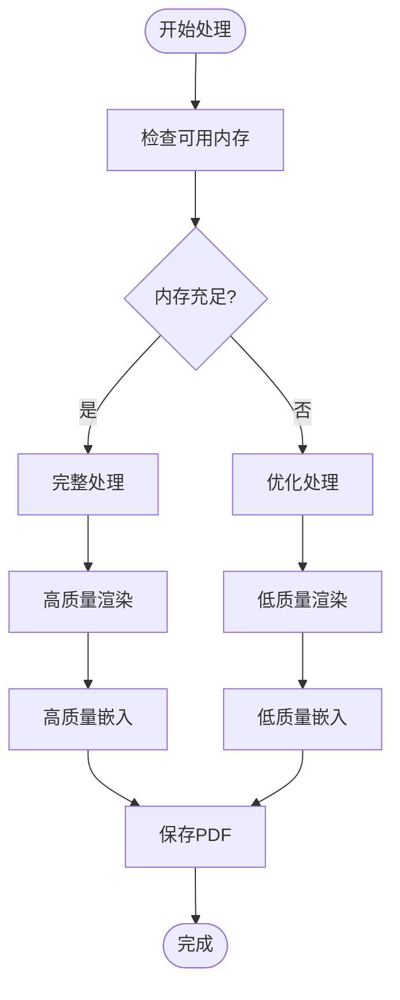

### 存储优化

- **临时文件**：处理过程中的中间文件及时清理
- **缓存策略**：合理使用浏览器缓存机制
- **增量处理**：支持大文件的分块处理

## 故障排除指南

### 常见问题及解决方案

#### 页码添加问题

**问题**：页码位置不正确
- **原因**：页面旋转导致坐标计算错误
- **解决方案**：使用坐标变换函数处理不同旋转角度

**问题**：页码格式不符合预期
- **原因**：格式字符串配置错误
- **解决方案**：检查NumberFormat枚举值

#### 电子签名问题

**问题**：签名无法绘制
- **原因**：Canvas API不支持或权限问题
- **解决方案**：检查浏览器兼容性和用户手势

**问题**：签名位置不准确
- **原因**：坐标系统转换错误
- **解决方案**：验证PDF坐标系与Canvas坐标系的转换

#### 性能问题

**问题**：处理大文件时内存不足
- **原因**：PDF文件过大超出浏览器内存限制
- **解决方案**：提供文件大小警告和分块处理选项

**章节来源**
- [logic.ts:56-74](file://src/tools/pdf/add-page-numbers/logic.ts#L56-L74)
- [logic.ts:23-36](file://src/tools/pdf/esign/logic.ts#L23-L36)

### 错误处理机制

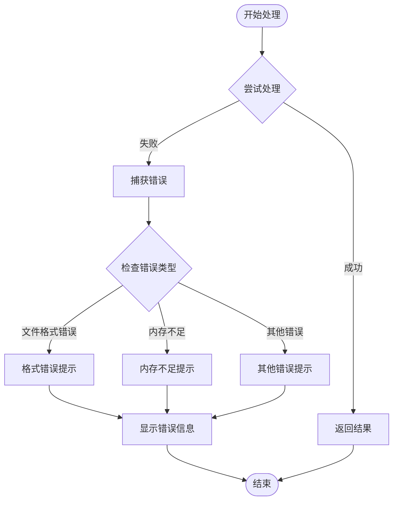

**图表来源**
- [AddPageNumbers.tsx:67-72](file://src/tools/pdf/add-page-numbers/AddPageNumbers.tsx#L67-L72)
- [ESign.tsx:140-145](file://src/tools/pdf/esign/ESign.tsx#L140-L145)

## 结论

PDF高级工具项目展现了现代浏览器端PDF处理的最佳实践。通过精心设计的架构和专业的技术选型，项目实现了：

1. **隐私保护**：所有处理都在浏览器本地完成，确保用户数据安全
2. **高性能**：使用专业PDF处理库，提供流畅的用户体验
3. **易用性**：直观的界面设计和丰富的配置选项
4. **可扩展性**：模块化的架构便于添加新的PDF功能

该项目为浏览器端PDF处理提供了一个完整的解决方案，既满足了专业用户的需求，又保持了良好的用户体验。通过持续的优化和功能扩展，该项目有望成为浏览器端PDF处理领域的标杆产品。

## 附录

### 国际化支持

项目支持21种语言，包括：
- 中文（简体、繁体）
- 英语
- 日语、韩语
- 法语、德语、西班牙语
- 俄语、阿拉伯语等

### 安全特性

- **零上传**：所有文件处理都在浏览器本地完成
- **离线可用**：支持PWA安装，完全离线使用
- **数据加密**：文件在传输过程中保持加密状态
- **隐私保护**：不收集用户个人信息

### 部署指南

项目支持静态部署到Cloudflare Pages等平台，构建后可直接部署。