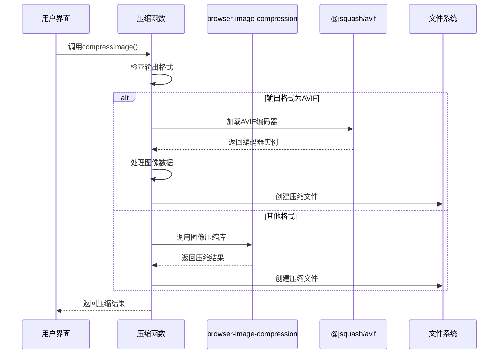
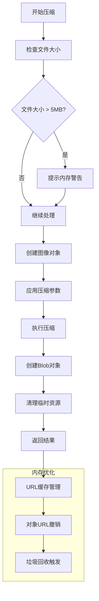
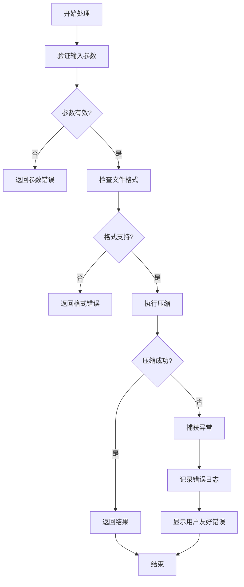

# 图像压缩工具

<cite>
**本文档引用的文件**
- [ImageCompress.tsx](file://src/tools/image/compress/ImageCompress.tsx)
- [logic.ts](file://src/tools/image/compress/logic.ts)
- [index.ts](file://src/tools/image/compress/index.ts)
- [ImageResultList.tsx](file://src/components/shared/ImageResultList.tsx)
- [formatFileSize.ts](file://src/lib/utils/formatFileSize.ts)
- [package.json](file://package.json)
- [tools-image.json](file://messages/zh-Hans/tools-image.json)
</cite>

## 目录
1. [简介](#简介)
2. [项目结构](#项目结构)
3. [核心组件](#核心组件)
4. [架构概览](#架构概览)
5. [详细组件分析](#详细组件分析)
6. [依赖关系分析](#依赖关系分析)
7. [性能考虑](#性能考虑)
8. [故障排除指南](#故障排除指南)
9. [结论](#结论)

## 简介

图像压缩工具是一个基于浏览器的图像处理解决方案，专门用于在客户端环境中压缩和转换图像文件。该工具利用 `browser-image-compression` 库实现高效的图像压缩，支持多种输出格式（JPEG、PNG、WebP、AVIF），并提供智能预设和自定义配置选项。

该工具的核心优势在于完全在浏览器中本地处理图像，无需上传到服务器，确保用户隐私和数据安全。所有处理过程都在用户的设备上完成，不会产生任何网络传输。

## 项目结构

图像压缩工具位于项目的图像处理工具集合中，采用模块化架构设计：

```mermaid
graph TB
subgraph "图像压缩工具模块"
A[ImageCompress.tsx<br/>主界面组件]
B[logic.ts<br/>压缩逻辑实现]
C[index.ts<br/>工具定义]
end
subgraph "共享组件"
D[ImageResultList.tsx<br/>结果列表组件]
E[ImageFileGrid.tsx<br/>文件网格组件]
end
subgraph "工具集合"
F[图像工具目录]
G[其他图像处理工具]
end
subgraph "依赖库"
H[browser-image-compression<br/>图像压缩库]
I[@jsquash/avif<br/>AVIF编码器]
J[next-intl<br/>国际化支持]
end
A --> B
A --> D
A --> E
B --> H
B --> I
F --> A
F --> G
```

**图表来源**
- [ImageCompress.tsx:1-373](file://src/tools/image/compress/ImageCompress.tsx#L1-L373)
- [logic.ts:1-135](file://src/tools/image/compress/logic.ts#L1-L135)
- [package.json:11-32](file://package.json#L11-L32)

**章节来源**
- [ImageCompress.tsx:1-373](file://src/tools/image/compress/ImageCompress.tsx#L1-L373)
- [logic.ts:1-135](file://src/tools/image/compress/logic.ts#L1-L135)
- [index.ts:1-37](file://src/tools/image/compress/index.ts#L1-L37)

## 核心组件

### 主界面组件 (ImageCompress)

主界面组件负责提供用户交互界面，包含文件上传、压缩参数配置、进度显示和结果展示等功能。

**主要功能特性：**
- 多文件上传支持
- 智能压缩预设（高质量、均衡、小文件）
- 自定义压缩参数配置
- 实时进度跟踪
- 压缩结果预览和下载
- 错误处理和用户反馈

**章节来源**
- [ImageCompress.tsx:63-373](file://src/tools/image/compress/ImageCompress.tsx#L63-L373)

### 压缩逻辑组件 (logic.ts)

压缩逻辑组件实现了核心的图像压缩算法和处理流程，支持多种输出格式和压缩策略。

**核心接口定义：**
- `CompressOptions`: 压缩配置选项
- `CompressResult`: 压缩结果数据结构
- `compressImage()`: 主压缩函数

**章节来源**
- [logic.ts:7-24](file://src/tools/image/compress/logic.ts#L7-L24)
- [logic.ts:83-123](file://src/tools/image/compress/logic.ts#L83-L123)

## 架构概览

图像压缩工具采用分层架构设计，确保代码的可维护性和扩展性：

```mermaid
graph TD
subgraph "用户界面层"
A[ImageCompress.tsx<br/>React组件]
B[ImageResultList.tsx<br/>结果展示]
C[ImageFileGrid.tsx<br/>文件上传]
end
subgraph "业务逻辑层"
D[compressImage()<br/>主压缩函数]
E[compressImageToAvif()<br/>AVIF专用压缩]
F[COMPRESSION_PRESETS<br/>预设配置]
end
subgraph "数据处理层"
G[browser-image-compression<br/>图像压缩库]
H[@jsquash/avif<br/>AVIF编码器]
I[Canvas API<br/>图像处理]
end
subgraph "工具层"
J[formatFileSize()<br/>文件大小格式化]
K[URL缓存管理<br/>内存优化]
end
A --> D
A --> B
A --> C
D --> G
D --> H
D --> I
B --> K
J --> A
```

**图表来源**
- [ImageCompress.tsx:13-21](file://src/tools/image/compress/ImageCompress.tsx#L13-L21)
- [logic.ts:1-135](file://src/tools/image/compress/logic.ts#L1-L135)
- [ImageResultList.tsx:24-50](file://src/components/shared/ImageResultList.tsx#L24-L50)

## 详细组件分析

### 压缩算法实现

压缩算法采用分层设计，针对不同输出格式提供专门的处理策略：



**图表来源**
- [logic.ts:83-123](file://src/tools/image/compress/logic.ts#L83-L123)
- [logic.ts:36-81](file://src/tools/image/compress/logic.ts#L36-L81)

### 压缩参数配置

系统提供多种压缩参数配置选项，支持智能预设和自定义设置：

**预设配置：**
- 高质量：90% 质量，最大 10MB，无分辨率限制
- 均衡：75% 质量，最大 1MB，无分辨率限制  
- 小文件：50% 质量，最大 1MB，最大 1920px 分辨率
- 自定义：可手动调整所有参数

**章节来源**
- [logic.ts:26-34](file://src/tools/image/compress/logic.ts#L26-L34)
- [ImageCompress.tsx:106-114](file://src/tools/image/compress/ImageCompress.tsx#L106-L114)

### 内存管理策略

为了优化内存使用和提升性能，系统采用了多项内存管理策略：



**图表来源**
- [ImageResultList.tsx:26-50](file://src/components/shared/ImageResultList.tsx#L26-L50)
- [ImageResultList.tsx:58-68](file://src/components/shared/ImageResultList.tsx#L58-L68)

**章节来源**
- [ImageResultList.tsx:24-76](file://src/components/shared/ImageResultList.tsx#L24-L76)

### 进度跟踪机制

系统提供了实时的进度跟踪功能，让用户了解压缩进程的状态：

**进度跟踪实现：**
- 总文件数统计
- 已完成文件计数
- 实时进度百分比
- 当前处理文件状态

**章节来源**
- [ImageCompress.tsx:175-178](file://src/tools/image/compress/ImageCompress.tsx#L175-L178)
- [ImageCompress.tsx:346-351](file://src/tools/image/compress/ImageCompress.tsx#L346-L351)

## 依赖关系分析

图像压缩工具依赖于多个关键库来实现其功能：

```mermaid
graph LR
subgraph "核心依赖"
A[browser-image-compression<br/>2.0.2]
B[@jsquash/avif<br/>2.1.1]
C[next-intl<br/>4.8.3]
end
subgraph "UI组件"
D[lucide-react<br/>0.577.0]
E[react<br/>19.2.3]
F[react-dom<br/>19.2.3]
end
subgraph "工具库"
G[fflate<br/>0.8.2]
H[clsx<br/>2.1.1]
I[tailwind-merge<br/>3.5.0]
end
subgraph "图像处理"
J[Canvas API<br/>浏览器内置]
K[Web Worker<br/>浏览器内置]
end
A --> J
B --> J
C --> E
D --> E
G --> A
H --> E
I --> E
```

**图表来源**
- [package.json:11-32](file://package.json#L11-L32)

**章节来源**
- [package.json:11-32](file://package.json#L11-L32)

### 第三方库功能说明

| 库名称 | 版本 | 功能描述 | 使用场景 |
|--------|------|----------|----------|
| browser-image-compression | ^2.0.2 | 主要图像压缩库 | JPEG/PNG/WebP格式压缩 |
| @jsquash/avif | ^2.1.1 | AVIF格式编码器 | AVIF格式专用压缩 |
| lucide-react | ^0.577.0 | 图标组件库 | 用户界面图标 |
| next-intl | ^4.8.3 | 国际化支持 | 多语言界面 |

**章节来源**
- [package.json:14-15](file://package.json#L14-L15)

## 性能考虑

### 压缩算法优化

系统在压缩算法方面采用了多项优化措施：

**质量参数设置：**
- 质量范围：10-100%
- 默认值：75%
- 对PNG格式无效的提示

**文件大小控制：**
- 最大大小：0.1-5MB
- 默认值：1MB
- 自动文件大小检测

**分辨率控制：**
- 最大分辨率：0-3840px
- 支持4K、2K、1920、1280、800等预设
- 自定义分辨率设置

### 内存使用优化

**URL缓存管理：**
- 使用WeakMap存储Blob到URL的映射
- 自动清理不再使用的URL
- 防止内存泄漏

**图像处理优化：**
- 使用ImageBitmap进行高效图像加载
- Canvas渲染优化
- Web Worker并行处理

**章节来源**
- [ImageResultList.tsx:24-50](file://src/components/shared/ImageResultList.tsx#L24-L50)
- [logic.ts:40-41](file://src/tools/image/compress/logic.ts#L40-L41)

## 故障排除指南

### 常见问题及解决方案

**问题1：压缩失败**
- 检查文件格式是否受支持
- 确认文件大小是否超过限制
- 验证浏览器兼容性

**问题2：内存不足**
- 减少同时处理的文件数量
- 降低质量参数设置
- 关闭其他占用内存的程序

**问题3：输出格式异常**
- 确认目标格式是否被浏览器支持
- 检查文件类型转换设置
- 验证输出格式兼容性

### 错误处理机制

系统实现了完善的错误处理机制：



**图表来源**
- [ImageCompress.tsx:167-177](file://src/tools/image/compress/ImageCompress.tsx#L167-L177)

**章节来源**
- [ImageCompress.tsx:167-177](file://src/tools/image/compress/ImageCompress.tsx#L167-L177)

### 用户体验优化

**进度反馈：**
- 实时显示压缩进度
- 提供剩余时间估算
- 支持取消操作

**错误提示：**
- 清晰的错误信息
- 可操作的解决方案
- 日志记录功能

**章节来源**
- [ImageCompress.tsx:353-357](file://src/tools/image/compress/ImageCompress.tsx#L353-L357)

## 结论

图像压缩工具是一个功能完善、性能优异的浏览器端图像处理解决方案。通过采用先进的压缩算法和优化的内存管理策略，该工具能够在保证图像质量的同时显著减小文件大小。

**主要优势：**
- 完全本地处理，确保隐私安全
- 支持多种输出格式和压缩策略
- 智能预设和自定义配置
- 实时进度跟踪和错误处理
- 优化的内存使用和性能表现

**适用场景：**
- 网站图片优化
- 社交媒体图片处理
- 邮件附件压缩
- 存储空间优化
- 批量图像处理

该工具为用户提供了便捷、高效的图像压缩解决方案，特别适合需要在客户端环境中处理大量图像文件的场景。通过持续的性能优化和功能扩展，该工具将继续为用户提供更好的服务体验。