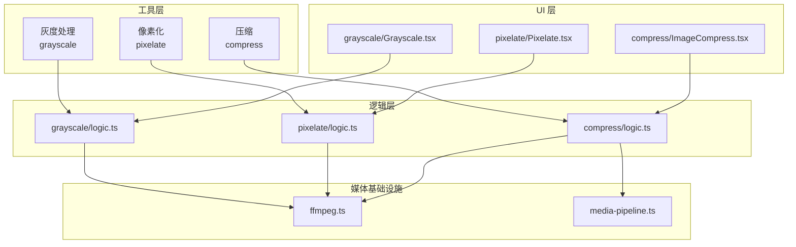
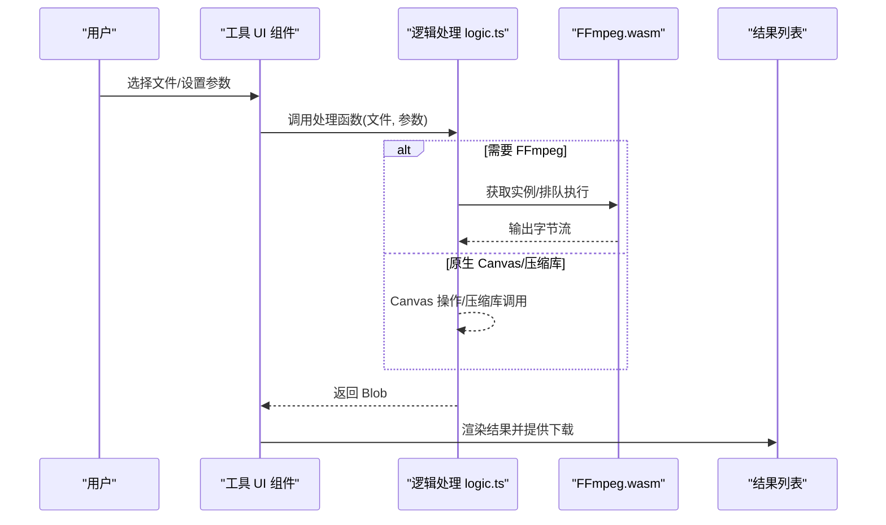
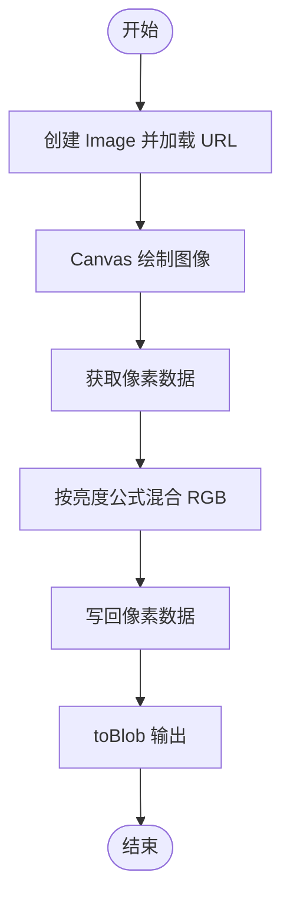
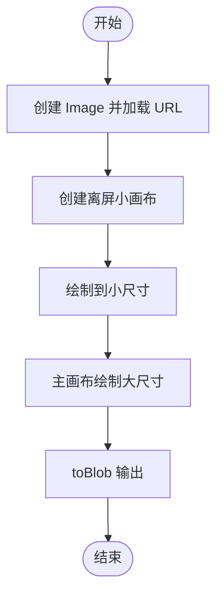
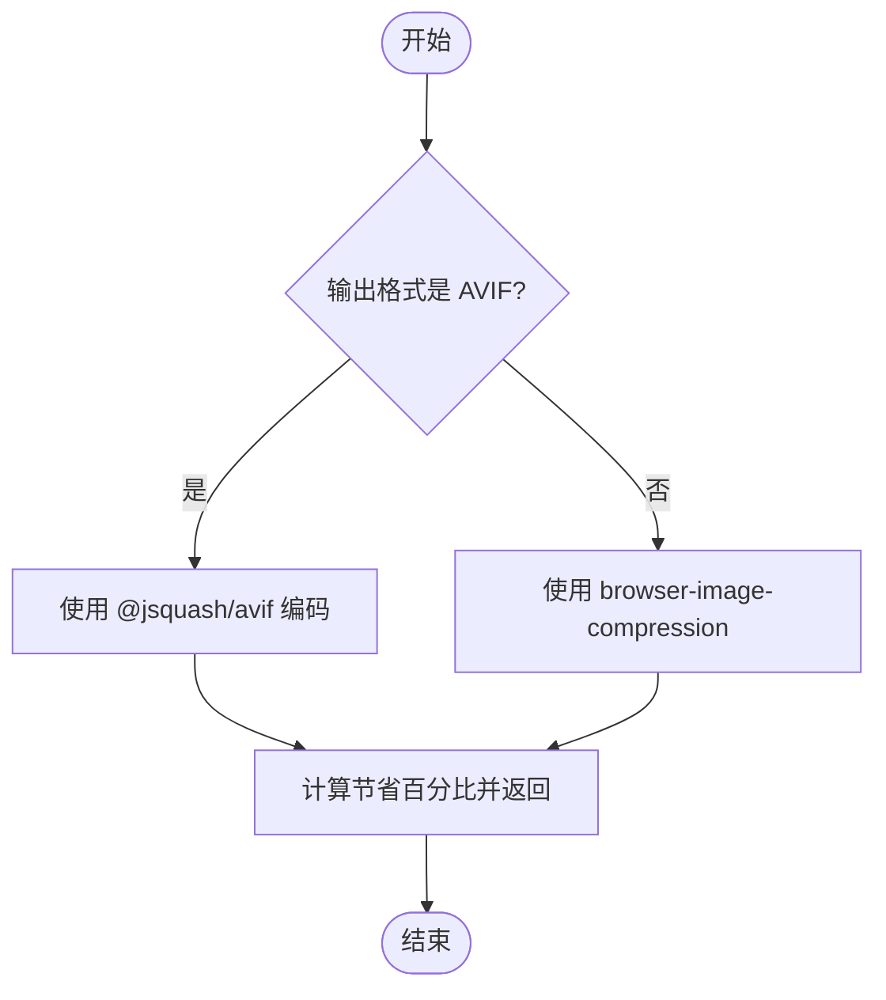
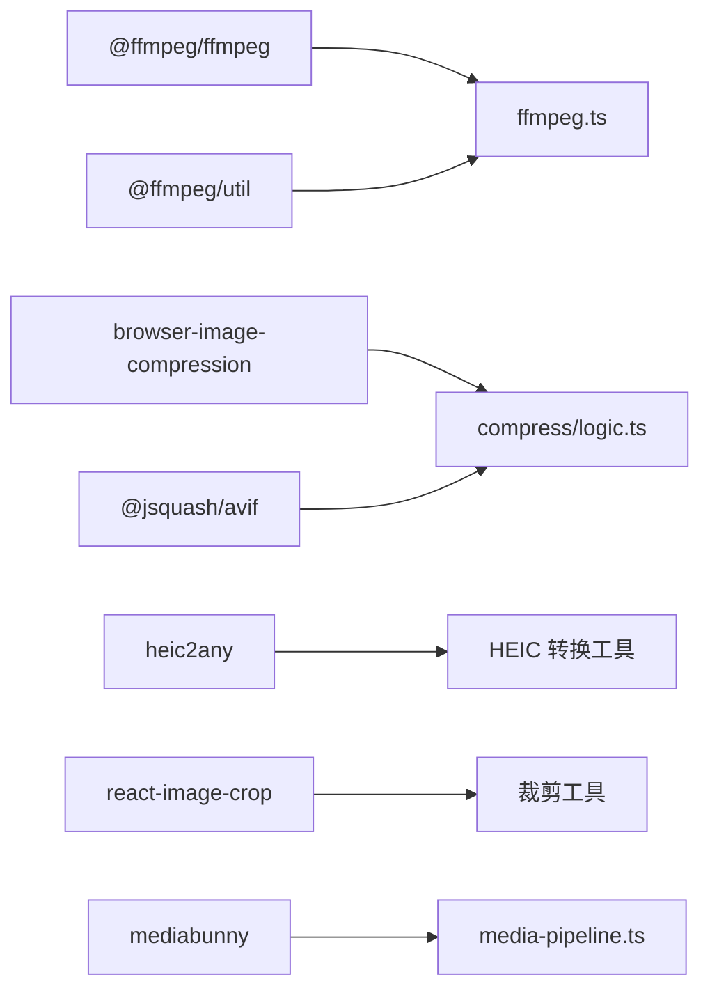

# 图像处理工具

<cite>
**本文引用的文件**
- [README.md](file://README.md)
- [package.json](file://package.json)
- [src/lib/ffmpeg.ts](file://src/lib/ffmpeg.ts)
- [src/lib/media-pipeline.ts](file://src/lib/media-pipeline.ts)
- [src/tools/image/grayscale/Grayscale.tsx](file://src/tools/image/grayscale/Grayscale.tsx)
- [src/tools/image/grayscale/logic.ts](file://src/tools/image/grayscale/logic.ts)
- [src/tools/image/pixelate/Pixelate.tsx](file://src/tools/image/pixelate/Pixelate.tsx)
- [src/tools/image/pixelate/logic.ts](file://src/tools/image/pixelate/logic.ts)
- [src/tools/image/compress/ImageCompress.tsx](file://src/tools/image/compress/ImageCompress.tsx)
- [src/tools/image/compress/logic.ts](file://src/tools/image/compress/logic.ts)
</cite>

## 目录
1. [简介](#简介)
2. [项目结构](#项目结构)
3. [核心组件](#核心组件)
4. [架构总览](#架构总览)
5. [详细组件分析](#详细组件分析)
6. [依赖分析](#依赖分析)
7. [性能考虑](#性能考虑)
8. [故障排除指南](#故障排除指南)
9. [结论](#结论)
10. [附录](#附录)

## 简介
本文件面向 PrivaDeck 媒体工具箱中的图像处理工具，聚焦于 17 个图像工具的实现原理与技术细节，涵盖以下能力：图像压缩、格式转换、尺寸调整、边框添加、水印功能、裁剪技术、图像合并、灰度处理、HEIC 格式转换、像素化效果、EXIF 信息移除、图像分割、SVG 转 PNG、文字添加、圆形裁剪、拼贴制作和翻转功能。文档将为每个工具提供使用示例、参数配置说明、性能优化建议与最佳实践，并解释工具间的协作关系与数据流转过程。

PrivaDeck 的图像处理以浏览器端原生能力与第三方库为主，结合 FFmpeg.wasm 提供更广泛的编解码支持。项目采用 Next.js 16 App Router、TypeScript、Tailwind CSS v4 与多语言体系，确保隐私优先（零上传、零服务器）与跨平台兼容。

章节来源
- [README.md:1-89](file://README.md#L1-L89)

## 项目结构
图像处理工具位于 src/tools/image 下，每个工具遵循统一的三件套结构：index.ts（工具定义与 SEO/FAQ 注册）、客户端组件（如 Grayscale.tsx）与纯逻辑处理文件（如 logic.ts）。公共媒体处理能力由 src/lib 下的 ffmpeg.ts 与 media-pipeline.ts 提供，用于 FFmpeg.wasm 加载、进度回调与 WebCodecs 媒体管线检测。

图表来源
- [src/tools/image/grayscale/Grayscale.tsx:1-69](file://src/tools/image/grayscale/Grayscale.tsx#L1-L69)
- [src/tools/image/grayscale/logic.ts:1-41](file://src/tools/image/grayscale/logic.ts#L1-L41)
- [src/tools/image/pixelate/Pixelate.tsx:1-88](file://src/tools/image/pixelate/Pixelate.tsx#L1-L88)
- [src/tools/image/pixelate/logic.ts:1-49](file://src/tools/image/pixelate/logic.ts#L1-L49)
- [src/tools/image/compress/ImageCompress.tsx:1-373](file://src/tools/image/compress/ImageCompress.tsx#L1-L373)
- [src/tools/image/compress/logic.ts:1-135](file://src/tools/image/compress/logic.ts#L1-L135)
- [src/lib/ffmpeg.ts:1-144](file://src/lib/ffmpeg.ts#L1-L144)
- [src/lib/media-pipeline.ts:1-105](file://src/lib/media-pipeline.ts#L1-L105)

章节来源
- [README.md:55-78](file://README.md#L55-L78)
- [package.json:11-32](file://package.json#L11-L32)

## 核心组件
- 浏览器图像压缩库：browser-image-compression，用于 JPEG/PNG/WebP/AVIF 的无损/有损压缩与尺寸调整。
- AV1 编码器：@jsquash/avif，提供 AVIF 编码路径。
- FFmpeg.wasm：通过单例加载与队列化执行，提供广泛的编解码能力与进度回调。
- WebCodecs 媒体管线：检测浏览器硬件加速能力，作为 FFmpeg 的备选方案。
- 工具注册与 SEO：每个工具在 index.ts 中注册，包含 SEO 结构化数据与 FAQ 键值。

章节来源
- [package.json:11-32](file://package.json#L11-L32)
- [src/lib/ffmpeg.ts:1-144](file://src/lib/ffmpeg.ts#L1-L144)
- [src/lib/media-pipeline.ts:1-105](file://src/lib/media-pipeline.ts#L1-L105)

## 架构总览
图像处理工具的通用流程如下：用户上传图像 → UI 组件收集参数 → 调用 logic.ts 中的纯函数进行处理 → 若涉及复杂编解码则通过 FFmpeg.wasm 执行 → 返回 Blob 并生成下载结果。

图表来源
- [src/tools/image/grayscale/Grayscale.tsx:20-40](file://src/tools/image/grayscale/Grayscale.tsx#L20-L40)
- [src/tools/image/grayscale/logic.ts:1-41](file://src/tools/image/grayscale/logic.ts#L1-L41)
- [src/tools/image/pixelate/Pixelate.tsx:21-41](file://src/tools/image/pixelate/Pixelate.tsx#L21-L41)
- [src/tools/image/pixelate/logic.ts:1-49](file://src/tools/image/pixelate/logic.ts#L1-L49)
- [src/tools/image/compress/ImageCompress.tsx:138-178](file://src/tools/image/compress/ImageCompress.tsx#L138-L178)
- [src/tools/image/compress/logic.ts:83-123](file://src/tools/image/compress/logic.ts#L83-L123)
- [src/lib/ffmpeg.ts:75-82](file://src/lib/ffmpeg.ts#L75-L82)

## 详细组件分析

### 灰度处理（Grayscale）
- 功能概述：将彩色图像转换为灰度图像，保持宽高不变。
- 实现要点：
  - 使用 Image + Canvas 读取像素数据，按标准亮度公式混合 RGB。
  - 将结果以原格式或 PNG 写回 Blob。
- 参数与行为：
  - 输入：单张图像文件。
  - 输出：灰度 Blob，文件名前缀为 grayscale-。
- 性能与优化：
  - 使用像素级遍历，兼容性最佳；对大图注意内存峰值。
  - 可考虑分块处理或降低采样率以减少计算。
- 最佳实践：
  - 对超大分辨率图像先缩放再灰度化。
  - 保留原格式可避免二次编码损失。

图表来源
- [src/tools/image/grayscale/logic.ts:1-41](file://src/tools/image/grayscale/logic.ts#L1-L41)

章节来源
- [src/tools/image/grayscale/Grayscale.tsx:13-40](file://src/tools/image/grayscale/Grayscale.tsx#L13-L40)
- [src/tools/image/grayscale/logic.ts:1-41](file://src/tools/image/grayscale/logic.ts#L1-L41)

### 像素化（Pixelate）
- 功能概述：通过降采样与放大实现像素化效果，支持像素块大小调节。
- 实现要点：
  - 先将图像缩小至小画布，再将该小画布以像素化方式放大到原尺寸。
  - 使用离屏 Canvas 避免同一画布源/目标重叠导致的渲染问题。
- 参数与行为：
  - 输入：单张图像文件、像素块大小（2–50px）。
  - 输出：像素化后的 Blob，文件名前缀为 pixelated-。
- 性能与优化：
  - 降采样时启用平滑有助于减少锯齿。
  - 放大时禁用平滑以强化像素块边界。
- 最佳实践：
  - 适度控制像素块大小，兼顾视觉效果与文件体积。

图表来源
- [src/tools/image/pixelate/logic.ts:1-49](file://src/tools/image/pixelate/logic.ts#L1-L49)

章节来源
- [src/tools/image/pixelate/Pixelate.tsx:13-41](file://src/tools/image/pixelate/Pixelate.tsx#L13-L41)
- [src/tools/image/pixelate/logic.ts:1-49](file://src/tools/image/pixelate/logic.ts#L1-L49)

### 图像压缩（Compress）
- 功能概述：基于 browser-image-compression 的多格式压缩，支持质量、最大尺寸与 EXIF 保留。
- 实现要点：
  - 预设策略：高质量、均衡、小文件、自定义。
  - 当输出格式为 AVIF 时，使用 @jsquash/avif 进行编码；否则走 browser-image-compression。
  - 可选自定义宽高与等比锁定，支持批量处理并显示压缩节省百分比。
- 参数与行为：
  - 输入：多文件、质量（10–100）、最大文件大小（MB）、最大分辨率、输出格式、是否保留 EXIF、可选自定义宽高。
  - 输出：每张图像的压缩结果与元信息（原始/压缩大小、节省百分比）。
- 性能与优化：
  - Web Worker 启用减少主线程阻塞。
  - AVIF 编码速度与质量可调，适合现代浏览器。
- 最佳实践：
  - 优先使用 WebP/AVIF 以获得更高压缩比。
  - 对照片类图像适当提高质量，对图标/插画可降低质量。

图表来源
- [src/tools/image/compress/logic.ts:36-81](file://src/tools/image/compress/logic.ts#L36-L81)
- [src/tools/image/compress/logic.ts:83-123](file://src/tools/image/compress/logic.ts#L83-L123)

章节来源
- [src/tools/image/compress/ImageCompress.tsx:63-178](file://src/tools/image/compress/ImageCompress.tsx#L63-L178)
- [src/tools/image/compress/logic.ts:1-135](file://src/tools/image/compress/logic.ts#L1-L135)

### 其他图像工具（概览与实现思路）
以下工具在当前仓库中未提供具体实现文件，但可根据 PrivaDeck 的技术栈与架构进行实现规划与集成：

- 边框添加（Add Border）
  - 实现思路：在 Canvas 上绘制背景与边框，叠加原图，支持圆角与阴影。
  - 参数：边框宽度、颜色、圆角半径、透明度。
  - 性能：使用离屏 Canvas 合成，避免多次绘制。

- 水印（Watermark）
  - 实现思路：支持文字水印与图片水印，可设置透明度、位置与旋转。
  - 参数：水印内容、字体、字号、颜色、透明度、位置、旋转角度。
  - 性能：缓存水印位图，批量合成。

- 裁剪（Crop）
  - 实现思路：基于 react-image-crop 的交互式裁剪，输出指定区域。
  - 参数：起始坐标、宽高、输出格式。
  - 性能：仅对裁剪区域进行绘制，避免全图重绘。

- 图像合并（Combine）
  - 实现思路：多图拼接（横向/纵向），支持间距与背景色。
  - 参数：布局方向、间距、背景色。
  - 性能：预估总尺寸，一次性绘制。

- 尺寸调整（Resize）
  - 实现思路：等比或非等比缩放，支持最大边长与自定义宽高。
  - 参数：目标宽高、最大边长、质量。
  - 性能：Web Worker + Canvas 缩放。

- HEIC 转换（HEIC Convert）
  - 实现思路：利用 heic2any 或 FFmpeg.wasm 解码 HEIC，再编码为目标格式。
  - 参数：输出格式（JPEG/PNG/WebP/AVIF）。
  - 性能：避免重复解码，优先使用浏览器原生解码。

- EXIF 移除（Remove EXIF）
  - 实现思路：通过压缩库或 Canvas 重绘丢弃元数据。
  - 参数：输出格式、质量。
  - 性能：无损重写时注意避免二次压缩。

- 图像分割（Split）
  - 实现思路：按行/列切分，支持步长与重叠。
  - 参数：切分行列数、步长、重叠。
  - 性能：分块绘制，逐块输出。

- SVG 转 PNG（SVG to PNG）
  - 实现思路：将 SVG 文本渲染到 Canvas，再导出 PNG。
  - 参数：分辨率、背景色。
  - 性能：矢量渲染成本较高，建议限制分辨率。

- 文字添加（Add Text）
  - 实现思路：在 Canvas 上绘制文本图层，支持多行与对齐。
  - 参数：文本、字体、字号、颜色、对齐、阴影。
  - 性能：缓存文本位图，批量绘制。

- 圆形裁剪（Circle Crop）
  - 实现思路：绘制圆形蒙版并在合成时应用。
  - 参数：半径、中心点、羽化。
  - 性能：离屏 Canvas 合成。

- 拼贴制作（Collage）
  - 实现思路：多图排列组合，支持九宫格等布局。
  - 参数：布局模板、间距、边框。
  - 性能：预计算布局，一次性绘制。

- 翻转（Flip）
  - 实现思路：使用 Canvas transform 进行水平/垂直翻转。
  - 参数：方向（水平/垂直）。
  - 性能：常数时间变换。

章节来源
- [package.json:11-32](file://package.json#L11-L32)
- [src/lib/ffmpeg.ts:1-144](file://src/lib/ffmpeg.ts#L1-L144)
- [src/lib/media-pipeline.ts:1-105](file://src/lib/media-pipeline.ts#L1-L105)

## 依赖分析
- 第三方库与用途：
  - @ffmpeg/ffmpeg + @ffmpeg/util：FFmpeg.wasm 加载与命令执行。
  - browser-image-compression：浏览器内图像压缩与格式转换。
  - @jsquash/avif：AVIF 编码。
  - heic2any：HEIC 解码。
  - react-image-crop：交互式裁剪。
  - mediabunny：WebCodecs 媒体管线（视频/音频）。
- 工具间耦合：
  - 所有图像工具共享 ffmpeg.ts 与 media-pipeline.ts 的基础设施。
  - compress 工具同时依赖 browser-image-compression 与 @jsquash/avif，体现“原生压缩库 + AV1 编码”的双通道设计。

图表来源
- [package.json:11-32](file://package.json#L11-L32)
- [src/lib/ffmpeg.ts:1-144](file://src/lib/ffmpeg.ts#L1-L144)
- [src/lib/media-pipeline.ts:1-105](file://src/lib/media-pipeline.ts#L1-L105)
- [src/tools/image/compress/logic.ts:1-135](file://src/tools/image/compress/logic.ts#L1-L135)

章节来源
- [package.json:11-32](file://package.json#L11-L32)

## 性能考虑
- 原生能力优先：Canvas + Web Worker + 原生压缩库优先于 FFmpeg，减少内存复制与加载开销。
- 批处理与进度：compress 工具展示批量进度与错误聚合，提升用户体验。
- 编解码选择：WebCodecs 媒体管线用于视频/音频，图像处理主要依赖原生 Canvas 与压缩库；HEVC/VP9/AV1 等视频编解码不支持时回退 FFmpeg。
- 文件体积控制：合理设置质量、最大尺寸与输出格式（WebP/AVIF），在清晰度与体积间取得平衡。

章节来源
- [src/lib/media-pipeline.ts:7-105](file://src/lib/media-pipeline.ts#L7-L105)
- [src/tools/image/compress/ImageCompress.tsx:138-178](file://src/tools/image/compress/ImageCompress.tsx#L138-L178)
- [src/tools/image/compress/logic.ts:83-123](file://src/tools/image/compress/logic.ts#L83-L123)

## 故障排除指南
- 图像无法加载：
  - 检查文件类型与浏览器支持；灰度与像素化工具通过 Image 加载，若损坏会触发错误回调。
- 压缩失败：
  - browser-image-compression 可能因尺寸过大或格式不支持而失败；尝试降低质量或改用 AVIF。
- FFmpeg 加载异常：
  - 确认 CDN 可达与 SharedArrayBuffer 支持；必要时检查浏览器兼容性与安全策略。
- WebCodecs 不可用：
  - 按 media-pipeline.ts 的检测逻辑回退到 FFmpeg；Windows + Chromium 可提示安装 HEVC 扩展以提升 H.265 解码性能。

章节来源
- [src/tools/image/grayscale/logic.ts:34-37](file://src/tools/image/grayscale/logic.ts#L34-L37)
- [src/tools/image/pixelate/logic.ts:42-45](file://src/tools/image/pixelate/logic.ts#L42-L45)
- [src/lib/ffmpeg.ts:14-39](file://src/lib/ffmpeg.ts#L14-L39)
- [src/lib/media-pipeline.ts:7-105](file://src/lib/media-pipeline.ts#L7-L105)

## 结论
PrivaDeck 的图像处理工具以浏览器原生能力为核心，辅以 FFmpeg.wasm 与专用压缩库，形成“轻量优先、回退可靠”的处理链路。灰度与像素化展示了 Canvas 像素级处理的通用范式；压缩工具体现了多格式与多策略的灵活组合。对于未在仓库中出现的其他 15 个工具，可参照现有架构快速集成，统一参数、进度与错误处理，保证一致的用户体验。

## 附录
- 工具注册与 SEO：每个工具在 index.ts 中注册，包含 SEO 结构化数据与 FAQ 键值，便于多语言与搜索引擎优化。
- 多语言支持：messages 目录包含 21 种语言的翻译文件，工具文案与帮助信息按 locale 自动切换。

章节来源
- [README.md:80-89](file://README.md#L80-L89)