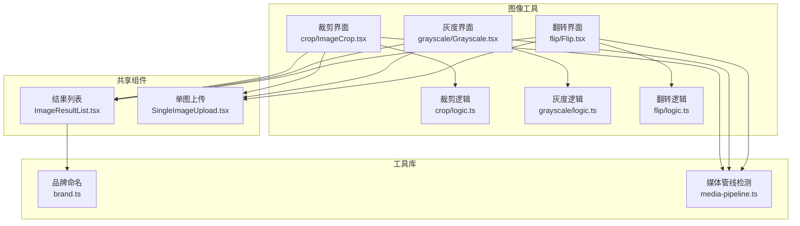
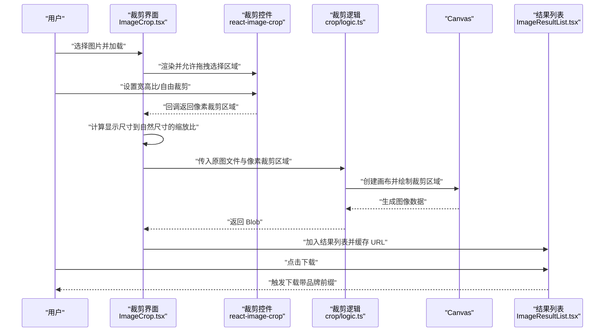
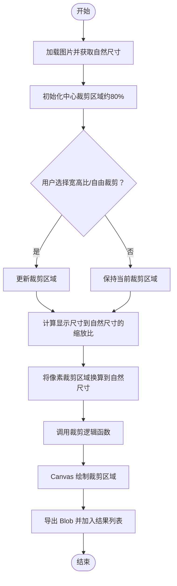
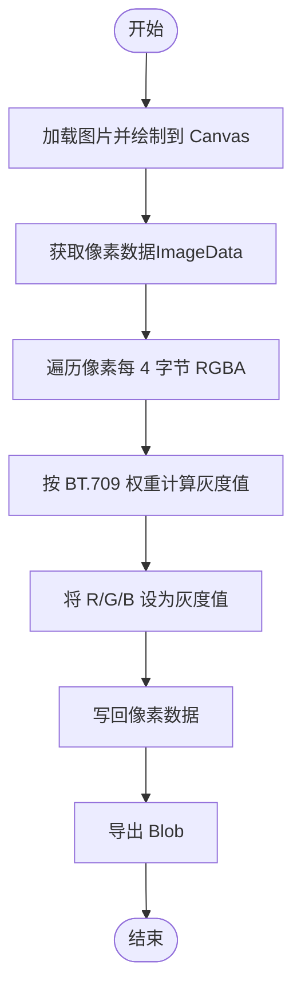
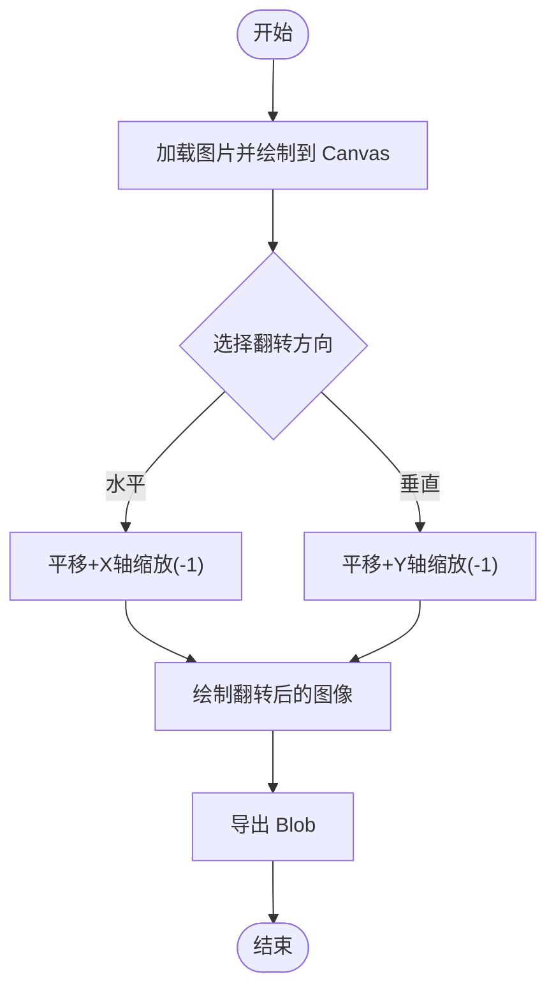
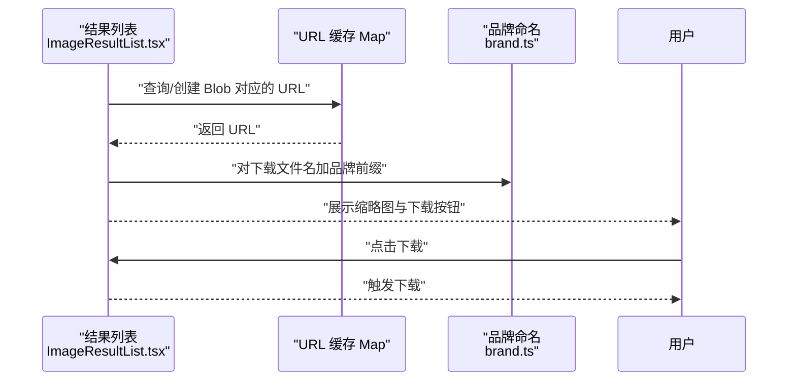
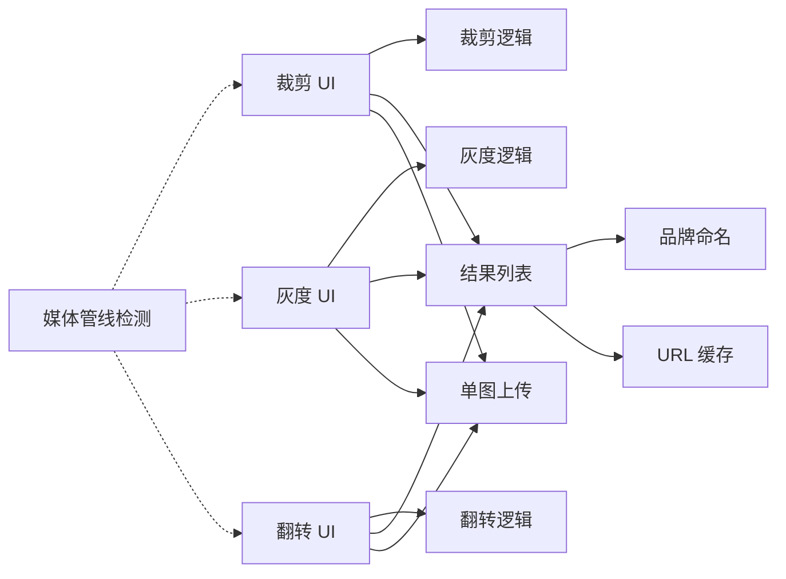

# 图像编辑工具

<cite>
**本文引用的文件**
- [README.md](file://README.md)
- [src/tools/image/crop/logic.ts](file://src/tools/image/crop/logic.ts)
- [src/tools/image/crop/ImageCrop.tsx](file://src/tools/image/crop/ImageCrop.tsx)
- [src/tools/image/grayscale/logic.ts](file://src/tools/image/grayscale/logic.ts)
- [src/tools/image/grayscale/Grayscale.tsx](file://src/tools/image/grayscale/Grayscale.tsx)
- [src/tools/image/flip/logic.ts](file://src/tools/image/flip/logic.ts)
- [src/tools/image/flip/Flip.tsx](file://src/tools/image/flip/Flip.tsx)
- [src/components/shared/ImageResultList.tsx](file://src/components/shared/ImageResultList.tsx)
- [src/components/shared/SingleImageUpload.tsx](file://src/components/shared/SingleImageUpload.tsx)
- [src/lib/media-pipeline.ts](file://src/lib/media-pipeline.ts)
- [src/lib/brand.ts](file://src/lib/brand.ts)
</cite>

## 目录
1. [简介](#简介)
2. [项目结构](#项目结构)
3. [核心组件](#核心组件)
4. [架构总览](#架构总览)
5. [详细组件分析](#详细组件分析)
6. [依赖关系分析](#依赖关系分析)
7. [性能考量](#性能考量)
8. [故障排查指南](#故障排查指南)
9. [结论](#结论)
10. [附录](#附录)

## 简介
本技术文档聚焦于图像编辑工具中的三大核心能力：图像裁剪、灰度转换与图像翻转。文档从实现原理、坐标计算、边界处理、算法差异与视觉影响、像素重排算法、交互式裁剪与批量编辑、预览与下载、撤销重做机制、性能优化策略以及用户体验设计等方面进行系统阐述，并提供通用最佳实践与创意应用建议。

## 项目结构
本项目采用 Next.js App Router 结构，图像工具位于 src/tools/image 下，每个工具由三部分组成：逻辑层 logic.ts（纯函数处理）、界面层 {Tool}.tsx（客户端组件）、以及共享组件与工具库（如结果列表、上传组件、品牌命名、媒体管线检测等）。图像裁剪、灰度转换、翻转三个工具均遵循该模式，确保职责清晰、可维护性强。

**图表来源**
- [src/tools/image/crop/ImageCrop.tsx:1-196](file://src/tools/image/crop/ImageCrop.tsx#L1-L196)
- [src/tools/image/crop/logic.ts:1-59](file://src/tools/image/crop/logic.ts#L1-L59)
- [src/tools/image/grayscale/Grayscale.tsx:1-69](file://src/tools/image/grayscale/Grayscale.tsx#L1-L69)
- [src/tools/image/grayscale/logic.ts:1-41](file://src/tools/image/grayscale/logic.ts#L1-L41)
- [src/tools/image/flip/Flip.tsx:1-87](file://src/tools/image/flip/Flip.tsx#L1-L87)
- [src/tools/image/flip/logic.ts:1-43](file://src/tools/image/flip/logic.ts#L1-L43)
- [src/components/shared/ImageResultList.tsx:1-141](file://src/components/shared/ImageResultList.tsx#L1-L141)
- [src/components/shared/SingleImageUpload.tsx:1-180](file://src/components/shared/SingleImageUpload.tsx#L1-L180)
- [src/lib/brand.ts:1-7](file://src/lib/brand.ts#L1-L7)
- [src/lib/media-pipeline.ts:1-105](file://src/lib/media-pipeline.ts#L1-L105)

**章节来源**
- [README.md:1-89](file://README.md#L1-L89)

## 核心组件
- 裁剪组件：基于 react-image-crop 提供交互式裁剪，支持固定宽高比与自由裁剪；通过缩放比例将显示尺寸的像素裁剪区域换算到原图自然尺寸，再调用 Canvas 绘制与导出 Blob。
- 灰度转换组件：读取图像像素数据，按加权平均法（ITU-R BT.709 权重）对 RGB 通道进行灰度化，再写回 Canvas 并导出。
- 翻转组件：根据方向选择水平或垂直翻转，利用 Canvas 的平移与缩放矩阵实现像素重排，保持原分辨率输出。
- 结果展示与下载：统一使用 ImageResultList 展示缩略图、文件名、元信息与下载按钮；通过 URL 对象缓存避免重复创建与内存泄漏；品牌前缀统一下载文件名。
- 单图上传：提供拖拽上传、尺寸与大小预览、错误状态提示与缩略图点击放大。

**章节来源**
- [src/tools/image/crop/ImageCrop.tsx:1-196](file://src/tools/image/crop/ImageCrop.tsx#L1-L196)
- [src/tools/image/crop/logic.ts:1-59](file://src/tools/image/crop/logic.ts#L1-L59)
- [src/tools/image/grayscale/Grayscale.tsx:1-69](file://src/tools/image/grayscale/Grayscale.tsx#L1-L69)
- [src/tools/image/grayscale/logic.ts:1-41](file://src/tools/image/grayscale/logic.ts#L1-L41)
- [src/tools/image/flip/Flip.tsx:1-87](file://src/tools/image/flip/Flip.tsx#L1-L87)
- [src/tools/image/flip/logic.ts:1-43](file://src/tools/image/flip/logic.ts#L1-L43)
- [src/components/shared/ImageResultList.tsx:1-141](file://src/components/shared/ImageResultList.tsx#L1-L141)
- [src/components/shared/SingleImageUpload.tsx:1-180](file://src/components/shared/SingleImageUpload.tsx#L1-L180)
- [src/lib/brand.ts:1-7](file://src/lib/brand.ts#L1-L7)

## 架构总览
以下序列图展示了“交互式裁剪”到“结果导出”的完整流程，涵盖坐标换算、Canvas 渲染与 Blob 导出。

**图表来源**
- [src/tools/image/crop/ImageCrop.tsx:97-121](file://src/tools/image/crop/ImageCrop.tsx#L97-L121)
- [src/tools/image/crop/logic.ts:8-58](file://src/tools/image/crop/logic.ts#L8-L58)
- [src/components/shared/ImageResultList.tsx:62-68](file://src/components/shared/ImageResultList.tsx#L62-L68)
- [src/lib/brand.ts:3-6](file://src/lib/brand.ts#L3-L6)

## 详细组件分析

### 图像裁剪组件分析
- 选择区域确定：使用 react-image-crop 提供的交互式选择器，支持固定宽高比与自由裁剪；初始中心裁剪覆盖约 80% 的图像区域，便于用户快速定位。
- 坐标计算：将显示尺寸下的像素裁剪区域按“自然宽度/显示宽度”和“自然高度/显示高度”的缩放比映射到原图自然尺寸，保证裁剪精度。
- 裁剪边界处理：Canvas drawImage 的源矩形与目标矩形分别用于指定裁剪区域与输出尺寸，最终以原图质量导出 Blob。
- 交互式裁剪：提供多种常用宽高比按钮，支持动态重置居中裁剪区域；裁剪按钮禁用条件与加载状态明确，提升可用性。
- 批量编辑：当前裁剪工具为单图处理；若需批量，可在上层容器中循环调用逻辑函数并汇总结果。
- 预览功能：裁剪完成后将 Blob 缓存为 URL 并在网格中预览，支持点击放大查看细节。

**图表来源**
- [src/tools/image/crop/ImageCrop.tsx:49-121](file://src/tools/image/crop/ImageCrop.tsx#L49-L121)
- [src/tools/image/crop/logic.ts:12-58](file://src/tools/image/crop/logic.ts#L12-L58)

**章节来源**
- [src/tools/image/crop/ImageCrop.tsx:16-95](file://src/tools/image/crop/ImageCrop.tsx#L16-L95)
- [src/tools/image/crop/ImageCrop.tsx:97-121](file://src/tools/image/crop/ImageCrop.tsx#L97-L121)
- [src/tools/image/crop/logic.ts:8-58](file://src/tools/image/crop/logic.ts#L8-L58)

### 灰度转换组件分析
- 算法实现：读取图像像素数据，逐像素按加权平均法（0.299*R + 0.587*G + 0.114*B）计算灰度值，并将 R、G、B 三通道设为相同灰度值，最后写回 Canvas 并导出 Blob。
- ITU-R BT.709 标准：权重 0.299、0.587、0.114 来源于 ITU-R BT.709，用于计算亮度分量 Y，能较好匹配人眼对不同波长光的敏感度，视觉效果更自然。
- 不同灰度算法的视觉影响：
  - 加权平均法（BT.709）：更贴近人眼感知，适合照片类图像；色彩信息损失较少，保留更多细节。
  - 等权重平均法（R+G+B)/3：计算简单但视觉偏绿或偏蓝，因人眼对绿光更敏感。
  - 其他权重方案（如 ITU-R BT.601）：在专业视频领域使用，与 BT.709 差异较小但在极端色彩下略有不同。
- 性能与兼容性：通过像素级遍历实现，兼容性最佳；对于超大图可考虑分块处理或 Worker 以避免主线程阻塞。

**图表来源**
- [src/tools/image/grayscale/logic.ts:5-39](file://src/tools/image/grayscale/logic.ts#L5-L39)

**章节来源**
- [src/tools/image/grayscale/Grayscale.tsx:20-40](file://src/tools/image/grayscale/Grayscale.tsx#L20-L40)
- [src/tools/image/grayscale/logic.ts:1-41](file://src/tools/image/grayscale/logic.ts#L1-L41)

### 图像翻转组件分析
- 水平翻转：通过 Canvas 平移至右边界后沿 X 轴缩放 -1 实现镜像翻转；保持原图分辨率不变。
- 垂直翻转：通过 Canvas 平移至下边界后沿 Y 轴缩放 -1 实现上下翻转；同样保持原图分辨率。
- 像素重排算法：本质上是将每个像素点 (x, y) 映射到 (w-1-x, y) 或 (x, h-1-y)，利用矩阵变换减少显式循环，提高效率。
- 输出质量：翻转后仍以原图格式与质量导出 Blob，确保无二次压缩损失。

**图表来源**
- [src/tools/image/flip/logic.ts:14-21](file://src/tools/image/flip/logic.ts#L14-L21)

**章节来源**
- [src/tools/image/flip/Flip.tsx:23-43](file://src/tools/image/flip/Flip.tsx#L23-L43)
- [src/tools/image/flip/logic.ts:1-43](file://src/tools/image/flip/logic.ts#L1-L43)

### 预览与下载机制
- URL 缓存：使用 Map 缓存 Blob→URL，仅在结果变化时创建/撤销 URL，避免内存泄漏与重复创建。
- 品牌前缀：下载文件名统一加上品牌前缀，提升产品识别度。
- 预览弹窗：点击缩略图打开全屏预览，关闭后自动清理状态。

**图表来源**
- [src/components/shared/ImageResultList.tsx:26-56](file://src/components/shared/ImageResultList.tsx#L26-L56)
- [src/lib/brand.ts:3-6](file://src/lib/brand.ts#L3-L6)

**章节来源**
- [src/components/shared/ImageResultList.tsx:21-141](file://src/components/shared/ImageResultList.tsx#L21-L141)
- [src/lib/brand.ts:1-7](file://src/lib/brand.ts#L1-L7)

## 依赖关系分析
- 工具层依赖：各工具的 UI 组件依赖 logic.ts 的纯函数处理；结果列表依赖品牌命名与 URL 缓存；上传组件负责文件选择与预览。
- 浏览器特性检测：媒体管线检测模块提供 WebCodecs 支持判断与错误类型，用于视频/音频处理的降级策略；图像工具当前不依赖该模块，但整体架构已预留扩展空间。
- 第三方库：裁剪使用 react-image-crop；灰度与翻转使用 Canvas API；压缩工具使用 browser-image-compression 与 @jsquash/avif（独立模块）。

**图表来源**
- [src/tools/image/crop/ImageCrop.tsx:1-196](file://src/tools/image/crop/ImageCrop.tsx#L1-L196)
- [src/tools/image/crop/logic.ts:1-59](file://src/tools/image/crop/logic.ts#L1-L59)
- [src/tools/image/grayscale/Grayscale.tsx:1-69](file://src/tools/image/grayscale/Grayscale.tsx#L1-L69)
- [src/tools/image/grayscale/logic.ts:1-41](file://src/tools/image/grayscale/logic.ts#L1-L41)
- [src/tools/image/flip/Flip.tsx:1-87](file://src/tools/image/flip/Flip.tsx#L1-L87)
- [src/tools/image/flip/logic.ts:1-43](file://src/tools/image/flip/logic.ts#L1-L43)
- [src/components/shared/ImageResultList.tsx:1-141](file://src/components/shared/ImageResultList.tsx#L1-L141)
- [src/components/shared/SingleImageUpload.tsx:1-180](file://src/components/shared/SingleImageUpload.tsx#L1-L180)
- [src/lib/media-pipeline.ts:1-105](file://src/lib/media-pipeline.ts#L1-L105)

**章节来源**
- [src/lib/media-pipeline.ts:7-14](file://src/lib/media-pipeline.ts#L7-L14)

## 性能考量
- Canvas 像素操作：灰度与翻转均基于 Canvas，适合在主线程执行；对超大图建议限制最大边长或采用 Web Worker 分块处理，避免长时间占用主线程。
- URL 对象管理：结果列表使用 Map 缓存 Blob→URL，及时撤销不再使用的对象，防止内存泄漏。
- 图像预览：上传组件在切换文件时先加载新预览再撤销旧 URL，避免闪烁与资源浪费。
- 导出质量：导出时使用接近原图质量的参数，避免二次压缩带来的质量损失。
- 批量处理：批量场景下可串行或并行处理，结合进度反馈与错误聚合，提升吞吐与可观测性。

[本节为通用性能建议，不直接分析具体文件]

## 故障排查指南
- 裁剪失败：检查 Canvas 上下文是否可用、drawImage 参数是否合法、导出 Blob 是否为空；确认文件读取成功与图片加载完成。
- 灰度转换异常：确认 ImageData 获取成功、像素数组长度为 4 的倍数、写回像素数据后重新 putImageData。
- 翻转无效：检查方向参数、Canvas 平移与缩放顺序是否正确；确保绘制后导出 Blob 成功。
- 下载失败：确认 Blob 存在且 URL 已创建；检查下载链接与文件名前缀逻辑。
- 错误上报：工具组件使用分析埋点记录处理耗时与错误原因，便于定位问题。

**章节来源**
- [src/tools/image/crop/logic.ts:23-26](file://src/tools/image/crop/logic.ts#L23-L26)
- [src/tools/image/crop/logic.ts:42-46](file://src/tools/image/crop/logic.ts#L42-L46)
- [src/tools/image/grayscale/logic.ts:21-32](file://src/tools/image/grayscale/logic.ts#L21-L32)
- [src/tools/image/flip/logic.ts:23-34](file://src/tools/image/flip/logic.ts#L23-L34)
- [src/components/shared/ImageResultList.tsx:62-68](file://src/components/shared/ImageResultList.tsx#L62-L68)

## 结论
本图像编辑工具以“纯前端、零上传”为核心理念，围绕裁剪、灰度与翻转三大功能构建了清晰的三层架构：UI 层负责交互与状态管理，逻辑层专注纯函数处理，共享组件统一结果展示与下载。通过 ITU-R BT.709 权重实现自然灰度效果，利用 Canvas 矩阵实现高效翻转，配合 URL 缓存与品牌前缀保障性能与用户体验。未来可在批量处理、撤销重做、WebCodecs 降级路径等方面进一步增强。

[本节为总结性内容，不直接分析具体文件]

## 附录
- 使用示例（概念性说明）
  - 交互式裁剪：选择图片→设置宽高比/自由裁剪→点击裁剪→预览并下载。
  - 批量编辑：在上层容器循环调用裁剪/灰度/翻转逻辑，聚合结果并统一下载。
  - 预览功能：结果列表自动缓存 URL，支持缩略图点击放大与下载。
- 撤销重做机制（建议）
  - 采用命令模式记录每一步操作（裁剪区域、灰度参数、翻转方向），支持撤销与重做。
  - 状态快照保存在栈中，每次操作生成新快照，避免直接修改历史状态。
- 最佳实践与创意应用
  - 裁剪：优先使用原图分辨率导出；提供常见平台尺寸预设；支持多图批量导出。
  - 灰度：根据用途选择 BT.709 或等权平均；注意对比度与细节保留。
  - 翻转：批量处理时注意方向一致性；与旋转组合使用创造艺术效果。
  - 用户体验：提供实时尺寸预览、错误提示与进度反馈；支持键盘快捷键与无障碍访问。

[本节为通用指导内容，不直接分析具体文件]