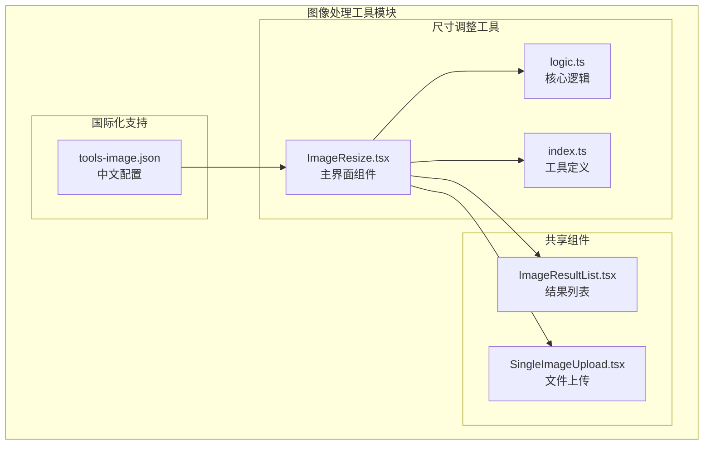
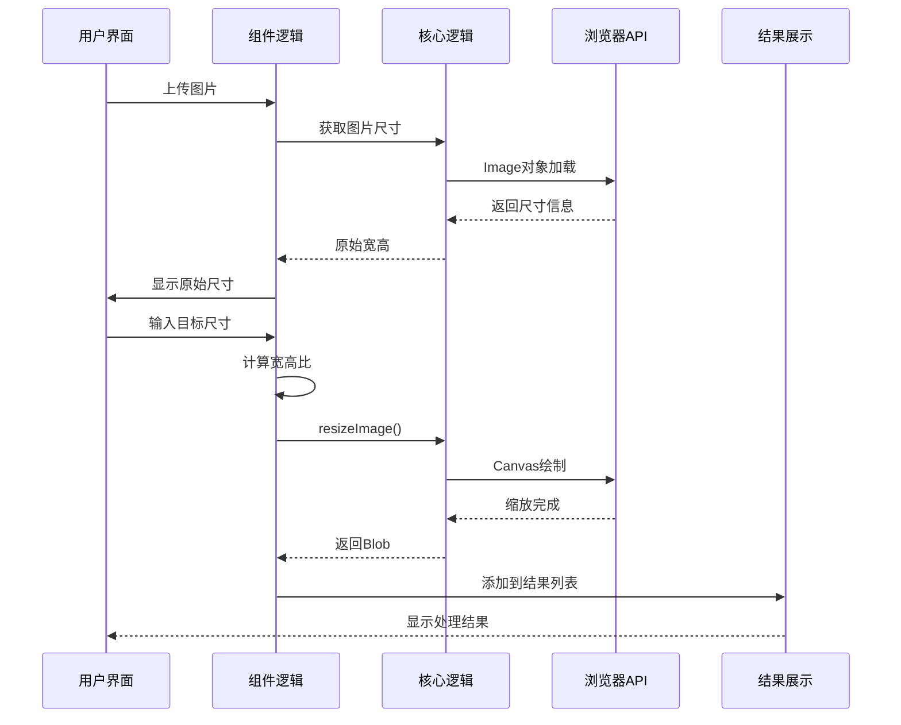
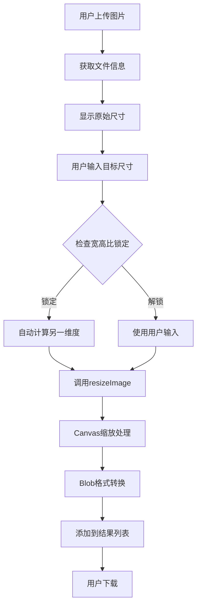
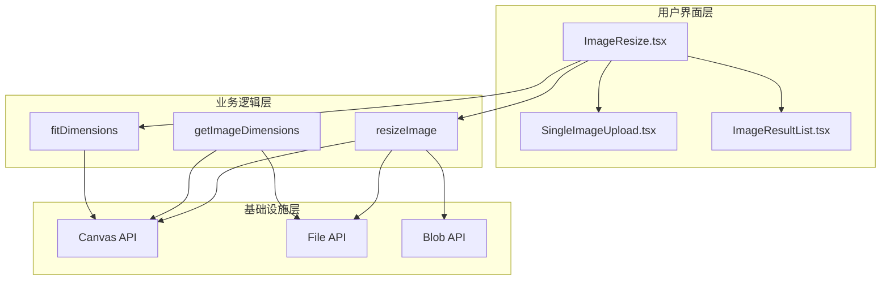
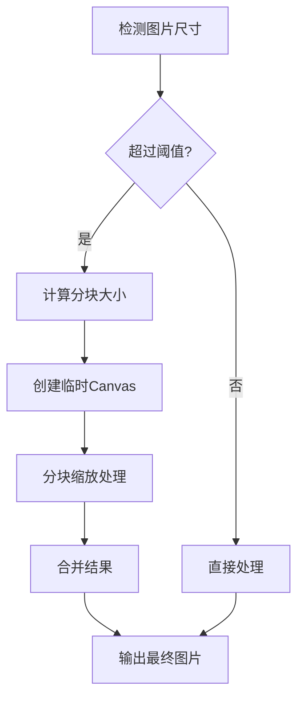
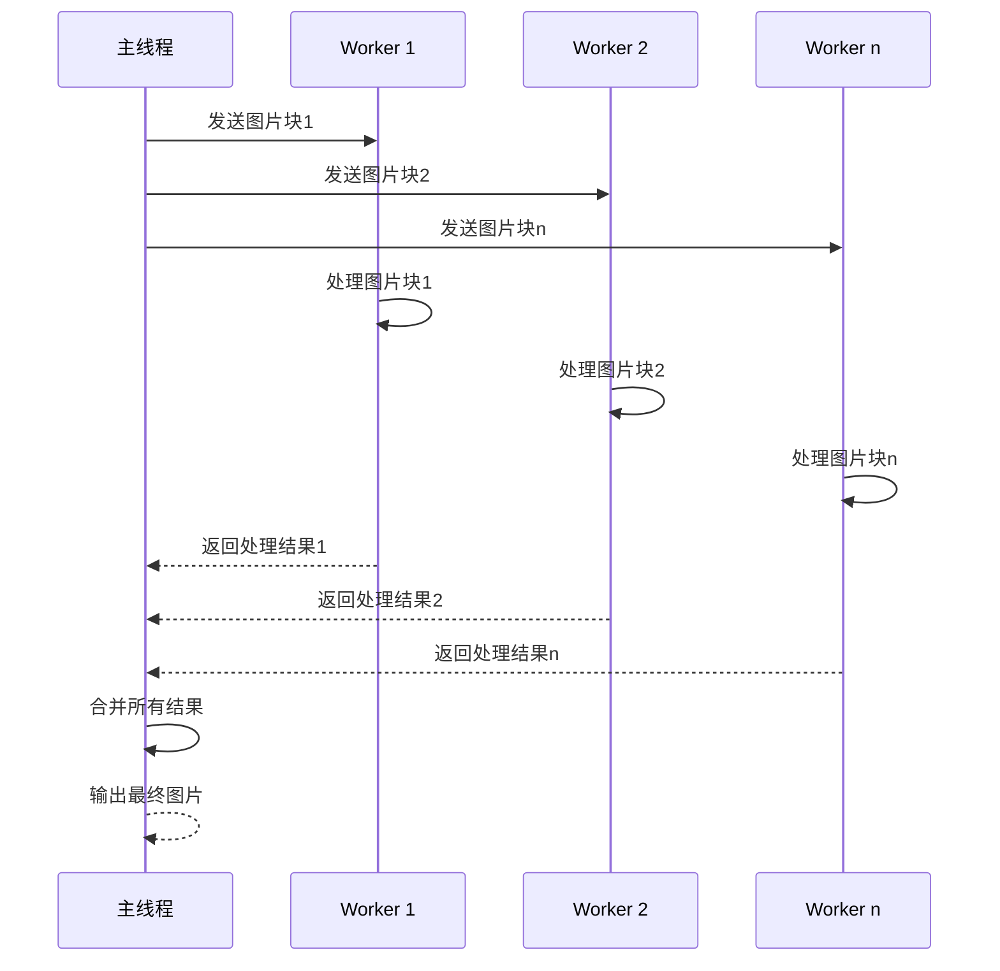
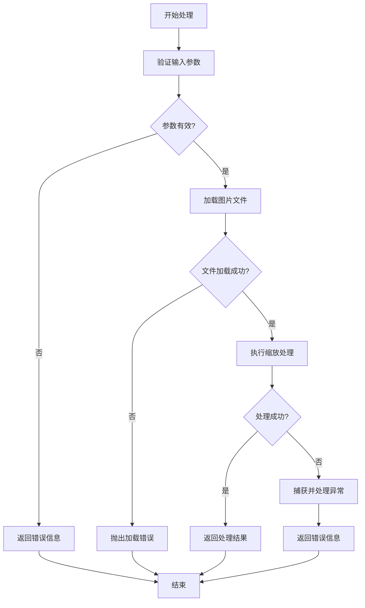

# 尺寸调整工具

<cite>
**本文档引用的文件**
- [ImageResize.tsx](file://src/tools/image/resize/ImageResize.tsx)
- [logic.ts](file://src/tools/image/resize/logic.ts)
- [index.ts](file://src/tools/image/resize/index.ts)
- [ImageResultList.tsx](file://src/components/shared/ImageResultList.tsx)
- [SingleImageUpload.tsx](file://src/components/shared/SingleImageUpload.tsx)
- [tools-image.json](file://messages/zh-Hans/tools-image.json)
- [logic.ts](file://src/tools/video/to-gif/logic.ts)
- [logic.ts](file://src/tools/image/pixelate/logic.ts)
</cite>

## 目录
1. [简介](#简介)
2. [项目结构](#项目结构)
3. [核心组件](#核心组件)
4. [架构概览](#架构概览)
5. [详细组件分析](#详细组件分析)
6. [依赖关系分析](#依赖关系分析)
7. [性能考虑](#性能考虑)
8. [故障排除指南](#故障排除指南)
9. [结论](#结论)
10. [附录](#附录)

## 简介

尺寸调整工具是媒体工具箱中的一个核心图像处理功能，允许用户将图片调整为任意尺寸，同时保持宽高比和提供多种预设选项。该工具基于浏览器原生技术实现，无需服务器端处理，确保用户隐私和数据安全。

该工具提供了直观的用户界面，支持：
- 自定义尺寸调整（宽度和高度）
- 宽高比锁定/解锁功能
- 多种预设尺寸选项
- 实时预览和结果管理
- 批量处理能力

## 项目结构

尺寸调整工具位于图像处理工具模块中，采用模块化架构设计：



**图表来源**
- [ImageResize.tsx:1-180](file://src/tools/image/resize/ImageResize.tsx#L1-L180)
- [logic.ts:1-89](file://src/tools/image/resize/logic.ts#L1-L89)
- [index.ts:1-37](file://src/tools/image/resize/index.ts#L1-L37)

**章节来源**
- [ImageResize.tsx:1-180](file://src/tools/image/resize/ImageResize.tsx#L1-L180)
- [logic.ts:1-89](file://src/tools/image/resize/logic.ts#L1-L89)
- [index.ts:1-37](file://src/tools/image/resize/index.ts#L1-L37)

## 核心组件

### 主界面组件 (ImageResize)

主界面组件负责用户交互和状态管理，提供直观的尺寸调整界面：

- **文件上传处理**：支持单张图片上传，实时显示原始尺寸
- **尺寸输入控件**：独立的宽度和高度输入框
- **宽高比控制**：链接/锁图标切换锁定/解锁状态
- **预设尺寸**：提供常用尺寸预设选项
- **结果管理**：显示处理结果和下载功能

### 核心逻辑模块 (logic.ts)

核心逻辑模块包含三个关键函数：

1. **resizeImage()**：执行实际的图像缩放操作
2. **getImageDimensions()**：获取图片原始尺寸
3. **fitDimensions()**：计算适合目标尺寸的最优尺寸

### 结果展示组件 (ImageResultList)

结果展示组件提供处理结果的可视化管理：

- **网格布局**：响应式图片网格显示
- **预览功能**：点击放大查看详细效果
- **下载管理**：单个和批量下载功能
- **URL缓存**：优化内存使用和性能

**章节来源**
- [ImageResize.tsx:14-180](file://src/tools/image/resize/ImageResize.tsx#L14-L180)
- [logic.ts:6-89](file://src/tools/image/resize/logic.ts#L6-L89)
- [ImageResultList.tsx:21-141](file://src/components/shared/ImageResultList.tsx#L21-L141)

## 架构概览

尺寸调整工具采用分层架构设计，确保代码的可维护性和扩展性：



**图表来源**
- [ImageResize.tsx:27-88](file://src/tools/image/resize/ImageResize.tsx#L27-L88)
- [logic.ts:6-46](file://src/tools/image/resize/logic.ts#L6-L46)

### 数据流架构



**图表来源**
- [ImageResize.tsx:45-88](file://src/tools/image/resize/ImageResize.tsx#L45-L88)
- [logic.ts:6-46](file://src/tools/image/resize/logic.ts#L6-L46)

## 详细组件分析

### 图像缩放算法实现

当前实现采用浏览器原生Canvas API进行图像缩放，具体实现机制如下：

#### 缩放算法类型

**最近邻插值 (Nearest Neighbor Interpolation)**

当前实现使用Canvas的drawImage方法，默认采用最近邻插值算法：

```javascript
// 核心缩放实现
ctx.drawImage(img, 0, 0, options.width, options.height);
```

这种实现具有以下特点：
- **速度快**：CPU开销最小
- **简单直接**：无需复杂的数学计算
- **质量较低**：可能出现锯齿和模糊现象
- **内存效率高**：不需要额外的像素缓冲区

#### 插值算法对比表

| 算法类型 | 质量等级 | 性能影响 | 内存开销 | 适用场景 |
|---------|---------|---------|---------|---------|
| 最近邻插值 | 低 | 高 | 低 | 快速预览、图标缩放 |
| 双线性插值 | 中等 | 中等 | 中等 | 一般图片缩放 |
| 双三次插值 | 高 | 低 | 高 | 专业图像处理 |

### 宽高比保持算法

宽高比保持功能通过数学计算实现等比例缩放：

```mermaid
flowchart TD
A[输入原始宽高] --> B[计算缩放比例]
B --> C[比较目标尺寸]
C --> D[确定约束条件]
D --> E[计算新尺寸]
E --> F[应用到另一个维度]
F --> G[输出最终尺寸]
B --> H[比例 = min(目标宽/原始宽, 目标高/原始高)]
D --> I[如果原始宽 > 0 且 原始高 > 0]
E --> J[新宽 = round(原始宽 × 比例)]
E --> K[新高 = round(原始高 × 比例)]
```

**图表来源**
- [logic.ts:64-79](file://src/tools/image/resize/logic.ts#L64-L79)

### 目标尺寸计算逻辑

目标尺寸计算采用"适合填充"算法，确保图片完全适应目标区域：

```mermaid
flowchart TD
A[原始尺寸 W₀×H₀] --> B[目标尺寸 W₁×H₁]
B --> C[计算宽高比]
C --> D[R = min(W₁/W₀, H₁/H₀)]
D --> E{R ≤ 1?}
E --> |是| F[需要按宽度约束]
E --> |否| G[需要按高度约束]
F --> H[W' = floor(W₀ × R)]
F --> I[H' = floor(H₀ × R)]
G --> J[W' = floor(W₀ × R)]
G --> K[H' = floor(H₀ × R)]
H --> L[输出 W'×H']
I --> L
J --> L
K --> L
```

**图表来源**
- [logic.ts:64-79](file://src/tools/image/resize/logic.ts#L64-L79)

### 预设尺寸配置

工具提供多种常用预设尺寸，适用于不同的应用场景：

| 预设名称 | 尺寸规格 | 应用场景 | 推荐用途 |
|---------|---------|---------|---------|
| HD (1280×720) | 1280 × 720 | 标准高清 | 视频播放、屏幕录制 |
| Full HD (1920×1080) | 1920 × 1080 | 高清电视 | 电视节目、电影 |
| 2K (2560×1440) | 2560 × 1440 | 超高清 | 专业显示器、高端电视 |
| 4K (3840×2160) | 3840 × 2160 | 超级高清 | 4K电视、专业制作 |
| Instagram (1080×1080) | 1080 × 1080 | 社交媒体 | Instagram头像、正方形内容 |
| Twitter (1200×675) | 1200 × 675 | 社交媒体 | Twitter横幅、推荐图片 |

**章节来源**
- [ImageResize.tsx:59-70](file://src/tools/image/resize/ImageResize.tsx#L59-L70)
- [logic.ts:81-89](file://src/tools/image/resize/logic.ts#L81-L89)

## 依赖关系分析

### 组件间依赖关系



**图表来源**
- [ImageResize.tsx:1-180](file://src/tools/image/resize/ImageResize.tsx#L1-L180)
- [logic.ts:1-89](file://src/tools/image/resize/logic.ts#L1-L89)

### 外部依赖分析

| 依赖项 | 类型 | 版本 | 用途 | 重要性 |
|-------|------|------|------|--------|
| React | 运行时 | ^18.2.0 | 用户界面框架 | 核心 |
| next-intl | 运行时 | ^3.1.2 | 国际化支持 | 重要 |
| lucide-react | 运行时 | ^0.358.0 | 图标库 | 辅助 |
| @ffmpeg/ffmpeg | 运行时 | ^0.12.15 | 视频处理 | 可选 |
| @ffmpeg/util | 运行时 | ^1.1.1 | 工具函数 | 可选 |

**章节来源**
- [ImageResize.tsx:3-12](file://src/tools/image/resize/ImageResize.tsx#L3-L12)
- [index.ts:1-37](file://src/tools/image/resize/index.ts#L1-L37)

## 性能考虑

### 当前实现的性能特征

#### 优势
- **内存效率**：使用Canvas直接处理，避免额外内存复制
- **响应速度快**：浏览器原生API优化
- **无服务器依赖**：完全客户端处理
- **渐进式加载**：支持大文件处理

#### 性能瓶颈
- **Canvas限制**：最大支持约2^24像素的Canvas
- **内存限制**：大图片可能导致内存溢出
- **CPU密集**：高分辨率图片缩放耗时较长
- **精度问题**：浮点运算可能导致微小的尺寸偏差

### 性能优化建议

#### 1. 分块处理策略
对于超大图片，建议采用分块处理方法：



#### 2. 内存管理优化
- **及时释放**：处理完成后及时释放Canvas和URL引用
- **渐进式处理**：大图片采用渐进式缩放
- **错误处理**：监控内存使用情况，及时清理

#### 3. 并行处理方案
利用Web Workers实现并行缩放处理：



## 故障排除指南

### 常见问题及解决方案

#### 1. 图片加载失败
**症状**：图片无法显示或处理报错
**原因**：文件损坏、格式不支持、权限问题
**解决方案**：
- 检查文件格式是否受支持
- 验证文件完整性
- 确认文件权限设置

#### 2. 缩放质量不佳
**症状**：缩放后图片模糊或出现锯齿
**原因**：使用了最近邻插值算法
**解决方案**：
- 考虑使用更高质量的缩放算法
- 适当提高源图片分辨率
- 使用专业的图像处理软件进行预处理

#### 3. 内存不足错误
**症状**：处理大图片时出现内存溢出
**原因**：图片过大超出浏览器内存限制
**解决方案**：
- 降低目标分辨率
- 分块处理大图片
- 关闭其他占用内存的程序

#### 4. 宽高比异常
**症状**：锁定宽高比后尺寸不符合预期
**原因**：浮点数精度问题导致的舍入误差
**解决方案**：
- 检查fitDimensions函数的舍入逻辑
- 验证输入参数的有效性
- 考虑使用更高精度的数学库

### 错误处理机制



**图表来源**
- [logic.ts:6-46](file://src/tools/image/resize/logic.ts#L6-L46)
- [ImageResize.tsx:72-88](file://src/tools/image/resize/ImageResize.tsx#L72-L88)

**章节来源**
- [logic.ts:6-46](file://src/tools/image/resize/logic.ts#L6-L46)
- [ImageResize.tsx:72-88](file://src/tools/image/resize/ImageResize.tsx#L72-L88)

## 结论

尺寸调整工具是一个功能完善、易于使用的图像处理工具，具有以下特点：

### 技术优势
- **纯前端实现**：无需服务器端处理，确保用户隐私
- **响应式设计**：支持多种设备和屏幕尺寸
- **国际化支持**：提供多语言界面
- **模块化架构**：便于维护和扩展

### 应用价值
- **广泛适用**：适用于各种图像处理场景
- **用户体验好**：直观的操作界面和实时预览
- **性能优秀**：基于浏览器原生API优化
- **成本效益高**：零服务器成本，零维护成本

### 改进建议
1. **算法优化**：引入更高质量的缩放算法
2. **性能提升**：实现并行处理和内存优化
3. **功能扩展**：增加更多预设和自定义选项
4. **错误处理**：完善异常处理和用户反馈机制

该工具为用户提供了一个强大而便捷的图像尺寸调整解决方案，满足了现代Web应用对图像处理的需求。

## 附录

### 使用示例

#### 基本尺寸调整
1. 上传目标图片
2. 输入期望的宽度和高度
3. 点击"调整尺寸"按钮
4. 下载处理后的图片

#### 预设尺寸使用
1. 选择合适的预设尺寸
2. 系统自动计算目标尺寸
3. 确认宽高比锁定状态
4. 执行缩放操作

#### 批量处理
1. 上传多张图片
2. 设置统一的目标尺寸
3. 批量执行缩放操作
4. 逐一下载处理结果

### 最佳实践建议

#### 1. 尺寸设置策略
- **网页图片**：保持1920×1080以内分辨率
- **社交媒体**：使用平台推荐的尺寸规格
- **打印用途**：至少300 DPI的高分辨率
- **移动设备**：考虑不同屏幕密度的适配

#### 2. 质量控制方案
- **源文件质量**：使用高质量的原始图片
- **缩放方向**：优先放大，避免多次缩小
- **格式选择**：根据用途选择合适的输出格式
- **压缩设置**：平衡文件大小和视觉质量

#### 3. 性能优化技巧
- **预处理**：在客户端进行必要的预处理
- **缓存策略**：合理使用浏览器缓存
- **渐进式加载**：大图片采用渐进式显示
- **错误恢复**：实现断点续传和错误恢复