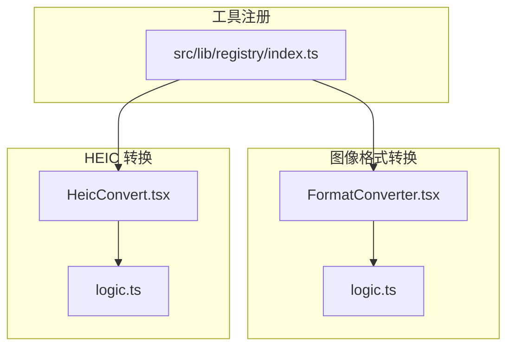
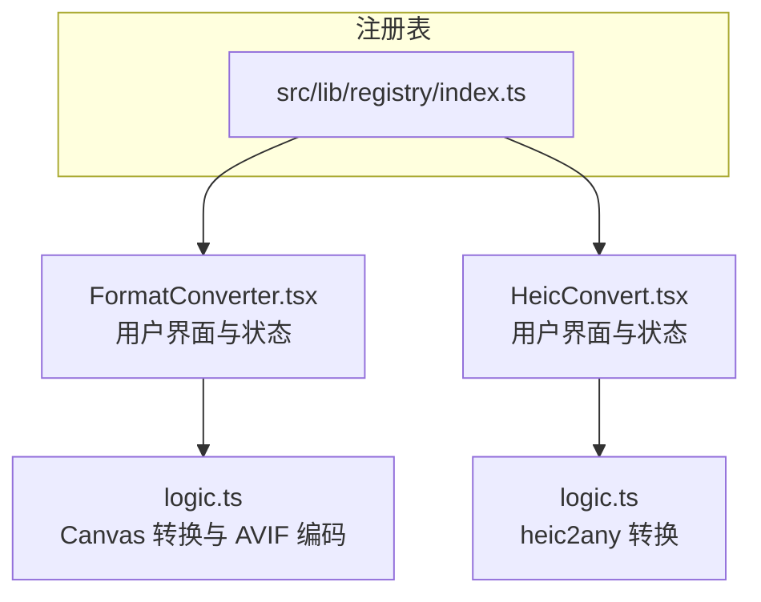
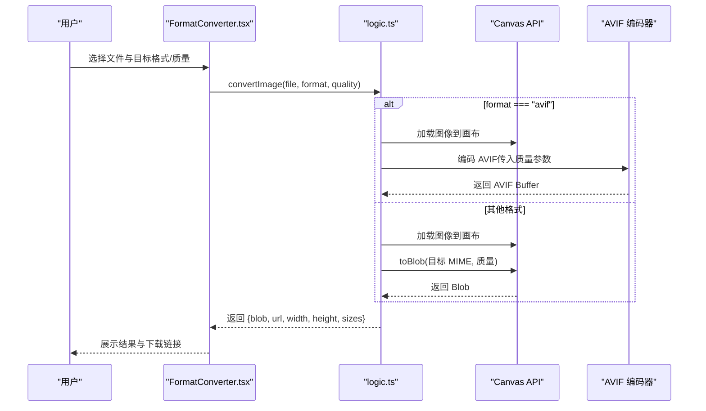
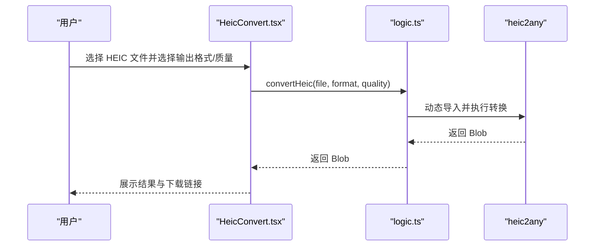
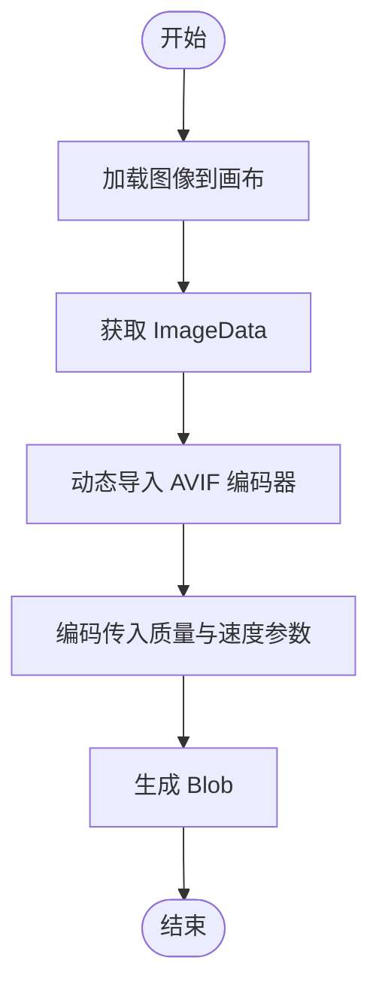
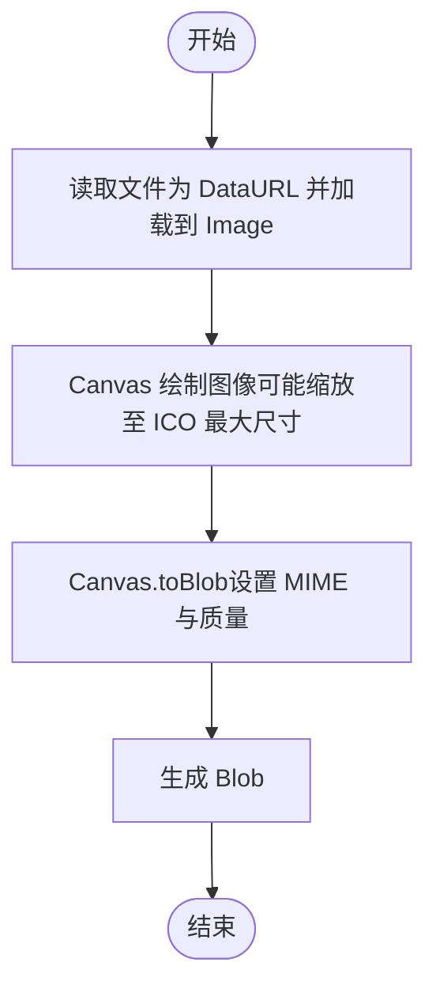
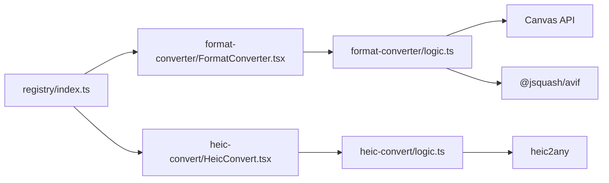

# 格式转换工具

<cite>
**本文引用的文件**
- [README.md](file://README.md)
- [src/lib/registry/index.ts](file://src/lib/registry/index.ts)
- [src/tools/image/format-converter/FormatConverter.tsx](file://src/tools/image/format-converter/FormatConverter.tsx)
- [src/tools/image/format-converter/logic.ts](file://src/tools/image/format-converter/logic.ts)
- [src/tools/image/heic-convert/HeicConvert.tsx](file://src/tools/image/heic-convert/HeicConvert.tsx)
- [src/tools/image/heic-convert/logic.ts](file://src/tools/image/heic-convert/logic.ts)
</cite>

## 目录
1. [简介](#简介)
2. [项目结构](#项目结构)
3. [核心组件](#核心组件)
4. [架构总览](#架构总览)
5. [详细组件分析](#详细组件分析)
6. [依赖关系分析](#依赖关系分析)
7. [性能考量](#性能考量)
8. [故障排查指南](#故障排查指南)
9. [结论](#结论)
10. [附录](#附录)

## 简介
本工具箱是一个完全在浏览器端运行的多媒体处理平台，所有文件处理均在本地完成，不上传至服务器，保障用户隐私。图像格式转换工具覆盖多种常见与现代图像格式，包括 PNG、JPG（JPEG）、WebP、AVIF、ICO，并提供 HEIC 转换能力。转换流程基于浏览器原生 Canvas API 进行像素级绘制与编码，结合专用库实现 AVIF 编码与 HEIC 解码，确保在无服务器环境下的高效与安全。

## 项目结构
图像格式转换相关的核心位于以下位置：
- 工具注册与分类：src/lib/registry/index.ts
- 图像格式转换工具：src/tools/image/format-converter/*
- HEIC 转换工具：src/tools/image/heic-convert/*

图表来源
- [src/lib/registry/index.ts:66-133](file://src/lib/registry/index.ts#L66-L133)
- [src/tools/image/format-converter/FormatConverter.tsx:18-134](file://src/tools/image/format-converter/FormatConverter.tsx#L18-L134)
- [src/tools/image/format-converter/logic.ts:75-158](file://src/tools/image/format-converter/logic.ts#L75-L158)
- [src/tools/image/heic-convert/HeicConvert.tsx:13-121](file://src/tools/image/heic-convert/HeicConvert.tsx#L13-L121)
- [src/tools/image/heic-convert/logic.ts:3-22](file://src/tools/image/heic-convert/logic.ts#L3-L22)

章节来源
- [README.md:55-78](file://README.md#L55-L78)
- [src/lib/registry/index.ts:66-133](file://src/lib/registry/index.ts#L66-L133)

## 核心组件
- 图像格式转换工具（FormatConverter）
  - 支持格式：PNG、JPG、WebP、AVIF、ICO
  - 关键逻辑：通过 Canvas API 将输入图像绘制到画布，再以目标 MIME 类型导出 Blob；对 AVIF 使用专用编码器；对 ICO 进行尺寸约束
  - 用户交互：选择输出格式与质量（针对 JPG/WebP/AVIF），批量转换并展示结果列表
- HEIC 转换工具（HeicConvert）
  - 支持格式：JPG、PNG
  - 关键逻辑：动态导入 heic2any 库进行 HEIC/HEIF 到目标格式的转换
  - 用户交互：选择输出格式与质量（仅 JPG），单文件处理

章节来源
- [src/tools/image/format-converter/FormatConverter.tsx:18-134](file://src/tools/image/format-converter/FormatConverter.tsx#L18-L134)
- [src/tools/image/format-converter/logic.ts:13-27](file://src/tools/image/format-converter/logic.ts#L13-L27)
- [src/tools/image/format-converter/logic.ts:75-158](file://src/tools/image/format-converter/logic.ts#L75-L158)
- [src/tools/image/heic-convert/HeicConvert.tsx:13-121](file://src/tools/image/heic-convert/HeicConvert.tsx#L13-L121)
- [src/tools/image/heic-convert/logic.ts:3-22](file://src/tools/image/heic-convert/logic.ts#L3-L22)

## 架构总览
整体采用“注册表 + 工具页面 + 业务逻辑”的分层设计。工具页面负责用户交互与状态管理，业务逻辑封装具体转换算法与外部库调用，注册表统一暴露工具元数据与路由映射。

图表来源
- [src/lib/registry/index.ts:66-133](file://src/lib/registry/index.ts#L66-L133)
- [src/tools/image/format-converter/FormatConverter.tsx:18-134](file://src/tools/image/format-converter/FormatConverter.tsx#L18-L134)
- [src/tools/image/format-converter/logic.ts:75-158](file://src/tools/image/format-converter/logic.ts#L75-L158)
- [src/tools/image/heic-convert/HeicConvert.tsx:13-121](file://src/tools/image/heic-convert/HeicConvert.tsx#L13-L121)
- [src/tools/image/heic-convert/logic.ts:3-22](file://src/tools/image/heic-convert/logic.ts#L3-L22)

## 详细组件分析

### 组件一：图像格式转换（FormatConverter）
- 功能要点
  - 输入：多文件选择
  - 输出：按所选格式导出，显示尺寸与体积对比
  - 质量控制：JPG/WebP/AVIF 提供质量滑杆
  - 批量处理：逐个转换并累计进度
- 数据流与处理逻辑
  - 加载图像到 Canvas：将 File 读取为对象 URL 并绘制到画布
  - AVIF 路径：使用专用编码器进行编码
  - 其他格式：通过 Canvas.toBlob 导出，按 MIME 设置质量参数
  - ICO 尺寸约束：最大边不超过 256 像素
- 错误处理
  - 文件读取失败、Canvas 上下文不可用、toBlob 失败等均抛出错误并汇总提示

图表来源
- [src/tools/image/format-converter/FormatConverter.tsx:28-55](file://src/tools/image/format-converter/FormatConverter.tsx#L28-L55)
- [src/tools/image/format-converter/logic.ts:29-54](file://src/tools/image/format-converter/logic.ts#L29-L54)
- [src/tools/image/format-converter/logic.ts:56-73](file://src/tools/image/format-converter/logic.ts#L56-L73)
- [src/tools/image/format-converter/logic.ts:96-158](file://src/tools/image/format-converter/logic.ts#L96-L158)

章节来源
- [src/tools/image/format-converter/FormatConverter.tsx:18-134](file://src/tools/image/format-converter/FormatConverter.tsx#L18-L134)
- [src/tools/image/format-converter/logic.ts:13-27](file://src/tools/image/format-converter/logic.ts#L13-L27)
- [src/tools/image/format-converter/logic.ts:29-54](file://src/tools/image/format-converter/logic.ts#L29-L54)
- [src/tools/image/format-converter/logic.ts:56-73](file://src/tools/image/format-converter/logic.ts#L56-L73)
- [src/tools/image/format-converter/logic.ts:75-158](file://src/tools/image/format-converter/logic.ts#L75-L158)

### 组件二：HEIC 转换（HeicConvert）
- 功能要点
  - 输入：HEIC/HEIF 文件
  - 输出：JPG 或 PNG
  - 质量控制：仅 JPG 支持质量参数
- 处理流程
  - 动态导入 heic2any 库
  - 调用转换函数，返回 Blob
  - 生成结果文件名并展示下载

图表来源
- [src/tools/image/heic-convert/HeicConvert.tsx:28-47](file://src/tools/image/heic-convert/HeicConvert.tsx#L28-L47)
- [src/tools/image/heic-convert/logic.ts:3-22](file://src/tools/image/heic-convert/logic.ts#L3-L22)

章节来源
- [src/tools/image/heic-convert/HeicConvert.tsx:13-121](file://src/tools/image/heic-convert/HeicConvert.tsx#L13-L121)
- [src/tools/image/heic-convert/logic.ts:3-22](file://src/tools/image/heic-convert/logic.ts#L3-L22)

### 转换算法与数据流（AVIF 路径）

图表来源
- [src/tools/image/format-converter/logic.ts:56-73](file://src/tools/image/format-converter/logic.ts#L56-L73)

章节来源
- [src/tools/image/format-converter/logic.ts:56-73](file://src/tools/image/format-converter/logic.ts#L56-L73)

### 转换算法与数据流（其他格式路径）

图表来源
- [src/tools/image/format-converter/logic.ts:96-158](file://src/tools/image/format-converter/logic.ts#L96-L158)

章节来源
- [src/tools/image/format-converter/logic.ts:96-158](file://src/tools/image/format-converter/logic.ts#L96-L158)

## 依赖关系分析
- 工具注册
  - 注册表集中导入各工具定义，统一暴露查询接口，便于路由与导航
- 图像格式转换
  - UI 依赖业务逻辑模块；业务逻辑依赖浏览器原生 Canvas API 与第三方库（AVIF 编码器、heic2any）
- 依赖关系可视化

图表来源
- [src/lib/registry/index.ts:66-133](file://src/lib/registry/index.ts#L66-L133)
- [src/tools/image/format-converter/FormatConverter.tsx:16-16](file://src/tools/image/format-converter/FormatConverter.tsx#L16-L16)
- [src/tools/image/format-converter/logic.ts:64-64](file://src/tools/image/format-converter/logic.ts#L64-L64)
- [src/tools/image/heic-convert/HeicConvert.tsx:9-9](file://src/tools/image/heic-convert/HeicConvert.tsx#L9-L9)
- [src/tools/image/heic-convert/logic.ts:9-9](file://src/tools/image/heic-convert/logic.ts#L9-L9)

章节来源
- [src/lib/registry/index.ts:66-133](file://src/lib/registry/index.ts#L66-L133)
- [src/tools/image/format-converter/FormatConverter.tsx:16-16](file://src/tools/image/format-converter/FormatConverter.tsx#L16-L16)
- [src/tools/image/format-converter/logic.ts:64-64](file://src/tools/image/format-converter/logic.ts#L64-L64)
- [src/tools/image/heic-convert/HeicConvert.tsx:9-9](file://src/tools/image/heic-convert/HeicConvert.tsx#L9-L9)
- [src/tools/image/heic-convert/logic.ts:9-9](file://src/tools/image/heic-convert/logic.ts#L9-L9)

## 性能考量
- Canvas 绘制与 toBlob
  - 大图转换会占用较多内存与 CPU，建议在 UI 层限制单次处理尺寸或提供预览缩略图
  - 对 ICO 进行最大边 256 像素的约束，降低后续处理成本
- AVIF 编码
  - 使用专用编码器进行编码，质量参数与速度参数影响编码时长与体积
  - 建议在移动端谨慎启用高复杂度配置
- 批量转换
  - 当前实现逐个处理并更新进度，建议在大量文件场景下增加节流与后台任务策略，避免阻塞主线程
- 内存管理
  - 及时释放对象 URL 与临时 Blob，避免内存泄漏
- 资源加载
  - 动态导入 heic2any 与 AVIF 编码器，减少初始包体与首屏负担

## 故障排查指南
- 常见错误与定位
  - Canvas 上下文不可用：检查浏览器兼容性与上下文获取
  - 图像加载失败：确认文件类型与内容有效性
  - toBlob 失败：检查 MIME 类型与质量参数范围
  - AVIF 编码异常：确认动态导入是否成功以及参数范围
  - heic2any 转换失败：确认输入文件为合法 HEIC/HEIF，且输出格式受支持
- 建议措施
  - 在 UI 层收集并展示错误信息，便于用户重试或更换文件
  - 对大文件转换增加超时与取消机制
  - 在移动端提供体积估算与警告提示

章节来源
- [src/tools/image/format-converter/logic.ts:41-43](file://src/tools/image/format-converter/logic.ts#L41-L43)
- [src/tools/image/format-converter/logic.ts:120-122](file://src/tools/image/format-converter/logic.ts#L120-L122)
- [src/tools/image/format-converter/logic.ts:129-131](file://src/tools/image/format-converter/logic.ts#L129-L131)
- [src/tools/image/format-converter/logic.ts:151-151](file://src/tools/image/format-converter/logic.ts#L151-L151)
- [src/tools/image/format-converter/logic.ts:155-155](file://src/tools/image/format-converter/logic.ts#L155-L155)
- [src/tools/image/heic-convert/logic.ts:17-22](file://src/tools/image/heic-convert/logic.ts#L17-L22)

## 结论
该图像格式转换工具通过浏览器原生 Canvas API 与专用编码库，实现了多样化的格式转换能力，兼顾隐私与性能。建议在生产环境中进一步完善批量处理、内存监控与错误恢复机制，并根据目标平台特性优化质量与体积平衡策略。

## 附录

### 支持的图像格式与特性
- PNG：无损压缩，适合图标与透明背景
- JPG/JPEG：有损压缩，适合照片与大图
- WebP：现代压缩格式，体积通常优于 JPG
- AVIF：新一代高压缩比格式，适合现代浏览器
- ICO：Windows 图标格式，自动限制最大边 256 像素

章节来源
- [src/tools/image/format-converter/FormatConverter.tsx:74-78](file://src/tools/image/format-converter/FormatConverter.tsx#L74-L78)
- [src/tools/image/format-converter/logic.ts:13-27](file://src/tools/image/format-converter/logic.ts#L13-L27)
- [src/tools/image/format-converter/logic.ts:105-113](file://src/tools/image/format-converter/logic.ts#L105-L113)

### Canvas API 在格式转换中的应用
- 加载与绘制：将 File 转为对象 URL 并绘制到 Canvas
- 像素数据：获取 ImageData 用于 AVIF 编码
- 导出：通过 toBlob 按目标 MIME 与质量导出

章节来源
- [src/tools/image/format-converter/logic.ts:29-54](file://src/tools/image/format-converter/logic.ts#L29-L54)
- [src/tools/image/format-converter/logic.ts:62-62](file://src/tools/image/format-converter/logic.ts#L62-L62)
- [src/tools/image/format-converter/logic.ts:115-125](file://src/tools/image/format-converter/logic.ts#L115-L125)
- [src/tools/image/format-converter/logic.ts:127-148](file://src/tools/image/format-converter/logic.ts#L127-L148)

### 元数据保留策略
- 当前实现主要进行像素级转换，未显式处理 EXIF 等元数据
- 若需保留元数据，可在转换前读取并写回相应字段（需额外库支持）

### 使用示例与最佳实践
- 质量设置
  - JPG/WebP/AVIF：通过滑杆调节质量百分比
  - ICO：自动缩放至最大 256 像素
- 文件大小优化
  - 优先选择现代格式（WebP/AVIF）以获得更高压缩比
  - 对照片类图像适当降低质量以换取体积优势
- 兼容性考虑
  - AVIF 在部分旧版浏览器可能不受支持，建议提供降级方案
  - ICO 主要用于 Windows 环境，跨平台时可考虑 PNG 替代
- 批量转换
  - 控制并发数量，避免长时间阻塞 UI
  - 提供进度条与错误汇总，提升用户体验

章节来源
- [src/tools/image/format-converter/FormatConverter.tsx:82-96](file://src/tools/image/format-converter/FormatConverter.tsx#L82-L96)
- [src/tools/image/format-converter/logic.ts:105-113](file://src/tools/image/format-converter/logic.ts#L105-L113)
- [src/tools/image/heic-convert/HeicConvert.tsx:80-96](file://src/tools/image/heic-convert/HeicConvert.tsx#L80-L96)