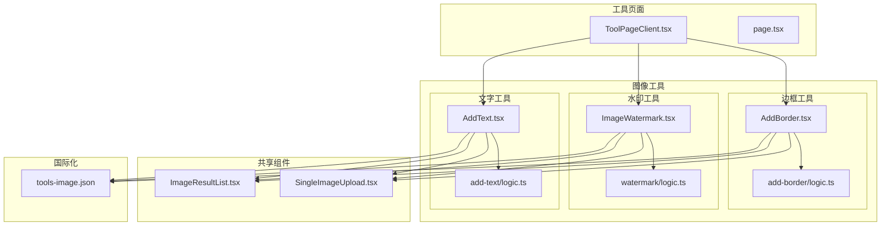
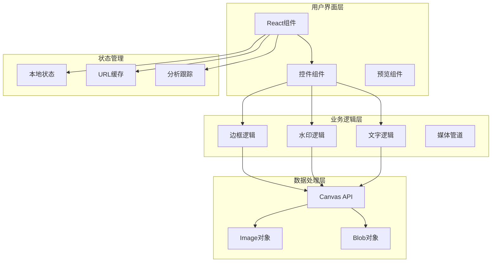
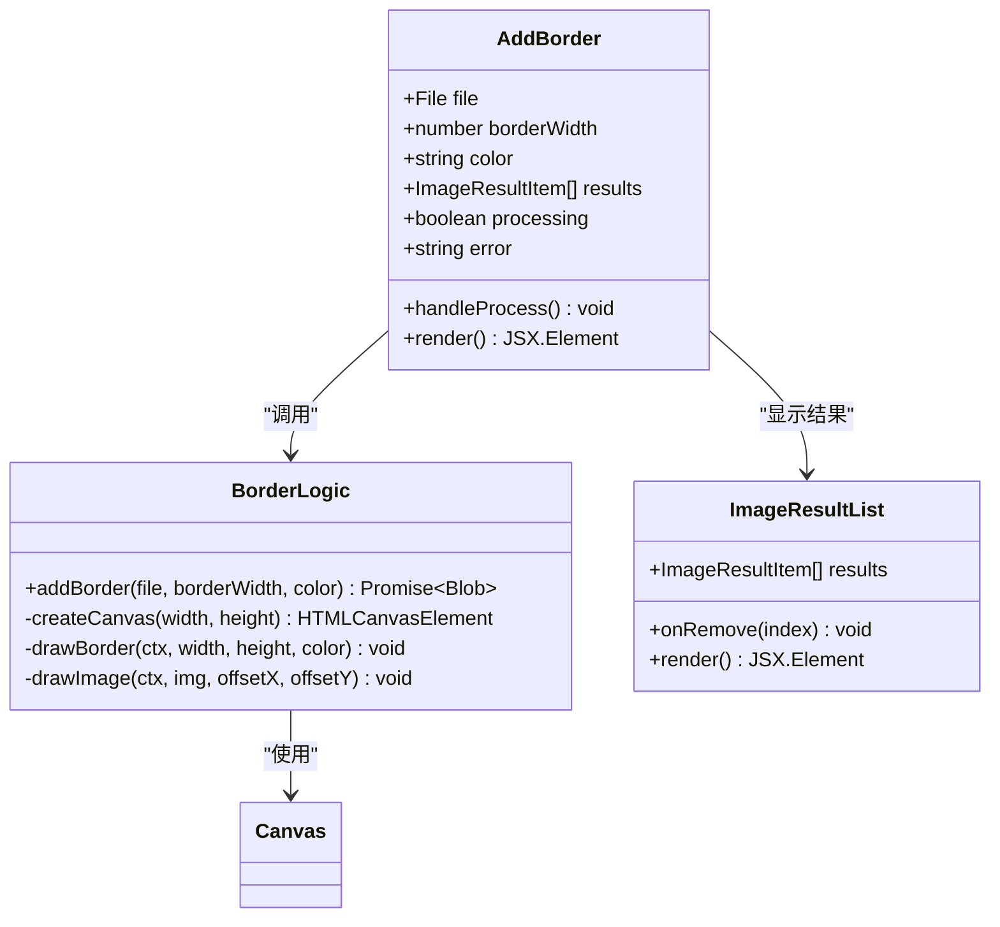
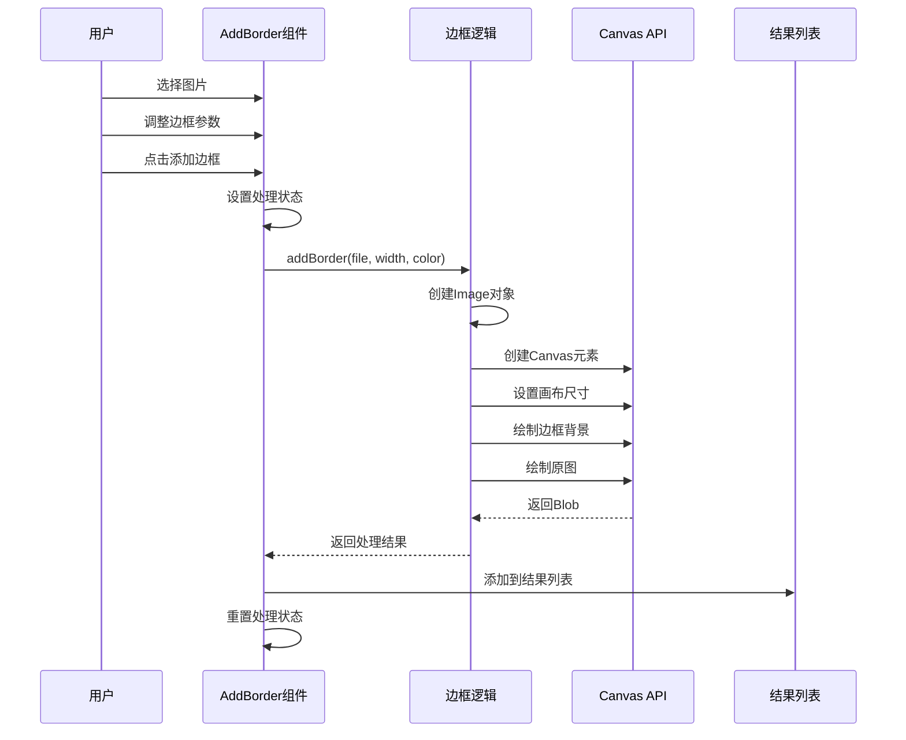
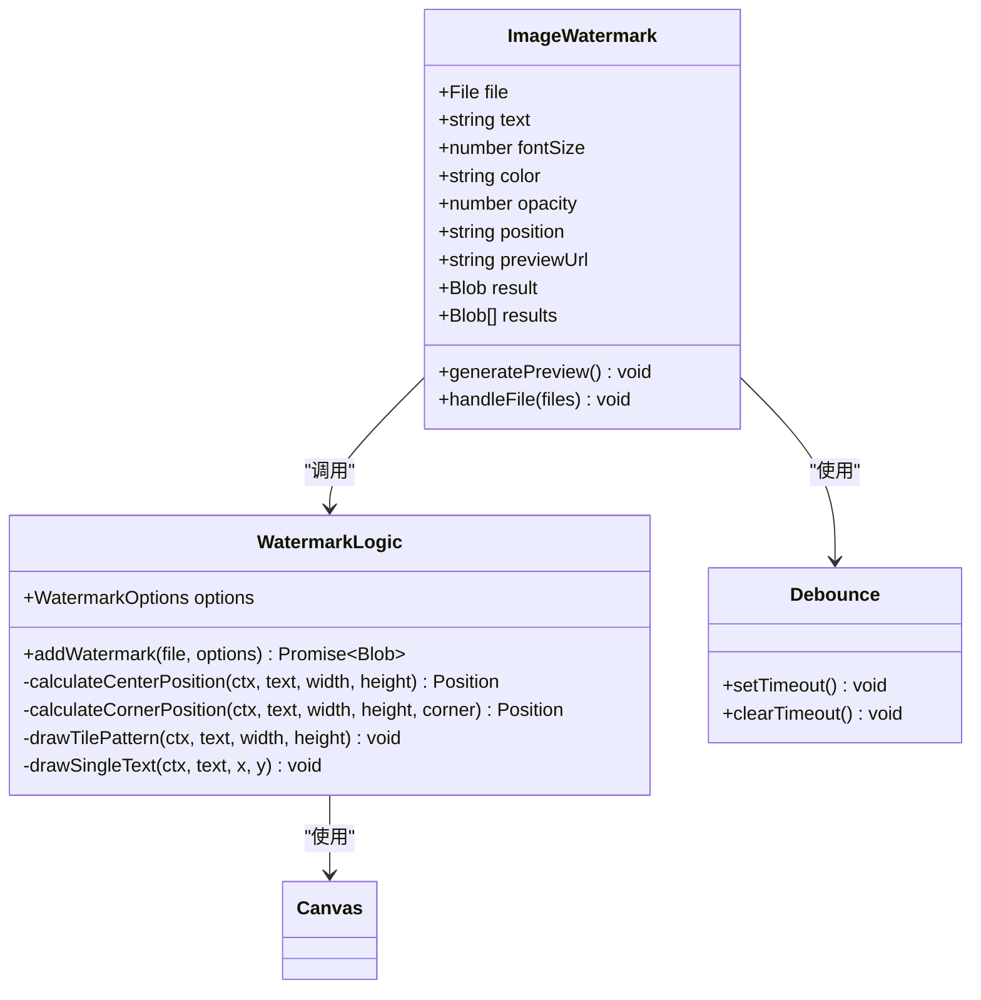
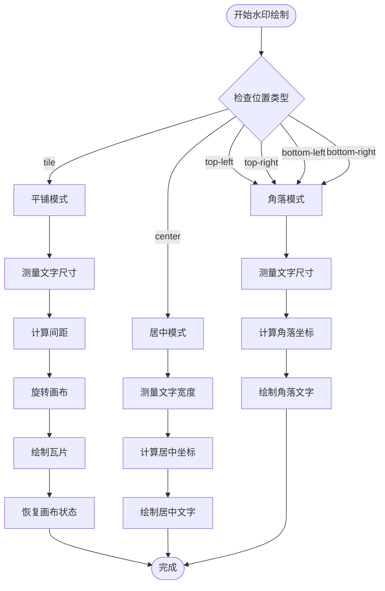
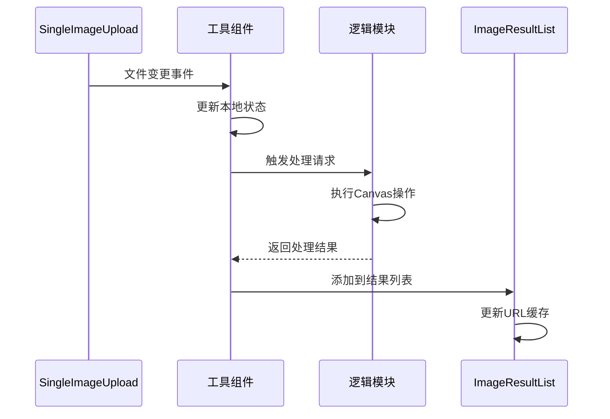
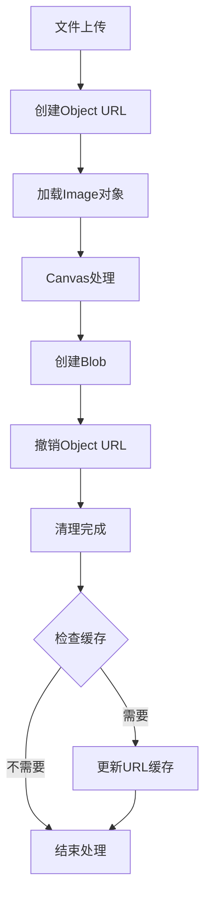

# 边框与水印工具

<cite>
**本文档引用的文件**
- [AddBorder.tsx](file://src/tools/image/add-border/AddBorder.tsx)
- [logic.ts](file://src/tools/image/add-border/logic.ts)
- [ImageWatermark.tsx](file://src/tools/image/watermark/ImageWatermark.tsx)
- [logic.ts](file://src/tools/image/watermark/logic.ts)
- [AddText.tsx](file://src/tools/image/add-text/AddText.tsx)
- [logic.ts](file://src/tools/image/add-text/logic.ts)
- [ImageResultList.tsx](file://src/components/shared/ImageResultList.tsx)
- [SingleImageUpload.tsx](file://src/components/shared/SingleImageUpload.tsx)
- [brand.ts](file://src/lib/brand.ts)
- [tools-image.json](file://messages/zh-Hans/tools-image.json)
- [ToolPageClient.tsx](file://src/app/[locale]/tools/[category]/[slug]/ToolPageClient.tsx)
- [page.tsx](file://src/app/[locale]/tools/[category]/[slug]/page.tsx)
</cite>

## 目录
1. [简介](#简介)
2. [项目结构](#项目结构)
3. [核心组件](#核心组件)
4. [架构概览](#架构概览)
5. [详细组件分析](#详细组件分析)
6. [依赖关系分析](#依赖关系分析)
7. [性能考虑](#性能考虑)
8. [故障排除指南](#故障排除指南)
9. [结论](#结论)
10. [附录](#附录)

## 简介

边框与水印工具是媒体工具箱项目中的重要组成部分，专注于为图像添加装饰性和保护性元素。该项目提供了两个核心功能：

1. **边框添加功能**：为图片添加自定义样式的边框，支持宽度、颜色等参数调节
2. **水印功能**：为图片添加文字水印，支持多种位置、透明度和样式控制

这两个工具都基于HTML5 Canvas API实现，确保在浏览器端完全本地处理，无需上传到服务器，保护用户隐私和数据安全。

## 项目结构

项目采用模块化架构，边框和水印功能位于图像工具目录下：



**图表来源**
- [ToolPageClient.tsx:29-42](file://src/app/[locale]/tools/[category]/[slug]/ToolPageClient.tsx#L29-L42)
- [AddBorder.tsx:13-100](file://src/tools/image/add-border/AddBorder.tsx#L13-L100)
- [ImageWatermark.tsx:25-216](file://src/tools/image/watermark/ImageWatermark.tsx#L25-L216)

**章节来源**
- [ToolPageClient.tsx:29-42](file://src/app/[locale]/tools/[category]/[slug]/ToolPageClient.tsx#L29-L42)
- [page.tsx:33-108](file://src/app/[locale]/tools/[category]/[slug]/page.tsx#L33-L108)

## 核心组件

### 边框添加组件 (AddBorder)

边框添加组件提供了直观的用户界面，允许用户自定义边框的外观和尺寸：

- **边框宽度控制**：1-100像素范围的滑块调节
- **颜色选择器**：支持任意颜色的十六进制颜色选择
- **实时预览**：处理过程中的进度反馈
- **批量处理**：支持多张图片的批量边框添加

### 水印组件 (ImageWatermark)

水印组件提供了丰富的水印定制选项：

- **文字内容**：可自定义的水印文字
- **位置控制**：支持居中、四个角落和平铺模式
- **样式调节**：字体大小、颜色、透明度
- **实时预览**：参数变化时的即时效果预览
- **防抖机制**：优化用户体验的延迟更新

### 文字叠加组件 (AddText)

文字叠加组件专注于纯文字添加功能：

- **位置选择**：五个预设位置选项
- **样式控制**：字体大小和颜色调节
- **对齐方式**：自动处理文字对齐
- **批量处理**：支持多图片处理

**章节来源**
- [AddBorder.tsx:13-100](file://src/tools/image/add-border/AddBorder.tsx#L13-L100)
- [ImageWatermark.tsx:25-216](file://src/tools/image/watermark/ImageWatermark.tsx#L25-L216)
- [AddText.tsx:22-157](file://src/tools/image/add-text/AddText.tsx#L22-L157)

## 架构概览

系统采用分层架构设计，确保功能模块的独立性和可维护性：



**图表来源**
- [AddBorder.tsx:22-40](file://src/tools/image/add-border/AddBorder.tsx#L22-L40)
- [ImageWatermark.tsx:61-88](file://src/tools/image/watermark/ImageWatermark.tsx#L61-L88)
- [AddText.tsx:39-64](file://src/tools/image/add-text/AddText.tsx#L39-L64)

## 详细组件分析

### 边框添加组件深度分析

#### 组件架构



**图表来源**
- [AddBorder.tsx:13-100](file://src/tools/image/add-border/AddBorder.tsx#L13-L100)
- [logic.ts:1-38](file://src/tools/image/add-border/logic.ts#L1-L38)
- [ImageResultList.tsx:21-141](file://src/components/shared/ImageResultList.tsx#L21-L141)

#### 处理流程



**图表来源**
- [AddBorder.tsx:22-40](file://src/tools/image/add-border/AddBorder.tsx#L22-L40)
- [logic.ts:6-37](file://src/tools/image/add-border/logic.ts#L6-L37)

#### 边框样式实现

边框功能当前实现为简单的矩形边框，具有以下特性：

- **宽度控制**：通过增加画布尺寸实现边框宽度
- **颜色填充**：使用填充色创建边框背景
- **居中显示**：原图绘制在边框内部中央位置
- **PNG输出**：确保边框颜色的透明度和质量

**章节来源**
- [AddBorder.tsx:13-100](file://src/tools/image/add-border/AddBorder.tsx#L13-L100)
- [logic.ts:1-38](file://src/tools/image/add-border/logic.ts#L1-L38)

### 水印功能深度分析

#### 组件架构



**图表来源**
- [ImageWatermark.tsx:25-216](file://src/tools/image/watermark/ImageWatermark.tsx#L25-L216)
- [logic.ts:9-100](file://src/tools/image/watermark/logic.ts#L9-L100)

#### 水印位置算法



**图表来源**
- [logic.ts:34-79](file://src/tools/image/watermark/logic.ts#L34-L79)

#### 水印样式控制

水印功能提供了丰富的样式控制选项：

- **透明度控制**：0.05-1.00范围的精细调节
- **字体大小**：12-200像素的广泛支持
- **颜色选择**：任意十六进制颜色
- **位置布局**：五种预设位置和瓦片模式
- **实时预览**：防抖机制优化的即时反馈

**章节来源**
- [ImageWatermark.tsx:25-216](file://src/tools/image/watermark/ImageWatermark.tsx#L25-L216)
- [logic.ts:1-100](file://src/tools/image/watermark/logic.ts#L1-L100)

### 文字叠加功能分析

#### 组件实现

文字叠加组件专注于简洁的文字添加功能：

- **位置算法**：自动计算文字在各个位置的坐标
- **对齐处理**：根据位置自动设置文本对齐方式
- **边距控制**：统一的边距设置确保视觉效果
- **响应式设计**：适配不同屏幕尺寸

**章节来源**
- [AddText.tsx:22-157](file://src/tools/image/add-text/AddText.tsx#L22-L157)
- [logic.ts:8-85](file://src/tools/image/add-text/logic.ts#L8-L85)

## 依赖关系分析

系统采用松耦合的设计，各组件间依赖关系清晰：

```mermaid
graph LR
subgraph "外部依赖"
React[React 18+]
NextIntl[Next-Intl]
Lucide[Lucide Icons]
end
subgraph "内部模块"
SharedComponents[共享组件]
ToolComponents[工具组件]
LogicModules[逻辑模块]
Utils[工具函数]
end
subgraph "Canvas API"
ImageObj[Image对象]
CanvasCtx[CanvasRenderingContext2D]
BlobAPI[Blob API]
end
React --> SharedComponents
NextIntl --> ToolComponents
Lucide --> SharedComponents
SharedComponents --> ToolComponents
ToolComponents --> LogicModules
LogicModules --> Canvas API
Utils --> SharedComponents
Utils --> ToolComponents
```

**图表来源**
- [AddBorder.tsx:3-11](file://src/tools/image/add-border/AddBorder.tsx#L3-L11)
- [ImageWatermark.tsx:3-12](file://src/tools/image/watermark/ImageWatermark.tsx#L3-L12)
- [AddText.tsx:3-10](file://src/tools/image/add-text/AddText.tsx#L3-L10)

### 组件间通信



**图表来源**
- [SingleImageUpload.tsx:27-87](file://src/components/shared/SingleImageUpload.tsx#L27-L87)
- [ImageResultList.tsx:21-50](file://src/components/shared/ImageResultList.tsx#L21-L50)

**章节来源**
- [SingleImageUpload.tsx:27-87](file://src/components/shared/SingleImageUpload.tsx#L27-L87)
- [ImageResultList.tsx:21-141](file://src/components/shared/ImageResultList.tsx#L21-L141)

## 性能考虑

### Canvas优化策略

系统采用了多项Canvas性能优化措施：

1. **内存管理**：及时撤销Object URL，避免内存泄漏
2. **防抖机制**：水印预览使用300ms防抖，减少不必要的重绘
3. **URL缓存**：ImageResultList组件实现Blob到URL的缓存映射
4. **懒加载**：工具页面使用React.lazy实现组件懒加载

### 内存管理策略



**图表来源**
- [ImageResultList.tsx:26-50](file://src/components/shared/ImageResultList.tsx#L26-L50)
- [AddBorder.tsx:29-36](file://src/tools/image/add-border/AddBorder.tsx#L29-L36)

### 用户体验优化

1. **实时反馈**：处理状态指示器提供即时反馈
2. **错误处理**：完善的错误捕获和用户友好的错误消息
3. **响应式设计**：适配各种设备和屏幕尺寸
4. **无障碍支持**：键盘导航和屏幕阅读器支持

## 故障排除指南

### 常见问题及解决方案

#### 图片加载失败

**症状**：图片无法显示或处理报错
**原因**：文件损坏、格式不支持、内存不足
**解决方案**：
- 检查文件格式是否为支持的图片格式
- 确认文件大小在浏览器限制范围内
- 尝试重新上传文件

#### Canvas操作失败

**症状**：水印或边框添加失败
**原因**：Canvas上下文不可用、内存溢出
**解决方案**：
- 检查浏览器对Canvas API的支持
- 减小图片尺寸或降低处理复杂度
- 清理浏览器缓存后重试

#### 性能问题

**症状**：处理缓慢或页面卡顿
**原因**：大图片处理、过多并发操作
**解决方案**：
- 使用较小尺寸的图片
- 避免同时处理多个大文件
- 关闭其他占用内存的标签页

**章节来源**
- [AddBorder.tsx:33-39](file://src/tools/image/add-border/AddBorder.tsx#L33-L39)
- [ImageWatermark.tsx:78-81](file://src/tools/image/watermark/ImageWatermark.tsx#L78-L81)

## 结论

边框与水印工具展现了现代Web图像处理的最佳实践：

1. **隐私保护**：所有处理都在浏览器本地完成，无需上传
2. **性能优化**：采用Canvas API和多项优化策略
3. **用户体验**：提供实时预览、防抖机制和响应式设计
4. **可扩展性**：模块化架构便于功能扩展和维护

这些工具不仅满足了基本的图像装饰需求，更为版权保护和品牌推广提供了有效的技术手段。通过合理的参数控制和样式调节，用户可以创建专业级的图像效果。

## 附录

### 使用示例

#### 基本边框添加
1. 上传目标图片
2. 调整边框宽度（建议10-50像素）
3. 选择边框颜色
4. 点击添加边框
5. 下载处理后的图片

#### 水印添加技巧
1. **版权保护**：使用半透明白色文字"© 2024 Your Brand"
2. **品牌推广**：在角落添加品牌名称或Logo文字
3. **样片标注**：使用"样片"或"内部资料"等标识
4. **水印密度**：根据图片内容调整透明度和大小

### 最佳实践

#### 版权保护
- 使用半透明文字避免影响图片质量
- 选择不影响主要内容的区域
- 保持文字大小适中，避免过于显眼

#### 品牌推广
- 使用品牌主色调的文字颜色
- 选择图片的空白区域添加水印
- 考虑不同尺寸图片的适配性

#### 性能优化
- 控制水印数量，避免过度密集
- 合理设置透明度，平衡可见性和性能
- 使用适当的字体大小，避免过大导致的性能问题