# 高级图像处理工具

<cite>
**本文引用的文件**
- [README.md](file://README.md)
- [src/lib/registry/index.ts](file://src/lib/registry/index.ts)
- [src/tools/image/combine/logic.ts](file://src/tools/image/combine/logic.ts)
- [src/tools/image/heic-convert/logic.ts](file://src/tools/image/heic-convert/logic.ts)
- [src/tools/image/pixelate/logic.ts](file://src/tools/image/pixelate/logic.ts)
- [src/tools/image/remove-exif/logic.ts](file://src/tools/image/remove-exif/logic.ts)
- [src/tools/image/split/logic.ts](file://src/tools/image/split/logic.ts)
- [src/tools/image/svg-to-png/logic.ts](file://src/tools/image/svg-to-png/logic.ts)
- [src/tools/image/add-text/logic.ts](file://src/tools/image/add-text/logic.ts)
- [src/tools/image/circle-crop/logic.ts](file://src/tools/image/circle-crop/logic.ts)
</cite>

## 目录
1. [简介](#简介)
2. [项目结构](#项目结构)
3. [核心组件](#核心组件)
4. [架构总览](#架构总览)
5. [详细组件分析](#详细组件分析)
6. [依赖关系分析](#依赖关系分析)
7. [性能考量](#性能考量)
8. [故障排查指南](#故障排查指南)
9. [结论](#结论)
10. [附录](#附录)

## 简介
本文件面向“高级图像处理工具”的技术文档，聚焦以下功能与算法实现：
- 图像合并：多图布局、间距与尺寸协调
- HEIC 格式转换：格式解析、元数据处理、兼容性保障
- 像素化效果：像素块大小、缩放与重采样、输出质量
- EXIF 信息移除：二进制协议解析、敏感信息过滤、隐私保护策略
- 图像分割：网格切分、边界处理、质量保持与打包
- SVG 转 PNG：矢量图形注入、分辨率适配、透明度处理
- 文字添加：字体渲染、位置控制、样式定制
- 圆形裁剪：几何算法、蒙版生成、边缘平滑
- 拼贴制作：组合算法与批量处理方案

## 项目结构
该仓库采用 Next.js App Router 结构，图像处理工具集中于 src/tools/image 下，每个工具以“工具名/index.ts + 工具名/ToolPageClient.tsx + 工具名/logic.ts”的形式组织，逻辑层在 logic.ts 中实现纯函数，避免副作用，便于测试与复用。

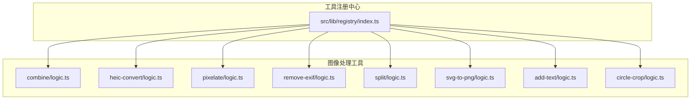

图表来源
- [src/lib/registry/index.ts:66-133](file://src/lib/registry/index.ts#L66-L133)
- [src/tools/image/combine/logic.ts:1-79](file://src/tools/image/combine/logic.ts#L1-L79)
- [src/tools/image/heic-convert/logic.ts:1-23](file://src/tools/image/heic-convert/logic.ts#L1-L23)
- [src/tools/image/pixelate/logic.ts:1-49](file://src/tools/image/pixelate/logic.ts#L1-L49)
- [src/tools/image/remove-exif/logic.ts:1-489](file://src/tools/image/remove-exif/logic.ts#L1-L489)
- [src/tools/image/split/logic.ts:1-81](file://src/tools/image/split/logic.ts#L1-L81)
- [src/tools/image/svg-to-png/logic.ts:1-60](file://src/tools/image/svg-to-png/logic.ts#L1-L60)
- [src/tools/image/add-text/logic.ts:1-85](file://src/tools/image/add-text/logic.ts#L1-L85)
- [src/tools/image/circle-crop/logic.ts:1-40](file://src/tools/image/circle-crop/logic.ts#L1-L40)

章节来源
- [README.md:55-78](file://README.md#L55-L78)
- [src/lib/registry/index.ts:66-133](file://src/lib/registry/index.ts#L66-L133)

## 核心组件
- 图像合并（combine）：支持横向/纵向布局，自动计算画布尺寸，居中对齐，统一背景色，最终导出 PNG。
- HEIC 转换（heic-convert）：动态引入 heic2any，按目标 MIME 类型与质量参数进行转换。
- 像素化（pixelate）：双通道缩放（降采样 + 放大），避免同画布源/目标重叠导致的伪影。
- EXIF 移除（remove-exif）：针对 JPEG/PNG/WebP/AVIF 的二进制协议解析与剥离，保留 ICC 配置文件，清除 EXIF/XMP。
- 图像分割（split）：按行列切分为规则网格，最后一行/列吸收余数像素；支持打包为 ZIP。
- SVG 转 PNG（svg-to-png）：若无显式宽高但存在 viewBox，则注入宽高；按比例缩放绘制至 Canvas 并导出 PNG。
- 文字添加（add-text）：基于 Canvas 文本 API，支持多种定位点与颜色、字号配置。
- 圆形裁剪（circle-crop）：使用 clip 与 arc 绘制圆形蒙版，按中心对齐裁剪。
- 注册中心（registry）：集中管理工具元数据与导入，确保路由与国际化一致。

章节来源
- [src/tools/image/combine/logic.ts:1-79](file://src/tools/image/combine/logic.ts#L1-L79)
- [src/tools/image/heic-convert/logic.ts:1-23](file://src/tools/image/heic-convert/logic.ts#L1-L23)
- [src/tools/image/pixelate/logic.ts:1-49](file://src/tools/image/pixelate/logic.ts#L1-L49)
- [src/tools/image/remove-exif/logic.ts:1-489](file://src/tools/image/remove-exif/logic.ts#L1-L489)
- [src/tools/image/split/logic.ts:1-81](file://src/tools/image/split/logic.ts#L1-L81)
- [src/tools/image/svg-to-png/logic.ts:1-60](file://src/tools/image/svg-to-png/logic.ts#L1-L60)
- [src/tools/image/add-text/logic.ts:1-85](file://src/tools/image/add-text/logic.ts#L1-L85)
- [src/tools/image/circle-crop/logic.ts:1-40](file://src/tools/image/circle-crop/logic.ts#L1-L40)
- [src/lib/registry/index.ts:66-133](file://src/lib/registry/index.ts#L66-L133)

## 架构总览
各工具通过逻辑层（logic.ts）与 UI 层解耦，UI 层负责交互与状态展示，逻辑层负责纯计算与浏览器 API 调用。注册中心统一暴露工具清单，便于路由与导航生成。

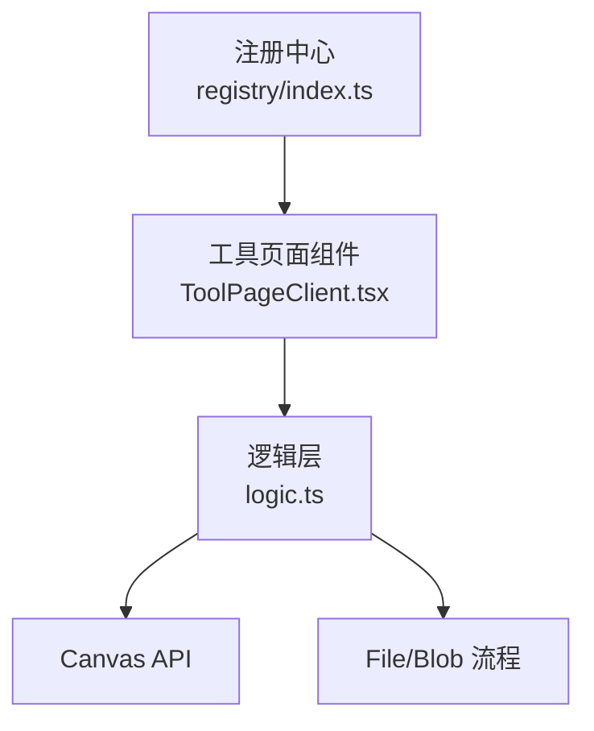

图表来源
- [src/lib/registry/index.ts:66-133](file://src/lib/registry/index.ts#L66-L133)
- [src/tools/image/combine/logic.ts:1-79](file://src/tools/image/combine/logic.ts#L1-L79)
- [src/tools/image/svg-to-png/logic.ts:1-60](file://src/tools/image/svg-to-png/logic.ts#L1-L60)

## 详细组件分析

### 图像合并（多图布局、间距与尺寸协调）
- 布局策略
  - 横向布局：总宽度为各图宽度之和，高度取最大高度；每张图垂直居中叠加。
  - 纵向布局：总宽度取最大宽度，总高度为各图高度之和；每张图水平居中叠加。
- 尺寸与对齐
  - 使用画布统一背景色，避免透明底带来的视觉不一致。
  - 对齐采用整数像素四舍五入，减少抗锯齿导致的模糊。
- 输出
  - 导出 PNG，释放临时对象 URL，防止内存泄漏。

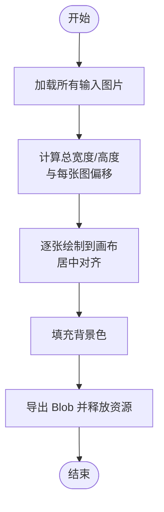

图表来源
- [src/tools/image/combine/logic.ts:3-58](file://src/tools/image/combine/logic.ts#L3-L58)

章节来源
- [src/tools/image/combine/logic.ts:1-79](file://src/tools/image/combine/logic.ts#L1-L79)

### HEIC 格式转换（格式解析、元数据处理、兼容性）
- 动态导入
  - 使用动态 import 避免 SSR 环境下 window 未定义错误。
- 转换流程
  - 接受目标 MIME 类型与质量参数，返回单个 Blob 或首个元素（数组兼容）。
- 兼容性
  - 通过 heic2any 库桥接浏览器端转换，无需服务端参与。

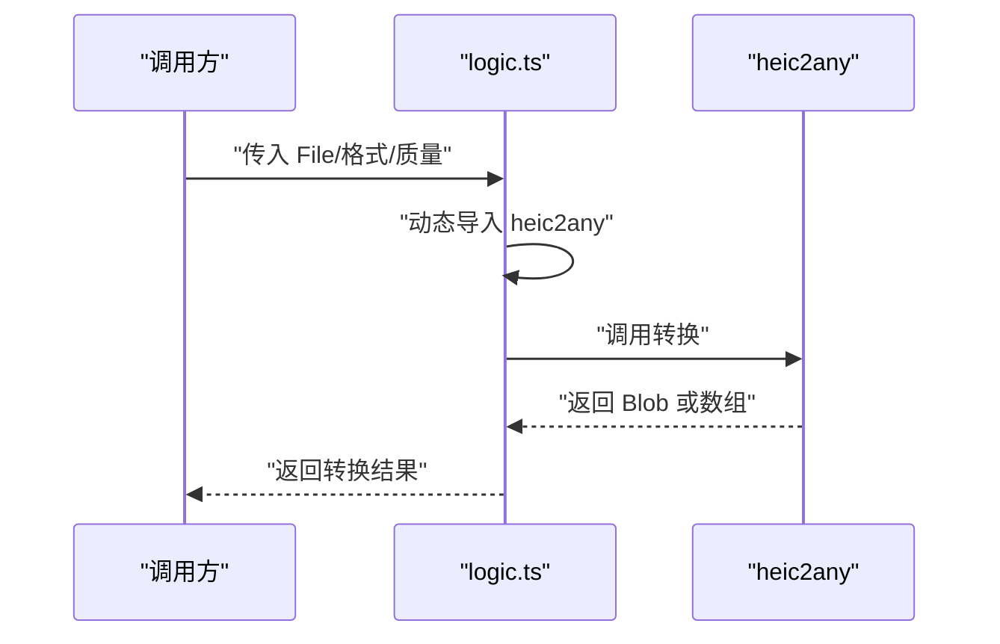

图表来源
- [src/tools/image/heic-convert/logic.ts:3-22](file://src/tools/image/heic-convert/logic.ts#L3-L22)

章节来源
- [src/tools/image/heic-convert/logic.ts:1-23](file://src/tools/image/heic-convert/logic.ts#L1-L23)

### 像素化效果（像素块大小、缩放与重采样）
- 算法步骤
  - 计算小图尺寸：smallW = ceil(width / pixelSize)，smallH = ceil(height / pixelSize)。
  - 使用离屏画布进行降采样，避免同画布源/目标重叠导致的伪影。
  - 主画布关闭平滑，将离屏画布放大回原尺寸，形成像素块效果。
- 输出
  - 以原图类型或默认 PNG 导出，设置合理质量参数。

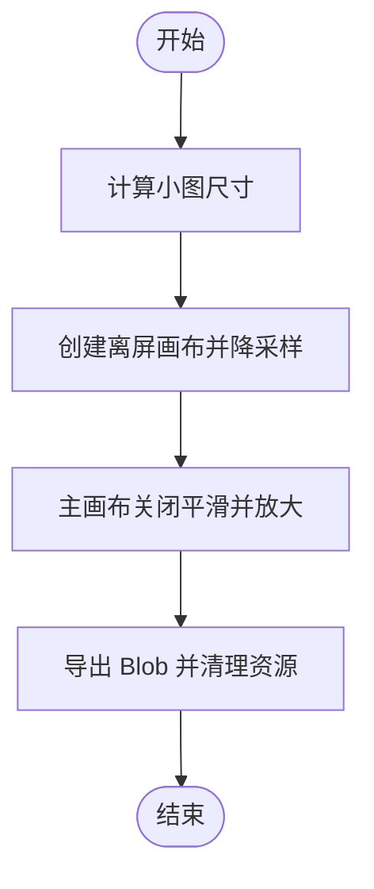

图表来源
- [src/tools/image/pixelate/logic.ts:1-49](file://src/tools/image/pixelate/logic.ts#L1-L49)

章节来源
- [src/tools/image/pixelate/logic.ts:1-49](file://src/tools/image/pixelate/logic.ts#L1-L49)

### EXIF 信息移除（二进制协议解析与隐私保护）
- 支持格式
  - JPEG、PNG、WebP、AVIF。
- 实现要点
  - JPEG：扫描段落，剔除 APP1-APP15（含 EXIF/XMP）与 COM，保留 ICC（APP2）。
  - PNG：剔除 tEXt/zTXt/iTXt/eXIf/tIME/iCCP/dSIG 等元数据块，保留 iCCP。
  - WebP：剔除 EXIF/XMP 块，并清除 VP8X 标志位，重建 RIFF 头大小。
  - AVIF（ISOBMFF）：解析 meta/iinf/iloc，定位 Exif/mime 数据项，就地清零其数据区域，保持容器结构不变。
- 输出
  - 若未发现元数据，返回原始缓冲区；否则返回清洗后的 Blob，并保留扩展名。

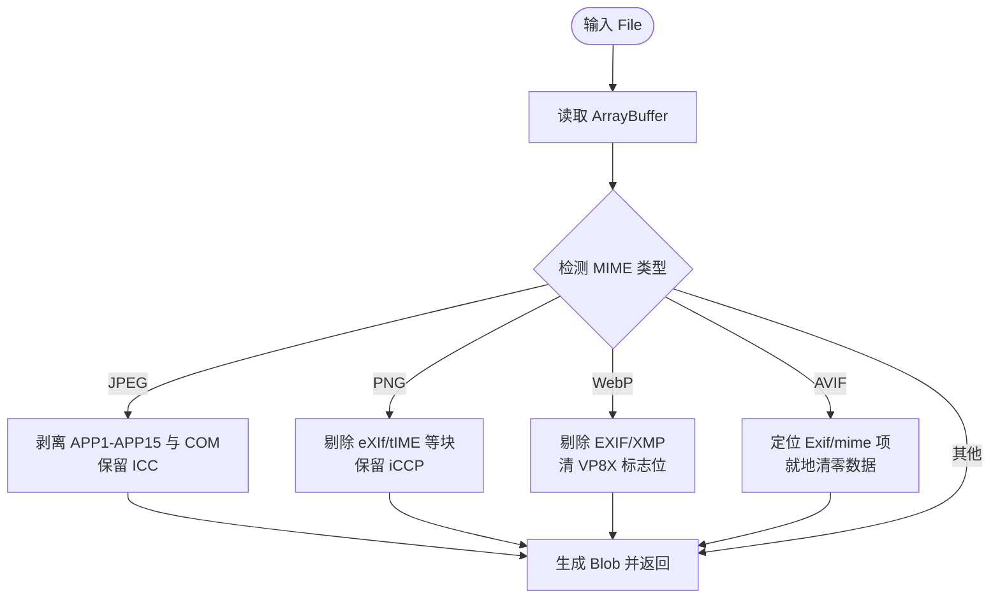

图表来源
- [src/tools/image/remove-exif/logic.ts:16-92](file://src/tools/image/remove-exif/logic.ts#L16-L92)
- [src/tools/image/remove-exif/logic.ts:114-153](file://src/tools/image/remove-exif/logic.ts#L114-L153)
- [src/tools/image/remove-exif/logic.ts:157-221](file://src/tools/image/remove-exif/logic.ts#L157-L221)
- [src/tools/image/remove-exif/logic.ts:266-446](file://src/tools/image/remove-exif/logic.ts#L266-L446)

章节来源
- [src/tools/image/remove-exif/logic.ts:1-489](file://src/tools/image/remove-exif/logic.ts#L1-L489)

### 图像分割（网格切分、边界处理、质量保持）
- 切分策略
  - 按列数与行数计算基础瓦片尺寸，最后一行/列吸收余数像素，保证覆盖完整。
- 渲染与导出
  - 逐个瓦片绘制到独立画布并导出 PNG；最终可打包为 ZIP。
- 资源管理
  - 使用 finally 释放原始图片对象 URL。

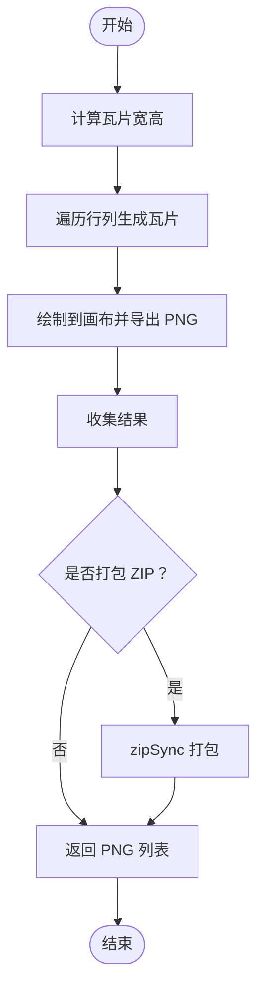

图表来源
- [src/tools/image/split/logic.ts:3-49](file://src/tools/image/split/logic.ts#L3-L49)
- [src/tools/image/split/logic.ts:51-60](file://src/tools/image/split/logic.ts#L51-L60)

章节来源
- [src/tools/image/split/logic.ts:1-81](file://src/tools/image/split/logic.ts#L1-L81)

### SVG 转 PNG（矢量图形处理、分辨率适配、透明度）
- 维度注入
  - 若 SVG 缺少 width/height 但存在 viewBox，则注入宽高，确保  具备固有尺寸。
- 渲染与导出
  - 将 SVG 文本封装为 Blob 并加载为 Image，按 scale 比例绘制到 Canvas，导出 PNG。
- 错误处理
  - 当 SVG 无维度时拒绝转换，提示用户补充 width/height 或 viewBox。

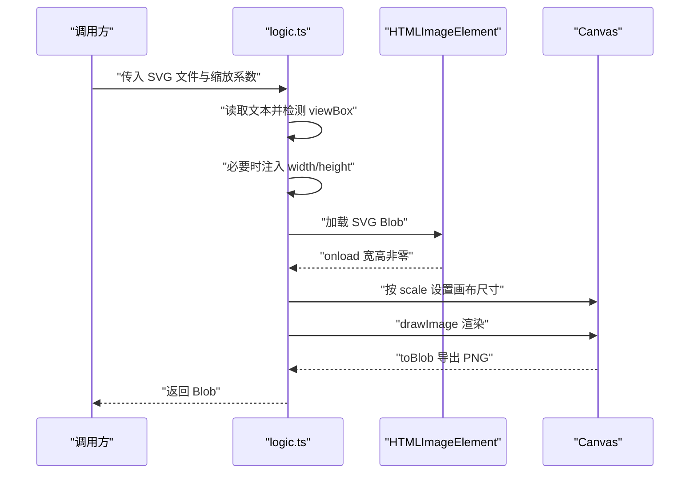

图表来源
- [src/tools/image/svg-to-png/logic.ts:1-60](file://src/tools/image/svg-to-png/logic.ts#L1-L60)

章节来源
- [src/tools/image/svg-to-png/logic.ts:1-60](file://src/tools/image/svg-to-png/logic.ts#L1-L60)

### 文字添加（字体渲染、位置控制、样式定制）
- 字体与样式
  - 使用字号、颜色与默认字体；基线设为 middle，便于垂直居中。
- 位置控制
  - 支持 center、top-left、top-right、bottom-left、bottom-right 五种定位，结合边距 margin 与文本高度计算坐标。
- 输出
  - 以原图类型或默认 PNG 导出，设置质量参数。

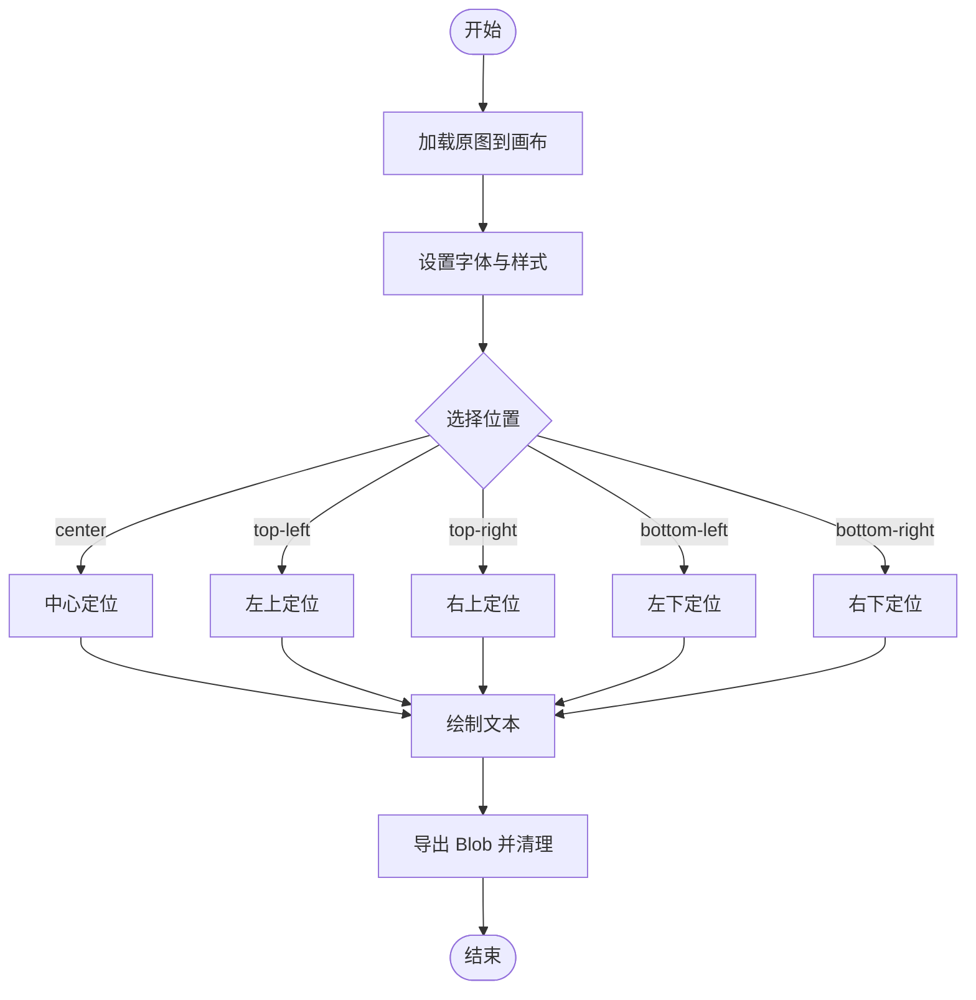

图表来源
- [src/tools/image/add-text/logic.ts:8-84](file://src/tools/image/add-text/logic.ts#L8-L84)

章节来源
- [src/tools/image/add-text/logic.ts:1-85](file://src/tools/image/add-text/logic.ts#L1-L85)

### 圆形裁剪（几何算法、蒙版生成、边缘平滑）
- 几何算法
  - 选取较小边作为直径，计算圆心与半径；使用 clip 与 arc 绘制圆形蒙版。
- 裁剪策略
  - 计算偏移量，将原图按中心对齐绘制到正方形画布，超出部分被裁剪。
- 输出
  - 导出 PNG，释放对象 URL。

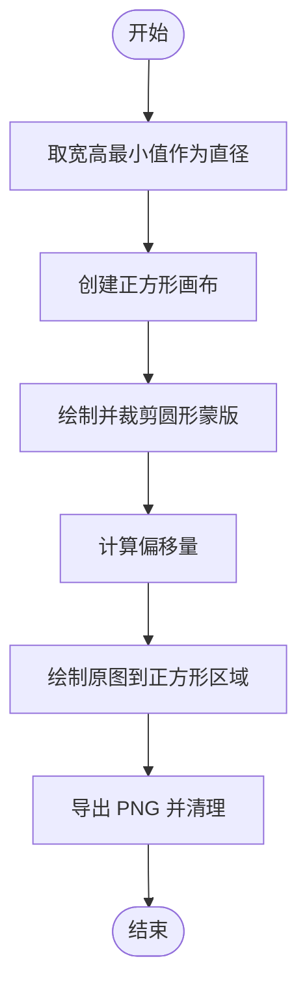

图表来源
- [src/tools/image/circle-crop/logic.ts:1-40](file://src/tools/image/circle-crop/logic.ts#L1-L40)

章节来源
- [src/tools/image/circle-crop/logic.ts:1-40](file://src/tools/image/circle-crop/logic.ts#L1-L40)

### 拼贴制作（组合算法与批量处理）
- 组合算法
  - 可复用“图像合并”逻辑，先将多图按布局拼接为一张大图，再结合“图像分割”将大图按网格切分，形成拼贴。
- 批量处理
  - “图像分割”提供打包为 ZIP 的能力，便于下载与归档；也可与“图像合并”配合，先合并再切分，或先切分再合并生成不同密度的拼贴。

章节来源
- [src/tools/image/combine/logic.ts:1-79](file://src/tools/image/combine/logic.ts#L1-L79)
- [src/tools/image/split/logic.ts:51-60](file://src/tools/image/split/logic.ts#L51-L60)

## 依赖关系分析
- 工具注册
  - 注册中心集中导入各工具的逻辑模块，按类别与特性排序，供路由与导航使用。
- 外部依赖
  - HEIC 转换依赖 heic2any（动态导入）。
  - 图像分割依赖 fflate 的 zipSync 进行打包。
  - 所有工具均使用浏览器原生 Canvas API 与 File/Blob 流程。

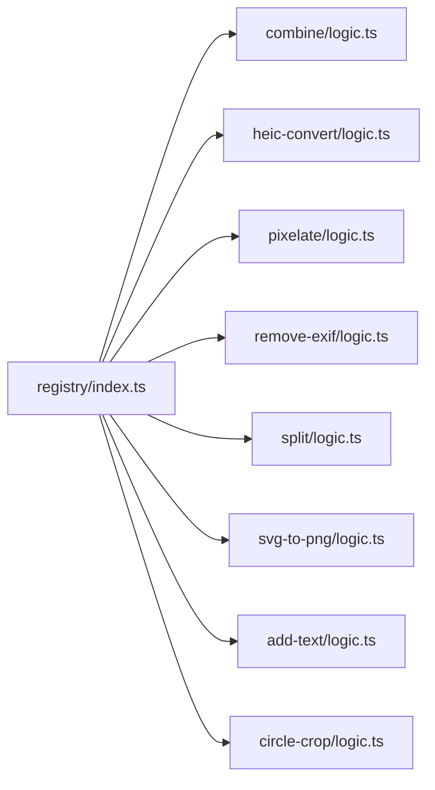

图表来源
- [src/lib/registry/index.ts:66-133](file://src/lib/registry/index.ts#L66-L133)

章节来源
- [src/lib/registry/index.ts:66-133](file://src/lib/registry/index.ts#L66-L133)

## 性能考量
- 画布操作
  - 控制像素总量，避免超大图导致内存压力；必要时在 UI 层限制输入尺寸。
- 降采样与重采样
  - 像素化采用离屏画布降采样，减少主画布绘制开销；关闭平滑避免额外模糊。
- 资源释放
  - 及时 revoke 对象 URL，避免内存泄漏；在 finally 中统一清理。
- 批量处理
  - 分割阶段逐片导出，避免一次性占用过多内存；ZIP 打包在浏览器端完成，注意文件数量与体积上限。

## 故障排查指南
- 图像合并
  - 若输出空白，检查布局参数与尺寸计算；确认背景填充与绘制顺序。
- HEIC 转换
  - 若转换失败，确认 heic2any 是否成功动态导入；检查输入文件类型与质量参数范围。
- 像素化
  - 若出现条纹或模糊，检查 pixelSize 是否过大；确保离屏画布降采样后再放大。
- EXIF 移除
  - 若未生效，确认文件 MIME 类型是否受支持；JPEG/PNG/WebP/AVIF 的剥离逻辑不同。
- 图像分割
  - 若最后一行/列尺寸异常，检查余数吸收逻辑；确认导出格式与文件名。
- SVG 转 PNG
  - 若无尺寸，确保 SVG 包含 width/height 或 viewBox；scale 参数过小可能导致渲染失败。
- 文字添加
  - 若文字溢出或截断，调整字号与边距；确认文本对齐与基线设置。
- 圆形裁剪
  - 若边缘锯齿，检查画布尺寸与偏移量；确保绘制时使用整数像素。

章节来源
- [src/tools/image/combine/logic.ts:1-79](file://src/tools/image/combine/logic.ts#L1-L79)
- [src/tools/image/heic-convert/logic.ts:1-23](file://src/tools/image/heic-convert/logic.ts#L1-L23)
- [src/tools/image/pixelate/logic.ts:1-49](file://src/tools/image/pixelate/logic.ts#L1-L49)
- [src/tools/image/remove-exif/logic.ts:1-489](file://src/tools/image/remove-exif/logic.ts#L1-L489)
- [src/tools/image/split/logic.ts:1-81](file://src/tools/image/split/logic.ts#L1-L81)
- [src/tools/image/svg-to-png/logic.ts:1-60](file://src/tools/image/svg-to-png/logic.ts#L1-L60)
- [src/tools/image/add-text/logic.ts:1-85](file://src/tools/image/add-text/logic.ts#L1-L85)
- [src/tools/image/circle-crop/logic.ts:1-40](file://src/tools/image/circle-crop/logic.ts#L1-L40)

## 结论
本工具集通过纯前端实现，覆盖从格式转换、元数据处理到特效与合成的完整链路。各工具以逻辑层为核心，具备清晰的数据流与错误处理路径，适合在浏览器端完成隐私友好的图像处理任务。建议在生产环境中结合 UI 层进行输入约束与进度反馈，并在批量场景中关注内存与性能瓶颈。

## 附录
- 技术栈概览：Next.js、TypeScript、Tailwind CSS、FFmpeg.wasm（视频/音频）、pdf-lib/pdfjs（PDF）、browser-image-compression（图片）。
- 工具分类：图片、开发者、PDF、视频、音频。

章节来源
- [README.md:26-33](file://README.md#L26-L33)
- [README.md:16-25](file://README.md#L16-L25)