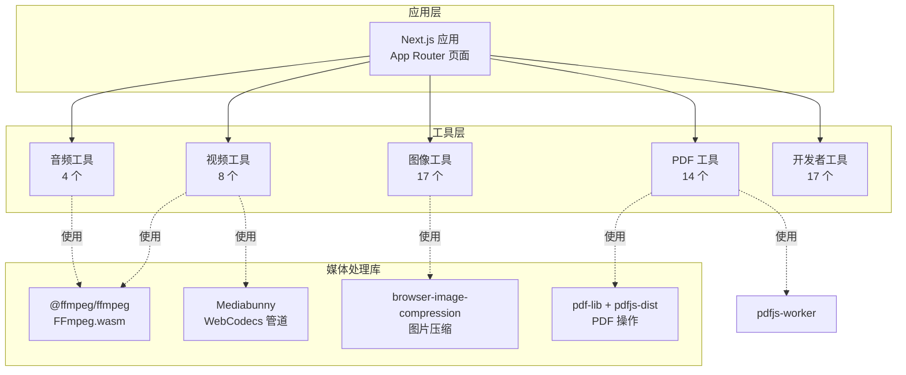
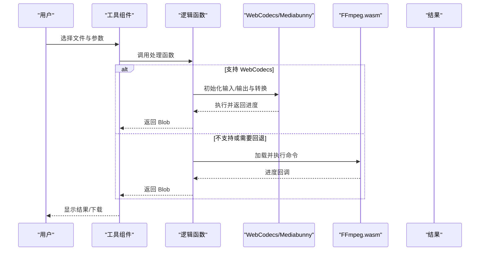
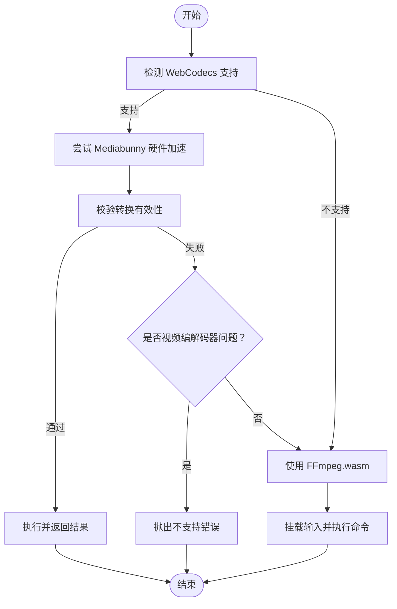
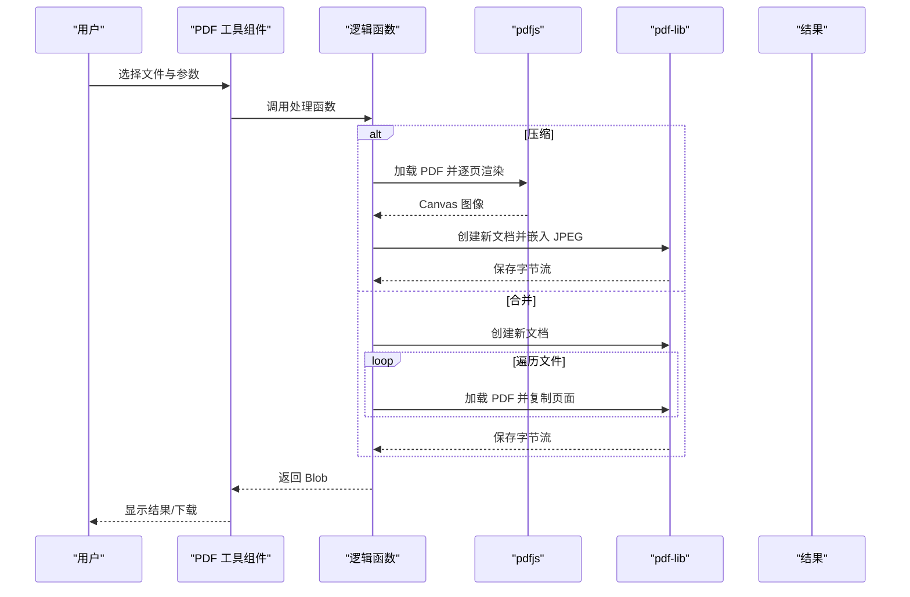
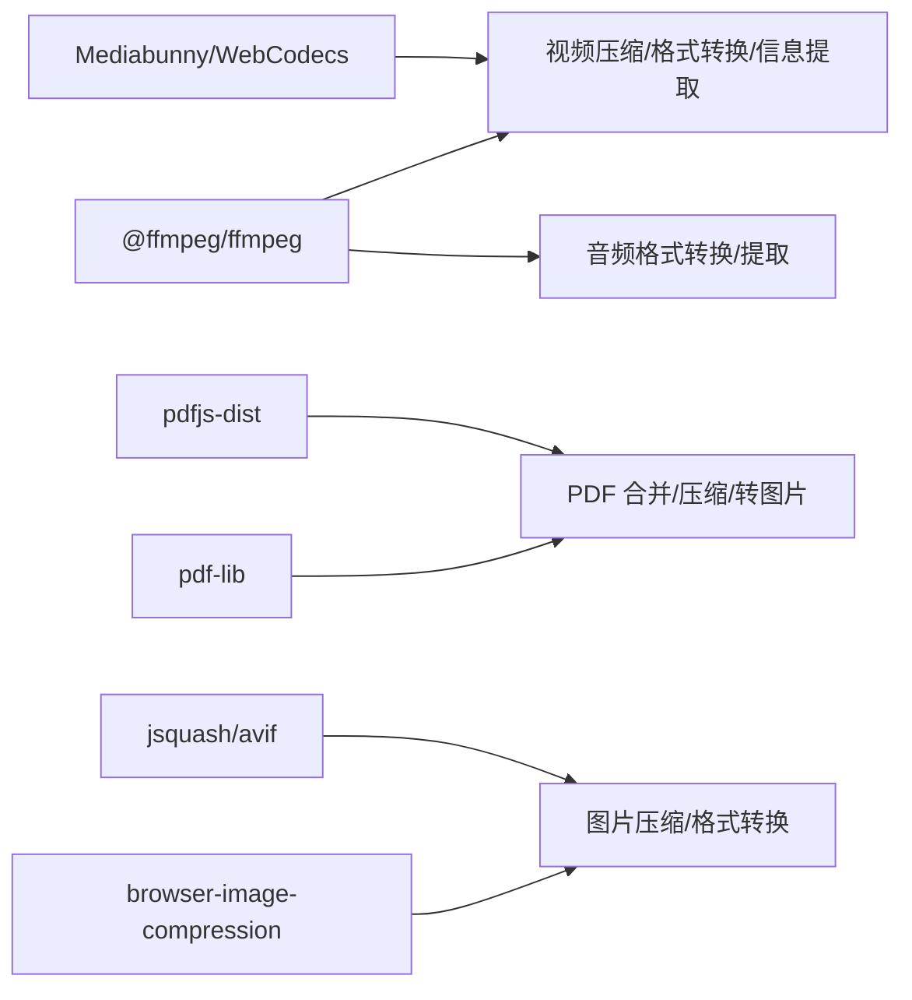

# 工具分类

<cite>
**本文引用的文件**
- [README.md](file://README.md)
- [package.json](file://package.json)
- [src/lib/ffmpeg.ts](file://src/lib/ffmpeg.ts)
- [src/lib/media-pipeline.ts](file://src/lib/media-pipeline.ts)
- [src/lib/pdfjs.ts](file://src/lib/pdfjs.ts)
- [src/tools/image/compress/logic.ts](file://src/tools/image/compress/logic.ts)
- [src/tools/image/format-converter/logic.ts](file://src/tools/image/format-converter/logic.ts)
- [src/tools/video/compress/logic.ts](file://src/tools/video/compress/logic.ts)
- [src/tools/video/info/logic.ts](file://src/tools/video/info/logic.ts)
- [src/tools/audio/convert/logic.ts](file://src/tools/audio/convert/logic.ts)
- [src/tools/audio/extract/logic.ts](file://src/tools/audio/extract/logic.ts)
- [src/tools/pdf/merge/logic.ts](file://src/tools/pdf/merge/logic.ts)
- [src/tools/pdf/compress/logic.ts](file://src/tools/pdf/compress/logic.ts)
- [src/tools/developer/base64/logic.ts](file://src/tools/developer/base64/logic.ts)
- [src/tools/developer/regex-tester/logic.ts](file://src/tools/developer/regex-tester/logic.ts)
</cite>

## 目录
1. [简介](#简介)
2. [项目结构](#项目结构)
3. [核心组件](#核心组件)
4. [架构总览](#架构总览)
5. [详细组件分析](#详细组件分析)
6. [依赖关系分析](#依赖关系分析)
7. [性能考量](#性能考量)
8. [故障排查指南](#故障排查指南)
9. [结论](#结论)
10. [附录](#附录)

## 简介
本文件面向 PrivaDeck 媒体工具箱的五大工具分类，提供全面的功能与实现说明。PrivaDeck 是一个浏览器端多媒体处理工具箱，所有处理均在本地完成，不上传文件，支持 21 种语言，采用静态生成与 PWA，具备隐私优先、离线可用、暗色模式等特性。工具涵盖图像、视频、音频、PDF、开发者五类，共计约 60 个工具。

- 图像工具：17 个，覆盖压缩、格式转换、尺寸调整、裁剪、翻转、灰度、去 EXIF、拼图、圆形裁剪、像素化、添加边框/水印、HEIC 转换、SVG 转 PNG 等。
- 视频工具：8 个，覆盖压缩、格式转换、裁剪、旋转、信息提取、静音、转 GIF、转 WebP、剪辑等。
- 音频工具：4 个，覆盖剪辑、格式转换、提取音频、音量调整。
- PDF 工具：14 个，覆盖合并、拆分、压缩、转图片、提取文本、添加页码、添加水印、删除页、重排、旋转、裁剪、转图片、电子签名等。
- 开发者工具：17 个，覆盖归档、Base64 编解码、大小写转换、颜色转换、CSV/JSON/YAML 转换、哈希生成、JSON/Markdown 预览、OCR、正则测试、文本差异、时间戳、URL 编解码、词数统计等。

## 项目结构
项目采用 Next.js App Router，工具按分类组织在 src/tools 下，媒体处理依赖 FFmpeg.wasm、pdf-lib、pdfjs、browser-image-compression、Mediabunny 等库；国际化通过 next-intl 提供多语言支持。

图表来源
- [README.md:55-78](file://README.md#L55-L78)
- [package.json:11-32](file://package.json#L11-L32)

章节来源
- [README.md:55-78](file://README.md#L55-L78)
- [package.json:11-32](file://package.json#L11-L32)

## 核心组件
- FFmpeg.wasm 封装：提供单例加载、进度回调、挂载输入文件、序列化执行等能力，避免内存拷贝与并发冲突。
- WebCodecs/Mediabunny 管道：在支持的浏览器上优先使用硬件加速进行视频编解码，自动回退至 FFmpeg。
- PDF.js/pdf-lib：统一管理 worker、页面渲染、嵌入图片、保存文档等。
- 图片压缩：基于 browser-image-compression，支持多种格式与质量控制。

章节来源
- [src/lib/ffmpeg.ts:1-144](file://src/lib/ffmpeg.ts#L1-L144)
- [src/lib/media-pipeline.ts:1-105](file://src/lib/media-pipeline.ts#L1-L105)
- [src/lib/pdfjs.ts:1-16](file://src/lib/pdfjs.ts#L1-L16)

## 架构总览
下图展示媒体处理的总体流程：前端选择工具与参数，调用对应逻辑函数，根据类型选择 WebCodecs 或 FFmpeg 进行处理，最终返回结果文件。

图表来源
- [src/lib/media-pipeline.ts:7-14](file://src/lib/media-pipeline.ts#L7-L14)
- [src/lib/media-pipeline.ts:93-104](file://src/lib/media-pipeline.ts#L93-L104)
- [src/lib/ffmpeg.ts:99-143](file://src/lib/ffmpeg.ts#L99-L143)

## 详细组件分析

### 图像处理工具（17 个）
- 压缩（browser-image-compression）
  - 实现要点：支持 JPEG/PNG/WebP/AVIF 输出，可设置质量、最大尺寸、最大文件体积、是否保留 EXIF；提供预设与自定义分辨率；AVIF 路径通过 Canvas + jsquash/avif 编码。
  - 关键接口路径：[compressImage:83-123](file://src/tools/image/compress/logic.ts#L83-L123)
  - 性能与质量：WebWorker 压缩减少主线程阻塞；AVIF 在高压缩比场景显著减小体积。
  - 最佳实践：优先使用 WebP/AVIF；对大图先降采样再压缩；保留 EXIF 会增大体积。
- 格式转换（Canvas + jsquash/avif）
  - 实现要点：读取图像到 Canvas，按目标格式导出；ICO 限制最大尺寸；AVIF 使用 jsquash/avif。
  - 关键接口路径：[convertImage:75-158](file://src/tools/image/format-converter/logic.ts#L75-L158)
  - 最佳实践：PNG/ICO 不设置质量参数；AVIF 质量 0-1 映射到 0-100。
- 尺寸调整（缩放/裁剪/圆形裁剪/像素化）
  - 实现要点：Canvas 绘制时指定宽高；圆形裁剪通过遮罩实现；像素化通过低分辨率采样再放大。
  - 关键接口路径：[resize](file://src/tools/image/resize/logic.ts)、[circle-crop](file://src/tools/image/circle-crop/logic.ts)、[pixelate](file://src/tools/image/pixelate/logic.ts)
  - 最佳实践：先裁剪再缩放，避免失真；像素化适合隐私保护。
- 边框/水印（添加边框/添加文字/水印）
  - 实现要点：Canvas 绘制边框或文字；水印支持透明度与位置；支持批量叠加。
  - 关键接口路径：[add-border](file://src/tools/image/add-border/logic.ts)、[add-text](file://src/tools/image/add-text/logic.ts)、[watermark](file://src/tools/image/watermark/logic.ts)
  - 最佳实践：水印使用半透明 PNG；批量处理时注意内存释放。
- 其他实用工具（去 EXIF、拼图、HEIC 转换、SVG 转 PNG）
  - 实现要点：去 EXIF 通过压缩参数；拼图通过多画布合成；HEIC 转换使用 heic2any；SVG 转 PNG 通过 Canvas 渲染。
  - 关键接口路径：[remove-exif](file://src/tools/image/remove-exif/logic.ts)、[collage](file://src/tools/image/collage/logic.ts)、[heic-convert](file://src/tools/image/heic-convert/logic.ts)、[svg-to-png](file://src/tools/image/svg-to-png/logic.ts)
  - 最佳实践：HEIC 转换需等待解码完成；SVG 渲染前确保矢量清晰度。

章节来源
- [src/tools/image/compress/logic.ts:1-135](file://src/tools/image/compress/logic.ts#L1-L135)
- [src/tools/image/format-converter/logic.ts:1-161](file://src/tools/image/format-converter/logic.ts#L1-L161)

### 视频处理工具（8 个）
- 压缩（WebCodecs 优先，FFmpeg 回退）
  - 实现要点：WebCodecsFallbackError 用于区分视频/音频编解码器问题；支持 CRF、预设、分辨率、帧率、音频码率、最大码率上限；Mediabunny 提供硬件加速；不支持的视频编解码器抛出 UnsupportedVideoCodecError。
  - 关键接口路径：[compressVideo:85-110](file://src/tools/video/compress/logic.ts#L85-L110)、[compressWithWebCodecs:112-201](file://src/tools/video/compress/logic.ts#L112-L201)、[compressWithFFmpeg:203-256](file://src/tools/video/compress/logic.ts#L203-L256)
  - 性能与兼容：优先硬件加速；遇到 HEVC/VP9/AV1 等不支持的视频编解码器直接失败，避免低效回退。
- 格式转换（FFmpeg）
  - 实现要点：通过 execWithMount 挂载输入文件，构建参数数组，输出目标格式。
  - 关键接口路径：[format-convert](file://src/tools/video/format-convert/logic.ts)
  - 最佳实践：选择合适预设与码率，避免过度压缩导致画质劣化。
- 信息提取（probe + 日志解析）
  - 实现要点：运行 ffmpeg -i 获取容器、时长、总码率、各轨道信息；解析日志提取编解码器、分辨率、FPS、采样率、声道、色彩空间、扫描类型等。
  - 关键接口路径：[probeVideo:33-71](file://src/tools/video/info/logic.ts#L33-L71)、[parseFFmpegLog:82-140](file://src/tools/video/info/logic.ts#L82-L140)
  - 最佳实践：结合 thumbnails 生成关键帧预览。
- 裁剪/旋转/静音/转 GIF/转 WebP/剪辑
  - 实现要点：基于 FFmpeg 参数组合实现；转 GIF/WebP 时控制帧率与质量；剪辑通过时间参数实现。
  - 关键接口路径：[crop](file://src/tools/video/crop/logic.ts)、[rotate](file://src/tools/video/rotate/logic.ts)、[mute](file://src/tools/video/mute/logic.ts)、[to-gif](file://src/tools/video/to-gif/logic.ts)、[to-webp](file://src/tools/video/to-webp/logic.ts)、[trim](file://src/tools/video/trim/logic.ts)

图表来源
- [src/lib/media-pipeline.ts:59-91](file://src/lib/media-pipeline.ts#L59-L91)
- [src/tools/video/compress/logic.ts:92-110](file://src/tools/video/compress/logic.ts#L92-L110)

章节来源
- [src/tools/video/compress/logic.ts:1-257](file://src/tools/video/compress/logic.ts#L1-L257)
- [src/tools/video/info/logic.ts:1-272](file://src/tools/video/info/logic.ts#L1-L272)

### 音频处理工具（4 个）
- 格式转换
  - 实现要点：支持 MP3、WAV、OGG、AAC、FLAC；通过 FFmpeg 参数映射不同质量等级。
  - 关键接口路径：[convertAudio:21-34](file://src/tools/audio/convert/logic.ts#L21-L34)
  - 最佳实践：MP3/WAV/OGG/AAC/FLAC 各有适用场景，注意码率与兼容性。
- 提取音频
  - 实现要点：从视频中分离音频轨，保持目标格式与质量。
  - 关键接口路径：[extractAudio:11-25](file://src/tools/audio/extract/logic.ts#L11-L25)
- 剪辑/音量调整
  - 实现要点：通过 FFmpeg 时间切片与音量滤镜实现。
  - 关键接口路径：[trim](file://src/tools/audio/trim/logic.ts)、[volume](file://src/tools/audio/volume/logic.ts)

章节来源
- [src/tools/audio/convert/logic.ts:1-35](file://src/tools/audio/convert/logic.ts#L1-L35)
- [src/tools/audio/extract/logic.ts:1-26](file://src/tools/audio/extract/logic.ts#L1-L26)

### PDF 处理工具（14 个）
- 合并
  - 实现要点：逐个加载 PDF，复制页面并加入新文档，保存输出。
  - 关键接口路径：[mergePdfs:3-17](file://src/tools/pdf/merge/logic.ts#L3-L17)
- 压缩优化
  - 实现要点：使用 pdfjs 渲染页面为 Canvas，转 JPEG 并嵌入，按质量与缩放比例控制体积。
  - 关键接口路径：[compressPdf:12-66](file://src/tools/pdf/compress/logic.ts#L12-L66)
- 文本提取/图片提取/转图片
  - 实现要点：pdfjs 逐页渲染，Canvas 转 JPEG/BMP；提取文本通过 pdfjs API。
  - 关键接口路径：[extract-text](file://src/tools/pdf/extract-text/logic.ts)、[extract-images](file://src/tools/pdf/extract-images/logic.ts)、[to-image](file://src/tools/pdf/to-image/logic.ts)
- 其他工具（添加页码、添加水印、删除页、重排、旋转、裁剪、电子签名）
  - 实现要点：基于 pdf-lib 的页面操作与嵌入资源；水印通过透明图片叠加；签名通过数字证书与签名字段实现。
  - 关键接口路径：[add-page-numbers](file://src/tools/pdf/add-page-numbers/logic.ts)、[add-watermark](file://src/tools/pdf/add-watermark/logic.ts)、[delete-pages](file://src/tools/pdf/delete-pages/logic.ts)、[rearrange](file://src/tools/pdf/rearrange/logic.ts)、[rotate](file://src/tools/pdf/rotate/logic.ts)、[crop](file://src/tools/pdf/crop/logic.ts)、[esign](file://src/tools/pdf/esign/logic.ts)

图表来源
- [src/tools/pdf/compress/logic.ts:12-66](file://src/tools/pdf/compress/logic.ts#L12-L66)
- [src/tools/pdf/merge/logic.ts:3-17](file://src/tools/pdf/merge/logic.ts#L3-L17)
- [src/lib/pdfjs.ts:3-13](file://src/lib/pdfjs.ts#L3-L13)

章节来源
- [src/tools/pdf/merge/logic.ts:1-24](file://src/tools/pdf/merge/logic.ts#L1-L24)
- [src/tools/pdf/compress/logic.ts:1-73](file://src/tools/pdf/compress/logic.ts#L1-L73)
- [src/lib/pdfjs.ts:1-16](file://src/lib/pdfjs.ts#L1-L16)

### 开发者工具（17 个）
- 编码解码（Base64）
  - 实现要点：安全处理 UTF-8 字符串，异常时返回错误提示。
  - 关键接口路径：[encodeBase64:1-11](file://src/tools/developer/base64/logic.ts#L1-L11)、[decodeBase64:13-23](file://src/tools/developer/base64/logic.ts#L13-L23)
- 正则测试
  - 实现要点：支持全局/非全局匹配，高亮显示匹配片段，转义 HTML。
  - 关键接口路径：[testRegex:7-46](file://src/tools/developer/regex-tester/logic.ts#L7-L46)、[highlightMatches:48-75](file://src/tools/developer/regex-tester/logic.ts#L48-L75)
- 其他常用工具（JSON/CSV/YAML 转换、哈希生成、颜色转换、Markdown 预览、OCR、URL 编解码、时间戳、词数统计、文本差异、Lorem Ipsum、归档）
  - 实现要点：JSON/XML/YAML 转换使用标准库；哈希生成使用 WebCrypto；颜色转换通过 Canvas；OCR 使用 Tesseract.js；URL 编解码使用浏览器 API；词数统计按空格与标点分割；文本差异对比两段文本；Lorem Ipsum 生成占位文本；归档使用 fflate。
  - 关键接口路径：[json-formatter](file://src/tools/developer/json-formatter/logic.ts)、[csv-json](file://src/tools/developer/csv-json/logic.ts)、[yaml-json](file://src/tools/developer/yaml-json/logic.ts)、[hash-generator](file://src/tools/developer/hash-generator/logic.ts)、[color-converter](file://src/tools/developer/color-converter/logic.ts)、[markdown-preview](file://src/tools/developer/markdown-preview/logic.ts)、[ocr](file://src/tools/developer/ocr/logic.ts)、[url-encoder](file://src/tools/developer/url-encoder/logic.ts)、[timestamp](file://src/tools/developer/timestamp/logic.ts)、[word-counter](file://src/tools/developer/word-counter/logic.ts)、[text-diff](file://src/tools/developer/text-diff/logic.ts)、[lorem-ipsum](file://src/tools/developer/lorem-ipsum/logic.ts)、[archive](file://src/tools/developer/archive/logic.ts)

章节来源
- [src/tools/developer/base64/logic.ts:1-24](file://src/tools/developer/base64/logic.ts#L1-L24)
- [src/tools/developer/regex-tester/logic.ts:1-84](file://src/tools/developer/regex-tester/logic.ts#L1-L84)

## 依赖关系分析
- 媒体处理依赖
  - FFmpeg.wasm：视频/音频处理的通用回退方案，提供挂载输入、序列化执行、进度回调。
  - Mediabunny/WebCodecs：在支持的浏览器上提供硬件加速，自动回退。
  - pdf-lib/pdfjs：PDF 文档操作与渲染。
  - browser-image-compression/jsquash/avif：图片压缩与 AVIF 编码。
- 工具注册与国际化
  - 工具注册表负责集中管理工具元数据与路由；多语言翻译文件分布在 messages 目录下，覆盖常见与工具分类专用键。

图表来源
- [package.json:11-32](file://package.json#L11-L32)
- [src/lib/ffmpeg.ts:1-144](file://src/lib/ffmpeg.ts#L1-L144)
- [src/lib/media-pipeline.ts:1-105](file://src/lib/media-pipeline.ts#L1-L105)
- [src/lib/pdfjs.ts:1-16](file://src/lib/pdfjs.ts#L1-L16)

章节来源
- [package.json:11-32](file://package.json#L11-L32)

## 性能考量
- WebCodecs 优先：在支持的浏览器上启用硬件加速，显著降低 CPU 占用与耗时；遇到不支持的视频编解码器直接失败，避免低效回退。
- FFmpeg.wasm 优化：使用 WORKERFS 挂载输入文件，避免内存拷贝；通过 Promise 队列串行执行，防止并发冲突；进度回调仅在有效范围内更新。
- 图片处理：AVIF 在高压缩比场景优势明显；Canvas 导出时避免不必要的中间对象；ICO 限制尺寸减少内存占用。
- PDF 处理：压缩时按质量与缩放比例平衡体积与清晰度；逐页渲染后及时释放 Canvas 内存。

## 故障排查指南
- WebCodecs 不可用
  - 现象：抛出 WebCodecsFallbackError 或 UnsupportedVideoCodecError。
  - 排查：确认浏览器支持 WebCodecs；检查视频/音频编解码器是否受支持；必要时改用 FFmpeg。
  - 参考路径：[WebCodecsFallbackError:32-41](file://src/lib/media-pipeline.ts#L32-L41)、[UnsupportedVideoCodecError:48-53](file://src/lib/media-pipeline.ts#L48-L53)
- FFmpeg 加载失败
  - 现象：加载 core/wasm URL 失败或实例化异常。
  - 排查：检查 CDN 可达性与 MIME 类型；确认 SharedArrayBuffer 支持（部分浏览器需配置）。
  - 参考路径：[getFFmpeg:10-39](file://src/lib/ffmpeg.ts#L10-L39)
- 进度回调异常
  - 现象：进度不在 0-100 区间或未触发。
  - 排查：确认 setProgressHandler 的原子性；检查队列状态与卸载清理。
  - 参考路径：[setProgressHandler:41-58](file://src/lib/ffmpeg.ts#L41-L58)
- PDF 渲染失败
  - 现象：页面渲染为空或报错。
  - 排查：确认 pdfjs worker 已正确配置；逐页检查渲染参数与 Canvas 尺寸。
  - 参考路径：[getPdfjs:3-13](file://src/lib/pdfjs.ts#L3-L13)

章节来源
- [src/lib/media-pipeline.ts:28-53](file://src/lib/media-pipeline.ts#L28-L53)
- [src/lib/ffmpeg.ts:10-58](file://src/lib/ffmpeg.ts#L10-L58)
- [src/lib/pdfjs.ts:3-13](file://src/lib/pdfjs.ts#L3-L13)

## 结论
PrivaDeck 通过 WebCodecs/Mediabunny 与 FFmpeg.wasm 的双轨策略，在保证隐私与离线能力的同时，兼顾性能与兼容性。图像、视频、音频、PDF、开发者工具覆盖广泛，满足日常多媒体处理需求。建议在实际使用中优先选择硬件加速路径，合理设置质量与分辨率参数，并关注浏览器兼容性与资源释放。

## 附录
- 使用示例与最佳实践（以路径代替具体代码）
  - 图像压缩：[compressImage:83-123](file://src/tools/image/compress/logic.ts#L83-L123)，建议先降采样再压缩，AVIF 适合大体积场景。
  - 图像格式转换：[convertImage:75-158](file://src/tools/image/format-converter/logic.ts#L75-L158)，PNG/ICO 不设质量，AVIF 质量 0-1 映射。
  - 视频压缩：[compressVideo:85-110](file://src/tools/video/compress/logic.ts#L85-L110)，CRF 与分辨率共同决定体积与画质。
  - 视频信息提取：[probeVideo:33-71](file://src/tools/video/info/logic.ts#L33-L71)，结合 [parseFFmpegLog:82-140](file://src/tools/video/info/logic.ts#L82-L140) 解析轨道详情。
  - 音频转换：[convertAudio:21-34](file://src/tools/audio/convert/logic.ts#L21-L34)，按场景选择 MP3/WAV/OGG/AAC/FLAC。
  - PDF 合并：[mergePdfs:3-17](file://src/tools/pdf/merge/logic.ts#L3-L17)，逐页复制并加入新文档。
  - PDF 压缩：[compressPdf:12-66](file://src/tools/pdf/compress/logic.ts#L12-L66)，控制缩放与 JPEG 质量平衡体积。
  - Base64 编解码：[encodeBase64:1-11](file://src/tools/developer/base64/logic.ts#L1-L11)、[decodeBase64:13-23](file://src/tools/developer/base64/logic.ts#L13-L23)，UTF-8 安全处理。
  - 正则测试：[testRegex:7-46](file://src/tools/developer/regex-tester/logic.ts#L7-L46)、[highlightMatches:48-75](file://src/tools/developer/regex-tester/logic.ts#L48-L75)，支持全局与分组捕获。