# 专业开发工具

<cite>
**本文档引用的文件**
- [README.md](file://README.md)
- [src/lib/registry/index.ts](file://src/lib/registry/index.ts)
- [src/tools/developer/ocr/logic.ts](file://src/tools/developer/ocr/logic.ts)
- [src/tools/developer/ocr/Ocr.tsx](file://src/tools/developer/ocr/Ocr.tsx)
- [src/tools/developer/timestamp/logic.ts](file://src/tools/developer/timestamp/logic.ts)
- [src/tools/developer/timestamp/Timestamp.tsx](file://src/tools/developer/timestamp/Timestamp.tsx)
- [src/tools/developer/lorem-ipsum/logic.ts](file://src/tools/developer/lorem-ipsum/logic.ts)
- [src/tools/developer/lorem-ipsum/LoremIpsum.tsx](file://src/tools/developer/lorem-ipsum/LoremIpsum.tsx)
- [src/tools/developer/markdown-preview/logic.ts](file://src/tools/developer/markdown-preview/logic.ts)
- [src/tools/developer/markdown-preview/MarkdownPreview.tsx](file://src/tools/developer/markdown-preview/MarkdownPreview.tsx)
- [messages/zh-Hans/tools-developer.json](file://messages/zh-Hans/tools-developer.json)
- [messages/en/tools-developer.json](file://messages/en/tools-developer.json)
</cite>

## 目录
1. [简介](#简介)
2. [项目结构](#项目结构)
3. [核心组件](#核心组件)
4. [架构概览](#架构概览)
5. [详细组件分析](#详细组件分析)
6. [依赖关系分析](#依赖关系分析)
7. [性能考虑](#性能考虑)
8. [故障排除指南](#故障排除指南)
9. [结论](#结论)

## 简介

PrivaDeck 是一个隐私优先的浏览器端多媒体工具箱，所有文件处理均在本地完成，零上传、零服务器。该项目提供了60个专业工具，涵盖图片、视频、音频、PDF和开发者五大分类。本文档专注于四个专业开发工具：OCR文字识别、时间戳处理、Lorem Ipsum文本生成和Markdown预览。

这些工具采用浏览器端处理架构，确保用户数据的隐私性和安全性。所有处理逻辑都在用户的浏览器中执行，文件绝不会离开设备，实现了真正的隐私保护。

## 项目结构

项目采用模块化架构，每个工具都是独立的模块，包含逻辑处理文件和React组件文件：

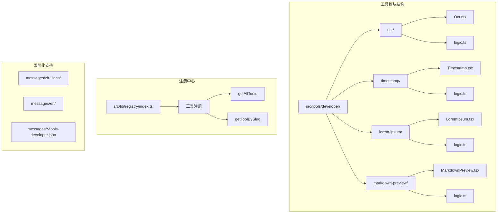

**图表来源**
- [src/lib/registry/index.ts:66-133](file://src/lib/registry/index.ts#L66-L133)
- [src/tools/developer/ocr/logic.ts:1-41](file://src/tools/developer/ocr/logic.ts#L1-L41)
- [src/tools/developer/timestamp/logic.ts:1-67](file://src/tools/developer/timestamp/logic.ts#L1-L67)

**章节来源**
- [README.md:55-78](file://README.md#L55-L78)
- [src/lib/registry/index.ts:1-164](file://src/lib/registry/index.ts#L1-L164)

## 核心组件

### OCR文字识别组件

OCR（Optical Character Recognition）文字识别工具基于Tesseract.js引擎，能够在浏览器端识别图片中的文字内容。该组件支持12种以上语言，包括英语、简体中文、繁体中文、日语、韩语等。

主要功能特性：
- 多语言支持：12种以上语言识别
- 实时进度显示：显示OCR处理进度
- 置信度评估：提供识别结果的置信度评分
- 本地处理：所有识别过程在浏览器中完成

### 时间戳处理组件

时间戳转换器提供Unix时间戳与人类可读日期之间的双向转换。该工具支持秒级和毫秒级时间戳，显示UTC、本地时间、ISO 8601和相对时间格式。

核心功能：
- 双向转换：时间戳与日期相互转换
- 多格式输出：UTC、本地时间、ISO 8601、相对时间
- 自动精度检测：自动识别秒级或毫秒级时间戳
- 实时计算：输入即刻显示转换结果

### Lorem Ipsum文本生成组件

Lorem Ipsum生成器可按段落、句子或单词数量生成占位文本。该工具遵循经典的Lorem Ipsum格式，为设计和开发场景提供合适的占位内容。

功能特点：
- 灵活生成方式：按段落、句子或单词数量生成
- 经典格式：遵循标准Lorem Ipsum文本格式
- 可定制输出：控制生成文本的数量和格式
- 即时生成：点击即得，无需等待

### Markdown预览组件

Markdown预览工具允许用户编写Markdown并实时查看HTML预览效果。该工具支持标准Markdown语法以及代码块、表格等扩展语法。

核心功能：
- 实时预览：编辑即刻渲染，所见即所得
- 分屏布局：编辑区和预览区并排显示
- 完整语法：支持标准Markdown和GFM扩展语法
- 安全渲染：HTML内容经过严格过滤和转义

**章节来源**
- [src/tools/developer/ocr/logic.ts:1-41](file://src/tools/developer/ocr/logic.ts#L1-L41)
- [src/tools/developer/timestamp/logic.ts:1-67](file://src/tools/developer/timestamp/logic.ts#L1-L67)
- [src/tools/developer/lorem-ipsum/logic.ts:1-67](file://src/tools/developer/lorem-ipsum/logic.ts#L1-L67)
- [src/tools/developer/markdown-preview/logic.ts:1-76](file://src/tools/developer/markdown-preview/logic.ts#L1-L76)

## 架构概览

项目采用模块化架构，每个工具都是独立的模块，通过注册中心统一管理：

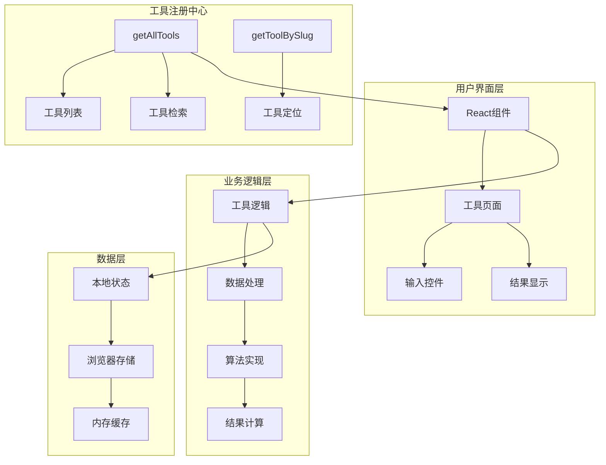

**图表来源**
- [src/lib/registry/index.ts:135-147](file://src/lib/registry/index.ts#L135-L147)
- [src/tools/developer/ocr/Ocr.tsx:12-89](file://src/tools/developer/ocr/Ocr.tsx#L12-L89)

**章节来源**
- [src/lib/registry/index.ts:1-164](file://src/lib/registry/index.ts#L1-L164)

## 详细组件分析

### OCR文字识别组件分析

#### 类关系图

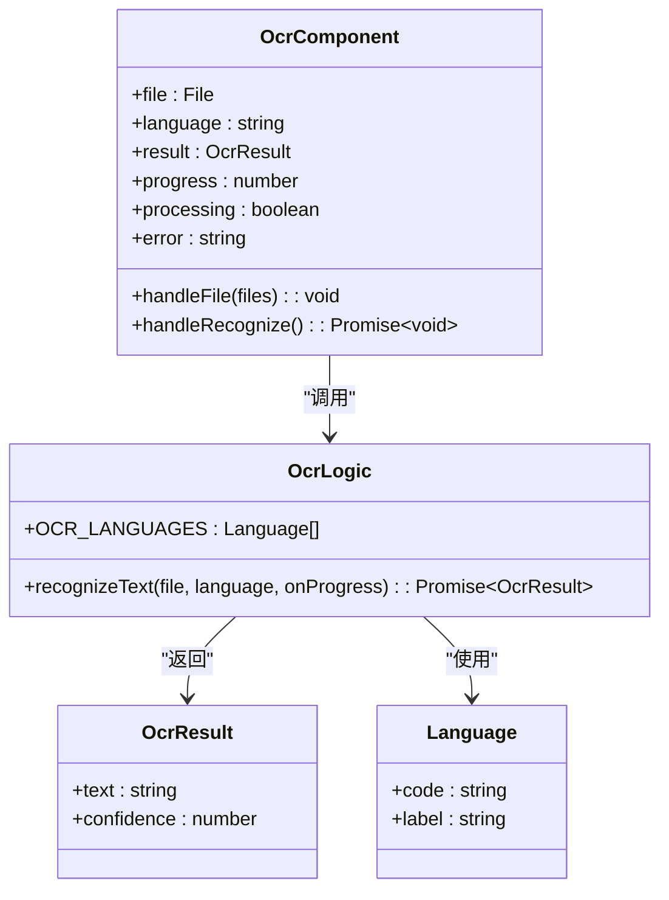

**图表来源**
- [src/tools/developer/ocr/logic.ts:3-21](file://src/tools/developer/ocr/logic.ts#L3-L21)
- [src/tools/developer/ocr/logic.ts:23-40](file://src/tools/developer/ocr/logic.ts#L23-L40)
- [src/tools/developer/ocr/Ocr.tsx:12-42](file://src/tools/developer/ocr/Ocr.tsx#L12-L42)

#### OCR处理流程

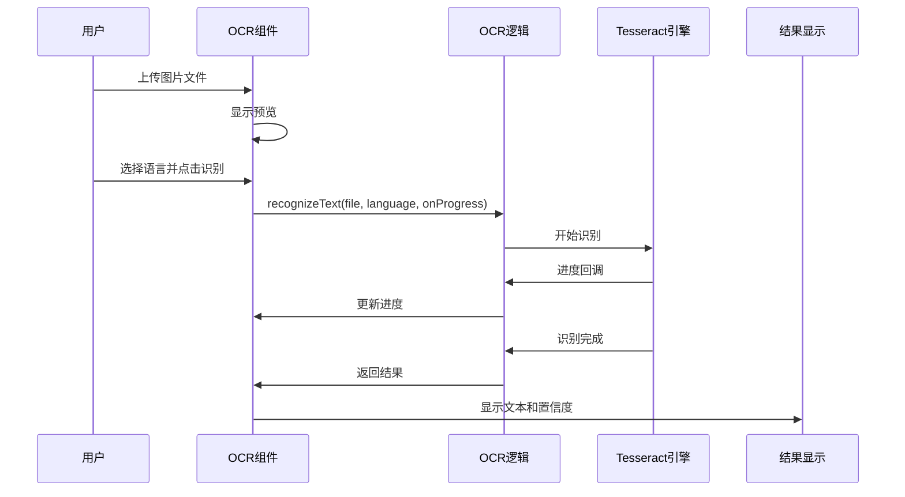

**图表来源**
- [src/tools/developer/ocr/logic.ts:23-40](file://src/tools/developer/ocr/logic.ts#L23-L40)
- [src/tools/developer/ocr/Ocr.tsx:28-42](file://src/tools/developer/ocr/Ocr.tsx#L28-L42)

#### OCR技术实现要点

1. **多语言支持**：支持12种以上语言，包括中英文、日文、韩文等
2. **进度监控**：通过Tesseract.js的logger回调实时显示识别进度
3. **置信度评估**：提供识别结果的置信度评分
4. **错误处理**：捕获并显示OCR识别过程中的异常

**章节来源**
- [src/tools/developer/ocr/logic.ts:1-41](file://src/tools/developer/ocr/logic.ts#L1-L41)
- [src/tools/developer/ocr/Ocr.tsx:1-90](file://src/tools/developer/ocr/Ocr.tsx#L1-L90)

### 时间戳处理组件分析

#### 类关系图

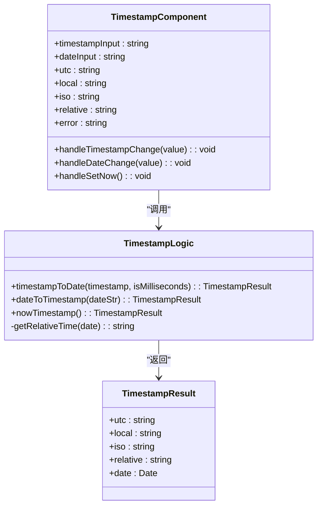

**图表来源**
- [src/tools/developer/timestamp/logic.ts:1-7](file://src/tools/developer/timestamp/logic.ts#L1-L7)
- [src/tools/developer/timestamp/logic.ts:9-42](file://src/tools/developer/timestamp/logic.ts#L9-L42)
- [src/tools/developer/timestamp/Timestamp.tsx:9-103](file://src/tools/developer/timestamp/Timestamp.tsx#L9-L103)

#### 时间戳转换流程

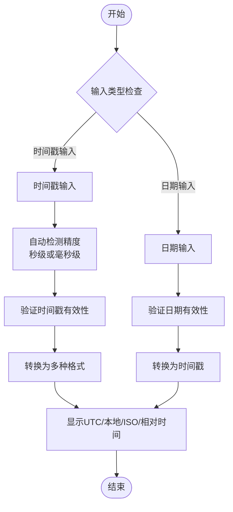

**图表来源**
- [src/tools/developer/timestamp/logic.ts:9-34](file://src/tools/developer/timestamp/logic.ts#L9-L34)
- [src/tools/developer/timestamp/Timestamp.tsx:53-103](file://src/tools/developer/timestamp/Timestamp.tsx#L53-L103)

#### 时间戳处理算法

1. **精度自动检测**：根据数字长度自动判断秒级或毫秒级时间戳
2. **多格式转换**：支持UTC、本地时间、ISO 8601和相对时间格式
3. **实时计算**：输入即刻显示转换结果
4. **错误处理**：提供清晰的错误提示信息

**章节来源**
- [src/tools/developer/timestamp/logic.ts:1-67](file://src/tools/developer/timestamp/logic.ts#L1-L67)
- [src/tools/developer/timestamp/Timestamp.tsx:1-177](file://src/tools/developer/timestamp/Timestamp.tsx#L1-L177)

### Lorem Ipsum文本生成组件分析

#### 类关系图

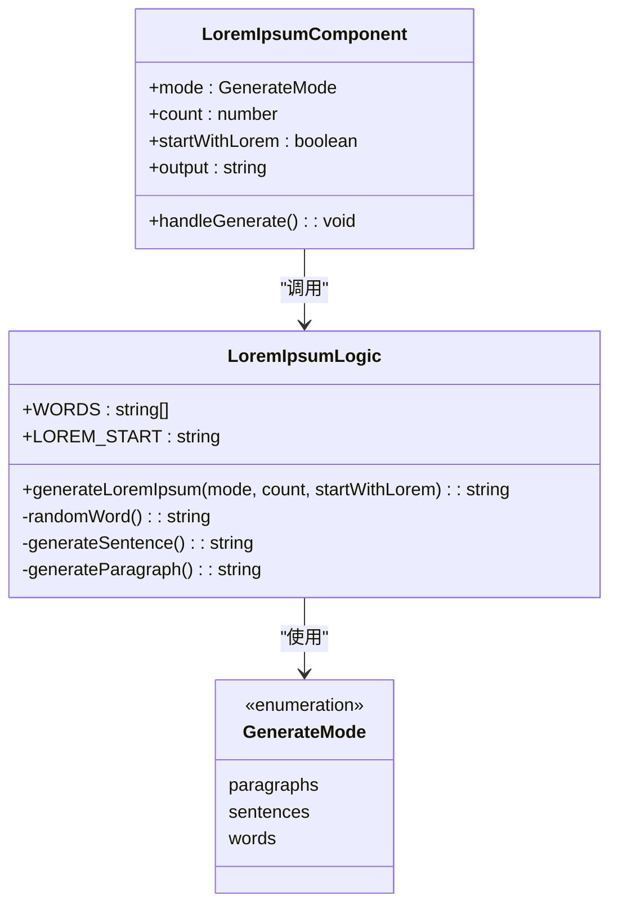

**图表来源**
- [src/tools/developer/lorem-ipsum/logic.ts:19-37](file://src/tools/developer/lorem-ipsum/logic.ts#L19-L37)
- [src/tools/developer/lorem-ipsum/logic.ts:39-66](file://src/tools/developer/lorem-ipsum/logic.ts#L39-L66)
- [src/tools/developer/lorem-ipsum/LoremIpsum.tsx:10-19](file://src/tools/developer/lorem-ipsum/LoremIpsum.tsx#L10-L19)

#### Lorem Ipsum生成算法

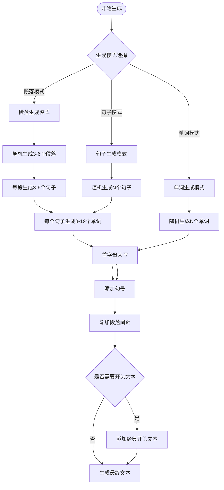

**图表来源**
- [src/tools/developer/lorem-ipsum/logic.ts:25-35](file://src/tools/developer/lorem-ipsum/logic.ts#L25-L35)
- [src/tools/developer/lorem-ipsum/logic.ts:39-66](file://src/tools/developer/lorem-ipsum/logic.ts#L39-L66)

#### 文本生成策略

1. **词汇池管理**：使用经典拉丁文词汇池生成自然文本
2. **句长控制**：句子长度在8-19个单词之间随机分布
3. **段落结构**：段落包含3-6个句子，形成自然的段落结构
4. **格式控制**：支持首字母大写和句号添加

**章节来源**
- [src/tools/developer/lorem-ipsum/logic.ts:1-67](file://src/tools/developer/lorem-ipsum/logic.ts#L1-L67)
- [src/tools/developer/lorem-ipsum/LoremIpsum.tsx:1-78](file://src/tools/developer/lorem-ipsum/LoremIpsum.tsx#L1-L78)

### Markdown预览组件分析

#### 类关系图

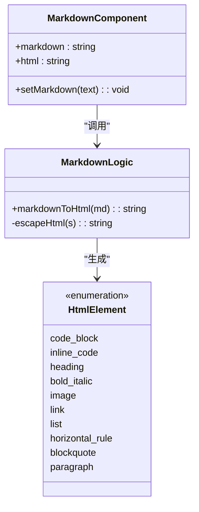

**图表来源**
- [src/tools/developer/markdown-preview/logic.ts:9-75](file://src/tools/developer/markdown-preview/logic.ts#L9-L75)
- [src/tools/developer/markdown-preview/MarkdownPreview.tsx:9-13](file://src/tools/developer/markdown-preview/MarkdownPreview.tsx#L9-L13)

#### Markdown解析流程

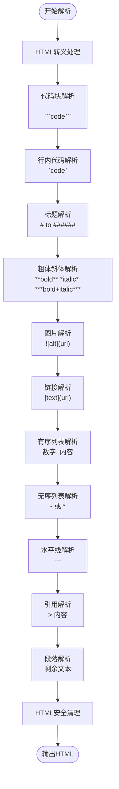

**图表来源**
- [src/tools/developer/markdown-preview/logic.ts:9-75](file://src/tools/developer/markdown-preview/logic.ts#L9-L75)

#### Markdown渲染算法

1. **安全转义**：对潜在危险的HTML标签和JavaScript进行转义
2. **语法解析**：按优先级处理不同的Markdown语法元素
3. **列表处理**：有序列表和无序列表的正确解析和包装
4. **安全过滤**：移除script、iframe、object等潜在危险标签

**章节来源**
- [src/tools/developer/markdown-preview/logic.ts:1-76](file://src/tools/developer/markdown-preview/logic.ts#L1-L76)
- [src/tools/developer/markdown-preview/MarkdownPreview.tsx:1-46](file://src/tools/developer/markdown-preview/MarkdownPreview.tsx#L1-L46)

## 依赖关系分析

项目采用松耦合的设计，各工具模块相互独立，通过注册中心统一管理：

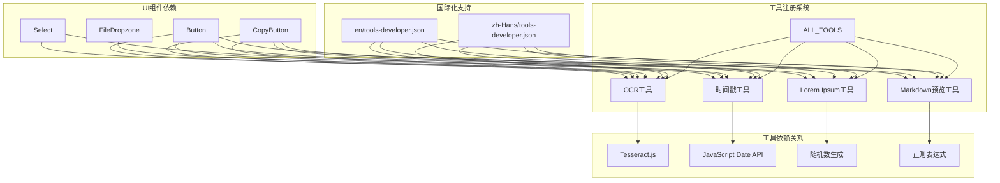

**图表来源**
- [src/lib/registry/index.ts:66-133](file://src/lib/registry/index.ts#L66-L133)
- [messages/zh-Hans/tools-developer.json:144-187](file://messages/zh-Hans/tools-developer.json#L144-L187)

**章节来源**
- [src/lib/registry/index.ts:1-164](file://src/lib/registry/index.ts#L1-L164)
- [messages/zh-Hans/tools-developer.json:1-809](file://messages/zh-Hans/tools-developer.json#L1-L809)

## 性能考虑

### 浏览器端处理优势

1. **零网络延迟**：所有处理在本地完成，避免网络传输延迟
2. **内存优化**：使用浏览器内存进行数据处理，避免服务器资源消耗
3. **并发处理**：多个工具可并行使用，充分利用浏览器多线程能力
4. **缓存机制**：语言模型和处理引擎可缓存在浏览器中

### 性能优化策略

1. **懒加载**：工具按需加载，减少初始页面大小
2. **进度反馈**：提供实时进度显示，改善用户体验
3. **错误恢复**：完善的错误处理机制，确保工具稳定性
4. **响应式设计**：适配不同设备和屏幕尺寸

### 处理限制

1. **文件大小限制**：受设备内存和浏览器能力限制
2. **处理时间限制**：大型文件可能需要较长时间处理
3. **浏览器兼容性**：依赖现代浏览器的WebAssembly和Canvas API

## 故障排除指南

### 常见问题及解决方案

#### OCR文字识别问题

**问题**：OCR识别准确度不高
- **原因**：图片质量差、文字模糊、字体复杂
- **解决方案**：使用高分辨率、高对比度的清晰图片

**问题**：识别进度不显示
- **原因**：浏览器不支持Tesseract.js或网络问题
- **解决方案**：检查浏览器兼容性和网络连接

#### 时间戳转换问题

**问题**：时间戳转换结果不正确
- **原因**：输入格式错误或精度判断错误
- **解决方案**：确认输入格式为标准Unix时间戳

**问题**：相对时间显示异常
- **原因**：系统时钟设置错误
- **解决方案**：检查系统时间和时区设置

#### Lorem Ipsum生成问题

**问题**：生成文本不符合预期
- **原因**：生成模式或数量设置不当
- **解决方案**：调整生成模式和数量参数

#### Markdown预览问题

**问题**：Markdown渲染异常
- **原因**：语法错误或安全过滤
- **解决方案**：检查Markdown语法和内容安全性

**章节来源**
- [src/tools/developer/ocr/Ocr.tsx:33-41](file://src/tools/developer/ocr/Ocr.tsx#L33-L41)
- [src/tools/developer/timestamp/Timestamp.tsx:136-140](file://src/tools/developer/timestamp/Timestamp.tsx#L136-L140)
- [src/tools/developer/markdown-preview/MarkdownPreview.tsx:35](file://src/tools/developer/markdown-preview/MarkdownPreview.tsx#L35)

## 结论

PrivaDeck的四个专业开发工具展现了浏览器端处理的强大能力和隐私保护优势。通过模块化设计和严格的错误处理机制，这些工具为开发者提供了强大而安全的文本处理能力。

### 技术优势

1. **隐私保护**：所有处理在本地完成，确保数据安全
2. **跨平台兼容**：基于Web标准，支持所有现代浏览器
3. **性能优异**：利用浏览器原生能力，处理速度快
4. **易于集成**：模块化设计便于二次开发和集成

### 应用场景

- **文档数字化**：OCR文字识别处理扫描文档
- **日志分析**：时间戳转换处理系统日志
- **UI设计**：Lorem Ipsum生成器提供占位文本
- **文档编写**：Markdown预览工具编写技术文档

这些工具不仅满足了专业开发需求，更重要的是体现了隐私优先的设计理念，为用户提供了安全可靠的工具使用体验。