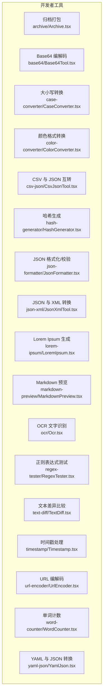
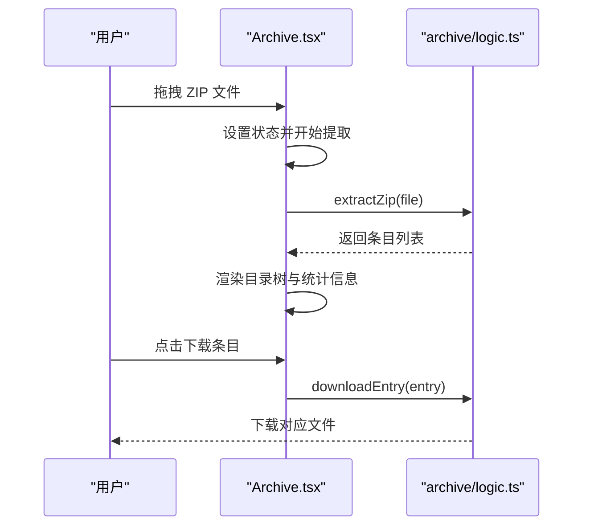
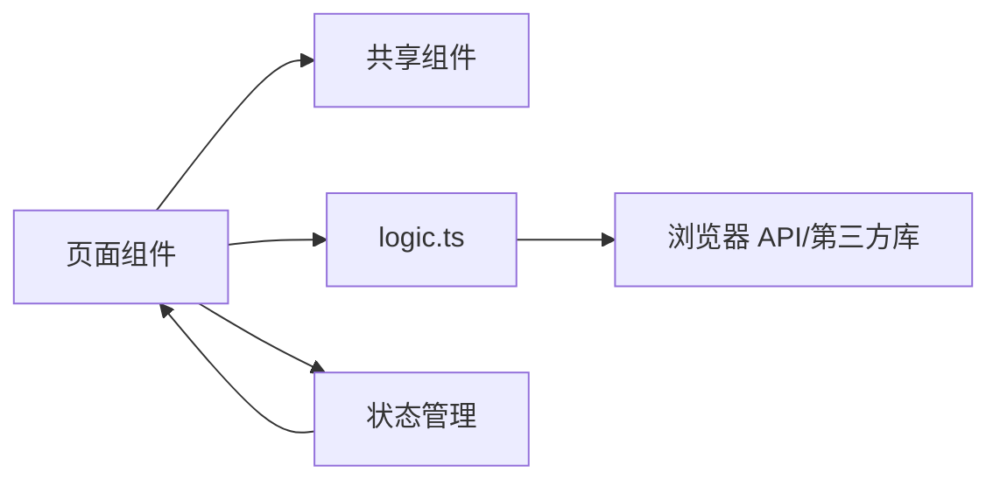

# 开发者工具

<cite>
**本文引用的文件**
- [Archive.tsx](file://src/tools/developer/archive/Archive.tsx)
- [Base64Tool.tsx](file://src/tools/developer/base64/Base64Tool.tsx)
- [CaseConverter.tsx](file://src/tools/developer/case-converter/CaseConverter.tsx)
- [ColorConverter.tsx](file://src/tools/developer/color-converter/ColorConverter.tsx)
- [CsvJsonTool.tsx](file://src/tools/developer/csv-json/CsvJsonTool.tsx)
- [HashGenerator.tsx](file://src/tools/developer/hash-generator/HashGenerator.tsx)
- [JsonFormatter.tsx](file://src/tools/developer/json-formatter/JsonFormatter.tsx)
- [JsonXmlTool.tsx](file://src/tools/developer/json-xml/JsonXmlTool.tsx)
- [LoremIpsum.tsx](file://src/tools/developer/lorem-ipsum/LoremIpsum.tsx)
- [MarkdownPreview.tsx](file://src/tools/developer/markdown-preview/MarkdownPreview.tsx)
- [Ocr.tsx](file://src/tools/developer/ocr/Ocr.tsx)
- [RegexTester.tsx](file://src/tools/developer/regex-tester/RegexTester.tsx)
- [TextDiff.tsx](file://src/tools/developer/text-diff/TextDiff.tsx)
- [Timestamp.tsx](file://src/tools/developer/timestamp/Timestamp.tsx)
- [UrlEncoder.tsx](file://src/tools/developer/url-encoder/UrlEncoder.tsx)
- [WordCounter.tsx](file://src/tools/developer/word-counter/WordCounter.tsx)
</cite>

## 目录
1. [简介](#简介)
2. [项目结构](#项目结构)
3. [核心组件](#核心组件)
4. [架构总览](#架构总览)
5. [详细组件分析](#详细组件分析)
6. [依赖关系分析](#依赖关系分析)
7. [性能考量](#性能考量)
8. [故障排查指南](#故障排查指南)
9. [结论](#结论)
10. [附录](#附录)

## 简介
本文件面向 PrivaDeck 媒体工具箱中的“开发者工具”模块，系统性梳理并说明 17 个实用工具的技术实现、工作原理与典型应用场景。这些工具覆盖归档打包、Base64 编解码、大小写转换、颜色格式转换、CSV 与 JSON 互转、哈希生成、JSON 格式化与校验、JSON 与 XML 转换、Lorem Ipsum 文本生成、Markdown 预览、OCR 文字识别、正则表达式测试、文本差异比较、时间戳处理、URL 编解码、单词计数以及 YAML 与 JSON 转换等能力。文档同时提供使用示例与开发最佳实践建议，帮助开发者快速理解与高效集成。

## 项目结构
开发者工具位于前端 Next.js 应用的工具目录下，采用按功能域划分的组织方式：每个工具一个独立子目录，包含页面组件（ToolPageClient.tsx 或 page.tsx）与具体实现逻辑（logic.ts）。页面组件负责 UI 交互与状态管理，logic.ts 提供纯函数式的业务逻辑，便于单元测试与复用。

图表来源
- [Archive.tsx:1-117](file://src/tools/developer/archive/Archive.tsx#L1-L117)
- [Base64Tool.tsx:1-52](file://src/tools/developer/base64/Base64Tool.tsx#L1-L52)
- [CaseConverter.tsx:1-72](file://src/tools/developer/case-converter/CaseConverter.tsx#L1-L72)
- [ColorConverter.tsx:1-99](file://src/tools/developer/color-converter/ColorConverter.tsx#L1-L99)
- [CsvJsonTool.tsx:1-102](file://src/tools/developer/csv-json/CsvJsonTool.tsx#L1-L102)
- [HashGenerator.tsx:1-128](file://src/tools/developer/hash-generator/HashGenerator.tsx#L1-L128)
- [JsonFormatter.tsx:1-101](file://src/tools/developer/json-formatter/JsonFormatter.tsx#L1-L101)
- [JsonXmlTool.tsx:1-102](file://src/tools/developer/json-xml/JsonXmlTool.tsx#L1-L102)
- [LoremIpsum.tsx:1-78](file://src/tools/developer/lorem-ipsum/LoremIpsum.tsx#L1-L78)
- [MarkdownPreview.tsx:1-46](file://src/tools/developer/markdown-preview/MarkdownPreview.tsx#L1-L46)
- [Ocr.tsx:1-90](file://src/tools/developer/ocr/Ocr.tsx#L1-L90)
- [RegexTester.tsx:1-154](file://src/tools/developer/regex-tester/RegexTester.tsx#L1-L154)
- [TextDiff.tsx:1-131](file://src/tools/developer/text-diff/TextDiff.tsx#L1-L131)
- [Timestamp.tsx:1-177](file://src/tools/developer/timestamp/Timestamp.tsx#L1-L177)
- [UrlEncoder.tsx:1-61](file://src/tools/developer/url-encoder/UrlEncoder.tsx#L1-L61)
- [WordCounter.tsx:1-45](file://src/tools/developer/word-counter/WordCounter.tsx#L1-L45)

章节来源
- [Archive.tsx:1-117](file://src/tools/developer/archive/Archive.tsx#L1-L117)
- [Base64Tool.tsx:1-52](file://src/tools/developer/base64/Base64Tool.tsx#L1-L52)
- [CaseConverter.tsx:1-72](file://src/tools/developer/case-converter/CaseConverter.tsx#L1-L72)
- [ColorConverter.tsx:1-99](file://src/tools/developer/color-converter/ColorConverter.tsx#L1-L99)
- [CsvJsonTool.tsx:1-102](file://src/tools/developer/csv-json/CsvJsonTool.tsx#L1-L102)
- [HashGenerator.tsx:1-128](file://src/tools/developer/hash-generator/HashGenerator.tsx#L1-L128)
- [JsonFormatter.tsx:1-101](file://src/tools/developer/json-formatter/JsonFormatter.tsx#L1-L101)
- [JsonXmlTool.tsx:1-102](file://src/tools/developer/json-xml/JsonXmlTool.tsx#L1-L102)
- [LoremIpsum.tsx:1-78](file://src/tools/developer/lorem-ipsum/LoremIpsum.tsx#L1-L78)
- [MarkdownPreview.tsx:1-46](file://src/tools/developer/markdown-preview/MarkdownPreview.tsx#L1-L46)
- [Ocr.tsx:1-90](file://src/tools/developer/ocr/Ocr.tsx#L1-L90)
- [RegexTester.tsx:1-154](file://src/tools/developer/regex-tester/RegexTester.tsx#L1-L154)
- [TextDiff.tsx:1-131](file://src/tools/developer/text-diff/TextDiff.tsx#L1-L131)
- [Timestamp.tsx:1-177](file://src/tools/developer/timestamp/Timestamp.tsx#L1-L177)
- [UrlEncoder.tsx:1-61](file://src/tools/developer/url-encoder/UrlEncoder.tsx#L1-L61)
- [WordCounter.tsx:1-45](file://src/tools/developer/word-counter/WordCounter.tsx#L1-L45)

## 核心组件
- 页面组件职责：接收用户输入，调用 logic.ts 中的纯函数进行处理，渲染结果与交互反馈。
- 共享组件：复制按钮、下载按钮、文件拖拽区、文本区域等在多个工具中复用，提升一致性与可维护性。
- 国际化：通过 next-intl 的 useTranslations 获取多语言文案，确保各工具界面文案本地化。
- 错误处理：对解析失败、格式错误、无效输入等情况统一捕获并提示，避免崩溃。

章节来源
- [Archive.tsx:1-117](file://src/tools/developer/archive/Archive.tsx#L1-L117)
- [Base64Tool.tsx:1-52](file://src/tools/developer/base64/Base64Tool.tsx#L1-L52)
- [CaseConverter.tsx:1-72](file://src/tools/developer/case-converter/CaseConverter.tsx#L1-L72)
- [ColorConverter.tsx:1-99](file://src/tools/developer/color-converter/ColorConverter.tsx#L1-L99)
- [CsvJsonTool.tsx:1-102](file://src/tools/developer/csv-json/CsvJsonTool.tsx#L1-L102)
- [HashGenerator.tsx:1-128](file://src/tools/developer/hash-generator/HashGenerator.tsx#L1-L128)
- [JsonFormatter.tsx:1-101](file://src/tools/developer/json-formatter/JsonFormatter.tsx#L1-L101)
- [JsonXmlTool.tsx:1-102](file://src/tools/developer/json-xml/JsonXmlTool.tsx#L1-L102)
- [LoremIpsum.tsx:1-78](file://src/tools/developer/lorem-ipsum/LoremIpsum.tsx#L1-L78)
- [MarkdownPreview.tsx:1-46](file://src/tools/developer/markdown-preview/MarkdownPreview.tsx#L1-L46)
- [Ocr.tsx:1-90](file://src/tools/developer/ocr/Ocr.tsx#L1-L90)
- [RegexTester.tsx:1-154](file://src/tools/developer/regex-tester/RegexTester.tsx#L1-L154)
- [TextDiff.tsx:1-131](file://src/tools/developer/text-diff/TextDiff.tsx#L1-L131)
- [Timestamp.tsx:1-177](file://src/tools/developer/timestamp/Timestamp.tsx#L1-L177)
- [UrlEncoder.tsx:1-61](file://src/tools/developer/url-encoder/UrlEncoder.tsx#L1-L61)
- [WordCounter.tsx:1-45](file://src/tools/developer/word-counter/WordCounter.tsx#L1-L45)

## 架构总览
开发者工具遵循“页面组件 + 业务逻辑”的分层设计，页面组件仅负责 UI 与状态，业务逻辑集中在 logic.ts 中，便于测试与演进。

```mermaid
graph TB
subgraph "页面组件"
UI_A["Archive.tsx"]
UI_B["Base64Tool.tsx"]
UI_C["CaseConverter.tsx"]
UI_D["ColorConverter.tsx"]
UI_E["CsvJsonTool.tsx"]
UI_F["HashGenerator.tsx"]
UI_G["JsonFormatter.tsx"]
UI_H["JsonXmlTool.tsx"]
UI_I["LoremIpsum.tsx"]
UI_J["MarkdownPreview.tsx"]
UI_K["Ocr.tsx"]
UI_L["RegexTester.tsx"]
UI_M["TextDiff.tsx"]
UI_N["Timestamp.tsx"]
UI_O["UrlEncoder.tsx"]
UI_P["WordCounter.tsx"]
UI_Q["YamlJson.tsx"]
end
subgraph "业务逻辑"
LOGIC_A["archive/logic.ts"]
LOGIC_B["base64/logic.ts"]
LOGIC_C["case-converter/logic.ts"]
LOGIC_D["color-converter/logic.ts"]
LOGIC_E["csv-json/logic.ts"]
LOGIC_F["hash-generator/logic.ts"]
LOGIC_G["json-formatter/logic.ts"]
LOGIC_H["json-xml/logic.ts"]
LOGIC_I["lorem-ipsum/logic.ts"]
LOGIC_J["markdown-preview/logic.ts"]
LOGIC_K["ocr/logic.ts"]
LOGIC_L["regex-tester/logic.ts"]
LOGIC_M["text-diff/logic.ts"]
LOGIC_N["timestamp/logic.ts"]
LOGIC_O["url-encoder/logic.ts"]
LOGIC_P["word-counter/logic.ts"]
LOGIC_Q["yaml-json/logic.ts"]
end
UI_A --> LOGIC_A
UI_B --> LOGIC_B
UI_C --> LOGIC_C
UI_D --> LOGIC_D
UI_E --> LOGIC_E
UI_F --> LOGIC_F
UI_G --> LOGIC_G
UI_H --> LOGIC_H
UI_I --> LOGIC_I
UI_J --> LOGIC_J
UI_K --> LOGIC_K
UI_L --> LOGIC_L
UI_M --> LOGIC_M
UI_N --> LOGIC_N
UI_O --> LOGIC_O
UI_P --> LOGIC_P
UI_Q --> LOGIC_Q
```

图表来源
- [Archive.tsx:1-117](file://src/tools/developer/archive/Archive.tsx#L1-L117)
- [Base64Tool.tsx:1-52](file://src/tools/developer/base64/Base64Tool.tsx#L1-L52)
- [CaseConverter.tsx:1-72](file://src/tools/developer/case-converter/CaseConverter.tsx#L1-L72)
- [ColorConverter.tsx:1-99](file://src/tools/developer/color-converter/ColorConverter.tsx#L1-L99)
- [CsvJsonTool.tsx:1-102](file://src/tools/developer/csv-json/CsvJsonTool.tsx#L1-L102)
- [HashGenerator.tsx:1-128](file://src/tools/developer/hash-generator/HashGenerator.tsx#L1-L128)
- [JsonFormatter.tsx:1-101](file://src/tools/developer/json-formatter/JsonFormatter.tsx#L1-L101)
- [JsonXmlTool.tsx:1-102](file://src/tools/developer/json-xml/JsonXmlTool.tsx#L1-L102)
- [LoremIpsum.tsx:1-78](file://src/tools/developer/lorem-ipsum/LoremIpsum.tsx#L1-L78)
- [MarkdownPreview.tsx:1-46](file://src/tools/developer/markdown-preview/MarkdownPreview.tsx#L1-L46)
- [Ocr.tsx:1-90](file://src/tools/developer/ocr/Ocr.tsx#L1-L90)
- [RegexTester.tsx:1-154](file://src/tools/developer/regex-tester/RegexTester.tsx#L1-L154)
- [TextDiff.tsx:1-131](file://src/tools/developer/text-diff/TextDiff.tsx#L1-L131)
- [Timestamp.tsx:1-177](file://src/tools/developer/timestamp/Timestamp.tsx#L1-L177)
- [UrlEncoder.tsx:1-61](file://src/tools/developer/url-encoder/UrlEncoder.tsx#L1-L61)
- [WordCounter.tsx:1-45](file://src/tools/developer/word-counter/WordCounter.tsx#L1-L45)

## 详细组件分析

### 归档打包（Archive）
- 功能概述：支持 ZIP 文件拖拽上传，异步解析并展示目录树与条目信息，支持逐项下载。
- 技术要点：
  - 使用文件拖拽组件接收单个 ZIP 文件。
  - 异步提取 ZIP 内容，计算总大小与文件数量。
  - 递归渲染目录层级，根据扩展名选择图标类型。
- 使用场景：批量资源整理、内容预览、快速导出单个文件。
- 最佳实践：限制单次只处理一个 ZIP；对不支持的格式给出明确错误提示；大文件注意内存占用与加载时间。

图表来源
- [Archive.tsx:1-117](file://src/tools/developer/archive/Archive.tsx#L1-L117)

章节来源
- [Archive.tsx:1-117](file://src/tools/developer/archive/Archive.tsx#L1-L117)

### Base64 编解码（Base64Tool）
- 功能概述：在输入与输出之间进行 Base64 编码与解码，并支持复制与下载。
- 技术要点：调用 logic.ts 中的 encodeBase64 与 decodeBase64，保持输入输出同步更新。
- 使用场景：调试数据传输、嵌入资源编码、跨平台兼容处理。
- 最佳实践：对空输入进行保护；提供一键复制与下载；避免在大文本上频繁重算。

章节来源
- [Base64Tool.tsx:1-52](file://src/tools/developer/base64/Base64Tool.tsx#L1-L52)

### 大小写转换（CaseConverter）
- 功能概述：将文本转换为多种命名风格（大写、小写、标题、句子、驼峰、帕斯卡、蛇形、短横线、常量）。
- 技术要点：枚举可用的转换类型，调用 convertCase 执行转换。
- 使用场景：变量命名规范化、API 字段命名、模板变量生成。
- 最佳实践：提供一键复制与下载；对长文本转换时注意性能；保留原输入以便对比。

章节来源
- [CaseConverter.tsx:1-72](file://src/tools/developer/case-converter/CaseConverter.tsx#L1-L72)

### 颜色格式转换（ColorConverter）
- 功能概述：输入任意颜色表示法（如 HEX、RGB、HSL），自动解析并输出标准格式与数值明细。
- 技术要点：parseColor 解析输入，memo 化避免重复计算；展示颜色预览与各格式值。
- 使用场景：设计系统配色、样式变量生成、颜色一致性检查。
- 最佳实践：对无效输入显示错误提示；提供复制各格式值的能力。

章节来源
- [ColorConverter.tsx:1-99](file://src/tools/developer/color-converter/ColorConverter.tsx#L1-L99)

### CSV 与 JSON 互转（CsvJsonTool）
- 功能概述：在 CSV 与 JSON 之间双向转换，支持粘贴、拖拽与下载。
- 技术要点：csvToJson 与 jsonToCsv，异常捕获并提示错误原因。
- 使用场景：数据导入导出、配置文件转换、前后端数据交换。
- 最佳实践：严格区分字段顺序与键值映射；处理缺失列与特殊字符；提供下载按钮。

章节来源
- [CsvJsonTool.tsx:1-102](file://src/tools/developer/csv-json/CsvJsonTool.tsx#L1-L102)

### 哈希生成（HashGenerator）
- 功能概述：支持文本或文件输入，计算多种哈希算法（如 MD5、SHA-1、SHA-256 等）。
- 技术要点：TextEncoder/ArrayBuffer 处理文本；File.arrayBuffer 处理文件；并发计算多算法。
- 使用场景：完整性校验、缓存键生成、安全审计。
- 最佳实践：对大文件计算进行进度提示；对空输入与异常进行健壮处理。

章节来源
- [HashGenerator.tsx:1-128](file://src/tools/developer/hash-generator/HashGenerator.tsx#L1-L128)

### JSON 格式化与校验（JsonFormatter）
- 功能概述：格式化、压缩与校验 JSON，支持自定义缩进空格数。
- 技术要点：formatJson/minifyJson/validateJson；实时验证结果可视化。
- 使用场景：日志排版、配置文件美化、接口调试。
- 最佳实践：默认缩进适中；对语法错误给出明确提示；提供下载与复制。

章节来源
- [JsonFormatter.tsx:1-101](file://src/tools/developer/json-formatter/JsonFormatter.tsx#L1-L101)

### JSON 与 XML 转换（JsonXmlTool）
- 功能概述：在 JSON 与 XML 之间互转，支持拖拽与下载。
- 技术要点：jsonToXml/xmlToJson，异常捕获与错误提示。
- 使用场景：配置迁移、协议转换、跨系统数据交换。
- 最佳实践：注意数组与属性的映射规则；对复杂结构进行预处理。

章节来源
- [JsonXmlTool.tsx:1-102](file://src/tools/developer/json-xml/JsonXmlTool.tsx#L1-L102)

### Lorem Ipsum 文本生成（LoremIpsum）
- 功能概述：按段落、句子或单词生成占位文本，支持是否以固定短语开头。
- 技术要点：generateLoremIpsum(mode, count, startWithLorem)。
- 使用场景：UI 设计占位、原型测试、内容填充。
- 最佳实践：合理设置数量上限；提供一键复制。

章节来源
- [LoremIpsum.tsx:1-78](file://src/tools/developer/lorem-ipsum/LoremIpsum.tsx#L1-L78)

### Markdown 预览（MarkdownPreview）
- 功能概述：实时将 Markdown 转 HTML 并预览，支持复制 HTML。
- 技术要点：markdownToHtml；使用受控 DOM 属性进行安全渲染。
- 使用场景：文档编写、内容预览、模板调试。
- 最佳实践：注意 XSS 安全；对大文档进行滚动优化。

章节来源
- [MarkdownPreview.tsx:1-46](file://src/tools/developer/markdown-preview/MarkdownPreview.tsx#L1-L46)

### OCR 文字识别（Ocr）
- 功能概述：上传图片后进行文字识别，显示置信度与识别结果。
- 技术要点：recognizeText 支持语言选择与进度回调；对象 URL 预览图片。
- 使用场景：扫描件处理、图像文字提取、自动化录入。
- 最佳实践：选择合适语言；对大图进行压缩；注意隐私与数据安全。

章节来源
- [Ocr.tsx:1-90](file://src/tools/developer/ocr/Ocr.tsx#L1-L90)

### 正则表达式测试（RegexTester）
- 功能概述：输入正则与标志位，高亮匹配结果并列出详情。
- 技术要点：testRegex 与 highlightMatches；动态组合标志位。
- 使用场景：日志过滤、数据清洗、格式验证。
- 最佳实践：提供常用标志位组合；对无效正则给出明确错误。

章节来源
- [RegexTester.tsx:1-154](file://src/tools/developer/regex-tester/RegexTester.tsx#L1-L154)

### 文本差异比较（TextDiff）
- 功能概述：对比两段文本，输出统一格式差异，统计新增与删除行数。
- 技术要点：computeDiff 与 toUnifiedDiff；高亮差异行。
- 使用场景：代码审查、配置变更、内容对比。
- 最佳实践：对超长文本进行分页或截断；提供复制统一差异的能力。

章节来源
- [TextDiff.tsx:1-131](file://src/tools/developer/text-diff/TextDiff.tsx#L1-L131)

### 时间戳处理（Timestamp）
- 功能概述：支持时间戳与日期之间的相互转换，自动识别毫秒与秒级单位，显示 UTC、本地、ISO 与相对时间。
- 技术要点：timestampToDate/dateToTimestamp；自动检测单位；设置“现在”快捷入口。
- 使用场景：日志分析、数据库时间字段、API 接口调试。
- 最佳实践：对非法输入进行提示；保持输入与输出同步更新。

章节来源
- [Timestamp.tsx:1-177](file://src/tools/developer/timestamp/Timestamp.tsx#L1-L177)

### URL 编解码（UrlEncoder）
- 功能概述：支持完整 URL 编解码与组件级编解码。
- 技术要点：encodeUrl/decodeUrl/encodeUrlComponent/decodeUrlComponent。
- 使用场景：参数传递、链接分享、表单提交。
- 最佳实践：区分完整 URL 与组件；对特殊字符进行正确处理。

章节来源
- [UrlEncoder.tsx:1-61](file://src/tools/developer/url-encoder/UrlEncoder.tsx#L1-L61)

### 单词计数（WordCounter）
- 功能概述：统计词数、字符数、句子数、段落数与阅读时长。
- 技术要点：countWords 返回聚合统计。
- 使用场景：写作辅助、内容审核、SEO 优化。
- 最佳实践：对空输入清空统计；提供简洁卡片展示。

章节来源
- [WordCounter.tsx:1-45](file://src/tools/developer/word-counter/WordCounter.tsx#L1-L45)

### YAML 与 JSON 转换（YamlJson）
- 功能概述：在 YAML 与 JSON 之间互转，支持拖拽与下载。
- 技术要点：yamlToJson/yamlToJs 与反向转换；异常捕获与错误提示。
- 使用场景：配置文件切换、模板数据生成、跨语言数据交换。
- 最佳实践：注意注释与非标准语法；对复杂结构进行预处理。

章节来源
- [YamlJson.tsx:1-100](file://src/tools/developer/yaml-json/YamlJson.tsx#L1-L100)

## 依赖关系分析
- 组件内聚：每个工具页面组件与 logic.ts 一一对应，内聚度高、耦合度低。
- 组件间耦合：共享组件（复制、下载、拖拽区、文本区域）在多处复用，降低重复代码。
- 外部依赖：部分工具依赖浏览器 API（如 FileReader、URL.createObjectUrl）、第三方库（如 markdown 解析、正则高亮等），需关注兼容性与性能。
- 数据流：页面组件负责收集用户输入，logic.ts 进行纯计算，返回结果并由页面渲染；错误通过状态统一上报。

图表来源
- [Archive.tsx:1-117](file://src/tools/developer/archive/Archive.tsx#L1-L117)
- [Base64Tool.tsx:1-52](file://src/tools/developer/base64/Base64Tool.tsx#L1-L52)
- [CaseConverter.tsx:1-72](file://src/tools/developer/case-converter/CaseConverter.tsx#L1-L72)
- [ColorConverter.tsx:1-99](file://src/tools/developer/color-converter/ColorConverter.tsx#L1-L99)
- [CsvJsonTool.tsx:1-102](file://src/tools/developer/csv-json/CsvJsonTool.tsx#L1-L102)
- [HashGenerator.tsx:1-128](file://src/tools/developer/hash-generator/HashGenerator.tsx#L1-L128)
- [JsonFormatter.tsx:1-101](file://src/tools/developer/json-formatter/JsonFormatter.tsx#L1-L101)
- [JsonXmlTool.tsx:1-102](file://src/tools/developer/json-xml/JsonXmlTool.tsx#L1-L102)
- [LoremIpsum.tsx:1-78](file://src/tools/developer/lorem-ipsum/LoremIpsum.tsx#L1-L78)
- [MarkdownPreview.tsx:1-46](file://src/tools/developer/markdown-preview/MarkdownPreview.tsx#L1-L46)
- [Ocr.tsx:1-90](file://src/tools/developer/ocr/Ocr.tsx#L1-L90)
- [RegexTester.tsx:1-154](file://src/tools/developer/regex-tester/RegexTester.tsx#L1-L154)
- [TextDiff.tsx:1-131](file://src/tools/developer/text-diff/TextDiff.tsx#L1-L131)
- [Timestamp.tsx:1-177](file://src/tools/developer/timestamp/Timestamp.tsx#L1-L177)
- [UrlEncoder.tsx:1-61](file://src/tools/developer/url-encoder/UrlEncoder.tsx#L1-L61)
- [WordCounter.tsx:1-45](file://src/tools/developer/word-counter/WordCounter.tsx#L1-L45)

## 性能考量
- 计算密集型：正则测试、文本差异、OCR 识别可能耗时较长，应提供进度反馈与取消机制（如适用）。
- 大文件处理：哈希与 OCR 对大文件内存占用较高，建议限制文件大小或提供分块处理策略。
- 渲染优化：Markdown 预览与差异对比对长文本的 DOM 更新需注意滚动与虚拟化。
- 缓存与去抖：对高频输入（如正则测试）可采用去抖策略减少重算次数。
- I/O 与网络：OCR 依赖外部服务时，需考虑网络延迟与失败重试。

## 故障排查指南
- 输入为空或格式错误：多数工具对空输入与非法格式有明确提示，检查输入是否符合预期。
- 语法错误：JSON 格式化/校验、CSV/JSON 转换、JSON/XML 转换均会抛出异常，查看错误消息定位问题。
- 无效正则：正则测试器会提示错误原因，检查标志位与模式字符串。
- OCR 失败：检查图片格式与语言选择；确认网络连通性；查看控制台错误信息。
- 时间戳异常：确认输入单位（秒/毫秒）与范围；注意时区与本地化显示。

章节来源
- [JsonFormatter.tsx:1-101](file://src/tools/developer/json-formatter/JsonFormatter.tsx#L1-L101)
- [CsvJsonTool.tsx:1-102](file://src/tools/developer/csv-json/CsvJsonTool.tsx#L1-L102)
- [JsonXmlTool.tsx:1-102](file://src/tools/developer/json-xml/JsonXmlTool.tsx#L1-L102)
- [RegexTester.tsx:1-154](file://src/tools/developer/regex-tester/RegexTester.tsx#L1-L154)
- [Ocr.tsx:1-90](file://src/tools/developer/ocr/Ocr.tsx#L1-L90)
- [Timestamp.tsx:1-177](file://src/tools/developer/timestamp/Timestamp.tsx#L1-L177)

## 结论
PrivaDeck 的开发者工具以清晰的分层架构与可复用的 UI 组件为基础，提供了覆盖广泛开发场景的实用能力。通过将业务逻辑集中于 logic.ts，既保证了易测试性，也便于后续扩展与维护。建议在实际集成中关注性能与错误处理，结合具体业务需求选择合适的工具与参数配置。

## 附录
- 开发最佳实践清单
  - 对所有用户输入进行边界与格式校验。
  - 对耗时操作提供进度反馈与中断能力。
  - 使用统一的错误提示与日志记录。
  - 对大文件与长文本进行性能优化与分页处理。
  - 保持国际化文案的一致性与准确性。
  - 在生产环境启用必要的安全措施（如 XSS 过滤）。