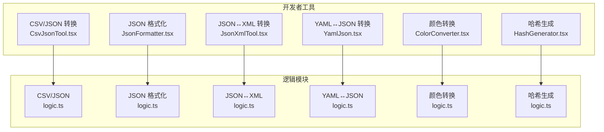
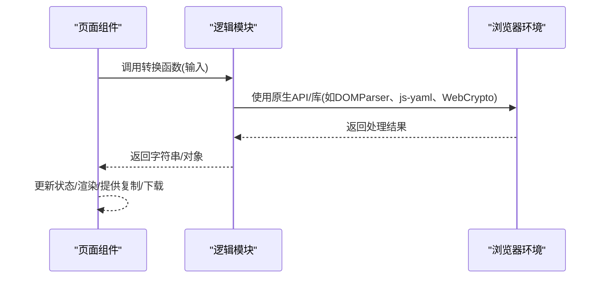
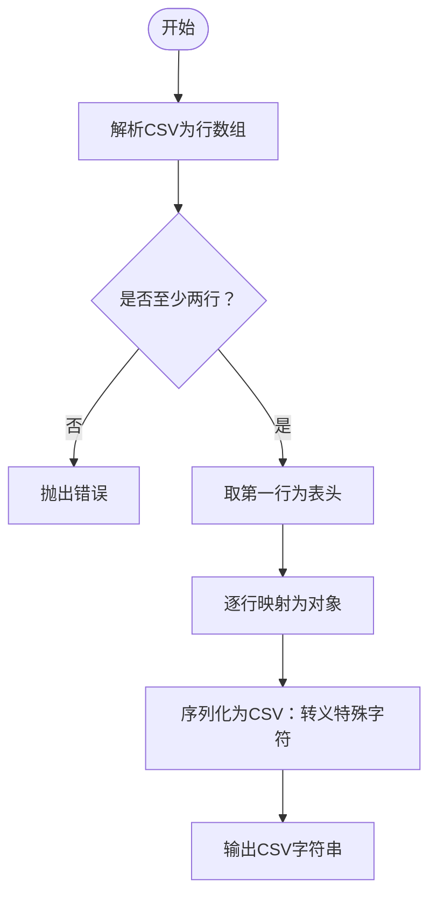
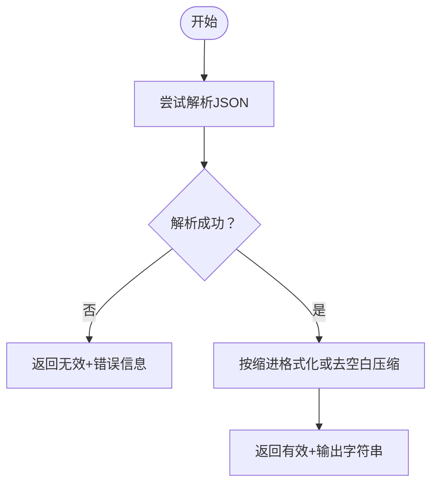
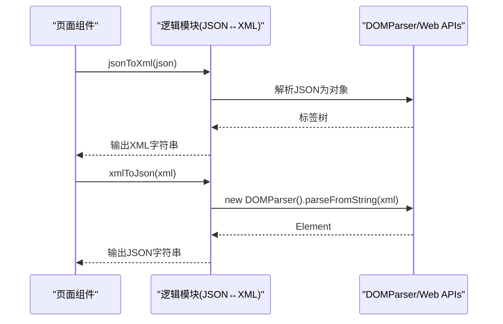
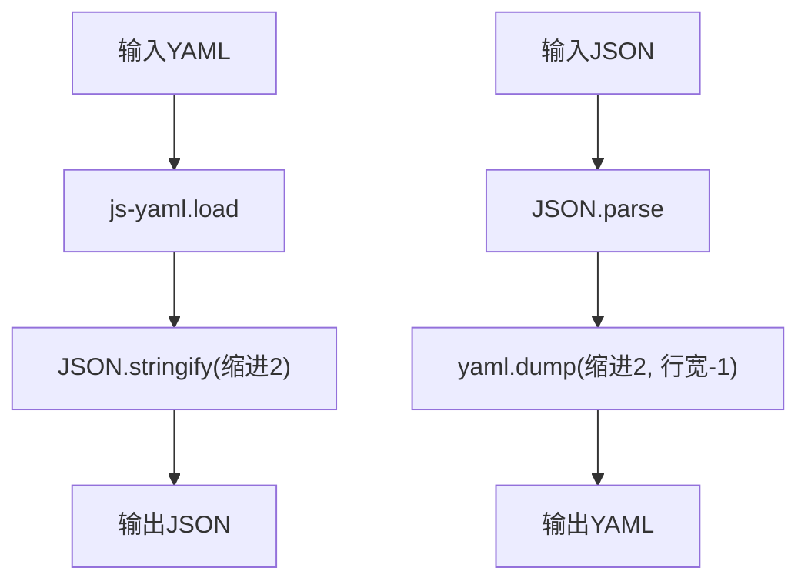
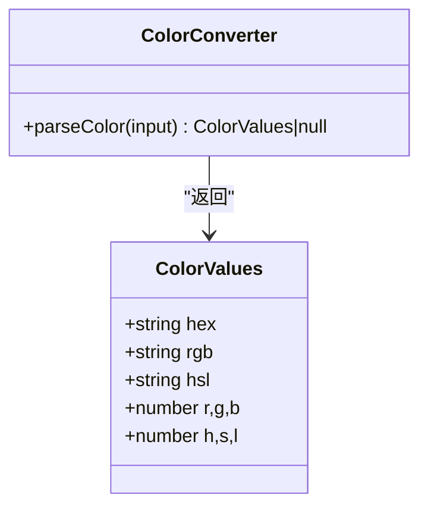
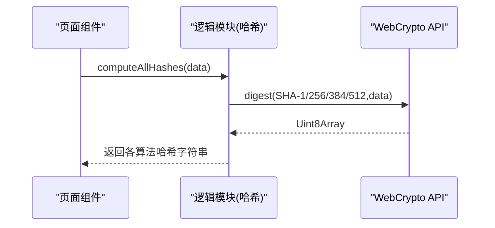
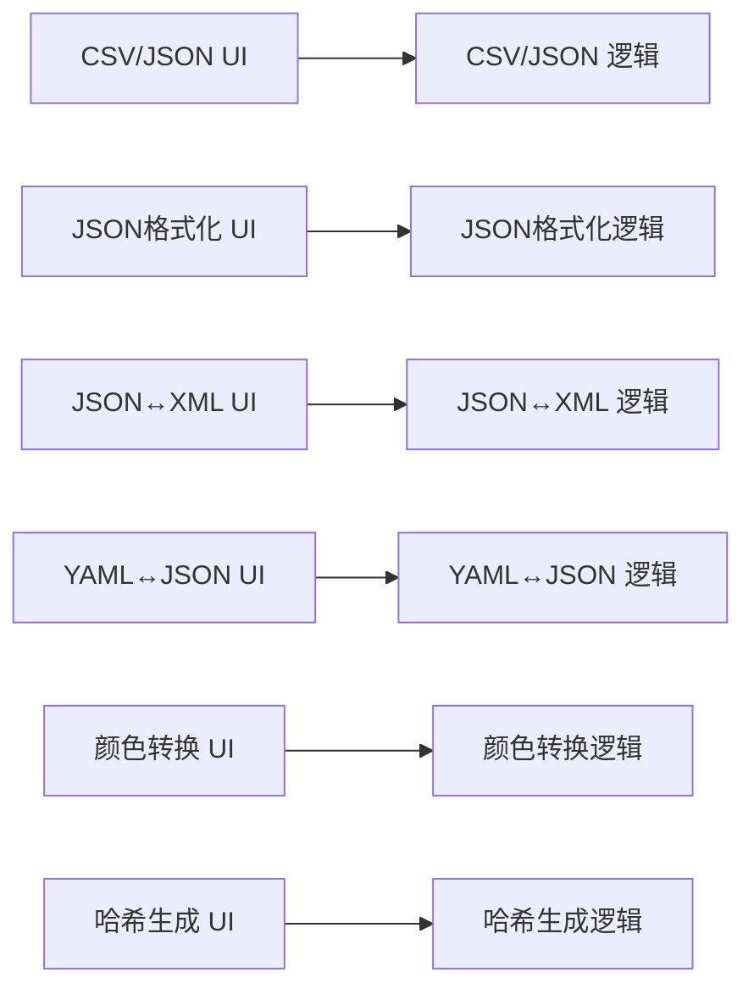

# 数据格式转换工具

<cite>
**本文档引用的文件**
- [CsvJsonTool.tsx](file://src/tools/developer/csv-json/CsvJsonTool.tsx)
- [logic.ts（CSV/JSON）](file://src/tools/developer/csv-json/logic.ts)
- [JsonFormatter.tsx](file://src/tools/developer/json-formatter/JsonFormatter.tsx)
- [logic.ts（JSON格式化）](file://src/tools/developer/json-formatter/logic.ts)
- [JsonXmlTool.tsx](file://src/tools/developer/json-xml/JsonXmlTool.tsx)
- [logic.ts（JSON/XML）](file://src/tools/developer/json-xml/logic.ts)
- [YamlJson.tsx](file://src/tools/developer/yaml-json/YamlJson.tsx)
- [logic.ts（YAML/JSON）](file://src/tools/developer/yaml-json/logic.ts)
- [ColorConverter.tsx](file://src/tools/developer/color-converter/ColorConverter.tsx)
- [logic.ts（颜色转换）](file://src/tools/developer/color-converter/logic.ts)
- [HashGenerator.tsx](file://src/tools/developer/hash-generator/HashGenerator.tsx)
- [logic.ts（哈希生成）](file://src/tools/developer/hash-generator/logic.ts)
- [tools-developer.json（英文）](file://messages/en/tools-developer.json)
</cite>

## 目录
1. [简介](#简介)
2. [项目结构](#项目结构)
3. [核心组件](#核心组件)
4. [架构总览](#架构总览)
5. [详细组件分析](#详细组件分析)
6. [依赖关系分析](#依赖关系分析)
7. [性能考虑](#性能考虑)
8. [故障排除指南](#故障排除指南)
9. [结论](#结论)
10. [附录](#附录)

## 简介
本项目提供一组浏览器端的数据格式转换工具，涵盖以下六大功能：
- CSV 与 JSON 互转：支持带引号字段、换行符等复杂 CSV 的解析与序列化
- JSON 格式化：美化输出、压缩体积、语法校验
- JSON 与 XML 转换：双向映射，支持嵌套结构与数组
- YAML 与 JSON 转换：基于 js-yaml 的完整 YAML 规范支持
- 颜色格式转换：HEX、RGB、HSL 三格式互转与实时预览
- 哈希生成：SHA-1/256/384/512 多算法并行计算，支持文本与文件

这些工具均在浏览器内完成处理，不上传任何数据，适合 API 开发、配置管理与数据交换场景。

## 项目结构
各工具采用“页面组件 + 业务逻辑模块”的分层设计，页面组件负责 UI 交互与状态管理，逻辑模块封装纯函数实现具体转换算法。

**图表来源**
- [CsvJsonTool.tsx:1-102](file://src/tools/developer/csv-json/CsvJsonTool.tsx#L1-L102)
- [JsonFormatter.tsx:1-101](file://src/tools/developer/json-formatter/JsonFormatter.tsx#L1-L101)
- [JsonXmlTool.tsx:1-102](file://src/tools/developer/json-xml/JsonXmlTool.tsx#L1-L102)
- [YamlJson.tsx:1-102](file://src/tools/developer/yaml-json/YamlJson.tsx#L1-L102)
- [ColorConverter.tsx:1-99](file://src/tools/developer/color-converter/ColorConverter.tsx#L1-L99)
- [HashGenerator.tsx:1-128](file://src/tools/developer/hash-generator/HashGenerator.tsx#L1-L128)

**章节来源**
- [CsvJsonTool.tsx:1-102](file://src/tools/developer/csv-json/CsvJsonTool.tsx#L1-L102)
- [JsonFormatter.tsx:1-101](file://src/tools/developer/json-formatter/JsonFormatter.tsx#L1-L101)
- [JsonXmlTool.tsx:1-102](file://src/tools/developer/json-xml/JsonXmlTool.tsx#L1-L102)
- [YamlJson.tsx:1-102](file://src/tools/developer/yaml-json/YamlJson.tsx#L1-L102)
- [ColorConverter.tsx:1-99](file://src/tools/developer/color-converter/ColorConverter.tsx#L1-L99)
- [HashGenerator.tsx:1-128](file://src/tools/developer/hash-generator/HashGenerator.tsx#L1-L128)

## 核心组件
- CSV/JSON 转换器：解析 CSV 行、处理引号与换行、构建对象数组；从 JSON 数组生成 CSV 表头与行
- JSON 格式化器：格式化/压缩/校验，返回结果对象含是否有效与错误信息
- JSON↔XML 转换器：对象到 XML 标签树映射，支持属性、文本与混合内容；XML 解析为对象并保留属性与文本
- YAML↔JSON 转换器：基于 js-yaml 的加载与转储，保持缩进与行宽配置
- 颜色转换器：支持 HEX（3/6位）、RGB、HSL 输入，计算并展示三格式值与单值
- 哈希生成器：多算法并行计算，使用 WebCrypto API，支持文本与文件输入

**章节来源**
- [logic.ts（CSV/JSON）:1-86](file://src/tools/developer/csv-json/logic.ts#L1-L86)
- [logic.ts（JSON格式化）:1-33](file://src/tools/developer/json-formatter/logic.ts#L1-L33)
- [logic.ts（JSON/XML）:1-119](file://src/tools/developer/json-xml/logic.ts#L1-L119)
- [logic.ts（YAML/JSON）:1-12](file://src/tools/developer/yaml-json/logic.ts#L1-L12)
- [logic.ts（颜色转换）:1-114](file://src/tools/developer/color-converter/logic.ts#L1-L114)
- [logic.ts（哈希生成）:1-35](file://src/tools/developer/hash-generator/logic.ts#L1-L35)

## 架构总览
所有工具均采用纯前端架构，页面组件通过事件触发逻辑模块函数，逻辑模块返回纯数据或字符串，页面组件更新 UI 并提供复制/下载能力。

**图表来源**
- [CsvJsonTool.tsx:17-35](file://src/tools/developer/csv-json/CsvJsonTool.tsx#L17-L35)
- [JsonFormatter.tsx:19-34](file://src/tools/developer/json-formatter/JsonFormatter.tsx#L19-L34)
- [JsonXmlTool.tsx:17-35](file://src/tools/developer/json-xml/JsonXmlTool.tsx#L17-L35)
- [YamlJson.tsx:17-35](file://src/tools/developer/yaml-json/YamlJson.tsx#L17-L35)
- [ColorConverter.tsx:12-15](file://src/tools/developer/color-converter/ColorConverter.tsx#L12-L15)
- [HashGenerator.tsx:23-43](file://src/tools/developer/hash-generator/HashGenerator.tsx#L23-L43)

## 详细组件分析

### CSV 与 JSON 互转
- 技术要点
  - CSV 解析：逐字符扫描，识别引号、逗号、换行，正确处理转义双引号与字段内换行
  - JSON 到 CSV：提取首行键作为表头，遍历数组对象按表头顺序序列化字段，必要时对包含逗号/引号/换行的字段加引号并转义
  - 错误处理：CSV 缺少表头或数据行时抛出异常；JSON 非数组或空数组直接返回空字符串
- 应用场景
  - 将导出的 CSV 数据快速转换为 JSON 供前端消费
  - 将 API 返回的 JSON 列表转换为 CSV 以便导入电子表格
- 最佳实践
  - CSV 首行作为列名；确保字段值中避免无意义的空白
  - 大数据集建议先在本地验证格式再批量转换

**图表来源**
- [logic.ts（CSV/JSON）:1-86](file://src/tools/developer/csv-json/logic.ts#L1-L86)

**章节来源**
- [CsvJsonTool.tsx:17-35](file://src/tools/developer/csv-json/CsvJsonTool.tsx#L17-L35)
- [logic.ts（CSV/JSON）:1-86](file://src/tools/developer/csv-json/logic.ts#L1-L86)

### JSON 格式化、校验与压缩
- 技术要点
  - 格式化：解析后按指定缩进（2/4/8）输出
  - 压缩：去除空白字符，输出紧凑 JSON
  - 校验：捕获解析异常，返回有效标志与错误信息
- 应用场景
  - API 调试时美化响应；发布前压缩体积；校验配置文件语法
- 最佳实践
  - 格式化时根据团队约定选择缩进；压缩用于传输或存储

**图表来源**
- [logic.ts（JSON格式化）:7-32](file://src/tools/developer/json-formatter/logic.ts#L7-L32)

**章节来源**
- [JsonFormatter.tsx:19-34](file://src/tools/developer/json-formatter/JsonFormatter.tsx#L19-L34)
- [logic.ts（JSON格式化）:1-33](file://src/tools/developer/json-formatter/logic.ts#L1-L33)

### JSON 与 XML 转换
- 技术要点
  - JSON→XML：递归将对象/数组映射为标签树，支持属性（键以@开头）、文本节点（#text）与混合内容
  - XML→JSON：使用 DOMParser 解析，遍历元素收集属性、子元素与文本，自动合并重复键为数组
  - 安全处理：转义 XML 特殊字符，清理非法标签名
- 应用场景
  - 与遗留系统集成（SOAP/XML），或在需要 XML 结构化的场景中转换
- 最佳实践
  - 明确属性与文本的映射规则；注意大小写与非法字符的替换策略

**图表来源**
- [JsonXmlTool.tsx:17-35](file://src/tools/developer/json-xml/JsonXmlTool.tsx#L17-L35)
- [logic.ts（JSON/XML）:1-13](file://src/tools/developer/json-xml/logic.ts#L1-L13)

**章节来源**
- [JsonXmlTool.tsx:17-35](file://src/tools/developer/json-xml/JsonXmlTool.tsx#L17-L35)
- [logic.ts（JSON/XML）:1-119](file://src/tools/developer/json-xml/logic.ts#L1-L119)

### YAML 与 JSON 转换
- 技术要点
  - 使用 js-yaml 加载 YAML 为 JS 对象，再用 JSON.stringify 输出格式化 JSON
  - JSON→YAML：解析 JSON 后用 yaml.dump 输出，控制缩进与行宽
- 应用场景
  - DevOps 配置（Kubernetes、CI/CD）与 API 规范之间的转换
- 最佳实践
  - 注意注释在转换过程中会被丢弃；YAML 的多行字符串与锚点需符合 js-yaml 规范

**图表来源**
- [YamlJson.tsx:17-35](file://src/tools/developer/yaml-json/YamlJson.tsx#L17-L35)
- [logic.ts（YAML/JSON）:1-12](file://src/tools/developer/yaml-json/logic.ts#L1-L12)

**章节来源**
- [YamlJson.tsx:17-35](file://src/tools/developer/yaml-json/YamlJson.tsx#L17-L35)
- [logic.ts（YAML/JSON）:1-12](file://src/tools/developer/yaml-json/logic.ts#L1-L12)

### 颜色格式转换
- 技术要点
  - 支持输入：HEX（3/6位，可带#）、RGB、HSL
  - 计算：HEX→RGB→HSL 双向转换，边界值裁剪与格式化
  - 展示：实时预览色块与各格式值，支持一键复制
- 应用场景
  - 设计稿到代码的颜色转换、主题变量生成
- 最佳实践
  - 统一使用 HEX 作为中间格式，保证精度一致

**图表来源**
- [ColorConverter.tsx:12-15](file://src/tools/developer/color-converter/ColorConverter.tsx#L12-L15)
- [logic.ts（颜色转换）:1-11](file://src/tools/developer/color-converter/logic.ts#L1-L11)

**章节来源**
- [ColorConverter.tsx:12-15](file://src/tools/developer/color-converter/ColorConverter.tsx#L12-L15)
- [logic.ts（颜色转换）:1-114](file://src/tools/developer/color-converter/logic.ts#L1-L114)

### 哈希生成
- 技术要点
  - 支持 SHA-1/256/384/512，使用 WebCrypto API 的 crypto.subtle.digest
  - 文本模式：编码为 ArrayBuffer；文件模式：读取文件 ArrayBuffer
  - 并行计算：Promise.all 同时执行多个算法，返回映射
- 应用场景
  - 文件完整性校验、内容去重、数字摘要
- 最佳实践
  - 大文件建议分块处理（当前实现一次性读取）

**图表来源**
- [HashGenerator.tsx:23-43](file://src/tools/developer/hash-generator/HashGenerator.tsx#L23-L43)
- [logic.ts（哈希生成）:19-34](file://src/tools/developer/hash-generator/logic.ts#L19-L34)

**章节来源**
- [HashGenerator.tsx:23-43](file://src/tools/developer/hash-generator/HashGenerator.tsx#L23-L43)
- [logic.ts（哈希生成）:1-35](file://src/tools/developer/hash-generator/logic.ts#L1-L35)

## 依赖关系分析
- 模块内聚：每个工具的 UI 与逻辑分离，职责清晰
- 模块耦合：逻辑模块仅依赖浏览器原生 API 或第三方库（js-yaml），无服务端依赖
- 外部依赖：js-yaml（YAML 转换）、WebCrypto API（哈希生成）
- 无循环依赖：页面组件仅调用对应逻辑模块函数

**图表来源**
- [CsvJsonTool.tsx:1-102](file://src/tools/developer/csv-json/CsvJsonTool.tsx#L1-L102)
- [JsonFormatter.tsx:1-101](file://src/tools/developer/json-formatter/JsonFormatter.tsx#L1-L101)
- [JsonXmlTool.tsx:1-102](file://src/tools/developer/json-xml/JsonXmlTool.tsx#L1-L102)
- [YamlJson.tsx:1-102](file://src/tools/developer/yaml-json/YamlJson.tsx#L1-L102)
- [ColorConverter.tsx:1-99](file://src/tools/developer/color-converter/ColorConverter.tsx#L1-L99)
- [HashGenerator.tsx:1-128](file://src/tools/developer/hash-generator/HashGenerator.tsx#L1-L128)

**章节来源**
- [logic.ts（CSV/JSON）:1-86](file://src/tools/developer/csv-json/logic.ts#L1-L86)
- [logic.ts（JSON格式化）:1-33](file://src/tools/developer/json-formatter/logic.ts#L1-L33)
- [logic.ts（JSON/XML）:1-119](file://src/tools/developer/json-xml/logic.ts#L1-L119)
- [logic.ts（YAML/JSON）:1-12](file://src/tools/developer/yaml-json/logic.ts#L1-L12)
- [logic.ts（颜色转换）:1-114](file://src/tools/developer/color-converter/logic.ts#L1-L114)
- [logic.ts（哈希生成）:1-35](file://src/tools/developer/hash-generator/logic.ts#L1-L35)

## 性能考虑
- 浏览器端处理：避免网络往返，提升隐私性与速度
- 大数据优化建议
  - CSV/JSON：对超大文件建议分批处理或流式解析（当前实现一次性解析）
  - JSON/XML：避免过深嵌套与超长文本，减少 DOM 操作
  - YAML：复杂锚点/别名可能增加解析时间
  - 哈希：大文件计算耗时较长，可考虑分块或后台线程（当前实现同步计算）
- 内存占用：注意字符串拼接与对象构建，避免不必要的中间副本

## 故障排除指南
- CSV/JSON
  - 错误：CSV 至少需要表头与一行数据
  - 处理：检查输入是否为空或格式不合法
- JSON 格式化
  - 错误：JSON 语法错误时会显示错误位置
  - 处理：修复语法后再尝试格式化/压缩/校验
- JSON↔XML
  - 错误：XML 解析失败会提示 parsererror
  - 处理：修正 XML 结构或属性命名
- YAML↔JSON
  - 错误：YAML 语法错误或不被 js-yaml 支持
  - 处理：简化语法或移除注释后重试
- 颜色转换
  - 错误：无法解析的颜色格式
  - 处理：确认输入为 HEX/RGB/HSL 格式之一
- 哈希生成
  - 错误：文件过大导致内存不足或计算超时
  - 处理：减小文件或改用更小的算法

**章节来源**
- [logic.ts（CSV/JSON）:3-5](file://src/tools/developer/csv-json/logic.ts#L3-L5)
- [logic.ts（JSON格式化）:11-12](file://src/tools/developer/json-formatter/logic.ts#L11-L12)
- [logic.ts（JSON/XML）:9-10](file://src/tools/developer/json-xml/logic.ts#L9-L10)
- [logic.ts（YAML/JSON）:3-5](file://src/tools/developer/yaml-json/logic.ts#L3-L5)
- [ColorConverter.tsx:38-42](file://src/tools/developer/color-converter/ColorConverter.tsx#L38-L42)
- [HashGenerator.tsx:38-42](file://src/tools/developer/hash-generator/HashGenerator.tsx#L38-L42)

## 结论
该工具集以浏览器原生能力为核心，提供安全、离线、高性能的数据格式转换能力。通过清晰的模块划分与完善的错误处理，适用于 API 开发、配置管理与数据交换等广泛场景。建议在生产环境中结合业务需求进行性能优化与扩展。

## 附录

### 工具使用场景与最佳实践
- API 开发
  - 使用 JSON 格式化美化响应便于调试；使用 CSV/JSON 转换导入/导出测试数据
- 配置管理
  - YAML↔JSON 用于 DevOps 配置与 API 规范的相互转换；颜色转换统一设计系统色值
- 数据交换
  - JSON↔XML 适配不同系统的数据格式；哈希生成用于文件完整性校验

**章节来源**
- [tools-developer.json（英文）:233-417](file://messages/en/tools-developer.json#L233-L417)