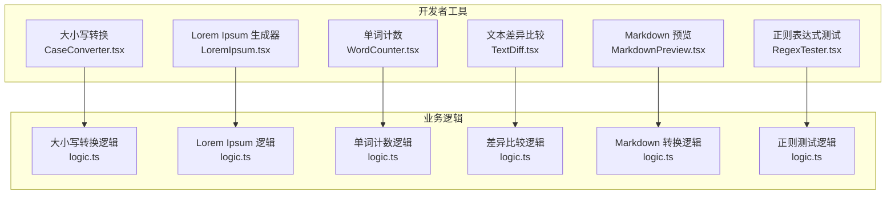
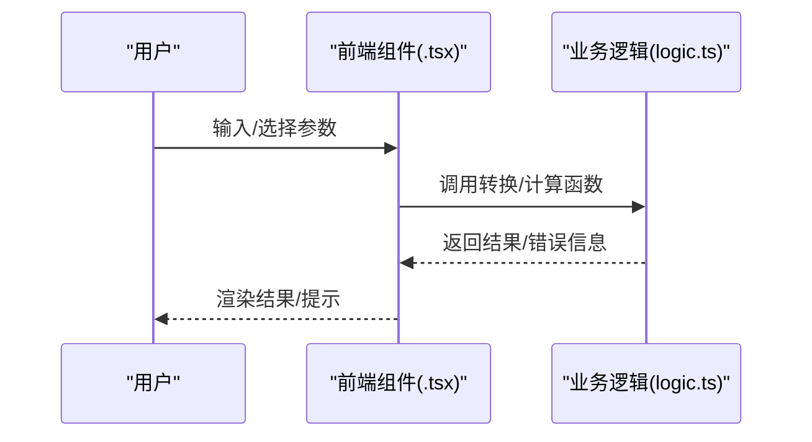
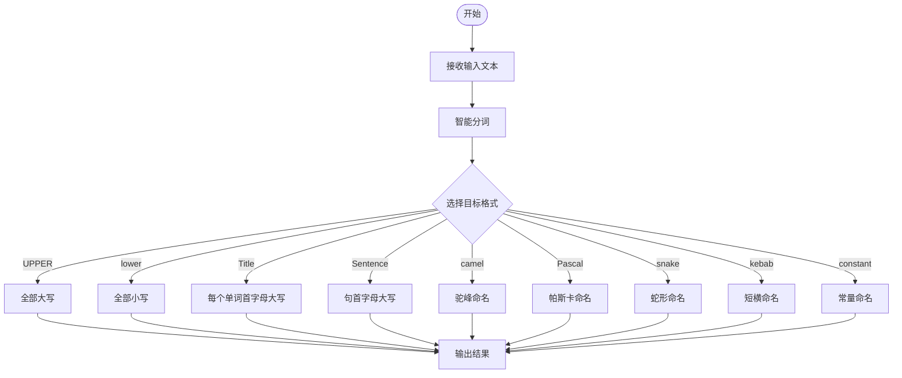
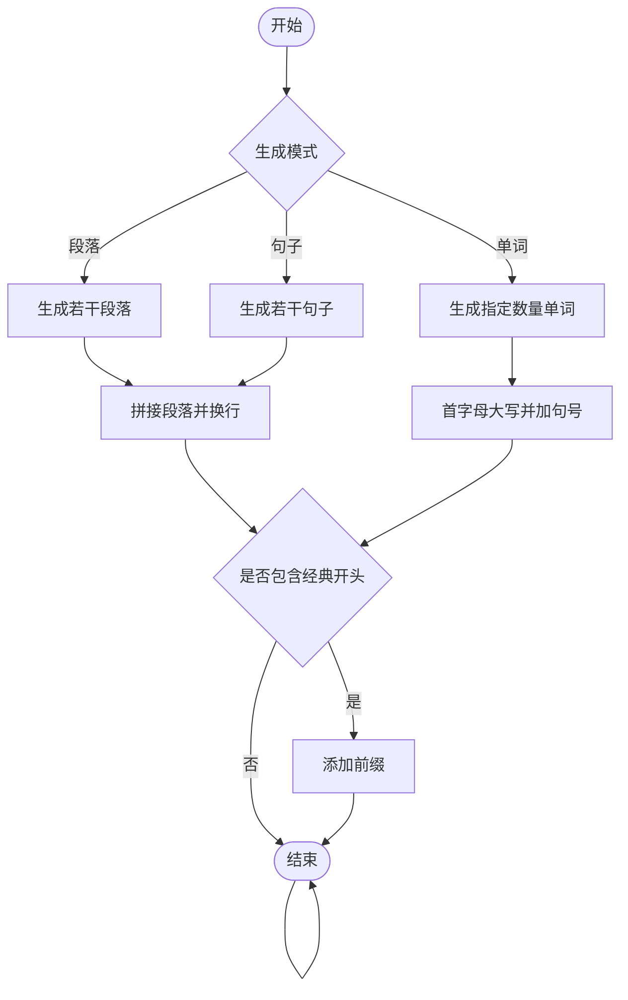
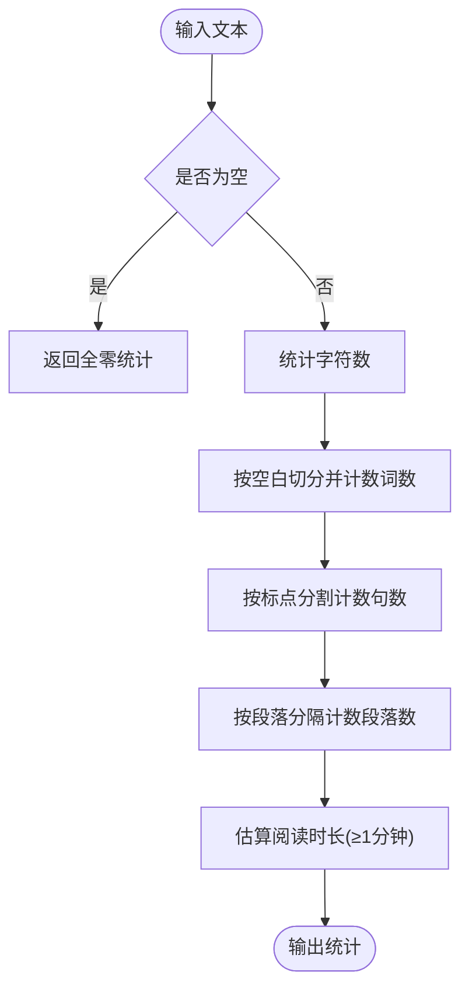
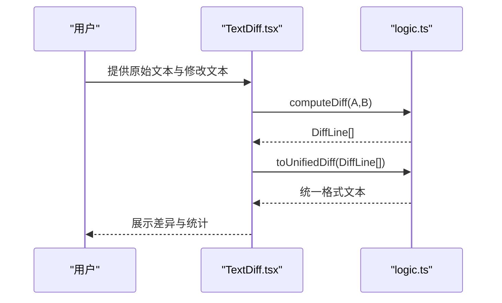
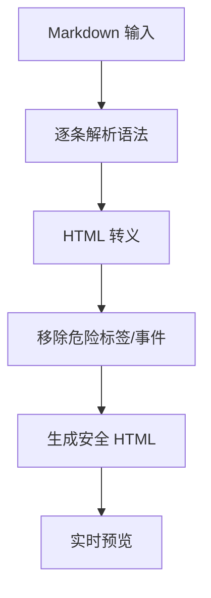
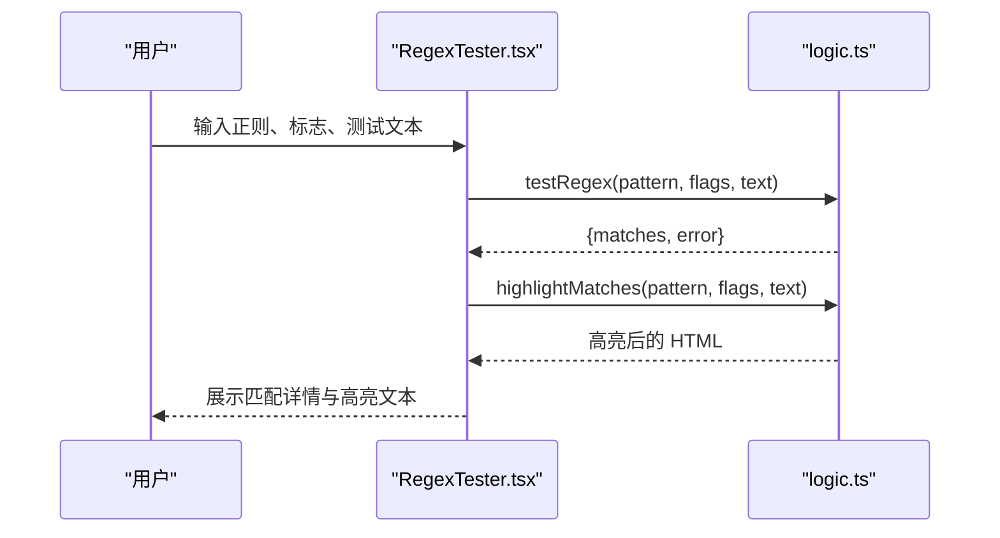
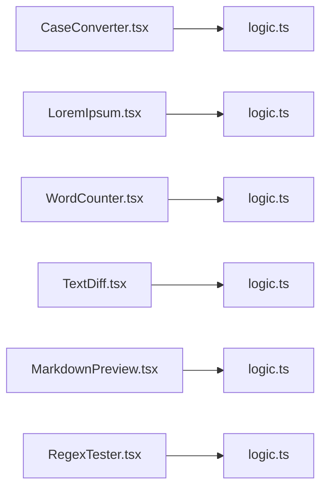

# 文本处理工具

<cite>
**本文档引用的文件**
- [src/tools/developer/case-converter/logic.ts](file://src/tools/developer/case-converter/logic.ts)
- [src/tools/developer/case-converter/CaseConverter.tsx](file://src/tools/developer/case-converter/CaseConverter.tsx)
- [src/tools/developer/lorem-ipsum/logic.ts](file://src/tools/developer/lorem-ipsum/logic.ts)
- [src/tools/developer/lorem-ipsum/LoremIpsum.tsx](file://src/tools/developer/lorem-ipsum/LoremIpsum.tsx)
- [src/tools/developer/word-counter/logic.ts](file://src/tools/developer/word-counter/logic.ts)
- [src/tools/developer/word-counter/WordCounter.tsx](file://src/tools/developer/word-counter/WordCounter.tsx)
- [src/tools/developer/text-diff/logic.ts](file://src/tools/developer/text-diff/logic.ts)
- [src/tools/developer/text-diff/TextDiff.tsx](file://src/tools/developer/text-diff/TextDiff.tsx)
- [src/tools/developer/markdown-preview/logic.ts](file://src/tools/developer/markdown-preview/logic.ts)
- [src/tools/developer/markdown-preview/MarkdownPreview.tsx](file://src/tools/developer/markdown-preview/MarkdownPreview.tsx)
- [src/tools/developer/regex-tester/logic.ts](file://src/tools/developer/regex-tester/logic.ts)
- [src/tools/developer/regex-tester/RegexTester.tsx](file://src/tools/developer/regex-tester/RegexTester.tsx)
- [messages/en/tools-developer.json](file://messages/en/tools-developer.json)
</cite>

## 目录
1. [简介](#简介)
2. [项目结构](#项目结构)
3. [核心组件](#核心组件)
4. [架构总览](#架构总览)
5. [详细组件分析](#详细组件分析)
6. [依赖关系分析](#依赖关系分析)
7. [性能考虑](#性能考虑)
8. [故障排除指南](#故障排除指南)
9. [结论](#结论)
10. [附录](#附录)

## 简介
本文件面向“文本处理工具”模块，系统性梳理六大工具：大小写转换、Lorem Ipsum 文本生成、单词计数、文本差异比较、Markdown 预览与正则表达式测试。文档从技术实现、数据流、错误处理、性能特征到使用场景与最佳实践进行深入解析，帮助开发者与使用者高效利用这些工具完成代码注释格式化、测试数据生成、内容审核与调试等任务。

## 项目结构
- 工具按功能分层组织于 src/tools/developer 下，每个工具包含两部分：
  - 前端组件（.tsx）：负责用户交互、状态管理与视图渲染
  - 业务逻辑（logic.ts）：纯函数实现算法或转换规则
- 国际化文案集中于 messages/en/tools-developer.json，提供工具名称、描述、使用说明与 SEO 内容



**图表来源**
- [src/tools/developer/case-converter/CaseConverter.tsx:1-72](file://src/tools/developer/case-converter/CaseConverter.tsx#L1-72)
- [src/tools/developer/lorem-ipsum/LoremIpsum.tsx:1-78](file://src/tools/developer/lorem-ipsum/LoremIpsum.tsx#L1-78)
- [src/tools/developer/word-counter/WordCounter.tsx:1-45](file://src/tools/developer/word-counter/WordCounter.tsx#L1-45)
- [src/tools/developer/text-diff/TextDiff.tsx:1-131](file://src/tools/developer/text-diff/TextDiff.tsx#L1-131)
- [src/tools/developer/markdown-preview/MarkdownPreview.tsx:1-46](file://src/tools/developer/markdown-preview/MarkdownPreview.tsx#L1-46)
- [src/tools/developer/regex-tester/RegexTester.tsx:1-154](file://src/tools/developer/regex-tester/RegexTester.tsx#L1-154)

**章节来源**
- [src/tools/developer/case-converter/CaseConverter.tsx:1-72](file://src/tools/developer/case-converter/CaseConverter.tsx#L1-72)
- [src/tools/developer/lorem-ipsum/LoremIpsum.tsx:1-78](file://src/tools/developer/lorem-ipsum/LoremIpsum.tsx#L1-78)
- [src/tools/developer/word-counter/WordCounter.tsx:1-45](file://src/tools/developer/word-counter/WordCounter.tsx#L1-45)
- [src/tools/developer/text-diff/TextDiff.tsx:1-131](file://src/tools/developer/text-diff/TextDiff.tsx#L1-131)
- [src/tools/developer/markdown-preview/MarkdownPreview.tsx:1-46](file://src/tools/developer/markdown-preview/MarkdownPreview.tsx#L1-46)
- [src/tools/developer/regex-tester/RegexTester.tsx:1-154](file://src/tools/developer/regex-tester/RegexTester.tsx#L1-154)

## 核心组件
- 大小写转换：支持 UPPERCASE、lowercase、Title Case、Sentence case、camelCase、PascalCase、snake_case、kebab-case、CONSTANT_CASE 等九种格式互转，具备智能分词与首字母大写规则
- Lorem Ipsum 生成器：按段落、句子或单词数量生成占位文本，可选择是否以经典开头起始
- 单词计数：统计词数、字符数、句子数、段落数与阅读时长（按 200 字/分钟估算）
- 文本差异比较：基于行级最长公共子序列（LCS）算法计算增删改，输出统一格式 diff
- Markdown 预览：将 Markdown 转换为安全的 HTML 并实时预览，内置 XSS 过滤
- 正则表达式测试：支持 g/i/m/s 标志，高亮匹配并展示捕获组详情，含错误反馈

**章节来源**
- [src/tools/developer/case-converter/logic.ts:1-68](file://src/tools/developer/case-converter/logic.ts#L1-L68)
- [src/tools/developer/lorem-ipsum/logic.ts:1-67](file://src/tools/developer/lorem-ipsum/logic.ts#L1-L67)
- [src/tools/developer/word-counter/logic.ts:1-22](file://src/tools/developer/word-counter/logic.ts#L1-L22)
- [src/tools/developer/text-diff/logic.ts:1-75](file://src/tools/developer/text-diff/logic.ts#L1-L75)
- [src/tools/developer/markdown-preview/logic.ts:1-76](file://src/tools/developer/markdown-preview/logic.ts#L1-L76)
- [src/tools/developer/regex-tester/logic.ts:1-84](file://src/tools/developer/regex-tester/logic.ts#L1-L84)

## 架构总览
- 前端组件通过受控输入与状态驱动，调用对应 logic.ts 中的纯函数
- 所有处理均在浏览器内完成，不涉及网络请求，确保隐私与离线可用
- 统一的国际化资源提供工具描述、使用说明与 SEO 内容



**图表来源**
- [src/tools/developer/case-converter/CaseConverter.tsx:23-30](file://src/tools/developer/case-converter/CaseConverter.tsx#L23-L30)
- [src/tools/developer/lorem-ipsum/LoremIpsum.tsx:17-19](file://src/tools/developer/lorem-ipsum/LoremIpsum.tsx#L17-L19)
- [src/tools/developer/word-counter/WordCounter.tsx:8-11](file://src/tools/developer/word-counter/WordCounter.tsx#L8-L11)
- [src/tools/developer/text-diff/TextDiff.tsx:19-28](file://src/tools/developer/text-diff/TextDiff.tsx#L19-L28)
- [src/tools/developer/markdown-preview/MarkdownPreview.tsx:9-13](file://src/tools/developer/markdown-preview/MarkdownPreview.tsx#L9-L13)
- [src/tools/developer/regex-tester/RegexTester.tsx:22-30](file://src/tools/developer/regex-tester/RegexTester.tsx#L22-L30)

## 详细组件分析

### 大小写转换工具
- 技术要点
  - 智能分词：将驼峰、蛇形、短横等命名风格拆分为单词数组
  - 多格式转换：统一映射到目标格式，保持一致性
  - 边界处理：空字符串、混合大小写、标点与数字的兼容
- 数据流
  - 输入文本 → 分词 → 规则化单词 → 拼接目标格式
- 错误处理
  - 默认返回原输入，避免异常中断
- 使用场景
  - 变量名重命名：camelCase ↔ snake_case
  - 标题格式化：Sentence case ↔ Title Case
  - 常量标准化：CONSTANT_CASE



**图表来源**
- [src/tools/developer/case-converter/logic.ts:12-67](file://src/tools/developer/case-converter/logic.ts#L12-L67)

**章节来源**
- [src/tools/developer/case-converter/logic.ts:1-68](file://src/tools/developer/case-converter/logic.ts#L1-L68)
- [src/tools/developer/case-converter/CaseConverter.tsx:23-30](file://src/tools/developer/case-converter/CaseConverter.tsx#L23-L30)

### Lorem Ipsum 文本生成工具
- 技术要点
  - 固定词库与随机分布：保证自然语感
  - 句子长度与段落数量：遵循正态分布范围
  - 可选经典开头：自动添加标准前缀
- 数据流
  - 参数（模式、数量、是否开头） → 生成器 → 拼接结果
- 使用场景
  - 设计原型：快速填充占位文本
  - UI 测试：验证排版与截断效果



**图表来源**
- [src/tools/developer/lorem-ipsum/logic.ts:39-66](file://src/tools/developer/lorem-ipsum/logic.ts#L39-L66)

**章节来源**
- [src/tools/developer/lorem-ipsum/logic.ts:1-67](file://src/tools/developer/lorem-ipsum/logic.ts#L1-L67)
- [src/tools/developer/lorem-ipsum/LoremIpsum.tsx:10-19](file://src/tools/developer/lorem-ipsum/LoremIpsum.tsx#L10-L19)

### 单词计数工具
- 技术要点
  - 词数：按空白分割并过滤空串
  - 句数：按句号、问号、感叹号分割
  - 段落数：按双换行符分割
  - 阅读时长：按 200 字/分钟估算，最小 1 分钟
- 性能特征
  - 线性时间复杂度，适合超长文本
- 使用场景
  - 写作与编辑：检查字数限制
  - SEO 优化：评估文章长度与阅读体验



**图表来源**
- [src/tools/developer/word-counter/logic.ts:9-21](file://src/tools/developer/word-counter/logic.ts#L9-L21)

**章节来源**
- [src/tools/developer/word-counter/logic.ts:1-22](file://src/tools/developer/word-counter/logic.ts#L1-L22)
- [src/tools/developer/word-counter/WordCounter.tsx:8-11](file://src/tools/developer/word-counter/WordCounter.tsx#L8-L11)

### 文本差异比较工具
- 技术要点
  - 行级 LCS 算法：构建 DP 表并回溯生成 diff
  - 内存保护：当行数乘积超过阈值时抛出错误
  - 统一 diff 输出：+/- 前缀便于复制与对比
- 数据流
  - 两段文本 → 行分割 → LCS 计算 → 结果反转 → 统一格式
- 使用场景
  - 代码审查：对比版本变更
  - 配置校验：比对生产与开发配置
  - 文档修订：追踪修改痕迹



**图表来源**
- [src/tools/developer/text-diff/TextDiff.tsx:19-30](file://src/tools/developer/text-diff/TextDiff.tsx#L19-L30)
- [src/tools/developer/text-diff/logic.ts:9-56](file://src/tools/developer/text-diff/logic.ts#L9-L56)

**章节来源**
- [src/tools/developer/text-diff/logic.ts:1-75](file://src/tools/developer/text-diff/logic.ts#L1-L75)
- [src/tools/developer/text-diff/TextDiff.tsx:10-38](file://src/tools/developer/text-diff/TextDiff.tsx#L10-L38)

### Markdown 预览工具
- 技术要点
  - 语法识别：标题、粗体、斜体、代码块、行内代码、列表、引用、水平线
  - 安全渲染：HTML 转义与危险标签/事件清理
  - 实时预览：依赖 memo 化避免重复渲染
- 使用场景
  - 文档写作：边写边看渲染效果
  - 内容审核：预览 HTML 输出再发布



**图表来源**
- [src/tools/developer/markdown-preview/logic.ts:9-75](file://src/tools/developer/markdown-preview/logic.ts#L9-L75)

**章节来源**
- [src/tools/developer/markdown-preview/logic.ts:1-76](file://src/tools/developer/markdown-preview/logic.ts#L1-L76)
- [src/tools/developer/markdown-preview/MarkdownPreview.tsx:9-13](file://src/tools/developer/markdown-preview/MarkdownPreview.tsx#L9-L13)

### 正则表达式测试工具
- 技术要点
  - 支持标志：g（全局）、i（忽略大小写）、m（多行）、s（单行/点全匹配）
  - 匹配高亮：对每次匹配进行 HTML 转义并包裹高亮标记
  - 捕获组：展示命名/编号分组内容
  - 错误处理：捕获异常并返回错误消息
- 使用场景
  - 模式调试：快速验证正则正确性
  - 数据提取：定位并高亮目标片段
  - 学习正则：通过交互实验掌握语法



**图表来源**
- [src/tools/developer/regex-tester/RegexTester.tsx:22-30](file://src/tools/developer/regex-tester/RegexTester.tsx#L22-L30)
- [src/tools/developer/regex-tester/logic.ts:7-46](file://src/tools/developer/regex-tester/logic.ts#L7-L46)

**章节来源**
- [src/tools/developer/regex-tester/logic.ts:1-84](file://src/tools/developer/regex-tester/logic.ts#L1-L84)
- [src/tools/developer/regex-tester/RegexTester.tsx:16-36](file://src/tools/developer/regex-tester/RegexTester.tsx#L16-L36)

## 依赖关系分析
- 组件与逻辑分离：每个 .tsx 仅负责 UI 与状态，逻辑封装在同目录 logic.ts
- 无外部运行时依赖：所有算法为纯函数，利于单元测试与复用
- 国际化解耦：文案集中于 messages/en/tools-developer.json，前端通过 useTranslations 获取



**图表来源**
- [src/tools/developer/case-converter/CaseConverter.tsx:1-10](file://src/tools/developer/case-converter/CaseConverter.tsx#L1-L10)
- [src/tools/developer/lorem-ipsum/LoremIpsum.tsx:1-8](file://src/tools/developer/lorem-ipsum/LoremIpsum.tsx#L1-L8)
- [src/tools/developer/word-counter/WordCounter.tsx:1-6](file://src/tools/developer/word-counter/WordCounter.tsx#L1-L6)
- [src/tools/developer/text-diff/TextDiff.tsx:1-8](file://src/tools/developer/text-diff/TextDiff.tsx#L1-L8)
- [src/tools/developer/markdown-preview/MarkdownPreview.tsx:1-7](file://src/tools/developer/markdown-preview/MarkdownPreview.tsx#L1-L7)
- [src/tools/developer/regex-tester/RegexTester.tsx:1-7](file://src/tools/developer/regex-tester/RegexTester.tsx#L1-L7)

**章节来源**
- [messages/en/tools-developer.json:707-756](file://messages/en/tools-developer.json#L707-L756)

## 性能考虑
- 大小写转换：O(n) 时间与空间，适合长文本
- Lorem Ipsum：按需生成，内存占用与输出长度线性相关
- 单词计数：O(n)，对超长文本仍可快速完成
- 文本差异：LCS 的空间复杂度为 O(mn)，存在阈值保护；建议控制输入规模
- Markdown 预览：解析与转义为 O(n)，memo 化避免重复计算
- 正则测试：全局匹配可能产生大量结果，注意浏览器渲染性能

[本节为通用指导，无需特定文件引用]

## 故障排除指南
- 文本差异过大报错
  - 现象：抛出输入过大错误
  - 处理：拆分输入或降低行数
  - 参考路径：[src/tools/developer/text-diff/logic.ts:17-19](file://src/tools/developer/text-diff/logic.ts#L17-L19)
- 正则无效
  - 现象：返回错误消息
  - 处理：检查语法与标志组合
  - 参考路径：[src/tools/developer/regex-tester/logic.ts:40-45](file://src/tools/developer/regex-tester/logic.ts#L40-L45)
- Markdown 包含脚本或危险标签
  - 现象：被自动清理
  - 处理：确认输出是否符合预期
  - 参考路径：[src/tools/developer/markdown-preview/logic.ts:67-73](file://src/tools/developer/markdown-preview/logic.ts#L67-L73)

**章节来源**
- [src/tools/developer/text-diff/logic.ts:17-19](file://src/tools/developer/text-diff/logic.ts#L17-L19)
- [src/tools/developer/regex-tester/logic.ts:40-45](file://src/tools/developer/regex-tester/logic.ts#L40-L45)
- [src/tools/developer/markdown-preview/logic.ts:67-73](file://src/tools/developer/markdown-preview/logic.ts#L67-L73)

## 结论
该文本处理工具模块以纯前端实现为核心，覆盖日常开发与内容创作中的高频需求。通过清晰的组件与逻辑分离、完善的国际化支持以及严格的隐私与离线特性，这些工具既易于扩展又便于维护。建议在团队协作中结合各工具的实际场景进行规范化的使用与推广。

[本节为总结性内容，无需特定文件引用]

## 附录

### 使用示例与最佳实践
- 大小写转换
  - 场景：变量名重命名
  - 建议：先转为 snake_case，再转为 camelCase
  - 参考路径：[src/tools/developer/case-converter/CaseConverter.tsx:28-30](file://src/tools/developer/case-converter/CaseConverter.tsx#L28-L30)
- Lorem Ipsum
  - 场景：设计原型占位
  - 建议：按段落生成，勾选经典开头
  - 参考路径：[src/tools/developer/lorem-ipsum/LoremIpsum.tsx:17-19](file://src/tools/developer/lorem-ipsum/LoremIpsum.tsx#L17-L19)
- 单词计数
  - 场景：文章字数统计
  - 建议：用于 SEO 与阅读时长估算
  - 参考路径：[src/tools/developer/word-counter/WordCounter.tsx:8-11](file://src/tools/developer/word-counter/WordCounter.tsx#L8-L11)
- 文本差异
  - 场景：代码审查
  - 建议：拆分大文件对比，关注新增/删除统计
  - 参考路径：[src/tools/developer/text-diff/TextDiff.tsx:32-37](file://src/tools/developer/text-diff/TextDiff.tsx#L32-L37)
- Markdown 预览
  - 场景：文档写作
  - 建议：先预览再复制 HTML
  - 参考路径：[src/tools/developer/markdown-preview/MarkdownPreview.tsx:37-40](file://src/tools/developer/markdown-preview/MarkdownPreview.tsx#L37-L40)
- 正则表达式测试
  - 场景：调试与学习
  - 建议：先用 i 标志测试，再逐步添加 g/m/s
  - 参考路径：[src/tools/developer/regex-tester/RegexTester.tsx:32-36](file://src/tools/developer/regex-tester/RegexTester.tsx#L32-L36)

**章节来源**
- [src/tools/developer/case-converter/CaseConverter.tsx:28-30](file://src/tools/developer/case-converter/CaseConverter.tsx#L28-L30)
- [src/tools/developer/lorem-ipsum/LoremIpsum.tsx:17-19](file://src/tools/developer/lorem-ipsum/LoremIpsum.tsx#L17-L19)
- [src/tools/developer/word-counter/WordCounter.tsx:8-11](file://src/tools/developer/word-counter/WordCounter.tsx#L8-L11)
- [src/tools/developer/text-diff/TextDiff.tsx:32-37](file://src/tools/developer/text-diff/TextDiff.tsx#L32-L37)
- [src/tools/developer/markdown-preview/MarkdownPreview.tsx:37-40](file://src/tools/developer/markdown-preview/MarkdownPreview.tsx#L37-L40)
- [src/tools/developer/regex-tester/RegexTester.tsx:32-36](file://src/tools/developer/regex-tester/RegexTester.tsx#L32-L36)

### Markdown 语法要点
- 标题：# 至 ######
- 粗体与斜体：**文本**、*文本*
- 代码：行内 `code`、代码块 ```language ```
- 列表：有序与无序
- 引用：> 文本
- 链接与图片：[text](url)、
- 参考路径：[src/tools/developer/markdown-preview/logic.ts:13-65](file://src/tools/developer/markdown-preview/logic.ts#L13-L65)

**章节来源**
- [src/tools/developer/markdown-preview/logic.ts:13-65](file://src/tools/developer/markdown-preview/logic.ts#L13-L65)

### 正则表达式编写技巧
- 常用标志：g（全局）、i（忽略大小写）、m（多行）、s（点全匹配）
- 捕获组：命名分组 (?'name',) 或编号分组 ()
- 零宽断言：(?=pattern)、(?<=pattern)
- 贪婪与非贪婪：量词后加 ? 控制
- 参考路径：[src/tools/developer/regex-tester/logic.ts:7-46](file://src/tools/developer/regex-tester/logic.ts#L7-L46)

**章节来源**
- [src/tools/developer/regex-tester/logic.ts:7-46](file://src/tools/developer/regex-tester/logic.ts#L7-L46)