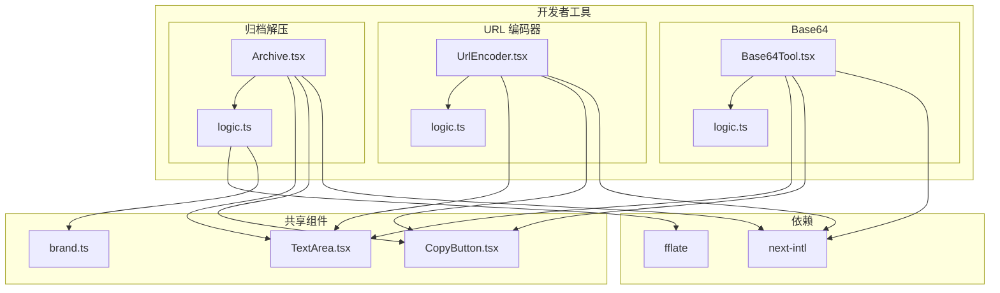
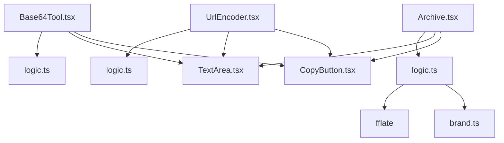
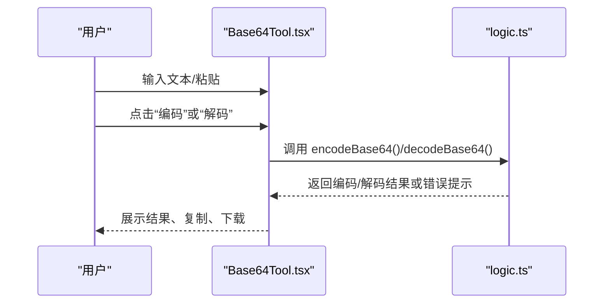
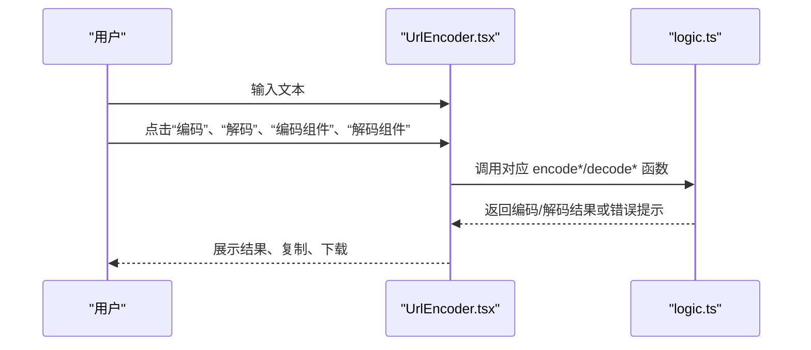
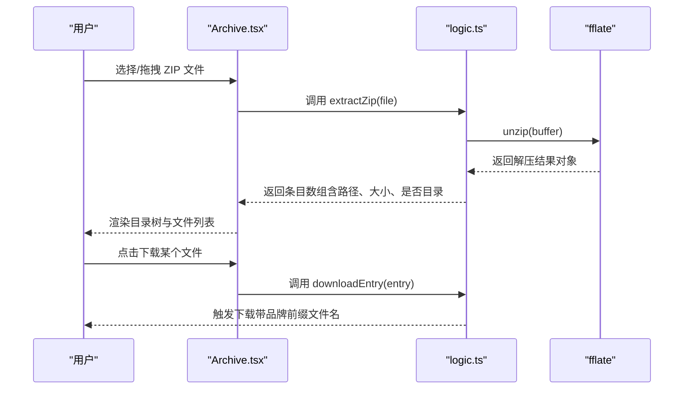
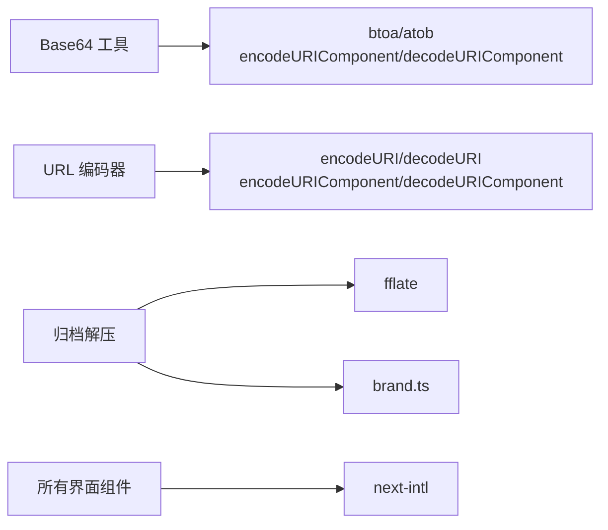

# 编码解码工具

<cite>
**本文引用的文件**
- [Base64 工具界面](file://src/tools/developer/base64/Base64Tool.tsx)
- [Base64 工具逻辑](file://src/tools/developer/base64/logic.ts)
- [URL 编码器界面](file://src/tools/developer/url-encoder/UrlEncoder.tsx)
- [URL 编码器逻辑](file://src/tools/developer/url-encoder/logic.ts)
- [归档解压工具界面](file://src/tools/developer/archive/Archive.tsx)
- [归档解压工具逻辑](file://src/tools/developer/archive/logic.ts)
- [通用文本区域组件](file://src/components/shared/TextArea.tsx)
- [复制按钮组件](file://src/components/shared/CopyButton.tsx)
- [品牌文件名处理](file://src/lib/brand.ts)
- [项目依赖配置](file://package.json)
</cite>

## 目录
1. [简介](#简介)
2. [项目结构](#项目结构)
3. [核心组件](#核心组件)
4. [架构总览](#架构总览)
5. [详细组件分析](#详细组件分析)
6. [依赖关系分析](#依赖关系分析)
7. [性能考量](#性能考量)
8. [故障排除指南](#故障排除指南)
9. [结论](#结论)
10. [附录](#附录)

## 简介
本文件面向“编码解码工具”模块，系统性阐述以下三类功能的技术实现与应用价值：
- Base64 编解码：将任意字节序列转换为 ASCII 可打印字符集，便于在文本协议（如 HTTP、JSON、data URI）中安全传输二进制数据。
- URL 编解码：对完整 URL 与 URL 组件进行编码/解码，确保特殊字符在浏览器地址栏、查询参数、路径等场景中正确传递。
- 归档解压：在浏览器端解析 ZIP 文件，展示目录树与文件列表，并支持逐个下载。

这些工具在现代 Web 开发中广泛用于数据传输、跨平台兼容与文件管理，既保证了安全性与可读性，又避免了服务器端依赖。

## 项目结构
该模块位于开发者工具分类下，采用按功能分层的组织方式：
- 界面层：每个工具以独立的客户端组件呈现，负责用户交互与结果展示。
- 逻辑层：每个工具包含对应的纯函数逻辑，封装编码/解码或归档操作。
- 共享组件：复用的 UI 组件（如文本输入框、复制按钮）提升一致性与可维护性。
- 品牌与工具链：统一的文件命名策略与第三方库（如 fflate）支撑高性能归档处理。

图表来源
- [Base64 工具界面:1-52](file://src/tools/developer/base64/Base64Tool.tsx#L1-L52)
- [Base64 工具逻辑:1-24](file://src/tools/developer/base64/logic.ts#L1-L24)
- [URL 编码器界面:1-61](file://src/tools/developer/url-encoder/UrlEncoder.tsx#L1-L61)
- [URL 编码器逻辑:1-32](file://src/tools/developer/url-encoder/logic.ts#L1-L32)
- [归档解压工具界面:1-117](file://src/tools/developer/archive/Archive.tsx#L1-L117)
- [归档解压工具逻辑:1-66](file://src/tools/developer/archive/logic.ts#L1-L66)
- [通用文本区域组件:1-74](file://src/components/shared/TextArea.tsx#L1-L74)
- [复制按钮组件:1-57](file://src/components/shared/CopyButton.tsx#L1-L57)
- [品牌文件名处理:1-7](file://src/lib/brand.ts#L1-L7)
- [项目依赖配置:11-32](file://package.json#L11-L32)

章节来源
- [Base64 工具界面:1-52](file://src/tools/developer/base64/Base64Tool.tsx#L1-L52)
- [Base64 工具逻辑:1-24](file://src/tools/developer/base64/logic.ts#L1-L24)
- [URL 编码器界面:1-61](file://src/tools/developer/url-encoder/UrlEncoder.tsx#L1-L61)
- [URL 编码器逻辑:1-32](file://src/tools/developer/url-encoder/logic.ts#L1-L32)
- [归档解压工具界面:1-117](file://src/tools/developer/archive/Archive.tsx#L1-L117)
- [归档解压工具逻辑:1-66](file://src/tools/developer/archive/logic.ts#L1-L66)
- [通用文本区域组件:1-74](file://src/components/shared/TextArea.tsx#L1-L74)
- [复制按钮组件:1-57](file://src/components/shared/CopyButton.tsx#L1-L57)
- [品牌文件名处理:1-7](file://src/lib/brand.ts#L1-L7)
- [项目依赖配置:11-32](file://package.json#L11-L32)

## 核心组件
本模块由三个相互独立的工具组成，均采用“界面 + 逻辑”的分层设计，配合共享组件实现一致的用户体验与功能扩展。

- Base64 工具
  - 界面职责：提供输入框、编码/解码按钮、输出展示区、复制与下载能力。
  - 逻辑职责：封装浏览器内置的 Base64 编解码 API，并进行错误兜底。
- URL 编码器
  - 界面职责：支持完整 URL 编解码与 URL 组件编解码，提供多按钮操作。
  - 逻辑职责：封装 encodeURI/decodeURI 与 encodeURIComponent/decodeURIComponent。
- 归档解压
  - 界面职责：拖拽上传 ZIP，异步解析并展示目录树与文件列表，支持逐个下载。
  - 逻辑职责：基于 fflate 解压，生成结构化条目，格式化文件大小，下载时添加品牌前缀。

章节来源
- [Base64 工具界面:11-51](file://src/tools/developer/base64/Base64Tool.tsx#L11-L51)
- [Base64 工具逻辑:1-24](file://src/tools/developer/base64/logic.ts#L1-L24)
- [URL 编码器界面:16-60](file://src/tools/developer/url-encoder/UrlEncoder.tsx#L16-L60)
- [URL 编码器逻辑:1-32](file://src/tools/developer/url-encoder/logic.ts#L1-L32)
- [归档解压工具界面:15-116](file://src/tools/developer/archive/Archive.tsx#L15-L116)
- [归档解压工具逻辑:20-66](file://src/tools/developer/archive/logic.ts#L20-L66)

## 架构总览
整体采用前端纯浏览器实现，避免服务端依赖，通过第三方库增强特定能力（如 fflate）。界面层通过状态管理驱动逻辑层执行具体操作，并将结果反馈给用户。

图表来源
- [Base64 工具界面:1-52](file://src/tools/developer/base64/Base64Tool.tsx#L1-L52)
- [Base64 工具逻辑:1-24](file://src/tools/developer/base64/logic.ts#L1-L24)
- [URL 编码器界面:1-61](file://src/tools/developer/url-encoder/UrlEncoder.tsx#L1-L61)
- [URL 编码器逻辑:1-32](file://src/tools/developer/url-encoder/logic.ts#L1-L32)
- [归档解压工具界面:1-117](file://src/tools/developer/archive/Archive.tsx#L1-L117)
- [归档解压工具逻辑:1-66](file://src/tools/developer/archive/logic.ts#L1-L66)
- [通用文本区域组件:1-74](file://src/components/shared/TextArea.tsx#L1-L74)
- [复制按钮组件:1-57](file://src/components/shared/CopyButton.tsx#L1-L57)
- [品牌文件名处理:1-7](file://src/lib/brand.ts#L1-L7)

## 详细组件分析

### Base64 工具
- 技术要点
  - 使用浏览器内置 btoa/atob 进行 Base64 编解码；为保证 Unicode 安全，先通过 encodeURIComponent/decodeURIComponent 处理输入与输出。
  - 错误处理：捕获异常并返回明确提示，避免前端崩溃。
- 数据流
  - 用户输入 → 点击编码/解码 → 调用逻辑函数 → 输出结果 → 展示与复制/下载。
- 应用场景
  - 将图片或小文件嵌入 HTML 的 data URI；
  - 在 JSON 或 URL 中携带二进制元数据；
  - 跨语言/跨平台传输时的中间格式转换。
- 最佳实践
  - 对超大文本进行分块处理或提示用户；
  - 注意 Base64 会增加约 33% 的体积，仅在必要时使用；
  - 避免在明文密码等敏感信息上滥用 Base64，应使用加密而非仅编码。

图表来源
- [Base64 工具界面:16-33](file://src/tools/developer/base64/Base64Tool.tsx#L16-L33)
- [Base64 工具逻辑:1-24](file://src/tools/developer/base64/logic.ts#L1-L24)

章节来源
- [Base64 工具界面:11-51](file://src/tools/developer/base64/Base64Tool.tsx#L11-L51)
- [Base64 工具逻辑:1-24](file://src/tools/developer/base64/logic.ts#L1-L24)

### URL 编码器
- 技术要点
  - 支持两种模式：
    - 整体 URL 编解码：encodeURI/decodeURI，适用于整个 URL 字符串。
    - URL 组件编解码：encodeURIComponent/decodeURIComponent，适用于查询参数、路径段等片段。
  - 错误处理：对无效编码字符串给出明确提示。
- 数据流
  - 用户输入 → 选择编码模式 → 执行对应函数 → 输出结果 → 展示与复制/下载。
- 应用场景
  - Web 表单提交、API 请求参数拼接；
  - 动态路由参数传递；
  - 构建可分享的链接（含特殊字符）。
- 最佳实践
  - 参数级使用组件编码，路径级使用整体编码；
  - 对用户输入进行预处理，避免重复编码；
  - 注意浏览器对编码字符集的限制与兼容性差异。

图表来源
- [URL 编码器界面:21-42](file://src/tools/developer/url-encoder/UrlEncoder.tsx#L21-L42)
- [URL 编码器逻辑:1-32](file://src/tools/developer/url-encoder/logic.ts#L1-L32)

章节来源
- [URL 编码器界面:16-60](file://src/tools/developer/url-encoder/UrlEncoder.tsx#L16-L60)
- [URL 编码器逻辑:1-32](file://src/tools/developer/url-encoder/logic.ts#L1-L32)

### 归档解压工具
- 技术要点
  - 使用 fflate 异步解压 ZIP，将二进制数据转为内存映射，构建条目数组（含路径、大小、是否目录、数据）。
  - 展示层级结构：根据路径缩进显示目录与文件；按名称排序。
  - 下载能力：为每个文件生成 Blob 并触发下载，文件名添加品牌前缀以避免冲突。
  - 文件类型识别：根据扩展名区分图片、代码、文档等，提供可视化图标。
- 数据流
  - 拖拽/选择 ZIP → 读取为 ArrayBuffer → 异步解压 → 生成条目列表 → 渲染树形视图 → 单文件下载。
- 应用场景
  - 快速查看 ZIP 内容，无需安装本地解压软件；
  - 移动设备或无文件管理器环境下的文件浏览；
  - 邮件附件预览与按需下载。
- 最佳实践
  - 大型归档可能占用较多内存，建议在移动端谨慎使用；
  - 仅支持标准 ZIP，不支持加密或损坏归档；
  - 下载时注意浏览器的安全策略与弹窗拦截。

图表来源
- [归档解压工具界面:22-38](file://src/tools/developer/archive/Archive.tsx#L22-L38)
- [归档解压工具逻辑:20-47](file://src/tools/developer/archive/logic.ts#L20-L47)

章节来源
- [归档解压工具界面:15-116](file://src/tools/developer/archive/Archive.tsx#L15-L116)
- [归档解压工具逻辑:1-66](file://src/tools/developer/archive/logic.ts#L1-L66)

## 依赖关系分析
- 第三方库
  - fflate：高性能 ZIP 解压库，用于归档解压工具。
  - next-intl：国际化支持，为各工具提供多语言文案。
- 内置 API
  - Base64：btoa/atob、encodeURIComponent/decodeURIComponent。
  - URL：encodeURI/decodeURI、encodeURIComponent/decodeURIComponent。
  - 浏览器下载：Blob、URL.createObjectURL、a.download。
- 品牌策略
  - 为下载文件名添加统一前缀，避免覆盖同名文件。

图表来源
- [Base64 工具逻辑:1-24](file://src/tools/developer/base64/logic.ts#L1-L24)
- [URL 编码器逻辑:1-32](file://src/tools/developer/url-encoder/logic.ts#L1-L32)
- [归档解压工具逻辑:1-66](file://src/tools/developer/archive/logic.ts#L1-L66)
- [项目依赖配置:11-32](file://package.json#L11-L32)
- [品牌文件名处理:1-7](file://src/lib/brand.ts#L1-L7)

章节来源
- [项目依赖配置:11-32](file://package.json#L11-L32)
- [归档解压工具逻辑:1-66](file://src/tools/developer/archive/logic.ts#L1-L66)

## 性能考量
- Base64
  - 体积膨胀：编码后约为原大小的 4/3，不适合大文件长距离传输。
  - 浏览器内核优化：btoa/atob 通常由底层实现加速，但超大字符串仍可能阻塞 UI。
- URL 编码
  - 时间复杂度近似线性于输入长度；对超长查询字符串建议分段处理。
- 归档解压
  - 内存占用：解压过程会将所有文件加载到内存，大归档可能导致内存压力。
  - 异步处理：使用 Promise 包装 fflate 回调，避免阻塞主线程。
  - 建议：对超大归档提供进度提示或分批处理策略。

## 故障排除指南
- Base64
  - 现象：解码失败或报错。
  - 排查：确认输入为合法 Base64 字符串；检查是否包含换行或多余空白；尝试重新编码。
- URL 编码
  - 现象：解码后出现乱码或报错。
  - 排查：区分整体 URL 与组件编码场景；确保未对已编码字符串再次编码。
- 归档解压
  - 现象：无法解析或提示不支持的格式。
  - 排查：确认文件为标准 ZIP；检查文件完整性；避免加密或损坏的归档。
  - 现象：下载失败或文件名异常。
  - 排查：检查浏览器下载权限与弹窗设置；确认条目非目录且存在数据；查看品牌前缀是否影响识别。

章节来源
- [Base64 工具逻辑:8-22](file://src/tools/developer/base64/logic.ts#L8-L22)
- [URL 编码器逻辑:4-30](file://src/tools/developer/url-encoder/logic.ts#L4-L30)
- [归档解压工具界面:33-37](file://src/tools/developer/archive/Archive.tsx#L33-L37)
- [归档解压工具逻辑:38-47](file://src/tools/developer/archive/logic.ts#L38-L47)

## 结论
本模块以简洁的界面与稳健的逻辑实现了三大常用编码解码能力：
- Base64 适合在文本协议中携带二进制数据；
- URL 编解码保障 Web 场景中字符的正确传递；
- 归档解压提供便捷的浏览器端文件浏览与下载体验。
通过合理的错误处理与性能考量，这些工具在现代 Web 开发中具有广泛的实用价值与良好的可维护性。

## 附录
- 使用示例（概念性说明）
  - Base64：将一段文本进行编码，再解码回原文，验证一致性；或将图片转为 data URI 嵌入页面。
  - URL：对包含空格与特殊字符的路径进行组件编码，随后解码验证；对完整 URL 进行整体编码以适配分享链接。
  - 归档：上传 ZIP 后查看目录结构与文件大小，选择单个文件下载，确认下载文件名带有品牌前缀。
- 注意事项
  - Base64 不是加密，请勿将其用于安全存储；
  - URL 编码需根据场景选择整体或组件级别；
  - 归档解压受浏览器内存限制，避免同时打开多个大型归档。