# 视频信息提取工具

<cite>
**本文档引用的文件**
- [VideoInfo.tsx](file://src/tools/video/info/VideoInfo.tsx)
- [logic.ts](file://src/tools/video/info/logic.ts)
- [VideoUploader.tsx](file://src/components/shared/VideoUploader.tsx)
- [ffmpeg.ts](file://src/lib/ffmpeg.ts)
- [media-pipeline.ts](file://src/lib/media-pipeline.ts)
- [tools-video.json](file://messages/en/tools-video.json)
- [index.ts](file://src/tools/video/info/index.ts)
- [registry/index.ts](file://src/lib/registry/index.ts)
- [README.md](file://README.md)
- [package.json](file://package.json)
</cite>

## 目录
1. [简介](#简介)
2. [项目结构](#项目结构)
3. [核心组件](#核心组件)
4. [架构概览](#架构概览)
5. [详细组件分析](#详细组件分析)
6. [依赖关系分析](#依赖关系分析)
7. [性能考虑](#性能考虑)
8. [故障排除指南](#故障排除指南)
9. [结论](#结论)
10. [附录](#附录)

## 简介

视频信息提取工具是一个强大的浏览器端视频元数据分析工具，能够在不上传文件到服务器的情况下，提供详细的视频技术规格和格式信息。该工具基于FFmpeg.wasm技术，实现了完整的视频元数据解析、技术规格提取和格式信息分析功能。

### 主要功能特性

- **双层分析机制**：结合浏览器原生元数据检测和深度FFmpeg分析
- **全面的技术规格提取**：涵盖编解码器、分辨率、帧率、比特率等关键参数
- **多格式支持**：支持MP4、WebM、MKV、AVI等多种常见视频格式
- **批量处理能力**：支持同时分析多个视频文件
- **导出功能**：提供一键复制所有元数据信息
- **格式兼容性**：自动检测并提示不支持的编解码器

## 项目结构

该项目采用模块化的Next.js应用架构，视频信息提取工具位于专门的工具模块中：

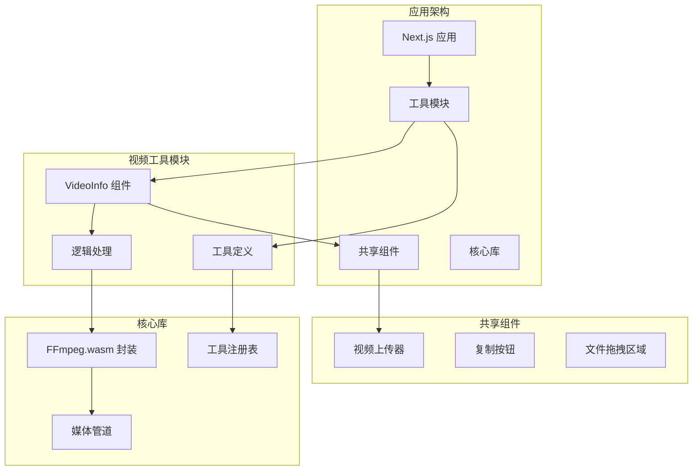

**图表来源**
- [VideoInfo.tsx:1-308](file://src/tools/video/info/VideoInfo.tsx#L1-L308)
- [logic.ts:1-272](file://src/tools/video/info/logic.ts#L1-L272)
- [registry/index.ts:1-164](file://src/lib/registry/index.ts#L1-L164)

**章节来源**
- [README.md:55-78](file://README.md#L55-L78)
- [package.json:11-32](file://package.json#L11-L32)

## 核心组件

### 视频信息提取组件 (VideoInfo)

VideoInfo组件是整个工具的核心，负责协调文件上传、元数据提取和结果显示。该组件实现了以下关键功能：

- **自动触发机制**：当浏览器检测到视频元数据时自动触发FFmpeg分析
- **错误处理**：完善的异常捕获和用户友好的错误提示
- **响应式界面**：根据分析进度动态更新界面状态
- **批量处理支持**：支持连续分析多个视频文件

### 元数据解析逻辑 (logic.ts)

logic.ts模块提供了专业的视频元数据解析能力：

- **FFmpeg日志解析**：从FFmpeg输出中提取结构化信息
- **流信息提取**：分别处理视频流和音频流的技术参数
- **格式标准化**：统一各种技术指标的显示格式
- **错误恢复**：对部分缺失或异常的数据进行合理处理

### 视频上传器 (VideoUploader)

VideoUploader组件提供了完整的视频文件处理能力：

- **浏览器元数据检测**：快速获取视频的基本技术参数
- **FPS检测**：通过requestVideoFrameCallback API精确计算帧率
- **编解码器兼容性检查**：检测浏览器支持的编解码器
- **文件预览**：提供视频文件的实时预览功能

**章节来源**
- [VideoInfo.tsx:23-308](file://src/tools/video/info/VideoInfo.tsx#L23-L308)
- [logic.ts:33-140](file://src/tools/video/info/logic.ts#L33-L140)
- [VideoUploader.tsx:66-382](file://src/components/shared/VideoUploader.tsx#L66-L382)

## 架构概览

视频信息提取工具采用了分层架构设计，确保了良好的可维护性和扩展性：

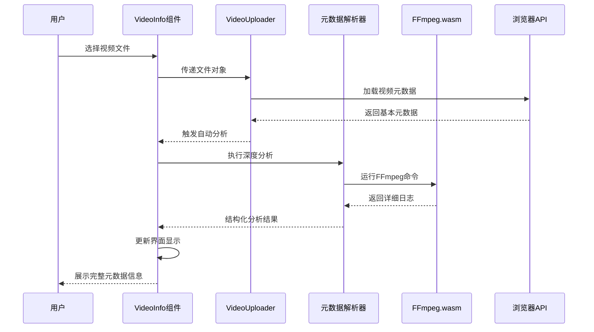

**图表来源**
- [VideoInfo.tsx:36-58](file://src/tools/video/info/VideoInfo.tsx#L36-L58)
- [logic.ts:33-71](file://src/tools/video/info/logic.ts#L33-L71)
- [VideoUploader.tsx:95-113](file://src/components/shared/VideoUploader.tsx#L95-L113)

### 数据流架构

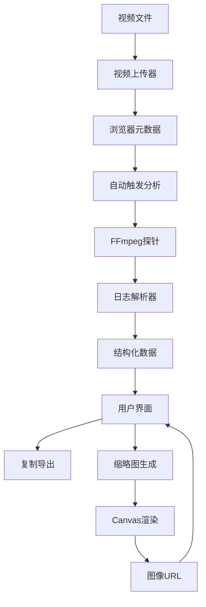

**图表来源**
- [VideoInfo.tsx:60-74](file://src/tools/video/info/VideoInfo.tsx#L60-L74)
- [logic.ts:226-272](file://src/tools/video/info/logic.ts#L226-L272)
- [VideoUploader.tsx:202-240](file://src/components/shared/VideoUploader.tsx#L202-L240)

## 详细组件分析

### 视频信息提取组件 (VideoInfo)

VideoInfo组件是工具的核心界面组件，实现了完整的视频元数据分析流程：

#### 核心状态管理

组件维护了以下关键状态：
- `file`: 当前处理的视频文件
- `browserMeta`: 浏览器检测到的基础元数据
- `probeResult`: FFmpeg深度分析的结果
- `thumbnails`: 自动生成的缩略图集合
- `probing`: 分析进行中的状态指示

#### 自动化工作流程

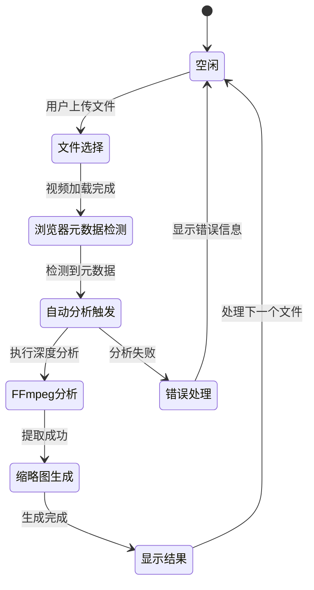

**图表来源**
- [VideoInfo.tsx:23-82](file://src/tools/video/info/VideoInfo.tsx#L23-L82)
- [VideoInfo.tsx:127-269](file://src/tools/video/info/VideoInfo.tsx#L127-L269)

#### 导出功能实现

组件提供了完整的元数据导出功能，支持一键复制所有分析结果：

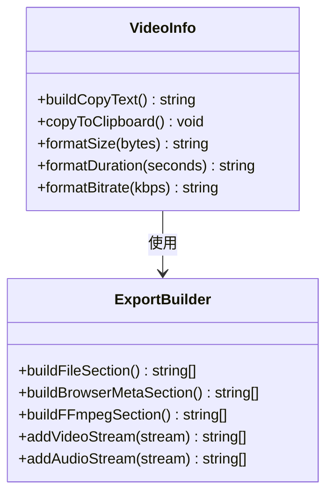

**图表来源**
- [VideoInfo.tsx:84-122](file://src/tools/video/info/VideoInfo.tsx#L84-L122)

**章节来源**
- [VideoInfo.tsx:23-308](file://src/tools/video/info/VideoInfo.tsx#L23-L308)

### 元数据解析器 (logic.ts)

元数据解析器是工具的技术核心，负责从FFmpeg输出中提取和结构化视频信息：

#### 解析架构设计

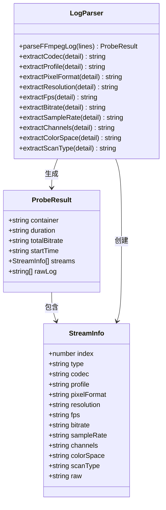

**图表来源**
- [logic.ts:3-26](file://src/tools/video/info/logic.ts#L3-L26)
- [logic.ts:82-140](file://src/tools/video/info/logic.ts#L82-L140)

#### 关键解析算法

解析器实现了多种专门的解析算法来提取不同类型的视频信息：

1. **容器格式识别**：从输入行中提取容器类型信息
2. **时长和起始时间解析**：准确提取视频的总时长和起始偏移
3. **流信息提取**：区分视频流和音频流，提取各自的技术参数
4. **编解码器信息解析**：提取编解码器名称、级别和配置信息

**章节来源**
- [logic.ts:82-224](file://src/tools/video/info/logic.ts#L82-L224)

### 视频上传器 (VideoUploader)

VideoUploader组件提供了完整的视频文件处理和元数据检测能力：

#### 元数据检测机制

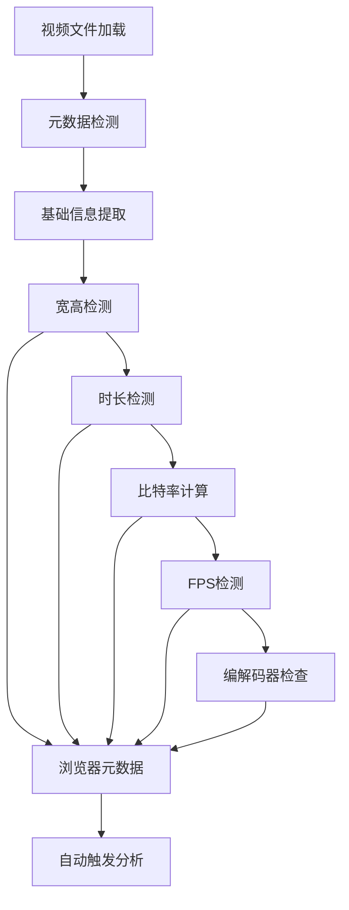

**图表来源**
- [VideoUploader.tsx:95-113](file://src/components/shared/VideoUploader.tsx#L95-L113)
- [VideoUploader.tsx:202-240](file://src/components/shared/VideoUploader.tsx#L202-L240)

#### 编解码器兼容性检测

组件集成了先进的编解码器兼容性检测功能：

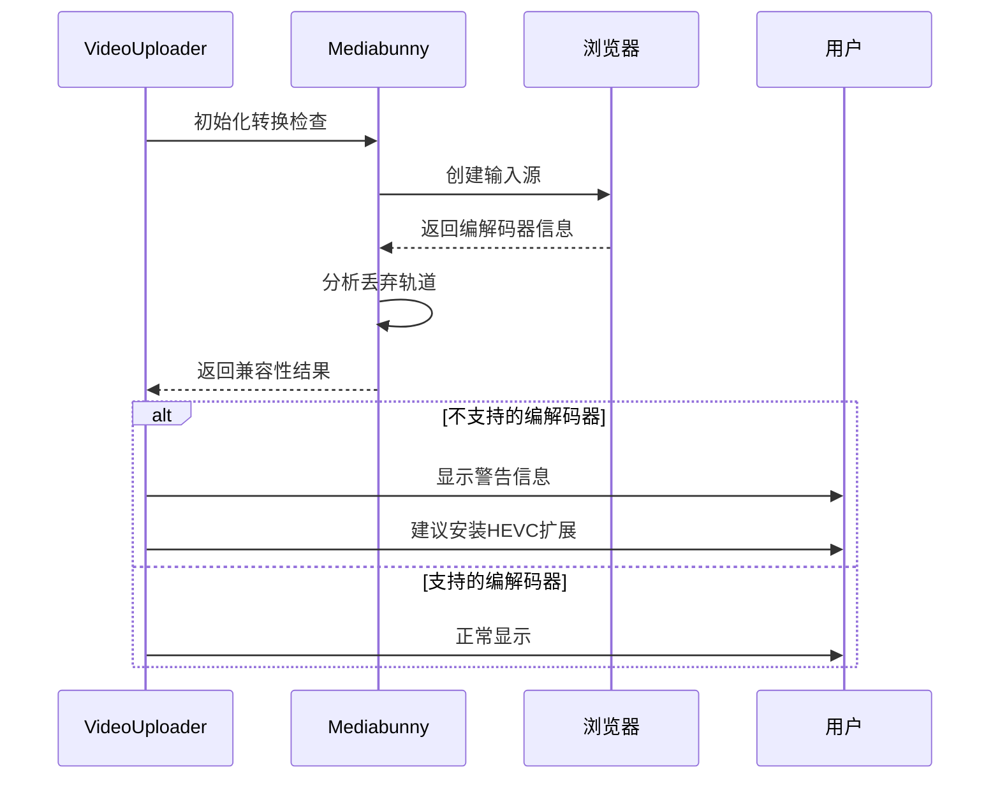

**图表来源**
- [VideoUploader.tsx:119-200](file://src/components/shared/VideoUploader.tsx#L119-L200)

**章节来源**
- [VideoUploader.tsx:66-382](file://src/components/shared/VideoUploader.tsx#L66-L382)

## 依赖关系分析

### 技术栈依赖

视频信息提取工具基于现代Web技术栈构建，主要依赖关系如下：

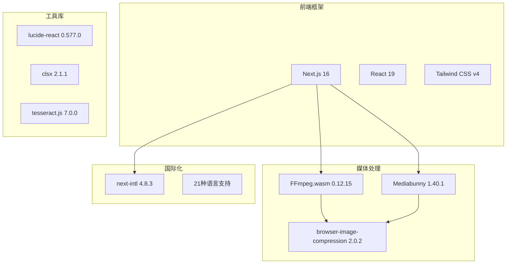

**图表来源**
- [package.json:11-32](file://package.json#L11-L32)
- [README.md:26-33](file://README.md#L26-L33)

### 工具集成关系

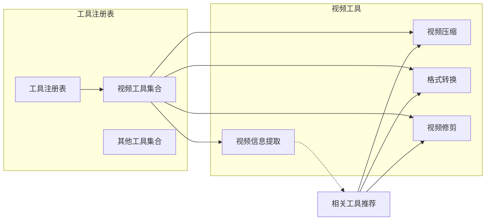

**图表来源**
- [registry/index.ts:66-133](file://src/lib/registry/index.ts#L66-L133)
- [index.ts:17](file://src/tools/video/info/index.ts#L17)

**章节来源**
- [package.json:11-32](file://package.json#L11-L32)
- [registry/index.ts:1-164](file://src/lib/registry/index.ts#L1-164)

## 性能考虑

### 内存优化策略

视频信息提取工具采用了多项内存优化技术来确保在浏览器环境中的高效运行：

1. **WORKERFS挂载**：使用WORKERFS直接从File对象读取，避免额外的内存拷贝
2. **Promise队列**：序列化FFmpeg操作，防止并发冲突和内存竞争
3. **及时清理**：分析完成后立即释放临时资源和缓存
4. **渐进式加载**：按需加载和处理视频数据，避免一次性占用大量内存

### 并发控制机制

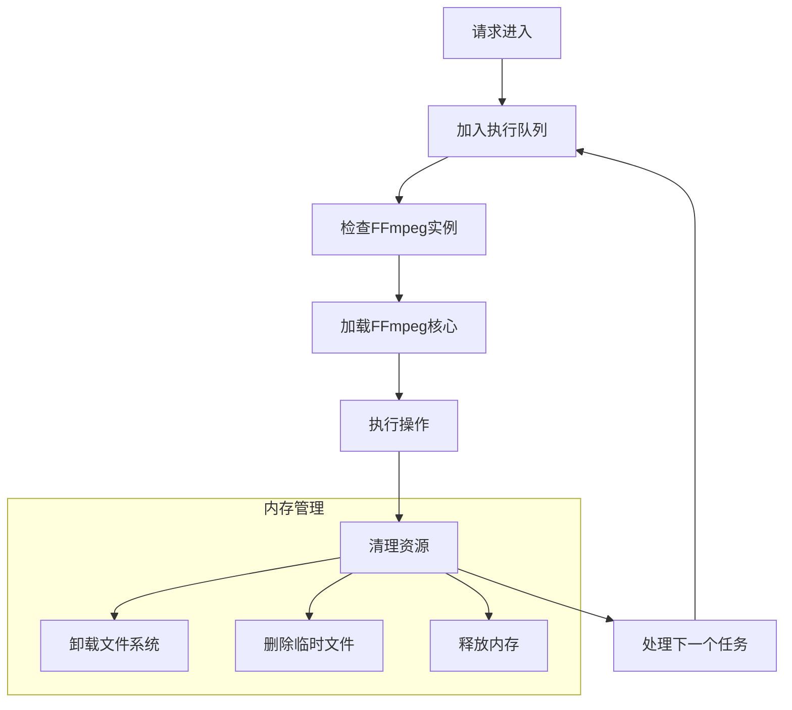

**图表来源**
- [ffmpeg.ts:75-82](file://src/lib/ffmpeg.ts#L75-L82)
- [ffmpeg.ts:105-143](file://src/lib/ffmpeg.ts#L105-L143)

### 性能监控

工具内置了性能监控机制，可以实时跟踪分析过程中的资源使用情况：

- **进度回调**：提供详细的处理进度反馈
- **内存使用监控**：跟踪峰值内存使用情况
- **执行时间统计**：记录各阶段的处理耗时
- **错误重试机制**：在网络不稳定时自动重试

## 故障排除指南

### 常见问题及解决方案

#### 浏览器兼容性问题

**问题描述**：某些浏览器不支持SharedArrayBuffer导致工具无法使用

**解决方案**：
1. 确保使用支持SharedArrayBuffer的现代浏览器
2. 在HTTPS环境下使用工具以获得完整的功能支持
3. 更新浏览器到最新版本

**章节来源**
- [VideoInfo.tsx:76-82](file://src/tools/video/info/VideoInfo.tsx#L76-L82)

#### 编解码器不支持

**问题描述**：某些视频编解码器在当前浏览器中不受支持

**解决方案**：
1. 安装Windows HEVC Video Extensions（适用于Chrome/Edge）
2. 使用其他支持的编解码器格式
3. 通过格式转换工具先转换视频格式

**章节来源**
- [VideoUploader.tsx:292-304](file://src/components/shared/VideoUploader.tsx#L292-L304)
- [media-pipeline.ts:98-105](file://src/lib/media-pipeline.ts#L98-L105)

#### 内存不足问题

**问题描述**：处理大型视频文件时出现内存不足错误

**解决方案**：
1. 关闭不必要的浏览器标签页释放内存
2. 使用较小分辨率的视频文件
3. 分批处理多个小文件而非单个大文件
4. 重启浏览器重新初始化内存环境

**章节来源**
- [ffmpeg.ts:105-143](file://src/lib/ffmpeg.ts#L105-L143)

### 调试和诊断

#### 日志分析

工具提供了详细的日志输出用于问题诊断：

1. **原始FFmpeg日志**：显示完整的FFmpeg输出信息
2. **解析器日志**：记录元数据解析过程
3. **错误堆栈跟踪**：提供详细的错误信息和调用链

#### 性能分析

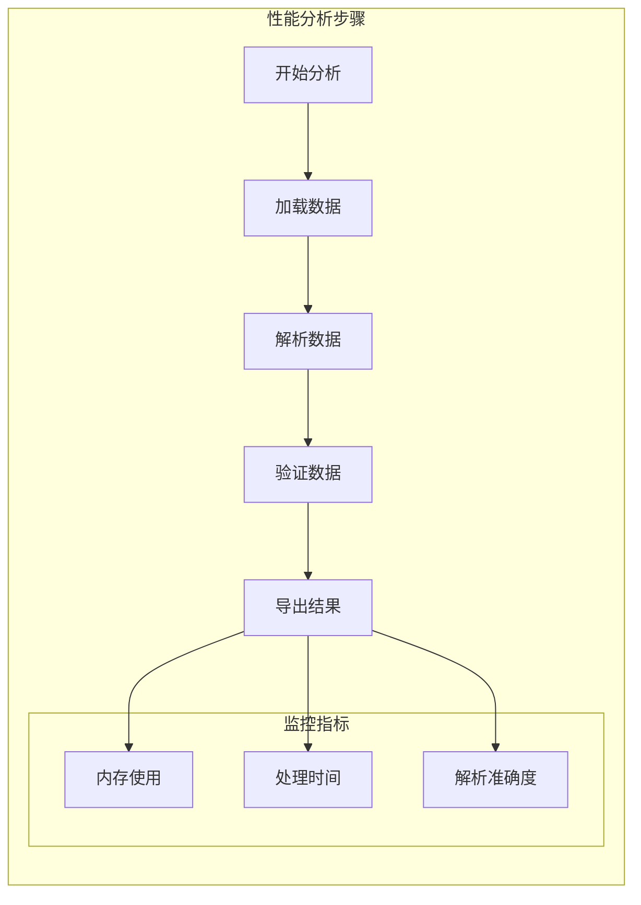

**图表来源**
- [VideoInfo.tsx:248-256](file://src/tools/video/info/VideoInfo.tsx#L248-L256)

**章节来源**
- [VideoInfo.tsx:248-269](file://src/tools/video/info/VideoInfo.tsx#L248-L269)

## 结论

视频信息提取工具是一个功能强大、技术先进的浏览器端视频元数据分析解决方案。通过结合浏览器原生能力和FFmpeg.wasm技术，该工具实现了以下优势：

### 技术优势

1. **隐私保护**：所有处理都在本地浏览器中完成，无数据上传风险
2. **准确性高**：基于FFmpeg的深度分析确保技术参数的精确性
3. **兼容性强**：支持60+种视频格式，覆盖主流应用场景
4. **用户体验佳**：直观的界面设计和流畅的操作体验

### 功能完整性

工具提供了完整的视频元数据分析功能，包括：
- 技术规格提取（编解码器、分辨率、帧率、比特率）
- 格式信息分析（容器格式、色彩空间、扫描类型）
- 流信息详情（视频流、音频流、字幕流）
- 实时缩略图预览
- 一键导出功能

### 发展前景

随着Web技术的不断发展，该工具将继续演进以满足用户需求：
- 支持更多视频格式和编解码器
- 优化性能和内存使用效率
- 增强批量处理和自动化功能
- 提供更丰富的数据分析和比较功能

## 附录

### 支持的元数据字段列表

#### 基础文件信息
- 文件名：原始文件名称
- 文件大小：字节单位的文件尺寸
- 文件类型：MIME类型标识
- 分辨率：视频画面的像素尺寸
- 时长：视频总播放时间
- 估计比特率：基于文件大小和时长的估算值
- 帧率：视频每秒帧数

#### 容器信息
- 容器格式：封装视频数据的容器类型
- 总比特率：视频和音频的综合比特率
- 起始时间：视频在容器中的起始偏移

#### 视频流信息
- 编解码器：视频编码标准（如H.264、VP9等）
- 配置文件：编解码器的配置文件或级别
- 像素格式：视频像素的颜色表示方式
- 色彩空间：视频的色彩标准（如BT.709、BT.2020等）
- 扫描类型：视频的扫描方式（逐行或隔行）
- 帧率：实际视频帧率
- 比特率：视频流的编码比特率

#### 音频流信息
- 编解码器：音频编码标准（如AAC、Opus等）
- 采样率：音频每秒采样次数
- 声道布局：音频声道配置（如立体声、5.1声道等）
- 比特率：音频流的编码比特率

### 使用指南

#### 基本使用步骤
1. 选择要分析的视频文件
2. 查看基础元数据信息
3. 点击"分析视频"按钮进行深度分析
4. 查看详细的编解码器和流信息
5. 如需导出，点击复制按钮获取文本格式

#### 批量处理建议
- 同时处理多个视频文件时注意内存使用
- 大型文件建议分批处理
- 使用相同格式的视频进行批量比较

#### 格式兼容性说明
- 支持的格式：MP4、WebM、MKV、AVI、MOV等
- 不支持的编解码器会显示警告信息
- 建议使用广泛支持的H.264编码格式