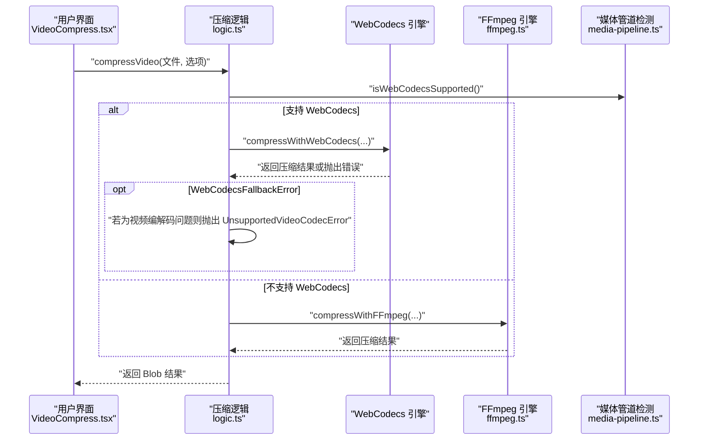
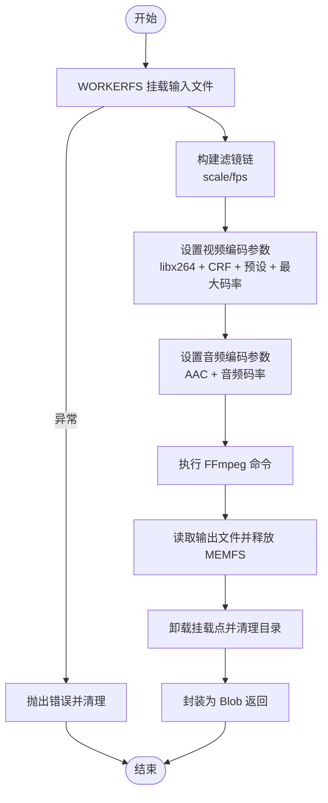
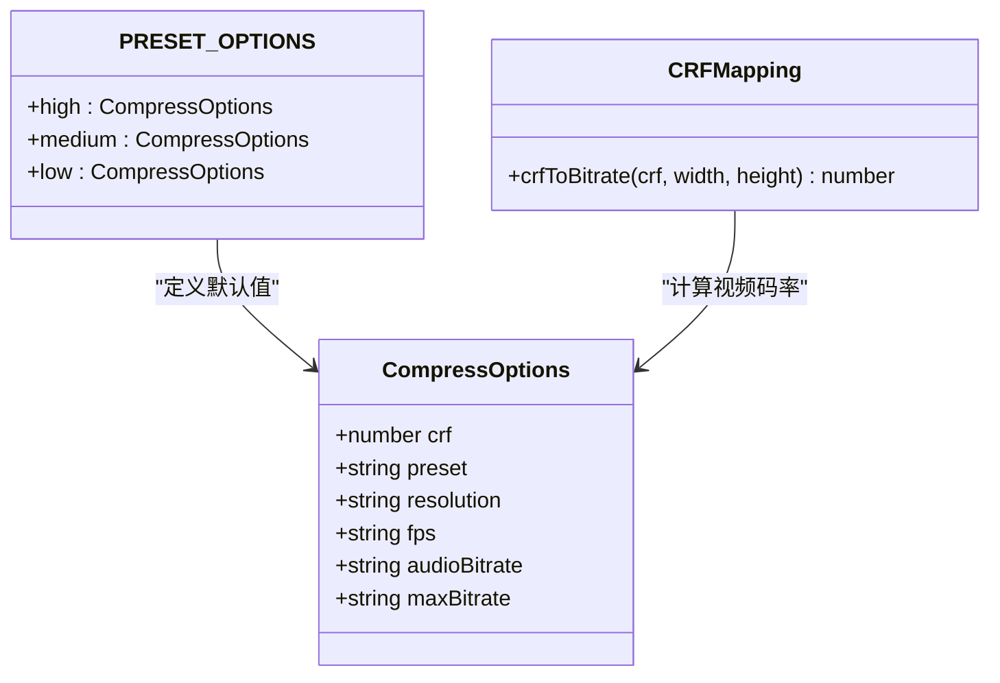
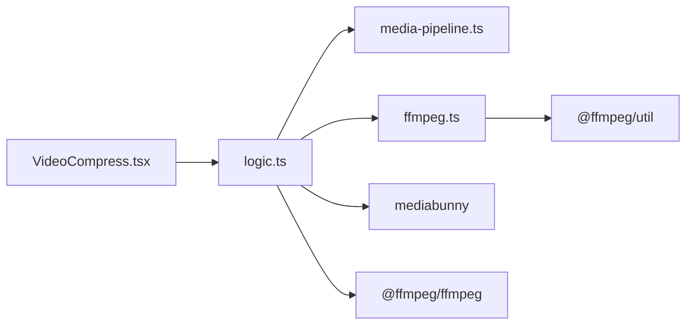

# 视频压缩工具

<cite>
**本文档引用的文件**
- [README.md](file://README.md)
- [ffmpeg.ts](file://src/lib/ffmpeg.ts)
- [media-pipeline.ts](file://src/lib/media-pipeline.ts)
- [VideoCompress.tsx](file://src/tools/video/compress/VideoCompress.tsx)
- [logic.ts](file://src/tools/video/compress/logic.ts)
- [index.ts](file://src/tools/video/compress/index.ts)
</cite>

## 目录
1. [简介](#简介)
2. [项目结构](#项目结构)
3. [核心组件](#核心组件)
4. [架构总览](#架构总览)
5. [详细组件分析](#详细组件分析)
6. [依赖关系分析](#依赖关系分析)
7. [性能考量](#性能考量)
8. [故障排查指南](#故障排查指南)
9. [结论](#结论)
10. [附录](#附录)

## 简介
本项目是一个浏览器端的多媒体工具箱，所有文件处理均在本地完成，不涉及任何服务器上传。视频压缩工具基于两种引擎实现：WebCodecs（硬件加速）与 FFmpeg.wasm。系统会根据浏览器能力自动选择最优引擎，并在必要时进行降级处理。该工具提供简单模式与高级模式两种配置方式，支持 CRF、预设、分辨率、帧率、音频码率与最大码率等关键参数。

## 项目结构
- 工具分类与数量：视频工具包含剪辑、压缩、转 GIF、格式转换、静音等功能。
- 技术栈：Next.js 16、TypeScript、Tailwind CSS、多语言支持、WebCodecs 与 FFmpeg.wasm。
- 媒体处理核心：FFmpeg.wasm（视频/音频）、MediaPipe（图片）、pdf-lib + pdfjs-dist（PDF）。

```mermaid
graph TB
A["应用入口<br/>Next.js App Router"] --> B["工具注册表<br/>src/lib/registry"]
B --> C["视频压缩工具<br/>src/tools/video/compress"]
C --> D["组件层<br/>VideoCompress.tsx"]
C --> E["业务逻辑层<br/>logic.ts"]
E --> F["引擎选择与执行<br/>WebCodecs 或 FFmpeg"]
F --> G["FFmpeg 封装<br/>src/lib/ffmpeg.ts"]
F --> H["媒体管道检测<br/>src/lib/media-pipeline.ts"]
```

**图表来源**
- [README.md:55-78](file://README.md#L55-L78)
- [index.ts:1-49](file://src/tools/video/compress/index.ts#L1-L49)

**章节来源**
- [README.md:16-33](file://README.md#L16-L33)
- [README.md:55-78](file://README.md#L55-L78)

## 核心组件
- WebCodecs 引擎：通过 MediaBunny 提供硬件加速的视频解码/编码，支持进度回调与严格的质量校验。
- FFmpeg.wasm 引擎：通过 @ffmpeg/ffmpeg 实现跨平台的视频处理，采用 WORKERFS 挂载避免内存拷贝，提供串行队列保证单线程执行。
- 压缩逻辑：统一的 compressVideo 函数根据浏览器能力选择引擎；若 WebCodecs 不支持特定视频编解码，则抛出错误以阻止降级到 FFmpeg（避免性能问题）。
- 参数体系：提供简单模式（高质量/中等质量/低质量）与高级模式（CRF、预设、分辨率、帧率、音频码率、最大码率）。

**章节来源**
- [media-pipeline.ts:7-14](file://src/lib/media-pipeline.ts#L7-L14)
- [ffmpeg.ts:10-39](file://src/lib/ffmpeg.ts#L10-L39)
- [logic.ts:30-52](file://src/tools/video/compress/logic.ts#L30-L52)
- [logic.ts:85-110](file://src/tools/video/compress/logic.ts#L85-L110)

## 架构总览
系统在运行时根据浏览器能力选择最佳处理路径，并在 WebCodecs 不可用时进行安全降级。WebCodecs 优先使用硬件加速，FFmpeg 则提供更广泛的兼容性。

**图表来源**
- [logic.ts:85-110](file://src/tools/video/compress/logic.ts#L85-L110)
- [logic.ts:112-201](file://src/tools/video/compress/logic.ts#L112-L201)
- [logic.ts:203-256](file://src/tools/video/compress/logic.ts#L203-L256)
- [media-pipeline.ts:7-14](file://src/lib/media-pipeline.ts#L7-L14)
- [ffmpeg.ts:99-143](file://src/lib/ffmpeg.ts#L99-L143)

## 详细组件分析

### WebCodecs 引擎（MediaBunny）
- 功能特性
  - 使用 BlobSource 读取输入文件，BufferTarget 输出到内存，Mp4OutputFormat 写入 MP4。
  - 自动启用硬件加速（prefer-hardware），提升处理速度。
  - 严格校验转换结果，丢弃任何被拒绝的轨道（如不可解码的视频/音频），确保输出质量。
- 关键流程
  - 解析 CRF 映射为视频码率，结合目标分辨率进行缩放。
  - 应用最大码率限制与音频码率设置。
  - 执行转换并返回 Blob。

**图表来源**
- [logic.ts:112-201](file://src/tools/video/compress/logic.ts#L112-L201)
- [media-pipeline.ts:59-91](file://src/lib/media-pipeline.ts#L59-L91)

**章节来源**
- [logic.ts:112-201](file://src/tools/video/compress/logic.ts#L112-L201)
- [media-pipeline.ts:59-91](file://src/lib/media-pipeline.ts#L59-L91)

### FFmpeg.wasm 引擎
- 功能特性
  - 通过 WORKERFS 挂载文件，避免两次内存拷贝（fetchFile + writeFile）。
  - 串行队列保证单线程执行，防止挂载点冲突。
  - 支持进度回调与错误处理。
- 关键流程
  - 根据分辨率与帧率构建滤镜链（scale/fps）。
  - 设置视频编码器（libx264）、CRF、预设与最大码率。
  - 设置音频编码器（AAC）与音频码率。
  - 执行命令并读取输出文件。

**图表来源**
- [ffmpeg.ts:99-143](file://src/lib/ffmpeg.ts#L99-L143)
- [logic.ts:203-256](file://src/tools/video/compress/logic.ts#L203-L256)

**章节来源**
- [ffmpeg.ts:75-82](file://src/lib/ffmpeg.ts#L75-L82)
- [ffmpeg.ts:99-143](file://src/lib/ffmpeg.ts#L99-L143)
- [logic.ts:203-256](file://src/tools/video/compress/logic.ts#L203-L256)

### 压缩参数与质量控制
- 参数体系
  - 简单模式：高质量/中等质量/低质量，内置默认选项。
  - 高级模式：CRF、预设、分辨率、帧率、音频码率、最大码率。
- 质量控制机制
  - CRF 映射：根据 CRF 值与分辨率计算目标视频码率，再应用最大码率上限。
  - 分辨率与帧率：仅在低于源规格时才进行下采样或降帧。
  - 音频码率：独立设置 AAC 码率。
- 质量损失评估
  - 输出元数据包含分辨率、时长、估算码率与 FPS，便于对比。
  - UI 展示压缩节省百分比，辅助判断质量与体积平衡。

**图表来源**
- [logic.ts:21-28](file://src/tools/video/compress/logic.ts#L21-L28)
- [logic.ts:30-52](file://src/tools/video/compress/logic.ts#L30-L52)
- [logic.ts:68-83](file://src/tools/video/compress/logic.ts#L68-L83)

**章节来源**
- [VideoCompress.tsx:31-44](file://src/tools/video/compress/VideoCompress.tsx#L31-L44)
- [logic.ts:30-52](file://src/tools/video/compress/logic.ts#L30-L52)
- [logic.ts:68-83](file://src/tools/video/compress/logic.ts#L68-L83)

### 引擎选择逻辑与性能对比
- 选择逻辑
  - 若浏览器支持 WebCodecs，则优先使用 WebCodecs 引擎。
  - 若 WebCodecs 抛出 WebCodecsFallbackError，且原因为视频编解码不可解码，则直接抛出“不支持的视频编解码器”错误，不再降级至 FFmpeg（避免性能问题）。
  - 否则回退到 FFmpeg.wasm。
- 性能对比
  - WebCodecs：硬件加速、进度回调、严格校验，适合广泛编解码器。
  - FFmpeg：兼容性广、参数丰富、可细粒度控制，但需注意内存与并发限制。

**图表来源**
- [logic.ts:85-110](file://src/tools/video/compress/logic.ts#L85-L110)
- [media-pipeline.ts:32-53](file://src/lib/media-pipeline.ts#L32-L53)

**章节来源**
- [logic.ts:85-110](file://src/tools/video/compress/logic.ts#L85-L110)
- [media-pipeline.ts:32-53](file://src/lib/media-pipeline.ts#L32-L53)

## 依赖关系分析
- 组件耦合
  - VideoCompress.tsx 作为 UI 层，依赖 logic.ts 进行业务处理。
  - logic.ts 同时依赖 media-pipeline.ts（能力检测与错误类型）与 ffmpeg.ts（FFmpeg 执行）。
- 外部依赖
  - mediabunny：WebCodecs 编解码管线。
  - @ffmpeg/ffmpeg：FFmpeg.wasm 封装与挂载工具。
  - @ffmpeg/util：核心与 WASM 文件的 BlobURL 加载。

**图表来源**
- [VideoCompress.tsx:11-29](file://src/tools/video/compress/VideoCompress.tsx#L11-L29)
- [logic.ts:1-2](file://src/tools/video/compress/logic.ts#L1-L2)
- [ffmpeg.ts:1-1](file://src/lib/ffmpeg.ts#L1-L1)

**章节来源**
- [VideoCompress.tsx:11-29](file://src/tools/video/compress/VideoCompress.tsx#L11-L29)
- [logic.ts:1-2](file://src/tools/video/compress/logic.ts#L1-L2)
- [ffmpeg.ts:1-1](file://src/lib/ffmpeg.ts#L1-L1)

## 性能考量
- WebCodecs 优势
  - 硬件加速显著降低 CPU 占用，适合现代浏览器与常见编解码器。
  - 进度回调可提升用户体验。
- FFmpeg 优势
  - 更广泛的编解码器支持与更丰富的参数控制。
  - 通过 WORKERFS 挂载减少内存拷贝，串行队列避免并发冲突。
- 参数优化建议
  - CRF：高质量场景建议 23-28，兼顾体积与画质；低质量可选 35+。
  - 预设：快速压缩可选 fast/medium；对时间敏感场景可选 ultrafast/superfast。
  - 分辨率：仅在低于源分辨率时下采样，避免无谓质量损失。
  - 帧率：仅在低于源帧率时降帧，保持流畅度。
  - 最大码率：用于控制峰值带宽，配合缓冲区大小参数使用。
  - 音频码率：128k-192k 适用于大多数场景。

[本节为通用性能指导，不直接分析具体文件]

## 故障排查指南
- 浏览器不支持任何引擎
  - 现象：显示“不支持”的提示信息。
  - 排查：确认浏览器版本与权限。
- WebCodecs 不支持视频编解码器
  - 现象：抛出“不支持的视频编解码器”错误。
  - 排查：更换为 FFmpeg（若可用）或调整输入格式。
- WebCodecs 其他编解码问题
  - 现象：抛出 WebCodecsFallbackError，系统记录警告并尝试降级。
  - 排查：检查输入视频的编解码器与容器格式。
- FFmpeg 加载失败
  - 现象：初始化失败或执行异常。
  - 排查：检查 CDN 资源加载状态与网络环境。
- 进度异常
  - 现象：进度条停滞或不更新。
  - 排查：确认回调绑定与浏览器支持情况。

**章节来源**
- [VideoCompress.tsx:68-74](file://src/tools/video/compress/VideoCompress.tsx#L68-L74)
- [VideoCompress.tsx:94-104](file://src/tools/video/compress/VideoCompress.tsx#L94-L104)
- [media-pipeline.ts:32-53](file://src/lib/media-pipeline.ts#L32-L53)
- [ffmpeg.ts:14-39](file://src/lib/ffmpeg.ts#L14-L39)

## 结论
该视频压缩工具通过 WebCodecs 与 FFmpeg.wasm 的双引擎架构，在保证兼容性的前提下最大化利用硬件加速能力。系统提供了从简单到高级的参数体系，辅以严格的编解码器校验与进度反馈，帮助用户在不同场景下实现体积与画质的最佳平衡。对于不支持的视频编解码器，系统明确拒绝降级以避免性能问题，确保整体体验稳定可靠。

[本节为总结性内容，不直接分析具体文件]

## 附录

### 压缩参数配置指南
- 简单模式
  - 高质量：较低 CRF、较高音频码率、保持原分辨率与帧率。
  - 中等质量：适中 CRF、中等音频码率、保持原分辨率与帧率。
  - 低质量：较高 CRF、较低音频码率、按需降低分辨率。
- 高级模式
  - CRF：数值越小质量越高、体积越大；建议 23-35 区间。
  - 预设：越快的预设压缩时间越短、质量略低。
  - 分辨率：仅在低于源分辨率时下采样。
  - 帧率：仅在低于源帧率时降帧。
  - 音频码率：128k-192k 通常满足大多数需求。
  - 最大码率：用于限制峰值码率，配合缓冲区大小参数使用。

**章节来源**
- [logic.ts:30-52](file://src/tools/video/compress/logic.ts#L30-L52)
- [logic.ts:21-28](file://src/tools/video/compress/logic.ts#L21-L28)

### 实际使用示例
- 选择文件并进入压缩页面，系统自动读取源视频元数据。
- 在简单模式下选择“中等质量”，或在高级模式下自定义 CRF、分辨率、帧率与音频码率。
- 点击“压缩”按钮，等待进度条完成，下载压缩后的视频并与源视频对比。

**章节来源**
- [VideoCompress.tsx:76-105](file://src/tools/video/compress/VideoCompress.tsx#L76-L105)
- [VideoCompress.tsx:420-531](file://src/tools/video/compress/VideoCompress.tsx#L420-L531)