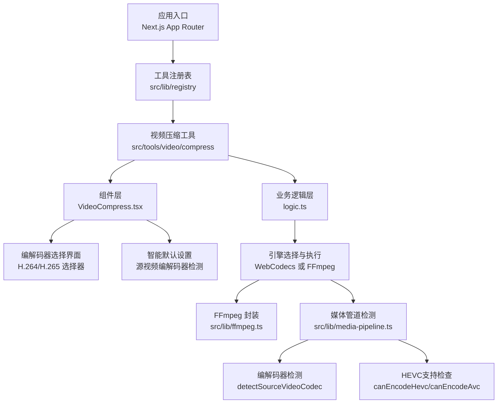
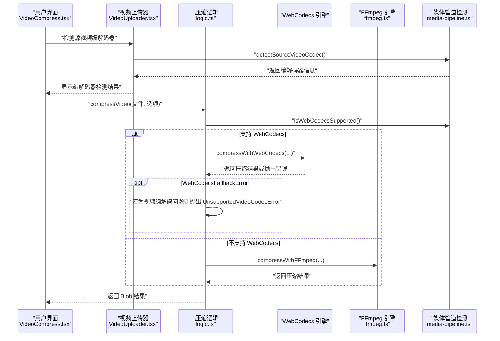
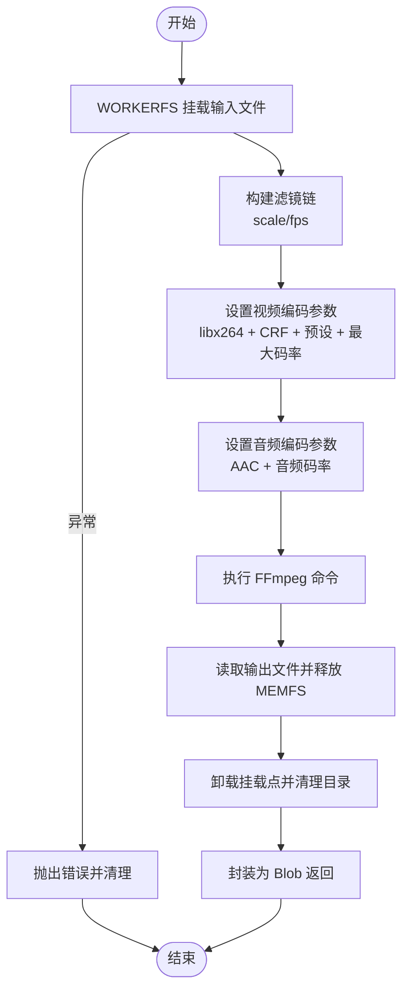
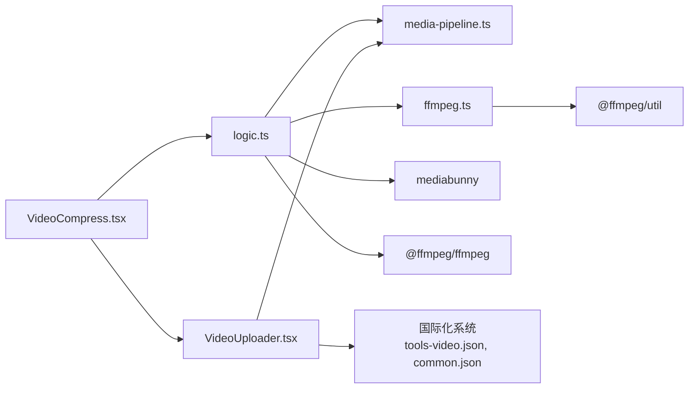

# 视频压缩工具

<cite>
**本文档引用的文件**
- [README.md](file://README.md)
- [ffmpeg.ts](file://src/lib/ffmpeg.ts)
- [media-pipeline.ts](file://src/lib/media-pipeline.ts)
- [VideoCompress.tsx](file://src/tools/video/compress/VideoCompress.tsx)
- [VideoUploader.tsx](file://src/components/shared/VideoUploader.tsx)
- [logic.ts](file://src/tools/video/compress/logic.ts)
- [index.ts](file://src/tools/video/compress/index.ts)
- [tools-video.json](file://messages/en/tools-video.json)
- [common.json](file://messages/en/common.json)
</cite>

## 更新摘要
**变更内容**
- 新增H.264/H.265编解码器选择界面和智能默认设置
- 添加编解码器检测和用户反馈机制
- 增强编解码器兼容性检查和错误处理
- 更新国际化文本支持编解码器相关功能

## 目录
1. [简介](#简介)
2. [项目结构](#项目结构)
3. [核心组件](#核心组件)
4. [架构总览](#架构总览)
5. [详细组件分析](#详细组件分析)
6. [编解码器选择与智能默认设置](#编解码器选择与智能默认设置)
7. [用户反馈与错误处理机制](#用户反馈与错误处理机制)
8. [依赖关系分析](#依赖关系分析)
9. [性能考量](#性能考量)
10. [故障排查指南](#故障排查指南)
11. [结论](#结论)
12. [附录](#附录)

## 简介
本项目是一个浏览器端的多媒体工具箱，所有文件处理均在本地完成，不涉及任何服务器上传。视频压缩工具基于两种引擎实现：WebCodecs（硬件加速）与 FFmpeg.wasm。系统会根据浏览器能力自动选择最优引擎，并在必要时进行降级处理。该工具提供简单模式与高级模式两种配置方式，支持 CRF、预设、分辨率、帧率、音频码率与最大码率等关键参数。**新增功能**包括H.264/H.265编解码器选择界面、智能默认编解码器设置和完整的用户反馈机制。

## 项目结构
- 工具分类与数量：视频工具包含剪辑、压缩、转 GIF、格式转换、静音等功能。
- 技术栈：Next.js 16、TypeScript、Tailwind CSS、多语言支持、WebCodecs 与 FFmpeg.wasm。
- 媒体处理核心：FFmpeg.wasm（视频/音频）、MediaPipe（图片）、pdf-lib + pdfjs-dist（PDF）。
- **新增组件**：编解码器检测、智能默认设置、用户反馈界面。

**图表来源**
- [README.md:55-78](file://README.md#L55-L78)
- [index.ts:1-49](file://src/tools/video/compress/index.ts#L1-L49)
- [VideoCompress.tsx:60-91](file://src/tools/video/compress/VideoCompress.tsx#L60-L91)
- [media-pipeline.ts:143-174](file://src/lib/media-pipeline.ts#L143-L174)

## 核心组件
- **WebCodecs 引擎**：通过 MediaBunny 提供硬件加速的视频解码/编码，支持进度回调与严格的质量校验。
- **FFmpeg.wasm 引擎**：通过 @ffmpeg/ffmpeg 实现跨平台的视频处理，采用 WORKERFS 挂载避免内存拷贝，提供串行队列保证单线程执行。
- **压缩逻辑**：统一的 compressVideo 函数根据浏览器能力选择引擎；若 WebCodecs 不支持特定视频编解码，则抛出错误以阻止降级到 FFmpeg（避免性能问题）。
- **参数体系**：提供简单模式（高质量/中等质量/低质量）与高级模式（CRF、预设、分辨率、帧率、音频码率、最大码率）。
- **编解码器选择**：新增H.264/H.265编解码器选择界面，支持智能默认设置和用户反馈。
- **智能检测**：自动检测源视频编解码器并提供智能默认选择。

**章节来源**
- [media-pipeline.ts:7-14](file://src/lib/media-pipeline.ts#L7-L14)
- [ffmpeg.ts:10-39](file://src/lib/ffmpeg.ts#L10-L39)
- [logic.ts:30-52](file://src/tools/video/compress/logic.ts#L30-L52)
- [logic.ts:85-110](file://src/tools/video/compress/logic.ts#L85-L110)
- [VideoCompress.tsx:60-91](file://src/tools/video/compress/VideoCompress.tsx#L60-L91)

## 架构总览
系统在运行时根据浏览器能力选择最佳处理路径，并在 WebCodecs 不可用时进行安全降级。WebCodecs 优先使用硬件加速，FFmpeg 则提供更广泛的兼容性。**新增编解码器选择机制**确保用户能够根据需求选择最适合的输出格式。

**图表来源**
- [logic.ts:85-110](file://src/tools/video/compress/logic.ts#L85-L110)
- [logic.ts:112-201](file://src/tools/video/compress/logic.ts#L112-L201)
- [logic.ts:203-256](file://src/tools/video/compress/logic.ts#L203-L256)
- [media-pipeline.ts:7-14](file://src/lib/media-pipeline.ts#L7-L14)
- [ffmpeg.ts:99-143](file://src/lib/ffmpeg.ts#L99-L143)
- [VideoUploader.tsx:117-124](file://src/components/shared/VideoUploader.tsx#L117-L124)

## 详细组件分析

### WebCodecs 引擎（MediaBunny）
- **功能特性**
  - 使用 BlobSource 读取输入文件，BufferTarget 输出到内存，Mp4OutputFormat 写入 MP4。
  - 自动启用硬件加速（prefer-hardware），提升处理速度。
  - 严格校验转换结果，丢弃任何被拒绝的轨道（如不可解码的视频/音频），确保输出质量。
- **关键流程**
  - 解析 CRF 映射为视频码率，结合目标分辨率进行缩放。
  - 应用最大码率限制与音频码率设置。
  - **新增编解码器选择**：根据用户选择的输出编解码器（H.264/H.265）进行编码。
  - 执行转换并返回 Blob。

**图表来源**
- [logic.ts:112-201](file://src/tools/video/compress/logic.ts#L112-L201)
- [media-pipeline.ts:59-91](file://src/lib/media-pipeline.ts#L59-L91)

**章节来源**
- [logic.ts:112-201](file://src/tools/video/compress/logic.ts#L112-L201)
- [media-pipeline.ts:59-91](file://src/lib/media-pipeline.ts#L59-L91)

### FFmpeg.wasm 引擎
- **功能特性**
  - 通过 WORKERFS 挂载文件，避免两次内存拷贝（fetchFile + writeFile）。
  - 串行队列保证单线程执行，防止挂载点冲突。
  - 支持进度回调与错误处理。
- **关键流程**
  - 根据分辨率与帧率构建滤镜链（scale/fps）。
  - **固定H.264编码**：FFmpeg引擎始终使用libx264编码器，输出H.264视频。
  - 设置视频编码器（libx264）、CRF、预设与最大码率。
  - 设置音频编码器（AAC）与音频码率。
  - 执行命令并读取输出文件。

**图表来源**
- [ffmpeg.ts:99-143](file://src/lib/ffmpeg.ts#L99-L143)
- [logic.ts:203-256](file://src/tools/video/compress/logic.ts#L203-L256)

**章节来源**
- [ffmpeg.ts:75-82](file://src/lib/ffmpeg.ts#L75-L82)
- [ffmpeg.ts:99-143](file://src/lib/ffmpeg.ts#L99-L143)
- [logic.ts:203-256](file://src/tools/video/compress/logic.ts#L203-L256)

### 压缩参数与质量控制
- **参数体系**
  - 简单模式：高质量/中等质量/低质量，内置默认选项。
  - 高级模式：CRF、预设、分辨率、帧率、音频码率、最大码率。
  - **新增编解码器参数**：支持H.264（AVC）和H.265（HEVC）输出选择。
- **质量控制机制**
  - CRF 映射：根据 CRF 值与分辨率计算目标视频码率，再应用最大码率上限。
  - 分辨率与帧率：仅在低于源规格时才进行下采样或降帧。
  - 音频码率：独立设置 AAC 码率。
  - **编解码器质量**：H.265通常比H.264压缩率更高，但兼容性较差。
- **质量损失评估**
  - 输出元数据包含分辨率、时长、估算码率与 FPS，便于对比。
  - UI 展示压缩节省百分比，辅助判断质量与体积平衡。

**图表来源**
- [logic.ts:21-28](file://src/tools/video/compress/logic.ts#L21-L28)
- [logic.ts:30-52](file://src/tools/video/compress/logic.ts#L30-L52)
- [logic.ts:68-83](file://src/tools/video/compress/logic.ts#L68-L83)
- [logic.ts:28-30](file://src/tools/video/compress/logic.ts#L28-L30)

**章节来源**
- [VideoCompress.tsx:31-44](file://src/tools/video/compress/VideoCompress.tsx#L31-L44)
- [logic.ts:30-52](file://src/tools/video/compress/logic.ts#L30-L52)
- [logic.ts:68-83](file://src/tools/video/compress/logic.ts#L68-L83)

### 引擎选择逻辑与性能对比
- **选择逻辑**
  - 若浏览器支持 WebCodecs，则优先使用 WebCodecs 引擎。
  - 若 WebCodecs 抛出 WebCodecsFallbackError，且原因为视频编解码不可解码，则直接抛出"不支持的视频编解码器"错误，不再降级至 FFmpeg（避免性能问题）。
  - 否则回退到 FFmpeg.wasm。
- **性能对比**
  - WebCodecs：硬件加速、进度回调、严格校验，适合广泛编解码器。
  - FFmpeg：兼容性广、参数丰富、可细粒度控制，但需注意内存与并发限制。
  - **编解码器性能**：H.265通常提供更好的压缩效率，但需要更强的硬件支持和更长的编码时间。

**图表来源**
- [logic.ts:85-110](file://src/tools/video/compress/logic.ts#L85-L110)
- [media-pipeline.ts:32-53](file://src/lib/media-pipeline.ts#L32-L53)

**章节来源**
- [logic.ts:85-110](file://src/tools/video/compress/logic.ts#L85-L110)
- [media-pipeline.ts:32-53](file://src/lib/media-pipeline.ts#L32-L53)

## 编解码器选择与智能默认设置

### 编解码器检测与智能默认设置
系统实现了完整的编解码器检测和智能默认设置机制：

- **源视频编解码器检测**
  - 自动检测源视频使用的编解码器（H.264/AVC 或 H.265/HEVC）
  - 基于 mediabunny 库进行精确的编解码器识别
  - 支持多种容器格式的视频文件

- **智能默认编解码器设置**
  - 默认输出编解码器与源视频保持一致
  - 如果源视频是H.265且浏览器支持HEVC编码，则默认使用H.265
  - 否则默认使用H.264（兼容性最佳）

- **用户编解码器选择界面**
  - 提供H.264（AVC）和H.265（HEVC）两种选择
  - 实时检测浏览器HEVC支持状态
  - 提供清晰的编解码器说明和兼容性提示

**图表来源**
- [VideoUploader.tsx:117-124](file://src/components/shared/VideoUploader.tsx#L117-L124)
- [VideoCompress.tsx:82-91](file://src/tools/video/compress/VideoCompress.tsx#L82-L91)
- [media-pipeline.ts:149-174](file://src/lib/media-pipeline.ts#L149-L174)

**章节来源**
- [VideoUploader.tsx:117-124](file://src/components/shared/VideoUploader.tsx#L117-L124)
- [VideoCompress.tsx:82-91](file://src/tools/video/compress/VideoCompress.tsx#L82-L91)
- [media-pipeline.ts:149-174](file://src/lib/media-pipeline.ts#L149-L174)

### 编解码器支持检测机制
系统实现了多层次的编解码器支持检测：

- **浏览器WebCodecs支持检测**
  - 检测VideoEncoder/VideoDecoder/AudioEncoder/AudioDecoder API支持
  - 确保基础的WebCodecs功能可用

- **HEVC编码能力检测**
  - 使用canEncodeHevc函数测试H.265编码支持
  - 通过mediabunny库的canEncodeVideo API进行实际编码测试
  - 支持指定分辨率和码率的编码能力验证

- **H.264编码能力检测**
  - 使用canEncodeAvc函数测试H.264编码支持
  - 与HEVC检测机制类似，确保H.264编码可用

**章节来源**
- [media-pipeline.ts:98-141](file://src/lib/media-pipeline.ts#L98-L141)

## 用户反馈与错误处理机制

### 编解码器兼容性反馈
系统提供了完整的编解码器兼容性反馈机制：

- **编解码器警告系统**
  - 当检测到不支持的视频编解码器时显示警告横幅
  - 提供详细的错误信息和解决方案建议
  - 支持HEVC扩展安装提示（Windows用户）

- **实时编解码器状态显示**
  - 显示当前检测到的源视频编解码器类型
  - 显示输出编解码器选择状态
  - 提供编解码器支持状态指示

- **用户友好错误提示**
  - 简洁明了的错误信息，避免技术术语
  - 提供可操作的解决方案建议
  - 支持多语言错误信息显示

**图表来源**
- [VideoUploader.tsx:303-315](file://src/components/shared/VideoUploader.tsx#L303-L315)
- [VideoUploader.tsx:131-212](file://src/components/shared/VideoUploader.tsx#L131-L212)
- [VideoCompress.tsx:472-482](file://src/tools/video/compress/VideoCompress.tsx#L472-L482)

**章节来源**
- [VideoUploader.tsx:303-315](file://src/components/shared/VideoUploader.tsx#L303-L315)
- [VideoUploader.tsx:131-212](file://src/components/shared/VideoUploader.tsx#L131-L212)
- [VideoCompress.tsx:472-482](file://src/tools/video/compress/VideoCompress.tsx#L472-L482)

### 错误处理与降级机制
系统实现了智能的错误处理和降级机制：

- **编解码器错误处理**
  - 检测到不支持的视频编解码器时抛出UnsupportedVideoCodecError
  - 阻止降级到FFmpeg以避免性能问题
  - 提供清晰的错误信息和解决方案

- **编解码器警告处理**
  - 对于音频或其他非视频编解码器问题，仍可降级到FFmpeg
  - 记录警告信息但不影响处理流程
  - 提供用户友好的错误提示

- **HEVC支持检测**
  - 实时检测浏览器HEVC编码支持状态
  - 根据支持状态动态启用/禁用H.265选择
  - 提供HEVC扩展安装提示

**章节来源**
- [logic.ts:98-110](file://src/tools/video/compress/logic.ts#L98-L110)
- [media-pipeline.ts:28-53](file://src/lib/media-pipeline.ts#L28-L53)
- [VideoUploader.tsx:98-212](file://src/components/shared/VideoUploader.tsx#L98-L212)

## 依赖关系分析
- **组件耦合**
  - VideoCompress.tsx 作为 UI 层，依赖 logic.ts 进行业务处理。
  - **新增** VideoUploader.tsx 专门负责编解码器检测和用户反馈。
  - logic.ts 同时依赖 media-pipeline.ts（能力检测与错误类型）与 ffmpeg.ts（FFmpeg 执行）。
- **外部依赖**
  - mediabunny：WebCodecs 编解码管线。
  - @ffmpeg/ffmpeg：FFmpeg.wasm 封装与挂载工具。
  - @ffmpeg/util：核心与 WASM 文件的 BlobURL 加载。
  - **新增** 国际化系统：支持多语言的编解码器相关文本。

**图表来源**
- [VideoCompress.tsx:11-29](file://src/tools/video/compress/VideoCompress.tsx#L11-L29)
- [logic.ts:1-2](file://src/tools/video/compress/logic.ts#L1-L2)
- [ffmpeg.ts:1-1](file://src/lib/ffmpeg.ts#L1-L1)
- [VideoUploader.tsx:8-9](file://src/components/shared/VideoUploader.tsx#L8-L9)

**章节来源**
- [VideoCompress.tsx:11-29](file://src/tools/video/compress/VideoCompress.tsx#L11-L29)
- [logic.ts:1-2](file://src/tools/video/compress/logic.ts#L1-L2)
- [ffmpeg.ts:1-1](file://src/lib/ffmpeg.ts#L1-L1)

## 性能考量
- **WebCodecs 优势**
  - 硬件加速显著降低 CPU 占用，适合现代浏览器与常见编解码器。
  - 进度回调可提升用户体验。
  - **新增** 编解码器选择优化：H.265提供更好的压缩效率，但需要更强的硬件支持。
- **FFmpeg 优势**
  - 更广泛的编解码器支持与更丰富的参数控制。
  - 通过 WORKERFS 挂载减少内存拷贝，串行队列避免并发冲突。
  - **固定H.264输出**：确保最大兼容性，适合大多数应用场景。
- **参数优化建议**
  - CRF：高质量场景建议 23-28，兼顾体积与画质；低质量可选 35+。
  - 预设：快速压缩可选 fast/medium；对时间敏感场景可选 ultrafast/superfast。
  - 分辨率：仅在低于源分辨率时下采样，避免无谓质量损失。
  - 帧率：仅在低于源帧率时降帧，保持流畅度。
  - 最大码率：用于控制峰值带宽，配合缓冲区大小参数使用。
  - 音频码率：128k-192k 适用于大多数场景。
  - **编解码器选择**：H.264兼容性最佳，H.265压缩效率更高但需要更强硬件支持。

## 故障排查指南
- **浏览器不支持任何引擎**
  - 现象：显示"不支持"的提示信息。
  - 排查：确认浏览器版本与权限。
- **WebCodecs 不支持视频编解码器**
  - 现象：抛出"不支持的视频编解码器"错误。
  - 排查：更换为 FFmpeg（若可用）或调整输入格式。
- **WebCodecs 其他编解码问题**
  - 现象：抛出 WebCodecsFallbackError，系统记录警告并尝试降级。
  - 排查：检查输入视频的编解码器与容器格式。
- **FFmpeg 加载失败**
  - 现象：初始化失败或执行异常。
  - 排查：检查 CDN 资源加载状态与网络环境。
- **进度异常**
  - 现象：进度条停滞或不更新。
  - 排查：确认回调绑定与浏览器支持情况。
- **编解码器选择问题**
  - 现象：H.265选项不可用或无法选择。
  - 排查：检查浏览器HEVC支持状态，考虑安装HEVC扩展。
- **编解码器检测失败**
  - 现象：无法检测源视频编解码器。
  - 排查：确认视频文件格式正确，检查浏览器WebCodecs支持。

**章节来源**
- [VideoCompress.tsx:68-74](file://src/tools/video/compress/VideoCompress.tsx#L68-L74)
- [VideoCompress.tsx:94-104](file://src/tools/video/compress/VideoCompress.tsx#L94-L104)
- [media-pipeline.ts:32-53](file://src/lib/media-pipeline.ts#L32-L53)
- [ffmpeg.ts:14-39](file://src/lib/ffmpeg.ts#L14-L39)
- [VideoUploader.tsx:131-212](file://src/components/shared/VideoUploader.tsx#L131-L212)

## 结论
该视频压缩工具通过 WebCodecs 与 FFmpeg.wasm 的双引擎架构，在保证兼容性的前提下最大化利用硬件加速能力。**新增的编解码器选择功能**进一步增强了工具的灵活性和用户体验。系统提供了从简单到高级的参数体系，辅以严格的编解码器校验与进度反馈，帮助用户在不同场景下实现体积与画质的最佳平衡。**智能的编解码器检测和用户反馈机制**确保用户能够做出最适合的选择，而不会因为技术复杂性而困扰。对于不支持的视频编解码器，系统明确拒绝降级以避免性能问题，确保整体体验稳定可靠。

## 附录

### 压缩参数配置指南
- **简单模式**
  - 高质量：较低 CRF、较高音频码率、保持原分辨率与帧率。
  - 中等质量：适中 CRF、中等音频码率、保持原分辨率与帧率。
  - 低质量：较高 CRF、较低音频码率、按需降低分辨率。
- **高级模式**
  - CRF：数值越小质量越高、体积越大；建议 23-35 区间。
  - 预设：越快的预设压缩时间越短、质量略低。
  - 分辨率：仅在低于源分辨率时下采样。
  - 帧率：仅在低于源帧率时降帧。
  - 音频码率：128k-192k 通常满足大多数需求。
  - 最大码率：用于限制峰值码率，配合缓冲区大小参数使用。
  - **编解码器选择**：H.264兼容性最佳，H.265压缩效率更高但需要更强硬件支持。

**章节来源**
- [logic.ts:30-52](file://src/tools/video/compress/logic.ts#L30-L52)
- [logic.ts:21-28](file://src/tools/video/compress/logic.ts#L21-L28)

### 编解码器选择最佳实践
- **H.264（AVC）选择场景**
  - 需要最高兼容性的场景
  - 移动设备和老旧设备播放
  - 社交媒体平台上传
  - 企业内部系统兼容性要求

- **H.265（HEVC）选择场景**
  - 需要更大压缩比的场景
  - 现代浏览器和设备支持
  - 存储空间有限的场景
  - 高质量视频内容分发

- **智能默认设置**
  - 源视频为H.265且浏览器支持HEVC：默认选择H.265
  - 源视频为H.264或未知：默认选择H.264
  - 用户可随时修改编解码器选择

**章节来源**
- [VideoCompress.tsx:245-274](file://src/tools/video/compress/VideoCompress.tsx#L245-L274)
- [VideoCompress.tsx:281-310](file://src/tools/video/compress/VideoCompress.tsx#L281-L310)
- [VideoCompress.tsx:82-91](file://src/tools/video/compress/VideoCompress.tsx#L82-L91)

### 实际使用示例
- 选择文件并进入压缩页面，系统自动读取源视频元数据并检测编解码器。
- 在简单模式下选择"中等质量"，或在高级模式下自定义 CRF、分辨率、帧率与音频码率。
- **新增** 查看编解码器检测结果，系统会根据源视频自动选择最适合的输出编解码器。
- **新增** 如需特殊需求，可在编解码器选择界面手动切换H.264或H.265。
- 点击"压缩"按钮，等待进度条完成，下载压缩后的视频并与源视频对比。

**章节来源**
- [VideoCompress.tsx:76-105](file://src/tools/video/compress/VideoCompress.tsx#L76-L105)
- [VideoCompress.tsx:420-531](file://src/tools/video/compress/VideoCompress.tsx#L420-L531)
- [VideoUploader.tsx:117-124](file://src/components/shared/VideoUploader.tsx#L117-L124)