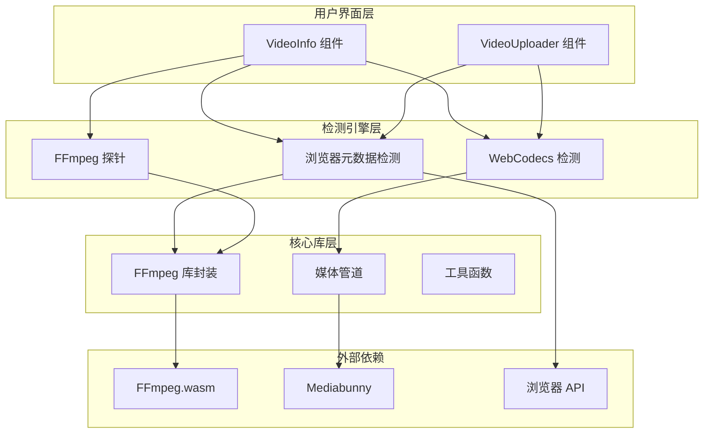
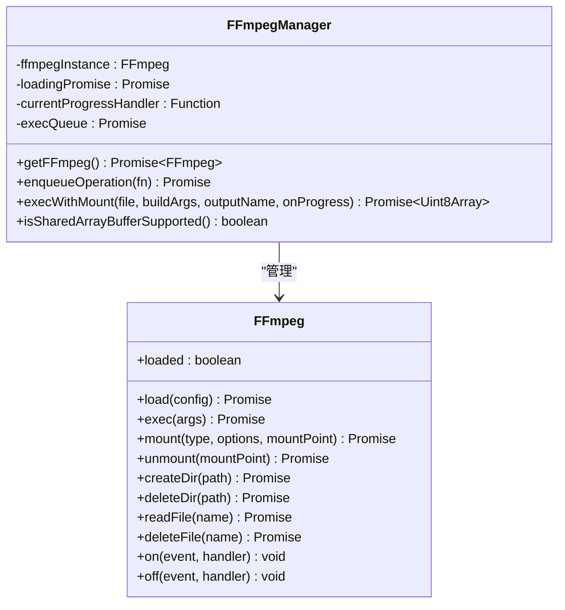
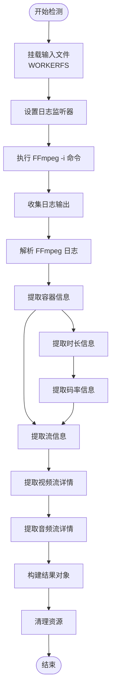
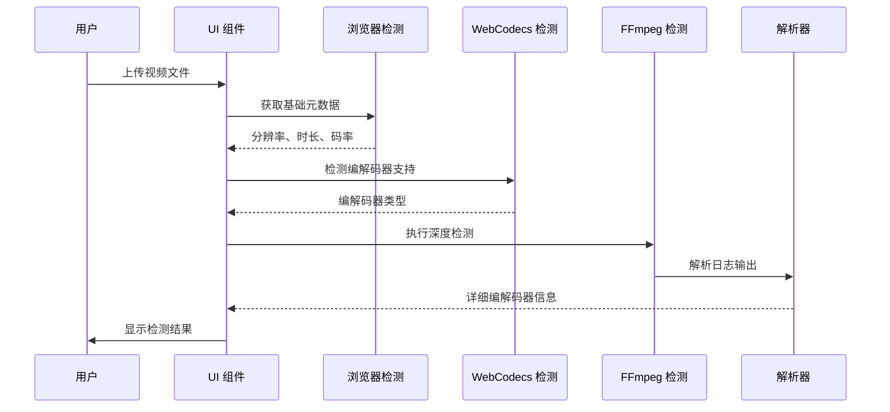
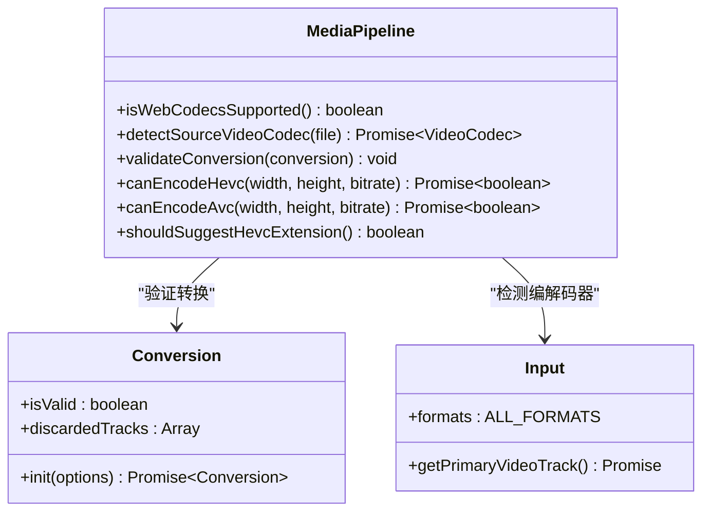
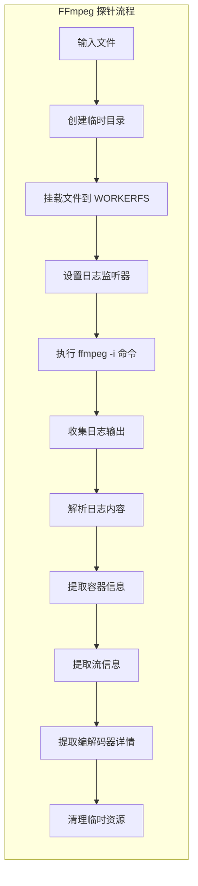
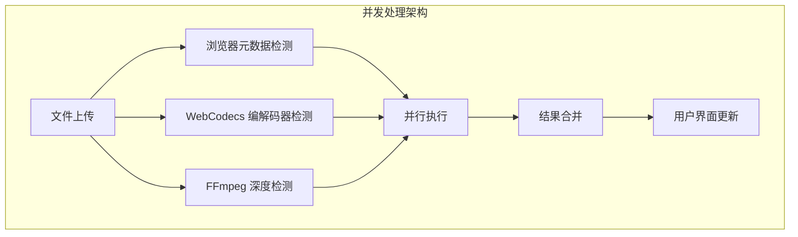

# 视频编解码器检测

<cite>
**本文档引用的文件**
- [ffmpeg.ts](file://src/lib/ffmpeg.ts)
- [logic.ts](file://src/tools/video/info/logic.ts)
- [VideoInfo.tsx](file://src/tools/video/info/VideoInfo.tsx)
- [VideoUploader.tsx](file://src/components/shared/VideoUploader.tsx)
- [media-pipeline.ts](file://src/lib/media-pipeline.ts)
- [tools-video.json](file://messages/zh-Hans/tools-video.json)
- [package.json](file://package.json)
</cite>

## 目录
1. [简介](#简介)
2. [项目架构概览](#项目架构概览)
3. [核心组件分析](#核心组件分析)
4. [编解码器检测机制](#编解码器检测机制)
5. [技术实现细节](#技术实现细节)
6. [性能优化策略](#性能优化策略)
7. [错误处理与故障排除](#错误处理与故障排除)
8. [总结](#总结)

## 简介

视频编解码器检测是媒体工具箱中的核心功能之一，旨在帮助用户了解视频文件的技术规格和编解码器信息。该系统提供了多层次的检测能力，包括浏览器原生元数据检测和基于FFmpeg的深度分析，能够准确识别视频的编解码器类型、分辨率、帧率、码率等关键信息。

该项目采用现代化的前端架构，结合WebCodecs API和FFmpeg.wasm技术，实现了高性能的视频处理能力。系统支持多种视频格式，并提供了直观的用户界面来展示检测结果。

## 项目架构概览

**图表来源**
- [VideoInfo.tsx:1-308](file://src/tools/video/info/VideoInfo.tsx#L1-L308)
- [VideoUploader.tsx:1-393](file://src/components/shared/VideoUploader.tsx#L1-L393)
- [ffmpeg.ts:1-144](file://src/lib/ffmpeg.ts#L1-L144)
- [media-pipeline.ts:1-175](file://src/lib/media-pipeline.ts#L1-L175)

## 核心组件分析

### FFmpeg 库封装

FFmpeg库封装提供了统一的接口来管理FFmpeg.wasm实例，确保单线程执行和资源管理的最佳实践。

**图表来源**
- [ffmpeg.ts:10-144](file://src/lib/ffmpeg.ts#L10-L144)

### 视频信息检测逻辑

视频信息检测逻辑负责解析FFmpeg的日志输出，提取详细的编解码器信息和媒体属性。

**图表来源**
- [logic.ts:33-71](file://src/tools/video/info/logic.ts#L33-L71)
- [logic.ts:82-140](file://src/tools/video/info/logic.ts#L82-L140)

**章节来源**
- [ffmpeg.ts:1-144](file://src/lib/ffmpeg.ts#L1-L144)
- [logic.ts:1-272](file://src/tools/video/info/logic.ts#L1-L272)

## 编解码器检测机制

### 多层次检测策略

系统采用了多层次的检测策略，确保能够准确识别各种编解码器类型：

**图表来源**
- [VideoInfo.tsx:36-50](file://src/tools/video/info/VideoInfo.tsx#L36-L50)
- [VideoUploader.tsx:98-125](file://src/components/shared/VideoUploader.tsx#L98-L125)

### 编解码器识别能力

系统能够识别多种主流编解码器：

| 编解码器类型 | 支持的编解码器 | 特征识别 |
|------------|--------------|----------|
| 视频编解码器 | H.264, H.265, VP9, AV1, VP8 | 通过解析日志中的编解码器名称 |
| 音频编解码器 | AAC, MP3, Opus, FLAC | 识别音频流的编解码器类型 |
| 像素格式 | yuv420p, yuv420p10le, rgb24, gray8 | 从像素格式信息中提取 |
| 色彩空间 | bt709, bt2020, smpte2084 | 识别色彩标准和转换信息 |

**章节来源**
- [logic.ts:142-224](file://src/tools/video/info/logic.ts#L142-L224)
- [media-pipeline.ts:149-174](file://src/lib/media-pipeline.ts#L149-L174)

## 技术实现细节

### WebCodecs 集成

WebCodecs API提供了硬件加速的视频解码能力，系统通过Mediabunny库集成这一功能：

**图表来源**
- [media-pipeline.ts:7-175](file://src/lib/media-pipeline.ts#L7-L175)

### FFmpeg 探针实现

FFmpeg探针通过执行`ffmpeg -i`命令来获取详细的媒体信息：

**图表来源**
- [logic.ts:33-71](file://src/tools/video/info/logic.ts#L33-L71)

**章节来源**
- [VideoUploader.tsx:131-212](file://src/components/shared/VideoUploader.tsx#L131-L212)
- [logic.ts:28-71](file://src/tools/video/info/logic.ts#L28-L71)

## 性能优化策略

### 内存管理优化

系统采用了多种内存管理策略来优化性能：

1. **WORKERFS 挂载**：避免文件复制到内存中，直接从磁盘读取
2. **Promise 队列**：序列化FFmpeg操作，防止并发冲突
3. **及时清理**：操作完成后立即释放内存资源

### 并发处理策略

**图表来源**
- [VideoInfo.tsx:52-74](file://src/tools/video/info/VideoInfo.tsx#L52-L74)

### 错误恢复机制

系统实现了完善的错误恢复机制：

- **渐进式检测**：即使某一部分检测失败，其他部分仍可正常工作
- **资源清理**：异常情况下确保临时资源被正确清理
- **降级策略**：当WebCodecs不可用时自动回退到FFmpeg

**章节来源**
- [ffmpeg.ts:75-82](file://src/lib/ffmpeg.ts#L75-L82)
- [VideoUploader.tsx:207-211](file://src/components/shared/VideoUploader.tsx#L207-L211)

## 错误处理与故障排除

### 常见问题诊断

| 问题类型 | 可能原因 | 解决方案 |
|---------|---------|---------|
| 编解码器不支持 | 浏览器不支持特定编解码器 | 提示安装HEVC扩展或使用其他格式 |
| 检测失败 | 文件损坏或格式不受支持 | 建议尝试其他视频文件 |
| 性能问题 | 文件过大或设备性能不足 | 建议使用较小的文件或升级设备 |
| 内存不足 | 浏览器内存限制 | 关闭其他标签页释放内存 |

### 故障排除步骤

1. **检查浏览器兼容性**：确认浏览器支持SharedArrayBuffer
2. **验证文件格式**：确保视频文件格式受支持
3. **监控内存使用**：关注浏览器内存使用情况
4. **查看错误日志**：通过开发者工具查看具体错误信息

**章节来源**
- [VideoInfo.tsx:76-82](file://src/tools/video/info/VideoInfo.tsx#L76-L82)
- [VideoUploader.tsx:303-315](file://src/components/shared/VideoUploader.tsx#L303-L315)

## 总结

视频编解码器检测功能展现了现代前端媒体处理技术的先进性。通过结合浏览器原生能力、WebCodecs API和FFmpeg.wasm技术，系统实现了高效、准确的编解码器检测能力。

### 主要优势

1. **多层检测**：结合浏览器元数据、WebCodecs和FFmpeg三种检测方式
2. **性能优化**：采用WORKERFS挂载和内存管理策略
3. **用户体验**：提供直观的检测结果展示和错误提示
4. **兼容性强**：支持多种视频格式和编解码器类型

### 技术特色

- **硬件加速**：利用WebCodecs实现硬件加速的视频解码
- **离线处理**：所有处理都在浏览器本地完成，无需服务器参与
- **资源管理**：完善的内存管理和资源清理机制
- **错误恢复**：健壮的错误处理和恢复机制

该系统为用户提供了一个强大而易用的视频编解码器检测工具，适用于视频处理、格式转换、质量评估等多种应用场景。