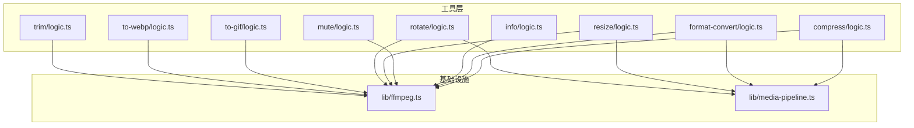
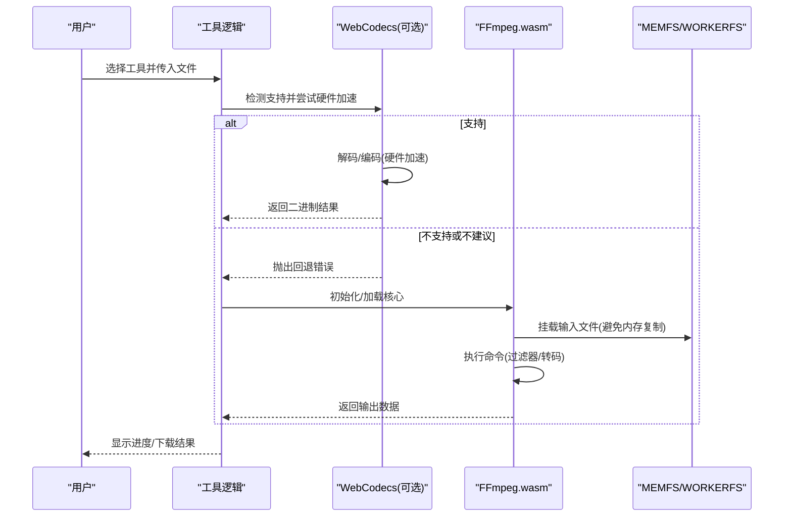
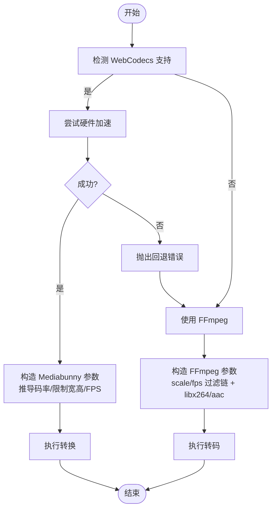
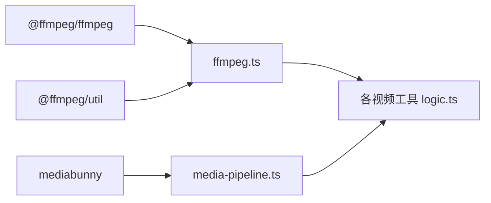

# 视频处理工具

<cite>
**本文引用的文件**
- [README.md](file://README.md)
- [package.json](file://package.json)
- [ffmpeg.ts](file://src/lib/ffmpeg.ts)
- [media-pipeline.ts](file://src/lib/media-pipeline.ts)
- [compress/logic.ts](file://src/tools/video/compress/logic.ts)
- [format-convert/logic.ts](file://src/tools/video/format-convert/logic.ts)
- [info/logic.ts](file://src/tools/video/info/logic.ts)
- [mute/logic.ts](file://src/tools/video/mute/logic.ts)
- [resize/logic.ts](file://src/tools/video/resize/logic.ts)
- [rotate/logic.ts](file://src/tools/video/rotate/logic.ts)
- [to-gif/logic.ts](file://src/tools/video/to-gif/logic.ts)
- [to-webp/logic.ts](file://src/tools/video/to-webp/logic.ts)
- [trim/logic.ts](file://src/tools/video/trim/logic.ts)
</cite>

## 目录
1. [简介](#简介)
2. [项目结构](#项目结构)
3. [核心组件](#核心组件)
4. [架构总览](#架构总览)
5. [详细组件分析](#详细组件分析)
6. [依赖关系分析](#依赖关系分析)
7. [性能考量](#性能考量)
8. [故障排除指南](#故障排除指南)
9. [结论](#结论)
10. [附录](#附录)

## 简介
本文件面向 PrivaDeck 媒体工具箱中的视频处理工具，系统性介绍 8 个视频工具的技术实现与使用方法，涵盖：
- 视频压缩（质量/码率/分辨率/FPS 控制）
- 格式转换（MP4/MKV/AVI）
- 片段裁剪（无重新编码）
- 旋转（90/180/270 度）
- 信息提取（容器、时长、流信息解析）
- 静音处理（移除音频轨）
- 视频转 GIF（带调色板优化）
- 视频转 WebP（帧序列动图）
- 尺寸调整（预设与自定义宽度）

技术基础：基于浏览器端 FFmpeg.wasm 与 WebCodecs（Mediabunny）双通道方案，优先使用硬件加速与原生解码能力，无法满足时回退至 FFmpeg。

## 项目结构
视频工具位于 src/tools/video 下，每个工具由三部分组成：
- index.ts：工具元数据（路由、SEO、相关工具）
- {ToolName}.tsx：客户端 UI 组件
- logic.ts：纯逻辑处理函数（不直接操作 DOM）

图表来源
- [compress/logic.ts:1-257](file://src/tools/video/compress/logic.ts#L1-L257)
- [format-convert/logic.ts:1-134](file://src/tools/video/format-convert/logic.ts#L1-L134)
- [info/logic.ts:1-272](file://src/tools/video/info/logic.ts#L1-L272)
- [mute/logic.ts:1-20](file://src/tools/video/mute/logic.ts#L1-L20)
- [resize/logic.ts:1-117](file://src/tools/video/resize/logic.ts#L1-L117)
- [rotate/logic.ts:1-102](file://src/tools/video/rotate/logic.ts#L1-L102)
- [to-gif/logic.ts:1-57](file://src/tools/video/to-gif/logic.ts#L1-L57)
- [to-webp/logic.ts:1-43](file://src/tools/video/to-webp/logic.ts#L1-L43)
- [trim/logic.ts:1-41](file://src/tools/video/trim/logic.ts#L1-L41)
- [ffmpeg.ts:1-144](file://src/lib/ffmpeg.ts#L1-L144)
- [media-pipeline.ts:1-105](file://src/lib/media-pipeline.ts#L1-L105)

章节来源
- [README.md: 55-78:55-78](file://README.md#L55-L78)
- [package.json: 11-32:11-32](file://package.json#L11-L32)

## 核心组件
- FFmpeg 加载与执行器
  - 单例加载、进度事件绑定、WORKERFS 挂载、内存拷贝避免、串行队列保证单线程安全
  - 提供 execWithMount 与 enqueueOperation 两类入口
- WebCodecs 媒体管线
  - 基于 Mediabunny 的硬件加速路径；严格校验转换结果，对不支持编解码场景抛错并提示回退策略
  - 提供比特率解析、错误类型区分（视频编解码失败 vs 其他轨道问题）

章节来源
- [ffmpeg.ts: 10-144:10-144](file://src/lib/ffmpeg.ts#L10-L144)
- [media-pipeline.ts: 7-105:7-105](file://src/lib/media-pipeline.ts#L7-L105)

## 架构总览
整体采用“WebCodecs 优先 + FFmpeg 回退”的双栈架构，按需选择最优路径以获得最佳性能与兼容性。

图表来源
- [media-pipeline.ts: 7-105:7-105](file://src/lib/media-pipeline.ts#L7-L105)
- [ffmpeg.ts: 99-144:99-144](file://src/lib/ffmpeg.ts#L99-L144)

## 详细组件分析

### 视频压缩（compress）
- 功能要点
  - 支持预设（高质量/中等/低质量）与自定义参数（CRF、预设、分辨率、帧率、音频码率、最大码率）
  - WebCodecs 路径：自动根据 CRF 推导目标视频码率，并应用宽高与帧率限制
  - FFmpeg 路径：通过 scale/fps 过滤链与 libx264 编码，配合 aac 音频
- 关键流程
  - 若 WebCodecs 支持且非不支持的视频编解码，则走硬件加速；否则回退 FFmpeg
  - 对于“视频编解码不可解码”场景，直接抛出不支持错误，避免性能劣化
- 参数映射
  - CRF 到比特率：基于分辨率缩放的经验映射
  - 最大码率：可选上限，避免超支
  - 分辨率/FPS：仅在低于源值时才进行降采样/降帧

图表来源
- [compress/logic.ts: 85-110:85-110](file://src/tools/video/compress/logic.ts#L85-L110)
- [compress/logic.ts: 112-201:112-201](file://src/tools/video/compress/logic.ts#L112-L201)
- [compress/logic.ts: 203-256:203-256](file://src/tools/video/compress/logic.ts#L203-L256)

章节来源
- [compress/logic.ts: 1-L257:1-257](file://src/tools/video/compress/logic.ts#L1-L257)

### 格式转换（format-convert）
- 功能要点
  - 支持输出 MP4、MKV、AVI；MP4/MKV 使用硬件加速转码，AVI 回退 FFmpeg
  - MKV 采用直通复制（不重编码），MP4 重编码为 H.264+AAC
- 错误策略
  - WebCodecs 不支持视频编解码时，直接抛出不支持错误，避免回退导致性能差

章节来源
- [format-convert/logic.ts: 1-L134:1-134](file://src/tools/video/format-convert/logic.ts#L1-L134)

### 信息提取（info）
- 功能要点
  - 通过 FFmpeg 日志解析容器、时长、总码率、各轨道（视频/音频/字幕/数据）的编解码器、分辨率、帧率、采样率、声道、色彩空间、扫描类型等
  - 生成关键帧时间点的缩略图（基于浏览器 <video>+<canvas>，无需 FFmpeg）
- 解析规则
  - 容器/时长/总码率：从输入行匹配
  - 流信息：按类型抽取编解码器、像素格式、分辨率、帧率、比特率、采样率、声道、颜色空间、扫描类型等

章节来源
- [info/logic.ts: 1-L272:1-272](file://src/tools/video/info/logic.ts#L1-L272)

### 静音处理（mute）
- 功能要点
  - 丢弃音频轨道，视频保持原样复制，维持容器兼容性
- 实现方式
  - FFmpeg 路径：禁用音频轨道并复制视频

章节来源
- [mute/logic.ts: 1-L20:1-20](file://src/tools/video/mute/logic.ts#L1-L20)

### 尺寸调整（resize）
- 功能要点
  - 预设：720p/480p/360p；自定义宽度（自动取偶数）
  - WebCodecs：按目标宽度等比缩放，硬件加速
  - FFmpeg：使用 scale 过滤链，输出 MP4

章节来源
- [resize/logic.ts: 1-L117:1-117](file://src/tools/video/resize/logic.ts#L1-L117)

### 旋转（rotate）
- 功能要点
  - 支持 90/180/270 度旋转
  - WebCodecs：设置旋转角度并禁止写入旋转元数据
  - FFmpeg：使用 transpose 过滤链，复制音频

章节来源
- [rotate/logic.ts: 1-L102:1-102](file://src/tools/video/rotate/logic.ts#L1-L102)

### 片段裁剪（trim）
- 功能要点
  - 输入定位（-ss）+ 指定时长（-t）实现快速裁剪
  - 采用全拷贝模式，避免重编码，保持质量与速度
- 时间格式
  - 内部使用 HH:mm:ss.SSS 表达，同时提供分钟:秒显示格式

章节来源
- [trim/logic.ts: 1-L41:1-41](file://src/tools/video/trim/logic.ts#L1-L41)

### 视频转 GIF（to-gif）
- 功能要点
  - 支持起止时间、帧率、宽度、质量（小/平衡/高）
  - 采用调色板生成与使用（palettegen/paletteuse）提升体积与质量
- 实现细节
  - 先快进到起始时间再读取，减少无效解码
  - 使用 split + palettegen + paletteuse 的滤镜链

章节来源
- [to-gif/logic.ts: 1-L57:1-57](file://src/tools/video/to-gif/logic.ts#L1-L57)

### 视频转 WebP（to-webp）
- 功能要点
  - 支持起止时间、帧率、宽度、质量等级
  - 输出为静止图像（WebP），适合短片段动图
- 实现细节
  - 使用 libwebp 编码，禁用音频，设置循环次数与压缩级别

章节来源
- [to-webp/logic.ts: 1-L43:1-43](file://src/tools/video/to-webp/logic.ts#L1-L43)

## 依赖关系分析
- 外部依赖
  - FFmpeg.wasm：视频解封装、转码、滤镜链执行
  - Mediabunny：WebCodecs 硬件加速路径，替代 FFmpeg 的部分场景
  - @ffmpeg/util：将 CDN 资源转为 Blob URL，便于 wasm 加载
- 内部依赖
  - ffmpeg.ts：统一的 FFmpeg 单例、挂载/卸载、进度回调、串行队列
  - media-pipeline.ts：WebCodecs 能力检测、错误分类、比特率解析

图表来源
- [package.json: 11-32:11-32](file://package.json#L11-L32)
- [ffmpeg.ts: 1-L144:1-144](file://src/lib/ffmpeg.ts#L1-L144)
- [media-pipeline.ts: 1-L105:1-105](file://src/lib/media-pipeline.ts#L1-L105)

章节来源
- [package.json: 11-32:11-32](file://package.json#L11-L32)

## 性能考量
- 硬件加速优先
  - WebCodecs 路径在支持的浏览器上显著降低 CPU 占用与内存峰值
  - 对于不支持的视频编解码（如 H.265/HEVC、VP9、AV1），直接拒绝回退，避免性能灾难
- I/O 优化
  - WORKERFS 挂载避免将文件完整复制到 MEMFS，减少内存压力
  - 执行完成后立即释放 MEMFS 文件，降低峰值占用
- 编码策略
  - CRF 与分辨率联动估算目标码率，避免过度压缩
  - FFmpeg 路径使用合适的预设与缓冲区参数，兼顾速度与稳定性
- 无重编码裁剪
  - 片段裁剪采用全拷贝，避免二次压缩带来的质量损失与耗时

章节来源
- [media-pipeline.ts: 7-105:7-105](file://src/lib/media-pipeline.ts#L7-L105)
- [ffmpeg.ts: 99-144:99-144](file://src/lib/ffmpeg.ts#L99-L144)
- [compress/logic.ts: 68-83:68-83](file://src/tools/video/compress/logic.ts#L68-L83)
- [trim/logic.ts: 12-L20:12-20](file://src/tools/video/trim/logic.ts#L12-L20)

## 故障排除指南
- WebCodecs 不支持或性能不佳
  - 现象：抛出“WebCodecs 不支持”或“视频编解码不可解码”
  - 处理：工具会自动回退到 FFmpeg；若仍报“视频编解码不可解码”，请更换浏览器或等待未来支持
- 进度条异常或卡住
  - 检查是否同时运行多个处理任务；串行队列会顺序执行，避免并发冲突
  - 确认浏览器允许使用 SharedArrayBuffer（跨域隔离要求）
- 输出为空或体积异常
  - 确认输入文件可被正确识别（容器/编解码器）
  - 对于 MKV 导出，确认音频轨是否被正确转码（某些组合可能需要 FFmpeg）
- 旋转/尺寸调整后画面比例异常
  - 确认目标宽高为偶数（WebCodecs 路径会自动取偶）
  - 检查源视频的像素格式与宽高比设置

章节来源
- [media-pipeline.ts: 28-L53:28-53](file://src/lib/media-pipeline.ts#L28-L53)
- [ffmpeg.ts: 41-58:41-58](file://src/lib/ffmpeg.ts#L41-L58)
- [resize/logic.ts: 50-L54:50-54](file://src/tools/video/resize/logic.ts#L50-L54)

## 结论
PrivaDeck 的视频工具通过“WebCodecs 优先 + FFmpeg 回退”的双栈设计，在保证隐私与兼容性的前提下，最大化发挥浏览器端硬件加速能力。针对不同场景（压缩、转码、裁剪、旋转、GIF/WebP、信息提取），工具提供了清晰的参数体系与稳健的错误处理策略，既满足专业需求，也兼顾易用性。

## 附录

### 使用示例与参数调优建议
- 视频压缩
  - 高质量：保留原分辨率与帧率，CRF 适中，音频 192k
  - 低流量：分辨率降至 720p，CRF 偏高，音频 96k，设置最大码率上限
  - 调试：先用“信息提取”查看源分辨率/帧率，再据此设定目标
- 格式转换
  - MP4：通用性强，推荐
  - MKV：无损复制，适合存档
  - AVI：兼容性较差，仅在必要时使用
- 片段裁剪
  - 使用输入定位（-ss）+ 指定时长（-t）实现快速裁剪，避免重编码
- 旋转/尺寸调整
  - 旋转角度建议使用 90/180/270 的整数倍，确保像素对齐
  - 自定义宽度请使用偶数值，避免编码器警告
- GIF/WebP
  - GIF：质量越高体积越大；平衡质量与体积可选择“平衡”
  - WebP：适合短片段动图，质量等级 60–80 通常效果良好

### 关键技术挑战与对策
- 编码优化
  - 采用 CRF 与分辨率联动估算目标码率，避免盲目降低画质
  - 对于高分辨率素材，优先考虑降分辨率而非仅降 CRF
- 质量控制
  - 无重编码裁剪保持原始质量；转码时保留 AAC 音频
  - GIF/WebP 使用调色板技术平衡体积与质量
- 性能考虑
  - 串行队列避免并发冲突；WORKERFS 挂载减少内存拷贝
  - 对不支持的视频编解码直接拒绝回退，避免性能劣化
- 兼容性问题
  - WebCodecs 能力检测与错误分类，明确提示回退策略
  - 对 Windows 上 Chromium 的 HEVC 扩展安装建议进行提示